## 并发标记清除收集器JVM调优

## 一、内存模型


## 二、垃圾回收算法


## 三、垃圾回收器分类

### 3.1 JDK的垃圾回收大家庭

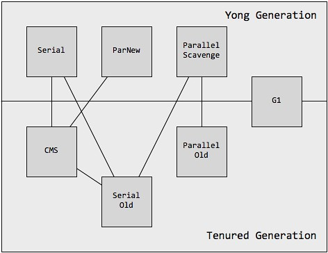

 不同类型垃圾回收器比较

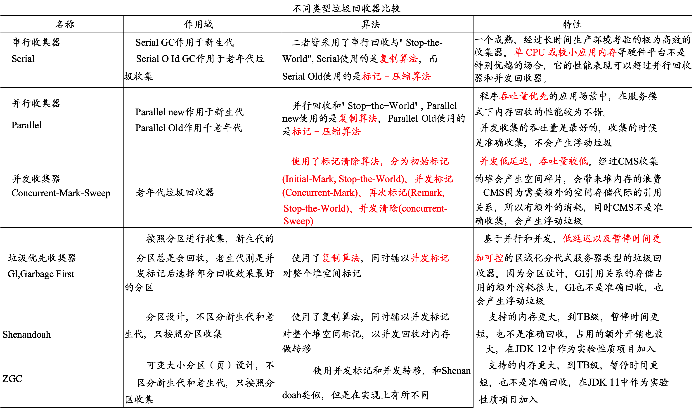


###  3.2 串行收集器Serial

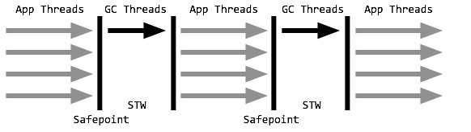


串行收集器采用单线程stop-the-world的方式进行收集。当内存不足时，串行GC设置停顿标识，待所有线程都进入安全点(Safepoint)时，应用线程暂停，串行GC开始工作，采用单线程方式回收空间并整理内存。单线程也意味着复杂度更低、占用内存更少，但同时也意味着不能有效利用多核优势。

#### 使用算法

年轻代：复制算法

老年代：标记-压缩算法

#### 适用场景

串行收集器特别适合堆内存不高、单核甚至双核CPU的场合。

#### 开启选项

>`-XX:+SerialGC`

### 3.3 并行回收Parallel

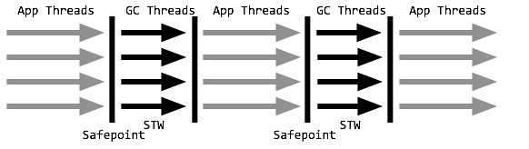

并行收集器是以关注吞吐量为目标的垃圾收集器，也是server模式下的默认收集器配置，对吞吐量的关注主要体现在年轻代Parallel Scavenge收集器上。

年轻代采用复制算法，老年代采用标记-整理，在回收的同时还会对内存进行压缩。关注吞吐量主要指年轻代的Parallel Scavenge收集器，通过两个目标参数-XX:MaxGCPauseMills和-XX:GCTimeRatio，调整新生代空间大小，来降低GC触发的频率。并行收集器适合对吞吐量要求远远高于延迟要求的场景，并且在满足最差延时的情况下，并行收集器将提供最佳的吞吐量。

#### 使用算法

年轻代：复制算法

老年代：标记-整理算法

#### 应用场景

并行收集器适合对吞吐量要求远远高于延迟要求的场景，并且在满足最差延时的情况下，并行收集器将提供最佳的吞吐量。

#### 开启选项

> `-XX:+UseParallelGC`或`-XX:+UseParallelOldGC`(可互相激活)

### 3.4 并发标记回收Concurrent-Mark-Sweep

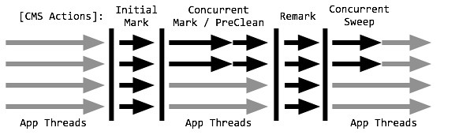

并发标记清除(CMS)是以关注延迟为目标，开启后，年轻代使用STW式的并行收集，老年代回收采用CMS进行垃圾回收，对延迟的关注也主要体现在老年代CMS上。

年轻代ParNew与并行收集器类似，而老年代CMS每个收集周期都要经历：**初始标记、并发标记、重新标记、并发清除**。其中，初始标记以STW的方式标记所有的根对象；并发标记则同应用线程一起并行，标记出根对象的可达路径；在进行垃圾回收前，CMS再以一个STW进行重新标记，标记那些由mutator线程(指引起数据变化的线程，即应用线程)修改而可能错过的可达对象；最后得到的不可达对象将在并发清除阶段进行回收。值得注意的是，初始标记和重新标记都已优化为多线程执行。CMS非常适合堆内存大、CPU核数多的服务器端应用，也是G1出现之前大型应用的首选收集器。

#### 使用算法

年轻代：复制算法

老年代：标记-整理算法

- 初始标记：初始标记以STW的方式标记所有的根对象

- 并发标记：同应用线程一起并行，标记出根对象的可达路径

- 重新标记：在进行垃圾回收前，CMS再以一个STW进行重新标记，标记那些由mutator线程(指引起数据变化的线程，即应用线程)修改而可能错过的可达对象

- 并发清除：最后得到的不可达对象将在并发清除阶段进行回收。

值得注意的是，初始标记和重新标记都已优化为多线程执行。CMS非常适合堆内存大、CPU核数多的服务器端应用，也是G1出现之前大型应用的首选收集器。

#### 缺点

1. 由于并发进行，CMS在收集与应用线程会同时会增加对堆内存的占用，也就是说，CMS必须要在老年代堆内存用尽之前完成垃圾回收，否则CMS回收失败时，将触发担保机制，串行老年代收集器将会以STW的方式进行一次GC，从而造成较大停顿时间；
2. 标记清除算法无法整理空间碎片，老年代空间会随着应用时长被逐步耗尽，最后将不得不通过担保机制对堆内存进行压缩。CMS也提供了参数`-XX:CMSFullGCsBeForeCompaction`(默认0，即每次都进行内存整理)来指定多少次CMS收集之后，进行一次压缩的Full GC。

#### 开启选项

> `-XX:+UseConcMarkSweepGC`


### 3.5 垃圾优先回收G1

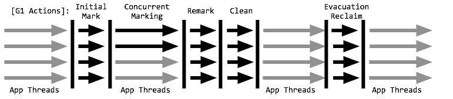

G1 GC，全称Garbage-First Garbage Collector，通过-XX:+UseG1GC参数来启用，作为体验版随着JDK 6u14版本面世，在JDK 7u4版本发行时被正式推出，相信熟悉JVM的同学们都不会对它感到陌生。在JDK 9中，G1被提议设置为默认垃圾收集器（JEP 248）。在官网中，是这样描述G1的：

 > The Garbage-First (G1) collector is a server-style garbage collector, targeted for multi-processor machines with large memories. It meets garbage collection (GC) pause time goals with a high probability, while achieving high throughput. The G1 garbage collector is fully supported in Oracle JDK 7 update 4 and later releases. The G1 collector is designed for applications that:  
>
> * Can operate concurrently with applications threads like the CMS collector.
> * Compact free space without lengthy GC induced pause times. ^
> * Need more predictable GC pause durations. ^
> * Do not want to sacrifice a lot of throughput performance. ^
> * Do not require a much larger Java heap.

从官网的描述中，我们知道G1是一种服务器端的垃圾收集器，应用在多处理器和大容量内存环境中，在实现高吞吐量的同时，尽可能的满足垃圾收集暂停时间的要求。它是专门针对以下应用场景设计的: 
* 像CMS收集器一样，能与应用程序线程并发执行。 
* 整理空闲空间更快。
*  需要GC停顿时间更好预测。 
* 不希望牺牲大量的吞吐性能。 
* 不需要更大的Java Heap。

G1收集器的设计目标是取代CMS收集器，它同CMS相比，在以下方面表现的更出色： 
* G1是一个有整理内存过程的垃圾收集器，不会产生很多内存碎片。 
* G1的Stop The World(STW)更可控，G1在停顿时间上添加了预测机制，用户可以指定期望停顿时间。


#### 开启选项

`-XX:+UseG1GC`


### 3.6 下一代垃圾收集器

#### 3.6.1 Shenandoah

#### 2.6.2 ZGC


## 四、Java8变化

### 4.1 内存空间划分不同

Region
传统的GC收集器将连续的内存空间划分为新生代、老年代和永久代（JDK 8去除了永久代，引入了元空间Metaspace），这种划分的特点是各代的存储地址（逻辑地址，下同）是连续的。如下图所示：传统GC内存布局


传统GC内存布局

而G1的各代存储地址是不连续的，每一代都使用了n个不连续的大小相同的Region，每个Region占有一块连续的虚拟内存地址。如下图所示：g1 GC内存布局


g1 GC内存布局

在上图中，我们注意到还有一些Region标明了H，它代表Humongous，这表示这些Region存储的是巨大对象（humongous object，H-obj），即大小大于等于region一半的对象。H-obj有如下几个特征： * H-obj直接分配到了old gen，防止了反复拷贝移动。 * H-obj在global concurrent marking阶段的cleanup 和 full GC阶段回收。 * 在分配H-obj之前先检查是否超过 initiating heap occupancy percent和the marking threshold, 如果超过的话，就启动global concurrent marking，为的是提早回收，防止 evacuation failures 和 full GC。

为了减少连续H-objs分配对GC的影响，需要把大对象变为普通的对象，建议增大Region size。

一个Region的大小可以通过参数-XX:G1HeapRegionSize设定，取值范围从1M到32M，且是2的指数。如果不设定，那么G1会根据Heap大小自动决定。


### 4.2 G1中的概念


#### 4.2.1 Region

分区（Region）：G1将整个堆划分为同等大小的区块，一个分区可以是年轻代（Eden、Survivor）、也可以是老年代分区；G1是基于一个分区进行垃圾收集的。

#### 4.2.2 Card（卡片）

在每个分区（Region）内部又被分成了若干个大小为512 Byte卡片(Card)，标识堆内存最小可用粒度所有分区的卡片将会记录在全局卡片表(Global Card Table)中，分配的对象会占用物理上连续的若干个卡片，当查找对分区内对象的引用时便可通过记录卡片来查找该引用对象(见RSet)。每次对内存的回收，都是对指定分区的卡片进行处理。

#### 4.2.3 CSet

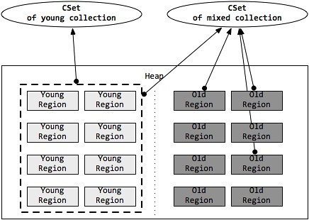

收集集合(CSet)代表每次GC暂停时回收的一系列目标分区。在任意一次收集暂停中，CSet所有分区都会被释放，内部存活的对象都会被转移到分配的空闲分区中。因此无论是年轻代收集，还是混合收集，工作的机制都是一致的。年轻代收集CSet只容纳年轻代分区，而混合收集会通过启发式算法，在老年代候选回收分区中，筛选出回收收益最高的分区添加到CSet中。

候选老年代分区的CSet准入条件，可以通过活跃度阈值`-XX:G1MixedGCLiveThresholdPercent`(默认85%)进行设置，从而拦截那些回收开销巨大的对象；同时，每次混合收集可以包含候选老年代分区，可根据CSet对堆的总大小占比`-XX:G1OldCSetRegionThresholdPercent`(默认10%)设置数量上限。

由上述可知，**G1的收集都是根据CSet进行操作的**，年轻代收集与混合收集没有明显的不同，最大的区别在于两种收集的触发条件。

##### 年轻代收集集合 CSet of Young Collection

应用线程不断活动后，年轻代空间会被逐渐填满。当JVM分配对象到Eden区域失败(Eden区已满)时，便会触发一次STW式的年轻代收集。在年轻代收集中，Eden分区存活的对象将被拷贝到Survivor分区；原有Survivor分区存活的对象，将根据任期阈值(tenuring threshold)分别晋升到PLAB中，新的survivor分区和老年代分区。而原有的年轻代分区将被整体回收掉。

同时，年轻代收集还负责维护对象的年龄(存活次数)，辅助判断老化(tenuring)对象晋升的时候是到Survivor分区还是到老年代分区。年轻代收集首先先将晋升对象尺寸总和、对象年龄信息维护到年龄表中，再根据年龄表、Survivor尺寸、Survivor填充容量`-XX:TargetSurvivorRatio`(默认50%)、最大任期阈值`-XX:MaxTenuringThreshold`(默认15)，计算出一个恰当的任期阈值，凡是超过任期阈值的对象都会被晋升到老年代。

##### 混合收集集合 CSet of Mixed Collection

年轻代收集不断活动后，老年代的空间也会被逐渐填充。当老年代占用空间超过整堆比IHOP阈值`-XX:InitiatingHeapOccupancyPercent`(默认45%)时，G1就会启动一次混合垃圾收集周期。为了满足暂停目标，G1可能不能一口气将所有的候选分区收集掉，因此G1可能会产生连续多次的混合收集与应用线程交替执行，每次STW的混合收集与年轻代收集过程相类似。

为了确定包含到年轻代收集集合CSet的老年代分区，JVM通过参数混合周期的最大总次数`-XX:G1MixedGCCountTarget`(默认8)、堆废物百分比`-XX:G1HeapWastePercent`(默认5%)。通过候选老年代分区总数与混合周期最大总次数，确定每次包含到CSet的最小分区数量；根据堆废物百分比，当收集达到参数时，不再启动新的混合收集。而每次添加到CSet的分区，则通过计算得到的GC效率进行安排。

#### 4.2.4 RSet(RememberedSet)

新生代 gc （它发生得非常频繁）。一般来说， gc 过程是这样的：首先枚举根节点。根节点有可能在新生代中，也有可能在老年代中。这里由于我们只想收集新生代（换句话说，不想收集老年代），所以没有必要对位于老年代的 GC Roots 做全面的可达性分析。

“老年代对象引用新生代对象”这种关系，会在引用关系发生时，在新生代边上专门开辟一块空间记录下来，这就是 RememberedSet 。所以“新生代的 GC Roots ” + “ RememberedSet 存储的内容”，才是新生代收集时真正的 GC Roots 。然后就可以以此为据，在新生代上做可达性分析，进行垃圾回收。


#### 4.2.5 Per Region Table (PRT)

RSet在内部使用Per Region Table(PRT)记录分区的引用情况。由于RSet的记录要占用分区的空间，如果一个分区非常"受欢迎"，那么RSet占用的空间会上升，从而降低分区的可用空间。G1应对这个问题采用了改变RSet的密度的方式，在PRT中将会以三种模式记录引用：

- 稀少：直接记录引用对象的卡片索引

- 细粒度：记录引用对象的分区索引

- 粗粒度：只记录引用情况，每个分区对应一个比特位


由上可知，粗粒度的PRT只是记录了引用数量，需要通过整堆扫描才能找出所有引用，因此扫描速度也是最慢的。


#### 4.2.6 OopMap

OopMap 记录了栈上本地变量到堆上对象的引用关系。其作用是：垃圾收集时，收集线程会对栈上的内存进行扫描，看看哪些位置存储了 Reference 类型。如果发现某个位置确实存的是 Reference 类型，就意味着它所引用的对象这一次不能被回收。但问题是，栈上的本地变量表里面只有一部分数据是 Reference 类型的（它们是我们所需要的），那些非 Reference 类型的数据对我们而言毫无用处，但我们还是不得不对整个栈全部扫描一遍，这是对时间和资源的一种浪费。

一个很自然的想法是，能不能用空间换时间，在某个时候把栈上代表引用的位置全部记录下来，这样到真正 gc 的时候就可以直接读取，而不用再一点一点的扫描了。事实上，大部分主流的虚拟机也正是这么做的，比如 HotSpot ，它使用一种叫做 OopMap 的数据结构来记录这类信息。

我们知道，一个线程意味着一个栈，一个栈由多个栈帧组成，一个栈帧对应着一个方法，一个方法里面可能有多个安全点。 gc 发生时，程序首先运行到最近的一个安全点停下来，然后更新自己的 OopMap ，记下栈上哪些位置代表着引用。枚举根节点时，递归遍历每个栈帧的 OopMap ，通过栈中记录的被引用对象的内存地址，即可找到这些对象（ GC Roots ）。

通过上面的解释，我们可以很清楚的看到使用 OopMap 可以避免全栈扫描，加快枚举根节点的速度。但这并不是它的全部用意。它的另外一个更根本的作用是，可以帮助 HotSpot 实现准确式 GC （个人感觉这才是 OopMap 被设计出来的根本原因，提高 GC Roots Enumeration 速度更像是一个“意外的惊喜”）。


#### 4.2.7 TLAB

TLAB的全称是Thread Local Allocation Buffer，即线程本地分配缓存区，这是一个线程专用的内存分配区域。

在线程初始化时，同时也会申请一块指定大小的内存，只给当前线程使用，这样每个线程都单独拥有一个空间，如果需要分配内存，就在自己的空间上分配，这样就不存在竞争的情况，可以大大提升分配效率。

TLAB空间的内存非常小，缺省情况下仅占有整个Eden空间的1%，也可以通过选项-XX:TLABWasteTargetPercent设置TLAB空间所占用Eden空间的百分比大小。


#### 4.2.8 LAB(Local allocation buffer )

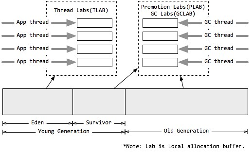

本地分配缓冲 Local allocation buffer (Lab)

值得注意的是，由于分区的思想，每个线程均可以”认领”某个分区用于线程本地的内存分配，而不需要顾及分区是否连续。因此，每个应用线程和GC线程都会独立的使用分区，进而减少同步时间，提升GC效率，这个分区称为本地分配缓冲区(Lab)。

其中，应用线程可以独占一个本地缓冲区(TLAB)来创建的对象，而大部分都会落入Eden区域(巨型对象或分配失败除外)，因此TLAB的分区属于Eden空间；而每次垃圾收集时，每个GC线程同样可以独占一个本地缓冲区(GCLAB)用来转移对象，每次回收会将对象复制到Suvivor空间或老年代空间；对于从Eden/Survivor空间晋升(Promotion)到Survivor/老年代空间的对象，同样有GC独占的本地缓冲区进行操作，该部分称为晋升本地缓冲区(PLAB)。


#### 4.2.9 mutator线程

在垃圾收集器的术语中被称为Java应用线程

1. 轻代收集（young gc）：CSet里全部都是年轻代分区的收集
2. 混合收集（mixed gc）：CSet里包括年轻代分区和一部分老年代分区的收集
3. 混合收集周期：混合收集可能不止一个，多个混合收集连续发生就组合成一个混合收集周期；
4. G1中的垃圾收集过程：年轻代收集和混合收集交替进行，背后有全局的并发标记周期在进行。当老年代分区占用的空间达到或超过IHOP值，就会触发并发标记周期。
5. CMS并发标记4个过程

- 初始标记（STW）：标记处根集合可直达的对象；
- 并发标记：递归扫描整个堆里的对象图，包括SATB中写栅栏记录的引用；
- 重新标记（STW）：处理所有剩下的SATB日志缓冲区和所有更新，也会在这里处理弱引用；
- 清除（STW）：识别所有空闲分区、整理堆分区，为混合收集识别出高效的老年代分区；RSet梳理


### 4.3 G1的活动周期

G1垃圾收集活动汇总

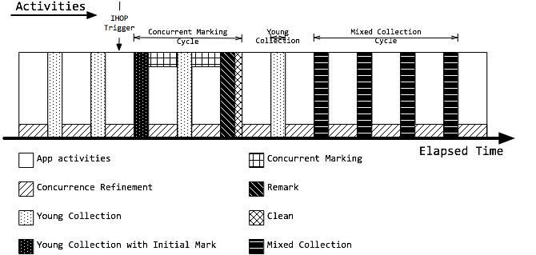


#### 4.3.1 Rset的维护

由于不能整堆扫描，又需要计算分区确切的活跃度，因此，G1需要一个增量式的完全标记并发算法，通过维护RSet，得到准确的分区引用信息。在G1中，RSet的维护主要来源两个方面：写栅栏(Write Barrier)和并发优化线程(Concurrence Refinement Threads)

##### Write Barrier(写栅栏)


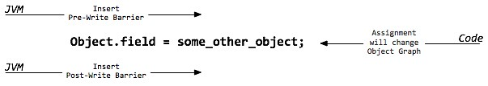

栅栏 Barrier

我们首先介绍一下栅栏(Barrier)的概念。栅栏是指在原生代码片段中，当某些语句被执行时，栅栏代码也会被执行。而G1主要在赋值语句中，使用写前栅栏(Pre-Write Barrrier)和写后栅栏(Post-Write Barrrier)。事实上，写栅栏的指令序列开销非常昂贵，应用吞吐量也会根据栅栏复杂度而降低。

写前栅栏 Pre-Write Barrrier

即将执行一段赋值语句时，等式左侧对象将修改引用到另一个对象，那么等式左侧对象原先引用的对象所在分区将因此丧失一个引用，那么JVM就需要在赋值语句生效之前，记录丧失引用的对象。JVM并不会立即维护RSet，而是通过批量处理，在将来RSet更新(见SATB)。

写后栅栏 Post-Write Barrrier

当执行一段赋值语句后，等式右侧对象获取了左侧对象的引用，那么等式右侧对象所在分区的RSet也应该得到更新。同样为了降低开销，写后栅栏发生后，RSet也不会立即更新，同样只是记录此次更新日志，在将来批量处理(见Concurrence Refinement Threads)。

##### Snapshot at the beginning (SATB 起始快照算法)

起始快照算法 Snapshot at the beginning (SATB)

Taiichi Tuasa贡献的增量式完全并发标记算法起始快照算法(SATB)，主要针对标记-清除垃圾收集器的并发标记阶段，非常适合G1的分区块的堆结构，同时解决了CMS的主要烦恼：重新标记暂停时间长带来的潜在风险。

SATB会创建一个对象图，相当于堆的逻辑快照，从而确保并发标记阶段所有的垃圾对象都能通过快照被鉴别出来。当赋值语句发生时，应用将会改变了它的对象图，那么JVM需要记录被覆盖的对象。因此写前栅栏会在引用变更前，将值记录在SATB日志或缓冲区中。每个线程都会独占一个SATB缓冲区，初始有256条记录空间。当空间用尽时，线程会分配新的SATB缓冲区继续使用，而原有的缓冲去则加入全局列表中。最终在并发标记阶段，并发标记线程(Concurrent Marking Threads)在标记的同时，还会定期检查和处理全局缓冲区列表的记录，然后根据标记位图分片的标记位，扫描引用字段来更新RSet。此过程又称为并发标记/SATB写前栅栏。


##### Concurrence Refinement Threads

并发优化线程 Concurrence Refinement Threads

G1中使用基于Urs Hölzle的快速写栅栏，将栅栏开销缩减到2个额外的指令。栅栏将会更新一个card table type的结构来跟踪代间引用。

当赋值语句发生后，写后栅栏会先通过G1的过滤技术判断是否是跨分区的引用更新，并将跨分区更新对象的卡片加入缓冲区序列，即更新日志缓冲区或脏卡片队列。与SATB类似，一旦日志缓冲区用尽，则分配一个新的日志缓冲区，并将原来的缓冲区加入全局列表中。

并发优化线程(Concurrence Refinement Threads)，只专注扫描日志缓冲区记录的卡片来维护更新RSet，线程最大数目可通过`-XX:G1ConcRefinementThreads`(默认等于`-XX:ParellelGCThreads`)设置。并发优化线程永远是活跃的，一旦发现全局列表有记录存在，就开始并发处理。如果记录增长很快或者来不及处理，那么通过阈值`-X:G1ConcRefinementGreenZone`/`-XX:G1ConcRefinementYellowZone`/`-XX:G1ConcRefinementRedZone`，G1会用分层的方式调度，使更多的线程处理全局列表。如果并发优化线程也不能跟上缓冲区数量，则Mutator线程(Java应用线程)会挂起应用并被加进来帮助处理，直到全部处理完。因此，必须避免此类场景出现。


#### 4.3.2 Concurrent Marking Cycle （并发标记周期）

并发标记周期 Concurrent Marking Cycle

并发标记周期是G1中非常重要的阶段，这个阶段将会为混合收集周期识别垃圾最多的老年代分区。整个周期完成根标记、识别所有(可能)存活对象，并计算每个分区的活跃度，从而确定GC效率等级。

当达到IHOP阈值`-XX:InitiatingHeapOccupancyPercent`(老年代占整堆比，默认45%)时，便会触发并发标记周期。整个并发标记周期将由初始标记(Initial Mark)、根分区扫描(Root Region Scanning)、并发标记(Concurrent Marking)、重新标记(Remark)、清除(Cleanup)几个阶段组成。其中，初始标记(随年轻代收集一起活动)、重新标记、清除是STW的，而并发标记如果来不及标记存活对象，则可能在并发标记过程中，G1又触发了几次年轻代收集。


##### 并发标记线程 Concurrent Marking Threads

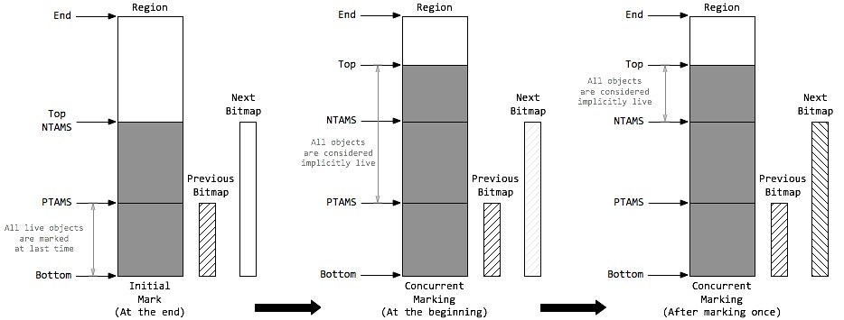

要标记存活的对象，每个分区都需要创建位图(Bitmap)信息来存储标记数据，来确定标记周期内被分配的对象。G1采用了两个位图Previous Bitmap、Next Bitmap，来存储标记数据，Previous位图存储上次的标记数据，Next位图在标记周期内不断变化更新，同时Previous位图的标记数据也越来越过时，当标记周期结束后Next位图便替换Previous位图，成为上次标记的位图。同时，每个分区通过顶部开始标记(TAMS top-at-mark-start)，来记录已标记过的内存范围。同样的，G1使用了两个顶部开始标记Previous TAMS(PTAMS)、Next TAMS(NTAMS)，记录已标记的范围。

在并发标记阶段，G1会根据参数`-XX:ConcGCThreads`(默认GC线程数的1/4，即`-XX:ParallelGCThreads`/4)，分配并发标记线程(Concurrent Marking Threads)，进行标记活动。每个并发线程一次只扫描一个分区，并通过”手指”指针的方式优化获取分区。并发标记线程是爆发式的，在给定的时间段拼命干活，然后休息一段时间，再拼命干活。

每个并发标记周期，在初始标记STW的最后，G1会分配一个空的Next位图和一个指向分区顶部(Top)的NTAMS标记。Previous位图记录的上次标记数据，上次的标记位置，即PTAMS，在PTAMS与分区底部(Bottom)的范围内，所有的存活对象都已被标记。那么，在PTAMS与Top之间的对象都将是隐式存活(Implicitly Live)对象。在并发标记阶段，Next位图吸收了Previous位图的标记数据，同时每个分区都会有新的对象分配，则Top与NTAMS分离，前往更高的地址空间。在并发标记的一次标记中，并发标记线程将找出NTAMS与PTAMS之间的所有存活对象，将标记数据存储在Next位图中。同时，在NTAMS与Top之间的对象即成为已标记对象。如此不断地更新Next位图信息，并在清除阶段与Previous位图交换角色。

##### 初始标记 Initial Mark

初始标记(Initial Mark)负责标记所有能被直接可达的根对象(原生栈对象、全局对象、JNI对象)，根是对象图的起点，因此初始标记需要将Mutator线程(Java应用线程)暂停掉，也就是需要一个STW的时间段。事实上，当达到IHOP阈值时，G1并不会立即发起并发标记周期，而是等待下一次年轻代收集，利用年轻代收集的STW时间段，完成初始标记，这种方式称为借道(Piggybacking)。在初始标记暂停中，分区的NTAMS都被设置到分区顶部Top，初始标记是并发执行，直到所有的分区处理完。

##### 根分区扫描 Root Region Scanning

在初始标记暂停结束后，年轻代收集也完成的对象复制到Survivor的工作，应用线程开始活跃起来。此时为了保证标记算法的正确性，所有新复制到Survivor分区的对象，都需要被扫描并标记成根，这个过程称为根分区扫描(Root Region Scanning)，同时扫描的Suvivor分区也被称为根分区(Root Region)。根分区扫描必须在下一次年轻代垃圾收集启动前完成(并发标记的过程中，可能会被若干次年轻代垃圾收集打断)，因为每次GC会产生新的存活对象集合。

##### 并发标记 Concurrent Marking

和应用线程并发执行，并发标记线程在并发标记阶段启动，由参数`-XX:ConcGCThreads`(默认GC线程数的1/4，即`-XX:ParallelGCThreads`/4)控制启动数量，每个线程每次只扫描一个分区，从而标记出存活对象图。在这一阶段会处理Previous/Next标记位图，扫描标记对象的引用字段。同时，并发标记线程还会定期检查和处理STAB全局缓冲区列表的记录，更新对象引用信息。参数`-XX:+ClassUnloadingWithConcurrentMark`会开启一个优化，如果一个类不可达(不是对象不可达)，则在重新标记阶段，这个类就会被直接卸载。所有的标记任务必须在堆满前就完成扫描，如果并发标记耗时很长，那么有可能在并发标记过程中，又经历了几次年轻代收集。如果堆满前没有完成标记任务，则会触发担保机制，经历一次长时间的串行Full GC。

##### 存活数据计算 Live Data Accounting

存活数据计算(Live Data Accounting)是标记操作的附加产物，只要一个对象被标记，同时会被计算字节数，并计入分区空间。只有NTAMS以下的对象会被标记和计算，在标记周期的最后，Next位图将被清空，等待下次标记周期。

##### 重新标记 Remark

重新标记(Remark)是最后一个标记阶段。在该阶段中，G1需要一个暂停的时间，去处理剩下的SATB日志缓冲区和所有更新，找出所有未被访问的存活对象，同时安全完成存活数据计算。这个阶段也是并行执行的，通过参数`-XX:ParallelGCThread`可设置GC暂停时可用的GC线程数。同时，引用处理也是重新标记阶段的一部分，所有重度使用引用对象(弱引用、软引用、虚引用、最终引用)的应用都会在引用处理上产生开销。

##### 清除 Cleanup

紧挨着重新标记阶段的清除(Clean)阶段也是STW的。Previous/Next标记位图、以及PTAMS/NTAMS，都会在清除阶段交换角色。清除阶段主要执行以下操作：

1. RSet梳理，启发式算法会根据活跃度和RSet尺寸对分区定义不同等级，同时RSet数理也有助于发现无用的引用。参数`-XX:+PrintAdaptiveSizePolicy`可以开启打印启发式算法决策细节；
2. 整理堆分区，为混合收集周期识别回收收益高(基于释放空间和暂停目标)的老年代分区集合；
3. 识别所有空闲分区，即发现无存活对象的分区。该分区可在清除阶段直接回收，无需等待下次收集周期。


### 4.4 年轻代收集/混合收集周期

年轻代收集和混合收集周期，是G1回收空间的主要活动。当应用运行开始时，堆内存可用空间还比较大，只会在年轻代满时，触发年轻代收集；随着老年代内存增长，当到达IHOP阈值`-XX:InitiatingHeapOccupancyPercent`(老年代占整堆比，默认45%)时，G1开始着手准备收集老年代空间。首先经历并发标记周期，识别出高收益的老年代分区，前文已述。但随后G1并不会马上开始一次混合收集，而是让应用线程先运行一段时间，等待触发一次年轻代收集。在这次STW中，G1将保准整理混合收集周期。接着再次让应用线程运行，当接下来的几次年轻代收集时，将会有老年代分区加入到CSet中，即触发混合收集，这些连续多次的混合收集称为混合收集周期(Mixed Collection Cycle)。

#### 4.4.1 GC工作线程数

GC工作线程数 -XX:ParallelGCThreads

JVM可以通过参数`-XX:ParallelGCThreads`进行指定GC工作的线程数量。参数`-XX:ParallelGCThreads`默认值并不是固定的，而是根据当前的CPU资源进行计算。如果用户没有指定，且CPU小于等于8，则默认与CPU核数相等；若CPU大于8，则默认JVM会经过计算得到一个小于CPU核数的线程数；当然也可以人工指定与CPU核数相等。

#### 4.4.2 年轻代收集 Young Collection

每次收集过程中，既有并行执行的活动，也有串行执行的活动，但都可以是多线程的。在并行执行的任务中，如果某个任务过重，会导致其他线程在等待某项任务的处理，需要对这些地方进行优化。

##### 并行活动

外部根分区扫描 Ext Root Scanning：此活动对堆外的根(JVM系统目录、VM数据结构、JNI线程句柄、硬件寄存器、全局变量、线程对栈根)进行扫描，发现那些没有加入到暂停收集集合CSet中的对象。如果系统目录(单根)拥有大量加载的类，最终可能其他并行活动结束后，该活动依然没有结束而带来的等待时间。

更新已记忆集合 Update RS：并发优化线程会对脏卡片的分区进行扫描更新日志缓冲区来更新RSet，但只会处理全局缓冲列表。作为补充，所有被记录但是还没有被优化线程处理的剩余缓冲区，会在该阶段处理，变成已处理缓冲区(Processed Buffers)。为了限制花在更新RSet的时间，可以设置暂停占用百分比`-XX:G1RSetUpdatingPauseTimePercent`(默认10%，即`-XX:MaxGCPauseMills`/10)。值得注意的是，如果更新日志缓冲区更新的任务不降低，单纯地减少RSet的更新时间，会导致暂停中被处理的缓冲区减少，将日志缓冲区更新工作推到并发优化线程上，从而增加对Java应用线程资源的争夺。

RSet扫描 Scan RS：在收集当前CSet之前，考虑到分区外的引用，必须扫描CSet分区的RSet。如果RSet发生粗化，则会增加RSet的扫描时间。开启诊断模式`-XX:UnlockDiagnosticVMOptions`后，通过参数`-XX:+G1SummarizeRSetStats`可以确定并发优化线程是否能够及时处理更新日志缓冲区，并提供更多的信息，来帮助为RSet粗化总数提供窗口。参数`-XX：G1SummarizeRSetStatsPeriod=n`可设置RSet的统计周期，即经历多少此GC后进行一次统计

代码根扫描 Code Root Scanning：对代码根集合进行扫描，扫描JVM编译后代码Native Method的引用信息(nmethod扫描)，进行RSet扫描。事实上，只有CSet分区中的RSet有强代码根时，才会做nmethod扫描，查找对CSet的引用。

转移和回收 Object Copy：通过选定的CSet以及CSet分区完整的引用集，将执行暂停时间的主要部分：CSet分区存活对象的转移、CSet分区空间的回收。通过工作窃取机制来负载均衡地选定复制对象的线程，并且复制和扫描对象被转移的存活对象将拷贝到每个GC线程分配缓冲区GCLAB。G1会通过计算，预测分区复制所花费的时间，从而调整年轻代的尺寸。

终止 Termination：完成上述任务后，如果任务队列已空，则工作线程会发起终止要求。如果还有其他线程继续工作，空闲的线程会通过工作窃取机制尝试帮助其他线程处理。而单独执行根分区扫描的线程，如果任务过重，最终会晚于终止。

GC外部的并行活动 GC Worker Other：该部分并非GC的活动，而是JVM的活动导致占用了GC暂停时间(例如JNI编译)。

##### 串行活动

代码根更新 Code Root Fixup：根据转移对象更新代码根。

代码根清理 Code Root Purge：清理代码根集合表。

清除全局卡片标记 Clear CT：在任意收集周期会扫描CSet与RSet记录的PRT，扫描时会在全局卡片表中进行标记，防止重复扫描。在收集周期的最后将会清除全局卡片表中的已扫描标志。

选择下次收集集合 Choose CSet：该部分主要用于并发标记周期后的年轻代收集、以及混合收集中，在这些收集过程中，由于有老年代候选分区的加入，往往需要对下次收集的范围做出界定；但单纯的年轻代收集中，所有收集的分区都会被收集，不存在选择。

引用处理 Ref Proc：主要针对软引用、弱引用、虚引用、final引用、JNI引用。当Ref Proc占用时间过多时，可选择使用参数`-XX:ParallelRefProcEnabled`激活多线程引用处理。G1希望应用能小心使用软引用，因为软引用会一直占据内存空间直到空间耗尽时被Full GC回收掉；即使未发生Full GC，软引用对内存的占用，也会导致GC次数的增加。

引用排队 Ref Enq：此项活动可能会导致RSet的更新，此时会通过记录日志，将关联的卡片标记为脏卡片。

卡片重新脏化 Redirty Cards：重新脏化卡片。

回收空闲巨型分区 Humongous Reclaim：G1做了一个优化：通过查看所有根对象以及年轻代分区的RSet，如果确定RSet中巨型对象没有任何引用，则说明G1发现了一个不可达的巨型对象，该对象分区会被回收。

释放分区 Free CSet：回收CSet分区的所有空间，并加入到空闲分区中。

其他活动 Other：GC中可能还会经历其他耗时很小的活动，如修复JNI句柄等。

#### 4.2.3 并发标记周期后的年轻代收集 Young Collection Following Concurrent Marking Cycle

当G1发起并发标记周期之后，并不会马上开始混合收集。G1会先等待下一次年轻代收集，然后在该收集阶段中，确定下次混合收集的CSet(Choose CSet)。

#### 4.2.4混合收集周期 Mixed Collection Cycle

单次的混合收集与年轻代收集并无二致。根据暂停目标，老年代的分区可能不能一次暂停收集中被处理完，G1会发起连续多次的混合收集，称为混合收集周期(Mixed Collection Cycle)。G1会计算每次加入到CSet中的分区数量、混合收集进行次数，并且在上次的年轻代收集、以及接下来的混合收集中，G1会确定下次加入CSet的分区集(Choose CSet)，并且确定是否结束混合收集周期。

### 4.5 触发Full GC

转移失败的担保机制 Full GC

转移失败(Evacuation Failure)是指当G1无法在堆空间中申请新的分区时，G1便会触发担保机制，执行一次STW式的、单线程的Full GC。Full GC会对整堆做标记清除和压缩，最后将只包含纯粹的存活对象。参数`-XX:G1ReservePercent`(默认10%)可以保留空间，来应对晋升模式下的异常情况，最大占用整堆50%，更大也无意义。

G1在以下场景中会触发Full GC，同时会在日志中记录to-space-exhausted以及Evacuation Failure：

1. 从年轻代分区拷贝存活对象时，无法找到可用的空闲分区
2. 从老年代分区转移存活对象时，无法找到可用的空闲分区
3. 分配巨型对象时在老年代无法找到足够的连续分区

由于G1的应用场合往往堆内存都比较大，所以Full GC的收集代价非常昂贵，应该避免Full GC的发生。

除以上三条外，以下也会发生Full GC

4. 持久代（Perm）被写满
5. System.gc()被显示调用
6. 上一次GC之后Heap的各域分配策略动态变化

还可手工触发fullGC

7. 使用命令jmap

jmap -histo:live打印每个class的实例数目,内存占用,类全名信息.live子参数加上后,只统计活的对象数量. 此时会触发FullGC

```
jmap -histo:live <pid>
```

或

jmap -dump:live,format=b,file=heap.bin将当前的存活对象dump到文件，此时会触发FullGC

```
jmap -dump:live,file=dump_001.bin PID 
```


### 4.6 G1与前三代收集器不同

1. G1的设计原则是"首先收集尽可能多的垃圾(Garbage First)"。因此，G1并不会等内存耗尽(串行、并行)或者快耗尽(CMS)的时候开始垃圾收集，而是在内部采用了启发式算法，在老年代找出具有高收集收益的分区进行收集。同时G1可以根据用户设置的暂停时间目标自动调整年轻代和总堆大小，暂停目标越短年轻代空间越小、总空间就越大；
2. G1采用内存分区(Region)的思路，将内存划分为一个个相等大小的内存分区，回收时则以分区为单位进行回收，存活的对象复制到另一个空闲分区中。由于都是以相等大小的分区为单位进行操作，因此G1天然就是一种压缩方案(局部压缩)；
3. G1虽然也是分代收集器，但整个内存分区不存在物理上的年轻代与老年代的区别，也不需要完全独立的survivor(to space)堆做复制准备。G1只有逻辑上的分代概念，或者说每个分区都可能随G1的运行在不同代之间前后切换；
4. G1的收集都是STW的，但年轻代和老年代的收集界限比较模糊，采用了混合(mixed)收集的方式。即每次收集既可能只收集年轻代分区(年轻代收集)，也可能在收集年轻代的同时，包含部分老年代分区(混合收集)，这样即使堆内存很大时，也可以限制收集范围，从而降低停顿。


## 五、垃圾回收的触发时机

从年轻代空间（包括 Eden 和 Survivor 区域）回收内存被称为 Minor GC；
对老年代GC称为Major GC；但也有的地方说Major GC 是清理永久代。这些术语无论是在 JVM 规范还是在垃圾收集研究论文中都没有正式的定义。
而Full GC是对整个堆来说的；

在最近几个版本的JDK里默认包括了对永生带即方法区的回收（JDK8中无永生带了），出现Full GC的时候经常伴随至少一次的Minor GC,但非绝对的。Major GC的速度一般会比Minor GC慢10倍以上。

### Minor GC触发条件

当Eden区满时，触发Minor GC。

### Full GC触发条件

1、System.gc()方法的调用
此方法的调用是建议JVM进行Full GC,虽然只是建议而非一定,但很多情况下它会触发 Full GC,从而增加Full GC的频率,也即增加了间歇性停顿的次数。强烈影响系建议能不使用此方法就别使用，让虚拟机自己去管理它的内存，可通过通过-XX:+ DisableExplicitGC来禁止RMI调用System.gc。

2、老年代代空间不足
老年代空间只有在新生代对象转入及创建为大对象、大数组时才会出现不足的现象，当执行Full GC后空间仍然不足，则抛出OOM错误：
java.lang.OutOfMemoryError: Java heap space
为避免以上两种状况引起的Full GC，调优时应尽量做到让对象在Minor GC阶段被回收、让对象在新生代多存活一段时间及不要创建过大的对象及数组。

3、永生区空间不足
JVM规范中运行时数据区域中的方法区，在HotSpot虚拟机中又被习惯称为永生代或者永生区，Permanet Generation中存放的为一些class的信息、常量、静态变量等数据，当系统中要加载的类、反射的类和调用的方法较多时，Permanet Generation可能会被占满，在未配置为采用CMS GC的情况下也会执行Full GC。如果经过Full GC仍然回收不了，那么JVM会抛出如下错误信息：
java.lang.OutOfMemoryError: PermGen space
为避免Perm Gen占满造成Full GC现象，可采用的方法为增大Perm Gen空间或转为使用CMS GC。

4、CMS GC时出现promotion failed和concurrent mode failure
对于采用CMS进行老年代GC的程序而言，尤其要注意GC日志中是否有promotion failed和concurrent mode failure两种状况，当这两种状况出现时可能会触发Full GC。

promotion failed是在进行Minor GC时，survivor space放不下、对象只能放入老年代，而此时老年代也放不下造成的；concurrent mode failure是在执行CMS GC的过程中同时有对象要放入老年代，而此时老年代空间不足造成的（有时候“空间不足”是CMS GC时当前的浮动垃圾过多导致暂时性的空间不足触发Full GC）。

对措施为：增大survivor space、老年代空间或调低触发并发GC的比率，但在JDK 5.0+、6.0+的版本中有可能会由于JDK的bug29导致CMS在remark完毕后很久才触发sweeping动作。对于这种状况，可通过设置-XX: CMSMaxAbortablePrecleanTime=5（单位为ms）来避免。

5、统计得到的Minor GC晋升到老年代的平均大小大于老年代的剩余空间
这是一个较为复杂的触发情况，Hotspot为了避免由于新生代对象晋升到老年代导致老年代空间不足的现象，在进行Minor GC时，做了一个判断，如果之前统计所得到的Minor GC晋升到老年代的平均大小大于老年代的剩余空间，那么就直接触发Full GC。
例如程序第一次触发Minor GC后，有6MB的对象晋升到老年代，那么当下一次Minor GC发生时，首先检查老年代的剩余空间是否大于6MB，如果小于6MB，则执行Full GC。
当新生代采用PS GC时，方式稍有不同，PS GC是在Minor GC后也会检查，例如上面的例子中第一次Minor GC后，PS GC会检查此时老年代的剩余空间是否大于6MB，如小于，则触发对老年代的回收。
除了以上4种状况外，对于使用RMI来进行RPC或管理的Sun JDK应用而言，默认情况下会一小时执行一次Full GC。可通过在启动时通过- java -Dsun.rmi.dgc.client.gcInterval=3600000来设置Full GC执行的间隔时间或通过-XX:+ DisableExplicitGC来禁止RMI调用System.gc。


6、堆中分配很大的对象
所谓大对象，是指需要大量连续内存空间的java对象，例如很长的数组，此种对象会直接进入老年代，而老年代虽然有很大的剩余空间，但是无法找到足够大的连续空间来分配给当前对象，此种情况就会触发JVM进行Full GC。

为了解决这个问题，CMS垃圾收集器提供了一个可配置的参数，即-XX:+UseCMSCompactAtFullCollection开关参数，用于在“享受”完Full GC服务之后额外免费赠送一个碎片整理的过程，内存整理的过程无法并发的，空间碎片问题没有了，但提顿时间不得不变长了，JVM设计者们还提供了另外一个参数 -XX:CMSFullGCsBeforeCompaction,这个参数用于设置在执行多少次不压缩的Full GC后,跟着来一次带压缩的。

7、JVM使用jmap命令
使用命令行jmap手工触发fullGC

```
jmap -histo:live <pid>
```
或者
```
jmap -dump:live,file=dump_001.bin PID 
```


## 五、参数


## 六、评价指标

    1. 吞吐量
       指在应用程序运行周期内，应用程序运行总时间与系统总运行时间的比值。系统总运行时间=应用程序耗时+GC耗时。比如系统运行100分钟，GC耗时1分钟那么系统的吞吐量为99%。
    2. 垃圾回收负载
       与吞吐量相反，即垃圾回收耗时/系统总运行时间。
    3. 停顿时间
       指垃圾回收运行时，应用程序的暂停时间，对于独占回收器而言，停顿时间可能会比较长。使用并发的回收器时，由于垃圾回收器和应用程序交替运行，程序的停顿时间会变短，但是，由于其效率很可能不如独占垃圾回收器，故系统的吞吐量可能会较低。
    4. 垃圾回收频率
       指垃圾回收多长时间执行一次，一边来讲，回收频率越低越好，通常增加堆内存可以有效降低垃圾回收频率，但是此操作可能导致停顿时间增加。
    5. 反应时间
       指当一个对象成为垃圾后，多长时间内会被清理，释放内存。
    6. 堆分配
       不同的垃圾回收器对对内存的分配方式不同，一个良好的垃圾回收器应该有一个合理的堆内存区间划分。

通常情况下，很难让一个应用程序所有指标都达到最优，因此，只能根据自身系统的关注点，选择合理的垃圾回收器和回收策略。

## 七、优化方案

## 八、调优工具


## 九、日志


参考：

[Java Hotspot G1 GC的一些关键技术](https://tech.meituan.com/2016/09/23/g1.html)

[G1的一些概念](https://www.jianshu.com/p/4ced91fa9fbb)

[详解 JVM Garbage First(G1) 垃圾收集器](https://blog.csdn.net/coderlius/article/details/79272773)

[java G1 垃圾收集器解析](https://www.jianshu.com/p/35805f809a21)

[深入理解G1垃圾收集器](https://www.cnblogs.com/draem0507/p/9350699.html)


econnrefused