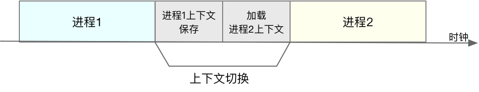

## 一、CPU
### 平均负载

#### 含义

```shell
$ uptime02:34:03 up 2 days, 20:14, 1 user, load average: 0.63, 0.83, 0.88
```

平均负载是指单位时间内，系统处于**可运行状态**和**不可中断状态**的平均进程数，也就是平均活跃进程数，它和 CPU 使用率并没有直接关系。

平均负载是指单位时间内，处于可运行状态和不可中断状态的进程数。所以，它不仅包括了**正在使用 CPU** 的进程，还包括**等待 CPU **和**等待 I/O **的进程。

可运行状态的进程，是指正在使用 CPU 或者正在等待 CPU 的进程，也就是我们常用 ps 命令看到的，处于 R 状态（Running 或 Runnable）的进程。
不可中断状态的进程则是正处于内核态关键流程中的进程，并且这些流程是不可打断的，比如最常见的是等待硬件设备的 I/O 响应，也就是我们在 ps 命令中看到的 D 状态（Uninterruptible Sleep，也称为 Disk Sleep）的进程。

#### 平均负载和使用率的关系

而 CPU 使用率，是单位时间内 CPU 繁忙情况的统计，跟平均负载并不一定完全对应。比如：

 - CPU 密集型进程，使用大量 CPU 会导致平均负载升高，此时这两者是一致的；
 - I/O 密集型进程，等待 I/O 也会导致平均负载升高，但 CPU 使用率不一定很高；
 - 大量等待 CPU 的进程调度也会导致平均负载升高，此时的 CPU 使用率也会比较高。


#### 平均负载举例

平均负载最理想的情况是等于 CPU 个数。所以在评判平均负载时，首先你要知道系统有几个 CPU，这可以通过 top 命令或者从文件 /proc/cpuinfo 中读取，比如：

```shell
# 关于grep和wc的用法请查询它们的手册或者网络搜索$ grep 'model name' /proc/cpuinfo | wc -l
2
```
有了 CPU 个数，我们就可以判断出，当平均负载比 CPU 个数还大的时候，系统已经出现了过载。

如果 1 分钟、5 分钟、15 分钟的三个值基本相同，或者相差不大，那就说明系统负载很平稳。
但如果 1 分钟的值远小于 15 分钟的值，就说明系统最近 1 分钟的负载在减少，而过去 15 分钟内却有很大的负载。
反过来，如果 1 分钟的值远大于 15 分钟的值，就说明最近 1 分钟的负载在增加，这种增加有可能只是临时性的，也有可能还会持续增加下去，所以就需要持续观察。一旦 1 分钟的平均负载接近或超过了 CPU 的个数，就意味着系统正在发生过载的问题，这时就得分析调查是哪里导致的问题，并要想办法优化了。

这里我再举个例子，假设我们在一个单 CPU 系统上看到平均负载为 1.73，0.60，7.98，那么说明在过去 1 分钟内，系统有 73% 的超载，而在 15 分钟内，有 698% 的超载，从整体趋势来看，系统的负载在降低。


#### 工具
stress 是一个 Linux 系统压力测试工具，这里我们用作异常进程模拟平均负载升高的场景。
而 sysstat 包含了常用的 Linux 性能工具，用来监控和分析系统的性能。我们的案例会用到这个包的两个命令 mpstat 和 pidstat。
mpstat 是一个常用的多核 CPU 性能分析工具，用来实时查看每个 CPU 的性能指标，以及所有 CPU 的平均指标。
pidstat 是一个常用的进程性能分析工具，用来实时查看进程的 CPU、内存、I/O 以及上下文切换等性能指标。
iostat

apt install stress sysstat


### CPU上下文

CPU 寄存器，是 CPU 内置的容量小、但速度极快的内存。而程序计数器，则是用来存储 CPU 正在执行的指令位置、或者即将执行的下一条指令位置。它们都是 CPU 在运行任何任务前，必须的依赖环境，因此也被叫做 CPU 上下文。

CPU 上下文切换，就是先把前一个任务的 CPU 上下文（也就是 CPU 寄存器和程序计数器）保存起来，然后加载新任务的上下文到这些寄存器和程序计数器，最后再跳转到程序计数器所指的新位置，运行新任务。

根据任务的不同，**CPU 的上下文切换**就可以分为几个不同的场景，也就是**进程上下文切换、线程上下文切换以及中断上下文切换**。

从用户态到内核态的转变，需要通过系统调用来完成。而系统调用结束后，CPU 寄存器需要恢复原来保存的用户态，然后再切换到用户空间，继续运行进程。所以，一次系统调用的过程，其实是发生了两次 CPU 上下文切换。

需要注意的是，系统调用过程中，并不会涉及到虚拟内存等进程用户态的资源，也不会切换进程。这跟我们通常所说的进程上下文切换是不一样的：

- 进程上下文切换，是指从一个进程切换到另一个进程运行。
- 而系统调用过程中一直是同一个进程在运行。

所以，**系统调用过程通常称为特权模式切换，而不是上下文切换**。但实际上，系统调用过程中，CPU 的上下文切换还是无法避免的。

#### 进程上下文切换跟系统调用区别

进程是由内核来管理和调度的，进程的切换只能发生在内核态。所以，进程的上下文不仅包括了虚拟内存、栈、全局变量等用户空间的资源，还包括了内核堆栈、寄存器等内核空间的状态。

进程的上下文切换就比系统调用时多了一步：在保存当前进程的内核状态和 CPU 寄存器之前，需要先把该进程的虚拟内存、栈等保存下来；而加载了下一进程的内核态后，还需要刷新进程的虚拟内存和用户栈。

如下图所示，保存上下文和恢复上下文的过程并不是“免费”的，需要内核在 CPU 上运行才能完成。




#### 进程在什么时候才会被调度到 CPU 上运行呢？

最容易想到的一个时机，就是进程执行完终止了，它之前使用的 CPU 会释放出来，这个时候再从就绪队列里，拿一个新的进程过来运行。其实还有很多其他场景，也会触发进程调度，在这里我给你逐个梳理下。

1. 其一，为了保证所有进程可以得到公平调度，CPU 时间被划分为一段段的时间片，这些时间片再被轮流分配给各个进程。这样，当某个进程的时间片耗尽了，就会被系统挂起，切换到其它正在等待 CPU 的进程运行。
2. 其二，进程在系统资源不足（比如内存不足）时，要等到资源满足后才可以运行，这个时候进程也会被挂起，并由系统调度其他进程运行。
3. 其三，当进程通过睡眠函数 sleep 这样的方法将自己主动挂起时，自然也会重新调度。
4. 其四，当有优先级更高的进程运行时，为了保证高优先级进程的运行，当前进程会被挂起，由高优先级进程来运行。
5. 最后一个，发生硬件中断时，CPU 上的进程会被中断挂起，转而执行内核中的中断服务程序。


#### 中断上下文切换

为了快速响应硬件的事件，**中断处理会打断进程的正常调度和执行**，转而调用中断处理程序，响应设备事件。

跟进程上下文不同，中断上下文切换并不涉及到进程的用户态。所以，即便中断过程打断了一个正处在用户态的进程，也不需要保存和恢复这个进程的虚拟内存、全局变量等用户态资源。中断上下文，其实只包括内核态中断服务程序执行所必需的状态，包括 CPU 寄存器、内核堆栈、硬件中断参数等。

**对同一个 CPU 来说，中断处理比进程拥有更高的优先级**，所以中断上下文切换并不会与进程上下文切换同时发生。同样道理，由于中断会打断正常进程的调度和执行，所以大部分中断处理程序都短小精悍

#### 上下文切换工具

vmstat

vmstat 只给出了系统总体的上下文切换情况，要想查看每个进程的详细情况，就需要使用我们前面提到过的 pidstat 了。给它加上 -w 选项，你就可以查看每个进程上下文切换的情况了。

在使用`pidstat -w 5`后，有2列内容需要关注：一个是 cswch ，表示每秒自愿上下文切换（voluntary context switches）的次数，另一个则是 nvcswch ，表示每秒非自愿上下文切换（non voluntary context switches）的次数。

它们意味着不同的性能问题：

- 所谓自愿上下文切换，是指进程无法获取所需资源，导致的上下文切换。比如说， I/O、内存等系统资源不足时，就会发生自愿上下文切换。
- 非自愿上下文切换，则是指进程由于时间片已到等原因，被系统强制调度，进而发生的上下文切换。比如说，大量进程都在争抢 CPU 时，就容易发生非自愿上下文切换。

#### 观察中断的变化工具

从 /proc/interrupts 这个只读文件中读取。/proc 实际上是 Linux 的一个虚拟文件系统，用于内核空间与用户空间之间的通信。

```bash
watch -d cat /proc/interrupts
```


#### 每秒上下文切换多少次才算正常呢？

这个数值其实取决于系统本身的 CPU 性能。在我看来，如果系统的上下文切换次数比较稳定，那么从数百到一万以内，都应该算是正常的。但当上下文切换次数超过一万次，或者切换次数出现数量级的增长时，就很可能已经出现了性能问题。

需要根据上下文切换的类型，再做具体分析。比方说：

- 自愿上下文切换变多了，说明进程都在等待资源，有可能发生了 I/O 等其他问题；
- 非自愿上下文切换变多了，说明进程都在被强制调度，也就是都在争抢 CPU，说明 CPU 的确成了瓶颈；
- 中断次数变多了，说明 CPU 被中断处理程序占用，还需要通过查看 /proc/interrupts 文件来分析具体的中断类型。


### CPU使用率

为了计算 CPU 使用率，性能工具一般都会取间隔一段时间（比如 3 秒）的两次值，作差后，再计算出这段时间内的平均 CPU 使用率


**性能分析工具给出的都是间隔一段时间的平均 CPU 使用率，所以要注意间隔时间的设置**，特别是用多个工具对比分析时，你一定要保证它们用的是相同的间隔时间。比如，对比一下 top 和 ps 这两个工具报告的 CPU 使用率，默认的结果很可能不一样，因为 top 默认使用 3 秒时间间隔，而 ps 使用的却是进程的整个生命周期。


pidstat 命令，就间隔 1 秒展示了进程的 5 组 CPU 使用率，包括：

- 用户态 CPU 使用率 （%usr）；
- 内核态 CPU 使用率（%system）；
- 运行虚拟机 CPU 使用率（%guest）；
- 等待 CPU 使用率（%wait）；
- 以及总的 CPU 使用率（%CPU）。


#### CPU 使用率过高怎么办？

通过 top、ps、pidstat 等工具，你能够轻松找到 CPU 使用率较高（比如 100% ）的进程。接下来，你可能又想知道，占用 CPU 的到底是代码里的哪个函数呢？找到它，你才能更高效、更针对性地进行优化。

我猜你第一个想到的，应该是 GDB（The GNU Project Debugger）， 这个功能强大的程序调试利器。的确，GDB 在调试程序错误方面很强大。GDB 并不适合在性能分析的早期应用。因为 GDB 调试程序的过程会中断程序运行，这在线上环境往往是不允许的。所以，GDB 只适合用在性能分析的后期，当你找到了出问题的大致函数后，线下再借助它来进一步调试函数内部的问题。

**推荐是 perf**

第一种常见用法是 perf top，类似于 top，它能够实时显示占用 CPU 时钟最多的函数或者指令，因此可以用来查找热点函数

第二种常见用法，也就是 perf record 和 perf report。 perf top 虽然实时展示了系统的性能信息，但它的缺点是并不保存数据，也就无法用于离线或者后续的分析。而 perf record 则提供了保存数据的功能，保存后的数据，需要你用 perf report 解析展示。

在实际使用中，我们还经常为 perf top 和 perf record 加上 -g 参数，开启调用关系的采样，方便我们根据调用链来分析性能问题。


清楚用户（%user）、Nice（%nice）、系统（%system） 、等待 I/O（%iowait） 、中断（%irq）以及软中断（%softirq）这几种不同 CPU 的使用率。比如说：

- 用户 CPU 和 Nice CPU 高，说明用户态进程占用了较多的 CPU，所以应该着重排查进程的性能问题。
- 系统 CPU 高，说明内核态占用了较多的 CPU，所以应该着重排查内核线程或者系统调用的性能问题。
- I/O 等待 CPU 高，说明等待 I/O 的时间比较长，所以应该着重排查系统存储是不是出现了 I/O 问题。
- 软中断和硬中断高，说明软中断或硬中断的处理程序占用了较多的 CPU，所以应该着重排查内核中的中断服务程序。

碰到 CPU 使用率升高的问题，你可以借助 top、pidstat 等工具，确认引发 CPU 性能问题的来源；再使用 perf 等工具，排查出引起性能问题的具体函数。

#### 怎么查找一个进程的父进程

pstree 就可以用树状形式显示所有进程之间的关系：

```bash
$ pstree | grep stress
        |-docker-containe-+-php-fpm-+-php-fpm---sh---stress
        |         |-3*[php-fpm---sh---stress---stress]
```

**execsnoop 就是一个专为短时进程设计的工具。**它通过 ftrace 实时监控进程的 exec() 行为，并输出短时进程的基本信息，包括进程 PID、父进程 PID、命令行参数以及执行的结果。

#### 碰到常规问题无法解释的 CPU 使用率情况时的排查工具

碰到常规问题无法解释的 CPU 使用率情况时，首先要想到有可能是短时应用导致的问题，比如有可能是下面这两种情况。

- 第一，应用里直接调用了其他二进制程序，这些程序通常运行时间比较短，通过 top 等工具也不容易发现。
- 第二，应用本身在不停地崩溃重启，而启动过程的资源初始化，很可能会占用相当多的 CPU。

对于这类进程，我们可以用 pstree 或者 execsnoop 找到它们的父进程，再从父进程所在的应用入手，排查问题的根源。


#### top列的几种状态

```bash
$ top
  PID USER      PR  NI    VIRT    RES    SHR S  %CPU %MEM     TIME+ COMMAND
28961 root      20   0   43816   3148   4040 R   3.2  0.0   0:00.01 top
  620 root      20   0   37280  33676    908 D   0.3  0.4   0:00.01 app
    1 root      20   0  160072   9416   6752 S   0.0  0.1   0:37.64 systemd
 1896 root      20   0       0      0      0 Z   0.0  0.0   0:00.00 devapp
    2 root      20   0       0      0      0 S   0.0  0.0   0:00.10 kthreadd
    4 root       0 -20       0      0      0 I   0.0  0.0   0:00.00 kworker/0:0H
    6 root       0 -20       0      0      0 I   0.0  0.0   0:00.00 mm_percpu_wq
    7 root      20   0       0      0      0 S   0.0  0.0   0:06.37 ksoftirqd/0
```

- R 是 Running 或 Runnable 的缩写，表示进程在 CPU 的就绪队列中，正在运行或者正在等待运行。
- D 是 Disk Sleep 的缩写，也就是不可中断状态睡眠（Uninterruptible Sleep），一般表示进程正在跟硬件交互，并且交互过程不允许被其他进程或中断打断。
- Z 是 Zombie 的缩写，如果你玩过“植物大战僵尸”这款游戏，应该知道它的意思。它表示僵尸进程，也就是进程实际上已经结束了，但是父进程还没有回收它的资源（比如进程的描述符、PID 等）。
- S 是 Interruptible Sleep 的缩写，也就是可中断状态睡眠，表示进程因为等待某个事件而被系统挂起。当进程等待的事件发生时，它会被唤醒并进入 R 状态。
- I 是 Idle 的缩写，也就是空闲状态，用在不可中断睡眠的内核线程上。前面说了，硬件交互导致的不可中断进程用 D 表示，但对某些内核线程来说，它们有可能实际上并没有任何负载，用 Idle 正是为了区分这种情况。要注意，D 状态的进程会导致平均负载升高， I 状态的进程却不会。
- T 或者 t，也就是 Stopped 或 Traced 的缩写，表示进程处于暂停或者跟踪状态。
- X，也就是 Dead 的缩写，表示进程已经消亡，所以你不会在 top 或者 ps 命令中看到它。


### 不可中断进程和僵尸进程

但如果系统或硬件发生了故障，进程可能会在不可中断状态保持很久，甚至导致系统中出现大量不可中断进程。这时，你就得注意下，**系统是不是出现了 I/O 等性能问题。**

再看僵尸进程，这是多进程应用很容易碰到的问题。正常情况下，当一个进程创建了子进程后，它应该通过系统调用 wait() 或者 waitpid() 等待子进程结束，回收子进程的资源；而子进程在结束时，会向它的父进程发送 SIGCHLD 信号，所以，父进程还可以注册 SIGCHLD 信号的处理函数，异步回收资源。

如果父进程没这么做，或是子进程执行太快，父进程还没来得及处理子进程状态，子进程就已经提前退出，那这时的子进程就会变成僵尸进程。通常，僵尸进程持续的时间都比较短，在父进程回收它的资源后就会消亡；或者在父进程退出后，由 init 进程回收后也会消亡。大量的僵尸进程会用尽 PID 进程号，导致新进程不能创建，所以这种情况一定要避免。

#### 不可中断进程和僵尸进程工具

dstat 是一个新的性能工具，它吸收了 vmstat、iostat、ifstat 等几种工具的优点，可以同时观察系统的 CPU、磁盘 I/O、网络以及内存使用情况。

strace 正是最常用的跟踪进程系统调用的工具。所以，我们从 pidstat 的输出中拿到进程的 PID 号，比如 6082，然后在终端中运行 strace 命令，并用 -p 参数指定 PID 号。

如果strace 命令居然失败了，可以考虑使用ps命令，先检查一下进程的状态是否正常。

perf top

perf record

perf report

pstree命令：找出父进程

```bash
# -a 表示输出命令行选项
# p表PID
# s表示指定进程的父进程
$ pstree -aps 3084
systemd,1
  └─dockerd,15006 -H fd://
      └─docker-containe,15024 --config /var/run/docker/containerd/containerd.toml
          └─docker-containe,3991 -namespace moby -workdir...
              └─app,4009
                  └─(app,3084)
```

#### 小结

虽然这个案例是磁盘 I/O 导致了 iowait 升高，不过，** iowait 高不一定代表 I/O 有性能瓶颈。当系统中只有 I/O 类型的进程在运行时，iowait 也会很高，但实际上，磁盘的读写远没有达到性能瓶颈的程度。**

因此，碰到 iowait 升高时，需要先用 dstat、pidstat 等工具，确认是不是磁盘 I/O 的问题，然后再找是哪些进程导致了 I/O。

等待 I/O 的进程一般是不可中断状态，所以用 ps 命令找到的 D 状态（即不可中断状态）的进程，多为可疑进程。但这个案例中，在 I/O 操作后，进程又变成了僵尸进程，所以不能用 strace 直接分析这个进程的系统调用。

这种情况下，我们用了 perf 工具，来分析系统的 CPU 时钟事件，最终发现是直接 I/O 导致的问题。这时，再检查源码中对应位置的问题，就很轻松了。

而僵尸进程的问题相对容易排查，使用 pstree 找出父进程后，去查看父进程的代码，检查 wait() / waitpid() 的调用，或是 SIGCHLD 信号处理函数的注册就行了。

### Linux软中断

中断是系统用来响应硬件设备请求的一种机制，它会打断进程的正常调度和执行，然后调用内核中的中断处理程序来响应设备的请求。

**中断其实是一种异步的事件处理机制，可以提高系统的并发处理能力。**

由于中断处理程序会打断其他进程的运行，所以，**为了减少对正常进程运行调度的影响，中断处理程序就需要尽可能快地运行。**

为了解决中断处理程序执行过长和中断丢失的问题，Linux 将中断处理过程分成了两个阶段，也就是上半部和下半部：

- **上半部用来快速处理中断**，它在中断禁止模式下运行，主要处理跟硬件紧密相关的或时间敏感的工作。步骤：**硬件->CPU->内核中的设备驱动程序**
- **下半部用来延迟处理上半部未完成的工作，通常以内核线程的方式运行。**步骤：**进程 ->内核中的设备驱动程序**

为了满足实时系统的要求，中断处理应该是越快越好。linux为了实现这个特点，当中断发生的时候，硬中断处理那些短时间，就可以完成的工作，而将那些处理事件比较长的工作，放到中断之后来完成，也就是软中断(softirq)来完成。

网卡接收到数据包后，会通过**硬件中断**的方式，通知内核有新的数据到了。这时，内核就应该调用中断处理程序来响应它。

对上半部来说，既然是快速处理，其实就是要把网卡的数据读到内存中，然后更新一下硬件寄存器的状态（表示数据已经读好了），最后再发送一个**软中断**信号，通知下半部做进一步的处理。

#### 硬中断和软中断的区别

1. 软中断是执行中断指令产生的，而硬中断是由外设引发的。
2. 硬中断的中断号是由中断控制器提供的，软中断的中断号由指令直接指出，无需使用中断控制器。
3. 硬中断是可屏蔽的，软中断不可屏蔽。


#### 软硬中断问题解答

 **1. 问：对于软中断，I/O操作是否是由内核中的I/O设备驱动程序完成？**

  答：对于I/O请求，内核会将这项工作分派给合适的内核驱动程序，这个程序会对I/O进行队列化，以可以稍后处理（通常是磁盘I/O），或如果可能可以立即执行它。通常，当对硬中断进行回应的时候，这个队列会被驱动所处理。当一个I/O请求完成的时候，下一个在队列中的I/O请求就会发送到这个设备上。

**2. 问：软中断所经过的操作流程是比硬中断的少吗？换句话说，对于软中断就是：进程 ->内核中的设备驱动程序；对于硬中断：硬件->CPU->内核中的设备驱动程序？**

答：是的，软中断比硬中断少了一个硬件发送信号的步骤。产生软中断的进程一定是当前正在运行的进程，因此它们不会中断CPU。但是它们会中断调用代码的流程。

如果硬件需要CPU去做一些事情，那么这个硬件会使CPU中断当前正在运行的代码。而后CPU会将当前正在运行进程的当前状态放到堆栈（stack）中，以至于之后可以返回继续运行。这种中断可以停止一个正在运行的进程；可以停止正处理另一个中断的内核代码；或者可以停止空闲进程。

#### 查看软中断和内核线程

- /proc/softirqs 提供了软中断的运行情况；
- /proc/interrupts 提供了硬中断的运行情况。

#### 软中断分析工具

- sar 是一个系统活动报告工具，既可以实时查看系统的当前活动，又可以配置保存和报告历史统计数据。
- hping3 是一个可以构造 TCP/IP 协议数据包的工具，可以对系统进行安全审计、防火墙测试等。
- tcpdump 是一个常用的网络抓包工具，常用来分析各种网络问题。

