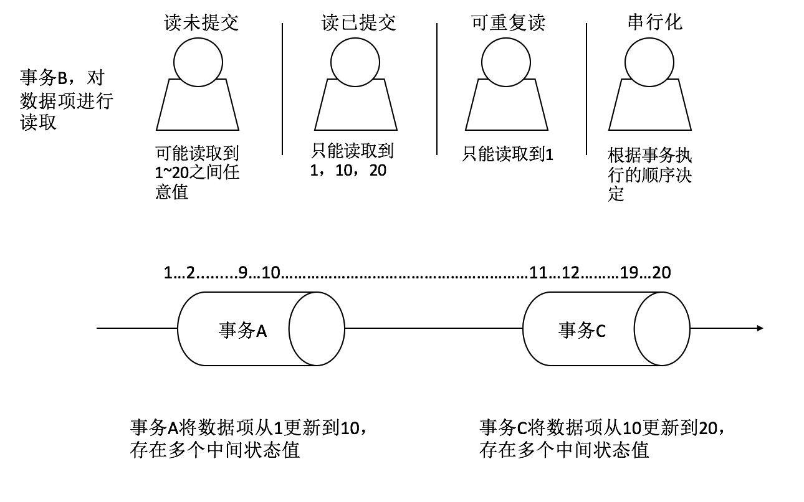
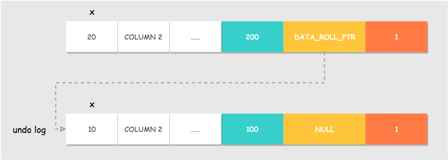
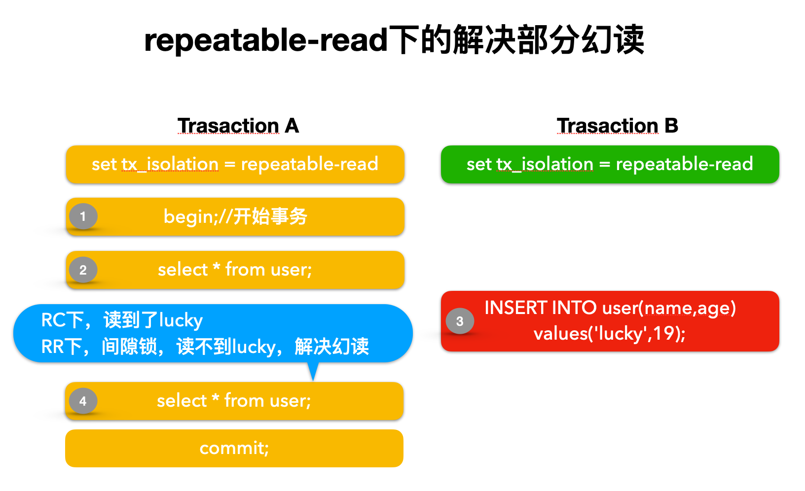
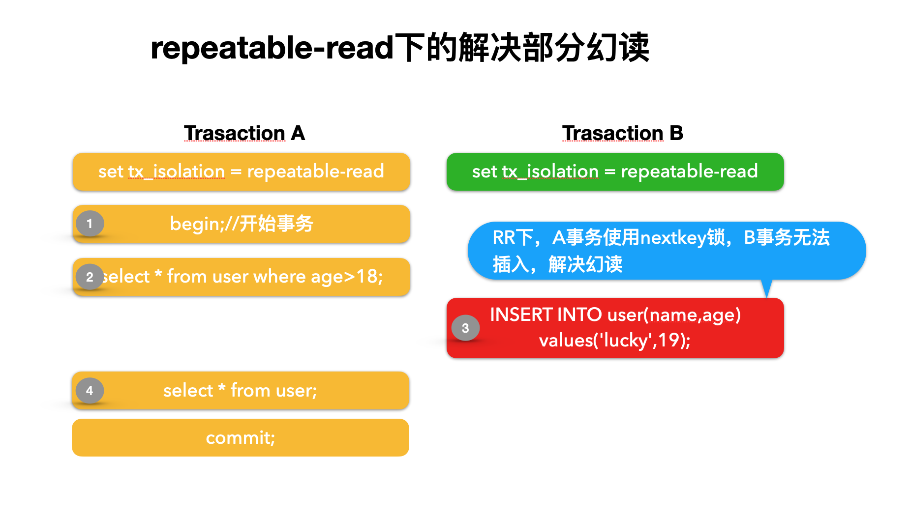
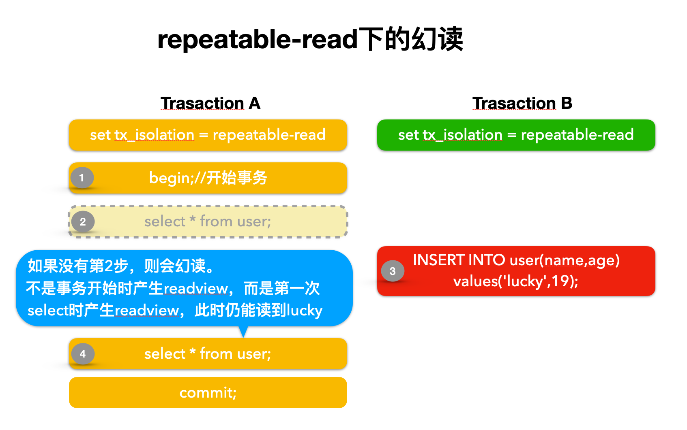
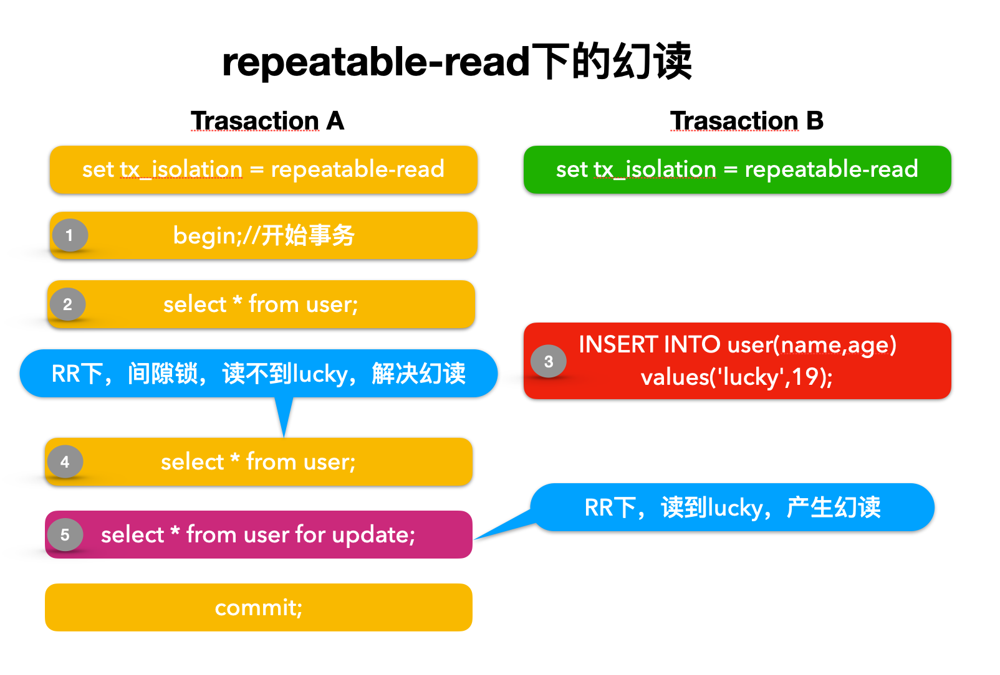
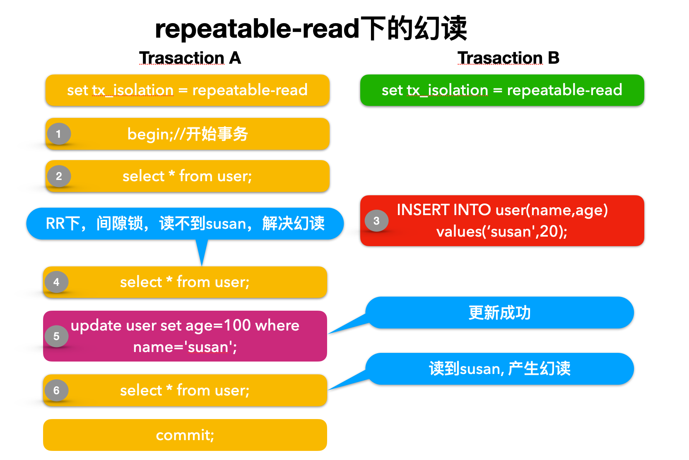

## 一、表设计


### 1. 通俗地理解三个范式

　　通俗地理解三个范式，对于数据库设计大有好处。在数据库设计中，为了更好地应用三个范式，就必须通俗地理解三个范式(通俗地理解是够用的理解，并不是最科学最准确的理解)：

　　第一范式：1NF是对属性的原子性约束，要求属性具有原子性，不可再分解;

　　第二范式：2NF是对记录的惟一性约束，要求记录有惟一标识，即实体的惟一性;

　　第三范式：3NF是对字段冗余性的约束，即任何字段不能由其他字段派生出来，它要求字段没有冗余。没有冗余的数据库设计可以做到。但是，没有冗余的数据库未必是最好的数据库，有时为了提高运行效率，就必须降低范式标准，适当保留冗余数据。具体做法是：在概念数据模型设计时遵守第三范式，降低范式标准的工作放到物理数据模型设计时考虑。降低范式就是增加字段，允许冗余。

## 二、索引

索引也不是“银弹”，它会让写入数据的效率下降。因为在数据写入过程，会涉及索引的更新，这是索引导致写入变慢的主要原因。正是因为要时刻保证 B+ 树索引是一个 m 叉树，所有，索引的存在会导致数据库写入的速度降低。实际上，删除数据也会变慢。

若索引太多，应用程序的性能可能会受到影响。而索引太少，对查询性能又会产生影响，要找到一个平衡点，这对应用程序的性能至关重要。

### 2.1 索引数据结构

#### B+树的特点

1/每个节点中子节点的个数不能超过 m，也不能小于 m/2；
2/根节点的子节点个数可以不超过 m/2，这是一个例外；
3/m 叉树只存储索引，并不真正存储数据，这个有点儿类似跳表；
4/通过链表将叶子节点串联在一起，这样可以方便的按区间查找；
5/一般情况，根节点会被存储在内存中，其他节点存储在磁盘中。
除了 B+ 树，你可能还听过 B树、B-树。实际上B-树就是B树，其英文翻译都是 B-Tree，这里的 “-”只是一个连接符。
而B树实际上是低版本的B+树，或者说 B+树是B树的改进版。B树跟B+不同点主要集中在这几个地方：

B+ 树索引的所有数据均存储在叶子节点，，而且数据是按照顺序排列的。那么 B+ 树使得范围查找，排序查找，分组查找以及去重查找变得异常简单。而 B 树因为数据分散在各个节点，要实现这一点是很不容易的。

#### B+和B树对比

1/B+树中的节点不存储数据，只是索引，而B树中的节点存储数据.
2/B树中的叶子节点并不需要链表来串联
3/也就是说，B树只是一个每个节点的子节点个数不小于m/2的m叉树。

而B+树中间节点没有Data数据，所以同样大小的磁盘页可以容纳更多的节点元素。所以数据量相同的情况下，B+树比B树更加“矮胖“，因此使用的IO查询次数更少。


#### 页

因为内存的易失性。一般情况下，我们都会选择将表中的数据和索引存储在磁盘这种外围设备中。但是和内存相比，从磁盘中读取数据的速度会慢上百倍千倍甚至万倍，所以，我们应当尽量减少从磁盘中读取数据的次数。另外，从磁盘中读取数据时，都是按照磁盘块来读取的，并不是一条一条的读。如果我们能把尽量多的数据放进磁盘块中，那一次磁盘读取操作就会读取更多数据，那我们查找数据的时间也会大幅度降低。如果我们用树这种数据结构作为索引的数据结构，那我们每查找一次数据就需要从磁盘中读取一个节点，也就是我们说的一个磁盘块。

每个节点称为页，页就是我们上面说的磁盘块，在 MySQL 中数据读取的基本单位都是页，所以我们这里叫做页更符合 MySQL 中索引的底层数据结构。

数据库中页的大小是固定的，InnoDB 中页的默认大小是 16KB。如果不存储数据，那么就会存储更多的键值，相应的树的阶数（节点的子节点树）就会更大，树就会更矮更胖，如此一来我们查找数据进行磁盘的 IO 次数又会再次减少，数据查询的效率也会更快。
另外，B+ 树的阶数是等于键值的数量的，如果我们的 B+ 树一个节点可以存储 1000 个键值，那么 3 层 B+ 树可以存储 1000×1000×1000=10 亿个数据。一般根节点是常驻内存的，所以一般我们查找 10 亿数据，只需要 2 次磁盘 IO。


### 2.2 聚集索引 VS 非聚集索引

①聚集索引（聚簇索引clustered index）：以 InnoDB 作为存储引擎的表，表中的数据都会有一个主键，即使你不创建主键，系统也会帮你创建一个隐式的主键。
这是因为 InnoDB 是把数据存放在 B+ 树中的，而 B+ 树的键值就是主键，这种以主键作为 B+ 树索引的键值而构建的 B+ 树索引，我们称之为聚集索引。
②非聚集索引（辅助索引，Secondary Index，也称为非聚集索引）：以主键以外的列值作为键值构建的 B+ 树索引，我们称之为非聚集索引。
非聚集索引与聚集索引的区别在于非聚集索引的叶子节点不存储表中的数据，而是存储该列对应的主键，想要查找数据我们还需要根据主键再去聚集索引中进行查找，这个再根据聚集索引查找数据的过程，我们称为回表。
叶子节点除了包含键值以外，每个叶子节点中的索引行中还包含一个书签（bookmark）。该书签用来告诉InnoDB存储引擎去哪里可以找到与索引相对应的行数据。由于InnoDB存储引擎是索引组织表，因此InnoDB存储引擎的辅助索引的书签就是相应行数据的聚集索引键。
辅助索引的存在并不影响数据在聚集索引中的组织，因此每张表上可以有多个辅助索引，但只能有一个聚集索引。当通过辅助索引来寻找数据时，InnoDB存储引擎会遍历辅助索引并通过叶子级别的指针获得指向主键索引的主键，然后再通过主键索引来找到一个完整的行记录。

**聚集索引**

1. 纪录的索引顺序与物理顺序相同，因此更适合between and和order by操作
2. 叶子结点直接对应数据从中间级的索引页的索引行直接对应数据页
3. 每张表只能创建一个聚集索引

**非聚集索引**

1. 索引顺序和物理顺序无关
2. 叶子结点不直接指向数据页
3. 每张表可以有多个非聚集索引，需要更多磁盘和内容，多个索引会影响insert和update的速度

### 2.3 联合索引

**最左匹配原则**：在通过联合索引检索数据时，从索引中最左边的列开始，一直向右匹配，如果遇到范围查询(>、<、between、like等)，就停止后边的匹配。使用函数、运算表达式及类型隐式转换等，也无法使用索引。

假如对字段 (a, b, c) 建立联合索引

```sql
where b = xxx and a = xxx
where a = xxx and c = xxx and b = xxx
```

虽然b和a的顺序换了，但是mysql中的优化器会帮助我们调整顺序。

用到联合索引的一部分

```sql
where a = xxx and c = xxx   可以用到 a 列的索引，用不到 c 列索引。
where a like 'xxx%' and b = xxx 可以用到 a 列的索引，用不到 b 列的索引。
where a > xxx and b = xxx 可以用到 a 列的索引，用不到 b 列的索引。
```

**索引覆盖**

建立了联合索引后，直接在索引中就可以得到查询结果，从而不需要回表查询聚簇索引中的行数据信息。
索引覆盖可以带来很多的好处：

- 辅助索引不包含行数据的所有信息，故其大小远小于聚簇索引，因此可以减少大量的IO操作。
- 索引覆盖只需要扫描一次索引树，不需要回表扫描聚簇索引树，所以性能比回表查询要高。
- 索引中列值是按顺序存储的，索引覆盖能避免范围查询回表带来的大量随机IO操作。

### 2.4 索引下推

是索引下推是 MySQL 5.6 及以上版本上推出的，用于对查询进行优化。
索引下推是把本应该在 server 层进行筛选的条件，下推到存储引擎层来进行筛选判断，这样能有效减少回表。

举例说明，首先使用联合索引（name，age），现在有这样一个查询语句：

```sql
select *  from t_user where name like 'L%' and age = 17;
```

这条语句从最左匹配原则上来说是不符合的，原因在于只有name用的索引，但是age并没有用到。
**不用索引下推的执行过程：**

```
第一步：利用索引找出name带'L'的数据行：LiLei、Lili、Lisa、Lucy 这四条索引数据
第二步：再根据这四条索引数据中的 id 值，逐一进行回表扫描，从聚簇索引中找到相应的行数据，将找到的行数据返回给 server 层。
第三步：在server层判断age = 17,进行筛选，最终只留下 Lucy 用户的数据信息。
```

**使用索引下推的执行过程：**

```
第一步：利用索引找出name带'L'的数据行：LiLei、Lili、Lisa、Lucy 这四条索引数据
第二步：根据 age = 17 这个条件，对四条索引数据进行判断筛选，最终只留下 Lucy 用户的数据信息。
（注意：这一步不是直接进行回表操作，而是根据 age = 17 这个条件，对四条索引数据进行判断筛选）
第三步：将符合条件的索引对应的 id 进行回表扫描，最终将找到的行数据返回给 server 层。
```

比较二者的第二步我们发现，索引下推的方式极大的减少了回表次数。

**索引下推需要注意的情况：**
下推的前提是索引中有 age 列信息，如果是其它条件，如 gender = 0，这个即使下推下来也没用.


## 三、事务

### 3.1 什么是事务的ACID

1)原子性(Atomic)：事务中各项操作，要么全做要么全不做，任何一项操作的失败都会导致整个事务的失败；

2)一致性(Consistent)：事务结束后系统状态是一致的；

3)隔离性(Isolated)：并发执行的事务彼此无法看到对方的中间状态；

4)持久性(Durable)：事务完成后所做的改动都会被持久化，即使发生灾难性的失败。通过日志和同步备份可以在故障发生后重建数据。

### 3.2 事务隔离级别

#### 3.2.1 脏读

脏读（dirty read），简单来说，就是一个事务在处理过程中读取了另外一个事务未提交的数据。
这种未提交的数据我们称之为脏数据。依据脏数据所做的操作肯能是不正确的。

#### 3.2.2 不可重复读 【同一条数据】

不可重复读（non-repeatable read），是指一个事务范围内，多次查询某个数据，却得到不同的结果。在第一个事务中的两次读取数据之间，由于第二个事务的修改，第一个事务两次读到的数据可能就是不一样的。

**举例**

例1：在事务A中，读取到张三的工资为5000，操作没有完成，事务还没提交。与此同时，事务B把张三的工资改为8000，并提交了事务。随后，在事务A中，再次读取张三的工资，此时工资变为8000。在一个事务中前后两次读取的结果并不致，导致了不可重复读。

例2: 

| 时间点 | 事务A         | 事务B         |
| ------ | ------------- | ------------- |
| 1      | 开启事务A     |               |
| 2      |               | 开启事务B     |
| 3      | 查询余额为100 |               |
| 4      |               | 余额增加至150 |
| 5      | 查询余额为100 |               |
| 6      |               | 提交事务      |
| 7      | 查询余额为150 |               |

脏读和不可重复读的区别是，脏读是某一事务读取了另外一个事务未提交的数据，不可重复读是读取了其他事务提交的数据。

**repeatable read案例**

repeatable read下，如果有2个线程，一个线程1对一条数据修改，读到100+1，另一个线程2读数据读到的是多少？
1、如果线程1未提交，线程2读到的是多少？100
2、如果线程1已提交，线程2读到的是多少？100

#### 3.2.3 幻读(phantom read)【多条数据】

MySQL 文档是怎么定义幻读（Phantom Read）的:

> The so-called phantom problem occurs within a transaction when the same query produces different sets of rows at different times. For example, if a SELECT is executed twice, but returns a row the second time that was not returned the first time, the row is a “phantom” row.

翻译：当同一个查询在不同的时间产生不同的结果集时，事务中就会出现所谓的幻象问题。例如，如果 SELECT 执行了两次，但第二次返回了第一次没有返回的行，则该行是“幻像”行。

例如事务 T1 对一个表中所有的行的某个数据项做了从“1”修改为“2”的操作，这时事务 T2 又对这个表中插入了一行数据项为“1”的数据，并且提交给数据库。

而操作事务 T1 的用户如果再查看刚刚修改的数据，会发现数据怎么还是 1？其实这行是从事务 T2 中添加的，就好像产生幻觉一样，这就是发生了幻读。

**举例**

| 时间点 | 事务A                     | 事务B            |
| ------ | ------------------------- | ---------------- |
| 1      | 开启事务A                 |                  |
| 2      |                           | 开启事务B        |
| 3      | 查询id<3的所有记录，共3条 |                  |
| 4      |                           | 插入一条记录id=2 |
| 5      |                           | 提交事务         |
| 6      | 查询id<3的所有记录，共4条 |                  |

#### 3.2.4 隔离级别

为了解决上面可能出现的问题，我们就需要设置隔离级别。ANSI/ISO SQL 定义了 4 种标准隔离级别：Read UnCommitted（读未提交）、Read Commited（读已提交）、Repeatable Read（可重复读）、Serializable（串行化）【未已重串】
Mysql默认的事务隔离级别是可重复读(Repeatable Read)
Oracle的默认隔离级别就是Read Commited

| 隔离级别                     | 脏读 | 不可重复读 | 幻读 |
| ---------------------------- | ---- | ---------- | ---- |
| read uncommitted（未提交读） | √    | √          | √    |
| read committed（提交读）     | ×    | √          | √    |
| repeatable read（可重复读）  | ×    | ×          | √    |
| serialization（可串行化）    | ×    | ×          | ×    |

①  Read uncommitted (读未提交)：最低的事务隔离级别，一个事务还没提交时，它做的变更就能被别的事务看到。
任何情况都无法保证。

① ②Read committed (读已提交)：保证一个事物**提交后**才能被另外一个事务读取。另外一个事务不能读取该事物未提交的数据。
可避免脏读的发生，但是可能会造成不可重复读。
大多数数据库的默认级别就是 Read committed，比如 Sql Server , Oracle。

③  Repeatable read（可重复读，默认级别）：多次读取同一范围的数据会返回第一次查询的快照，即使其他事务对该数据做了更新修改。事务在执行期间看到的数据前后必须是一致的。
但如果这个事务在读取某个范围内的记录时，其他事务又在该范围内插入了新的记录，当之前的事务再次读取该范围的记录时，会产生幻行，这就是幻读。
可避免脏读、不可重复读的发生。但是可能会出现幻读。

④Serializable（串行化）：花费最高代价但最可靠的事务隔离级别。
“写”会加“写锁”，“读”会加“读锁”。当出现读写锁冲突的时候，后访问的事务必须等前一个事务执行完成，才能继续执行。
事务 100% 隔离，可避免脏读、不可重复读、幻读的发生。

下图中是一个很好的例子，分别解释了四种事务隔离级别下，事务 B 能够读取到的结果。



**再次总结**

读未提交：别人改数据的事务尚未提交，我在我的事务中也能读到。
读已提交：别人改数据的事务已经提交，我在我的事务中才能读到。
可重复读：别人改数据的事务已经提交，我在我的事务中也不去读。
串行：我的事务尚未提交，别人就别想改数据。

这 4 种隔离级别，并行性能依次降低，安全性依次提高。

#### 3.2.5 隔离级别的实现

事务的机制是通过**视图（read-view）**来实现的并发版本控制（MVCC），不同的事务隔离级别创建读视图的时间点不同。

- 读未提交是不创建，直接返回记录上的最新值
- 读已提交是每条 SQL 创建读视图，在每个 SQL 语句开始执行的时候创建的。隔离作用域仅限该条 SQL 语句。
- **可重复读是每个事务重建读视图，整个事务存在期间都用这个视图。**
- 串行化隔离级别下直接用加锁的方式来避免并行访问。

这里的视图可以理解为**数据副本**，每次创建视图时，将当前**已持久化的数据**创建副本，后续直接从副本读取，从而达到数据隔离效果。

我们每一次的修改操作，并不是直接对行数据进行操作。

比如我们设置 id 为 3 的行的 A 属性为 10，并不是直接修改表中的数据，而是新加一行。

同时数据表其实还有一些**隐藏的属性**，比如每一行的事务 id，所以**每一行数据可能会有多个版本**，每一个修改过它的事务都会有一行，并且还会有**关联的 undo 日志**，表示这个操作原来的数据是什么，可以用它做回滚。

那么为什么要这么做？

因为如果我们直接把数据修改了，那么其他事务就用不了原先的值了，违反了事务的一致性。

那么一个事务读取某一行的数据到底返回什么结果呢？

取决于隔离级别，如果是 Read Committed，那么返回的是**最新的事务的提交值**，所以未提交的事务修改的值是不会读到的，这就是 Read Committed 实现的原理。

如果是 Read Repeatable 级别，那么只能返回发起时间比当前事务早的事务的提交值，和比当前事务晚的删除事务删除的值。这其实就是 MVCC 方式。

#### undo log

undo log 中存储的是老版本数据。假设修改表中 id=2 的行数据，把 Name=‘B’ 修改为 Name = ‘B2’ ，那么 undo 日志就会用来存放 Name=‘B’ 的记录，如果这个修改出现异常，可以使用 undo 日志来实现回滚操作，保证事务的一致性。

当一个旧的事务需要读取数据时，为了能读取到老版本的数据，需要顺着 undo 链找到满足其可见性的记录。当版本链很长时，通常可以认为这是个比较耗时的操作。

假设一个值从 1 被按顺序改成了 2、3、4，在回滚日志里面就会有类似下面的记录。


当前值是 4，但是在查询这条记录的时候，不同时刻启动的事务会有不同的 read-view。

如图中看到的，在视图 A、B、C 里面，这一个记录的值分别是 1、2、4，同一条记录在系统中可以存在多个版本，就是数据库的多版本并发控制（MVCC）。对于 read-view A，要得到 1，就必须将当前值依次执行图中所有的回滚操作得到。

同时你会发现，即使现在有另外一个事务正在将 4 改成 5，这个事务跟 read-view A、B、C 对应的事务是不会冲突的。

**不可重复读和幻读的区别**

如果使用锁机制来实现这两种隔离级别，在可重复读中，该sql第一次读取到数据后，就将这些数据加锁，其它事务无法修改这些数据，就可以实现可重复读了。但这种方法却无法锁住insert的数据，所以当事务A先前读取了数据，或者修改了全部数据，事务B还是可以insert数据提交，这时事务A就会发现莫名其妙多了一条之前没有的数据，这就是幻读，不能通过行锁来避免。需要Serializable隔离级别。

### 3.3 事务的实现

在InnoDB中的每一条记录实际都会存在三个隐藏列：

- DB_TRX_ID：事务 ID，是根据事务产生时间顺序自动递增的，是独一无二的。如果某个事务执行过程中对该记录执行了增、删、改操作，那么InnoDB存储引擎就会记录下该条事务的 id。
- DB_ROLL_PTR：回滚指针，本质上就是一个指向记录对应的undo log的一个指针，InnoDB 通过这个指针找到之前版本的数据
- DB_ROW_ID：主键，如果有自定义主键，那么该值就是主键；如果没有主键，那么就会使用定义的第一个唯一索引；如果没有唯一索引，那么就会默认生成一个隐藏列作为主键。


在多个事务并行操作某行数据的情况下，不同事务对该行数据的 UPDATE 会产生多个版本，然后通过回滚指针组织成一条 Undo Log 链.



版本V1、V2并不是物理上真实存在的，而是每次需要的时候根据当前版本和undo log计算出来的。比如，需要V1的时候，就是通过V3依次执行U2、U1算出来。

可以将这些 undo 日志都连起来，串成一个链表，形成版本链。版本链的头节点就是当前记录最新的值。

undo log主要分为两种: insert undo log 和 update undo log：

- insert undo log : 事务对 insert 新记录时产生的 undolog，只在事务回滚时需要，并且在事务提交后就可以立即丢弃。（谁会对刚插入的数据有可见性需求呢！！）
- update undo log : 事务对记录进行 delete 和 update 操作时产生的 undo log。不仅在事务回滚时需要，一致性读也需要，所以不能随便删除，只有当数据库所使用的快照中不涉及该日志记录，对应的回滚日志才会被 purge 线程删除。

### 3.4 XA

XA 规范 是 X/Open 组织定义的分布式事务处理（DTP，Distributed Transaction Processing）标准。

XA 规范 描述了全局的事务管理器与局部的资源管理器之间的接口。XA规范 的目的是允许的多个资源（如数据库，应用服务器，消息队列等）在同一事务中访问，这样可以使 ACID 属性跨越应用程序而保持有效。

XA 规范 使用两阶段提交（2PC，Two-Phase Commit）来保证所有资源同时提交或回滚任何特定的事务。

XA 规范 在上世纪 90 年代初就被提出。目前，几乎所有主流的数据库都对 XA 规范 提供了支持。

### 事务相关应用

#### start transaction和start transaction with consistent snapshot区别

RR下，START TRANSACTION是在第一条select执行完后，才得到事务的一致性快照。而START TRANSACTION with consistent snapshot则是立即得到事务的一致性快照。


## 四、MVCC

MVCC 是一种多版本并发控制机制，MVCC多版本并发控制指的是 “维持一个数据的多个版本，使得读写操作没有冲突” 这么一个概念。

MVCC 是通过数据行的历史版本来实现数据库的并发控制。MVCC 的思想就是保存数据的历史版本。这样一个事务进行查询操作时，就可以通过比较版本号来判断哪个较新的版本对当前事务可见。

MVCC 的实现主要是通过 版本链 + ReadView 结构完成。

### 4.1 MVCC 是为了解决什么问题?

锁机制可以控制并发操作,但是其系统开销较大,而 MVCC 可以在大多数情况下代替行级锁,使用 MVCC,能降低其系统开销.

### 4.2 MVCC涉及到的名词

1. 快照读（普通读）：像`不加锁`的select操作就是快照读，即不加锁的非阻塞读；快照读的前提是隔离级别不是串行级别，串行级别下的快照读会退化成当前读，快照读的实现是基于多版本并发控制，即MVCC。MVCC就是为了实现读-写冲突不加锁，而这个读指的就是快照读, 而非当前读，当前读实际上是一种加锁的操作，是悲观锁的实现。

2. 当前读：读取的是记录的最新版本，读取时还要保证其他并发事务不能修改当前记录，会对读取的记录进行加锁

   select lock in share mode(共享锁), select for update(排他锁); update(排他锁), insert(排他锁), delete(排他锁)这些操作都是一种当前读。**当前读，保证了当前事务修改数据时，不会丢失其他事务已经提交的修改。**

3. Read View：事务进行快照读操作的时候生产的读视图(Read View)，在该事务执行的快照读的那一刻，会生成数据库系统当前的一个快照，记录并维护系统当前活跃事务的ID。`Read View`主要是用来做可见性判断的。

4. 行锁：是 Innodb 为了解决幻读问题时引入的锁机制，所以只有在 Read Repeatable 、Serializable 隔离级别才有。

5. 间隙锁：间隙锁主要用来防止幻读，用在repeatable-read隔离级别下，指的是当对数据进行条件，范围检索时，对其范围内也许并存在的值进行加锁！

   当查询的索引含有唯一属性（唯一索引，主键索引）时，Innodb存储引擎会对next-key lock进行优化，将其降为record lock,即仅锁住索引本身，而不是范围！若是普通辅助索引，则会使用传统的next-key lock进行范围锁定！

6. Next-key：Record Lock + Gap Lock，锁定一个范围并且锁定记录本身 。

**间隙锁**

1. 对主键或唯一索引，如果当前读时，where条件全部精确命中(=或者in)，Innodb存储引擎会对next-key lock进行优化，将其降为record lock（记录锁），即仅锁住索引本身，而不是范围。 　
2. 没有索引的列，当前读操作时，会加全表gap间隙锁，生产环境要注意。
3. 非唯一索引列，如果where条件部分命中(>、<、like等)或者全未命中，则会加附近Gap间隙锁。例如，某表数据如下，非唯一索引2,6,9,9,11,15。如下语句要操作非唯一索引列9的数据，gap锁将会锁定的列是(6,11]，该区间内无法插入数据。如果是对条件是2或15，是不是锁全表？

**RR下，对于快照读来说，幻读的解决是依赖mvcc解决。而对于当前读则依赖于gap-lock解决。**

间隙锁只有在 Read Repeatable 、Serializable 隔离级别才有

当前读(锁定读)加锁情况.

|          | 读提交                                              | 可重复读                                              |
| -------- | --------------------------------------------------- | ----------------------------------------------------- |
| 主键索引 | 锁定主键索引                                        | 锁定主键索引                                          |
| 唯一索引 | 锁定唯一索引的值和主键索引的值                      | 锁定唯一索引的值和主键索引的值                        |
| 普通索引 | 锁定普通索引的值和主键索引的值                      | 锁定普通索引的值和主键索引的值,普通索引增加**间隙锁** |
| 无索引   | 锁定所有的主键索引,在服务器层对不符合条件的记录解锁 | 锁定所有的主键索引和主键索引的间隙                    |

### 4.3 Read View

Read View是一个事务的集合，这些事务在read view创建时是活跃的(未提交/回滚)。用于在MVCC时的一致性读视图，用于支持读提交和可重复读隔离级别的实现，ReadView 用来判断版本链中的哪个较新的版本对当前事务是可见的。

#### ReadView属性

ReadView 中主要包含 4 个比较重要的属性：

- m_ids：表示在生成 ReadView 时，当前系统中所有活跃的读写事务的 ID 集合（列表）
- min_transaction_id：表示在生成 ReadView 时，m_ids 中的最小值
- max_transaction_id：表示在生成 ReadView 时，系统应该分配给下一个事务的 ID 值
- creator_transaction_id：表示生成该 ReadView 的事务的 ID

本质上是InnoDB为每个事务构造了一个数组，用来保存当前正在活跃（启动了但还没提交）的所有事务ID。

数组里面事务ID的最小值记为低水位，当前系统里面已经创建过的事务ID的最大值加1记为高水位；这个视图数组和高水位，就组成了当前事务的一致性视图（read-view）。

#### ReadView可见性判断

有了这个 ReadView，这样在访问某条记录时，就可以用 ReadView 来判断版本链中的哪个较新的版本对当前事务是可见的。

- 如果被访问版本的 transaction_id 属性值与 ReadView 中的 creator_trx_id 值相同，表明当前事务在访问它自己修改过的记录，所以该版本可以被当前事务访问。
- 如果被访问版本的 transaction_id 属性值 小于 ReadView 中的 min_trx_id 值，表明生成该版本的事务在当前事务生成 ReadView 前已经提交了，所以该版本可以被当前事务访问。
- 如果被访问版本的 transaction_id 属性值 大于 ReadView 中的 max_trx_id 值，表明生成该版本的事务在当前事务生成 ReadView 后才开启，所以该版本不可以被当前事务访问。
- 如果被访问版本的 transaction_id 属性值在 ReadView 的 min_trx_id 和 max_trx_id 之间，那就需要判断一下 transaction_id 属性值是不是在 m_ids 列表中：
  - 如果在，表明生成 ReadView 时，被访问版本的事务还是活跃的，所以该版本不可以被当前事务访问
  - 如果不在，表明生成 ReadView 时，被访问版本的事务已经被提交了，所以该版本可以被当前事务访问

如果某个版本的数据对当前事务不可见的话，那就顺着版本链找到下一个版本的数据，继续按照上边的步骤判断

可见性，依此类推，直到版本链中的最后一个版本。如果最后一个版本也不可见的话，那么就意味着该条记录对当前事务完全不可见，查询结果就不包含该记录。

#### ReadView生成时机

RC 和 RR 实现的不同之处就在：ReadView 的生成时机不同

- RC下：每次读取数据前，都生成一个 ReadView

- RR下：在当前事务第一次读取数据时，生成一个 ReadView，之后的查询操作都重复使用这个 ReadView

  注意：**开启事务后第一个select语句才是快照读的地方，而不是一开启事务就快照读。**

#### autocommit
autocommit参数都是开启状态[1]，条件说明：

1. autocommit=0，不会自动提交，需要手动commit
2. autocommit=1，每次执行修改语句会自动执行commit，但是在事务流程控制中不会触发，在事务结束后才会真正提交。

### 4.4 RR下MVCC与幻读

#### 间隙锁解决幻读的情况

① RC下，执行每条sql时，生成的读视图(Read View)

事务中每一条 SELECT 语句均可以看到其他已提交事务对数据的修改，那么只要该事物已经提交其结果就是可见的。读操作需要加共享锁，但是在**语句执行完以后释放共享锁**。

②RR情况下，事务开始后，第一次select时生成的读视图(Read View)

RR 的本质是从第一个操作语句生成 ReadView 开始，任何已经提交过的事务的修改均可见。读操作需要加共享锁，但是在**事务提交之前并不释放共享锁**，也就是必须等待事务执行完毕以后才释放共享锁。

> begin/start transaction 命令并不是一个事务的起点，在执行到它们之后的第一个操作InnoDB表的语句，事务才真正启动。如果你想要马上启动一个事务，可以使用start transaction with consistent snapshot 这个命令。






#### 间隙锁不能解决幻读的情况（对于当前读下的幻读）

关于Innodb中的REPEATABLE READ这种隔离级别到底有没有解决幻读？有人说，RR解决了幻读，因为RR中加了间隙锁，就能解决幻读的问题。有的人说，RR当然没解决幻读了，因为只有Serializable才能解决幻读。

InnoDB中的REPEATABLE READ这种隔离级别通过间隙锁+MVCC解决了大部分的幻读问题，而对于当前读（SELECT FOR UPDATE、UPDATE、DELETE等操作）还是会产生幻读的现象的。如果想要彻底解决幻读的问题，在InnoDB中只能使用Serializable这种隔离级别。

幻读：一个事务(同一个read view)在前后两次查询同一范围的时候，后一次查询看到了前一次查询没有看到的行。**两点需要说明**：
 　1、在可重复读隔离级别下，普通查询是快照读，是不会看到别的事务插入的数据的，幻读只在**当前读**下才会出现。
 　2、幻读专指**新插入的行**，读到原本存在行的更新结果不算。因为**当前读**的作用就是能读到所有已经提交记录的最新值。

那么，如果在并发场景中，一定要加锁的话怎么办呢？那就一定要在事务一开始就立即加锁，这样就会有间隙锁，也能有效的避免幻读的发生。但是需要注意的是，间隙锁是导致死锁的一个重要根源，所以，用起来也需要慎重。



对于当前读（SELECT ... FOR UPDATE、UPDATE、DELETE等操作）还是会产生幻读的现象。

**更新数据都是先读后写的，而这个读，只能读当前的值，称为“当前读”（current read）。**



虽然在第4步没有读到susan，但第5步仍旧可以更新成功，说明读到了，同时在第6步查询展示出来，此时产生幻读。




### 4.5 MVCC适用场景

1.MVCC 手段只适用于 Msyql 隔离级别中的读已提交（Read committed）和可重复读（Repeatable Read）.

3.串行化由于是会对所涉及到的表加锁，并非行锁，自然也就不存在行的版本控制问题。

由于 Mysql 的写操作会加排他锁（前文有讲），如果锁定了还算不算是 MVCC？乐观锁主要依靠版本控制，即消除锁定，二者相互矛盾，应不算。

## 五、Mysql锁

更多关于锁的，详见：[mysql锁](mysql锁.md)


### mysql锁

##### 例1： 在可重复读隔离级别下,可能出现全表的排他锁

##### 例2：读写锁引起的死锁

`LOCK IN SHARE MODE`是读锁(只是不让别人写)，`FOR UPDATE`是写锁(还不让别人加读锁)。在并发情况下，读锁升级写锁容易引起死锁。

例1：session1读锁，session2也是读锁，但这时session1再update更新会失败，session1必须等待session2退出事务或者等待直到锁超时。

```sql
-- session1
set autocommit = 0;
select * from tb_test where id = 1 lock in share mode;
-- session 2
set autocommit = 0;
select * from tb_test where id = 1 lock in share mode;
```

此时session1更新是失败的。

```sql
-- session1 
update tb_test set col1 = 'AAA' where id = 1;
```


例2：session1写锁，session2是blocking状态，证明其他session的事务不能对已经加了排它锁(for update)的行再加共享锁(lock in share mode)。

```sql
-- session1
set autocommit = 0;
select * from tb_test where id = 1 for update;
```

```sql
-- session 2
set autocommit = 0;
select * from tb_test where id = 1 lock in share mode; 
```

#### 死锁解决

- 查出的线程杀死 kill SELECT trx_MySQL_thread_id FROM information_schema.INNODB_TRX;
- 设置锁的超时时间:Innodb 行锁的等待时间，单位秒。可在会话级别设置，RDS 实例该参数的默认值为 50（秒）。生产环境不推荐使用过大的 innodb_lock_wait_timeout参数值该参数支持在会话级别修改，方便应用在会话级别单独设置某些特殊操作的行锁等待超时时间，如下：set innodb_lock_wait_timeout=1000; —设置当前会话 Innodb 行锁等待超时时间，单位秒。

## 六、mysql应用

### 6.1 分页

#### 6.1.1 MySQL分页查询的性能优化

Mysql的分页查询十分简单，但是当数据量大的时候一般的分页就吃不消了。
传统分页查询：SELECT c1,c2,cn… FROM table LIMIT n,m
MySQL的limit工作原理就是先读取前面n条记录，然后抛弃前n条，读后面m条想要的，所以n越大，偏移量越大，性能就越差。

**1、尽量给出查询的大致范围**

```sql
1. SELECT c1,c2,cn... FROM table WHERE id>=20000 LIMIT 10;
```

**2、子查询法**

```sql
1. SELECT c1,c2,cn... FROM table WHERE id>=
2. (
3. SELECT id FROM table LIMIT 20000,1
4. )
5. LIMIT 10;
```

**3、高性能MySQL一书中提到的只读索引方法**
优化前SQL:

```sql
1. SELECT c1,c2,cn... FROM member ORDER BY last_active LIMIT 50,5
```

优化后SQL:

```sql
1. SELECT c1, c2, cn .. .
2. FROM member
3. INNER JOIN (SELECT member_id FROM member ORDER BY last_active LIMIT 50, 5)
4. USING (member_id)
```

分别在于，优化前的SQL需要更多I/O浪费，因为先读索引，再读数据，然后抛弃无需的行。而优化后的SQL(子查询那条)只读索引(Cover index)就可以了，然后通过member_id读取需要的列。

**4、第一步用用程序读取出ID，然后再用IN方法读取所需记录**
程序读ID：

```sql
1. SELECT id FROM table LIMIT 20000, 10;
2. SELECT c1, c2, cn .. . FROM table WHERE id IN (id1, id2, idn.. .)
```

#### 6.1.2 jdbc-sharding分页

sharding-jdbc的做法就改写我们的sql, 先查出来所有的数据, 再做归并排序
例如查询第2页时

```
原sql是:
select * from ORDER_00 where create_tm >= ?  and create_tm <= ? limit 10 ,10 ;
select * from ORDER_01 where create_tm >= ?  and create_tm <= ? limit 10 ,10 ;
select * from ORDER_02 where create_tm >= ?  and create_tm <= ? limit 10 ,10 ;
会被改写成:
select * from ORDER_00 where create_tm >= ?  and create_tm <= ? limit 0 ,20 ;
select * from ORDER_01 where create_tm >= ?  and create_tm <= ? limit 0 ,20 ;
select * from ORDER_02 where create_tm >= ?  and create_tm <= ? limit 0 ,20 ;
```

查询第3页时

```
原sql是:
select * from ORDER_00 where create_tm >= ?  and create_tm <= ? limit 20 ,10 ;
select * from ORDER_01 where create_tm >= ?  and create_tm <= ? limit 20 ,10 ;
select * from ORDER_02 where create_tm >= ?  and create_tm <= ? limit 20 ,10 ;
会被改写成:
select * from ORDER_00 where create_tm >= ?  and create_tm <= ? limit 0 ,30 ;
select * from ORDER_01 where create_tm >= ?  and create_tm <= ? limit 0 ,30 ;
select * from ORDER_02 where create_tm >= ?  and create_tm <= ? limit 0 ,30 ;
```

当然, 大家肯定会觉得这样处理性能会很差, 其实事实上也的确是, 不过sharing-jdbc是在这个基础上做了优化的,就是上面提到的"归并"
具体归并过程可以戳这里查看官网(https://shardingsphere.apache.org/document/legacy/3.x/document/cn/features/sharding/principle/merge/)的说明.篇幅比较长

一、利用索引覆盖的原理, 先直接定位当前页的第一条数据的最小id, 然后再取需要的数据.

这样的确可以提高性能, 但是我认为还是没有彻底解决问题, 因为当pageNo过大的时候, mysql还是会需要扫描很多的行来找到最小的id. 而扫描的那些行都是没有意义.


二、游标查询是elasticSearch里面的一个术语, 但是我这里并不是指真正的scroll查询, 而是借鉴ES里面的思想来实现mysql的分页查询.

所谓的scroll就是滚动, 一页一页地查. 大概的思想如下:

```
  1. 查询第1页
     select * from order limit 0, pageSize;

  2. 记录第1页的最大id: maxId
  3. 查询第2页
     select * from order where id > maxId limit pageSize
  4. 把maxId更新为第2页的最大id 
  ... 以此类推   
```

当然它也有它的局限性:

```
1. 性能的提高带来的代价是代码逻辑的复杂度提高. 这个分页逻辑实现起来比较复杂.

2. 这个算法对业务数据是有要求的, 例如id必须是单调递增的,而且查询的结果需要是用Id排序的.
如果查询的结果需要按其他字段(例如createTime)排序, 那就要求createTime也是单调的, 并把算法中的id替换成createTime.
有某些排序的场景下, 这种算法会不适用.

3. 这个算法是需要业务上做妥协的, 你必须说服你的产品经理放弃"跳转到特定页"的功能, 只能通过点击"下一页"来进行翻页.
(这才是scroll的含义, 在手机或平板上,只能通过滚动来翻页,而无法直接跳转到特定页)
```

三、不分表(分区 tidb mongoDb ES)
在mysql5.5之前, 表数量大概在在500W之后就要进行优化, 在mysql5.5之后, 表数量在1KW到2KW左右才需要做优化.
在这个性能拐点之前, 可以认为mysql是完全有能力扛得住的.当然, 具体还要看qps以及读写冲突等的频率的.

基本来说, 分区和分表带来的性能提升是一样的,
由于分区实际上就可以认为是mysql底层来帮我们实现分表的逻辑了, 所以相对来说分表会比分区带来更高的编码复杂度(分区就根本不用考虑多表分页查询的问题了).
从这个角度来说, 一般的业务直接分区就可以了.

当然, 选择分区还是分表还是需要做一点权衡的:

1. 表中的数据只有部分热点数据经常访问, 其他的不常访问的话, 适合用分区表
2. 分区表相对容易维护, 可以针对单独一个分区进行检查,优化, 批量删除大量数据时, 分区表会比一般的表更快
3. 分区表可以分布在不同的物理设备上, 从而可以高效地利用多个硬盘
4. 如果查询条件不包含partition key的话, 分区表不一定有分表效率高
5. 如果分区表中绝对的热点数据, 每一条数据都有可能被访问到, 也不太适合分区
6. 如果数据量超大, 由于mysql只能分1024个分区, 如果1024个分区的数据都是千万以上, 那肯定是也不适合分区的了

四、离线计算+有损服务
不想将数据表进行拆分, 而表的数据量又的确很大的话, nosql也是一个替代方案. 特别是那些不需要强事务的表操作,
就很适合放在nosql, 从而可以避免编程的复杂度, 同时性能上也没有过多的损耗.
可以使用mysql+nosql结合的方式, 例如常规读写操作mysql, 分页查询走ES等等.

### 6.2 分库分表

#### 6.2.1 分表逻辑

如果1行大于100个字节，那么就是1000万一张表
如果1行小于100个字节，那么就是5000万一张表
siezOf(row)>100B, 1kw
siezOf(row)<100B, 5kw

如果只是主键查询，亿也可，主要看是业务场景吧。

#### 6.2.2 分片规则

1、数值取模
2、根据数值范围。系统消息可以这样使用。如果是支持30天查询的话，可以跨库双写，如果是按年分的话，每个库多写一个月的数据。
3、映射表。如果2列都是查询条件，可以考虑建立关联映射表
4、基因法。生成uid时，分布式唯一ID生成方案，再加上最后3位bit值=f(login_name)。当查询login_name时，只需计算f(login_name)%8的值，就可以定位到具体的库。
公用字段。映射表比较生，可以考虑使用公用字段进行分库分表，即uid,pid取一段公用字段进行分库分表。

**什么是分库基因？**
　　通过uid分库，假设分为16个库，采用uid%16的方式来进行数据库路由，这里的uid%16，其本质是uid的最后4个bit决定这行数据落在哪个库上，这4个bit，就是分库基因。

在生成tid时，先使用一种分布式ID生成算法生成前60bit
　　将分库基因加入到tid的最后4个bit
　　拼装成最终的64bit帖子tid

这般，保证了同一个用户发布的所有帖子的tid，都落在同一个库上，tid的最后4个bit都相同，于是：
　　通过uid%16能够定位到库
　　通过tid%16也能定位到库

**实际使用中，可以使用后8位一致**

#### 6.2.3 分片后的查询

##### 跨节点关联查询 join 问题

字段冗余
数据组装
ER分片，将那些存在关联关系的表记录存放在同一个分片上

##### 跨节点分页、排序、函数问题

当排序字段就是分片字段时，通过分片规则就比较容易定位到指定的分片；当排序字段非分片字段时，就变得比较复杂了。需要先在不同的分片节点中将数据进行排序并返回，然后将不同分片返回的结果集进行汇总和再次排序，最终返回给用户。

##### 扩容

加从库，多节点进行主从同步，等完全一致后，进行主从分离，然后主和从形成新的集群，然后执行新的分片规则即可。

#### 6.2.4 分库分表应用sharing-jdbc， shardingsphere

Sharding-Sphere是一套开源的分布式数据库中间件解决方案组成的生态圈，它由Sharding-JDBC、Sharding-Proxy和Sharding-Sidecar这3款相互独立的产品组成。他们均提供标准化的数据分片、读写分离、柔性事务和数据治理功能，可适用于如Java同构、异构语言、容器、云原生等各种多样化的应用场景。

Sharding-JDBC
定位为轻量级Java框架，在Java的JDBC层提供的额外服务。 它使用客户端直连数据库，以jar包形式提供服务，无需额外部署和依赖，可理解为增强版的JDBC驱动，完全兼容JDBC和各种ORM框架。
Sharding-Proxy
定位为透明化的数据库代理端，提供封装了数据库二进制协议的服务端版本，用于完成对异构语言的支持。 目前先提供MySQL版本，它可以使用任何兼容MySQL协议的访问客户端(如：MySQL Command Client, MySQL Workbench等)操作数据，对DBA更加友好。
Sharding-Sidecar
定位为Kubernetes或Mesos的云原生数据库代理，以DaemonSet的形式代理所有对数据库的访问。 通过无中心、零侵入的方案提供与数据库交互的的啮合层，即Database Mesh，又可称数据网格。

ShardingAlgorithm	分片算法
已知实现类	详细说明
InlineShardingAlgorithm	基于行表达式的分片算法
ModShardingAlgorithm	基于取模的分片算法
HashModShardingAlgorithm	基于哈希取模的分片算法
FixedIntervalShardingAlgorithm	基于固定时间范围的分片算法
MutableIntervalShardingAlgorithm	基于可变时间范围的分片算法
VolumeBasedRangeShardingAlgorithm	基于分片容量的范围分片算法
BoundaryBasedRangeShardingAlgorithm	基于分片边界的范围分片算法

## 七、数据库优化 


[InnoDB 事务/锁/多版本分析 网易杭研-何登成](https://blog.csdn.net/qq_30336433/article/details/8201481)


#### 参考

[事物级别，不可重复读和幻读的区别](https://blog.csdn.net/qq_35433593/article/details/86094028)

[记录一次MySQL死锁排查过程](https://toutiao.io/posts/enze6h/preview)

Peter Zaitsev InnoDB Architecture and Internals

MySQL Manual InnoDB Startup Options and System Variables Transactions on InnoDB Better scaling of read-only workloads

Dimitrik MySQL Performance: Read-Only Adventure in MySQL 5.6

Marco Tusa Some fun around history list

MySQL Musings Binlog Log Group Commit in MySQL 5.6

Kristian Nielsen Even faster group commit!

MySQL Bugs UPDATE on InnoDB table enters recursion, eats all disk space

sleebing MvsQL数据库InnoDB存储引擎中的锁机制

何登成 InnoDB Crash Recoverv & Rollback Segment源码实现分桩

何登成MySOL外部xA及其在分布式事务中的应用分析

何登成 MVSQL InnODE源代码调试跟踪分析

何登成 InnoDB SMO-Row-Page- Extent-lock-latch实现分析

何登成 MySQLtInnoDB semi-consitent read原理及实现分桩

何登成InnoDB多版本可见性分析

何登成 MariaDB & Percona XtraDB Group Commit实现简要分析

何登成 MVCC (Oracle, Innodb, Postgres)分析

何登成 MysQL Bug 65745分析

