# mysql锁

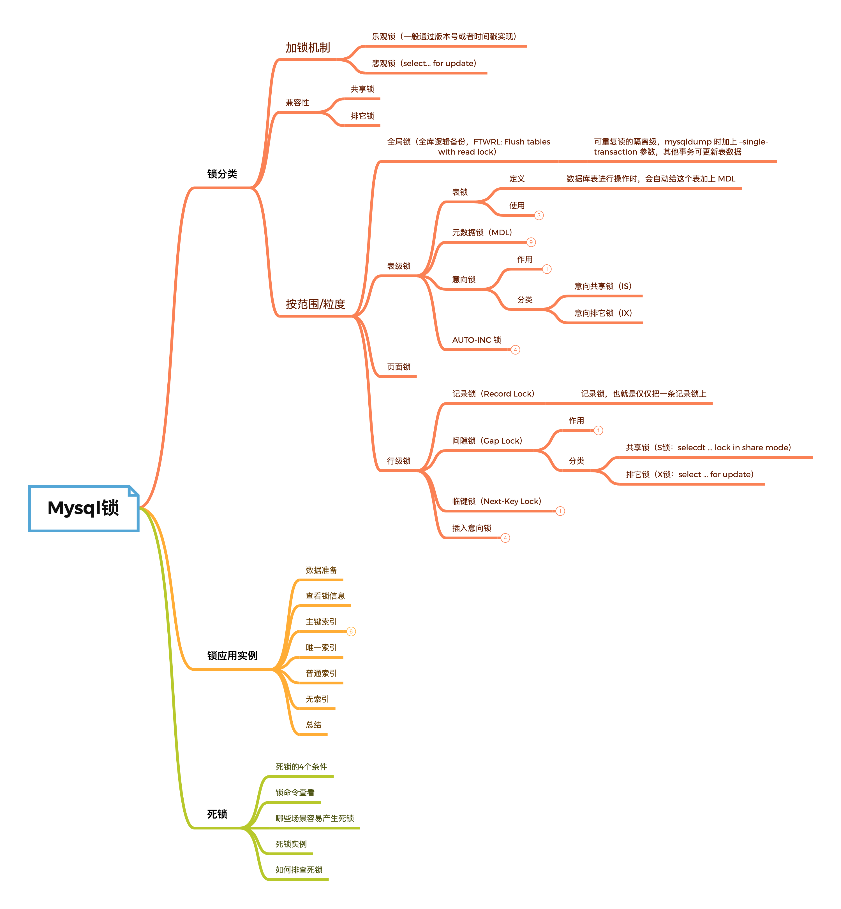

## 一、mysql分类锁

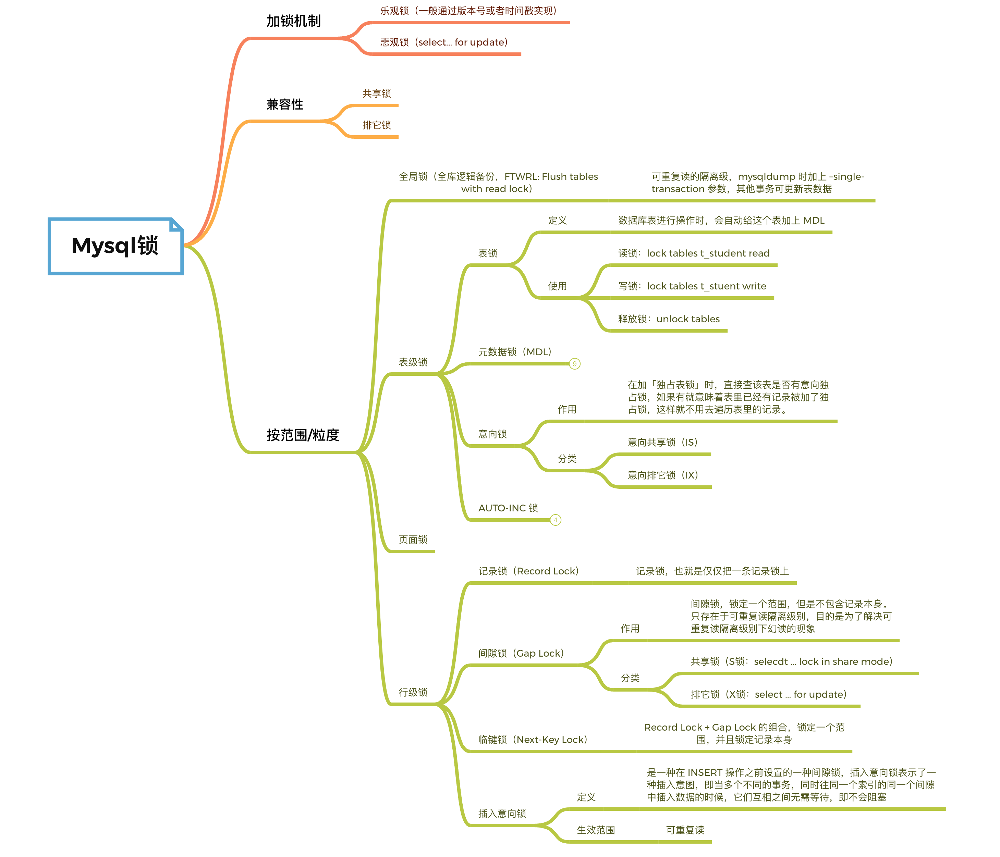

mysql锁按模式分，分为乐观锁和悲观锁。

- 乐观锁：数据库的乐观锁一般是业务方通过版本号或时间戳来实现(java一般使用cas，比较的也是版本号)；

- 悲观锁：一般锁全局，使用方式：select... for update（排它锁）

   InnoDB默认Row-Level Lock，所以只有「明确」地指定主键，MySQL 才会执行Row lock (只锁住被选取的数据)  ，否则MySQL 将会执行Table Lock (将整个数据表单给锁住)。

**悲观锁的具体流程**

- 在对任意记录进行修改前，先尝试为该记录加上排他锁(exclusive locking);
- 如果加锁失败，说明该记录正在被修改，那么当前查询可能要等待或者抛出异常。具体响应方式由开发者根据实际需要决定;
- 如果成功加锁，那么就可以对记录做修改，事务完成后就会解锁了。
- 其间如果有其他对该记录做修改或加排他锁的操作，都会等待我们解锁或直接抛出异常。

mysql锁按粒度或者范围来分，分为全局锁、表级锁、页面锁和行级锁。下面重点介绍这几种锁

### 1.1 全局锁

```sql
-- 使用全局锁 
flush tables with read lock;
-- 释放全局锁
unlock tables;
```

应用场景: **全库逻辑备份**，这样在备份数据库期间，不会因为数据或表结构的更新，而出现备份文件的数据与预期的不一样。

加上全局锁，意味着整个数据库都是只读状态。在事务支持可重复读的隔离级别下，加参数`–single-transaction`，就会在备份数据库之前先开启事务，不会影响备份数据库时的 Read View。

### 1.2 表级锁(table-level locking)

#### 1. 表锁

表级锁定分为表共享读锁（共享锁）与表独占写锁（排他锁）

#### a. 共享锁（Shared），又称为S 锁，读锁

针对同一份数据，多个读操作可以同时进行而不会互相影响

#### b. 排它锁（Exclusive），又称为X 锁，写锁。

当前写操作没有完成前，它会阻断其他写锁和读锁

读读-SS之间是可以兼容的，但是读写-SX之间，写写—XX之间是互斥的。

```sql
-- 读锁锁表，会阻塞其他事务修改表数据
LOCK TABLE my_table_name READ;
-- 写锁
lock tables t_stuent write
-- 释放锁
unlock tables
```

**不管是表级锁还是行级锁，都有共享锁和排他锁的概念。有索引，走的是行锁；没有索引，走的是表锁。**

#### 2. 元数据锁(metadata lock)

我们不需要显示的使用 MDL，因为当我们对数据库表进行操作时，会自动给这个表加上 MDL：

- 对一张表进行 CRUD 操作时，加的是 **MDL 读锁**；
- 对一张表做结构变更操作的时候，加的是 **MDL 写锁**；

 目的：MDL 是为了保证当用户对表执行 CRUD 操作时，防止其他线程对这个表结构做了变更。

当有线程在执行 select 语句（ 加 MDL 读锁）的期间，如果有其他线程要更改该表的结构（ 申请 MDL 写锁），那么将会被阻塞，直到执行完 select 语句（ 释放 MDL 读锁）。反之，当有线程对表结构进行变更（ 加 MDL 写锁）的期间，如果有其他线程执行了 CRUD 操作（ 申请 MDL 读锁），那么就会被阻塞，直到表结构变更完成（ 释放 MDL 写锁）。

MDL 是在事务提交后才会释放，这意味着**事务执行期间，MDL 是一直持有的**。

那如果数据库有一个长事务（所谓的长事务，就是开启了事务，但是一直还没提交），那在对表结构做变更操作的时候，可能会发生意想不到的事情，比如下面这个顺序的场景：

1. 首先，线程 A 先启用了事务（但是一直不提交），然后执行一条 select 语句，此时就先对该表加上 MDL 读锁；
2. 然后，线程 B 也执行了同样的 select 语句，此时并不会阻塞，因为「读读」并不冲突；
3. 接着，线程 C 修改了表字段，此时由于线程 A 的事务并没有提交，也就是 MDL 读锁还在占用着，这时线程 C 就无法申请到 MDL 写锁，就会被阻塞，

那么在线程 C 阻塞后，后续有对该表的 select 语句，就都会被阻塞，如果此时有大量该表的 select 语句的请求到来，就会有大量的线程被阻塞住，这时数据库的线程很快就会爆满了。

为什么线程 C 因为申请不到 MDL 写锁，而导致后续的申请读锁的查询操作也会被阻塞？

这是因为申请 MDL 锁的操作会形成一个队列，队列中写锁获取优先级高于读锁，一旦出现 MDL 写锁等待，会阻塞后续该表的所有 CRUD 操作。

但考虑一下这个场景。如果你要变更的表是一个热点表，虽然数据量不大，但是上面的请求很频繁，而你不得不加个字段，你该怎么做呢？

这时候kill可能未必管用，因为新的请求马上就来了。比较理想的机制是，在alter table语句里面设定等待时间，如果在这个指定的等待时间里面能够拿到MDL写锁最好，拿不到也不要阻塞后面的业务语句，先放弃。之后开发人员或者DBA再通过重试命令重复这个过程。

MariaDB已经合并了AliSQL的这个功能，所以这两个开源分支目前都支持DDL NOWAIT/WAIT n这个语法。

```sql
ALTER TABLE tbl_name NOWAIT add column ...
ALTER TABLE tbl_name WAIT N add column ...
```

#### 3. 意向锁

mysql官网上对于意向锁的解释:

> The main purpose of IX and IS locks is to show that someone is locking a row, or going to lock a row in the table.

意向锁(Intention Locks)的目的是为了表明某个事务正在锁定一行或者将要锁定一行。

**意向锁可快速判断表里是否有记录被加锁**。之所以需要MDL锁，就是因为事务执行的时候，不能发生表结构的改变，否则就会导致同一个事务中，出现混乱的现象

**意向共享锁和意向独占锁是表级锁，不会和行级的共享锁和独占锁发生冲突，而且意向锁之间也不会发生冲突。表级锁之间才会有冲突，例：和共享表锁（lock tables … read）和独占表锁（lock tables … write）发生冲突。**

##### a. 意向共享锁（IS：Intention shared locks）

##### b. 意向排它锁（IX: Intention Exclusive Locks）

也就是，当执行插入、更新、删除操作，需要先对表加上「意向独占锁」，然后对该记录加独占锁。而普通的 select 是不会加行级锁的，普通的 select 语句是利用 MVCC 实现一致性读，是无锁的。

select 也是可以对记录加共享锁和独占锁的

```sql
-- 先在表上加上意向共享锁，然后对读取的记录加独占锁
select ... lock in share mode;

-- 先表上加上意向独占锁，然后对读取的记录加独占锁
select ... for update;
```


#### 4. AUTO-INC锁

主键自增通过 AUTO-INC 锁实现；AUTO-INC 锁是特殊的表锁机制，锁**不是再一个事务提交后才释放，而是再执行完插入语句后就会立即释放**。

在 MySQL 5.1.22 版本开始，InnoDB 存储引擎提供了一种**轻量级的锁**来实现自增，一样也是在插入数据的时候，会为被 `AUTO_INCREMENT` 修饰的字段加上轻量级锁，**然后给该字段赋值一个自增的值，就把这个轻量级锁释放了，而不需要等待整个插入语句执行完后才释放锁**。

InnoDB 存储引擎提供了个 innodb_autoinc_lock_mode 的系统变量，是用来控制选择用 AUTO-INC 锁，还是轻量级的锁。

- 当 innodb_autoinc_lock_mode = 0，就采用 AUTO-INC 锁，语句执行结束后才释放锁；
- 当 innodb_autoinc_lock_mode = 2，就采用轻量级锁，申请自增主键后就释放锁，并不需要等语句执行后才释放。
- 当 innodb_autoinc_lock_mode = 1：
  - 普通 insert 语句，自增锁在申请之后就马上释放；
  - 类似 insert … select 这样的批量插入数据的语句，自增锁还是要等语句结束后才被释放；

当 innodb_autoinc_lock_mode = 2 是性能最高的方式，但是当搭配 binlog 的日志格式是 statement 一起使用的时候，在「主从复制的场景」中会发生**数据不一致的问题**。

要解决这问题，binlog 日志格式要设置为 row，这样在 binlog 里面记录的是主库分配的自增值，到备库执行的时候，主库的自增值是什么，从库的自增值就是什么。**当 innodb_autoinc_lock_mode = 2 时，并且 binlog_format = row，既能提升并发性，又不会出现数据一致性问题**。

```sql
-- MySQL 8.0.3 之前系统变量innodb_autoinc_lock_mode默认值为1
-- MySQL 8.0.3 之后系统变量innodb_autoinc_lock_mode默认值为2
show variables like 'innodb_autoinc_lock_mode';
```


### 1.3 页面锁(page-level locking)

页锁就是在 页的粒度 上进行锁定，锁定的数据资源比行锁要多，因为一个页中可以有多个行记录。当我 们使用页锁的时候，会出现数据浪费的现象，但这样的浪费最多也就是一个页上的数据行。页锁的开销 介于表锁和行锁之间，会出现死锁。

每个层级的锁数量是有限制的，因为锁会占用内存空间， 锁空间的大小是有限的 。当某个层级的锁数量超过了这个层级的阈值时，就会进行锁升级 。锁升级就是用更大粒度的锁替代多个更小粒度的锁，比如 InnoDB 中行锁升级为表锁，这样做的好处是占用的锁空间降低了，但同时数据的并发度也下降了。


### 1.4 行级锁(row-level locking)

行级锁是mysql中锁定粒度最细的一种锁。表示只针对当前操作的行进行加锁。行级锁能大大减少数据库操作的冲突，其加锁粒度最小，但加锁的开销也最大。

record lock、gap lock、next-key lock，都是加在索引上的。

#### 1. 记录锁（Record Lock）

记录锁，也就是仅仅把一条记录锁上。记录锁是有 S 锁和 X 锁之分的。

#### 2. 间隙锁（Gap Lock）

间隙锁，锁定一个范围，但是不包含记录本身。只存在于可重复读隔离级别，目的是为了解决可重复读隔离级别下幻读的现象

**间隙锁是前开后开区间，next-Key锁规定是左开右闭区间。**

间隙锁与间隙锁之间是兼容，在MySQL官网上还有一段非常关键的描述：

> Gap locks in InnoDB are “purely inhibitive”, which means that their only purpose is to prevent other transactions from Inserting to the gap. Gap locks can co-exist. A gap lock taken by one transaction does not prevent another transaction from taking a gap lock on the same gap. There is no difference between shared and exclusive gap locks. They do not conflict with each other, and they perform the same function.

**间隙锁的目的为了防止其它事务的插入到间隙锁中，但不阻止其它的事务上相同范围内的间隙锁，间隙锁之前是可以共享的。**对于读事务，A事务和B事务可获取相同范围、相交范围的间隙锁，它们可共存，因为间隙锁是为了防止在这个间隙锁范围内插入/更新记录，**间隙锁防止幻读**；如果A事务生成的间隙锁范围内，B事务要插入，则会等待。


##### 共享锁（S锁：selecdt ... lock in share mode）

##### 排它锁（X锁：select ... for update）

```sql
//对读取的记录加共享锁
select ... lock in share mode;

//对读取的记录加独占锁
select ... for update;
```

#### 3. 临键锁（Next-Key Lock）

Record Lock + Gap Lock 的组合，锁定一个范围，并且锁定记录本身。

当某个事务持有该数据行的临键锁时，会锁住一段左开右闭区间的数据。需要强调的一点是，InnoDB 中行级锁是基于索引实现的，临键锁只与非唯一索引列有关，在唯一索引列（包括主键列）上不存在临键锁。

next-key lock 是包含间隙锁+记录锁的，如果一个事务获取了 X 型的 next-key lock，那么另外一个事务在获取相同范围的 X 型的 next-key lock 时，是会被阻塞的。

#### 4. 插入意向锁(INSERT_INTENTION)

在MySQL的官方文档中有以下描述：

> An Insert intention lock is a type of gap lock set by Insert operations prior to row Insertion. This lock signals the intent to Insert in such a way that multiple transactions Inserting into the same index gap need not wait for each other if they are not Inserting at the same position within the gap. Suppose that there are index records with values of 4 and 7. Separate transactions that attempt to Insert values of 5 and 6, respectively, each lock the gap between 4 and 7 with Insert intention locks prior to obtaining the exclusive lock on the Inserted row, but do not block each other because the rows are nonconflicting.

这段话表明尽管**插入意向锁是一种特殊的间隙锁，但不同于间隙锁的是，该锁只用于并发插入操作**。

如果说间隙锁锁住的是一个区间，那么「插入意向锁」锁住的就是一个点。因而从这个角度来说，插入意向锁确实是一种特殊的间隙锁。

只有在可重复读情况下才会生效。

当我们执行以下插入语句时，会在插入间隙上获取插入意向锁，**而插入意向锁与间隙锁是冲突的，所以当其它事务持有该间隙的间隙锁时，需要等待其它事务释放间隙锁之后，才能获取到插入意向锁。而间隙锁与间隙锁之间是兼容的，所以所以两个事务中 `select ... for update` 语句并不会相互影响**。


### 1.5 表级锁&行级锁区别

InnoDB行锁是通过给索引上的索引项加锁来实现的，而不是给表的行记录加锁实现的，这就意味着只有通过索引条件检索数据，InnoDB才使用行级锁，否则InnoDB将使用表锁。

表级锁：

- 对整张表加锁。开销小（因为不用去找表的某一行的记录进行加锁，要修改这张表，直接申请加这张表的锁），加锁快，不会出现死锁；
- 锁粒度大，发生锁冲突的概率高，并发度低。

行级锁：

- 对某行记录加锁。开销大（需要找到表中相应的记录，有搜表搜索引的过程），加锁慢，会出现死锁；
- 锁定粒度最小，发生锁冲突的概率最低，并发度高。

### 1.6 InnoDB锁总结

1. 在不通过索引条件查询的时候，InnoDB使用的确实是表锁!
2. 由于 MySQL 的**行锁是针对索引加的锁,不是针对记录加的锁**,所以虽然是访问不同行 的记录,但是如果是使用相同的索引键,是会出现锁冲突的。
3. 当表有多个索引的时候,不同的事务可以使用不同的索引锁定不同的行,另外,不论 是使用主键索引、唯一索引或普通索引,InnoDB 都会使用行锁来对数据加锁。
4. 即便在条件中使用了索引字段,但是否使用索引来检索数据是由 MySQL 通过判断不同 执行计划的代价来决定的,如果 MySQL 认为全表扫 效率更高,比如对一些很小的表,它 就不会使用索引,这种情况下 InnoDB 将使用表锁,而不是行锁。因此,在分析锁冲突时, 别忘了检查 SQL 的执行计划(explain查看),以确认是否真正使用了索引。

## 二、锁应用案例

### 2.1 数据准备

准备表和数据，以下实例内容不特殊标注，皆为可重复读级别。

```sql
drop table user;

CREATE TABLE `user` (
  `id` bigint NOT NULL AUTO_INCREMENT COMMENT '主键id',
  `name` varchar(30) COLLATE utf8mb4_unicode_ci NOT NULL COMMENT '名称',
  `age` int(3) NOT NULL COMMENT '年龄，普通索引',
  `tel` bigint(12) NOT NULL COMMENT '电话，唯一索引',
  PRIMARY KEY (`id`),
  UNIQUE KEY `uni_idx_tel` (`tel`),
  KEY `idx_age` (`age`)
) ENGINE=InnoDB  DEFAULT CHARSET=utf8mb4 COLLATE=utf8mb4_unicode_ci;

INSERT INTO `test2`.`user` (`id`, `name`, `age`, `tel`) VALUES (1, 'ivy', 10, 18600000010);
INSERT INTO `test2`.`user` (`id`, `name`, `age`, `tel`) VALUES (3, 'will', 15, 18600000015);
INSERT INTO `test2`.`user` (`id`, `name`, `age`, `tel`) VALUES (5, 'ava', 13, 18600000013);
INSERT INTO `test2`.`user` (`id`, `name`, `age`, `tel`) VALUES (9, 'bill', 30, 18600000030);

INSERT INTO user(id,name,age,tel) values(3,'lucky', 15, 18600000015 );

select * from user;

-- 备用测试名 oliver, luna, ava, iris, isla, kai, eden, ava, grace, rain, morgan, jack, rose
```

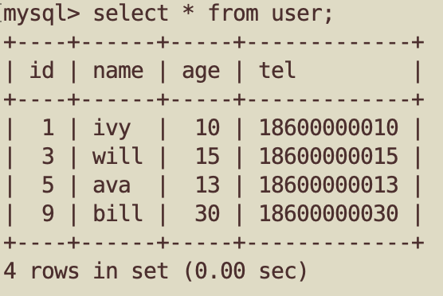

### 2.2 查看锁信息

先上锁执行

```sql
select * from user where id=3 for update;
```

然后通过下面的命令查看锁信息

```sql
select * from performance_schema.data_locks\G; -- 查看锁信息
```

```shell
mysql> select * from performance_schema.data_locks\G;
*************************** 1. row ***************************
               ENGINE: INNODB
       ENGINE_LOCK_ID: 140404813532488:1322:140405719986576
ENGINE_TRANSACTION_ID: 84497
            THREAD_ID: 58
             EVENT_ID: 265
        OBJECT_SCHEMA: test2
          OBJECT_NAME: user
       PARTITION_NAME: NULL
    SUBPARTITION_NAME: NULL
           INDEX_NAME: NULL
OBJECT_INSTANCE_BEGIN: 140405719986576
            LOCK_TYPE: TABLE  // <----- 表级锁
            LOCK_MODE: IX     // <----- IX意向锁
          LOCK_STATUS: GRANTED
            LOCK_DATA: NULL
*************************** 2. row ***************************
               ENGINE: INNODB
       ENGINE_LOCK_ID: 140404813532488:265:4:5:140405702332448
ENGINE_TRANSACTION_ID: 84497
            THREAD_ID: 58
             EVENT_ID: 265
        OBJECT_SCHEMA: test2
          OBJECT_NAME: user            // <----- 表名
       PARTITION_NAME: NULL
    SUBPARTITION_NAME: NULL
           INDEX_NAME: PRIMARY
OBJECT_INSTANCE_BEGIN: 140405702332448 // <----- OBJECT_INSTANCE_BEGIN为对象的内存地址
            LOCK_TYPE: RECORD          // <----- 行级锁
            LOCK_MODE: X,REC_NOT_GAP   // <----- x型记录锁
          LOCK_STATUS: GRANTED
            LOCK_DATA: 3               // <----- LOCK_DATA 就表示锁的范围「右边界」
2 rows in set (0.00 sec)
```

比较常看的也就5、6个字段INDEX_NAME,LOCK_TYPE,LOCK_MODE,LOCK_STATUS,LOCK_DATA：

```sql
select INDEX_NAME,LOCK_TYPE,LOCK_MODE,LOCK_STATUS,LOCK_DATA from performance_schema.data_locks\G;
```

OBJECT_INSTANCE_BEGIN：对象的内存地址

LOCK_TYPE : TABLE表示表级锁；RECORD 表示行级锁，而不是记录锁的意思

LOCK_STATUS: 锁状态（PENDING, GRANTED, VICTIM, TIMEOUT, KILLED, PRE_ACQUIRE_NOTIFY, or POST_RELEASE_NOTIFY）

|     LOCK_STATUS  |   是否瞬时状态   |   备注   |
| ------ | ------ | ------ |
| PENDING	| 否	| 请求锁但没有获得锁定 |
| GRANTED	| 否	| 请求且已获得锁定 |
| VICTIM	| 是 |	当死锁检测器取消挂起的锁定请求以打破死锁（ER_LOCK_DEADLOCK）时，其行|
| TIMEOUT	| 是	| 超时 |
| KILLED	| 是 |	被kill调 |
| PRE_ACQUIRE_NOTIFY	| 是	| 表示该元数据锁定subsubsystem的通知感兴趣的存储引擎，而进入锁定获取操作或离开锁释放操作 |
| POST_RELEASE_NOTIFY |	是 | 表示该元数据锁定subsubsystem的通知感兴趣的存储引擎，而进入锁定获取操作或离开锁释放操作 |

通过 LOCK_MODE 可以确认是 next-key 锁，还是间隙锁，还是记录锁：

- 如果 LOCK_MODE 为 `X`，说明是 next-key 锁；
- 如果 LOCK_MODE 为 `X, REC_NOT_GAP`，说明是记录锁；
- 如果 LOCK_MODE 为 `X, GAP`，说明是间隙锁；

LOCK_DATA：**LOCK_DATA 就表示锁的范围「右边界」**。supremum pseudo-record 是最大界限伪记录（相当于正无穷+∞）， 对应的还有最小界限伪记录infimum pseudo-record（相当于负无穷-∞）

上面显示 LOCK_DATA = 3，结合LOCK_MODE = X,REC_NOT_GAP ，说明锁住的是这一条记录；如果LOCK_MODE= X,GAP，则它代表是间隙锁，锁的范围是 (x,3)。因为间隙锁是左开右开范围，而上一条记录的id=x，所以间隙锁的范围是(x,3)。

### 2.3 主键索引

当我们用唯一索引进行等值查询的时候：

- 等值查询(pk=x)，x值存在，加记录锁，锁一行；
- 等值查询(pk=x`)，值x不存在，间隙锁，锁x的相邻2条记录(a,b)，严格来说如果b=∞，则为next key锁：(a,∞]

#### 2.3.1 主键等值查询(x存在)

```sql
select * from user where id=3 for update;
```


```sql
mysql> select INDEX_NAME,LOCK_TYPE,LOCK_MODE,LOCK_STATUS,LOCK_DATA from performance_schema.data_locks\G;
*************************** 1. row ***************************
 INDEX_NAME: NULL
  LOCK_TYPE: TABLE
  LOCK_MODE: IX
LOCK_STATUS: GRANTED
  LOCK_DATA: NULL
*************************** 2. row ***************************
 INDEX_NAME: PRIMARY
  LOCK_TYPE: RECORD
  LOCK_MODE: X,REC_NOT_GAP   //记录锁
LOCK_STATUS: GRANTED
  LOCK_DATA: 3                 //锁的主键id=3
2 rows in set (0.00 sec)
```


#### 2.3.2 主键等值查询(x不存在)

主键x不存在，则主键索引上加的是间隙锁，锁住的范围是 (5, 9)，范围是从x上下2个相邻的节点开始加间隙锁。

```sql
select * from user where id=5 for update;
```


```sql
mysql> select INDEX_NAME,LOCK_TYPE,LOCK_MODE,LOCK_STATUS,LOCK_DATA from performance_schema.data_locks\G;
*************************** 1. row ***************************
 INDEX_NAME: NULL
  LOCK_TYPE: TABLE
  LOCK_MODE: IX
LOCK_STATUS: GRANTED
  LOCK_DATA: NULL
*************************** 2. row ***************************
 INDEX_NAME: PRIMARY
  LOCK_TYPE: RECORD
  LOCK_MODE: X,GAP               //间隙锁
LOCK_STATUS: GRANTED
  LOCK_DATA: 9                   //锁范围(5,9)
2 rows in set (0.00 sec)
```


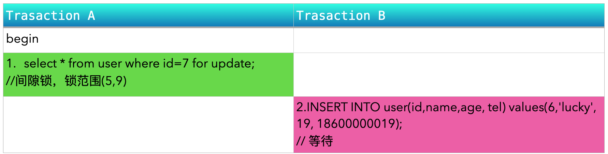

#### 2.3.3 主键索引范围查询-x值存在

- 等值x范围查询(pk>=x)，**x值存在，从等值x开始加记录锁**，依次遍历后，加next key锁或间隙锁。在判断next key锁还是间隙锁，最简单的方法，看最右边的值b是否需要加锁，需要就是(a,b] next key锁，不需要就是(a,b)间隙锁；
- 非等值x范围查询（pk>x），**从x值的相邻节点开始**，加next key锁或间隙锁。假设2个相邻主键id=5,id=9, 若查询条件id>7,加锁效果和id>5是一样的，加的是next key锁(5,9]；如果是id<6，则这一段锁加间隙锁(5,6)。

查询条件 id>=5时，在遍历时，如果主键值(id=5)存在，如锁一条记录则为记录锁，如果锁范围则是next key锁。

比如id=5是记录锁，再继续遍历范围时，不能只锁id=9，要锁(3,9)+9，即(3,9]，这就是为什么next key锁是记录锁+间隙锁的原因。

**间隙锁的表示方法: ( ); next key锁的表示方法:( ]；间隙锁左开右开，next key锁左开右闭。**


```sql
mysql> select INDEX_NAME,LOCK_TYPE,LOCK_MODE,LOCK_STATUS,LOCK_DATA from performance_schema.data_locks\G;
*************************** 1. row ***************************
 INDEX_NAME: NULL
  LOCK_TYPE: TABLE
  LOCK_MODE: IX
LOCK_STATUS: GRANTED
  LOCK_DATA: NULL
*************************** 2. row ***************************
 INDEX_NAME: PRIMARY
  LOCK_TYPE: RECORD
  LOCK_MODE: X,REC_NOT_GAP  //记录锁id=5
LOCK_STATUS: GRANTED
  LOCK_DATA: 5
*************************** 3. row ***************************
 INDEX_NAME: PRIMARY
  LOCK_TYPE: RECORD
  LOCK_MODE: X                 //next key锁 (9,∞]
LOCK_STATUS: GRANTED
  LOCK_DATA: supremum pseudo-record
*************************** 4. row ***************************
 INDEX_NAME: PRIMARY
  LOCK_TYPE: RECORD
  LOCK_MODE: X               //next key锁 (5, 9]
LOCK_STATUS: GRANTED
  LOCK_DATA: 9
4 rows in set (0.00 sec)
```

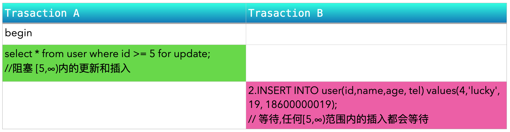

#### 2.3.4 主键索引范围查询-nextkey锁

查询条件 id>6

**在遍历时，如果主键值(id=6)不存在，则找相邻的主键id=5然后加** **’(‘** **或** **’)’** **锁，来表示起始锁范围。**id=6不存在，则从主键id=3开始，用’(3’表示起始范围。

至于结束范围，看遍历到相邻节点后，是否需要锁住主键x。需要加next key锁，如上实例(3,9]；在遍历不到时，另一端则为’(‘或’)’，就会是间隙锁，查询条件改为id<6，加锁为：(-∞,1], (1,3], (3,9)，(3,9)为间隙锁。

**所以不用纠结和死记是要用next key锁还是间隙锁，只需要看是否需要锁住结束的那一条记录，需要的话就是next key锁：(a,b]，不需要的话，就是间隙锁(a,b)**

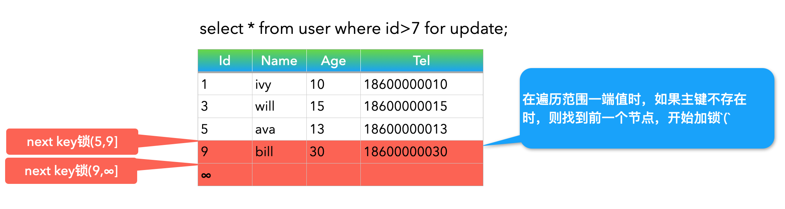

```sql
mysql> select INDEX_NAME,LOCK_TYPE,LOCK_MODE,LOCK_STATUS,LOCK_DATA from performance_schema.data_locks\G;
*************************** 1. row ***************************
 INDEX_NAME: NULL
  LOCK_TYPE: TABLE
  LOCK_MODE: IX
LOCK_STATUS: GRANTED
  LOCK_DATA: NULL
*************************** 2. row ***************************
 INDEX_NAME: PRIMARY
  LOCK_TYPE: RECORD
  LOCK_MODE: X                //nextkey锁,范围(9,∞]
LOCK_STATUS: GRANTED
  LOCK_DATA: supremum pseudo-record
*************************** 3. row ***************************
 INDEX_NAME: PRIMARY
  LOCK_TYPE: RECORD
  LOCK_MODE: X                //nextkey锁,范围(5,9]
LOCK_STATUS: GRANTED
  LOCK_DATA: 9
3 rows in set (0.00 sec)
```


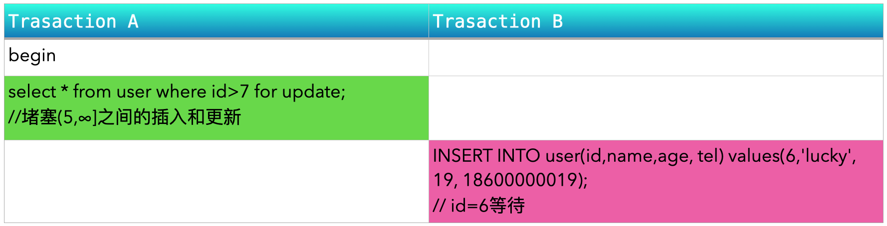

#### 2.3.5 主键索引范围查询-间隙锁

查询条件如果是id<6

加锁为：(-∞,1], (1,3], (3,9)， 因为不可能锁到id=9，所以上间隙锁(3,9)。虽然是id<6 for update，但无法插入id=8的记录。

对于锁单条记录就是记录锁；

对于范围锁(next key/间隙锁)，扫到主键值b，要加锁,则为(a,b]；如果不允许加锁，则为(a,b);

在范围查询时如果主键值不存在(id<6)，则从相邻的主键中取值，加 ’(‘ 或 ’)’。在id<6时，锁的一端范围 ‘9)’。 

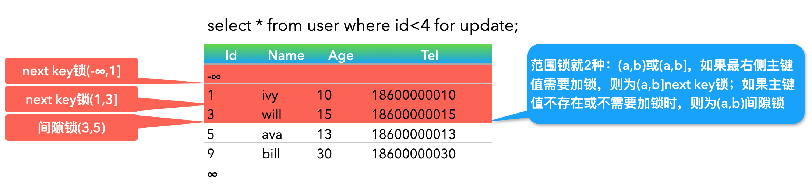

```sql
mysql> select INDEX_NAME,LOCK_TYPE,LOCK_MODE,LOCK_STATUS,LOCK_DATA from performance_schema.data_locks\G;
*************************** 1. row ***************************
 INDEX_NAME: NULL
  LOCK_TYPE: TABLE
  LOCK_MODE: IX
LOCK_STATUS: GRANTED
  LOCK_DATA: NULL
*************************** 2. row ***************************
 INDEX_NAME: PRIMARY
  LOCK_TYPE: RECORD
  LOCK_MODE: X
LOCK_STATUS: GRANTED
  LOCK_DATA: 1
*************************** 3. row ***************************
 INDEX_NAME: PRIMARY
  LOCK_TYPE: RECORD
  LOCK_MODE: X
LOCK_STATUS: GRANTED
  LOCK_DATA: 3
*************************** 4. row ***************************
 INDEX_NAME: PRIMARY
  LOCK_TYPE: RECORD
  LOCK_MODE: X,GAP
LOCK_STATUS: GRANTED
  LOCK_DATA: 5
4 rows in set (0.00 sec)
```


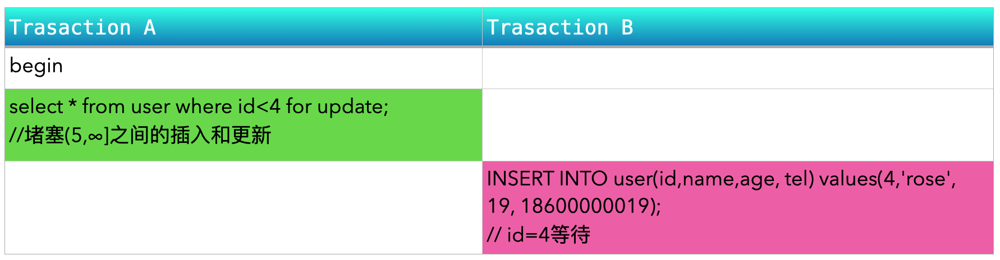

### 2.4 唯一索引

#### 2.4.1 唯一索引等值查询

- 等值查询(uni_idx=x)，加记录锁，锁一行；此处会有2个锁，一个是唯一索引的记录锁，另一个是主键索引的记录锁，但效果是锁一行记录。
- 值x不存在(uni_idx=x`)，间隙锁，同主键索引


#### 2.4.2 唯一索引范围查询

等值x范围查询(uni_idx>=x)，**x值存在与否，都会从相邻节点开始加`(`或`)`锁，这一点是和主键索引不同，加锁范围更广**。

唯一索引 tel>=18600000013，值18600000013存在时的范围查询：
**和主键索引不同的是：会在相邻节点(18600000010)，加next key锁(18600000010,18600000013]，
而主键索引则不会next key锁。这一点唯一索引和普通索引处理一样。**
查询tel>=18600000013和tel>18600000010效果是相同的

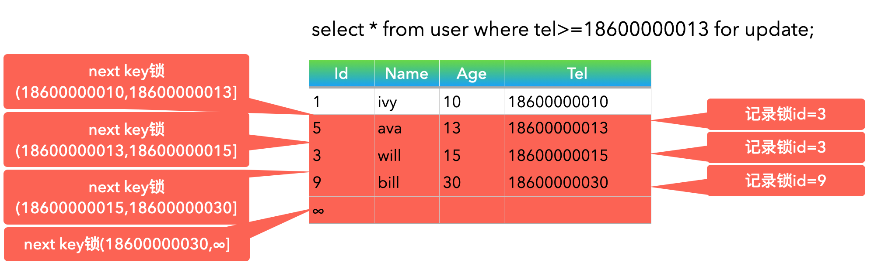

```sql
mysql> select INDEX_NAME,LOCK_TYPE,LOCK_MODE,LOCK_STATUS,LOCK_DATA from performance_schema.data_locks\G;
*************************** 1. row ***************************
 INDEX_NAME: NULL
  LOCK_TYPE: TABLE
  LOCK_MODE: IX
LOCK_STATUS: GRANTED
  LOCK_DATA: NULL
*************************** 2. row ***************************
 INDEX_NAME: uni_idx_tel
  LOCK_TYPE: RECORD
  LOCK_MODE: X
LOCK_STATUS: GRANTED
  LOCK_DATA: supremum pseudo-record
*************************** 3. row ***************************
 INDEX_NAME: uni_idx_tel
  LOCK_TYPE: RECORD
  LOCK_MODE: X
LOCK_STATUS: GRANTED
  LOCK_DATA: 18600000030, 9
*************************** 4. row ***************************
 INDEX_NAME: uni_idx_tel
  LOCK_TYPE: RECORD
  LOCK_MODE: X
LOCK_STATUS: GRANTED
  LOCK_DATA: 18600000015, 3
*************************** 5. row ***************************
 INDEX_NAME: uni_idx_tel
  LOCK_TYPE: RECORD
  LOCK_MODE: X
LOCK_STATUS: GRANTED
  LOCK_DATA: 18600000013, 5
*************************** 6. row ***************************
 INDEX_NAME: PRIMARY
  LOCK_TYPE: RECORD
  LOCK_MODE: X,REC_NOT_GAP
LOCK_STATUS: GRANTED
  LOCK_DATA: 9
*************************** 7. row ***************************
 INDEX_NAME: PRIMARY
  LOCK_TYPE: RECORD
  LOCK_MODE: X,REC_NOT_GAP
LOCK_STATUS: GRANTED
  LOCK_DATA: 3
*************************** 8. row ***************************
 INDEX_NAME: PRIMARY
  LOCK_TYPE: RECORD
  LOCK_MODE: X,REC_NOT_GAP
LOCK_STATUS: GRANTED
  LOCK_DATA: 5
8 rows in set (0.01 sec)
```


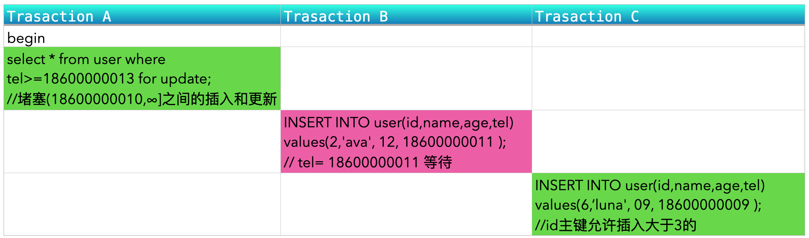


### 2.5 普通索引(二级索引)

#### 2.5.1 普通索引等值查询（x存在）

等值查询(idx=x)，x值存在，会在相邻节点2端开始加锁，x的前端是next key锁，x的后面是间隙锁。**普通索引在等值查询时就开始在相邻节点加锁了，加锁范围进行一点扩大。普通索引在加索时，也同时对主键进行了加锁**。

二级索引index构成一个b+树，但上锁是 index(age)+主键(id)，在index(age)在相同的二级索引值情况下， 再按主键 id 的顺序存放。
1.在index上锁的范围内无法插入；
2.对于临界值的index，看(index,pk)插入后是否在锁范围内，范围内的不能插入。

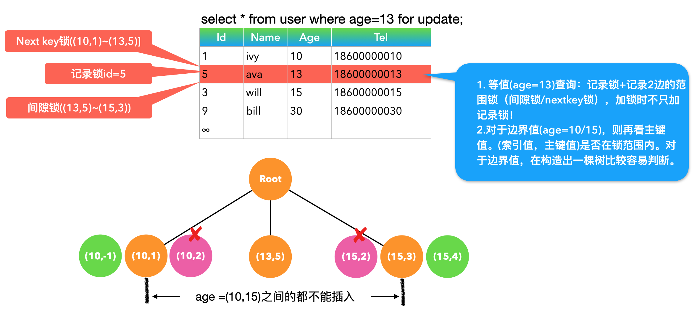

看下面的数据插入情况

```sql
线程1先执行：begin；select * from user where age=13 for update;
线程2再执行：
— 索引index age=(10,15)内无法插入
INSERT INTO user(id,name,age,tel) values(2,'luna1', 12, 18600000101 ); x
INSERT INTO user(id,name,age,tel) values(-1,'luna2', 12, 18600000102 ); x
INSERT INTO user(id,name,age,tel) values(6,'luna3', 14, 18600000103 ); x
INSERT INTO user(id,name,age,tel) values(4,'luna4', 14, 18600000104 ); x
— index临界值，再看id值，构成的节点是否在上锁区间
INSERT INTO user(id,name,age,tel) values(2,'luna5', 10, 18600000105 ); x
INSERT INTO user(id,name,age,tel) values(-1,'luna6', 10, 18600000106 ); √
INSERT INTO user(id,name,age,tel) values(4,'luna7', 15, 18600000107 ); √
INSERT INTO user(id,name,age,tel) values(2,'luna8', 15, 18600000108 ); x
```

上锁情况如下

```sql

mysql> select * from performance_schema.data_locks\G;
*************************** 1. row ***************************
            ......
            LOCK_TYPE: TABLE
            LOCK_MODE: IX
          LOCK_STATUS: GRANTED
            LOCK_DATA: NULL
*************************** 2. row ***************************
            ......
           INDEX_NAME: idx_age
OBJECT_INSTANCE_BEGIN: 140607398005792
            LOCK_TYPE: RECORD
            LOCK_MODE: X           //next key锁      
          LOCK_STATUS: GRANTED
            LOCK_DATA: 13, 5.      //锁范围((10,1),(13,5)]
*************************** 3. row ***************************
            ......
           INDEX_NAME: PRIMARY
OBJECT_INSTANCE_BEGIN: 140607398006136
            LOCK_TYPE: RECORD
            LOCK_MODE: X,REC_NOT_GAP
          LOCK_STATUS: GRANTED
            LOCK_DATA: 5
*************************** 4. row ***************************
            ......
           INDEX_NAME: idx_age
OBJECT_INSTANCE_BEGIN: 140607398006480
            LOCK_TYPE: RECORD
            LOCK_MODE: X,GAP     //间隙锁
          LOCK_STATUS: GRANTED
            LOCK_DATA: 15, 3     //锁范围((13,5)~(15,3))
4 rows in set (0.01 sec)

ERROR: 
No query specified
```

#### 2.5.2 普通索引等值查询（x不存在）

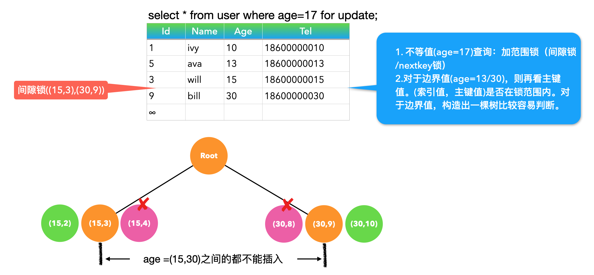

```sql
线程1先执行：begin；select * from user where age=17 for update;
线程2再执行：
—- 索引index age=(15,30)内无法插入，间隙锁会从上一个节点(age=15)开始计算，而不是age=17开始。
INSERT INTO user(id,name,age,tel) values(100,'luna', 16, 18600000101 ); x
INSERT INTO user(id,name,age,tel) values(100,'luna2', 29, 18600000102); x
-- 对于边界值，看插入的位置是否在锁范围内
INSERT INTO user(id,name,age,tel) values(2,'luna3', 15, 18600000103); √
INSERT INTO user(id,name,age,tel) values(4,'luna4', 15, 18600000104); x
INSERT INTO user(id,name,age,tel) values(8,'luna5', 30, 18600000105); x
INSERT INTO user(id,name,age,tel) values(10,'luna6', 30, 18600000106); √
```

#### 2.5.3 普通索引范围查询

等值x范围查询(uni_idx>=x)，同唯一索引，**x值存在与否，都会从相邻节点开始加`(`或`)`锁**

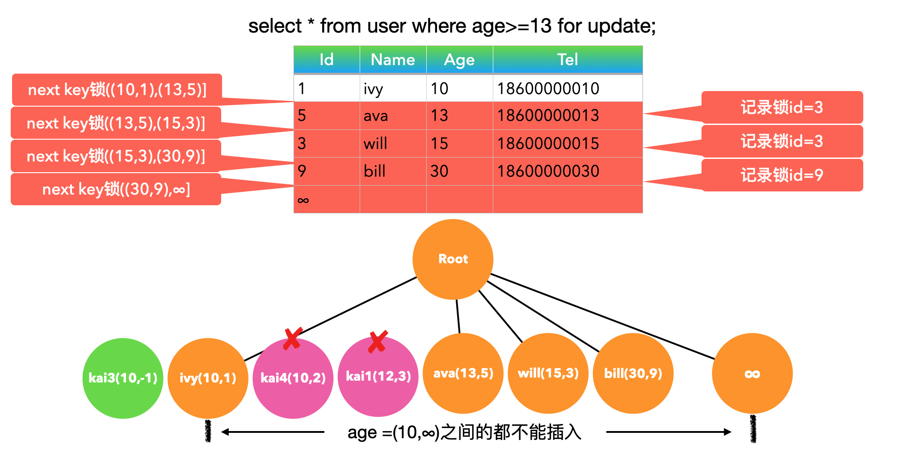

```sql
线程1先执行：begin；select * from user where age>=13 for update;
线程2再执行：
—- 索引index age=(10,∞)内无法插入，间隙锁会从上一个节点开始计算，而不是age=13开始。
INSERT INTO user(id,name,age,tel) values(100,'kai1', 12, 18600000101 ); x
INSERT INTO user(id,name,age,tel) values(100,'kai2', 14, 18600000102); x
-- 对于边界值，看插入的位置是否在锁范围内
INSERT INTO user(id,name,age,tel) values(-1,'kai3', 10, 18600000103); √
INSERT INTO user(id,name,age,tel) values(2,'kai4', 10, 18600000104); x
```

上锁情况如下

```sql
mysql> select INDEX_NAME,LOCK_TYPE,LOCK_MODE,LOCK_STATUS,LOCK_DATA from performance_schema.data_locks\G;
*************************** 1. row ***************************
 INDEX_NAME: NULL
  LOCK_TYPE: TABLE
  LOCK_MODE: IX
LOCK_STATUS: GRANTED
  LOCK_DATA: NULL
*************************** 2. row ***************************
 INDEX_NAME: idx_age
  LOCK_TYPE: RECORD
  LOCK_MODE: X
LOCK_STATUS: GRANTED
  LOCK_DATA: supremum pseudo-record
*************************** 3. row ***************************
 INDEX_NAME: idx_age
  LOCK_TYPE: RECORD
  LOCK_MODE: X
LOCK_STATUS: GRANTED
  LOCK_DATA: 30, 9
*************************** 4. row ***************************
 INDEX_NAME: idx_age
  LOCK_TYPE: RECORD
  LOCK_MODE: X
LOCK_STATUS: GRANTED
  LOCK_DATA: 15, 3
*************************** 5. row ***************************
 INDEX_NAME: idx_age
  LOCK_TYPE: RECORD
  LOCK_MODE: X
LOCK_STATUS: GRANTED
  LOCK_DATA: 13, 5
*************************** 6. row ***************************
 INDEX_NAME: PRIMARY
  LOCK_TYPE: RECORD
  LOCK_MODE: X,REC_NOT_GAP
LOCK_STATUS: GRANTED
  LOCK_DATA: 9
*************************** 7. row ***************************
 INDEX_NAME: PRIMARY
  LOCK_TYPE: RECORD
  LOCK_MODE: X,REC_NOT_GAP
LOCK_STATUS: GRANTED
  LOCK_DATA: 3
*************************** 8. row ***************************
 INDEX_NAME: PRIMARY
  LOCK_TYPE: RECORD
  LOCK_MODE: X,REC_NOT_GAP
LOCK_STATUS: GRANTED
  LOCK_DATA: 5
8 rows in set (0.00 sec)
```


### 2.6 无索引

无索引，相当于锁全表，其它写事务阻塞。

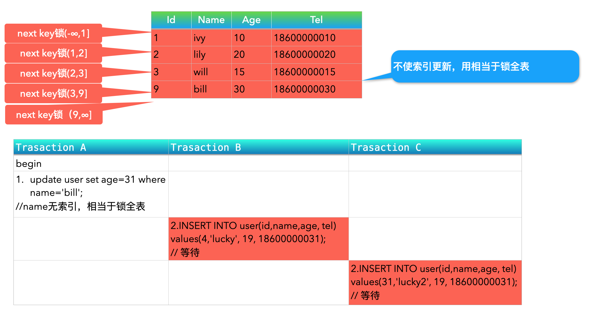


### 2.7 总结

#### 2.7.1 主键索引->唯一索引->普通索引加锁

1. 主键索引
   - 等值查询(pk=x)，x值存在，加记录锁，锁一行；
   - 等值查询(pk=x`)，值x不存在，间隙锁，锁x的相邻2条记录(a,b)，严格来说如果b=∞，则为next key锁：(a,∞]
   - 等值x范围查询(pk>=x)，**x值存在，从等值x开始加记录锁**，依次遍历后，加next key锁或间隙锁。在判断next key锁还是间隙锁，最简单的方法，看最右边的值b是否需要加锁，需要就是(a,b] next key锁，不需要就是(a,b)间隙锁；
   - 非等值x范围查询（pk>x），**从x值的相邻节点开始**，加next key锁或间隙锁。假设2个相邻主键id=5,id=9, 若查询条件id>7,加锁效果和id>5是一样的，加的是next key锁(5,9]；如果是id<6，则这一段锁加间隙锁(5,6)。
2. 唯一索引
   - 等值查询(uni_idx=x)，加记录锁，锁一行；此处会有2个锁，一个是唯一索引的记录锁，另一个是主键索引的记录锁，但效果是锁一行记录。
   - 值x不存在(uni_idx=x`)，间隙锁，同主键索引
   - 等值x范围查询(uni_idx>=x)，**x值存在与否，都会从相邻节点开始加`(`或`)`锁，这一点是和主键索引不同，加锁范围更广**。假设按唯一索引排序，3个相邻的节点(tel,id)是(18600000013,5)，(18600000015,3)，(18600000030,9)，x=18600000015，即x>=18600000015，加锁从(18600000013,18600000015]开始。
3. 普通索引
   - 等值查询(idx=x)，x值存在，会在相邻节点2端开始加锁，x的前端是next key锁，x的后面是间隙锁。**普通索引在等值查询时就开始在相邻节点加锁了，加锁范围进行一点扩大。普通索引在加索时，也同时对主键进行了加锁**。假设x=13(age=13，id=5,简写为(13,5))，它的相邻节点为(10,1),(15,3)，则会加3个锁:Next key锁((10,1)~(13,5)], 记录锁id=5, 间隙锁((13,5)~(15,3))。
   - 等值查询(idx=x)，x值在存在与否，会在相邻节点2端开始加锁。边界值是否加锁画B+树即可。
   - 等值x范围查询(uni_idx>=x)，同唯一索引，**x值存在与否，都会从相邻节点开始加`(`或`)`锁**
4. 无索引
   - 无索引，相当于锁全表，其它写事务阻塞。

#### 2.7.2 小结

1. 普通索引在加索时，也同时对主键进行了加锁。在判断两端边界值是否加锁时，可构造出一棵B+树，先看边界值，则再看主键值。(索引值，主键值)是否在锁范围内。
2. next key锁=间隙锁+记录锁。在判断是next key锁还是间隙锁，最简单的方法，看最右边的值b是否需要加锁，需要就是(a,b] next key锁，不需要就是(a,b)间隙锁。
3. 主键索引->唯一索引->普通索引加锁范围越来越广，从这个角度来说，在使用索引时，尽量先使用主键索引，引起的锁范围是最小的。**主键索引，在值不存在时，才会从相邻节点开始加锁；唯一索引在范围查询时，即使值x存在，仍会从相邻节点开始加锁；普通索引则在等值查询时，就开始会对相邻节点开始加锁了。**
4. 间隙锁和next key锁的2个区别：1、范围，间隙锁(a,b)，next key锁(a,b], next key锁包含了右边的边界值b，**在锁范围上next key锁=间隙锁+记录锁**；2、兼容性，**x型间隙锁和x型间隙锁是兼容的，间隙锁和next key锁是兼容的，但x型的next key锁之间是互斥的**。在next key (a,b]存在的情况下，仍旧可上间隙锁(a,b)。


## 三、mysql死锁

### 3.1 死锁的四个条件【互占不循】

这四个条件是死锁的必要条件，只要系统发生死锁，这些条件必然成立，而只要上述条件之一不满足，就不会发生死锁。

（1） 互斥条件：一个资源每次只能被一个进程使用。
（2） 占有且等待：一个进程因请求资源而阻塞时，对已获得的资源保持不放。
（3）不可强行占有: 进程已获得的资源，在末使用完之前，不能强行剥夺。
（4） 循环等待: 若干进程之间形成一种头尾相接的循环等待资源关系。

### 3.2 命令查看锁信息

```sql
SHOW ENGINE INNODB STATUS;
-- 或者
select * from information_schema.innodb_trx\G; -- trx_state列字段如果显示LOCK_WAIT则有锁
-- 或者
select * from performance_schema.data_locks\G;
```


### 3.3 哪些场景容易产生死锁

1. 在长事务执行时，执行DDL语句，这时DDL会申请元数据锁，后面的select语句就会堵塞住。
2. 多线程时，共享锁升级为排它锁。
3. **间隙锁的目的为了防止其它事务的插入到间隙锁中，但不阻止其它的事务上相同范围内的间隙锁，间隙锁之前是可以共享的。**共享（S型）和排他（X型）的间隙锁是没有区别的，他们相互不冲突，且功能相同。2个线程在都持有间隙锁时，分别再插入间隙锁区间内的记录时，就会产生死锁。

### 3.4 死锁实例

线程1：begin; update user set age = 20 where id = 7;
线程2：begin; update user set age = 20 where id = 8;

之后再分别插入id=7,id=8的记录，则会产生死锁。

```sql
INSERT INTO `test2`.`user` (`id`, `name`, `age`, `tel`) VALUES (7, 'ava2', 13, 186000000132);
INSERT INTO `test2`.`user` (`id`, `name`, `age`, `tel`) VALUES (8, 'bill2', 30, 186000000302);
```

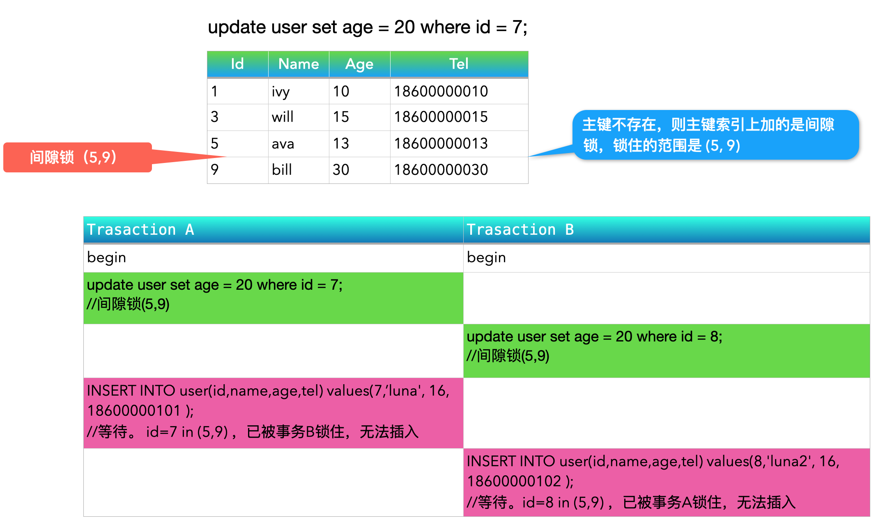

> *Gap locks in InnoDB are “purely inhibitive”, which means that their only purpose is to prevent other transactions from Inserting to the gap. Gap locks can co-exist. A gap lock taken by one transaction does not prevent another transaction from taking a gap lock on the same gap. There is no difference between shared and exclusive gap locks. They do not conflict with each other, and they perform the same function.*

**间隙锁的目的为了防止其它事务的插入到间隙锁中，但不阻止其它的事务上相同范围内的间隙锁，间隙锁之前是可以共享的。**

**间隙锁**可解决锁范围内的幻读。

事务*A*和事务*B*同时上间隙锁*(5,9)*，之后无论事务*A*还是事务*B*都无法在*(5,9)*内插入数据了，都会相互等待对方释放锁，造成死锁。

间隙锁虽然存在 X 型间隙锁和 S 型间隙锁，但是并没有什么区别，间隙锁之间是兼容的，2个线程共享相同范围间隙锁时，当升级为写锁时，造成死锁。

### 3.5 如何排查死锁

通过命令

```sql
show engine innodb status \G
```

查看近期死锁日志信息，主要关注日志中的 `LATEST DETECTED DEADLOCK` 部分

如上面的死锁实例，执行后看日志，可以看到产生死锁的2个sql

```sql
mysql> show engine innodb status \G
....
------------------------
LATEST DETECTED DEADLOCK
------------------------
2023-03-17 18:26:20 0x700003d2a000
*** (1) TRANSACTION:
TRANSACTION 86279, ACTIVE 179 sec inserting
mysql tables in use 1, locked 1
LOCK WAIT 3 lock struct(s), heap size 1136, 3 row lock(s)
-- <=========== 死锁sql_1 ===========>
MySQL thread id 8, OS thread handle 123145375526912, query id 23 localhost lee update
INSERT INTO `test2`.`user` (`id`, `name`, `age`, `tel`) VALUES (7, 'ava2', 13, 186000000132)

*** (1) HOLDS THE LOCK(S): -- 线程1持有的锁
RECORD LOCKS space id 271 page no 4 n bits 88 index PRIMARY of table `test2`.`user` trx id 86279 lock_mode X locks gap before rec
Record lock, heap no 3 PHYSICAL RECORD: n_fields 6; compact format; info bits 0
....


*** (1) WAITING FOR THIS LOCK TO BE GRANTED:  -- 线程1等待的锁
RECORD LOCKS space id 271 page no 4 n bits 88 index PRIMARY of table `test2`.`user` trx id 86279 lock_mode X locks gap before rec insert intention waiting
Record lock, heap no 3 PHYSICAL RECORD: n_fields 6; compact format; info bits 0
....


*** (2) TRANSACTION:
TRANSACTION 86280, ACTIVE 164 sec inserting
mysql tables in use 1, locked 1
LOCK WAIT 3 lock struct(s), heap size 1136, 2 row lock(s)
MySQL thread id 9, OS thread handle 123145375830016, query id 24 localhost lee update
-- <=========== 死锁sql_2 ===========>
INSERT INTO `test2`.`user` (`id`, `name`, `age`, `tel`) VALUES (8, 'bill2', 30, 186000000302)

*** (2) HOLDS THE LOCK(S): -- 线程2持有的锁
RECORD LOCKS space id 271 page no 4 n bits 88 index PRIMARY of table `test2`.`user` trx id 86280 lock_mode X locks gap before rec
Record lock, heap no 3 PHYSICAL RECORD: n_fields 6; compact format; info bits 0
....


*** (2) WAITING FOR THIS LOCK TO BE GRANTED: -- 线程2等待的锁
RECORD LOCKS space id 271 page no 4 n bits 88 index PRIMARY of table `test2`.`user` trx id 86280 lock_mode X locks gap before rec insert intention waiting
Record lock, heap no 3 PHYSICAL RECORD: n_fields 6; compact format; info bits 0
....
```


[小林coding-MySQL 是怎么加行级锁的？](https://xiaolincoding.com/mysql/lock/how_to_lock.html#%E5%94%AF%E4%B8%80%E7%B4%A2%E5%BC%95%E7%AD%89%E5%80%BC%E6%9F%A5%E8%AF%A2)