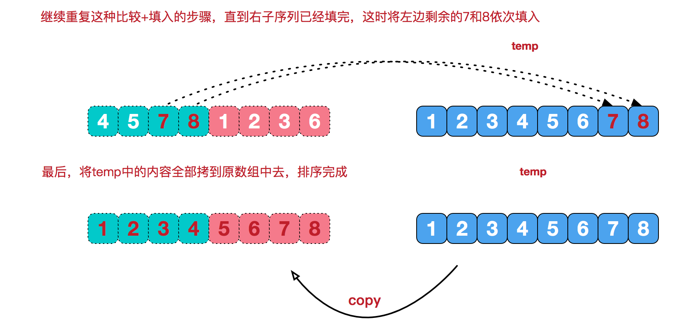

# 归并排序（Merge Sort）

## 定义

**归并排序**（Merge Sort）与快速排序思想类似：将待排序数据分成两部分，继续将两个子部分进行递归的归并排序；然后将已经有序的两个子部分进行合并，最终完成排序。其时间复杂度与快速排序均为O(nlogn)，但是归并排序除了递归调用间接使用了辅助空间栈，还需要额外的O(n)空间进行临时存储。从此角度归并排序略逊于快速排序，但是归并排序是一种稳定的排序算法，快速排序则不然。


所谓**稳定排序**，表示对于具有相同值的多个元素，其间的先后顺序保持不变。对于基本数据类型而言，一个排序算法是否稳定，影响很小，但是对于结构体数组，稳定排序就十分重要。例如对于student结构体按照关键字score进行非降序排序：

```c
// A structure data definition
typedef struct __Student
{
    char name[16];
    int score;
}Student;
// Array of students
name :  A      B     C     D
score:  80     70    75    70
 
Stable sort in ascending order:
name :  B      D     C     A
score:  70     70    75    80
 
Unstable sort in ascending order:
name :  D      B     C     A
score:  70     70    75    80

```

其中稳定排序可以保证B始终在D之前；而非稳定排序，则无法保证。


## 复杂度

归并排序是稳定排序，它也是一种十分高效的排序，能利用完全二叉树特性的排序一般性能都不会太差。java中Arrays.sort()采用了一种名为TimSort的排序算法，就是归并排序的优化版本。从上文的图中可看出，每次合并操作的平均时间复杂度为O(n)，而完全二叉树的深度为|log2n|。总的平均时间复杂度为O(nlogn)。


归并排序的最好，最坏，平均时间复杂度均为O(nlogn) 

空间复杂度：O(n) 


## 图解过程





转自：[https://www.cnblogs.com/chengxiao/p/6194356.html](https://www.cnblogs.com/chengxiao/p/6194356.html)