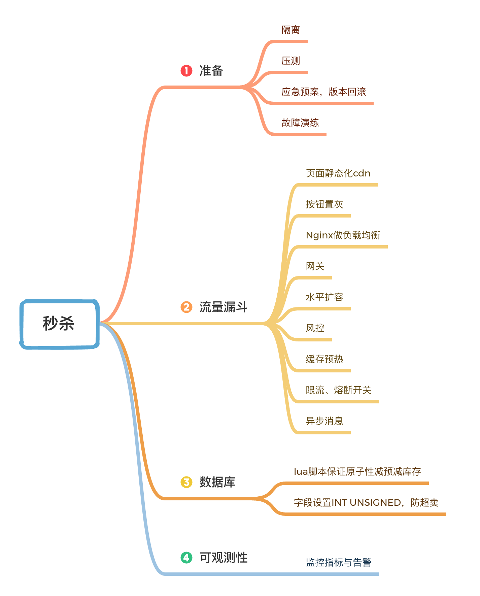

# 秒杀

## 一、特点

1、时间短

2、瞬间请求的量非常大

## 二、需求注意的点

1、不能超卖

2、防黑产、黄牛；机器的请求速度比人的手速快太多了。

3、舜间爆发的高流量

- 典型的读多写少的场景（Cache缓存）
- 页面静态化，利用CDN服务器缓存前端文件
- 按钮置灰3秒（利用风控规则过滤非法用户）
- 接口层可以做开关限流（一旦抢购结束，则直接返回失败）
- 堆机器，搭建集群，利用Nginx做负载均衡
- 热点隔离，增加资源，有限放流（熔断）多次请求合并为一次

4、尽量把请求拦截在上层。Mysql

Mysql单机读能力为5k，写能力为3k

redis单机读能力最高可达10w，写能力达到3~5w

5、预热。运营人员提前将数据写入redis

6、异步去扣减库存。（消息队列）

## 三、秒杀架构原则

1、尽量将请求拦截在系统上游，到数据库的请求应该是越来越少，应该是一个漏斗型。

--------

我的总结

#### 1、准备工作

-  隔离，和正常业务分开，以免影响正常业务。
-  风控，防机器人刷单。记录所有请求，1秒钟多次请求可以判断为机器人；专业防控安全软件；刚注册没买过东西的，提示没中。一个账号只允许接受1个请求，其他请求过滤。
-  秒杀前按钮置灰
-  缓存预热

#### 2、前端页面

CND缓存前端静态页面

#### 3、Nginx

负载均衡

如用户是否具有秒杀资格、商品状态是否正常、秒杀是否已经结束等；过滤大量无效请求。

#### 4、业务逻辑

- 业务无状态可以扩展
- 限流
- 接口做开关，结束后，关闭开关，直接返回秒杀结束。或按时间自动关开头。
- redis分布式锁，lua脚本保证原子性减预减库存；
- 队列。订单异步MQ入队列。付款后库存队列。

#### 5、数据库

- 从MQ读消息入库，异步减库存和记录日志。减小数据库压力。

- 水平分库，物理上进行分流。
- 库存字段设置INT UNSIGNED，不允许出现负值。

#### 置灰实现方案

>使用JavaScript脚本控制，**在秒杀商品静态页面中加入一个JavaScript文件引用，该JavaScript文件中包含秒杀开始标志为否**；当秒杀开始的时候生成一个新的JavaScript文件（**文件名保持不变，只是内容不一样**），更新秒杀开始标志为是，**加入下单页面的URL及随机数参数（这个随机数只会产生一个，即所有人看到的URL都是同一个，服务器端可以用redis这种分布式缓存服务器来保存随机数）**，并被用户浏览器加载，控制秒杀商品页面的展示。**这个JavaScript文件的加载可以加上随机版本号（例如xx.js?v=32353823），这样就不会被浏览器、CDN和反向代理服务器缓存**。
>
>这个JavaScript文件非常小，即使每次浏览器刷新都访问JavaScript文件服务器也不会对服务器集群和网络带宽造成太大压力。

#### 如何只允许第一个提交的订单被发送到订单子系统

由于最终能够成功秒杀到商品的用户只有一个，因此需要在用户提交订单时，检查是否已经有订单提交。如果已经有订单提交成功，则需要更新 JavaScript文件，更新秒杀开始标志为否，购买按钮变灰。事实上，由于最终能够成功提交订单的用户只有一个，为了减轻下单页面服务器的负载压力，可以**控制进入下单页面的入口，只有少数用户能进入下单页面，其他用户直接进入秒杀结束页面**。

#### 前端层的请求拦截，只能拦住小白用户（不过这是99%的用户哟），高端的程序员根本不吃这一套，写个for循环，直接调用你后端的http请求，怎么整？

> （1）**同一个uid，限制访问频度**，做页面缓存，x秒内到达站点层的请求，均返回同一页面
>
> （2）**同一个item的查询，例如手机车次**，做页面缓存，x秒内到达站点层的请求，均返回同一页面

#### 站点层的请求拦截，只能拦住普通程序员，高级黑客，假设他控制了10w台肉鸡（并且假设买票不需要实名认证），这下uid的限制不行了吧？怎么整？

> （1）大哥，我是服务层，我清楚的知道小米只有1万部手机，我清楚的知道一列火车只有2000张车票，我透10w个请求去数据库有什么意义呢？**对于写请求，做请求队列，每次只透过有限的写请求去数据层，如果均成功再放下一批，如果库存不够则队列里的写请求全部返回“已售完”**；
>
> （2）**对于读请求，还用说么？cache来抗**，不管是memcached还是redis，单机抗个每秒10w应该都是没什么问题的；

