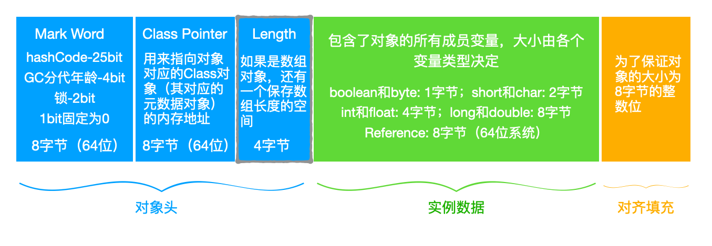
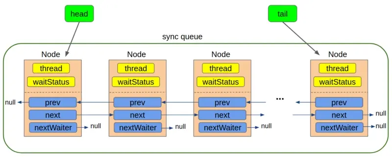
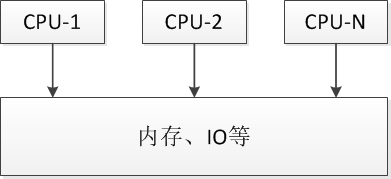
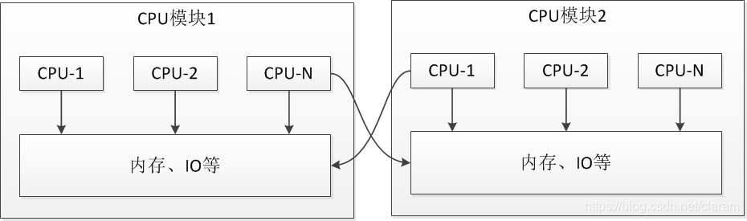
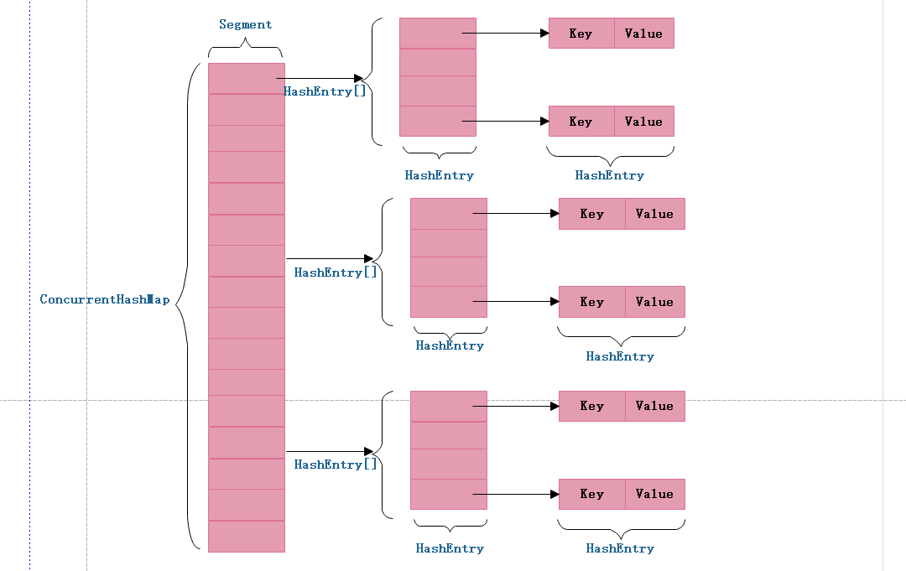

## 一、锁

### 1.1 java.有几种锁，锁的原理是什么

- 公平锁/非公平锁
- 可重入锁
- 独享锁/共享锁
- 互斥锁/读写锁
- 乐观锁/悲观锁
- 分段锁
- 偏向锁/轻量级锁/重量级锁
- 自旋锁

上面是很多锁的名词，这些分类并不是全是指锁的状态，有的指锁的特性，有的指锁的设计，下面总结的内容是对每个锁的名词进行一定的解释。

####  公平锁/非公平锁

公平锁是指多个线程按照申请锁的顺序来获取锁。
非公平锁是指多个线程获取锁的顺序并不是按照申请锁的顺序，有可能后申请的线程比先申请的线程优先获取锁。有可能，会造成优先级反转或者饥饿现象。
对于Java `ReentrantLock`而言，通过构造函数指定该锁是否是公平锁，默认是非公平锁。非公平锁的优点在于吞吐量比公平锁大。
对于`Synchronized`而言，也是一种非公平锁。由于其并不像`ReentrantLock`是通过AQS的来实现线程调度，所以并没有任何办法使其变成公平锁。

#### 可重入锁

可重入锁又名递归锁，是指在同一个线程在外层方法获取锁的时候，在进入内层方法会自动获取锁。说的有点抽象，下面会有一个代码的示例。
对于Java `ReentrantLock`而言, 他的名字就可以看出是一个可重入锁，其名字是`Re entrant Lock`重新进入锁。
对于`Synchronized`而言,也是一个可重入锁。可重入锁的一个好处是可一定程度避免死锁。

#### 独享锁/共享锁

独享锁是指该锁一次只能被一个线程所持有。
共享锁是指该锁可被多个线程所持有。

对于Java `ReentrantLock`而言，其是独享锁。但是对于Lock的另一个实现类`ReadWriteLock`，其读锁是共享锁，其写锁是独享锁。
读锁的共享锁可保证并发读是非常高效的，读写，写读 ，写写的过程是互斥的。
独享锁与共享锁也是通过AQS来实现的，通过实现不同的方法，来实现独享或者共享。
对于`Synchronized`而言，当然是独享锁。

#### 互斥锁/读写锁

上面讲的独享锁/共享锁就是一种广义的说法，互斥锁/读写锁就是具体的实现。
互斥锁在Java中的具体实现就是`ReentrantLock`
读写锁在Java中的具体实现就是`ReadWriteLock`

#### 乐观锁/悲观锁

乐观锁与悲观锁不是指具体的什么类型的锁，而是指看待并发同步的角度。
悲观锁认为对于同一个数据的并发操作，一定是会发生修改的，哪怕没有修改，也会认为修改。因此对于同一个数据的并发操作，悲观锁采取加锁的形式。悲观的认为，不加锁的并发操作一定会出问题。
乐观锁则认为对于同一个数据的并发操作，是不会发生修改的。在更新数据的时候，会采用尝试更新，不断重新的方式更新数据。乐观的认为，不加锁的并发操作是没有事情的。

从上面的描述我们可以看出，悲观锁适合写操作非常多的场景，乐观锁适合读操作非常多的场景，不加锁会带来大量的性能提升。
悲观锁在Java中的使用，就是利用各种锁。
乐观锁在Java中的使用，是无锁编程，常常采用的是CAS算法，典型的例子就是原子类，通过CAS自旋实现原子操作的更新。

#### 分段锁

分段锁其实是一种锁的设计，并不是具体的一种锁，对于`ConcurrentHashMap`而言，其并发的实现就是通过分段锁的形式来实现高效的并发操作。
我们以`ConcurrentHashMap`来说一下分段锁的含义以及设计思想，`ConcurrentHashMap`中的分段锁称为Segment，它即类似于HashMap（JDK7与JDK8中HashMap的实现）的结构，即内部拥有一个Entry数组，数组中的每个元素又是一个链表；同时又是一个ReentrantLock（Segment继承了ReentrantLock)。
当需要put元素的时候，并不是对整个hashmap进行加锁，而是先通过hashcode来知道他要放在那一个分段中，然后对这个分段进行加锁，所以当多线程put的时候，只要不是放在一个分段中，就实现了真正的并行的插入。
但是，在统计size的时候，可就是获取hashmap全局信息的时候，就需要获取所有的分段锁才能统计。
分段锁的设计目的是细化锁的粒度，当操作不需要更新整个数组的时候，就仅仅针对数组中的一项进行加锁操作。

#### 偏向锁/轻量级锁/重量级锁

这三种锁是指锁的状态，并且是针对`Synchronized`。在Java 5通过引入锁升级的机制来实现高效`Synchronized`。这三种锁的状态是通过对象监视器在对象头中的字段来表明的。

##### 偏向锁

在大多数情况下，锁总是由同一线程多次获得，不存在多线程竞争，所以出现了偏向锁，其目标就是在只有一个线程执行同步代码块时，降低获取锁带来的消耗，提高性能（可以通过J V M参数关闭偏向锁：-XX:-UseBiasedLocking=false，关闭之后程序默认会进入轻量级锁状态）。

线程执行同步代码或方法前，线程只需要判断对象头的`Mark Word`中线程`ID`与当前线程`ID`是否一致，如果一致直接执行同步代码或方法

##### 轻量级锁（自旋锁）

自旋锁是指尝试获取锁的线程不会立即阻塞，而是采用循环的方式去尝试获取锁，这样的好处是减少线程上下文切换的消耗，缺点是循环会消耗CPU。

轻量级锁是指当锁是偏向锁的时候，被另一个线程所访问，偏向锁就会升级为轻量级锁，其他线程会通过自旋的形式尝试获取锁，不会阻塞，提高性能。

##### 重量级锁

重量级锁是指当锁为轻量级锁的时候，另一个线程虽然是自旋，但自旋不会一直持续下去，当自旋一定次数的时候，还没有获取到锁，就会进入阻塞，该锁膨胀为重量级锁。重量级锁会让其他申请的线程进入阻塞，性能降低。

重量级锁是依赖操作系统的`MutexLock`（**互斥锁**）来实现的，需要从用户态转到内核态，这个成本非常高，这就是为什么`Java1.6`之前`Synchronized`效率低的原因。

#### 锁升级



一个对象在内存中分为三部分：对象头、实例数据、对齐填充。
对象头中主要存放了
Mark Word: GC 分代年龄、偏向锁、偏向 id、锁类型、hash 值等
Class Poiner: 用来指向对象对应的Class对象（其对应的元数据对象）的内存地址

`Java`中每个对象都拥有对象头，对象头由`Mark World` 、指向类的指针、以及数组长度三部分组成，本文，我们只需要关心`Mark World` 即可，`Mark World` 记录了对象的`HashCode`、分代年龄和锁标志位信息。

**Mark World简化结构**

| 锁状态   | 存储内容                                                | 锁标记 |
| :------- | :------------------------------------------------------ | :----- |
| 无锁     | 对象的hashCode、对象分代年龄、是否是偏向锁（0）         | 01     |
| 偏向锁   | 偏向线程ID、偏向时间戳、对象分代年龄、是否是偏向锁（1） | 01     |
| 轻量级锁 | 指向栈中锁记录的指针                                    | 00     |
| 重量级锁 | 指向互斥量（重量级锁）的指针                            | 10     |

读者们只需知道，锁的升级变化，体现在锁对象的对象头`Mark World`部分，也就是说`Mark World`的内容会随着锁升级而改变。

`Java1.5`以后为了减少获取锁和释放锁带来的性能消耗，引入了**偏向锁**和**轻量级锁**，`Synchronized`的升级顺序是 「**无锁-->偏向锁-->轻量级锁-->重量级锁，只会升级不会降级**」

### 1.2 synchronized

Synchronized关键字可以用来修饰方法或者代码块。对于同步方法，JVM 采用 ACC_SYNCHRONIZED 标记符来实现同步。 对于同步代码块。JVM 采用 monitorenter、monitorexit 两个指令来实现同步。

在JDK1.6之后对对synchronized锁进行了升级，在1.6之前synchronized直接加重量级锁，但是1.6之后对其性能进行了优化，采用锁升级的机制：偏向锁->自旋锁(轻量级锁)->重量级锁。

初次执行到synchronized代码块的时候，锁对象变成偏向锁。线程执行并不会主动释放锁。第二次到达代码块的时候，线程会判断之前的线程是不是自己，如果是自己的话，由于前面没有释放锁的操作，这里也就不用重新加锁，就没有加锁、解锁的开销了。

当第二个线程过来，两个线程产生了竞争，就会从偏向锁升级成自旋锁。自旋锁竞争状态中，没有获得锁的线程，就会不断自旋判断自己是否拿到了锁，没有拿到锁就会忙等。

#### `Synchronized`的使用用方式有三种

- 修饰普通函数，监视器锁（`monitor`）便是对象实例（`this`）
- 修饰静态静态函数，视器锁（`monitor`）便是对象的`Class`实例（每个对象只有一个`Class`实例），又因为Class的相关数据存储在永久带PermGen（jdk1.8则是metaspace），永久带是全局共享的，因此静态方法锁相当于类的一个全局锁，会锁所有调用该方法的线程
- 修饰代码块，监视器锁（`monitor`）是指定对象实例

#### synchronized原理

在对synchronized修饰的方法所在的类进行反编译后，我们发现存在`monitorenter`与`monitorexit`指令（**获取锁、释放锁**）。

`monitorenter`指令插入到同步代码块的开始位置，`monitorexit`指令插入到同步代码块的结束位置，`JVM`需要保证每一个 `monitorenter`都有`monitorexit`与之对应。

synchronized的对象锁，其指针指向的是一个monitor对象（由C++实现）的起始地址。每个对象实例都会有一个 monitor。其中monitor可以与对象一起创建、销毁；亦或者当线程试图获取对象锁时自动生成。**任何对象**都有一个监视器锁（`monitor`）关联，线程执行`monitorenter`指令时尝试获取`monitor`的所有权。

```java
ObjectMonitor() {
  _count        = 0; //记录个数
  _owner        = NULL; // 运行的线程
  //两个队列
  _WaitSet      = NULL; //调用 wait 方法会被加入到_WaitSet
  _EntryList    = NULL ; //锁竞争失败，会被加入到该列表
}
```

`_owner`指向持有ObjectMonitor对象的线程。当多个线程同时访问一段同步代码时，会先存放到 _EntryList 集合中，接下来当线程获取到对象的monitor时，就会把_owner变量设置为当前线程。同时count变量+1。如果线程调用wait() 方法，就会释放当前持有的monitor，那么_owner变量就会被置为null，同时_count减1，并且该线程进入 WaitSet集合中，等待下一次被唤醒

根据虚拟机规范要求，在执行monitorenter指令时，首先要尝试获取对象锁，也就是monitor对象。如果这个对象没有被锁定，或者当前线程已经拥有了这个对象的锁，那么就把锁的计数器（_count）加1。当然与之对应执行monitorexit指令时，锁的计数器（_count）也会减1

#### synchronized修饰在方法

字节码中并没有monitorenter指令和monitorexit指令，取得代之的是ACC_SYNCHRONIZED标识，JVM通过ACC_SYNCHRONIZED标识，就可以知道这是一个需要同步的方法，进而执行上述同步的过程，也就是_count加1，这些过程。

#### 字节码中，有俩个monitorexit指令，这是为什么呢？
编译器需要确保方法中调用过的每条monitorenter指令都要执行对应的monitorexit 指令。为了保证在方法异常时，monitorenter和monitorexit指令也能正常配对执行，编译器会自动产生一个异常处理器，它的目的就是用来执行异常的monitorexit指令。而字节码中多出的monitorexit指令，就是异常结束时，被执行用来释放monitor的。

####  两个线程是否可以同是访问一个对象的两个不同的synchronized方法?  

多个线程访问同一个类的synchronized方法时, 都是串行执行的 ! 就算有多个cpu也不例外 ! synchronized方法使用了类java的内置锁, 即锁住的是方法所属对象本身. 同一个锁某个时刻只能被一个执行线程所获取, 因此其他线程都得等待锁的释放. 因此就算你有多余的cpu可以执行, 但是你没有锁, 所以你还是不能进入synchronized方法执行, CPU因此而空闲. 如果某个线程长期持有一个竞争激烈的锁, 那么将导致其他线程都因等待所的释放而被挂起, 从而导致CPU无法得到利用, 系统吞吐量低下. 因此要尽量避免某个线程对锁的长期占有 ! 

####  一个类的static构造方法加上synchronized之后的锁的影响。 

synchronized是一般对类的**当前实例（当前对象）**进行加锁，防止其他线程同时访问该类的该实例的所有synchronized块，注意这里是“类的当前实例”， 类的两个不同实例就没有这种约束了。

那 么static synchronized恰好就是要控制类的所有实例的并发访问，static synchronized是限制多线程中该类的所有实例同时访问jvm中该类所对应的代码块。实际上，在类中如果某方法或某代码块中有 synchronized，那么在生成一个该类实例后，该实例也就有一个监视块，防止线程并发访问该实例的synchronized保护块，而static synchronized则是所有该类的所有实例公用得一个监视块，这就是他们两个的区别。也就是说synchronized相当于 this.synchronized，而static synchronized相当于AClass.synchronized.

### 1.3 AQS（AbstractQueuedSynchronizer）

AbstractQueuedSynchronizer简称AQS，它是一个用于构建锁和同步容器的框架。AQS定义了一套多线程访问共享资源的同步器框架，许多同步类实现都依赖于它，如常用的ReentrantLock/Semaphore/CountDownLatch。

AQS的核心思想是，如果被请求的共享资源空闲，则将当前请求资源的线程设置为有效的工作线程，并将共享资源设置为锁定状态，如果被请求的共享资源被占用，那么就需要一套线程阻塞等待以及被唤醒时锁分配的机制，这个机制AQS是用CLH队列锁实现的，即将暂时获取不到锁的线程加入到队列中。

> CLH(Craig,Landin,and Hagersten)队列是一个虚拟的双向队列（虚拟的双向队列即不存在队列实例，仅存在结点之间的关联关系）。AQS是将每条请求共享资源的线程封装成一个CLH锁队列的一个结点（Node）来实现锁的分配。

AQS的三个关键如下：
1、**state**
state用来标记共享变量的状态，一般用volatile来修饰。
2、**queue**
当线程请求锁失败后，将线程包装为一个Node，加入到queue中，等待后续的唤醒操作。
3、**CAS**
利用CAS来修改state和queue中的入队操作等。

AQS使用一个FIFO的队列表示排队等待锁的线程，队列头节点称作“哨兵节点”或者“哑节点”，它不与任何线程关联。其他的节点与等待线程关联，每个节点维护一个等待状态waitStatus。




AQS内部实现了两个队列，一个同步队列，一个条件队列。
同步队列的作用是：当线程获取资源失败之后，就进入同步队列的尾部保持自旋等待，不断判断自己是否是链表的头节点，如果是头节点，就不断参试获取资源，获取成功后则退出同步队列。

 - 条件队列是为Lock实现的一个基础同步器，并且一个线程可能会有多个条件队列，只有在使用了Condition才会存在条件队列。
 - 同步队列和条件队列都是由一个个Node组成的。AQS内部有一个静态内部类Node

**AQS是自旋锁**：在等待唤醒的时候，经常会使用自旋（while(!cas())）的方式，不停地尝试获取锁，直到被其他线程获取成功

AQS与Synchronized有一个区别是：
  Synchronized中所有阻塞的线程都集中到了一个队列中，当有线程释放锁的时候，会将所有线程都唤醒。因为有些线程需要的条件并不满足，但是也被唤醒了，这种线程唤醒了即使得到了锁也无法执行，这就会浪费了资源。

AQS相较于Synchronized内置了多个Condition，会针对Conditon进行精确的唤醒，提高了运行效率。

#### AQS定义两种资源共享方式

1. Exclusive（独占）：只有一个线程能执行，如ReentrantLock。又可分为公平锁和非公平锁：
   - 公平锁：按照线程在队列中的排队顺序，先到者先拿到锁
   - 非公平锁：当线程要获取锁时，无视队列顺序直接去抢锁，谁抢到就是谁的

2. Share（共享）：多个线程可同时执行，如Semaphore/CountDownLatch。Semaphore、CountDownLatch、 CyclicBarrier、ReadWriteLock

ReentrantReadWriteLock可以看成是组合式，因为ReentrantReadWriteLock也就是读写锁允许多个线程同时对某一资源进行读。

#### 自定义同步器

自定义同步器在实现时只需要实现共享资源state的获取与释放方式即可，至于具体线程等待队列的维护（如获取资源失败入队/唤醒出队等），AQS已经在顶层实现好了。自定义同步器实现时主要实现以下几种方法：

- isHeldExclusively()：该线程是否正在独占资源。
- tryAcquire(int)：独占方式。尝试获取资源，成功则返回true，失败则返回false。
- tryRelease(int)：独占方式。尝试释放资源，成功则返回true，失败则返回false。
- tryAcquireShared(int)：共享方式。尝试获取资源。负数表示失败；0表示成功，但没有剩余可用资源；正数表示成功，且有剩余资源。
- tryReleaseShared(int)：共享方式。尝试释放资源，如果释放后允许唤醒后续等待结点返回true，否则返回false。

#### 设计模式-模式方法

AQS使用了模板方法模式，自定义同步器时需要重写下面几个AQS提供的模板方法：

```java
isHeldExclusively()//该线程是否正在独占资源。只有用到condition才需要去实现它。
tryAcquire(int)//独占方式。尝试获取资源，成功则返回true，失败则返回false。
tryRelease(int)//独占方式。尝试释放资源，成功则返回true，失败则返回false。
tryAcquireShared(int)//共享方式。尝试获取资源。负数表示失败；0表示成功，但没有剩余可用资源；正数表示成功，且有剩余资源。
tryReleaseShared(int)//共享方式。尝试释放资源，成功则返回true，失败则返回false。
```

#### 总结1

1. AQS中用state属性表示锁，如果能成功将state属性通过CAS操作从0设置成1即获取了锁
2. 获取了锁的线程才能将exclusiveOwnerThread设置成自己
3. addWaiter负责将当前等待锁的线程包装成Node,并成功地添加到队列的末尾，这一点是由它调用的enq方法保证的，enq方法同时还负责在队列为空时初始化队列。
4. acquireQueued方法用于在Node成功入队后，继续尝试获取锁（取决于Node的前驱节点是不是head），或者将线程挂起
5. shouldParkAfterFailedAcquire方法用于保证当前线程的前驱节点的waitStatus属性值为SIGNAL,从而保证了自己挂起后，前驱节点会负责在合适的时候唤醒自己。
6. parkAndCheckInterrupt方法用于挂起当前线程，并检查中断状态。
7. 如果最终成功获取了锁，线程会从lock()方法返回，继续往下执行；否则，线程会阻塞等待。

#### 总结2

1. 子类通过继承AQS并实现其抽象方法来管理同步状态，对于同步状态的更改通过提供的getState()、setState(int state)、compareAndSetState(int expect, int update)来进行操作，因为使用CAS操作保证同步状态的改变是原子的。
2. 子类被推荐定义为自定义同步组件的静态内部类，同步器本身并没有实现任何的同步接口，仅仅是定义了若干状态获取和释放的方法来提供自定义同步组件的使用。
3. 同步器既可以支持独占式的获取同步状态，也可以支持共享式的获取同步状态（ReentrantLock、ReentrantReadWriteLock、CountDownLatch等不同类型的同步组件）

#### AQS的延伸应用

以ReentrantLock为例，state初始化为0，表示未锁定状态。A线程lock()时，会调用tryAcquire()独占该锁并将state+1。此后，其他线程再tryAcquire()时就会失败，直到A线程unlock()到state=0（即释放锁）为止，其它线程才有机会获取该锁。当然，释放锁之前，A线程自己是可以重复获取此锁的（state会累加），这就是可重入的概念。但要注意，获取多少次就要释放多么次，这样才能保证state是能回到零态的。

再以CountDownLatch以例，任务分为N个子线程去执行，state也初始化为N（注意N要与线程个数一致）。这N个子线程是并行执行的，每个子线程执行完后countDown()一次，state会CAS减1。等到所有子线程都执行完后(即state=0)，会unpark()主调用线程，然后主调用线程就会从await()函数返回，继续后余动作。

再比如Semaphore为例，简单大致意思为：A、B、C、D线程同时争抢资源，目前卡槽大小为2，若A、B正在执行且未执行完，那么C、D线程在门外等着，一旦A、B有1个执行完了，那么C、D就会竞争看谁先执行；state初始值假设为N，后续每tryAcquire()一次，state会CAS减1，当state为0时其它线程处于等待状态，直到state>0且<N后，进程又可以获取到锁进行各自操作了；

### 1.4 ReentrantLock

ReentrantLock是Java并发中十分常用的一个类，具备类似synchronized锁的作用。但是相比synchronized, 它具备更强的能力，同时支持公平锁和非公平锁。
公平锁： 指多个线程按照申请锁的顺序来获取锁，线程直接进入队列中排队，队列中的第一个线程才能获得锁。
非公平锁： 多个线程加锁时直接尝试获取锁，能抢到锁到直接占有锁，抢不到才会到等待队列的队尾等待。

**ReentrantLock主要利用CAS+AQS队列来实现，它是一种独占锁、可重入锁，它支持公平锁和非公平锁模式**。

ReentrantLock的基本实现可以概括为：先通过CAS尝试获取锁。如果此时已经有线程占据了锁，那就加入AQS队列并且被挂起。当锁被释放之后，排在CLH队列队首的线程会被唤醒，然后CAS再次尝试获取锁。

公平锁和非公平锁不同之处在于，公平锁在获取锁的时候，不会先去检查state状态，而是直接执行aqcuire(1)

1. ReentrantLock原理：多个线程获取锁，一个线程获取到锁，其他线程排队等待锁，并挂起；当获取到锁这个节点释放锁，就会唤醒队伍的头结点。
2. ReentrantLock是个可重入锁，支持公平锁和非公平锁。ReentrantLock默认使用非公平锁
3. 可重入锁就是一个线程获得了一个锁，再重复的获取这个锁不会死锁。注意是重复获取相同的锁。
4. 非公平锁就是当前线程每次获取锁，获取不到在排队。
5. 公平锁就是都是获取锁的顺序按队伍的顺序来，当前线程不会去获取锁，直接取排队。
6. ReentrantLock是利用AQS实现，AQS就是定义了一个依赖于先进先出队列来实现阻塞锁和同步器的框架。

##### API: reentrantLock#lockInterruptibly

lockInterruptibly()方法比较特殊，当通过这个方法去获取锁时，如果其他线程正在等待获取锁，则这个线程能够响应中断，即中断线程的等待状态。也就使说，当两个线程同时通过lock.lockInterruptibly()想获取某个锁时，假若此时线程A获取到了锁，而线程B只有等待，那么对线程B调用threadB.interrupt()方法能够中断线程B的等待过程，线程B想不等的时候就可以不等。

lock.lock()和lock.lockInterruptibly()在等待获取锁的时候，线程的interrupt()无法打断lock.lock()，但是可以打断lock.lockInterruptibly()。 

### synchronized和reentrantLock区别

旧轮子有弱点，新轮子就要解决这些问题，所以要具备不会阻塞的功能，下面的三个方案都是解决这个问题的好办法（看下面表格描述你就明白三个方案的含义了）

| 特性             | API                          | 描述                                                         |
| ---------------- | ---------------------------- | ------------------------------------------------------------ |
| 能响应中断       | lockInterruptbly()           | 如果不能自己释放，那可以响应中断也是很好的。Java多线程中断机制 专门描述了中断过程，目的是通过中断信号来跳出某种状态，比如阻塞 |
| 非阻塞式的获取锁 | tryLock()                    | 尝试获取，获取不到不会阻塞，直接返回                         |
| 支持超时         | tryLock(long time, timeUnit) | 给定一个时间限制，如果一段时间内没获取到，不是进入阻塞状态，同样直接返回 |

### 1.5 锁用到的数据结构

#### CLH锁

CLH锁即Craig, Landin, and Hagersten (CLH) locks。CLH锁是一个自旋锁。能确保无饥饿性。提供先来先服务的公平性。

CLH锁也是一种基于链表的可扩展、高性能、公平的自旋锁，申请线程仅仅在本地变量上自旋，它不断轮询前驱的状态，假设发现前驱释放了锁就结束自旋。

CLH优缺点
CLH队列锁的长处是空间复杂度低（假设有n个线程。L个锁，每一个线程每次仅仅获取一个锁，那么须要的存储空间是O（L+n），n个线程有n个myNode。L个锁有L个tail），CLH的一种变体被应用在了JAVA并发框架中。唯一的缺点是在NUMA系统结构下性能非常差。在这样的系统结构下，每一个线程有自己的内存，假设前趋结点的内存位置比較远。自旋推断前趋结点的locked域，性能将大打折扣，可是在SMP系统结构下该法还是非常有效的。
一种解决NUMA系统结构的思路是MCS队列锁。

#### MCS队列

#### SMP和NUMA处理器架构区别

**SMP (对称多处理器结构）**

SMP(Symmetric Multi-Processor)，即对称多处理器结构，指服务器中多个 CPU 对称工作，每个 CPU 访问内存地址所需时间相同。其主要特征是共享，包含对 CPU，内存，I/O 等进行共享。

SMP 优点是能够保证内存一致性，缺点是这些共享的资源很可能成为性能瓶颈，随着 CPU 数量的增加，每个 CPU 都要访问相同的内存资源，可能导致内存访问冲突，可能会导致 CPU 资源的浪费。常用的 PC 机就属于这种。



**NUMA（非一致性内存访问）**

UMA(Non-Uniform Memory Access)非一致存储访问， 将 CPU 分为 CPU 模块，每个 CPU 模块由多个 CPU 组成， 并且具有独立的本地内存、 I/O 槽口等，模块之间可以通过互联模块相互访问 ，访问本地内存的速度将远远高于访问远地内存 ( 系统内其它节点的内存 ) 的速度，这也是非一致存储访问 NUMA 的由来。

NUMA 优点是可以较好地解决原来 SMP 系统的扩展问题，缺点是由于访问远程内存的延时远远超过本地内存，因此当 CPU 数量增加时，系统性能无法线性增加。




#### CLH锁和MCS队列锁的区别

在 NUMA 架构下，如果当前节点与前驱节点不在同一 CPU 模块下，跨 CPU 模块会带来额外的系统开销，而 MCS 锁更适用于 NUMA 架构。CLH结点之间是通过隐形的链表相连，之所以叫隐形的链表是因为这些结点之间没有明显的 next 指针，而是通过 myPred 所指向的结点的变化情况来影响 myNode 的行为。

MSC与CLH最大的不同并不是链表是显示还是隐式，而是线程自旋的规则不同，CLH是在前趋结点的locked域上自旋等待，而MSC是在自己的结点的locked域上自旋等待。正因为如此，它解决了CLH在NUMA系统架构中获取locked域状态内存过远的问题。

## 二、集合

####  2.1 Java中的队列都有哪些，有什么区别。  

1. 没有实现的阻塞接口的LinkedList： 
实现了java.util.Queue接口和java.util.AbstractQueue接口内置的不阻塞队列： PriorityQueue 和 ConcurrentLinkedQueue 
2. 实现阻塞接口的： 　　
java.util.concurrent 中加入了 BlockingQueue 接口和五个阻塞队列类。它实质上就是一种带有一点扭曲的 FIFO 数据结构。不是立即从队列中添加或者删除元素，线程执行操作阻塞，直到有空间或者元素可用。 五个队列所提供的各有不同： 　　
 - ArrayBlockingQueue ：一个由数组支持的有界队列。 　　
 - LinkedBlockingQueue ：一个由链接节点支持的可选有界队列。 　　
 - PriorityBlockingQueue ：一个由优先级堆支持的无界优先级队列。 　　
 - DelayQueue ：一个由优先级堆支持的、基于时间的调度队列。 　　
 - SynchronousQueue ：一个利用 BlockingQueue 接口的简单聚集（rendezvous）机制。 

1.ArrayDeque, （数组双端队列）  
2.PriorityQueue, （优先级队列）  
3.ConcurrentLinkedQueue, （基于链表的并发队列）  
4.DelayQueue, （延期阻塞队列）（阻塞队列实现了BlockingQueue接口）  
5.ArrayBlockingQueue, （基于数组的并发阻塞队列）  
6.LinkedBlockingQueue, （基于链表的FIFO阻塞队列）  
7.LinkedBlockingDeque, （基于链表的FIFO双端阻塞队列） 
8.PriorityBlockingQueue, （带优先级的无界阻塞队列）  9.SynchronousQueue （并发同步阻塞队列） 

### 2.2 BlockingQueue

#### ArrayBlockingQueue

ArrayBlockingQueue是数组实现的线程安全的有界的阻塞队列，此队列按 FIFO（先进先出）原则对元素进行排序。 队列的头部是在队列中存在时间最长的元素，队列的尾部是在队列中存在时间最短的元素。

默认情况下不保证线程公平的访问队列，所谓公平访问队列是指阻塞的线程，可以按照阻塞的先后顺序访问队列，即先阻塞线程先访问队列。非公平性是对先等待的线程是非公平的，当队列可用时，阻塞的线程都可以争夺访问队列的资格，有可能先阻塞的线程最后才访问队列。初始化时有参数可以设置。

**ArrayBlockingQueue利用 ReentrantLock 实现线程安全，是(非)公平访问是通过ReentrantLock的是(非)公平锁来实现的。**

几个重要的方法:

- add(E e)：把 e 加到 BlockingQueue 里，即如果 BlockingQueue 可以容纳，则返回 true，否则报异常
- offer(E e)：表示如果可能的话，将 e 加到 BlockingQueue 里，即如果 BlockingQueue 可以容纳，则返回 true，否则返回 false
- put(E e)：把 e 加到 BlockingQueue 里，如果 BlockQueue 没有空间，则调用此方法的线程被阻断直到 BlockingQueue 里面有空间再继续
- poll(time)：取走 BlockingQueue 里排在首位的对象，若不能立即取出，则可以等 time 参数规定的时间，取不到时返回 null
- take()：取走 BlockingQueue 里排在首位的对象，若 BlockingQueue 为空，阻断进入等待状态直到 Blocking 有新的对象被加入为止
- remainingCapacity()：剩余可用的大小。等于初始容量减去当前的 size

**ArrayBlockingQueue的是(非)公平访问是通过ReentrantLock的是(非)公平锁来实现的**

```java
private final Condition notEmpty;
private final Condition notFull;

public ArrayBlockingQueue(int capacity, boolean fair) {
  //...
  this.items = new Object[capacity];
  lock = new ReentrantLock(fair);  //<---- ReentrantLock的是(非)公平锁来实现的
  notEmpty = lock.newCondition();  //堵塞和唤醒使用Condition，wait,notify已弃用
  notFull =  lock.newCondition();
}
```

**put和take的堵塞和唤醒**

put()和offer()的区别是，put()在队列满的时候，会阻塞。

take()和poll()的区别就是当队列为空的时候，take()会阻塞。

```java
public void put(E e) throws InterruptedException {
        Objects.requireNonNull(e);
        final ReentrantLock lock = this.lock; //<------ 利用 ReentrantLock 实现线程安全
        lock.lockInterruptibly();      //<------ 获取锁
        try {
            while (count == items.length)
                notFull.await();    //<------ notFull堵塞
            enqueue(e);
        } finally {
            lock.unlock();
        }
    }
```

put在队列满的时候，通过`notFull.await();`堵塞队列，然后在消费者从队列中消费后，通过`notFull.signal()`唤醒堵塞

```java
public E take() throws InterruptedException {
  final ReentrantLock lock = this.lock;
  lock.lockInterruptibly();       //<------ 获取锁
  try {
    while (count == 0)
      notEmpty.await();
    return dequeue();
  } finally {
    lock.unlock();
  }
}
private E dequeue() {
  final Object[] items = this.items;
  @SuppressWarnings("unchecked")
  E e = (E) items[takeIndex];
  items[takeIndex] = null;
  if (++takeIndex == items.length) takeIndex = 0;
  count--;
  if (itrs != null)
    itrs.elementDequeued();
  notFull.signal();   //<------ notFull唤醒
  return e;
}
public E poll() {   //<-------- 有带时间参数的重载方法 poll(long timeout, TimeUnit unit)
  final ReentrantLock lock = this.lock;
  lock.lock();
  try {
    return (count == 0) ? null : dequeue();  //<------ 这里不会堵塞
  } finally {
    lock.unlock();
  }
}
```

#### LinkedBlockingQueue

LinkedBlockingQueue内部由单链表实现，只能从head取元素，从tail添加元素。添加元素和获取元素都有独立的锁，也就是说LinkedBlockingQueue是读写分离的，读写操作可以并行执行。

LinkedBlockingQueue也同样提基于ReentrantLock来实现锁的机制。

LinkedBlockingQueue使用到的锁如下：

```java
private final ReentrantLock takeLock = new ReentrantLock();

/** Wait queue for waiting takes */
private final Condition notEmpty = takeLock.newCondition();

/** Lock held by put, offer, etc */
private final ReentrantLock putLock = new ReentrantLock();

/** Wait queue for waiting puts */
private final Condition notFull = putLock.newCondition();
```

1. LinkedBlockingQueue是通过锁分离的方式进行控制，减少了take和put之间的锁竞争。
2. LinkedBlockingQueue是通过链表的方式实现，所以进行锁分离时不会冲突，因为入队和出队分别作用于队尾和队首。
3. 内部采用了原子操作类（CAS: AtomicInteger count）进行控制链表长度。
4. 入队后，如果之前队列为空时，会通知take方法，队列已有数据可进行take，反之，出队后，队列之前已满，则通知put方法，队列已有空闲位置可进行put操作。

#### ArrayBlockingQueue和LinkedBlockingQueue区别

1. 队列大小有所不同，ArrayBlockingQueue是有界的初始化必须指定大小，而LinkedBlockingQueue可以是有界的也可以是无界的(Integer.MAX_VALUE)，对于后者而言，当添加速度大于移除速度时，在无界的情况下，可能会造成内存溢出等问题。
2. 数据存储容器不同，ArrayBlockingQueue基于数组，LinkedBlockingQueue基于链表，是以Node节点作为连接对象。
3. 由于ArrayBlockingQueue采用的是数组的存储容器，因此在插入或删除元素时不会产生或销毁任何额外的对象实例，而LinkedBlockingQueue则会生成一个额外的Node对象。这可能在长时间内需要高效并发地处理大批量数据的时，对于GC可能存在较大影响。
4. 两者的实现队列添加或移除的锁不一样，ArrayBlockingQueue实现的队列中的锁是没有分离的，即添加操作和移除操作采用的同一个ReenterLock锁，而LinkedBlockingQueue实现的队列中的锁是分离的，其添加采用的是putLock，移除采用的则是takeLock，这样能大大提高队列的吞吐量，也意味着在高并发的情况下生产者和消费者可以并行地操作队列中的数据，以此来提高整个队列的并发性能。

### 2.3 HashMap

[Java 8系列之重新认识HashMap](../coreJava/Java 8系列之重新认识HashMap.md)

#### HashMap是怎么扩展长度？什么时候扩展

当hashmap中的元素个数超过数组大小*loadFactor时，就会进行数组扩容，loadFactor的默认值为0.75，也就是说，默认情况下，数组大小为16，那么当hashmap中元素个数超过16*0.75=12的时候，就把数组的大小扩展为2*16=32，即扩大一倍，然后重新计算每个元素在数组中的位置，而这是一个非常消耗性能的操作。

jdk1.8在链表长度大于等于8的时候，转为红黑树插入；当小于等于6的时候转成链表。

这边也可以引申到一个问题HashMap是先插入还是先扩容：HashMap初始化后首次插入数据时，先发生resize扩容再插入数据，之后每当插入的数据个数达到threshold时就会发生resize，此时是先插入数据再resize。

resize重新计算
h & (length - 1); //hash值&表长度
使用的是2次幂的扩展(指长度扩为原来2倍)，所以，元素的位置要么是在原位置，要么是在原位置再移动2次幂的位置。
扩充HashMap的时候，不需要像JDK1.7的实现那样重新计算hash，只需要看看原来的hash值新增的那个bit是1还是0就好了，是0的话索引没变，是1的话索引变成“原索引+oldCap”。oldCap是扩容的大小
这个设计确实非常的巧妙，既省去了重新计算hash值的时间，而且同时，由于新增的1bit是0还是1可以认为是随机的，因此resize的过程，均匀的把之前的冲突的节点分散到新的bucket了。这一块就是JDK1.8新增的优化点。有一点注意区别，JDK1.7中rehash的时候，旧链表迁移新链表的时候，如果在新表的数组索引位置相同，则链表元素会倒置。
https://blog.csdn.net/paincupid/article/details/107615433

#### 准备用HashMap存1w条数据，构造时传10000还会触发扩容吗？

table.size == threshold * loadFactor
HashMap 并不是直接使用外部传递进来的 initialCapacity，而是经过了 tableSizeFor() 方法的处理，再赋值到 threshole 上

那么当我们从外部传递进来 1w 时，实际上经过 tableSizeFor() 方法处理之后，就会变成 2 的 14 次幂 16384，再算上负载因子 0.75f，实际在不触发扩容的前提下，可存储的数据容量是 12288（16384 * 0.75f）。
HashMap 初始容量指定为 1000，扩容的重要依据扩容阈值会在 resize() 中调整为 768（1024 * 0.75）。它是不足以承载 1000 条数据的，最终在存够 1k 条数据之前，还会触发一次动态扩容。

### 2.4 ConcurrencyHashMap

jdk1.7中的ConcurrencyHashMap
ConcurrentHashMap 为了提高本身的并发能力，在内部采用了一个叫做 Segment 的结构，一个 Segment 其实就是一个类 Hash Table 的结构，Segment 内部维护了一个链表数组。


ConcurrentHashMap采用了二次hash的方式，第一次hash将key映射到对应的segment，而第二次hash则是映射到segment的不同桶(bucket)中。
为什么要用二次hash，主要原因是为了构造分离锁，使得对于map的修改不会锁住整个容器，提高并发能力。当然，没有一种东西是绝对完美的，二次hash带来的问题是整个hash的过程比hashmap单次hash要长。

jdk1.8中的ConcurrencyHashMap
在 JAVA8 中它摒弃了 Segment（锁段）的概念，而是启用了一种全新的方式实现，利用 CAS 算法和红黑树。

### 2.5 treeMap

TreeMap 继承于AbstractMap ，其是一个 有序的key-value集合，内部基于 红黑树 实现；TreeMap 根据 其key的自然顺序进行排序，或者在构造方法中指定 Comparator 进行排序；TreeMap的基本操作 containsKey()、get()、put() 和 remove() 的时间复杂度是 log(n)。
另外，TreeMap是非同步的。

#### 红黑树特征
1、根节点是黑
2、所有叶子节点是黑
3、所有的节点都是红黑相间
4、每个节点或者是黑色，或者是红色。
5、从一个节点到该节点的子孙节点的所有路径上包含相同数目的黑节点。[这里指到叶子节点的路径]

红黑树的查询效率：O(logn)

### 2.5 CopyOnWriteArrayList

CopyOnWriteArrayList是一个线程安全的ArrayList，对其进行的修改操作都是在底层的一个复制的数组（快照）上进行的，也就是使用了写时复制策略。而ReenTrantLock则用来保证只有一个线程对Array进行修改。

### 2.6 LinkedList

LinkedList内部封装的是双向链表数据结构

##### LinkedList#get为什么慢

一半前正序遍历、一半后倒序遍历

```java
public E get(int index) {
    checkElementIndex(index);
    return node(index).item;
}
Node<E> node(int index) {
	//一半前正序遍历
	if (index < (size >> 1)) {
	    Node<E> x = first;
	    for (int i = 0; i < index; i++)
	        x = x.next;
	    return x;
	} else {//一半后倒序遍历
	    Node<E> x = last;
	    for (int i = size - 1; i > index; i--)
	        x = x.prev;
	    return x;
	}
}
```


## 三、线程

### volatile

1、保证可见性
2、禁止指令重排序优化

volatile 修饰的变量，是直接拿的主内存的值，就是说这个值永远是最新的，对其他线程是可见的。而访问非 volatile 变量时，每个线程都会从系统内存（主内存）拷贝变量到工作内存中，然后修改工作内存中的变量值，操控的变量可能不同。

在一个变量被 volatile 修饰后，JVM 会为我们做两件事：
在每个 volatile 写操作前插入 StoreStore 屏障，在写操作后插入 StoreLoad 屏障。（StoreStore-写-StoreLoad）

在每个 volatile 读操作前插入 LoadLoad 屏障，在读操作后插入LoadStore屏障。（LoadLoad-读-LoadStore）

volatile 是不安全的
虽然 volatile 可见性保证了对 volatile 变量所有的写操作都能立刻反应到其他线程之中（即 volatile 变量在各个线程中都是一致的），但是 Java 里面的运算并非原子操作。只有是原子操作的 volatile 变量才是线程安全的，比如我们很常见的 变量++ 自增操作，在这个过程中，自增包括取数，加一，保存三个过程的操作，所以自增并不是原子性操作，使用 volatile 修饰的变量自增操作仍然是不安全的。

### Java中主线程如何捕获子线程抛出的异常

线程设计的理念：“线程的问题应该线程自己本身来解决，而不要委托到外部。”
线程方法的异常只能自己来处理。
给某个thread设置一个UncaughtExceptionHandler，可以确保在该线程出现异常时能通过回调UncaughtExceptionHandler接口的public void uncaughtException(Thread t, Throwable e) 方法来处理异常

但是，给某个thread设置一个UncaughtExceptionHandler，可以确保在该线程出现异常时能通过回调UncaughtExceptionHandler接口的public void uncaughtException(Thread t, Throwable e) 方法来处理异常，这样的好处或者说目的是可以在线程代码边界之外（Thread的run()方法之外），有一个地方能处理未捕获异常。但是要特别明确的是：虽然是在回调方法中处理异常，但这个回调方法在执行时依然还在抛出异常的这个线程中！另外还要特别说明一点：如果线程是通过线程池创建，线程异常发生时UncaughtExceptionHandler接口不一定会立即回调。

### ThreadLocal?

[ThreadLocal](../coreJava/ThreadLocal.md)

WeakHashMap的key是用的WeakReference，在没有其它强引用的情况下，下一次GC时才会被垃圾回收

- key和value都没有引用的时候，key都会被回收
- key如果有强引用的话，key是不会被回收的，value也不会被回收
- 如果value有强引用的话，key没有被强引用，也是照样可以被回收的

tomcat 使用的是线程池，在请求后，线程并不收回，所以ThreadLocal的key也没有被收回，因为key没有被收回，value也不会被收回。 

ThreadLocal最好要配合remove()方法来用。

#### ThreadLocal类型变量为何声明为静态

Java 中每个线程都有与之关联的Thread对象，Thread对象中有一个ThreadLocal.ThreadLocalMap类型的成员变量，该变量是一个Hash表， 所以每个线程都单独维护这样一个Hash表，当ThreadLocal类型对象调用set方法时，threadLocalID.set(id)，这个set方法会使用当前线程维护的Hash表，把自己作为key, id作为value插入到Hash表中。由于每个线程维护的Hash表是独立的，因此在不同的Hash表中，key值即使相同也是没问题的。

如果把threadLocalID声明为非静态，则在类A的每个实例中都会产生一个新对象，这是毫无意义的，只是增加了内存消耗。


把ThreadLocal定义为static还有一个好处就是，由于ThreadLocal有强引用在，那么在ThreadLocalMap里对应的Entry的键会永远存在，那么执行remove的时候就可以正确进行定位到并且删除！！！

实际上 ThreadLocalMap 中使用的 key 为 ThreadLocal 的弱引用，弱引用的特点是，如果这个对象只存在弱引用，那么在下一次垃圾回收的时候必然会被清理掉。
所以如果 ThreadLocal 没有被外部强引用的情况下，在垃圾回收的时候会被清理掉的，这样一来 ThreadLocalMap中使用这个 ThreadLocal 的 key 也会被清理掉。但是，value 是强引用，不会被清理，这样一来就会出现 key 为 null 的 value。
ThreadLocalMap实现中已经考虑了这种情况，在调用 set()、get()、remove() 方法的时候，会清理掉 key 为 null 的记录。如果说会出现内存泄漏，那只有在出现了 key 为 null 的记录后，没有手动调用 remove() 方法，并且之后也不再调用 get()、set()、remove() 方法的情况下。

[ThreadLocal 面试夺命11连问](https://blog.csdn.net/agonie201218/article/details/125933740)

### InheritableThreadLocal和TransmittableThreadLocal

```java
//初始化一个线程时,获取当前线程,作为父线程
 Thread parent = currentThread();
//如果父线程inheritableThreadLocals 不为空时,子线程复制一份inheritableThreadLocals 
 if (parent.inheritableThreadLocals != null)
            this.inheritableThreadLocals =
                ThreadLocal.createInheritedMap(parent.inheritableThreadLocals);
```


### LockSupport.park和LockSupport.unpark

LockSupport.park是通过UnSafe类使用了CPU的原语。在AQS中使用park的主要作用是，让排队的线程阻塞掉（停止其自旋，自旋会消耗CPU资源），并在需要的时候，可以方便的唤醒阻塞掉的线程。

LockSupport.park()后，通过jstack查看，线程进入到**WAITING**,这里的状态是线程在JVM中的线程状态，通过ps命令查看本进程中的操作系统线程状态，线程的状态是**Sleep**。

如何解除线程的WAITING/Sleep，让线程继续运行呢？第一种方式通过LockSupport.unpark(thread)，第二种方式通过thread.interrupt()。

1. wait，notify 和 notifyAll 必须配合 Object Monitor 一起使用，而 park，unpark 不必
2. park & unpark 是以线程为单位来【阻塞】和【唤醒】线程，而 notify 只能随机唤醒一个等待线程，notifyAll 是唤醒所有等待线程，就不那么【精确】
3. park & unpark 可以先 unpark，而 wait & notify 不能先 notify

### 让主线程等待子任务执行的各种方式

1、利用java多线程工具Future.get()获取数据
2、利用CountDownLatch让主线程等待子线程任务结束
3、利用CyclicBarrier让主线程等待子线程
4、利用CompletionService

## 四、线程池

####  corePoolSize 、maximumPoolSize 

线程池的基本大小，即在没有任务需要执行的时候线程池的大小，并且只有在工作队列满了的情况下才会创建超出这个数量的线程。这里需要注意的是：在刚刚创建ThreadPoolExecutor的时候，线程并不会立即启动，而是要等到有任务提交时才会启动，除非调用了prestartCoreThread/prestartAllCoreThreads事先启动核心线程。再考虑到keepAliveTime和allowCoreThreadTimeOut超时参数的影响，所以没有任务需要执行的时候，线程池的大小不一定是corePoolSize。 

如果当前大小已经达到了corePoolSize 大小，就将新提交的任务提交到阻塞队列排队，等候处理workQueue.offer(command)； 

如果队列容量已达上限，并且当前大小poolSize没有达到maximumPoolSize，那么就新增线程来处理任务； 

如果队列已满，并且当前线程数目也已经达到上限，那么意味着线程池的处理能力已经达到了极限，此时需要拒绝新增加的任务。至于如何拒绝处理新增 

#### newFixedThreadPool此种线程池如果线程数达到最大值后会怎么办，底层原理 

更多可查看：[Java线程池实现原理及其在美团业务中的实践](Java线程池实现原理及其在美团业务中的实践.md)

### 线程池的submit和execute方法区别

1、接收的参数不一样
都可以是Runnable
submit 也可以是Callable

2、submit有返回值，而execute没有
返回值是Future

3、submit方便Exception处理

### CompletionService

CompletionService的实现目标是任务先完成可优先获取到，即结果按照完成先后顺序排序。
CompletionService实际上可以看做是Executor和BlockingQueue的结合体。CompletionService在接收到要执行的任务时，通过类似BlockingQueue的put和take获得任务执行的结果。
CompletionService的一个实现是ExecutorCompletionService，ExecutorCompletionService把具体的计算任务交给Executor完成。在实现上，ExecutorCompletionService在构造函数中会创建一个BlockingQueue（使用的基于链表的无界队列LinkedBlockingQueue），该BlockingQueue的作用是保存Executor执行的结果。

### 如何合理设置线程池大小

要想合理的配置线程池的大小，首先得分析任务的特性，可以从以下几个角度分析：

任务的性质：CPU密集型任务、IO密集型任务、混合型任务。
任务的优先级：高、中、低。
任务的执行时间：长、中、短。
任务的依赖性：是否依赖其他系统资源，如数据库连接等。
性质不同的任务可以交给不同规模的线程池执行。

对于不同性质的任务来说，CPU密集型任务应配置尽可能小的线程，如配置CPU个数+1的线程数，IO密集型任务应配置尽可能多的线程，因为IO操作不占用CPU，不要让CPU闲下来，应加大线程数量，如配置两倍CPU个数+1，而对于混合型的任务，如果可以拆分，拆分成IO密集型和CPU密集型分别处理，前提是两者运行的时间是差不多的，如果处理时间相差很大，则没必要拆分了。

若任务对其他系统资源有依赖，如某个任务依赖数据库的连接返回的结果，这时候等待的时间越长，则CPU空闲的时间越长，那么线程数量应设置得越大，才能更好的利用CPU。
当然具体合理线程池值大小，需要结合系统实际情况，在大量的尝试下比较才能得出，以上只是前人总结的规律。

在这篇如何合理地估算线程池大小？文章中发现了一个估算合理值的公式

最佳线程数目 = （（线程等待时间+线程CPU时间）/线程CPU时间 ）* CPU数目

比如平均每个线程CPU运行时间为0.5s，而线程等待时间（非CPU运行时间，比如IO）为1.5s，CPU核心数为8，那么根据上面这个公式估算得到：((0.5+1.5)/0.5)*8=32。这个公式进一步转化为：

最佳线程数目 = （线程等待时间与线程CPU时间之比 + 1）* CPU数目
可以得出一个结论：
线程等待时间所占比例越高，需要越多线程。线程CPU时间所占比例越高，需要越少线程。
以上公式与之前的CPU和IO密集型任务设置线程数基本吻合。


## 五、类加载

### JVM类加载过程

### Class.forName和classloader的区别  

java中Class.forName 和ClassLoader.loadClass 都可用来对类进行加载。 

class.forName()前者除了将类的.class文件加载到jvm中之外，还会对类进行解释，执行类中的static块。

而classLoader只干一件事情，就是将.class文件加载到jvm中，不会执行static中的内容,只有在newInstance才会去执行static块。 


## 六、代理

### JDK和CGLib动态代理

Jdk动态代理：利用拦截器（必须实现InvocationHandler接口）加上反射机制生成一个代理接口的匿名类，在调用具体方法前调用InvokeHandler来处理
Cglib动态代理：利用ASM框架，对代理对象类生成的class文件加载进来，通过修改其字节码生成子类来进行代理

关于两者之间的性能的话，JDK动态代理所创建的代理对象，在以前的JDK版本中，性能并不是很高，虽然在高版本中JDK动态代理对象的性能得到了很大的提升，但是他也并不是适用于所有的场景。主要体现在如下的两个指标中：

1. 如果想要实现JDK动态代理那么代理类必须实现接口; 如果想要使用CGlib动态代理，那么代理类不能使用final修饰类和方法。
2. CGLib所创建的动态代理对象在实际运行时候的性能要比JDK动态代理高不少，有研究表明，大概要高10倍；
3. 但是CGLib在创建对象的时候所花费的时间却比JDK动态代理要多很多，有研究表明，大概有8倍的差距；
4. 对于singleton的代理对象或者具有实例池的代理，因为无需频繁的创建代理对象，所以比较适合采用CGLib动态代理，反正，则比较适用JDK动态代理。


## 七、客户端相关

####  session和cookie的区别和联系，session的生命周期，多个服务部署时session管理。  

cookie机制采用的是在客户端保持状态的方案，而session机制采用的是在服务器端保持状态的方案 
一、对于cookie：
①cookie是创建于服务器端
②cookie保存在浏览器端
③cookie的生命周期可以通过cookie.setMaxAge(2000);来设置，如果没有设置setMaxAge, 则cookie的生命周期当浏览器关闭的时候，就消亡了
④cookie可以被多个同类型的浏览器共享  可以把cookie想象成一张表

比较：
①存在的位置：
cookie 存在于客户端，临时文件夹中
session：存在于服务器的内存中，一个session域对象为一个用户浏览器服务
②安全性
cookie是以明文的方式存放在客户端的，安全性低，可以通过一个加密[算法]http://lib.csdn.net/base/datastructure)进行加密后存放session存放于服务器的内存中，所以安全性好
③网络传输量
cookie会传递消息给服务器
session本身存放于服务器，不会有传送流量
④生命周期(以20分钟为例)
(1)cookie的生命周期是累计的，从创建时，就开始计时，20分钟后，cookie生命周期结束，
(2)session的生命周期是间隔的，从创建时，开始计时如在20分钟，没有访问session，那么session生命周期被销毁
但是，如果在20分钟内（如在第19分钟时）访问过session，那么，将重新计算session的生命周期
(3)关机会造成session生命周期的结束，但是对cookie没有影响
⑤访问范围
session为一个用户浏览器独享
cookie为多个用户浏览器共享


## 八、其它

### 8.1 关键字

#### 基础类型占用内存大小

boolean和byte: 1字节；short和char: 2字节
int和float: 4字节；long和double: 8字节
Reference: 8字节（64位系统）

#### transient

类的有些属性需要序列化，而其他属性不需要被序列化，这些信息对应的变量就可以加上transient关键字。换句话说，这个字段的生命周期仅存于调用者的内存中而不会写到磁盘里持久化。
java 的transient关键字为我们提供了便利，你只需要实现Serilizable接口，将不需要序列化的属性前添加关键字transient，序列化对象的时候，这个属性就不会序列化到指定的目的地中。
transient关键字只能修饰变量，而不能修饰方法和类。
一个静态变量不管是否被transient修饰，均不能被序列化

我们知道在Java中，对象的序列化可以通过实现两种接口来实现，若实现的是Serializable接口，则所有的序列化将会自动进行，若实现的是Externalizable接口，则没有任何东西可以自动序列化，需要在writeExternal方法中进行手工指定所要序列化的变量，这与是否被transient修饰无关。因此第二个例子输出的是变量content初始化的内容，而不是null。

#### StringBuilder

String:不可变类，属性value为不可变数组，不存在字符数组扩容一说。字符串拼接，截取，都会生成一个新的对象。频繁操作字符串效率低下，因为每次都会生成新的对象。

StringBuilder 类内部维护可变长度char[] ， 初始化数组容量为16，存在扩容， 其append拼接字符串方法内部调用System的native方法，进行数组的拷贝，不会重新生成新的StringBuilder对象。

StringBuffer 类内部维护可变长度char[]， 基本上与StringBuilder一致，但其为线程安全的字符串操作类，大部分方法都采用了Synchronized关键字修改，以此来实现在多线程下的操作字符串的安全性。

#### Queue与Deque的区别
Queue以及Deque都是继承于Collection，Deque是Queue的子接口。
Queue是FIFO的单端队列，Deque是双端队列。

LinkedList内部封装的是双向链表数据结构

#### Integer.parseInt原理

1、前置条件判断：字符串非空；2<radix<36（radix表示进制）
2、符号位和范围判断： Integer.MIN_VALUE<result<Integer.MAX_VALUE。MIN_VALUE = 0x80000000;MAX_VALUE = 0x7fffffff，即[-2^31,2^31-1]一个int值占4个字节byte，一个字节是8位bit（即8个二进制位），所以int型占32位。
3、核心代码

```java
while (i < len) {
	digit = Character.digit(s.charAt(i++),radix);
	result *= radix;
	result -= digit; //digit：第i位上的字符转换为对应数字
}
return negative ? result : -result;
```

Integer.valueOf就是调用的Integer.parseInt

```java
public static Integer valueOf(String s) throws NumberFormatException {
    return Integer.valueOf(parseInt(s, 10));
}
```

#### Unsafe

Unsafe类使Java拥有了像C语言的指针一样操作内存空间的能力，一旦能够**直接操作内存**，这也就意味着

1. **手动GC**。不受jvm管理，也就意味着无法被GC，需要我们手动GC，稍有不慎就会出现内存泄漏。
2. **偏移量要自己计算**。Unsafe的不少方法中必须提供原始地址(内存地址)和被替换对象的地址，偏移量要自己计算，一旦出现问题就是JVM崩溃级别的异常，会导致整个JVM实例崩溃，表现为应用程序直接crash掉。
3. **直接操作内存**，也意味着其速度更快，在高并发的条件之下能够很好地提高效率。


#### AutomicInteger

提供原子性的访问和更新操作，其原子性操作的实现是基于CAS
在JAVA中,CAS通过调用C++库实现，由C++库再去调用CPU指令集。不同体系结构中，cpu指令还存在着明显不同。比如，x86 CPU 提供 cmpxchg 指令；

从 AtomicInteger 的内部属性可以看出，它依赖于Unsafe 提供的一些底层能力，进行底层操作；如根据valueOffset代表的该变量值在内存中的偏移地址，从而获取数据的。
变量value用volatile修饰，保证了多线程之间的内存可见性。

```java
public class AtomicInteger extends Number implements java.io.Serializable {
// setup to use Unsafe.compareAndSwapInt for updates
private static final Unsafe unsafe = Unsafe.getUnsafe();
private static final long valueOffset;

static {
    try {
        valueOffset = unsafe.objectFieldOffset
            (AtomicInteger.class.getDeclaredField("value")); //<---- value
    } catch (Exception ex) { throw new Error(ex); }
}
//变量value用volatile修饰，保证了多线程之间的内存可见性。
private volatile int value;
```

ABA问题
Java 提供了 AtomicStampedReference 工具类，通过为引用建立类似版本号（stamp）的方式，来保证 CAS 的正确性。

#### LongAdder

唯一会制约AtomicLong高效的原因是高并发，高并发意味着CAS的失败几率更高，CAS失败几率又越高，变成恶性循环。LongAdder给了我们一个非常容易想到的解决方案: 减少并发，将单一value的更新压力分担到多个value中去，降低单个value的 “热度”，分段更新！！！线程数再多也会分担到多个value上去更新，只需要增加value就可以降低 value的 “热度” AtomicLong中的 恶性循环不就解决了吗？ cells 就是这个 “段” cell中的value 就是存放更新值的， 这样，当我需要总数时，把cells 中的value都累加一下不就可以了么！！

通过一个Threadlocal变量threadHashCode 获取一个HashCode对象。计算出一个在Cells 数组中当先线程的HashCode对应的更新它的value值。当然，如果Cell 索引位置，并将该位置的Cell 对象拿出来更新cas  为null 并且更新失败，才会进入retryUpdate方法。
因为cell中的value都更新失败(说明该索引到这个cell的线程也很多，并发也很高时) 或者cells数组为空时才会调用retryUpdate。

retryUpdate里面会做两件事：
1.扩容，将cells数组扩大，降低每个cell的并发量，同样，这也意味着cells数组的rehash动作。
2.给空的cells变量赋一个新的Cell数组。

casBase操作保证了在低并发时，不会立即进入分支做分段更新操作，因为低并发时，casBase操作基本都会成功，只有并发高到一定程度了，才会进入分支，所以，Doug Lead对该类的说明是： 低并发时LongAdder和AtomicLong性能差不多，高并发时LongAdder更高效！

#### serialVersionUID

在没有定义serialVersionUID的时候，会调用computeDefaultSUID 方法，生成一个默认的serialVersionUID。
先使用一个类User1定义一个对象，该类中不定义serialVersionUID，将其写入文件。然后我们修改User1类，向其中增加一个属性。在尝试将其从文件中读取出来，并进行反序列化。执行结果：同样，抛出了InvalidClassException，并且指出两个serialVersionUID不同

实现Serializable接口，而不写serialVersionUID，系统自己添加了一个serialVersionUID。所以，一旦类实现了Serializable，就建议明确的定义一个serialVersionUID。不然在修改类的时候，就会发生异常。

在兼容性升级中，在修改类的时候，不要修改serialVersionUID的原因。 除非是完全不兼容的两个版本。所以， serialVersionUID其实是验证版本一致性的。

rpc反序列化
如果使用jdk的方式， 这个必须配置
如果使用 hession, json string... 不是必须的

如果增加兼容的字段， serialVersionUID保持不变
如果增加不兼容的字段，serialVersionUID变， 要通知调用方更换jar

对外发布的jar， 还是手动加上，不要偷懒 出问题定位+更新发布的时间比手动加一下的时间多多了。


### 8.2 聚合与组合的区别

聚合，聚合关系是关联关系的一种，聚合是整体和个体之间的关系。Aggregation is used to represent ownership or a whole/part relationship。一般的表现形式是一个类持有另一个类作成员变量来体现，但绝对不可以New它。聚合关系当一个类destory的时候，持有的另一个类不会受到影响。聚合是"has a"，有一个，但它不一定只是你自己的，也可以被另的类有。

组合，组合关系是关联关系的一种，是比聚合关系强的关系。它要求普通的聚合关系中代表整体的对象负责代表部分对象的生命周期，组合关系是不能共享的。composition is used to represent an even stronger form of ownership.With composition, we get coincident lifetime of part with the whole. The composite object has sole responsibility for the disposition of its parts in terms of creation and destruction.In implementation terms, the composite is responsible for memory allocation and deallocation。If the composite is destroyed, it must either destroy all its parts or else give responsibility for them to some other object. 聚合关系当一个类destory的时候，持有的另一个类一定也会被destory。是个体的生活周期被整体所决定。组合是"contain a"，有一个，它一定只是你自己的，它跟随你的创建而创建，跟随你的消亡而消亡。
    
In fact, composition was originally called aggregation-by-value in an earlier UML draft, with “normal” aggregation being thought of as aggregation-by-reference.对这句话的理解，我认为聚合只是引用，组合而是去New对象了，赋值了。The distinction between aggregation and composition is more of a design concept and is not usually relevant during analysis. 聚合和组合是在设计时的一种关系说明.

### 8.3 java8都有哪些新的特性

Lambda 表达式
Clock，Java 8 在包java.time下包含了一组全新的时间日期API。
Annotation 注解，Java 8允许我们把同一个类型的注解使用多次，只需要给该注解标注一下@Repeatable即可。
CompleteableFuture 组合式异步编程
Optional 取代 null。java.util.Optional<T> ，当变量存在时，Optional 对对象简单的封装，当变量不存在时，缺失的值被建模成 kong  的optional 对象。由 Optional.empty() 返回
FunctionalInterface，函数式接口。就是一个有且仅有一个抽象方法，但是可以有多个非抽象方法的接口。函数式接口可以被隐式转换为lambda表达式。函数式接口可以现有的函数友好地支持 lambda。


#### java8的两个冒号是什么意思

jdk8中使用了::的用法。就是把方法当做参数传到stream内部，使stream的每个元素都传入到该方法里面执行一下，双冒号运算就是Java中的[方法引用],[方法引用]的格式是：
类名：：方法名

方法引用通过方法的名字来指向一个方法。方法引用可以使语言的构造更紧凑简洁，减少冗余代码。方法引用使用一对冒号 :: 。

Computer::getAge
new HashMap<>()
使用双冒号：
HsahMap :: new

### 8.4伪共享

其中L1是L2的子集，L2是L3的子集，L1到L3缓存容量依次增大，查找耗时依次增大，CPU查找顺序依次是L1、L2、L3、主存。
L1与CPU core对应，是单核独占的，不会出现其他核修改的问题。一般L2也是单核独占。而L3一般是多核共享，可能操作同一份数据，那么就有可能出问题。

Cache Line
现代CPU读取数据通常以一块连续的块为单位，即缓存行（Cache Line）。所以通常情况下访问连续存储的数据会比随机访问要快，访问数组结构通常比链结构快，因为通常数组在内存中是连续分配的。(PS. JVM标准并未规定“数组必须分配在连续空间”，一些JVM实现中大数组不是分配在连续空间的。)

缓存行的大小通常是64字节，这意味着即使只操作1字节的数据，CPU最少也会读取这个数据所在的连续64字节数据。

缓存失效
根据主流CPU为保证缓存有效性的MESI协议的简单理解，如果一个核正在使用的数据所在的缓存行被其他核修改，那么这个缓存行会失效，需要重新读取缓存。

False Sharing
如果多个核的线程在操作同一个缓存行中的不同变量数据，那么就会出现频繁的缓存失效，即使在代码层面看这两个线程操作的数据之间完全没有关系。
这种不合理的资源竞争情况学名伪共享（False Sharing），会严重影响机器的并发执行效率。

伪共享会导致性能损失
当缓存行因另一个CPU更改了该缓存线内的数据而失效时，则需要刷新失效的缓存行——从三级缓存或通过缓存一致性机制。因此，如果CPU需要读取失效的缓存行，它必须等待缓存行刷新。这会导致性能下降。CPU等待缓存行刷新的时间被浪费了，这意味着CPU可以在这段时间内执行更少的指令。

#### 伪共享如何避免

在Java8以下的版本中，可以使用填充的方式进行避免。对象引用8字节，使用了6个long变量48字节进行填充，以及一个long型的值，一共64字节。
使用了sumPaddingToPreventOptimization方法规避编译器或GC优化没使用的变量。

```java
public class PaddedAtomicLong extends AtomicLong {
    private static final long serialVersionUID = -3415778863941386253L;

    /** Padded 6 long (48 bytes) */
    public volatile long p1, p2, p3, p4, p5, p6 = 7L;

    /**
     * Constructors from {@link AtomicLong}
     */
    public PaddedAtomicLong() {
        super();
    }

    public PaddedAtomicLong(long initialValue) {
        super(initialValue);
    }

    /**
     * To prevent GC optimizations for cleaning unused padded references
     */
    public long sumPaddingToPreventOptimization() {
        return p1 + p2 + p3 + p4 + p5 + p6;
    }
}
```

Java8及以上的版本
从Java8开始原生支持避免伪共享，可以使用@Contended注解：

@Contended 注解会增加目标实例大小，要谨慎使用。默认情况下，除了 JDK 内部的类，JVM 会忽略该注解。要应用代码支持的话，要设置 -XX:-RestrictContended=false，它默认为 true（意味仅限 JDK 内部的类使用）。当然，也有个 –XX: EnableContented 的配置参数，来控制开启和关闭该注解的功能，默认是 true，如果改为 false，可以减少 Thread 和 ConcurrentHashMap 类的大小。参加《Java性能权威指南》210 页。

### 8.5 包冲突时，依赖的是低版本还是高版本

##### 依赖传递原则：最短路径优先，其次最先声明优先

最短路径优先原则
假如引入了2个Jar包A和B，都传递依赖了Z这个Jar包：

```
A -> X -> Y -> Z(2.5)
B -> X -> Z(2.0)
```

那其实最终生效的是Z(2.0)这个版本。因为他的路径更加短。如果我本地引用了Z(3.0)的包，那生效的就是3.0的版本。一样的道理。

最先声明优先原则
如果路径长短一样，优先选最先声明的那个。

```
A -> Z(3.0)
B -> Z(2.5)
```

这里A最先声明，所以传递过来的Z选择用3.0版本的。

不是所有冲突都会引起运行异常,很多传递依赖的Jar包，不管是2.0版本也好，2.5版本也好，都可以运行,只有高版本Jar包不向下兼容，或者新增了某些低版本没有的API才有可能导致这样的问题

##### 解决冲突

排除法。idea的插件Meavn Helper上exclude
版本锁定法。公司的项目一般都会有父级pom，你想指定哪个版本只需要在你项目的父POM中(当然在本工程内也可以)定义指定版本号的依赖Jar包。锁定版本法可以打破2个依赖传递的原则，优先级为最高

##### 如何写一个干净依赖关系的POM文件

我本人是有些轻度代码洁癖的人，所以即便是pom文件的依赖关系也想干净而整洁。如何写好干净的POM呢，有几点技巧要注意：
1、尽量在父POM中定义<dependencyManagement>，来进行本项目一些依赖版本的管理，这样可以从很大程度上解决一定的冲突
2、如果是提供给别人依赖的Jar包，尽可能不要传递依赖不必要的Jar包
3、使用mvn dependency:analyze-only命令用于检测那些声明了但是没被使用的依赖，如有有一些是你自己声明的，那尽量去掉
4、使用mvn dependency:analyze-duplicate命令用来分析重复定义的依赖，清理那些重复定义的依赖

### 8.6 java里面有哪几种引用吗？

强引用/软引用/弱引用/虚引用

只有当JVM认为内存不足时，才会去试图回收软引用指向的对象。JVM会确保在抛出OutOfMemoryError之前，清理软引用指向的对象。
当JVM进行垃圾回收时，无论内存是否充足，都会回收被弱引用关联的对象。这里所说的被弱引用关联的对象是指只有弱引用与之关联，如果存在强引用同时与之关联，则进行垃圾回收时也不会回收该对象（软引用也是如此）。

### 8.7 


-------------


O(1)<O(log⁡(n))<O(n)<O(nlog⁡n)<O(n2)<O(2n)<O(n!)<O(nn)O(n2)<O(2n)<O(n!)<O(nn) 

