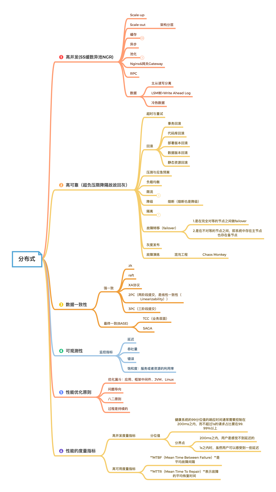

## 脑图概要

分布式
	高并发(SS缓数异池NGR)
		Scale-up
		Scale-out
			架构分层
		缓存
		异步
		池化
			数据库连接池
			HttpClient连接池
			线程池
		Nginx&网关Gateway
		RPC
		数据
			主从读写分离
			LSM树+Write Ahead Log
			冷热数据
	高可靠（超负压限降隔回灰故故）
		超时与重试
		回滚
			事务回滚
			代码库回滚
			部署版本回滚
			数据版本回滚
			静态资源回滚
		压测与应急预案
		负载均衡
		限流
			漏桶算法
			令牌筒算法
			滑动窗口
		降级
			熔断（熔断也是降级）
		隔离
			进程线程隔离
			集群/机房隔离
			读写隔离
			动静隔离
			爬虫/热点隔离
			使用Hystrix隔离
			基于Servlet3的请求隔离
		failover（故障转移）
			1.是在完全对等的节点之间做failover
			2.是在不对等的节点之间，即系统中存在主节点也存在备节点
		灰度发布
		故障演练
			混沌工程Chaos Monkey
	数据一致性
	可观测性
		监控指标
			延迟
			吞吐量
			错误
			饱和度：服务或者资源的利用率
	性能优化原则
		问题导向
		八二原则
		过程是持续的
	性能的度量指标
		高并发度量指标
			分位值
				健康系统的99分位值的响应时间通常需要控制在200ms之内，而不超过1s的请求占比要在99.99%以上
				分界点
					200ms之内，用户是感觉不到延迟的
					1s之内时，虽然用户可以感受到一些延迟
		高可用度量指标
			**MTBF（Mean Time Between Failure）**是平均故障间隔
			**MTTR（Mean Time To Repair）**表示故障的平均恢复时间

​			

## 一、高可用

### 服务注册与发现

#### Eureka

 Eureka 核心概念，自我保护机制，以及集群内的工作原理后，我们来整体梳理一下 Eureka 的工作流程：

 1、Eureka Server 启动成功，等待服务端注册。在启动过程中如果配置了集群，集群之间定时通过 Replicate 同步注册表，每个 Eureka Server 都存在独立完整的服务注册表信息
2、Eureka Client 启动时根据配置的 Eureka Server 地址去注册中心注册服务
3、Eureka Client 会每 30s 向 Eureka Server 发送一次心跳请求，证明客户端服务正常
4、当 Eureka Server 90s 内没有收到 Eureka Client 的心跳，注册中心则认为该节点失效，会注销该实例
5、单位时间内 Eureka Server 统计到有大量的 Eureka Client 没有上送心跳，则认为可能为网络异常，进入自我保护机制，不再剔除没有上送心跳的客户端
6、当 Eureka Client 心跳请求恢复正常之后，Eureka Server 自动退出自我保护模式
7、Eureka Client 定时全量或者增量从注册中心获取服务注册表，并且将获取到的信息缓存到本地
8、服务调用时，Eureka Client 会先从本地缓存找寻调取的服务。如果获取不到，先从注册中心刷新注册表，再同步到本地缓存
9、Eureka Client 获取到目标服务器信息，发起服务调用
10、Eureka Client 程序关闭时向 Eureka Server 发送取消请求，Eureka Server 将实例从注册表中删除

Eureka Server 进入自我保护机制，会出现以下几种情况：
(1) Eureka 不再从注册列表中移除因为长时间没收到心跳而应该过期的服务
(2) Eureka 仍然能够接受新服务的注册和查询请求，但是不会被同步到其它节点上(即保证当前节点依然可用)
(3) 当网络稳定时，当前实例新的注册信息会被同步到其它节点中
Eureka 自我保护机制是为了防止误杀服务而提供的一个机制。当个别客户端出现心跳失联时，则认为是客户端的问题，剔除掉客户端；当 Eureka 捕获到大量的心跳失败时，则认为可能是网络问题，进入自我保护机制；当客户端心跳恢复时，Eureka 会自动退出自我保护机制。

### 

#### 注册中心对比

| 比较项                | Zookeeper             | Etcd          | Consul                | Eureka                  | Nacos                                                        |
| --------------------- | --------------------- | ------------- | --------------------- | ----------------------- | ------------------------------------------------------------ |
| CAP模型               | CP                    | CP            | CP                    | AP                      | AP注册中心，CP配置中心                                       |
| 数据一致性算法        | ZAB                   | Raft          | Raft                  | ❌                       | Raft                                                         |
| 多数据中心            | ❌                     | ❌             | ✅                     | ❌                       | ✅                                                            |
| 使用接口（多语言支持) | 客户端                | Http/gRPC     | Http/DNS              | Http                    | Nacos支持基于DNS和基于RPC的服务发现。服务提供者使用原来SDK、OpenAPI、或一个独立的Agent |
| Watch支持             | TCP                   | Long Polling  | 全量/Long Polling     | Long Polling/大部分增量 | Long Polling/大部分增量                                      |
| KV存储                | ✅                     | ✅             | ✅                     | ❌                       | ✅                                                            |
| 服务健康检查          | (弱)长连接，keepalive | 心跳          | 服务状态,内存，硬盘等 | 可配置支持              | 传输层(PING或TCP)和应用层(如HTTP、Mysql、用户自定义)的健康检查 |
| 自身监控              | ❌                     | metrics       | metrics               | metrics                 |                                                              |
| SpringCloud           | ✅                     | ✅             | ✅                     | ✅                       | ✅                                                            |
| 自身开发语言          | Java                  | Go            | Go                    | Java                    | Java                                                         |
| 安全                  | acl                   | https支持(弱) | acl/https             | -                       | acl                                                          |

Spring Cloud Alibaba Nacos 在 1.0.0 正式支持 AP 和 CP 两种一致性协议，其中的CP一致性协议实现，是基于简化的 Raft 的 CP 一致性。

nacos同时支持AP和CP模式,他根据服务注册选择临时和永久来决定走AP模式还是CP模式。AP模式下只支持注册临时实例。
如果需要在服务级别编辑或者存储配置信息，那么CP是必须的，K8S服务和DNS服务则适用于CP模式。CP模式下支持注册持久化实例，此时则是以Raft协议为集群运行模式，该模式下注册实例之前必须先注册服务，如果服务不存在，则会返回错误。

## 二、高可靠

## 三、数据一致性

### 分布式事务

#### 2PC

2PC的实现。通过分析可以发现，要实现2PC，所有参与者都要实现三个接口：Prepare、Commit、Rollback，这也就是XA协议

#### 3PC

2pc存在的问题是当协作者崩溃时，参与者不能做出最后的选择。
三阶段提交有两个改动点
1、引入超时机制（2PC只有协调者才拥有超时机制，3PC参与者也设置了超时时间）
2、3PC把2PC的准备（Prepare）阶段再次一分为二，这样三阶段提交就有CanCommit、PreCommit、DoCommit三个阶段。

如果所有的参与者都返回Yes的话，那么就会进入PreCommit阶段进行事务预提交
通过CanCommit、PreCommit、DoCommit三个阶段的设计，相较于2PC而言，多设置了一个缓冲阶段保证了在最后提交阶段之前各参与节点的状态是一致的。

#### raft和zk

单独写一章 todo

#### Saga

Apache ServiceComb Saga，华为开源，已交由apache。Apache ServiceComb Saga支持tcc和saga两种模式
Apache ServiceComb Saga 基于spring注解和aop切面，对用户透明，业务侵入小，开发简单，部署容易；
在高可用方面。协调者alpha支持集群模式和本地持久化，不会出现单点故障；

Saga演进后的架构，如下图所示，主要包含两个组件，即alpha和omega，其中：
alpha充当协调者的角色，主要负责对事务的事件进行持久化存储以及协调子事务的状态，使其最终得以与全局事务的状态保持一致，即保证事务中的子事务要么全执行，要么全不执行。
omega是微服务中内嵌的一个agent，负责对网络请求进行拦截并向alpha上报事务事件，并在异常情况下根据alpha下发的指令执行相应的补偿或重试操作。

### 缓存更新策略

缓存【更新】：客户端写入数据到数据库，成功之后，让缓存失效（下次请求时从缓存中拿不到，则查询数据库，再放入缓存）

为什么不采取先更新数据库，再更新缓存？
先更新数据库，再更新缓存。这种做法最大的问题就是两个并发的写操作导致脏数据。如下图（以Redis和Mysql为例），两个并发更新操作，数据库先更新的反而后更新缓存，数据库后更新的反而先更新缓存。这样就会造成数据库和缓存中的数据不一致，应用程序中读取的都是脏数据。

为什么不删除缓存后再更新数据库？
两个并发操作，一个是更新操作，另一个是查询操作，更新操作删除缓存后，查询操作没有命中缓存，先把老数据读出来后放到缓存中，然后更新操作更新了数据库。于是，在缓存中的数据还是老的数据，导致缓存中的数据是脏的，而且还一直这样脏下去了。

更新缓存的的Design Pattern有四种：Cache aside, Read through, Write through, Write behind caching

#### Cache Aside Pattern

我们的更新是先更新数据库，成功后，让缓存失效。
一个是查询操作，一个是更新操作的并发，首先，没有了删除cache数据的操作了，而是先更新了数据库中的数据，此时，缓存依然有效，所以，并发的查询操作拿的是没有更新的数据，但是，更新操作马上让缓存的失效了，后续的查询操作再把数据从数据库中拉出来。而不会像文章开头的那个逻辑产生的问题，后续的查询操作一直都在取老的数据。

那么，是不是Cache Aside这个就不会有并发问题了？不是的，比如，一个是读操作，但是没有命中缓存，然后就到数据库中取数据，此时来了一个写操作，写完数据库后，让缓存失效，然后，之前的那个读操作再把老的数据放进去，所以，会造成脏数据。

但，这个case理论上会出现，不过，实际上出现的概率可能非常低，因为这个条件需要发生在读缓存时缓存失效，而且并发着有一个写操作。而实际上数据库的写操作会比读操作慢得多，而且还要锁表，而读操作必需在写操作前进入数据库操作，而又要晚于写操作更新缓存，所有的这些条件都具备的概率基本并不大。

所以，这也就是Quora上的那个答案里说的，要么通过2PC或是Paxos协议保证一致性，要么就是拼命的降低并发时脏数据的概率，而Facebook使用了这个降低概率的玩法，因为2PC太慢，而Paxos太复杂。当然，最好还是为缓存设置上过期时间。

#### Read/Write Through Pattern

Read/Write Through，应用程序只需要维护缓存，把更新数据库（Repository）的操作由缓存自己代理了，所以，对于应用层来说，就简单很多了。可以理解为，**应用认为后端就是一个单一的存储，而存储自己维护自己的Cache。**

Read Through
Read Through 套路就是在查询操作中更新缓存，也就是说，当缓存失效的时候（过期或LRU换出），Cache Aside是由调用方负责把数据加载入缓存，而Read Through则用缓存服务自己来加载，从而对应用方是透明的。

Write Through
Write Through 套路和Read Through相仿，不过是在更新数据时发生。当有数据更新的时候，如果没有命中缓存，直接更新数据库，然后返回。如果命中了缓存，则更新缓存，然后再由Cache自己更新数据库（这是一个同步操作）

#### Write Behind Caching Pattern

Write Behind 又叫 Write Back。一些了解Linux操作系统内核的同学对write back应该非常熟悉，就是Linux文件系统的Page Cache的算法。

Write Back套路，一句说就是，在更新数据的时候，只更新缓存，不更新数据库，而我们的缓存会异步地批量更新数据库。这个设计的好处就是让数据的I/O操作飞快无比（因为直接操作内存嘛 ），因为异步，write backg还可以合并对同一个数据的多次操作，所以性能的提高是相当可观的。

但是，其带来的问题是，数据不是强一致性的，而且可能会丢失（我们知道Unix/Linux非正常关机会导致数据丢失，就是因为这个事）。在软件设计上，我们基本上不可能做出一个没有缺陷的设计，就像算法设计中的时间换空间，空间换时间一个道理，有时候，强一致性和高性能，高可用和高性性是有冲突的。软件设计从来都是取舍Trade-Off。

### 读写分离一致性

这个方案就保证了用户A的读请求肯定是数据一致的，而且没有性能问题，因为标记是本地客户端传过去的。
但是无法保证其他用户读数据是一致的，但是实际场景很少需要保持其他用户也保持强一致。延迟个几秒也没问题。

1、在通常的读写分离基础上考虑同步延迟窗口，如果是在写操作的同步延迟窗口之内读，则读取主库，其他情况下读从库。如果一个事务中有写操作，不管是否有读操作，肯定是操作主库。入库标记放入缓存，但对吞量有影响。
使用spring AbstractRoutingDataSource（用于读写分离），Java 注解（Annotation）和aop和thread local。
   Spring提供了AbstractRoutingDataSource抽象类用于多数据源的访问，可以继承该类覆盖
determineCurrentLookupKey()方法来实现读写分离。

2、客户端cookie存标记位

上图流程：
1）用户A发起写请求，更新了主库，并在客户端设置标记，过期时间（预估的主库和从库同步延迟的时间），可以使用cookie实现
2）用户A再发起读请求时，带上这个cookie
3）服务器处理请求时，获取请求传过来的数据，看有没有这个标记
4）有这个业务标记，走主库；没有走从库。

3、双写，保证读库写完后再返回。JVM-FullGC触发时机

### 分布式锁

#### Zookeeper 分布式锁

假设客户端A抢先一步，对zk发起了加分布式锁的请求，这个加锁请求是用到了zk中的一个特殊的概念，叫做“临时顺序节点”。这个顺序节点有zk内部自行维护的一个节点序号。客户端B过来想要加锁了，也是在，客户端B因为是第二个来创建顺序节点的，所以zk内部会维护序号为"2"。此时第一个是客户端A创建的那个顺序节点，序号为"01"的那个。所以加锁失败！加锁失败以后，客户端B就会通过ZK的API，对他的上一个顺序节点加一个监听器。zk天然就可以实现对某个节点的监听。
客户端A释放锁后，客户端B的监听器感知到了上一个顺序节点被删除，也就是排在他之前的某个客户端释放了锁。就会通知客户端B重新尝试去获取锁，客户端B一判断，发现自己居然是集合中的第一个顺序节点，bingo！可以加锁了！

Zookeeper实现的分布式锁其实存在一个缺点，那就是性能并不太高。因为每次在创建锁和释放锁的过程中，都要动态创建、销毁瞬时节点来实现锁功能。ZK中创建和删除节点只能通过Leader服务器来执行，然后Leader服务器还需要将数据同不到所有的Follower机器上。

#### 分布式id生成器，每段含义

整个结构是64位：使用41bit作为毫秒数，10bit作为机器的ID（5个bit是数据中心，5个bit的机器ID），12bit作为毫秒内的流水号，最后还有一个符号位，永远是0。

## 四、缓存常见问题

##### 雪崩

缓存雪崩是指大量的请求无法命中Redis中的缓存数据，也就是在Redis找不到数据了，那业务系统只能到数据库中查询，进而导致所有的请求都发送到了数据库。

雪崩优化
预防和解决缓存雪崩问题，可以从以下三个方面进行着手：
1、保证缓存层服务高可用性。如果缓存层设计成高可用的，即使个别节点、个别机器、甚至是机房宕掉，依然可以提供服务，例如前面介绍过的Redis Sentinel和Redis Cluster都实现了高可用。
2、依赖隔离组件为后端限流并降级。在实际项目中，我们需要对重要的资源（例如Redis、MySQL、HBase、外部接口）都进行隔离，让每种资源都单独运行在自己的线程池中，即使个别资源出现了问题，对其他服务没有影响。但是线程池如何管理，比如如何关闭资源池、开启资源池、资源池阀值管理，这些做起来还是相当复杂的。
3、提前演练。在项目上线前，演练缓存层宕掉后，应用以及后端的负载情况以及可能出现的问题，在此基础上做一些预案设。

##### 热点key重建优化

开发人员使用“缓存+过期时间”的策略既可以加速数据读写，又保证数据的定期更新，这种模式基本能够满足绝大部分需求。但是有两个问题如果同时出现，可能就会对应用造成致命的危害：
当前key是一个热点key（例如一个热门的娱乐新闻），并发量非常大。
重建缓存不能在短时间完成，可能是一个复杂计算，例如复杂的SQL、多次IO、多个依赖等。在缓存失效的瞬间，有大量线程来重建缓存，造成后端负载加大，甚至可能会让应用崩溃。
要解决这个问题也不是很复杂，但是不能为了解决这个问题给系统带来更多的麻烦，所以需要制定如下目标：
①分布式锁：此方法只允许一个线程重建缓存，其他线程等待重建缓存的线程执行完，重新从缓存获取数据即可
②永远不过期
永远不过期”包含两层意思： 从缓存层面来看，确实没有设置过期时间，所以不会出现热点key过期后产生的问题，也就是“物理”不过期。 从功能层面来看，为每个value设置一个逻辑过期时间，当发现超过逻辑过期时间后，会使用单独的线程去构建缓存。
从实战看，此方法有效杜绝了热点key产生的问题，但唯一不足的就是重构缓存期间，会出现数据不一致的情况，这取决于应用方是否容忍这种不一致。

##### 缓存穿透

缓存穿透是指查询一个根本不存在的数据，缓存层和存储层都不会命中，通常出于容错的考虑，如果从存储层查不到数据则不写入缓存层。

1.缓存空对象：当第存储层不命中后，仍然将空对象保留到缓存层中，之后再访问这个数据将会从缓存中获取，这样就保护了后端数据源。
缓存空对象会有两个问题：第一，空值做了缓存，意味着缓存层中存了更多的键，需要更多的内存空间（如果是攻击，问题更严重），比较有效的方法是针对这类数据设置一个较短的过期时间，让其自动剔除。第二，缓存层和存储层的数据会有一段时间窗口的不一致，可能会对业务有一定影响。例如过期时间设置为5分钟，如果此时存储层添加了这个数据，那此段时间就会出现缓存层和存储层数据的不一致，此时可以利用消息系统或者其他方式清除掉缓存层中的空对象。

2.布隆过滤器拦截
在访问缓存层和存储层之前，将存在的key用布隆过滤器提前保存起来，如果布隆过滤器认为该用户id不存在，那么就不会访问存储层，在一定程度保护了存储层。

#### 分布式缓存同时失效了，请求同时过来很多，怎么办

分布式锁：保证有且只有这么一个线程代表可以去数据库取数据，并将其放入缓存中！

令牌桶和漏斗应用在什么场景？
漏桶算法思路很简单，水（请求）先进入到漏桶里，漏桶以一定的速度出水，当水流入速度过大会直接溢出，可以看出漏桶算法能强行限制数据的传输速率。 

对于很多应用场景来说，除了要求能够限制数据的平均传输速率外，还要求允许某种程度的突发传输。这时候漏桶算法可能就不合适了，令牌桶算法更为适合。令牌桶算法的原理是系统会以一个恒定的速度往桶里放入令牌，而如果请求需要被处理，则需要先从桶里获取一个令牌，当桶里没有令牌可取时，则拒绝服务。 

漏桶限制数据的平均传输速率；令牌允许某种程度的突发传输

## 五、分布式应用

## 六、性能优化的几个方面

1. 服务垂直和水平拆分
2. 缓存
3. 线程池优化，数据库线程池，应用线程池，tomcat线程池优化[200,4核8g内存，线程数经验值800;]
4. JVM优化
5. 数据库查询优化
6. 业务方面异步流量削峰
7. 网络通信，如rpc、nio、epoll等
8. 操作系统参数
9. 高可用：限流、隔离、降级、压测、演练
10. 可观测性：实时指标监控、数据链路追踪、日志、告警

#### 内部系统之前调用是用什么协议

服务治理，有没有实现的应用方案

有做过哪些系统设计、架构设计

分布式的日志是怎么做的？

DDD领域驱动？

