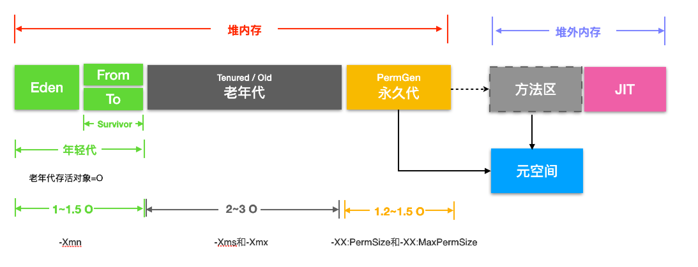

## 一、JVM组成


### 堆外内存

在JAVA中，JVM内存指的是堆内存。机器内存中，不属于堆内存的部分即为堆外内存。
sun.misc.Unsafe类操作堆外内存
NIO类操作堆外内存


### JVM对象内存布局


一个对象在内存中分为三部分：对象头、实例数据、对齐填充。
对象头中主要存放了
Mark Word: GC 分代年龄、偏向锁、偏向 id、锁类型、hash 值等
Class Poiner: 用来指向对象对应的Class对象（其对应的元数据对象）的内存地址

### 哪些对象可以作为根对象(GC Roots)吗？

虚拟机栈（栈帧中的本地变量表）中引用的对象；
方法区中的类静态属性引用的对象
方法区中常量引用的对象；
本地方法栈中JNI（即一般说的Native方法）引用的对象。

根对象包含有栈、寄存器、全局变量，此外还包含并发标记阶段未被发生变更的对象

### 可达性分析算法中被判定不可达对象，是不是一定会被回收呢？

在可达性分析算法中判定为不可达的对象，也不是“非死不可”的，要真正宣告一个对象死亡，至少要 经历两次标记过程。

第一次标记
如果对象在进行可达性分析后发现没有与GC Roots相连接的引用链，那它将会被第一次标记。

第二次标记
经过第一次标记后的对象，根据 此对象是否有必要执行finalize()方法 进行筛选，随后会由收集器对F-Queue中的对象进行第二次小规模的标记。具体如下：

经过第一次标记后的对象，根据 此对象是否有必要执行finalize()方法 进行筛选。被判定为确实有必要执行finalize()方法的对象将会被放置在一个名为F-Queue的队列之中。
假如对象没有覆盖finalize()方法，或者finalize()方法已经被虚拟机调用过，那么虚拟机将这两种情况都视为“没有必要执行”。
稍后会由一条由虚拟机自动建立的、低调度优先级的 Finalizer线程 去执行F-Queue中对象的finalize()方法。
finalize()方法是对象逃脱死亡命运的最后一次机会，稍后收集器将对F-Queue中的对象进行 第二次小规模的标记。如果对象在finalize()中成功拯救自己——只要重新与引用链上的任何一个对象建立关联即可，那在第二次标记时它将被移出 “即将回收” 的集合；如果对象这时候还没有逃脱，那基本上它就真的要被回收了。
这种自救的机会只有一次，因为对象的finalize()方法最多只会被系统调用一次。

### 堆的大小有没有配置过，假设JVM参数xmx配置了2G，这2G是虚拟内存还是物理内存？

JVM最大分配的内存由-Xmx指定，默认是物理内存的1/4。
默认空余堆内存小于40%时，JVM就会增大堆直到-Xmx的最大限制；空余堆内存大于70%时，JVM会减少堆直到-Xms的最小限制。
因此服务器一般设置-Xms、-Xmx相等以避免在每次GC 后调整堆的大小。

1. JVM是否使用虚拟内存还是物理内存，取决于操作系统有没有这项功能了。JVM也只是普通的一个进程，运行在操作系统的虚拟地址空间内，能分配多少内存是操作系统说了算的；当您在JVM上使用的内存超过了一定的限制之后，支持的情况下操作系统自然会有策略使用虚拟内存；jvm是进程，每个进程都会使用虚拟内存，虚拟内存是进程与physical memory的媒介，没有虚拟内存程序是无法运行的。
2. 元空间不在虚拟机中，而是直接用物理（本地）内存实现，不再受 JVM 内存大小参数限制。直接内存不是虚拟机运行时数据区的一部分，而是在 Java 堆外，直接向系统申请的内存区域。常见于 NIO 操作时，用于数据缓冲区（比如 ByteBuffer 使用的就是直接内存）。


## 二、JVM垃圾回收器

### 2.1 并发的可达性分析（三色标记）

并发标记要解决什么问题？

刚刚我们谈到的可达性分析算法是需要一个理论上的前提的：该算法的全过程都需要基于一个能保障一致性的快照中才能够分析，这意味着必须全程冻结用户线程的运行。
为了不冻结用户线程的运行，那我们就需要让垃圾回收线程和用户线程同时运行。

为什么遍历对象图的时候必须在一个能保障一致性的快照中？
为了说明这个问题，我们就要引入"三色标记"大法了。
在遍历对象图的过程中，把访问都的对象按照"是否访问过"这个条件标记成以下三种颜色：
白色：表示对象尚未被垃圾回收器访问过。显然，在可达性分析刚刚开始的阶段，所有的对象都是白色的，若在分析结束的阶段，仍然是白色的对象，即代表不可达。
黑色：表示对象已经被垃圾回收器访问过，且这个对象的所有引用都已经扫描过。黑色的对象代表已经扫描过，它是安全存活的，如果有其它的对象引用指向了黑色对象，无须重新扫描一遍。黑色对象不可能直接（不经过灰色对象）指向某个白色对象。
灰色：表示对象已经被垃圾回收器访问过，但这个对象至少存在一个引用还没有被扫描过。


但是垃圾回收器和用户线程同时运行呢？
垃圾回收器在对象图上面标记颜色，而同时用户线程在修改引用关系，引用关系修改了，那么对象图就变化了，这样就有可能出现两种后果：
一种是把原本消亡的对象错误的标记为存活，这不是好事，但是其实是可以容忍的，只不过产生了一点逃过本次回收的浮动垃圾而已，下次清理就可以。
一种是把原本存活的对象错误的标记为已消亡，这就是非常严重的后果了，一个程序还需要使用的对象被回收了，那程序肯定会因此发生错误。垃圾回收器是怎么解决这个问题的？

Wilson在1994年在理论上证明了，当且仅当以下两个条件同时满足时，会产生"对象消失"的问题，原来应该是黑色的对象被误标为了白色：
条件一：赋值器插入了一条或者多条从黑色对象到白色对象的新引用。
条件二：赋值器删除了全部从灰色对象到该白色对象的直接或间接引用。

由于两个条件之间是当且仅当的关系。所以，我们要解决并发标记时对象消失的问题，只需要破坏两个条件中的任意一个就行。
于是产生了两种解决方案：增量更新（Incremental Update）和原始快照（Snapshot At The Beginning，SATB）。
在HotSpot虚拟机中，CMS是基于增量更新来做并发标记的，G1则采用的是原始快照的方式。

增量更新要破坏的是第一个条件（赋值器插入了一条或者多条从黑色对象到白色对象的新引用），当黑色对象插入新的指向白色对象的引用关系时，就将这个新插入的引用记录下来，等并发扫描结束之后，再将这些记录过的引用关系中的黑色对象为根，重新扫描一次。
原始快照要破坏的是第二个条件（赋值器删除了全部从灰色对象到该白色对象的直接或间接引用），当灰色对象要删除指向白色对象的引用关系时，就将这个要删除的引用记录下来，在并发扫描结束之后，再将这些记录过的引用关系中的灰色对象为根，重新扫描一次。

虚拟机的记录操作都是通过写屏障实现的。
增量更新用的是写后屏障(Post-Write Barrier)，记录了所有新增的引用关系。
原始快照用的是写前屏障(Pre-Write Barrier)，将所有即将被删除的引用关系的旧引用记录下来。

参考：[面试官:你说你熟悉jvm?那你讲一下并发的可达性分析](https://blog.csdn.net/lilizhou2008/article/details/104489355/)

### 2.2 CMS原理

CMS垃圾回收步骤（初并重并）

1. 初始标记（STW）
   挂起应用线程，标记系统中由根节点对象直接可达的对象
2. 并发标记
   恢复应用线程，同时标记所有可达的对象。这个阶段不能保证在结束的时候能标记完所有的可达对象，因为应用线程在运行，可能会导致部分引用的变更，导致一些活对象不可达。为了解决这个问题，该算法会通过某种方式跟变更的对象的引用保持联系。
3. 重新标记（STW）
   再一次挂起应用线程，将并发标记阶段更新过得对象当做根对象再一次扫描标记所有可达的对象，在这个过程可能会导致浮动垃圾（垃圾对象被错误标记了），在下一次垃圾回收的时候被回收。
4. 并发清除
   再一次恢复应用线程，并发


### 不同垃圾回收器比较


#### Parallel Scavenge和CMS区别

Parallel Scavenge收集器的特点是它的关注点与其他收集器不同，CMS等收集器的关注点是尽可能地缩短垃圾收集时用户线程的停顿时间，而Parallel Scavenge收集器的目标则是达到一个可控制的吞吐量（Throughput）。
Parallel Scavenge收集器百也经常称为“吞吐量优先”收集器
Parallel Scavenge收集器提供了两度个参数用于精确控制吞吐量; -XX:MaxGCPauseMillis：控制最大垃圾收专集停顿时间; -XX:GCTimeRatio：设置吞吐量大小
自适应调节策略也是Parallel Scavenge收集器与属ParNew收集器的一个重要区别


#### 


## 三、JVM调优方法论

### 3.1 GC触发条件

Minor GC触发条件：
当Eden区满时，触发Minor GC。
Full GC触发条件：
1、System.gc()方法的调用
2、老年代代空间不足
3、永生区空间不足
4、CMS GC时出现promotion failed和concurrent mode failure
5、统计得到的Minor GC晋升到老年代的平均大小大于老年代的剩余空间
6、堆中分配很大的对象
7、JVM使用jmap命令

### 3.2 JVM通用调优手段

稳定的 Java 堆
获得一个稳定的堆大小的方法是使-Xms 和-Xmx 的大小一致，即最大堆和最小堆 

将新对象预留在年轻代
Survivor 区的空间不够，或者占用量达到 50%时，就会使对象进入年老代。故该设置提高了 Survivor 区的使用率：–XX:TargetSurvivorRatio=90，提高 from 区的利用率，使 from 区使用到 90%时，再将对象送入年老代。

让大对象进入年老代
应该尽可能避免使用短命的大对象。可以使用参数-XX:PetenureSizeThreshold 设置大对象直接进入年老代的阈值。当对象的大小超过这个值时，将直接在年老代分配。参数-XX:PetenureSizeThreshold 只对串行收集器和年轻代并行收集器有效，并行回收收集器不识别这个参数。
如果需要将 1MB 以上的对象直接在年老代分配，设置-XX:PetenureSizeThreshold=1000000

设置对象进入年老代的年龄
这个阈值的最大值可以通过参数-XX:MaxTenuringThreshold 来设置，默认值是 15。

增大吞吐量
-Xss128k：减少线程栈的大小，这样可以使剩余的系统内存支持更多的线程；
–XX:+UseParallelGC：年轻代使用并行垃圾回收收集器。这是一个关注吞吐量的收集器，可以尽可能地减少 GC 时间。
–XX:ParallelGC-Threads：设置用于垃圾回收的线程数，通常情况下，可以设置和 CPU 数量相等。但在 CPU 数量比较多的情况下，设置相对较小的数值也是合理的；
–XX:+UseParallelOldGC：设置年老代使用并行回收收集器。

年轻代大小选择：响应时间优先的应用，尽可能设大，直到接近系统的最低响应时间限制（根据实际情况选择）。在此种情况下，年轻代收集发生gc的频率是最小的。同时，也能够减少到达年老代的对象。吞吐量优先的应用，也尽可能的设置大，因为对响应时间没有要求，垃圾收集可以并行进行
年老代大小选择：响应时间优先的应用，年老代一般都是使用并发收集器，所以其大小需要小心设置，一般要考虑并发会话率和会话持续时间等一些参数。如果堆设置小了，会造成内存碎片、高回收频率以及应用暂停而使用传统的标记清除方式；如果堆大了，则需要较长的收集时间。

较小堆引起的碎片问题：使用并发收集器时，开启对年老代的压缩。同时使用-XX:CMSFullGCsBeforeCompaction=xx设置多少次Full GC后，对年老代进行压缩。

### 3.3 何时进行JVM调优

遇到以下情况，就需要考虑进行JVM调优了：

- Heap内存（老年代）持续上涨达到设置的最大内存值；
- Full GC 次数频繁；
- GC 停顿时间过长（超过1秒）；
- 应用出现OutOfMemory 等内存异常；
- 应用中有使用本地缓存且占用大量内存空间；
- 系统吞吐量与响应性能不高或下降。

### 3.4 JVM调优目标和性能参考指标

延迟：GC低停顿和GC低频率；
低内存占用；
高吞吐量;
其中，任何一个属性性能的提高，几乎都是以牺牲其他属性性能的损为代价的，不可兼得。

一般如果达到以下的指标，就不需要进行GC了。
Minor GC执行时间不到50ms，Minor GC执行不频繁，约10秒一次；
Full GC执行时间不到1s，Full GC执行频率不算频繁，不低于10分钟1次；


其它JVM调优的量化目标参考实例：

- Heap 内存使用率 <= 70%;
- Old generation内存使用率<= 70%;
- avgpause <= 1秒;
- Full gc 次数0 或 avg pause interval >= 24小时 ;

注意：不同应用的JVM调优量化目标是不一样的。

#### 延迟优化性能调优

新生代空间越大，Minor GC的GC时间越长，频率越低。如果想减少其持续时长，就需要减少其空间大小。如果想减小其频率，就需要加大其空间大小。

#### 吞吐量的性能调优

吞吐量的性能调优的目标就是尽可能避免或者很少发生FullGC或者Stop-The-World压缩式垃圾收集（CMS），因为这两种方式都会造成应用程序吞吐降低。尽量在MinorGC 阶段回收更多的对象，避免对象提升过快到老年代。

####  一般来说JVM多大合适



### 3.5 JVM调优的步骤

一般情况下，JVM调优可通过以下步骤进行：

- 分析GC日志及dump文件，判断是否需要优化，确定瓶颈问题点；
- 确定JVM调优量化目标；
- 确定JVM调优参数（根据历史JVM参数来调整）；
- 依次调优内存、延迟、吞吐量等指标；
- 对比观察调优前后的差异；
- 不断的分析和调整，直到找到合适的JVM参数配置；
- 找到最合适的参数，将这些参数应用到所有服务器，并进行后续跟踪。

### 3.6 参数解析

更多参数，下拉看最后一章

参数解析：
```shell
-Xmx4g：堆内存最大值为4GB。
-Xms4g：初始化堆内存大小为4GB。
-Xmn1200m：设置年轻代大小为1200MB。增大年轻代后，将会减小年老代大小。此值对系统性能影响较大，Sun官方推荐配置为整个堆的3/8。
-Xss512k：设置每个线程的堆栈大小。JDK5.0以后每个线程堆栈大小为1MB，以前每个线程堆栈大小为256K。应根据应用线程所需内存大小进行调整。在相同物理内存下，减小这个值能生成更多的线程。但是操作系统对一个进程内的线程数还是有限制的，不能无限生成，经验值在3000~5000左右。
-XX:NewRatio=4：设置年轻代（包括Eden和两个Survivor区）与年老代的比值（除去持久代）。设置为4，则年轻代与年老代所占比值为1：4，年轻代占整个堆栈的1/5
-XX:SurvivorRatio=8：设置年轻代中Eden区与Survivor区的大小比值。设置为8，则两个Survivor区与一个Eden区的比值为2:8，一个Survivor区占整个年轻代的1/10
-XX:PermSize=100m：初始化永久代大小为100MB。
-XX:MaxPermSize=256m：设置持久代大小为256MB。
-XX:MaxTenuringThreshold=15：设置垃圾最大年龄。如果设置为0的话，则年轻代对象不经过Survivor区，直接进入年老代。对于年老代比较多的应用，可以提高效率。如果将此值设置为一个较大值，则年轻代对象会在Survivor区进行多次复制，这样可以增加对象再年轻代的存活时间，增加在年轻代即被回收的概论。
新生代、老生代、永久代的参数，如果不进行指定，虚拟机会自动选择合适的值，同时也会基于系统的开销自动调整。
```
可调优参数：
```shell
-Xms：初始化堆内存大小，默认为物理内存的1/64(小于1GB)。
-Xmx：堆内存最大值。默认(MaxHeapFreeRatio参数可以调整)空余堆内存大于70%时，JVM会减少堆直到-Xms的最小限制。
-Xmn：新生代大小，包括Eden区与2个Survivor区。
-XX:SurvivorRatio=1：Eden区与一个Survivor区比值为1:1。
-XX:MaxDirectMemorySize=1G：直接内存。报java.lang.OutOfMemoryError: Direct buffer memory异常可以上调这个值。
-XX:+DisableExplicitGC：禁止运行期显式地调用System.gc()来触发fulll GC。
```
注意: Java RMI的定时GC触发机制可通过配置-Dsun.rmi.dgc.server.gcInterval=86400来控制触发的时间。
```shell
-XX:CMSInitiatingOccupancyFraction=60：老年代内存回收阈值，默认值为68。
-XX:ConcGCThreads=4：CMS垃圾回收器并行线程线，推荐值为CPU核心数。
-XX:ParallelGCThreads=8：新生代并行收集器的线程数。
-XX:MaxTenuringThreshold=10：设置垃圾最大年龄。如果设置为0的话，则年轻代对象不经过Survivor区，直接进入年老代。对于年老代比较多的应用，可以提高效率。如果将此值设置为一个较大值，则年轻代对象会在Survivor区进行多次复制，这样可以增加对象再年轻代的存活时间，增加在年轻代即被回收的概论。
-XX:CMSFullGCsBeforeCompaction=4：指定进行多少次fullGC之后，进行tenured区 内存空间压缩。
-XX:CMSMaxAbortablePrecleanTime=500：当abortable-preclean预清理阶段执行达到这个时间时就会结束。
```
在设置的时候，如果关注性能开销的话，应尽量把永久代的初始值与最大值设置为同一值，因为永久代的大小调整需要进行FullGC才能实现。

#### -Xss参数说明

JVM内存参数设置，-Xss参数设置值过小，导致工程启动失败。

设置每个线程的堆栈大小。JDK5.0以后每个线程堆栈大小为1M，以前每个线程堆栈大小为256K。根据应用的线程所需内存大小进行调整。在相同物理内存下，减小这个值能生成更多的线程。但是操作系统对一个进程内的线程数还是有限制的，不能无限生成，经验值在3000~5000左右。

线程栈的大小是个双刃剑，如果设置过小，可能会出现栈溢出，特别是在该线程内有递归、大的循环时出现溢出的可能性更大，如果该值设置过大，就有影响到创建栈的数量，如果是多线程的应用，就会出现内存溢出的错误．

-Xss256k：在堆之外，线程占用栈内存，默认每条线程为1M。存放方法调用出参入参的栈、局部变量、标量替换后的局部变量等，有人喜欢设小点节约内存开更多线程。但反正内存够也就不必要设小，有人喜欢再设大点，特别是有JSON解析之类的递归调用时不能设太小。

### 3.6 JVM调优工具

#### Jmap 
得到运行java程序的内存分配的详细情况。例如实例个数，大小等 
使用jmap -histo[:live] pid查看堆内存中的对象数目、大小统计直方图，如果带上live则只统计活对象

#### Jstack 
jstack能得到运行java程序的java stack和native stack的信息。可以轻松得知当前线程的运行情况。

#### Jstat（JVM统计监测工具）
这是一个比较实用的一个命令，可以观察到classloader，compiler，gc相关信息。可以时时监控资源和性能 

```
root@ubuntu:/# jstat -gc 21711 250 4
 S0C    S1C    S0U    S1U      EC       EU        OC         OU       PC     PU    YGC     YGCT    FGC    FGCT     GCT   
192.0  192.0   64.0   0.0    6144.0   1854.9   32000.0     4111.6   55296.0 25472.7    702    0.431   3      0.218    0.649
192.0  192.0   64.0   0.0    6144.0   1972.2   32000.0     4111.6   55296.0 25472.7    702    0.431   3      0.218    0.649
192.0  192.0   64.0   0.0    6144.0   1972.2   32000.0     4111.6   55296.0 25472.7    702    0.431   3      0.218    0.649
192.0  192.0   64.0   0.0    6144.0   2109.7   32000.0     4111.6   55296.0 25472.7    702    0.431   3      0.218    0.649
```

S0C、S1C、S0U、S1U：Survivor 0/1区容量（Capacity）和使用量（Used）
EC、EU：Eden区容量和使用量
OC、OU：年老代容量和使用量
PC、PU：永久代容量和使用量
YGC、YGT：年轻代GC次数和GC耗时
FGC、FGCT：Full GC次数和Full GC耗时
GCT：GC总耗时

### 3.7 常见错误异常

#### concurrent mode failure

并发模式失败（concurrent mode failure）：产生的原因是老年代的可用空间不够了
原因有两种：
    1.年轻代提升太快，老年代的处理速度跟不上新生代的提升速度；或者新生代空间太小，放不下新产生的对象而直接转入老年代，但老年代也空间不够
        解决办法：
        ①.调大新生代空间 -Xmn
        ②.加大新生代晋升的阈值 -XX:MaxTenuringThreshold
    2.老年代碎片过多
        解决办法：
        ①.调大老年代的比例  –XX:NewRatio 
        ②.降低老年代进行垃圾回收的阈值，
        -XX:CMSInitiatingOccupancyFraction=60（默认是 68）
        -XX:+UseCMSInitiatingOccupancyOnly
当老年代碎片过多时，这个过程注意cms的性能会比较差，退化成只有一个线程来收集垃圾，耗时可能有几秒或十几秒。

提升失败（promotion failed）：新生代太小，放不下要复制的存活对象，转而要往老年代放，但这样老年代就有大量短命对象，而很快内存不够就报错（因为MinorGC时的survivor放不下eden和另一个survivor中没回收的对象，转而进入老年代）
一个Survivor 区不能容纳eden和另外一个survivor里面的存活对象，多余的对象进入老年代，这样就会导致老年代里面的存放大量的短暂存活的对象，
而我们知道，如果老年代里面没有可用空间就会发生full gc，这样就造成扫描整个堆，造成提升失败（promotion failed）。

**解决办法**

    解决办法：增加survivor
        ①.增加年轻代的大小 -Xmn
        ②.调整survivor和eden的比例  -XX:SurvivorRatio 默认是8 ， 各占比 s0：s1 ：eden =1：1：8 ， 减小这个值也就加大了survivor。

#### jvm内存快照dump文件太大，怎么分析?

如果是线上环境，注意dump之前必须先将流量切走，否则大内存dump是直接卡死服务。

对于比较小的dump，eclipse可以打开，但一旦dump文件太大，eclipse就有点束手无策。 这时候怎么办呢 可以使用linux下的mat，既Memory Analyzer Tools dump生成 dump可以是内存溢出时让其自动生成，或者手工直接导。

如果快照文件很大，可以在服务器上直接分析，使用的命令是：jhat dump.hprof


### 3.8 优化实例

## 四、OOM和死锁调优步骤

### 4.1 OOM内存溢出


导出的文件进行读取：

```java
File file = new File("C:\\Users\\DELL\\Desktop\\heap.bin");
final FileInputStream fileInputStream = new FileInputStream(file);
byte[] buffer = new byte[300];
```

参考[java进程 cpu100%问题排查](https://blog.csdn.net/wangjun5159/article/details/90414097)

### 4.2 死锁

#### 产生死锁的四个必要条件【互占不循】

（1） 互斥条件：一个资源每次只能被一个进程使用。
（2） 占有且等待：一个进程因请求资源而阻塞时，对已获得的资源保持不放。
（3）不可强行占有:进程已获得的资源，在末使用完之前，不能强行剥夺。
（4） 循环等待条件:若干进程之间形成一种头尾相接的循环等待资源关系。
这四个条件是死锁的必要条件，只要系统发生死锁，这些条件必然成立，而只要上述条件之
一不满足，就不会发生死锁。

#### 找问题的步骤


## 五、JVM调优实例

### 

[一步步优化JVM五：优化延迟或者响应时间(1)](https://blog.csdn.net/zhoutao198712/article/details/7791969)

[JVM性能调优详解](https://zhuanlan.zhihu.com/p/91223656)

## 六、类加载

#### classLoader作用，怎么样把一个类装载起来，装载在jvm的哪一部分？

classLoader分类
bootstrap,加载 JAVA_HOME\lib 目录中。
ExtClassLoader，加载JAVA_HOME\jre\lib\ext 目录中
appClassLoader（也叫System ClassLoader),加载用户路径（classpath）上的类库。

lvpri
loading加载。将二进制字节流转化为方法区的运行时数据结构，读入内存，并为之创建一个java.lang.Class对象。（二运数入内存，创class）
validate验证。确保 Class 文件的字节流中包含的信息是否符合当前虚拟机的要求，并且不会危害虚拟机自身的安全。
prepare准备。为类变量分配内存并设置类变量的初始值，静态常量此时为0
resolve解析。将常量池中的符号引用替换为直接引用的过程。
initialization初始化。声明类变量时指定初始值和使用静态初始化块为类变量指定初始值


#### 如果想往java类中分配1G的内存空间，需要怎么样？注意哪些问题


## 七、JVM参数

Java7及以前版本的示例，在Java8中永久代的参数-XX:PermSize和-XX：MaxPermSize已经失效。

```
-Xmx4g –Xms4g –Xmn1200m –Xss512k -XX:NewRatio=4 -XX:SurvivorRatio=8 -XX:PermSize=100m -XX:MaxPermSize=256m -XX:MaxTenuringThreshold=15
```

-Xmx4g：堆内存最大值为4GB。
-Xms4g：初始化堆内存大小为4GB。
-Xmn1200m：设置年轻代大小为1200MB。增大年轻代后，将会减小年老代大小。此值对系统性能影响较大，Sun官方推荐配置为整个堆的3/8。
-Xss512k：设置每个线程的堆栈大小。JDK5.0以后每个线程堆栈大小为1MB，以前每个线程堆栈大小为256K。应根据应用线程所需内存大小进行调整。在相同物理内存下，减小这个值能生成更多的线程。但是操作系统对一个进程内的线程数还是有限制的，不能无限生成，经验值在3000~5000左右。
-XX:NewRatio=4：设置年轻代（包括Eden和两个Survivor区）与年老代的比值（除去持久代）。设置为4，则年轻代与年老代所占比值为1：4，年轻代占整个堆栈的1/5
-XX:SurvivorRatio=8：设置年轻代中Eden区与Survivor区的大小比值。设置为8，则两个Survivor区与一个Eden区的比值为2:8，一个Survivor区占整个年轻代的1/10
-XX:PermSize=100m：初始化永久代大小为100MB。
-XX:MaxPermSize=256m：设置持久代大小为256MB。
-XX:MaxTenuringThreshold=15：设置垃圾最大年龄。如果设置为0的话，则年轻代对象不经过Survivor区，直接进入年老代。对于年老代比较多的应用，可以提高效率。如果将此值设置为一个较大值，则年轻代对象会在Survivor区进行多次复制，这样可以增加对象再年轻代的存活时间，增加在年轻代即被回收的概论。


| 分类                                      | 参数                                                       | 默认值                                                       | 描述                                                         |                                                              |
| ----------------------------------------- | ---------------------------------------------------------- | ------------------------------------------------------------ | ------------------------------------------------------------ | ------------------------------------------------------------ |
| 通用                                      | 堆通用参数                                                 | -Xms128M                                                     | 物理内存的1/64(<1GB)                                         | 设置java程序启动时堆内存128M。默认(MinHeapFreeRatio参数可以调整)空余堆内存小于40%时，JVM就会增大堆直到-Xmx的最大限制。 |
| -Xmx256M                                  | 物理内存的1/4(<1GB)                                        | 设置最大堆内存256M。默认(MaxHeapFreeRatio参数可以调整)空余堆内存大于70%时，JVM会减少堆直到  -Xms的最小限制，     一般这两个值会设置成一致的，避免在GC完之后动态的调整堆大小，调整内存会消耗系统资源，对应用会有影响 |                                                              |                                                              |
| -Xss1M                                    | 1024K(1.8+)                                                | 设置线程栈的大小  1M（默认1M）                               |                                                              |                                                              |
| -XX:MinHeapFreeRatio=40                   |                                                            | 设置堆空间最小空闲比例（默认40）（当-Xmx与-Xms相等时，该配置无效） |                                                              |                                                              |
| -XX:ThreadStackSize                       |                                                            | -Xss  设置在后面，以-Xss为准；   -XX:ThreadStackSize设置在后面，主线程以 -Xss为准，其他线程以 -XX:ThreadStackSize为准 |                                                              |                                                              |
| -XX:MinHeapFreeRatio=40                   |                                                            | 设置堆空间最小空闲比例（默认40）（当-Xmx与-Xms相等时，该配置无效） |                                                              |                                                              |
| -XX:MaxHeapFreeRatio=70                   |                                                            | 设置堆空间最大空闲比例（默认70）（当-Xmx与-Xms相等时，该配置无效） |                                                              |                                                              |
| -XX:+UseCompressedOops                    |                                                            | 使用压缩指针，32G内存下默认开启。开启指针压缩，则Object  Head 里的Klass Pointer为4字节，复杂属性的引用指针为4字节，数组的长度用4字节表示，这样能够节省部分内存空间 |                                                              |                                                              |
| 垃圾回收器                                | -XX:MaxGCPauseMillis                                       | 200ms                                                        | 设置最大垃圾收集停顿时间，G1会尽量达到此期望值，如果GC时间超长，那么会逐渐减少GC时回收的区域，以此来靠近此阈值。 |                                                              |
| -XX:+UseAdaptiveSizePolicy                |                                                            | 打开自适应GC策略（该摸式下，各项参数都会被自动调整）         |                                                              |                                                              |
| -XX:+UseSerialGC                          |                                                            | 在年轻代和年老代使用串行回收器                               |                                                              |                                                              |
| -XX:+UseParallelGC                        |                                                            | 使用并行垃圾回收收集器，默认会同时启用  -XX:+UseParallelOldGC（默认使用该回收器）。 |                                                              |                                                              |
| -XX:+UseParallelOldGC                     |                                                            | 开启老年代使用并行垃圾收集器，默认会同时启用  -XX:+UseParallelGC |                                                              |                                                              |
| -XX:ParallelGCThreads=4                   |                                                            | 设置用于垃圾回收的线程数为4（默认与CPU数量相同）             |                                                              |                                                              |
| -XX:+UseConcMarkSweepGC                   |                                                            | 使用CMS收集器（年老代）                                      |                                                              |                                                              |
| -XX:CMSInitiatingOccupancyFraction=80     |                                                            | 设置CMS收集器在年老代空间被使用多少后触发                    |                                                              |                                                              |
| -XX:+CMSClassUnloadingEnabled             |                                                            | 允许对类元数据进行回收。相对于并行收集器，CMS收集器默认不会对永久代进行垃圾回收。如果希望对永久代进行垃圾回收，可通过此参数设置。 |                                                              |                                                              |
| -XX:+UseCMSInitiatingOccupancyOnly        |                                                            | 只在达到阈值的时候，才进行CMS回收                            |                                                              |                                                              |
| -XX:+CMSIncrementalMode                   |                                                            | 设置为增量模式。适用于单  CPU  情况。该标志将开启CMS收集器的增量模式。增量模式经常暂停CMS过程，以便对应用程序线程作出完全的让步。因此，收集器将花更长的时间完成整个收集周期。因此，只有通过测试后发现正常CMS周期对应用程序线程干扰太大时，才应该使用增量模式。由于现代服务器有足够的处理器来适应并发的垃圾收集，所以这种情况发生得很少。 |                                                              |                                                              |
| -XX:+UseG1GC                              |                                                            | 使用G1回收器                                                 |                                                              |                                                              |
| -XX:G1HeapRegionSize=16m                  |                                                            | 使用G1收集器时设置每个Region的大小（范围1M  - 32M）          |                                                              |                                                              |
| -XX:MaxGCPauseMillis=500                  |                                                            | 设置最大暂停时间，单位毫秒。可以减少  STW 时间。             |                                                              |                                                              |
| -XX:+DisableExplicitGC                    |                                                            | 禁止显示GC的调用（即禁止开发者的  System.gc();）             |                                                              |                                                              |
| -XX:GCTimeRatio=n                         | G1为9，CMS为99。                                           | 设置垃圾回收时间占程序运行时间的百分比。公式为  1/(1+n)并发收集器设置。G1为9，CMS为99。GC时间占总时间的比例，默认值为99，即允许1%的GC时间。仅仅在Parallel  Scavenge收集时有效，公式为1/(1+n)。 |                                                              |                                                              |
| -XX:CMSFullGCsBeforeCompaction=n          |                                                            | 由于并发收集器不对内存空间进行压缩、整理，所以运行一段时间以后会产生“碎片”，使得运行效率降低。此值设置运行多少次  GC 以后对内存空间进行压缩、整理。 |                                                              |                                                              |
| -XX:+UseCMSCompactAtFullCollection        |                                                            | 打开对年老代的压缩。可能会影响性能，但是可以消除碎片。       |                                                              |                                                              |
| -XX:+CMSParallelRemarkEnabled             |                                                            | 是否启用并行标记（仅限于ParNewGC）。开启  -XX:+CMSParallelRemarkEnabled     关闭 -XX:-CMSParallelRemarkEnabled |                                                              |                                                              |
|                                           |                                                            |                                                              |                                                              |                                                              |
|                                           |                                                            |                                                              |                                                              |                                                              |
| 堆快照                                    | -XX:+PrintGCDetails                                        |                                                              | 打印GC信息                                                   |                                                              |
| -XX:+PrintGCTimeStamps                    |                                                            | 打印每次GC的时间戳（现在距离启动的时间长度）                 |                                                              |                                                              |
| -XX:+PrintGCDateStamps                    |                                                            | 打印GC日期                                                   |                                                              |                                                              |
| -XX:+PrintHeapAtGC                        |                                                            | 每次GC时，打印堆信息                                         |                                                              |                                                              |
| -Xloggc:/usr/local/tomcat/logs/gc.$$.log  |                                                            | GC日志存放的位置                                             |                                                              |                                                              |
| 日志                                      | -XX:+UseGCLogFileRotation                                  |                                                              | 开启滚动日志记录                                             |                                                              |
| -XX:NumberOfGCLogFiles=5                  |                                                            | 滚动数量，命名为filename.0,  filename.1 ..... filename.n-1, 然后再从filename.0 开始，并覆盖已经存在的文件 |                                                              |                                                              |
| -XX:GCLogFileSize=100k                    |                                                            | 每个文件大小，当达到该指定大小时，会写入下一个文件。GC文件滚动大小，需配置UseGCLogFileRotation，设置为0表示仅通过jcmd命令触发 |                                                              |                                                              |
| -Xloggc:/gc/log                           |                                                            | 日志文件位置                                                 |                                                              |                                                              |
| -XX:+PrintTenuringDistribution            |                                                            | 打印存活实例年龄信息                                         |                                                              |                                                              |
| -XX:+PrintHeapAtGC                        |                                                            | GC前后打印堆区使用信息                                       |                                                              |                                                              |
| -XX:+PrintGCApplicationStoppedTime        |                                                            | 打印GC时应用暂停时间                                         |                                                              |                                                              |
| 调优参数                                  | -XX:+PrintFlagsFinal                                       |                                                              | 输出所有XX参数和值                                           |                                                              |
| -XX:+PrintCommandLineFlags                |                                                            | 输出JVM设置过的详细的XX参数的名称和值                        |                                                              |                                                              |
| -XX:+HeapDumpOnOutOfMemoryError           |                                                            | 抛出内存溢出错误时导出堆信息到指定文件                       |                                                              |                                                              |
| -XX:HeapDumpPath=/path/heap/dump/gc.hprof |                                                            | 当HeapDumpOnOutOfMemoryError开启的时候，dump文件的保存路径，默认为工作目录下的java_pid<pid>.hprof文件 |                                                              |                                                              |
| XX:MaxDirectMemorySize                    | -Xmx                                                       | 直接内存大小，直接内存非常重要，很多IO处理都需要直接内存参与，直接内存不被jvm管理，所以就不存在GC时内存地址的移动问题，直接内存会作为堆内存和内核之间的中转站。 |                                                              |                                                              |
| 堆                                        | 新生代                                                     | -Xmn10M                                                      |                                                              | 设置新生代区域大小为10M                                      |
| -XX:NewSize=2M                            | 设置新生代初始大小为2M                                     |                                                              |                                                              |                                                              |
| -XX:MaxNewSize=2M                         | 设置新生代最大值为2M                                       |                                                              |                                                              |                                                              |
| -XX:NewRatio=2                            | 2                                                          | 新生代:老年代  = 1:2，默认值为2。使用G1时一般此参数不设置，由G1来动态的调整，逐渐调整至最优值。 |                                                              |                                                              |
| -XX:SurvivorRatio=8                       | 8                                                          | 设置年轻代中eden区与survivor区的比例为8，即：eden:from:to  = 8:1:1 |                                                              |                                                              |
| -XX:TargetSurvivorRatio=50                |                                                            | 设置survivor区使用率。当survivor区达到50%时，将对象送入老年代 |                                                              |                                                              |
| -XX:+UseTLAB                              |                                                            | 在年轻代空间中使用本地线程分配缓冲区(TLAB)，默认开启。Thread  Local Allocation  Buffer，此区域位于Eden区。当多线程分配内存区块时，因为内存分配和初始化数据是不同的步骤，所以在分配时需要对内存区块上锁，由此会引发区块锁竞争问题。此参数会让线程预先分配一块属于自己的空间(64K-1M)，分配时先在自己的空间上分配，不足时再申请，这样能就不存在内存区块锁的竞争，提高分配效率。 |                                                              |                                                              |
| -XX:TLABSize=512k                         |                                                            | 设置TLAB大小为512k                                           |                                                              |                                                              |
| -XX:MaxTenuringThreshold=15               | 15                                                         | 设置垃圾对象最大年龄，对象进入老年代的年龄（Parallel是15，CMS是6）。如果设置为  0 的话，则年轻代对象不经过 Survivor 区，直接进入年老代。 |                                                              |                                                              |
| -XX:+UseTLAB                              |                                                            | 使用线程本地分配缓冲区。Server模式默认开启。Thread  Local Allocation  Buffer，此区域位于Eden区。当多线程分配内存区块时，因为内存分配和初始化数据是不同的步骤，所以在分配时需要对内存区块上锁，由此会引发区块锁竞争问题。此参数会让线程预先分配一块属于自己的空间(64K-1M)，分配时先在自己的空间上分配，不足时再申请，这样能就不存在内存区块锁的竞争，提高分配效率。 |                                                              |                                                              |
| -XX:InitiatingHeap OccupancyPercent       | 45                                                         | 启动并发GC时的堆内存占用百分比。G1用它来触发并发GC周期,基于整个堆的使用率,而不只是某一代内存的使用比例。值为  0 则表示“一直执行GC循环)’. 默认值为 45 (例如, 全部的 45% 或者使用了45%)。 |                                                              |                                                              |
| 老年代                                    | -XX:PretenureSizeThreshold                                 | Region的一半                                                 | 大对象晋升老年代阈值。                                       |                                                              |
| -XX:+HandlePromotionFailure               | DK1.6之后，默认开启                                        | 老年代是否允许分配担保失败，，即老年代的剩余最大连续空间不足以引用新生代的整个Eden和Survivor区的所有存活对象的极端情况（以此判断是否需要对老年代进行以此FullGC）。 |                                                              |                                                              |
| 永久代                                    | -XX:MaxPermSize=n                                          |                                                              | 设置永久代大小                                               |                                                              |
| 元空间                                    | -XX:MetaspaceSize=64M                                      | 20M                                                          | 设置元数据空间初始大小（取代-XX:PermSize），对于64位JVM来说，元空间的默认初始大小是20.75MB |                                                              |
| -XX:MaxMetaspaceSize=128M                 |                                                            | 设置元数据空间最大值（取代之前-XX:MaxPermSize）              |                                                              |                                                              |
| 其它                                      | 其它                                                       | -XX:CompileThreshold                                         | 1000                                                         | JIT预编译阈值。通过JIT编译器，将方法编译成机器码的触发阀值，可以理解为调用方法的次数，例如调1000次，将方法编译为机器码 |
| -XX:+CITime                               |                                                            | 打印启动时花费在JIT  Compiler 时间                           |                                                              |                                                              |
| -XX:+UseThreadPriorities                  |                                                            | 是否开启线程优先级。默认开启。java  中的线程优先级的范围是1～10，默认的优先级是5。“高优先级线程”会优先于“低优先级线程”执行，也就是竞争CPU时间片时，高优先级线程会被优待。 |                                                              |                                                              |
| -XX:+UseSpinning                          |                                                            | 是否使用适应自旋锁，1.6+默认开启。这是对synchronized的优化，当运行到synchronized的代码块时，会尝试自旋，如果在自旋期间获取到了锁，那么下次会逐渐的增加自旋时间，反之则减少自旋时间，当自旋时间减少到一定程度后，会关闭自旋机制一段时间，使用重量级锁。 |                                                              |                                                              |
| -XX:PreBlockSpin                          | 10                                                         | 初始自旋次数，使用自旋锁时初始自旋次数，在此基础上上下浮动，生效前提开UseSpinning。 |                                                              |                                                              |
| -XX:RelaxAccessControlCheck               | 默认关闭                                                   | 放开通过放射获取方法和属性时的许可校验，在Class校验器中，放松对访问控制的检查,作用与reflection里的setAccessible类似。 |                                                              |                                                              |
| G1                                        | G1                                                         | XX:+PrintAdaptiveSizePolicy                                  |                                                              | 自适应策略，调节Young  Old Size，一般G1不会设置新生代和老年代大小，而有G1根据停顿时间逐渐调整新生代和老年代的空间比例 |
| -XX:G1ReservePercent                      | 10                                                         | G1为分配担保预留的空间比例，预留10%的内存空间，应对新生代的分配担保情形。 |                                                              |                                                              |
| -XX:G1HeapRegionSize                      | (Xms  + Xmx ) /2 / 2048 , 不大于32M，不小于1M，且为2的指数 | G1将堆内存默认均分为2048块，1M<region<32  M，当应用频繁分配大对象时，可以考虑调整这个阈值，因为G1的Humongous区域只能存放一个大对象，适当调整Region大小，尽量让其刚好超过大对象的两倍大小，这样就能充分利用Region的空间 |                                                              |                                                              |
| -XX:G1ReservePercent                      |                                                            | G1为分配担保预留的空间比例，默认值为10.预留10%的内存空间，应对新生代的分配担保情形 |                                                              |                                                              |
| -XX:G1HeapWastePercent                    | 0.05                                                       | 触发Mixed  GC的可回收空间百分比，默认值5%。在global concurrent marking结束之后，我们可以知道old gen  regions中有多少空间要被回收，在每次YGC之后和再次发生Mixed GC之前，会检查垃圾占比是否达到此参数，只有达到了，下次才会发生Mixed GC |                                                              |                                                              |
| -XX:G1MixedGCLive ThresholdPercent        | 85%                                                        | 会被MixGC的Region中存活对象占比。                            |                                                              |                                                              |
| -XX:G1MixedGCCountTarget                  | 8                                                          | 一次global  concurrent marking之后，最多执行Mixed GC的次数   |                                                              |                                                              |
| -XX:G1NewSizePercent                      | 5%                                                         | 新生代占堆的最小比例                                         |                                                              |                                                              |
| -XX:G1MaxNewSizePercent                   | 60%                                                        | 新生代占堆的最大比例                                         |                                                              |                                                              |
| -XX:GCPauseIntervalMillis                 |                                                            | 指定最短多长可以进行一次gc                                   |                                                              |                                                              |
| -XX:G1OldCSetRegion ThresholdPercent      | 10%                                                        | Mixed  GC每次回收Region的数量。一次Mixed GC中能被选入CSet的最多old generation region数量比列 |                                                              |                                                              |


------------


#### JVM带用命令
