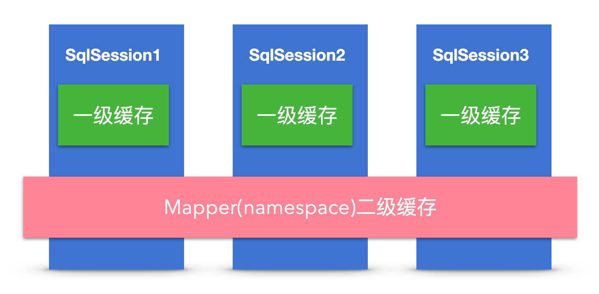

## 一、 Mybaits

### 1.1 Mybaits底层原理是什么样子的？是怎么做到数据库和对象的映射？


**SqlSession**：每个线程都应该有它自己的SqlSession实例。SqlSession的实例不是线程安全的，因此是不能被共享的，所以它的最佳的作用域是请求或方法作用域。绝对不能将SqlSession实例的引用放在一个类的静态域，甚至一个类的实例变量也不行。也绝不能将SqlSession实例的引用放在任何类型的托管作用域中，如Servlet框架中的HttpSession。

**Executor：**Executor（执行器）将MappedStatement对象进行解析，sql参数转化、动态sql拼接，生成jdbc Statement对象，使用Paramterhandler填充参数，使用statementHandler绑定参数。Executor封装了Transaction

**Mapped Statement：**用来存放我们SQL映射文件中的信息包括sql语句，输入参数，输出参数等等。一个SQL节点对应一个MappedStatement对象。

### 1.2 Mybatis加载过程

  1. mybatis配置
     SqlMapConfig.xml，此文件作为mybatis的全局配置文件，配置了mybatis的运行环境等信息。
     mapper.xml文件即sql映射文件，文件中配置了操作数据库的sql语句。此文件需要在SqlMapConfig.xml中加载。
  2. 通过mybatis环境等配置信息构造SqlSessionFactory即会话工厂
  3. 由会话工厂创建sqlSession即会话，操作数据库需要通过sqlSession进行。
  4. mybatis底层自定义了Executor执行器接口操作数据库，Executor接口有两个实现，一个是基本执行器、一个是缓存执行器。
  5. Mapped Statement也是mybatis一个底层封装对象，它包装了mybatis配置信息及sql映射信息等。mapper.xml文件中一个sql对应一个Mapped Statement对象，sql的id即是Mapped statement的id。
  6. Mapped Statement对sql执行输入参数进行定义，包括HashMap、基本类型、pojo，Executor通过Mapped Statement在执行sql前将输入的java对象映射至sql中，输入参数映射就是jdbc编程中对preparedStatement设置参数。
  7. Mapped Statement对sql执行输出结果进行定义，包括HashMap、基本类型、pojo，Executor通过Mapped Statement在执行sql后将输出结果映射至java对象中，输出结果映射过程相当于jdbc编程中对结果的解析处理过程。

mybatis使用XMLMapperBuilder类的parse方法来解析mapper配置文件

mybaits使用XPath解析mapper的配置文件后将其中的resultMap、parameterMap、cache、statement等节点组装成MappedStatement类，后放到configuration中，而这个configuration对象可以从sqlSession中获取的。

### 1.3 mybatis的一级和二级缓存



1. **一级缓存的作用范围为同一个sqlsession**，不同的sqlSession之间的缓存数据区域是互相不影响的。也就是他只能作用在同一个sqlSession中，不同的sqlSession中的缓存是互相不能读取的；**二级缓存的作用范围为同一个namespace和mapper**。
2. 一级缓存无过期时间，只有生命周期；二级缓存有过期时间，但没有后台线程进行检测
3. 清空缓存。一级缓存时执行commit，close，增删改等操作，就会清空当前的一级缓存；当对SqlSession执行更新操作（update、delete、insert）后并执行commit时，不仅清空其自身的一级缓存（执行更新操作的效果），也清空二级缓存（执行commit()的效果）。
4. 二级缓存是mapper级别的缓存，多个SqlSession去操作同一个Mapper的sql语句，多个SqlSession可以共用二级缓存，二级缓存是跨SqlSession的。二级缓存的作用范围更大。
5. 开启了二级缓存后，还需要将要缓存的pojo实现Serializable接口，为了将缓存数据取出执行反序列化操作，因为二级缓存数据存储介质多种多样，不一定只存在内存中，有可能存在硬盘中。

### 1.4 sql注入怎么处理

```
#
```

### 1.5 哪些请求包含哪些SQL，收集起来，怎么做？

哪些请求包含哪些SQL，收集起来，怎么做？url对应哪些SQL？应该的方法怎么和SQL对应起来？
思路：写个mybatis插件，打印出执行的方法和sql。
从Exception中获取调用的堆栈，从调用controller到mybatis方法名，然后拼接起来。

## 二、Tomcat


#### tomcat应用隔离


其中有关类加载器的执行步骤如下：
1/初始化commonLoader、catalinaLoader和sharedLoader;
2/将catalinaLoader设置为Tomcat主线程的线程上下文类加载器；
3/线程安全的加载class。

Catalina事实上就由 catalinaClassLoader（其实就是StandardClassLoader）加载进来了，而下一句newInstance时，所有以Catalina为根的对象的类也会全部被隐式加载进来。所谓的隐式加载，就是指在当前类中所有new的对象，如果没有被加载，则使用当前类的类加载器加载，即this.getClass(),getClassLoader()会默认加载该类中所有被new出来的对象的类（前提是他们没在别处先被加载过）。

WebappClassLoader的父类加载器是sharedLoader(即org.apache.catalina.loader.StandardClassLoader)

#### jvm表示一个是否是同一个类有两个条件

1. 这个类的完整类名是否一样（这个类名包括类所在的包名）;
2. 加载这个类的CLassLoader（指的是ClassLoader实例对象）必须相同。
3. 换句话说，在JVM中，即使这两个类对象（class对象）来源同一个Class文件，被同一个虚拟机所加载，但只要加载它们的ClassLoader实例对象不同，那么这两个类对象也是不相等的


CommonClassLoader能加载的类都可以被Catalina ClassLoader和SharedClassLoader使用，从而实现了公有类库的共用，而CatalinaClassLoader和Shared ClassLoader自己能加载的类则与对方相互隔离。

WebAppClassLoader可以使用SharedClassLoader加载到的类，但各个WebAppClassLoader实例之间相互隔离。

而JasperLoader的加载范围仅仅是这个JSP文件所编译出来的那一个.Class文件，它出现的目的就是为了被丢弃：当Web容器检测到JSP文件被修改时，会替换掉目前的JasperLoader的实例，并通过再建立一个新的Jsp类加载器来实现JSP文件的HotSwap功能。

tomcat 违背了java 推荐的双亲委派模型了吗？答案是：违背了。 
每个webappClassLoader加载自己的目录下的class文件，不会传递给父类加载器。
我们扩展出一个问题：如果tomcat 的 Common ClassLoader 想加载 WebApp ClassLoader 中的类，该怎么办？
看了前面的关于破坏双亲委派模型的内容，我们心里有数了，我们可以使用线程上下文类加载器实现，使用线程上下文加载器，可以让父类加载器请求子类加载器去完成类加载的动作。牛逼吧。


#### tomcat里面都有哪些调优属性

Tomcat的优化主要有三方面，分为系统优化，Tomcat 本身的优化，Java 虚拟机（JVM）调优。

1、工作方式选择
为了提升性能，首先就要对代码进行动静分离，让 Tomcat 只负责 jsp 文件的解析工作。如采用 Apache 和 Tomcat 的整合方式，他们之间的连接方案有三种选择，JK、http_proxy 和 ajp_proxy。相对于 JK 的连接方式，后两种在配置上比较简单的，灵活性方面也一点都不逊色。但就稳定性而言不像JK 这样久经考验，所以建议采用 JK 的连接方式。 
2、Connector 连接器的配置
之前文件介绍过的 Tomcat 连接器的三种方式： bio、nio 和 apr，三种方式性能差别很大，apr 的性能最优， bio 的性能最差。而 Tomcat 7 使用的 Connector  默认就启用的 Apr 协议，但需要系统安装 Apr 库，否则就会使用 bio 方式。
3、配置文件优化
配置文件优化其实就是对 server.xml 优化，可以提大大提高 Tomcat 的处理请求的能力，下面我们来看 Tomcat 容器内的优化。
默认配置下，Tomcat 会为每个连接器创建一个绑定的线程池（最大线程数 200），服务启动时，默认创建了 5 个空闲线程随时等待用户请求。
首先，打开 ${TOMCAT_HOME}/conf/server.xml，搜索【<Executor name="tomcatThreadPool"】，开启并调整为

```java
<Executor name="tomcatThreadPool" namePrefix="catalina-exec-"
        maxThreads="500" minSpareThreads="20" maxSpareThreads="50" maxIdleTime="60000"/>
```

更多参数设置参考：[（荐）Tomcat 调优及 JVM 参数优化](


## 三、 Kafka

[Kafka学习笔记](../kafka/kafka_note.md ':include')

## 四、redis分布式锁

见 [redis](../redis/redis.md)

## 五、netty

####  4.1. netty-TCP 粘包/拆包的原因及解决方法

TCP粘包/分包的原因：

- 应用程序写入的字节大小大于套接字发送缓冲区的大小，会发生拆包现象，而应用程序写入数据小于套接字缓冲区大小，网卡将应用多次写入的数据发送到网络上，这将会发生粘包现象；
- 进行MSS大小的TCP分段，当TCP报文长度-TCP头部长度>MSS的时候将发生拆包
- 以太网帧的payload（净荷）大于MTU（1500字节）进行ip分片。

解决方法

- 消息定长：FixedLengthFrameDecoder类
- 包尾增加特殊字符分割：行分隔符类：LineBasedFrameDecoder或自定义分隔符类 ：DelimiterBasedFrameDecoder
- 将消息分为消息头和消息体：LengthFieldBasedFrameDecoder类。分为有头部的拆包与粘包、长度字段在前且有头部的拆包与粘包、多扩展头部的拆包与粘包。

#### 4.2 **Netty的零拷贝实现？**

- Netty的接收和发送ByteBuffer采用DIRECT BUFFERS，使用堆外直接内存进行Socket读写，不需要进行字节缓冲区的二次拷贝。堆内存多了一次内存拷贝，JVM会将堆内存Buffer拷贝一份到直接内存中，然后才写入Socket中。ByteBuffer由ChannelConfig分配，而ChannelConfig创建ByteBufAllocator默认使用Direct Buffer

- CompositeByteBuf 类可以将多个 ByteBuf 合并为一个逻辑上的 ByteBuf, 避免了传统通过内存拷贝的方式将几个小Buffer合并成一个大的Buffer。addComponents方法将 header 与 body 合并为一个逻辑上的 ByteBuf, 这两个 ByteBuf 在CompositeByteBuf 内部都是单独存在的, CompositeByteBuf 只是逻辑上是一个整体

- 通过 FileRegion 包装的FileChannel.tranferTo方法 实现文件传输, 可以直接将文件缓冲区的数据发送到目标 Channel，避免了传统通过循环write方式导致的内存拷贝问题。

- 通过 wrap方法, 我们可以将 byte[] 数组、ByteBuf、ByteBuffer等包装成一个 Netty ByteBuf 对象, 进而避免了拷贝操作。

- Selector BUG：若Selector的轮询结果为空，也没有wakeup或新消息处理，则发生空轮询，CPU使用率100%，

- Netty的解决办法：对Selector的select操作周期进行统计，每完成一次空的select操作进行一次计数，若在某个周期内连续发生N次空轮询，则触发了epoll死循环bug。重建Selector，判断是否是其他线程发起的重建请求，若不是则将原SocketChannel从旧的Selector上去除注册，重新注册到新的Selector上，并将原来的Selector关闭。

  ​	


#### netty为什么这么高效

##### 1.Netty线程模型

##### 2.使用epoll

##### 3.netty零拷贝

在发送数据的时候，传统的实现方式四次数据拷贝和四次上下文切换：

1. 数据从磁盘读取到内核的read buffer
2. 数据从内核缓冲区拷贝到用户缓冲区
3. 数据从用户缓冲区拷贝到内核的socket buffer
4. 数据从内核的socket buffer拷贝到网卡接口的缓冲区

明显上面的第二步和第三步是没有必要的，通过java的FileChannel.transferTo方法，可以避免上面两次多余的拷贝（当然这需要底层操作系统支持）

1. 调用transferTo,数据从文件由DMA引擎拷贝到内核read buffer
2. 接着DMA从内核read buffer将数据拷贝到网卡接口buffer

Netty也提供了零拷贝的一些实现。关于ByteBuffer，Netty提供了两个接口:

1. ByteBuf
2. ByteBufHolder
   对于ByteBuf，Netty提供了多种实现：
3. Heap ByteBuf:直接在堆内存分配
4. Direct ByteBuf：直接在内存区域分配而不是堆内存
5. CompositeByteBuf：组合Buffer
   直接在内存区域分配空间，而不是在堆内存中分配。如果使用传统的堆内存分配，当我们需要将数据通过socket发送的时候，就需要从堆内存拷贝到直接内存，然后再由直接内存拷贝到网卡接口层。
   Netty提供的直接Buffer，直接将数据分配到内存空间，从而避免了数据的拷贝，实现了零拷贝。

##### 4.基于buffer

传统的I/O是面向字节流或字符流的，以流式的方式顺序地从一个Stream 中读取一个或多个字节, 因此也就不能随意改变读取指针的位置。
在NIO中, 抛弃了传统的 I/O流, 而是引入了Channel和Buffer的概念. 在NIO中, 只能从Channel中读取数据到Buffer中或将数据 Buffer 中写入到 Channel。
基于buffer操作不像传统IO的顺序操作, NIO 中可以随意地读取任意位置的数据

##### 5.无锁化的串行设计理念

##### 6.粘包和拆包

对于粘包和拆包问题，常见的解决方案有四种：
1.客户端在发送数据包的时候，每个包都固定长度，比如1024个字节大小，如果客户端发送的数据长度不足1024个字节，则通过补充空格的方式补全到指定长度；
2.客户端在每个包的末尾使用固定的分隔符，例如\r\n，如果一个包被拆分了，则等待下一个包发送过来之后找到其中的\r\n，然后对其拆分后的头部部分与前一个包的剩余部分进行合并，这样就得到了一个完整的包；
3.将消息分为头部和消息体，在头部中保存有当前整个消息的长度，只有在读取到足够长度的消息之后才算是读到了一个完整的消息；
4.通过自定义协议进行粘包和拆包的处理。

Netty 中的拆包器
固定长度的拆包器 FixedLengthFrameDecoder
行拆包器 LineBasedFrameDecoder
分隔符拆包器 DelimiterBasedFrameDecoder
基于数据包长度的拆包器 LengthFieldBasedFrameDecoder


## 六、rocketMQ

### 6.1 rocketMQ 事物

#### 6.1.1 方案1–业务方自己实现

假设消息中间件没有提供“事务消息”功能，比如你用的是Kafka。那如何解决这个问题呢？

解决方案如下： 
（1）Producer端准备1张消息表，把update DB和insert message这2个操作，放在一个DB事务里面。

（2）准备一个后台程序，源源不断的把消息表中的message传送给消息中间件。失败了，不断重试重传。允许消息重复，但消息不会丢，顺序也不会打乱。

（3）Consumer端准备一个判重表。处理过的消息，记在判重表里面。实现业务的幂等。但这里又涉及一个原子性问题：如果保证消息消费 + insert message到判重表这2个操作的原子性？

消费成功，但insert判重表失败，怎么办？关于这个，在Kafka的源码分析系列，第1篇， exactly once问题的时候，有过讨论。

通过上面3步，我们基本就解决了这里update db和发送网络消息这2个操作的原子性问题。

但这个方案的一个缺点就是：需要设计DB消息表，同时还需要一个后台任务，不断扫描本地消息。导致消息的处理和业务逻辑耦合额外增加业务方的负担。

#### 6.1.2 方案2 – RocketMQ 事务消息

为了能解决该问题，同时又不和业务耦合，RocketMQ提出了“事务消息”的概念。

具体来说，就是把消息的发送分成了2个阶段：Prepare阶段和确认阶段。

具体来说，上面的2个步骤，被分解成3个步骤： 
(1) 发送Prepared消息 
(2) update DB 
(3) 根据update DB结果成功或失败，Confirm或者取消Prepared消息。

可能有人会问了，前2步执行成功了，最后1步失败了怎么办？这里就涉及到了RocketMQ的关键点：RocketMQ会定期（默认是1分钟）扫描所有的Prepared消息，询问发送方，到底是要确认这条消息发出去？还是取消此条消息？


#### 6.1.3 人工介入

可能有人又要说了，无论方案1，还是方案2，发送端把消息成功放入了队列，但消费端消费失败怎么办？

消费失败了，重试，还一直失败怎么办？是不是要自动回滚整个流程？

答案是人工介入。从工程实践角度讲，这种整个流程自动回滚的代价是非常巨大的，不但实现复杂，还会引入新的问题。比如自动回滚失败，又怎么处理？

对应这种极低概率的case，采取人工处理，会比实现一个高复杂的自动化回滚系统，更加可靠，也更加简单。


https://blog.csdn.net/d729332647/article/details/79324767

### rocketMQ的推拉模式

拉模式指的是客户端主动向服务端发出请求，拉取相关数据。其优点是此过程由客户端发起请求，故不存在推模式中数据积压的问题。缺点是可能不够及时
推模式指的是客户端与服务端建立好网络长连接，服务方有相关数据，直接通过长连接通道推送到客户端。其优点是及时。缺点是不知道客户端的数据消费能力，可能导致数据积压在客户端，来不及处理。

拉模式中，为了保证消息消费的实时性，采取了长轮询消息服务器拉取消息的方式。每隔一定时间，客户端想服务端发起一次请求，服务端有数据就返回数据，服务端如果此时没有数据，保持连接。等到有数据返回（相当于一种push），或者超时返回。

MQPushConsumer方式，consumer把轮询过程封装了，并注册MessageListener监听器，取到消息后，唤醒MessageListener的consumeMessage()来消费，对用户而言，感觉消息是被推送（push）过来的。主要用的也是这种方式。

### rocketMQ顺序消费

RocketMQ采用了局部顺序一致性的机制，实现了单个队列中的消息严格有序。也就是说，如果想要保证顺序消费，必须将一组消息发送到同一个队列中，然后再由消费者进行注意消费。
RocketMQ推荐的顺序消费解决方案是：安装业务划分不同的队列，然后将需要顺序消费的消息发往同一队列中即可，不同业务之间的消息仍采用并发消费。这种方式在满足顺序消费的同时提高了消息的处理速度，在一定程度上避免了消息堆积问题。

消息有序指的是可以按照消息的发送顺序来消费。
RocketMQ可以严格的保证消息有序。但这个顺序，不是全局顺序，只是分区（queue）顺序。要全局顺序只能一个分区。

### 消息拉取长轮询

 rocketMq对pull和push方式的消息获取都有支持，push不是本文的重点，我们就重点看看pull模式在rocketMq中是怎样实现的。首先要表明的是，在pull消息时，rocketMq也是使用了长轮询方式

长轮询是对普通轮询的优化，依然由客户端发起请求，服务端收到后并不立即响应，而是hold住客户端连接，等待数据产生变更后(或者超过指定时间还未产生变更)才回复客户端，说白了，就是对普通轮询加了个控制，你客户端可以随时请求我，但是回不回复我说了算，这就保证了服务端不会被客户端带节奏，导致自己的压力不可控

消费者主动发起pull请求，broker在处理消息拉取请求时，如果没有查询到消息，将不返回消费者任何信息(相当于挂起消费者，使其不会立即发起下一次拉取请求)，会将请求信息pullRequest添加到pullRequestTable中，等待触发通知消费者的事件(pullRequestTable表示待处理的消息拉取请求，其中包含了消费者信息(可以据此获取与该消费者的长连接channel)，以及其想要拉取的消息位置，后面需要根据这些信息来将对应的新消息返回给对应的消费者)

broker中，有两个地方会触发该事件：
    1).DefaultMessageStore.ReputMessageService.run(定时任务，1毫秒一次)
不断的检测是否有新消息产生，如果检测到了，就发出消息到达通知，将新消息发送给对应的消费者
    2).PullRequestHoldService.run(定时任务，5s一次)，该任务会逐个检查pullRequestTable中的pullRequest，判断是否有对应的新消息产生。如果有则返回给消费者；没有则检查该pullRequest从加入到现在是否已经超过长轮询等待时间(默认15秒)，如果是，也会返回消费者
消费者收到broker返回后，无论是否有收到新消息，都会在处理完成后发起下一次的pull请求

## 七、RabbitMQ


#### 为什么RabbitMQ会随着队列堆积吞吐量降低

RabbitMQ中的队列消息可以是以下四种状态：

alpha：消息内容和消息索引都存储在内存中
beta：消息内容保存在磁盘中，消息索引保存在内存中
gamma：消息内容保存在磁盘中，消息索引在磁盘和内存中都有
delta：消息内容和索引都在磁盘中

delta状态读取消息需要两次IO操作，第一次是读取消息索引rabbit_queue_index，第二次是读取消息内容rabbit_msg_store；beta和gamma状态都只需要一次IO操作去读取消息内容即可。
RabbitMQ运行时会根据统计的消息传送速度定期计算一个当前内存中能够保存的最大消息数量target_ram_count，如果alpha状态的消息数大于这个数量，就会引起消息状态的转换，多余的消息可能会转到其它3个状态中的一个，具体转移到哪个状态是要看当前内存容量。
在内存负载很高的情况下，能够通过将一部分消息由磁盘保存来节省内存空间，而在内存负载降低时，又可以将这部分消息渐渐流回内存中，使得整个队列具有很好的弹性。

总结：为什么堆积导致性能下降
在系统负载较高时，已接收到的消息若不能很快地被消费掉，这些消息就会进入到很深的队列中去，这样会增加处理每个消息的平均开销。因为要花更多的时间和资源处理堆积的消息，所以此时处理新入的消息能力就会降低，使得后流入的消息又被积压的更深，继续增大后续的开销，导致情况变得越来越恶化，使得系统处理能力大大降低。


## 八、xxl-job

xxl-job分为调度中心和执行器。调度中心分配任务，根据任务列表cron表达式、分配策略（Hash、轮循）计算出具体由哪个执行器执行任务。执行器负责具体任务的执行。


## 九、HSF

#### 

https://blog.csdn.net/weixin_30652271/article/details/94831019
HSF其实是一个RPC框架，RPC是Remote Procedure Call,就是远程服务调用.
预发环境和线上环境是通的，
但怎么保证预发环境的detail不会调用线上的ic呢？其实靠的就是ConfigServer,预发的ConfigServer和线上的ConfigServer是不同的，预发的detail连的是预发的ConfigServer,预发的ConfigServer肯定没有线上ic的地址，所有永远不会调用到线上的ic,集团的这些环境都是通过中间件的ConfigServer这个产品进行区分的,就是线下环境会有性能环境、二套环境啊，ConfigServer不同罢了，里面的ip列表都不一样。

HSF和tomcat其实没什么关系,hsf-standalone可以只用一个main方法就可以启动hsf
配置文件配置好后，如果是在web容器中使用hsf的，先让web容器跑起来，web容器会初始化spring，
spring会在beanFactory初始化所有bean的时候帮你把hsf发布出去，服务就提供出去了，就什么都不用管了。

HSF自身架构
hsf分成三层：
第一个是Proxy层，主要处理hsf和应用交互的一些逻辑，比如做接口的代理，执行业务的方法
第二个是Remoting层，主要处理网络层中的应用层数据，它处理的是rpc协议
第三个是Processer层，主要处理hsf自身的一些逻辑，比如说序列化反序列化，异常处理等
处理完所有的逻辑之后，hsf是基于netty编程的，netty负责处理io模块来进行通信，这样的话，
ConfigServer/Diamond与Proxy层进行交互之后，就组成了整个的consumer/provider的调用过程，

什么是软负载，说白了就是导流量， 怎么导流量呢？
第一种方式就是归组，
软负载策略–归组：归组规则是可以通过Diamond配置动态推送的，可以动态的把机器配置成A组别还是B组别，也有利于动态扩容
软负载策略–路由：路由规则–通过配置将客户端流量导到某些机器上。如何配置：Diamond规则，内容是Groovy脚本
与归组规则区别：粒度到方法参数；有保护机制(有算空保护，即当算出来的ip地址是空的时候会随机地全量调用)
归组规则的粒度只能到某个服务，不能到某个方法。
简单的来看，都是通过配置将流量导致某些机器上， 那什么时候用归组规则，什么时候用路由规则。
软负载策略–同机房优先：在阀值范围内，客户端会优先调用同机房的客户端

#### HSF中的Sar包作用

隔离容器–Pandora(taobao-hsf.sar)
1.所有中间件(hsf/tddl/notify)都在Pandora内部
2.提供类隔离机制
为什么把他们打在一起，因为Pandora提供了一种类隔离的机制，这样的好处是当应用特别复杂的时候，会依赖特别多的jar包，而这些jar包可能又会依赖不同版本的中间件，排除起来会非常的痛苦，当classpath目录下有两个packagename和classname都相同的类的时候，jvm会随机加载一个，这个时候如果不把多余的依赖排除干净的话，是无法保证在运行时期所使用的hsf到底是哪个版本，如果使用sar包的话，惟一确定的一点就是hsf就是sar包里的版本，它只会用sar包里的版本，还有一点，比如说hsf会依赖google的guava库，当你的应用也要用guava库，它们之间是相互隔离的，这个隔离就是通过Pandora来做到的。


## 十、TiDB

