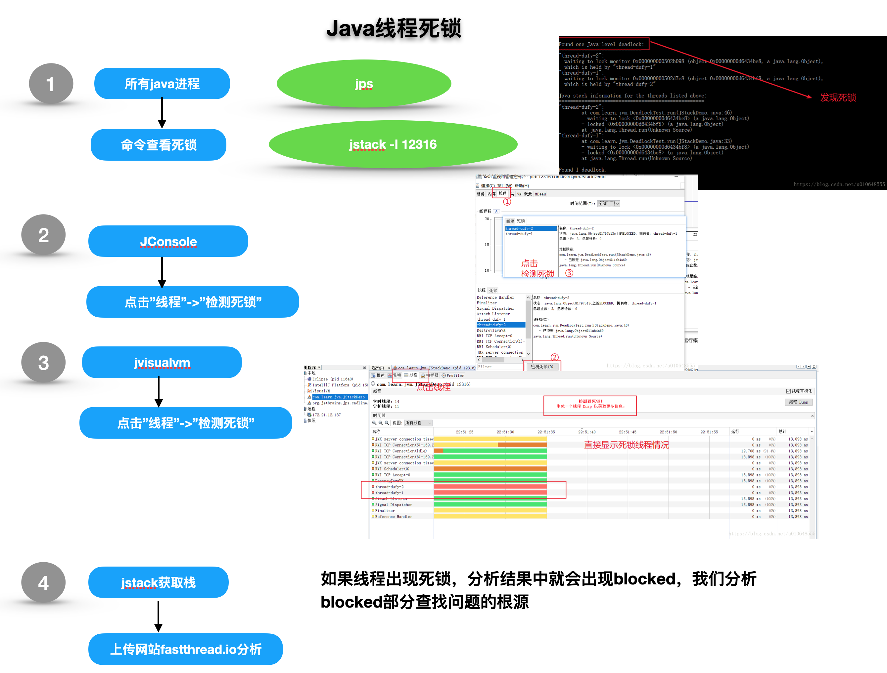

### 一、Java应用

#### 线上CPU100%怎么处理


#### 线上OOM怎么处理

以上步骤从2开始

#### Java死锁处理




### 二、数据库

#### 数据库cpu到了100%, 如何找到问题

**mysql**

1、通过 top 命令，查看进程列表里，存在两个高CPU耗用的Oracle/mysql进程

2、show processlist;

SHOW PROCESSLIST显示哪些线程正在运行

不在mysql提示符下使用时用mysql -uroot  -e 'Show  processlist'   或者   mysqladmin processlist

如果有 SUPER 权限，则可以看到全部的线程，否则，只能看到自己发起的线程（这是指，当前对应的 [MySQL](http://lib.csdn.net/base/mysql) 帐户运行的线程）。 

```
mysql> show processlist;

+—–+————-+——————–+

| Id | User | Host | db | Command | Time| State | Info

+—–+————-+——————–+

|207|root |192.168.0.2:51621 |mytest | Sleep | 5 | | NULL

|208|root |192.168.0.2:51622 |mytest | Sleep | 5 | | NULL

|220|root |192.168.0.2:51676 |mytest |Query | 84 | locked |

select name,culture,value,type from book where id=1

```


id列:一个标识，你要kill 一个语句的时候很有用。

user列: 显示当前用户，如果不是root，这个命令就只显示你权限范围内的sql语句。

host列:显示这个语句是从哪个ip 的哪个端口上发出的。可用来追踪出问题语句的用户。

db列:显示这个进程目前连接的是哪个[数据库](http://lib.csdn.net/base/mysql)。

command列:显示当前连接的执行的命令，一般就是休眠（sleep），查询（query），连接（connect）。

time列:此这个状态持续的时间，单位是秒。 


state列:显示使用当前连接的sql语句的状态，很重要的列，后续会有所有的状态的描述，请注意，state只是语句执行中的某一个状态，一个sql语句，已查询为例，可能需要经过copying to tmp table，Sorting result，Sending data等状态才可以完成。 

- Copying to tmp table on disk 

  由于临时结果集大于 tmp_table_size，正在将临时表从内存存储转为磁盘存储以此节省内存。
  索引及现有结构无法涵盖查询条件，才会建立一个临时表来满足查询要求，产生巨大的恐怖的i/o压力。
  很可怕的搜索语句会导致这样的情况，如果是数据分析，或者半夜的周期数据清理任务，偶尔出现，可以允许。频繁出现务必优化之。
  Copy to tmp table通常与连表查询有关，建议逐渐习惯不使用连表查询。
  实战范例：
  某社区数据库阻塞，求救，经查，其服务器存在多个数据库应用和网站，其中一个不常用的小网站数据库产生了一个恐怖的copy to tmp table操作，导致整个硬盘i/o和cpu压力超载。Kill掉该操作一切恢复。

- Locked 

  被其他查询锁住了。
  有更新操作锁定
  通常使用innodb(支持行锁定)可以很好的减少locked状态的产生，但是切记，更新操作要正确使用索引，即便是低频次更新操作也不能疏忽。如上影响结果集范例所示。
  在myisam的时代，locked是很多高并发应用的噩梦。所以mysql官方也开始倾向于推荐innodb。

- Sending data 

  正在处理 SELECT 查询的记录，同时正在把结果发送给客户端。
  Sending data并不是发送数据，别被这个名字所欺骗，这是从物理磁盘获取数据的进程，如果你的影响结果集较多，那么就需要从不同的磁盘碎片去抽取数据，
  偶尔出现该状态连接无碍。
  回到上面影响结果集的问题，一般而言，如果sending data连接过多，通常是某查询的影响结果集过大，也就是查询的索引项不够优化。
  如果出现大量相似的SQL语句出现在show proesslist列表中，并且都处于sending data状态，优化查询索引，记住用影响结果集的思路去思考。

- Sorting for order 

  正在为 GROUP BY 做排序 

- Sorting for group 

  正在为 ORDER BY 做排序 

  和Sending data类似，结果集过大，排序条件没有索引化，需要在内存里排序，甚至需要创建临时结构排序 

- waiting for handler insert 

  偶尔出现无妨
  如大量出现，迅速检查数据库到前端的网络连接状态和流量
  案例:因外挂程序，内网数据库大量读取，内网使用的百兆交换迅速爆满，导致大量连接阻塞在waiting for net，数据库连接过多崩溃
  大部分状态对应很快的操作，只要有一个线程保持同一个状态好几秒钟，那么可能是有问题发生了，需要检查一下。还有其它的状态没在上面中列出来，不过它们大部分只是在查看服务器是否有存在错误是才用得着。
