最近的工作情况，难度比较大的项目。

#### http servlet生命周期，在springmvc对原生servlet做了一个怎么样的包装来实现一个自己的mvc能力的？
1.加载和实例化。Servlet容器负责加载和实例化Servlet。当Servlet容器启动时，或者在容器检测到需要这个Servlet来响应第一个请求时，创建Servlet实例。
2.初始化。在Servlet实例化之后，容器将调用Servlet的init()方法初始化这个对象。初始化的目的是为了让Servlet对象在处理客户端请求前完成一些初始化的工作，
3.请求处理。Servlet容器调用Servlet的service()方法对请求进行处理。service()方法为Servlet的核心方法，客户端的业务逻辑应该在该方法内执行，典型的服务方法的开发流程为：解析客户端请求-〉执行业务逻辑-〉输出响应页面到客户端
4.服务终止。容器就会调用实例的destroy()方法，以便让该实例可以释放它所使用的资源
在整个Servlet的生命周期过程中，创建Servlet实例、调用实例的init()和destroy()方法都只进行一次，当初始化完成后，Servlet容器会将该实例保存在内存中，通过调用它的service()方法，为接收到的请求服务。如建立数据库的连接，获取配置信息等。对于每一个Servlet实例，init()方法只被调用一次。

Spring web MVC框架提供了MVC(模型 - 视图 - 控制器)架构和用于开发灵活和松散耦合的Web应用程序的组件。MVC模式导致应用程序的不同方面(输入逻辑，业务逻辑和UI逻辑)分离，同时提供这些元素之间的松散耦合
模型（Model）：封装了应用程序的数据，通常由POJO类组成
视图（View）：负责渲染模型数据，一般来说它生成客户端浏览器可以解释HTML输出
控制器(Controller)：负责处理用户请求并构建适当的模型，并将其传递给视图进行渲染

Spring MVC框架是围绕DispatcherServlet设计的，它处理所有的请求和响应。
DispatcherServlet处理HTTP请求的工作流程：(DispatcherServlet，HandlerMapping，Controller，ViewResolver。简称DHCV)
1/接受HTTP请求后，DispatcherServlet
2/会查询HandlerMapping以调用相应的Controller（根据请求的url）
3/Controller接受请求并根据请求的类型Get/Post调用相应的服务方法，服务方法进行相应的业务处理，并设置模型数据，最后将视图名称返回给DispatcherServlet
4/DispatcherServlet根据返回的视图名称从ViewResolver获取对应的视图
5/DispatcherServlet将模型数据传递到最终的视图，并将视图返回给浏览器。

DispatcherServlet extends FrameworkServlet
FrameworkServlet extends HttpServletBean
HttpServletBean extends HttpServlet

FrameworkServlet重载了doGet、doPost、doPut、doDelete等方法
DispatcherServlet重载了FrameworkServlet#onRefresh方法，在HttpServletBean初始化init的时候被调用

HttpServletBean#init->initServletBean()->DispatcherServlet#initServletBean->initFrameworkServlet->initWebApplicationContext->onRefresh->DispatcherServlet#onRefresh->initStrategies


#### session和cookie区别，在服务端session有没有什么别的替代方案，来达到和session同样的效果？
cookie数据保存在客户端，session数据保存在服务器端。session 的运行依赖 session id，而 session id 是存在 cookie中的
为了解决禁用cookie后的页面处理，通常采用url重写技术

用Cookies有个底线。这个底线一般来说，遵循以下原则。
不要保存私人信息。
任何重要数据，最好通过加密形式来保存数据
是否保存登陆信息，需有用户自行选择。
单个cookie保存的数据不能超过4K。

cookie数据结构
生命周期
名字
编码
限制访问 Secure，HttpOnly
Domain 属性
Path 属性

session数据结构
sessionId
过期时间
超时时间

可以使用JWT（JSON WEB TOKEN）来替代session【HPS】
jwt的第三部分是一个签证信息，这个签证信息由三部分组成：header (base64后的)、payload (base64后的)、secret，将这三部分用.连接成一个完整的字符串,构成了最终的jw
1/header
jwt的头部承载两部分信息：
{
  'typ': 'JWT',
  'alg': 'HS256'
}
声明类型，这里是jwt
声明加密的算法 通常直接使用 HMAC SHA256
2/playload
签发者、签发时间、过期时间、唯一身份标识，主要用来作为一次性token、
3/signature
base64加密后的header和base64加密后的payload使用.连接组成的字符串，然后通过header中声明的加密方式进行加盐secret组合加密，然后就构成了jwt的第三部分。

#### classLoader作用，怎么样把一个类装载起来，装载在jvm的哪一部分？
classLoader分类
bootstrap,加载 JAVA_HOME\lib 目录中。
ExeClassLoader，加载JAVA_HOME\jre\lib\ext 目录中
appClassLoader（也叫System ClassLoader),加载用户路径（classpath）上的类库。

lvpri
loading加载。将二进制字节流转化为方法区的运行时数据结构，读入内存，并为之创建一个java.lang.Class对象。（二运数入内存，创class）
validate验证。确保 Class 文件的字节流中包含的信息是否符合当前虚拟机的要求，并且不会危害虚拟机自身的安全。
prepare准备。为类变量分配内存并设置类变量的初始值，静态常量此时为0
resolve解析。将常量池中的符号引用替换为直接引用的过程。
initialization初始化。声明类变量时指定初始值和使用静态初始化块为类变量指定初始值


#### 如果想往java类中分配1G的内存空间，需要怎么样？注意哪些问题

#### HashMap是怎么扩展长度？什么时候扩展
当hashmap中的元素个数超过数组大小*loadFactor时，就会进行数组扩容，loadFactor的默认值为0.75，也就是说，默认情况下，数组大小为16，那么当hashmap中元素个数超过16*0.75=12的时候，就把数组的大小扩展为2*16=32，即扩大一倍，然后重新计算每个元素在数组中的位置，而这是一个非常消耗性能的操作。

jdk1.8在链表长度大于等于8的时候，转为红黑树插入；当小于等于6的时候转成链表。

这边也可以引申到一个问题HashMap是先插入还是先扩容：HashMap初始化后首次插入数据时，先发生resize扩容再插入数据，之后每当插入的数据个数达到threshold时就会发生resize，此时是先插入数据再resize。

resize重新计算
h & (length - 1); //hash值&表长度
使用的是2次幂的扩展(指长度扩为原来2倍)，所以，元素的位置要么是在原位置，要么是在原位置再移动2次幂的位置。
扩充HashMap的时候，不需要像JDK1.7的实现那样重新计算hash，只需要看看原来的hash值新增的那个bit是1还是0就好了，是0的话索引没变，是1的话索引变成“原索引+oldCap”。oldCap是扩容的大小
这个设计确实非常的巧妙，既省去了重新计算hash值的时间，而且同时，由于新增的1bit是0还是1可以认为是随机的，因此resize的过程，均匀的把之前的冲突的节点分散到新的bucket了。这一块就是JDK1.8新增的优化点。有一点注意区别，JDK1.7中rehash的时候，旧链表迁移新链表的时候，如果在新表的数组索引位置相同，则链表元素会倒置。
https://blog.csdn.net/paincupid/article/details/107615433

#### 线上OOM怎么处理


#### LinkedList是怎么样一个特性？LinkedList如果要倒排，最快的方式是怎么样的？生成一个新的linkedList。可以口述一个这个算法大概是什么样子的？
假设存在链表 1 → 2 → 3 → Ø，我们想要把它改成 Ø ← 1 ← 2 ← 3。

在遍历列表时，将当前节点的 next 指针改为指向前一个元素。由于节点没有引用其上一个节点，因此必须事先存储其前一个元素。在更改引用之前，还需要另一个指针来存储下一个节点。不要忘记在最后返回新的头引用！
class Solution {
	public ListNode reverseList(ListNode head) {
		//申请节点，pre和 cur，pre指向null
		ListNode pre = null;
		ListNode cur = head;
		ListNode tmp = null;
		while(cur!=null) {
			//记录当前节点的下一个节点
			tmp = cur.next;
			//然后将当前节点指向pre
			cur.next = pre;
			//pre和cur节点都前进一位
			pre = cur;
			cur = tmp;
		}
		return pre;
	}
}

复杂度分析
时间复杂度：O(n)O(n)，假设 nn 是列表的长度，时间复杂度是 O(n)O(n)。
空间复杂度：O(1)O(1)。

LikedList都有哪些属性？

#### 简单的linux命令会用的多么?

#### Linux下怎么找出来磁盘上哪个文件占的最大？
[root@localhost data]# find / -type f -size +10G
将输出：
/usr/local/apache2/logs/access_log
马上可以通过du命令查看此文件的大小：
[root@localhost data]# du -h /usr/local/apache2/logs/access_log
24G     /usr/local/apache2/logs/access_log

#### 在Linux下如何让文件夹下的文件让文件按大小排序？
du命令，显示文件或目录所占用的磁盘空间。
方法一：# ls -lhS  l 长格式显示，h human readable模式，大小单位为M,G等易读格式，S size按大小排序。
方法二：# du -h * | sort -n
方法三：# du -h * | sort -n|head du -h * | sort -n|tail

#### Mysql的B+树索引是怎么样去实现
##### 索引
索引也不是“银弹”，它会让写入数据的效率下降。因为在数据写入过程，会涉及索引的更新，这是索引导致写入变慢的主要原因。正是因为要时刻保证 B+ 树索引是一个 m 叉树，所有，索引的存在会导致数据库写入的速度降低。实际上，删除数据也会变慢。

若索引太多，应用程序的性能可能会受到影响。而索引太少，对查询性能又会产生影响，要找到一个平衡点，这对应用程序的性能至关重要。

##### B+ 对的特点
1/每个节点中子节点的个数不能超过 m，也不能小于 m/2；
2/根节点的子节点个数可以不超过 m/2，这是一个例外；
3/m 叉树只存储索引，并不真正存储数据，这个有点儿类似跳表；
4/通过链表将叶子节点串联在一起，这样可以方便的按区间查找；
5/一般情况，根节点会被存储在内存中，其他节点存储在磁盘中。
除了 B+ 树，你可能还听过 B树、B-树。实际上B-树就是B树，其英文翻译都是 B-Tree，这里的 “-”只是一个连接符。
而B树实际上是低版本的B+树，或者说 B+树是B树的改进版。B树跟B+不同点主要集中在这几个地方：

B+ 树索引的所有数据均存储在叶子节点，，而且数据是按照顺序排列的。那么 B+ 树使得范围查找，排序查找，分组查找以及去重查找变得异常简单。而 B 树因为数据分散在各个节点，要实现这一点是很不容易的。

##### B+和B树对比
1/B+树中的节点不存储数据，只是索引，而B树中的节点存储数据.
2/B树中的叶子节点并不需要链表来串联
3/也就是说，B树只是一个每个节点的子节点个数不小于m/2的m叉树。


##### 页
因为内存的易失性。一般情况下，我们都会选择将表中的数据和索引存储在磁盘这种外围设备中。但是和内存相比，从磁盘中读取数据的速度会慢上百倍千倍甚至万倍，所以，我们应当尽量减少从磁盘中读取数据的次数。另外，从磁盘中读取数据时，都是按照磁盘块来读取的，并不是一条一条的读。如果我们能把尽量多的数据放进磁盘块中，那一次磁盘读取操作就会读取更多数据，那我们查找数据的时间也会大幅度降低。如果我们用树这种数据结构作为索引的数据结构，那我们每查找一次数据就需要从磁盘中读取一个节点，也就是我们说的一个磁盘块。

每个节点称为页，页就是我们上面说的磁盘块，在 MySQL 中数据读取的基本单位都是页，所以我们这里叫做页更符合 MySQL 中索引的底层数据结构。

数据库中页的大小是固定的，InnoDB 中页的默认大小是 16KB。如果不存储数据，那么就会存储更多的键值，相应的树的阶数（节点的子节点树）就会更大，树就会更矮更胖，如此一来我们查找数据进行磁盘的 IO 次数又会再次减少，数据查询的效率也会更快。
另外，B+ 树的阶数是等于键值的数量的，如果我们的 B+ 树一个节点可以存储 1000 个键值，那么 3 层 B+ 树可以存储 1000×1000×1000=10 亿个数据。一般根节点是常驻内存的，所以一般我们查找 10 亿数据，只需要 2 次磁盘 IO。

##### 聚集索引 VS 非聚集索引
①聚集索引（聚簇索引clustered index）：以 InnoDB 作为存储引擎的表，表中的数据都会有一个主键，即使你不创建主键，系统也会帮你创建一个隐式的主键。
这是因为 InnoDB 是把数据存放在 B+ 树中的，而 B+ 树的键值就是主键，这种以主键作为 B+ 树索引的键值而构建的 B+ 树索引，我们称之为聚集索引。
②非聚集索引（辅助索引，Secondary Index，也称为非聚集索引）：以主键以外的列值作为键值构建的 B+ 树索引，我们称之为非聚集索引。
非聚集索引与聚集索引的区别在于非聚集索引的叶子节点不存储表中的数据，而是存储该列对应的主键，想要查找数据我们还需要根据主键再去聚集索引中进行查找，这个再根据聚集索引查找数据的过程，我们称为回表。
叶子节点除了包含键值以外，每个叶子节点中的索引行中还包含一个书签（bookmark）。该书签用来告诉InnoDB存储引擎去哪里可以找到与索引相对应的行数据。由于InnoDB存储引擎是索引组织表，因此InnoDB存储引擎的辅助索引的书签就是相应行数据的聚集索引键。
辅助索引的存在并不影响数据在聚集索引中的组织，因此每张表上可以有多个辅助索引，但只能有一个聚集索引。当通过辅助索引来寻找数据时，InnoDB存储引擎会遍历辅助索引并通过叶子级别的指针获得只想主键索引的主键，然后再通过主键索引来找到一个完整的行记录。

聚集索引
1.纪录的索引顺序与无力顺序相同
   因此更适合between and和order by操作
2.叶子结点直接对应数据
 从中间级的索引页的索引行直接对应数据页
3.每张表只能创建一个聚集索引

非聚集索引
1.索引顺序和物理顺序无关
2.叶子结点不直接指向数据页
3.每张表可以有多个非聚集索引，需要更多磁盘和内容
   多个索引会影响insert和update的速度

##### 联合索引

##### 事务隔离级别
【未已重串】
Read UnCommitted（读未提交）、Read Commited（读已提交）、Repeatable Read（可重复读）、Serializable（串行化）
Mysql默认的事务隔离级别是可重复读(Repeatable Read)
Oracle的默认隔离级别就是Read Commited

为什么选读已提交(Read Commited)作为事务隔离级别！
缘由一：在RR隔离级别下，存在间隙锁，导致出现死锁的几率比RC大的多！
此时执行语句
select * from test where id <3 for update;
在RR隔离级别下，存在间隙锁，可以锁住(2,5)这个间隙，防止其他事务插入数据！
而在RC隔离级别下，不存在间隙锁，其他事务是可以插入数据！
ps:在RC隔离级别下并不是不会出现死锁，只是出现几率比RR低而已！

缘由二：在RR隔离级别下，条件列未命中索引会锁表！而在RC隔离级别下，只锁行
此时执行语句
update test set color = 'blue' where color = 'red'; 
在RC隔离级别下，其先走聚簇索引，进行全部扫描。

缘由三：在RC隔离级别下，半一致性读(semi-consistent)特性增加了update操作的并发性！
在5.1.15的时候，innodb引入了一个概念叫做“semi-consistent”，减少了更新同一行记录时的冲突，减少锁等待。
所谓半一致性读就是，一个update语句，如果读到一行已经加锁的记录，此时InnoDB返回记录最近提交的版本，由MySQL上层判断此版本是否满足update的where条件。若满足(需要更新)，则MySQL会重新发起一次读操作，此时会读取行的最新版本(并加锁)！

在RC级别下，主从复制用什么binlog格式？
OK,在该隔离级别下，用的binlog为row格式，是基于行的复制！Innodb的创始人也是建议binlog使用该格式！


#### Mysql的行锁底层是怎么实现的
行锁是命中索引的情况下才会起作用的。

InnoDB的行锁是针对索引加的锁，不是针对记录加的锁。并且该索引不能失效，否则都会从行锁升级为表锁。

当你需要更新一张较大表的大部分甚至全表的数据时。而你又傻乎乎地用索引作为检索条件。一不小心开启了行锁(没毛病啊！保证数据的一致性！)。可MySQL却认为大量对一张表使用行锁，会导致事务执行效率低，从而可能造成其他事务长时间锁等待和更多的锁冲突问题，性能严重下降。所以MySQL会将行锁升级为表锁，即实际上并没有使用索引。
我们仔细想想也能理解，既然整张表的大部分数据都要更新数据，在一行一行地加锁效率则更低。其实我们可以通过explain命令查看MySQL的执行计划，你会发现key为null。表明MySQL实际上并没有使用索引，行锁升级为表锁也和上面的结论一致。

LOCK IN SHARE MODE 会产生死锁，假如两个事务 A 、 B 都读取同一行记录，那么在这一行就加上了共享锁，但是 A 和B 事务中都需要修改这一行，那么都要等待对方释放共享锁才能进行，结果造成了死锁。
只能使用 for update 来防止死锁和重复插入。

##### 索引的行锁是怎么实现的？

#### Mybaits底层原理是什么样子的？是怎么做到数据库和对象的映射？


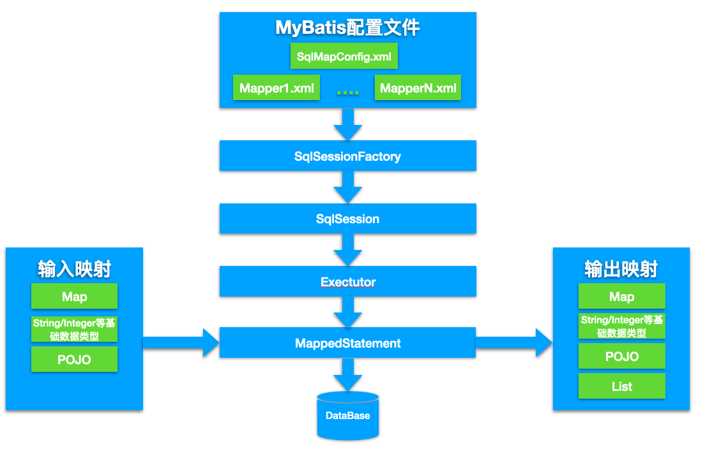


**SqlSession**：每个线程都应该有它自己的SqlSession实例。SqlSession的实例不是线程安全的，因此是不能被共享的，所以它的最佳的作用域是请求或方法作用域。绝对不能将SqlSession实例的引用放在一个类的静态域，甚至一个类的实例变量也不行。也绝不能将SqlSession实例的引用放在任何类型的托管作用域中，如Servlet框架中的HttpSession。

**Executor：**Executor（执行器）将MappedStatement对象进行解析，sql参数转化、动态sql拼接，生成jdbc Statement对象，使用Paramterhandler填充参数，使用statementHandler绑定参数。Executor封装了Transaction

**Mapped Statement：**用来存放我们SQL映射文件中的信息包括sql语句，输入参数，输出参数等等。一个SQL节点对应一个MappedStatement对象。


1、 mybatis配置

SqlMapConfig.xml，此文件作为mybatis的全局配置文件，配置了mybatis的运行环境等信息。

mapper.xml文件即sql映射文件，文件中配置了操作数据库的sql语句。此文件需要在SqlMapConfig.xml中加载。

2、 通过mybatis环境等配置信息构造SqlSessionFactory即会话工厂

3、 由会话工厂创建sqlSession即会话，操作数据库需要通过sqlSession进行。

4、 mybatis底层自定义了Executor执行器接口操作数据库，Executor接口有两个实现，一个是基本执行器、一个是缓存执行器。

5、 Mapped Statement也是mybatis一个底层封装对象，它包装了mybatis配置信息及sql映射信息等。mapper.xml文件中一个sql对应一个Mapped Statement对象，sql的id即是Mapped statement的id。

6、 Mapped Statement对sql执行输入参数进行定义，包括HashMap、基本类型、pojo，Executor通过Mapped Statement在执行sql前将输入的java对象映射至sql中，输入参数映射就是jdbc编程中对preparedStatement设置参数。

7、 Mapped Statement对sql执行输出结果进行定义，包括HashMap、基本类型、pojo，Executor通过Mapped Statement在执行sql后将输出结果映射至java对象中，输出结果映射过程相当于jdbc编程中对结果的解析处理过程。


mybatis使用XMLMapperBuilder类的parse方法来解析mapper配置文件

mybaits使用XPath解析mapper的配置文件后将其中的resultMap、parameterMap、cache、statement等节点组装成MappedStatement类，后放到configuration中，而这个configuration对象可以从sqlSession中获取的。


#### ORM Mapping你怎么理解它，它想解决一个什么痛点？


#### NoSQL应用场景

NoSQL分为4类：K-V类、文档型、列式存储型、全文搜索型

K-V类
存储在内存中的，所以速度快常用来作为缓存服务器。以 Redis 为代表。

文档型
文档型存储的数据格式一般都是Json,它的结构没有约束，可以存储任意结构。代表的数据库有MongoDB。

列式存储型
多用于离线的大数据分析和统计,代表的数据库是HBase。在大数据统计的时候，一般就统计某一列或者某几列的数据。如果这时候是按行存储的话，那么每次从磁盘读取到内存时都会读取整行数据导致IO过大和资源的浪费。
所以节省I/O就采用按列存储，这样每次只需要拿想要的列进行统计。

全文检索型
主要是用在传统关系型数据库在全文检索无力的情况下。代表的有Elasticsearch，分布式文档存储方式。
全文检索引擎采用倒排索引，也就是每个单词都是索引，建立单词到文档的索引，这样满足你搜索条件的当此的结果都会快速的显示出来。
使用方式就是我们从关系数据库中导出数据，转换成Json格式然后将其输入Elasticsearch中建立索引然后使用。

K-V 存储：解决关系数据库无法存储数据结构的问题，以 Redis 为代表。
文档数据库：解决关系数据库强 schema 约束的问题，以 MongoDB、CouchDB 为代表。
列式数据库：解决关系数据库大数据场景下的 I/O 问题，以 HBase、Cassadra 为代表。
全文搜索引擎：解决关系数据库的全文搜索性能问题，以 Elasticsearch 为代表。
图形（Graph）数据库：Neo4J

MongoDB应用场景
基于位置的移动搜索应用
日志分析平台（MongoDB本身自带的高性能聚合框架）
存储简历、或者投递关系等相对复杂的数据结构，比如简历库
可以存储用户数据，或者帖子信息，比如用户中心。


hadoop是什么？
(1)Hadoop是一个开源的框架，可编写和运行分布式应用处理大规模数据，是专为离线和大规模数据分析而设计的，并不适合那种对几个记录随机读写的在线事务处理模式。Hadoop=HDFS（文件系统，数据存储技术相关）+ Mapreduce（数据处理），Hadoop的数据来源可以是任何形式，在处理半结构化和非结构化数据上与关系型数据库相比有更好的性能，具有更灵活的处理能力，不管任何数据形式最终会转化为key/value，key/value是基本数据单元。用函数式变成Mapreduce代替SQL，SQL是查询语句，而Mapreduce则是使用脚本和代码，而对于适用于关系型数据库，习惯SQL的Hadoop有开源工具hive代替。
(2)Hadoop就是一个分布式计算的解决方案.
hadoop能做什么？
hadoop擅长日志分析，facebook就用Hive来进行日志分析，2009年时facebook就有非编程人员的30%的人使用HiveQL进行数据分析；淘宝搜索中 的自定义筛选也使用的Hive；利用Pig还可以做高级的数据处理，包括Twitter、LinkedIn 上用于发现您可能认识的人，可以实现类似Amazon.com的协同过滤的推荐效果。淘宝的商品推荐也是；在Yahoo的40%的Hadoop作业是用pig运行的，包括垃圾邮件的识别和过滤，还有用户特征建模。（2012年8月25新更新，天猫的推荐系统是hive，少量尝试mahout！）


hadoop就是大数据时代里的核心技术，但是hadoop的mapreduce操作专业性太强，所以facebook在这些基础上开发了hive框架，毕竟世界上会sql的人比会java的人多的多。
hive是构建在Hadoop之上的数据仓库，简单的说是因为：①数据存储在hdfs上 ②数据计算用mapreduce


#### springcloud常用的组件以及功能
注册中心 Eureka
负载均衡 Ribbon 
熔断 Hystrix
网关 Zuul
配置 Spring Cloud Config
服务调用 Feign

#### springboot底层实现

#### 做过哪些调优

Cpu/IO/

top -H

top -H -p <pid>

`H`:显示线程，默认只显示进程

显示完整命令top -c

#### 数据库优化 

#### 为什么使用索引会比较快

#### Redis cluster模式，再看一下哨兵、codis
redis cluster是Redis的分布式解决方案，自动将数据进行分片，每个master上放一部分数据。
支撑N个redis master node，每个master node都可以挂载多个slave node，高可用，因为每个master都有salve节点，那么如果mater挂掉，redis 。cluster这套机制，就会自动将某个slave切换成master。

默认情况下，redis cluster的核心的理念，主要是用slave做高可用的，每个master挂一两个slave，主要是做数据的热备，还有master故障时的主备切换，实现高可用的，redis cluster默认是不支持slave节点读或者写的。

redis cluster的hash slot算法
redis cluster有固定的16384个hash slot，对每个key计算CRC16值，然后对16384取模，可以获取key对应的hash slot

redis cluster缺点
由于n个key是比较均匀地分布在Redis Cluster的各个节点上，因此无法使用mget命令一次性获取

##### Codis
Codis分片原理
codis最核心的部分就是数据分片，codis将所有的key划分为1024个slot，首先对客户端传来的key进行crc32计算hash，再将hash值对1024取模，取模后的余数就是这个key的slot位置。每个slot都会唯一影射到一个redis实例，codis会在内存中维护slot和redis实例之间的对应关系。

不同codis实例之间如何同步这个slot和redis实例之间的映射关系数据，因为要保证客户端随便访问到一个codis实例都能够查询到key值对应的redis实例，那就要保障每个codis实例在内存中都保留一份映射关系。为了解决这个问题，codis使用了zookeeper和etcd来解决这问题，codis将slot关系存储在zookeeper中，并且提供了codis dashboard来观察和修改slot关系，当slot关系发生变化后，codis proxy会监听到变化并重新同步slot映射关系到所有codis实例，从而实现多个codis节点之间的数据同步。

Codis扩容
大家喜欢使用codis的一个很大的原因就是codis可以根据业务量对于redis做到动态实例扩容。
在有新增redis实例后，codis会扫描出旧节点中所有待迁移slot中的所有key，然后逐个将key迁移到新的redis节点中。在迁移过程中新旧节点中都有同一个slot，但是其中的key可能还没迁移完成，这时候可能有请求待迁移slot中的key，codis使用的方案不是去看这个key有没有完成迁移，而是立即强制对当前单个key进行迁移，迁移完成后，将请求转发到新的redis实例。

sentinel
sentinel是官方的一种主从方案，主要负责监控主从节点的健康状况，当master节点挂掉后，自动选择一个最优的slave节点顶替master节点。当master节点切换后，sentinel会通知所有slave节点新的master节点地址，并且主从节点的数据复制关系也进行了变更，这些信息都会保存在sentinel中，并下发到所有节点。

sentinel的集群方案主要解决的是HA的问题，并不能解决超大缓存数据的分片和分散访问热点的问题。

#### Redis持久化：RDB、AOF
RDB 的优点:
RDB 是一个非常紧凑（compact）的文件，它保存了 Redis 在某个时间点上的数据集。 
RDB 的缺点:
因为RDB 文件需要保存整个数据集的状态， 所以它并不是一个轻松的操作。因此你可能会至少 5 分钟才保存一次 RDB 文件。 在这种情况下， 一旦发生故障停机， 你就可能会丢失好几分钟的数据。
AOF 的优点:
	AOF 的默认策略为每秒钟 fsync 一次，在这种配置下，Redis 仍然可以保持良好的性能，并且就算发生故障停机，也最多只会丢失一秒钟的数据（ fsync 会在后台线程执行，所以主线程可以继续努力地处理命令请求）。
AOF 的缺点:
对于相同的数据集来说，AOF 文件的体积通常要大于 RDB 文件的体积。根据所使用的 fsync 策略，AOF 的速度可能会慢于 RDB 。

#### Redis缓存更新策略
缓存【更新】：客户端写入数据到数据库，成功之后，让缓存失效（下次请求时从缓存中拿不到，则查询数据库，再放入缓存）

为什么不采取先更新数据库，再更新缓存？
先更新数据库，再更新缓存。这种做法最大的问题就是两个并发的写操作导致脏数据。如下图（以Redis和Mysql为例），两个并发更新操作，数据库先更新的反而后更新缓存，数据库后更新的反而先更新缓存。这样就会造成数据库和缓存中的数据不一致，应用程序中读取的都是脏数据。

为什么不删除缓存后再更新数据库？
两个并发操作，一个是更新操作，另一个是查询操作，更新操作删除缓存后，查询操作没有命中缓存，先把老数据读出来后放到缓存中，然后更新操作更新了数据库。于是，在缓存中的数据还是老的数据，导致缓存中的数据是脏的，而且还一直这样脏下去了。

更新缓存的的Design Pattern有四种：Cache aside, Read through, Write through, Write behind caching

##### Cache Aside Pattern
我们的更新是先更新数据库，成功后，让缓存失效。
一个是查询操作，一个是更新操作的并发，首先，没有了删除cache数据的操作了，而是先更新了数据库中的数据，此时，缓存依然有效，所以，并发的查询操作拿的是没有更新的数据，但是，更新操作马上让缓存的失效了，后续的查询操作再把数据从数据库中拉出来。而不会像文章开头的那个逻辑产生的问题，后续的查询操作一直都在取老的数据。

那么，是不是Cache Aside这个就不会有并发问题了？不是的，比如，一个是读操作，但是没有命中缓存，然后就到数据库中取数据，此时来了一个写操作，写完数据库后，让缓存失效，然后，之前的那个读操作再把老的数据放进去，所以，会造成脏数据。

但，这个case理论上会出现，不过，实际上出现的概率可能非常低，因为这个条件需要发生在读缓存时缓存失效，而且并发着有一个写操作。而实际上数据库的写操作会比读操作慢得多，而且还要锁表，而读操作必需在写操作前进入数据库操作，而又要晚于写操作更新缓存，所有的这些条件都具备的概率基本并不大。

所以，这也就是Quora上的那个答案里说的，要么通过2PC或是Paxos协议保证一致性，要么就是拼命的降低并发时脏数据的概率，而Facebook使用了这个降低概率的玩法，因为2PC太慢，而Paxos太复杂。当然，最好还是为缓存设置上过期时间。

##### Read/Write Through Pattern
Read/Write Through，应用程序只需要维护缓存，把更新数据库（Repository）的操作由缓存自己代理了，所以，对于应用层来说，就简单很多了。可以理解为，**应用认为后端就是一个单一的存储，而存储自己维护自己的Cache。**

Read Through
Read Through 套路就是在查询操作中更新缓存，也就是说，当缓存失效的时候（过期或LRU换出），Cache Aside是由调用方负责把数据加载入缓存，而Read Through则用缓存服务自己来加载，从而对应用方是透明的。

Write Through
Write Through 套路和Read Through相仿，不过是在更新数据时发生。当有数据更新的时候，如果没有命中缓存，直接更新数据库，然后返回。如果命中了缓存，则更新缓存，然后再由Cache自己更新数据库（这是一个同步操作）

##### Write Behind Caching Pattern
Write Behind 又叫 Write Back。一些了解Linux操作系统内核的同学对write back应该非常熟悉，就是Linux文件系统的Page Cache的算法。

Write Back套路，一句说就是，在更新数据的时候，只更新缓存，不更新数据库，而我们的缓存会异步地批量更新数据库。这个设计的好处就是让数据的I/O操作飞快无比（因为直接操作内存嘛 ），因为异步，write backg还可以合并对同一个数据的多次操作，所以性能的提高是相当可观的。

但是，其带来的问题是，数据不是强一致性的，而且可能会丢失（我们知道Unix/Linux非正常关机会导致数据丢失，就是因为这个事）。在软件设计上，我们基本上不可能做出一个没有缺陷的设计，就像算法设计中的时间换空间，空间换时间一个道理，有时候，强一致性和高性能，高可用和高性性是有冲突的。软件设计从来都是取舍Trade-Off。

#### 缓存常见问题
##### 雪崩
雪崩优化
预防和解决缓存雪崩问题，可以从以下三个方面进行着手：
1、保证缓存层服务高可用性。如果缓存层设计成高可用的，即使个别节点、个别机器、甚至是机房宕掉，依然可以提供服务，例如前面介绍过的Redis Sentinel和Redis Cluster都实现了高可用。
2、依赖隔离组件为后端限流并降级。在实际项目中，我们需要对重要的资源（例如Redis、MySQL、HBase、外部接口）都进行隔离，让每种资源都单独运行在自己的线程池中，即使个别资源出现了问题，对其他服务没有影响。但是线程池如何管理，比如如何关闭资源池、开启资源池、资源池阀值管理，这些做起来还是相当复杂的。
3、提前演练。在项目上线前，演练缓存层宕掉后，应用以及后端的负载情况以及可能出现的问题，在此基础上做一些预案设。

##### 热点key重建优化
开发人员使用“缓存+过期时间”的策略既可以加速数据读写，又保证数据的定期更新，这种模式基本能够满足绝大部分需求。但是有两个问题如果同时出现，可能就会对应用造成致命的危害：
　　当前key是一个热点key（例如一个热门的娱乐新闻），并发量非常大。
　　重建缓存不能在短时间完成，可能是一个复杂计算，例如复杂的SQL、多次IO、多个依赖等。在缓存失效的瞬间，有大量线程来重建缓存，造成后端负载加大，甚至可能会让应用崩溃。
要解决这个问题也不是很复杂，但是不能为了解决这个问题给系统带来更多的麻烦，所以需要制定如下目标：
①分布式锁：此方法只允许一个线程重建缓存，其他线程等待重建缓存的线程执行完，重新从缓存获取数据即可
②永远不过期
永远不过期”包含两层意思： 从缓存层面来看，确实没有设置过期时间，所以不会出现热点key过期后产生的问题，也就是“物理”不过期。 从功能层面来看，为每个value设置一个逻辑过期时间，当发现超过逻辑过期时间后，会使用单独的线程去构建缓存。
从实战看，此方法有效杜绝了热点key产生的问题，但唯一不足的就是重构缓存期间，会出现数据不一致的情况，这取决于应用方是否容忍这种不一致。

##### 缓存穿透
缓存穿透是指查询一个根本不存在的数据，缓存层和存储层都不会命中，通常出于容错的考虑，如果从存储层查不到数据则不写入缓存层。

1.缓存空对象：当第存储层不命中后，仍然将空对象保留到缓存层中，之后再访问这个数据将会从缓存中获取，这样就保护了后端数据源。
缓存空对象会有两个问题：第一，空值做了缓存，意味着缓存层中存了更多的键，需要更多的内存空间（如果是攻击，问题更严重），比较有效的方法是针对这类数据设置一个较短的过期时间，让其自动剔除。第二，缓存层和存储层的数据会有一段时间窗口的不一致，可能会对业务有一定影响。例如过期时间设置为5分钟，如果此时存储层添加了这个数据，那此段时间就会出现缓存层和存储层数据的不一致，此时可以利用消息系统或者其他方式清除掉缓存层中的空对象。

2.布隆过滤器拦截
在访问缓存层和存储层之前，将存在的key用布隆过滤器提前保存起来，如果布隆过滤器认为该用户id不存在，那么就不会访问存储层，在一定程度保护了存储层。

#### JDK连接池，拒绝策略有几种？底层数据结构是什么？
JDK 为我们内置了默认的四种处理策略为：
AbortPolicy 抛出异常。
DiscardPolicy 直接静悄悄的丢弃这个任务，不触发任何动作。这个策略基本不会使用
DiscardOldestPolicy 丢弃队列最前面（最旧）的任务，然后重新尝试执行任务（重复此过程）。
CallerRunsPolicy 由调用线程处理该任务 。
功能：当触发拒绝策略时，只要线程池没有关闭，就由提交任务的当前线程处理。
使用场景：一般在不允许失败的、对性能要求不高、并发量较小的场景下使用，因为线程池一般情况下不会关闭，也就是提交的任务一定会被运行，但是由于是调用者线程自己执行的，当多次提交任务时，就会阻塞后续任务执行，性能和效率自然就慢了。

参数说明:
corePoolSize: 核心线程数,表示当前线程池主要工作的线程池数. 需要注意的是默认的初始线程数为0,当任务进来的时候才会慢慢的创建线程执行相应的任务,如果想一开始就创建所有的线程要调用prestartAllCoreThreads 方法
maximumPoolSize: 允许存在的最大线程数量,需要注意的是当核心线程数满了,并且阻塞队列也满了的情况下,才回去判断是否没有达到最大线程数然后决定是否去创建新的线程
keepAliveTime: 当线程数量多于核心线程数的时候,空闲的线程最多存活的时间


#### 业务这块儿，安全做过哪些

#### xss怎么处理
1/后台输出转议。全局转义freemarker输出。
2/使用插件 xss.js，在使用html(),append()等地方，将具体的每个字段内容转义 filterXSS(字段内容)，然后在使用的地方直接使用。
3/设置cookies httpOnly ，似的即使成功xss攻击了网站，也无法使用js获取用户的cookies。这个不是预防，而是在防御xss攻击失败时，将损失降到最小。

#### sql注入怎么处理
```
#
```

#### Fastjson 通过配置以下参数开启 SafeMode 来防护攻击：
ParserConfig.getGlobalInstance().setSafeMode(true);

#### 常用的注解都有哪些
@Controller
@RequestMapping
@Resource和@Autowired
@RequestParam
@Component
@Repository
@MapperScan
@SpringBootApplication
@Transaction

#### springmvc请求流程

#### java8都有哪些新的特性
Lambda 表达式
Clock，Java 8 在包java.time下包含了一组全新的时间日期API。
Annotation 注解，Java 8允许我们把同一个类型的注解使用多次，只需要给该注解标注一下@Repeatable即可。
CompleteableFuture 组合式异步编程
Optional 取代 null。java.util.Optional<T> ，当变量存在时，Optional 对对象简单的封装，当变量不存在时，缺失的值被建模成 kong  的optional 对象。由 Optional.empty() 返回
FunctionalInterface，函数式接口。就是一个有且仅有一个抽象方法，但是可以有多个非抽象方法的接口。函数式接口可以被隐式转换为lambda表达式。函数式接口可以现有的函数友好地支持 lambda。


#### java8的两个冒号是什么意思
jdk8中使用了::的用法。就是把方法当做参数传到stream内部，使stream的每个元素都传入到该方法里面执行一下，双冒号运算就是Java中的[方法引用],[方法引用]的格式是：
类名：：方法名

方法引用通过方法的名字来指向一个方法。方法引用可以使语言的构造更紧凑简洁，减少冗余代码。方法引用使用一对冒号 :: 。

Computer::getAge
new HashMap<>()
使用双冒号：
HsahMap :: new


#### redis端口号6379
硫酸气球

#### Localcache作用

#### 分布式缓存同时失效了，请求同时过来很多，怎么办

#### 员工不加班你是怎么解决的

不加班有没有深入的原因？他对感兴趣的工作分配。进入的时候，快速团队氛围。

#### 内部系统之前调用是用什么协议

#### 服务治理，有没有实现的应用方案

#### beanFactory和factoryBean区别
`BeanFactory`实现定制化bean实例创建逻辑。在某些情况下，实例化Bean的过程比较复杂，如果按照传统的方式，则需要在bean标签中提供大量的配置信息，配置方式的灵活性是受限的，这时采用编码的方式可能会得到一个简单的方案。

根据该Bean的ID从`BeanFactory`中获取的实际上是`FactoryBean`的`getObject()`返回的对象，而不是`FactoryBean`本身，如果要获取`FactoryBean`对象，请在id前面加一个&符号来获取。

`BeanFactory` 是 Spring 的“心脏”。它就是 Spring IoC 容器的真面目。Spring 使用 `BeanFactory` 来实例化、配置和管理 Bean。
`BeanFactory` 是初始化 Bean 和调用它们生命周期方法的“吃苦耐劳者”。注意，`BeanFactory` 只能管理单例（Singleton）Bean 的生命周期。它不能管理原型(prototype,非单例)Bean 的生命周期。这是因为原型 Bean 实例被创建之后便被传给了客户端,容器失去了对它们的引用。

如果说`BeanFactory`是Spring的心脏，那么ApplicationContext就是完整的躯体

beanFactory主要是面对与 spring 框架的基础设施，面对 spring 自己。而 Applicationcontex 主要面对与 spring 使用的开发者。基本都会使用 Applicationcontext 并非 beanFactory 
相较于BeanFactorty，ApplicationContext还提供了以下的功能： 
（1）MessageSource, 提供国际化的消息访问  
（2）资源访问，如URL和文件  
（3）事件传播特性，即支持aop特性，通过实现ApplicationContextAware接口。
（4）载入多个（有继承关系）上下文 ，使得每一个上下文都专注于一个特定的层次，比如应用的web层 


#### spring窗口装载有顺序吗？等待所有的bean都装载完后，去做一些事情，这种一般采用什么方式。要知道所有的bean都已经完整的初始化过了，然后对bean再进行加工，这种一般通过什么方式去做。getBean()方法怎么确定已经加载完了呢？要保证所的bean的都初始化完了。init方法只对针对那个bean，但不能保证所有的bean都初始化完了。

SmartLifecycle 是一个接口。当Spring容器加载所有bean并完成初始化之后，会接着回调实现该接口的类中对应的方法（start()方法）

1. 我们主要在该方法中启动任务或者其他异步服务，比如开启MQ接收消息<br/>
2. 当上下文被刷新（所有对象已被实例化和初始化之后）时，将调用该方法，默认生命周期处理器将检查每个SmartLifecycle对象的isAutoStartup()方法返回的布尔值。
3. 如果工程中有多个实现接口SmartLifecycle的类，则这些类的start的执行顺序按getPhase方法返回值从小到大执行。<br/>


#### IOC加载顺序


bean的生命周期
1、在IOC容器中，一个spring bean是通过类的构造器(class constractor)生成的
2、使用setter方法执行依赖注入
3、一旦依赖注入完成， `BeanNameAware.setBeanName()`被调用。在创建它的bean factory中，该bean的名字被设置
4、调用`BeanClassLoaderAware.setBeanClassLoader(ClassLoader classLoader)`，`BeanClassLoaderAware`用于获取Bean的类装载器(即当前bean factory加载bean类使用的class loader)的回调类
5、`BeanFactoryAware.setBeanFactory()` BeanFactoryAware实现此接口的bean可以获取到它们自己的Beanfactory
6、IOC容器调用`BeanPostProcessor.postProcessBeforeInitialization`
7、调用`@PostConstruct`
8、`InitializingBean.afterPropertiesSet()`
9、在xml文件中定义的 `init-method`
10、`BeanPostProcessor.postProcessAfterInitialization()`
11、bean实例已经准备好使用了。使用bean执行任务。
12、当`ApplicationContext`关闭时，比如使用`registerShutdownHook()`，然后调用带有``@PreDestroy`销毁注释的方法。
13、调用`DisposableBean.destroy()`
14、调用在xml中定义的 `destroy-method` 方法
15、在垃圾回收之前，`finalize()`方法被调用

BeanPostProcessor，针对所有Spring上下文中所有的bean，可以在配置文档applicationContext.xml中配置一个BeanPostProcessor，然后对所有的bean进行一个初始化之前和之后的代理。BeanPostProcessor接口中有两个方法： postProcessBeforeInitialization和postProcessAfterInitialization。 postProcessBeforeInitialization方法在bean初始化之前执行， postProcessAfterInitialization方法在bean初始化之后执行。

Java变量的初始化顺序为：静态变量或静态语句块（按声明顺序）–>非静态变量或构造代码块（按声明顺序）–>构造方法–>@Value/@Autowired等注解

#### @order的作用是什么？是bean加载的顺序还是调用的顺序？

注解@Order或者接口Ordered的作用是定义Spring IOC容器中Bean的**执行顺序的优先级**，而不是定义Bean的加载顺序，Bean的加载顺序不受@Order或Ordered接口的影响；

不是所有的Bean都可以通过@Order这个标注进行顺序的控制。你把@Order这个标注加在普通的方法上或者类上一点鸟用都没有。
目前用的比较多的有以下3点：
控制AOP的类的加载顺序，也就是被@Aspect标注的类
控制ApplicationListener实现类的加载顺序
控制CommandLineRunner实现类的加载顺序

@DependsOn注解可以用来控制bean的创建顺序，该注解用于声明当前bean依赖于另外一个bean。

在标注了@Configuration的类中，写在前面的@Bean一定会被先注册?
这个不存在的，spring在以前xml的时代，也不存在写在前面一定会被先加载的逻辑。因为xml不是渐进的加载，而是全部parse好，再进行依赖分析和注册。到了springboot中，只是省去了xml被parse成spring内部对象的这一过程，但是加载方式并没有大的改变。

@AutoConfigureOrder
@AutoConfigureOrder能改变spring.factories中的@Configuration的顺序。
@AutoConfigureOrder只能改变外部依赖的@Configuration的顺序。如何理解是外部依赖呢。能被你工程内部scan到的包，都是内部的Configuration，而spring引入外部的Configuration，都是通过spring特有的spi文件：spring.factories


#### spring bean scrop有几种。spring bean默认是单例
最初提供了两种bean的scope类型：singleton和prototype,但发布2.0以后，又引入了另外三种scope类型：request、session和global session

@controller、@service默认单例，所以不要使用成员变量计算
@Resource、@getBean也是默认单例的获取bean

#### Spring jdbc事务传播和隔离级别有什么区别。
required new ,not suports,mandatory never nested.
Propagation.REQUIRED
Propagation.SUPPORTS
Propagation.MANDATORY
Propagation.REQUIRES_NEW
Propagation.NOT_SUPPORTED
Propagation.NEVER
Propagation.NESTED

REQUIRED，方法被调用时自动开启事务，在事务范围内使用则使用同一个事务，否则开启新事务。     
REQUIRES_NEW，无论何时自身都会开启事务
SUPPORTS，自身不会开启事务，在事务范围内则使用相同事务，否则不使用事务
NOT_SUPPORTED，自身不会开启事务，在事务范围内使用挂起事务，运行完毕恢复事务
MANDATORY，自身不开启事务，必须在事务环境使用否则报错
NEVER，在事务范围使用抛出异常
NESTED，如果有事务运行，就作为这个事务的嵌套事务运行； 如果没有事务运行，新建一个事务运行；。需要JDBC3.0以上支持。

##### NESTED和REQUIRED_NEW的区别:
和require配合使用时，NEW开启了一个新事务，而NESTED是同一个事务。

假设都是在一个REQUIRED类型的事务里调用这些事务，就像上面的例子，该REQUIRED类型方法调用抛出异常，REQUIRED_NEW的方法仍然可以提交，但是NESTED还要受到REQUIRED事务回滚而被迫回滚； 这就是我认为的新的事务与内嵌事务的区别；

假设都是在一个REQUIRED类型的事务里调用这些事务方法，REQUIRED_NEW和NESTED都抛出异常的情况下，外层事务不写try-catch，都会导致该REQUIRED类型事务全部回滚.  REQUIRED_NEW和NESTED调用处写了try-catch块，外层可以正常提交 ； 但是REQUIRED类型的外层即使写了Try-catch块，也会抛出异常: Transaction rolled back because it has been marked as rollback-only

##### [NESTED](https://github.com/arthur-dy-lee/arthur-dy-lee-note/blob/master/interview/2020.07.24.md)
NESTED申明在被调用方法上，若调用者方法有开启事务。此时NESTED会开始一个 "嵌套的" 事务， 它是已经存在事务的一个真正的子事务。 嵌套事务开始执行时， 它将取得一个 savepoint。 如果这个嵌套事务失败， 我们将回滚到此 savepoint。 嵌套事务是外部事务的一部分, 只有外部事务结束后它才会被提交。
 savepoint 其实是mysql的innodb引擎的特性，为了去了解它我在mysql客户端对它进行了简单使用，可以看看这篇文章https://www.jianshu.com/p/c93c1730e5dc 。 总之它就是一个保存点，生成一个保存点就是生成一个数据镜像。然后无论经过了什么sql操作，只要使用回滚至此保存点的命令即可恢复至创建保存点的数据状态。

总结下NESTED的回滚特性
主事务和嵌套事务属于同一个事务
嵌套事务出错回滚不会影响到主事务
主事务回滚会将嵌套事务一起回滚了

##### REQUIRED和NESTED区别

REQUIRED会跟着父任务一同提交，一同失败 。 而NESTED是 如果当前事务出现异常，本身进行回滚操作，但是父任务不会进行回滚操作 ，不过如果父任务发生异常，子任务会进行回滚操作 。 

#### 都了解哪些开源框架

#### 分库分表sharing-jdbc， shardingsphere
Sharding-Sphere是一套开源的分布式数据库中间件解决方案组成的生态圈，它由Sharding-JDBC、Sharding-Proxy和Sharding-Sidecar这3款相互独立的产品组成。他们均提供标准化的数据分片、读写分离、柔性事务和数据治理功能，可适用于如Java同构、异构语言、容器、云原生等各种多样化的应用场景。

Sharding-JDBC
定位为轻量级Java框架，在Java的JDBC层提供的额外服务。 它使用客户端直连数据库，以jar包形式提供服务，无需额外部署和依赖，可理解为增强版的JDBC驱动，完全兼容JDBC和各种ORM框架。
Sharding-Proxy
定位为透明化的数据库代理端，提供封装了数据库二进制协议的服务端版本，用于完成对异构语言的支持。 目前先提供MySQL版本，它可以使用任何兼容MySQL协议的访问客户端(如：MySQL Command Client, MySQL Workbench等)操作数据，对DBA更加友好。
Sharding-Sidecar
定位为Kubernetes或Mesos的云原生数据库代理，以DaemonSet的形式代理所有对数据库的访问。 通过无中心、零侵入的方案提供与数据库交互的的啮合层，即Database Mesh，又可称数据网格。

ShardingAlgorithm	分片算法
已知实现类	详细说明
InlineShardingAlgorithm	基于行表达式的分片算法
ModShardingAlgorithm	基于取模的分片算法
HashModShardingAlgorithm	基于哈希取模的分片算法
FixedIntervalShardingAlgorithm	基于固定时间范围的分片算法
MutableIntervalShardingAlgorithm	基于可变时间范围的分片算法
VolumeBasedRangeShardingAlgorithm	基于分片容量的范围分片算法
BoundaryBasedRangeShardingAlgorithm	基于分片边界的范围分片算法

#### 面向服务分片

#### 大数据有没有接触过么


#### MVCC原理
实现隔离机制的方法主要有两种：
加读写锁
一致性快照读，即 MVCC

MVCC (Multiversion Concurrency Control) 中文全程叫多版本并发控制，是现代数据库（包括 MySQL、Oracle、PostgreSQL 等）引擎实现中常用的处理读写冲突的手段，目的在于提高数据库高并发场景下的吞吐性能。

MVCC 在读已提交（Read Committed）和可重复读（Repeatable Read）隔离级别下起作用，MVCC 既可以基于乐观锁又可以基于悲观锁来实现。

InnoDB 中 MVCC 的实现方式为：每一行记录都有两个隐藏列：DATA_TRX_ID、DATA_ROLL_PTR（如果没有主键，则还会多一个隐藏的主键列）。
DATA_TRX_ID
记录最近更新这条行记录的事务 ID，大小为 6 个字节
DATA_ROLL_PTR
表示指向该行回滚段（rollback segment）的指针，大小为 7 个字节，InnoDB 便是通过这个指针找到之前版本的数据。该行记录上所有旧版本，在 undo 中都通过链表的形式组织。
DB_ROW_ID
行标识（隐藏单调自增 ID），大小为 6 字节，如果表没有主键，InnoDB 会自动生成一个隐藏主键，因此会出现这个列。另外，每条记录的头信息（record header）里都有一个专门的 bit（deleted_flag）来表示当前记录是否已经被删除。

如果对同一行记录执行连续的 UPDATE，Undo Log 会组成一个链表，遍历这个链表可以看到这条记录的变迁

在 RU 隔离级别下，直接读取版本的最新记录就 OK，对于 SERIALIZABLE 隔离级别，则是通过加锁互斥来访问数据，因此不需要 MVCC 的帮助。因此 MVCC 运行在 RC 和 RR 这两个隔离级别下，当 InnoDB 隔离级别设置为二者其一时，在 SELECT 数据时就会用到版本链

##### ReadView（可读视图）
核心问题是版本链中哪些版本对当前事务可见？
InnoDB 为了解决这个问题，设计了 ReadView（可读视图）的概念。

“读未提及”级别下，没有一致性视图
“读已提交”级别下，会在 每个SQL开始执行的时候 创建一致性视图
“可重复读”级别下，会在 每个事务开始的时候 创建一致性视图
“串行化”级别下，直接通过加锁避免并发问题

RR 下的 ReadView 生成
在 RR 隔离级别下，每个事务 touch first read 时（本质上就是执行第一个 SELECT 语句时，后续所有的 SELECT 都是复用这个 ReadView，其它 update, delete, insert 语句和一致性读 snapshot 的建立没有关系），会将当前系统中的所有的活跃事务拷贝到一个列表生成ReadView。
RC 下的 ReadView 生成
在 RC 隔离级别下，每个 SELECT 语句开始时，都会重新将当前系统中的所有的活跃事务拷贝到一个列表生成 ReadView。二者的区别就在于生成 ReadView 的时间点不同，一个是事务之后第一个 SELECT 语句开始、一个是事务中每条 SELECT 语句开始。

ReadView 中是当前活跃的事务 ID 列表，称之为 m_ids，其中最小值为 up_limit_id，最大值为 low_limit_id，事务 ID 是事务开启时 InnoDB 分配的，其大小决定了事务开启的先后顺序，因此我们可以通过 ID 的大小关系来决定版本记录的可见性，具体判断流程如下：
1/如果被访问版本的 trx_id 小于 m_ids 中的最小值 up_limit_id，说明生成该版本的事务在 ReadView 生成前就已经提交了，所以该版本可以被当前事务访问。
2/如果被访问版本的 trx_id 大于 m_ids 列表中的最大值 low_limit_id，说明生成该版本的事务在生成 ReadView 后才生成，所以该版本不可以被当前事务访问。需要根据 Undo Log 链找到前一个版本，然后根据该版本的 DB_TRX_ID 重新判断可见性。
3/如果被访问版本的 trx_id 属性值在 m_ids 列表中最大值和最小值之间（包含），那就需要判断一下 trx_id 的值是不是在 m_ids 列表中。如果在，说明创建 ReadView 时生成该版本所属事务还是活跃的，因此该版本不可以被访问，需要查找 Undo Log 链得到上一个版本，然后根据该版本的 DB_TRX_ID 再从头计算一次可见性；如果不在，说明创建 ReadView 时生成该版本的事务已经被提交，该版本可以被访问。
4/此时经过一系列判断我们已经得到了这条记录相对 ReadView 来说的可见结果。此时，如果这条记录的 delete_flag 为 true，说明这条记录已被删除，不返回。否则说明此记录可以安全返回给客户端。

RC 在每一次 SELECT 语句前都会生成一个 ReadView，事务期间会更新，因此在其他事务提交前后所得到的 m_ids 列表可能发生变化，使得先前不可见的版本后续又突然可见了。而 RR 只在事务的第一个 SELECT 语句时生成一个 ReadView，事务操作期间不更新。

##### 间隙锁（GAP锁）
GAP锁是加在非唯一索引上的，主键不需要GAP锁。

mvcc解决了快照读下的幻读问题(select)，但是他无法解决当前读下的幻读问题(select for update),当前读下的幻读要通过行锁+间隙锁来解决

update语句能加写锁外，另外，还有一种对select语句加写锁的方式，就是
当前读：Select …. for update

间隙锁和行锁合称为next-key lock。
标准的事务隔离级别中，可重复读只解决脏读问题，无法解决幻读问题。但是在innodb中，用next-key lock解决了幻读的问题。
注意，间隙锁在可重复读级别下才是有效的。


#### 幻读(phantom read)【多条数据】

**前提条件**：InnoDB引擎，可重复读隔离级别，使用**当前读**时。【当前读, 读取的是最新版本, 并且对读取的记录加锁, 阻塞其他事务同时改动相同记录，避免出现安全问题。】

**表现**：一个事务(同一个read view)在前后两次查询同一范围的时候，后一次查询看到了前一次查询没有看到的行。**两点需要说明**：
 　1、在可重复读隔离级别下，普通查询是快照读，是不会看到别的事务插入的数据的，幻读只在**当前读**下才会出现。
 　2、幻读专指**新插入的行**，读到原本存在行的更新结果不算。因为**当前读**的作用就是能读到所有已经提交记录的最新值。

##### 幻读的影响

- 会造成一个事务中先产生的锁，无法锁住后加入的满足条件的行。
- 产生数据一致性问题，在一个事务中，先对符合条件的目标行做变更，而在事务提交前有新的符合目标条件的行加入。这样通过binlog恢复的数据是会将所有符合条件的目标行都进行变更的。

##### 幻读产生的原因

- 行锁只能锁住行，即使把所有的行记录都上锁，也阻止不了新插入的记录。

##### 如何解决幻读

- 将两行记录间的空隙加上锁，阻止新记录的插入；这个锁称为**间隙锁**。
- 间隙锁与间隙锁之间没有冲突关系。跟间隙锁存在冲突关系的，是**往这个间隙中插入一个记录**这个操作。


#### 不可重复读 【同一条数据】

隔离级别为提交读read committed

当前事务先进行了一次数据读取，然后再次读取到的数据是别的事务修改成功的数据，导致两次读取到的数据不匹配，也就照应了不可重复读的语义。


| 隔离级别                     | 脏读 | 不可重复读 | 幻读 |
| ---------------------------- | ---- | ---------- | ---- |
| read uncommitted（未提交读） | √    | √          | √    |
| read committed（提交读）     | ×    | √          | √    |
| repeatable read（可重复读）  | ×    | ×          | √    |
| serialization（可串行化）    | ×    | ×          | ×    |

### 分库分表
##### 分片规则
1、数值取模
2、根据数值范围。系统消息可以这样使用。如果是支持30天查询的话，可以跨库双写，如果是按年分的话，每个库多写一个月的数据。
3、映射表。如果2列都是查询条件，可以考虑建立关联映射表
4、基因法。生成uid时，参考上文所述的分布式唯一ID生成方案，再加上最后3位bit值=f(login_name)。当查询login_name时，只需计算f(login_name)%8的值，就可以定位到具体的库。
公用字段。映射表比较生，可以考虑使用公用字段进行分库分表，即uid,pid取一段公用字段进行分库分表。

##### 事务一致性问题
一般可使用"XA协议"和"两阶段提交"处理。
最终一致性

##### 跨节点关联查询 join 问题
字段冗余
数据组装
ER分片，将那些存在关联关系的表记录存放在同一个分片上

##### 跨节点分页、排序、函数问题
当排序字段就是分片字段时，通过分片规则就比较容易定位到指定的分片；当排序字段非分片字段时，就变得比较复杂了。需要先在不同的分片节点中将数据进行排序并返回，然后将不同分片返回的结果集进行汇总和再次排序，最终返回给用户。

##### 扩容
加从库，多节点进行主从同步，等完全一致后，进行主从分离，然后主和从形成新的集群，然后执行新的分片规则即可。

参考：
[MySQL InnoDB MVCC 机制的原理及实现](https://zhuanlan.zhihu.com/p/64576887)

#### spark/Flink 应用场景和原理

spark是基于内存计算的大数据并行计算框架，可用于构建大型的、低延迟的数据分析应用程序。

Flink以流计算为基础，开发一个流批结合的分布式流计算引擎 Flink。

#### TiDB原理


#### Raft
Raft 集群中的成员分三种角色：
Leader
Follower
Condidate

##### Raft 的选举过程
Raft 协议在集群初始状态下是没有 Leader 的, 集群中所有成员均是 Follower，在选举开始期间所有 Follower 均可参与选举，这时所有 Follower 的角色均转变为 Condidate, Leader 由集群中所有的 Condidate 投票选出，最后获得投票最多的 Condidate 获胜，其角色转变为 Leader 并开始其任期，其余落败的 Condidate 角色转变为 Follower 开始服从 Leader 领导。

有一种意外的情况会选不出 Leader 就是所有 Condidate 均投票给自己，这样无法决出票数多的一方，Raft 算法为了解决这个问题引入了北洋时期袁世凯获选大总统的谋略，即选不出 Leader 不罢休，直到选出为止，一轮选不出 Leader，便令所有 Condidate 随机 sleap（Raft 论文称为 timeout）一段时间，然后马上开始新一轮的选举，这里的随机 sleep 就起了很关键的因素，第一个从 sleap 状态恢复过来的 Condidate 会向所有 Condidate 发出投票给我的申请，这时还没有苏醒的 Condidate 就只能投票给已经苏醒的 Condidate ，因此可以有效解决 Condiadte 均投票给自己的故障，便可快速的决出 Leader。

在raft算法中，比较谁的数据最新有2个参考指标，任期和logIndex，任期大的节点，数据一定最新，任期一样的话，就要比较该任期内谁的MaxLogIndex最大了。
先判断term，再判断日志是否是最新的。至少任期以及日志记录，不比自己旧，才会投票给你。所以过时的节点不会得到大多数的投票。

任期的作用：
 - 不同的服务器节点观察到的任期转换的次数可能不同，在某些情况下，一个服务器节点可能没有看到 leader 选举过程或者甚至整个任期全程。
 - 任期在 Raft 算法中充当逻辑时钟的作用，这使得服务器节点可以发现一些过期的信息比如过时的 leader 。
 - 每一个服务器节点存储一个当前任期号，该编号随着时间单调递增。
 - 服务器之间通信的时候会交换当前任期号；
 - 如果一个服务器的当前任期号比其他的小，该服务器会将自己的任期号更新为较大的那个值。
 - 如果一个 candidate 或者 leader 发现自己的任期号过期了，它会立即回到 follower 状态。（所以说老leader如果发生了网络分区，后来接收到新leader的心跳的时候，比拼完任期之后，会自动变成follower。
 - 如果一个节点接收到一个包含过期的任期号的请求，它会直接拒绝这个请求。
 - 如果选出了 Leader，那么就会 一直维持这个 Term，直到下一次选举。

1. 当一个 candidate 获得集群中过半服务器节点针对同一个任期的投票，它就赢得了这次选举并成为 leader 。
对于同一个任期，每个服务器节点只会投给一个 candidate ，按照先来先服务（first-come-first-served）的原则）。
要求获得过半投票的规则确保了最多只有一个 candidate 赢得此次选举。
一旦 candidate 赢得选举，就立即成为 leader 。然后它会向其他的服务器节点发送心跳消息来确定自己的地位并阻止新的选举。


2. 在等待投票期间，candidate 可能会收到另一个声称自己是 leader 的服务器节点发来的 AppendEntries RPC 。
如果这个 leader 的任期号（包含在RPC中）不小于 candidate 当前的任期号，那么 candidate 会承认该 leader 的合法地位并回到 follower 状态。
如果 RPC 中的任期号比自己的小，那么 candidate 就会拒绝这次的 RPC 并且继续保持 candidate 状态。

3. candidate 既没有赢得选举也没有输：如果有多个 follower 同时成为 candidate ，那么选票可能会被瓜分以至于没有 candidate 赢得过半的投票。
当这种情况发生时，每一个候选人都会超时，然后通过增加当前任期号来开始一轮新的选举。然而，如果没有其他机制的话，该情况可能会无限重复。


##### Raft 的数据一致性策略
Raft 协议强依赖 Leader 节点来确保集群数据一致性。即 client 发送过来的数据均先到达 Leader 节点，Leader 接收到数据后，先将数据标记为 uncommitted 状态，随后 Leader 开始向所有 Follower 复制数据并等待响应，在获得集群中大于 N/2 个 Follower 的已成功接收数据完毕的响应后，Leader 将数据的状态标记为 committed，随后向 client 发送数据已接收确认，在向 client 发送出已数据接收后，再向所有 Follower 节点发送通知表明该数据状态为committed。

##### 投票期间重新收到leader心跳
candidate之所以会发起选举，是因为没有收到leader的心跳，但是在选举期间又重新收到心跳会如何？
论文中描述，当重新受到leader的心跳时会判断term，至少不能比自己小，也就是说，即使是因为自己网络原因没有收到心跳而发起投票，也不会终止这次投票，因为老leader的term比现在的要小，自己是自增了一次的。
但是如果在投票等待期间，已经有新的leader产生，并且接收到leader的 appending的RPC时，candidate会放弃投票，因为term不小于当前candidate，说明这个leader不是老leader，要么和自己是同一个term的leader，要么比自己更新term的leader。
所以理论上存在某一个follower的节点因为网路延迟而发起leader申请，并且还有可能成功顶替leader的可能性，即使leader的功能正常，是这个follower自己的网络突然发生了延迟。

##### 心跳
在 Raft 里面，如果选出来一个 Leader，Leader 会定期给 Follower 发送心跳，这个定期的时间我们通常叫做 heartbeat timeout，如果 Follower 在 election timeout 的时间里都没收到 Leader 的消息，就开始新一轮的选举。Heartbeat timeout 的时间要比 election timeout 小很多，譬如 election timeout 如果是 10s，那么 heartbeat timeout 可能就是 2s 或者 3s。

##### 脑裂
集群脑裂的一致性处理，多发于双机房的跨机房模式的集群。假设一个 5 节点的 Raft 集群，其中三个节点在 A 机房，Leader 节点也在 A 机房，两个节点在 B 机房。突然 A、B 两个机房之间因其他故障无法通讯，那么此时 B 机房中的 2 个Follower 因为失去与 Leader 的联系，均转变自身角色为 Condidate。根据 Leader 选举机制，B 机房中产生了一个新的 Leader，这就发生了脑裂即存在 A 机房中的老 Leader 的集群与B机房新 Leader 的集群。Raft 针对这种情况的处理方式是老的 Leader 集群虽然剩下三个节点，但是 Leader 对数据的处理过程还是在按原来 5 个节点进行处理，所以老的 Leader 接收到的数据，在向其他 4 个节点复制数据，由于无法获取超过 N/2 个 Follower 节点的复制完毕数据响应（因为无法连接到 B 机房中的 2个节点），所以 client 在向老 Leader 发送的数据请求均无法成功写入，而 client 向B机房新 Leader 发送的数据，因为是新成立的集群，所以可以成功写入数据，在A、B两个机房恢复网络通讯后，A 机房中的所有节点包括老 Leader 再以 Follower 角色接入这个集群，并同步新 Leader 中的数据，完成数据一致性处理。

##### ZAB和Raft对比
1、定义
ZAB通过事务ID，区别不同的纪元epoch，事务ID共64位，前32位在一个纪元中相同
Raft定义了term任期和logIndex。

2、投票
ZK中的每个server，在某个electionEpoch轮次内，可以投多次票，只要遇到更大的票就更新，ZK先比较epoch，epoch大的当选；epoch相同，再比较事务id zxid；都相同比较myid，myid大的优先。
Raft中的每个server在某个term轮次内只能投一次票，哪个candidate先请求投票谁就可能先获得投票,Raft通过candidate设置不同的超时时间，来快速解决这个问题

3、过半
ZAB协议，只有当过半节点提交了事务，才会给客户端事务提交的回应; 而Raft协议，leader提交了事务，并且收到过半follower对准备完成事务的ack后，自身节点提交事务，至于过半数节点提交事务这件事，是在之后通信过程中渐渐完成的。


#### epoll


#### springboot


#### springboot的SpringApplication启动过程
`SpringApplication.run(SpringbootApplication.class, args);`->调用
`new SpringApplication(primarySources).run(args);`

这里分两部分：
一、创建SpringApplication对象。
Class<?>[] primarySources内容就是当前项目的springboot启动类。

```java
public SpringApplication(ResourceLoader resourceLoader, Class<?>... primarySources) {
	this.resourceLoader = resourceLoader;
	Assert.notNull(primarySources, "PrimarySources must not be null");
	this.primarySources = new LinkedHashSet<>(Arrays.asList(primarySources));
	//确定web应用类型,一般类型为SERVLET,剩下的2种类型为NONE和REACTIVE
	this.webApplicationType = deduceWebApplicationType();
	//第一步，从类路径下找到META-INF/spring.factories配置的所有ApplicationContextInitializer，然后实例化他们
	setInitializers((Collection) getSpringFactoriesInstances(
			ApplicationContextInitializer.class));
	//第二步，从类路径下找到ETA-INF/spring.factories配置的所有ApplicationListener，然后实例化他们
	setListeners((Collection) getSpringFactoriesInstances(ApplicationListener.class));
	this.mainApplicationClass = deduceMainApplicationClass();
}
```
创建SpringApplication主要是看两步：
setInitializers和setListeners
第一步，从类路径下找到META-INF/spring.factories配置的所有ApplicationContextInitializer，并实例化他们。
`setInitializers((Collection) getSpringFactoriesInstances(
			ApplicationContextInitializer.class));`

```java
private <T> Collection<T> getSpringFactoriesInstances(Class<T> type,
			Class<?>[] parameterTypes, Object... args) {
	ClassLoader classLoader = Thread.currentThread().getContextClassLoader();
	// Use names and ensure unique to protect against duplicates
	Set<String> names = new LinkedHashSet<>(
			SpringFactoriesLoader.loadFactoryNames(type, classLoader));
	List<T> instances = createSpringFactoriesInstances(type, parameterTypes,
			classLoader, args, names);
	AnnotationAwareOrderComparator.sort(instances);
	return instances;
}
```
看loadFactoryNames -> loadSpringFactories
```java
private static Map<String, List<String>> loadSpringFactories(@Nullable ClassLoader classLoader) {
	MultiValueMap<String, String> result = cache.get(classLoader);
	if (result != null)
		return result;
	try {
		Enumeration<URL> urls = (classLoader != null ?
				classLoader.getResources(FACTORIES_RESOURCE_LOCATION) :
				ClassLoader.getSystemResources(FACTORIES_RESOURCE_LOCATION));
```
其中FACTORIES_RESOURCE_LOCATION = "META-INF/spring.factories";
这里就是从类路径下找到META-INF/spring.factories配置的所有ApplicationContextInitializer
Set<String> names的值为
以下****Initializer都是ApplicationContextInitializer的实现类，后面根据类路径去创建他们的实例

```
0 = "org.springframework.boot.context.ConfigurationWarningsApplicationContextInitializer"
1 = "org.springframework.boot.context.ContextIdApplicationContextInitializer"
2 = "org.springframework.boot.context.config.DelegatingApplicationContextInitializer"
3 = "org.springframework.boot.web.context.ServerPortInfoApplicationContextInitializer"
4 = "org.springframework.boot.devtools.restart.RestartScopeInitializer"
5 = "org.springframework.boot.autoconfigure.SharedMetadataReaderFactoryContextInitializer"
6 = "org.springframework.boot.autoconfigure.logging.ConditionEvaluationReportLoggingListener"
```

第二步，从类路径下找到META-INF/spring.factories配置的所有ApplicationListener，过程和第一步类似。
Listener的列表如下
```java
0 = "org.springframework.boot.context.properties.migrator.PropertiesMigrationListener"
1 = "org.springframework.boot.ClearCachesApplicationListener"
2 = "org.springframework.boot.builder.ParentContextCloserApplicationListener"
3 = "org.springframework.boot.context.FileEncodingApplicationListener"
4 = "org.springframework.boot.context.config.AnsiOutputApplicationListener"
5 = "org.springframework.boot.context.config.ConfigFileApplicationListener"
6 = "org.springframework.boot.context.config.DelegatingApplicationListener"
7 = "org.springframework.boot.context.logging.ClasspathLoggingApplicationListener"
8 = "org.springframework.boot.context.logging.LoggingApplicationListener"
9 = "org.springframework.boot.liquibase.LiquibaseServiceLocatorApplicationListener"
10 = "org.springframework.boot.devtools.restart.RestartApplicationListener"
11 = "org.springframework.boot.autoconfigure.BackgroundPreinitializer"
```


二、SpringApplication#run。

```java
public ConfigurableApplicationContext run(String... args) {
	ConfigurableApplicationContext context = null;
	Collection<SpringBootExceptionReporter> exceptionReporters = new ArrayList<>();
	configureHeadlessProperty();
	//listeners值为：org.springframework.boot.context.event.EventPublishingRunListener
	SpringApplicationRunListeners listeners = getRunListeners(args);
	//回调所有的获取SpringApplicationRunListener.starting()方法
	listeners.starting();
	//...
	//封装命令行参数
	ApplicationArguments applicationArguments = new DefaultApplicationArguments(
			args);
	//准备环境
	ConfigurableEnvironment environment = prepareEnvironment(listeners,
			applicationArguments);
	//创建环境完成后回调SpringApplicationRunListener.environmentPrepared()；表示环境准备完成
	configureIgnoreBeanInfo(environment);
	//打印Banner图
	Banner printedBanner = printBanner(environment);
	//创建ApplicationContext,决定创建web的ioc还是普通的ioc
	context = createApplicationContext();
	exceptionReporters = getSpringFactoriesInstances(
			SpringBootExceptionReporter.class,
			new Class[] { ConfigurableApplicationContext.class }, context);
	//准备上下文环境，将environment保存到ioc中
	//applyInitializers()：回调之前保存的所有的ApplicationContextInitializer的initialize方法 
	//listeners.contextPrepared(context) 
	//prepareContext运行完成以后回调所有的SpringApplicationRunListener的contextLoaded（）
	prepareContext(context, environment, listeners, applicationArguments,
			printedBanner);
	//刷新容器,ioc容器初始化（如果是web应用还会创建嵌入式的Tomcat）
	//扫描，创建，加载所有组件的地方,（配置类，组件，自动配置）	
	refreshContext(context);
	afterRefresh(context, applicationArguments);
	stopWatch.stop();
	if (this.logStartupInfo) {
		new StartupInfoLogger(this.mainApplicationClass)
				.logStarted(getApplicationLog(), stopWatch);
	}
	//所有的SpringApplicationRunListener回调started方法
	listeners.started(context);
	//从ioc容器中获取所有的ApplicationRunner和CommandLineRunner进行回调，
	//ApplicationRunner先回调，CommandLineRunner再回调	
	callRunners(context, applicationArguments);
	//...
	//所有的SpringApplicationRunListener回调running方法
	listeners.running(context);
	//整个SpringBoot应用启动完成以后返回启动的ioc容器
	return context;
}
```

注：
EventPublishingRunListener 类实现了SpringApplicationRunListener接口，那么在springboot启动的过程中都会对这个类进行回调通知，那么通知什么？ 其实看源码可以看出来里面对所有通知其实都是回调了ApplicationListener接口，说白了就是他就是一个ApplicationListener的代理。springboot启动的几个主要过程的监听通知都是通过他来进行回调

第一步，准备环境environment
environment包括application.properties和servletContextInitParams

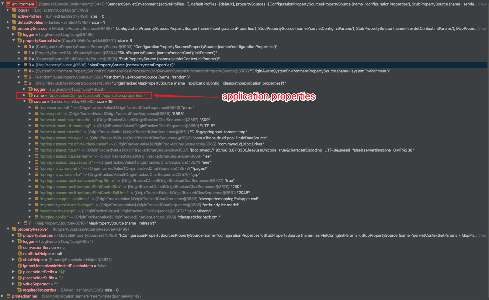

第二步，创建IOC容器：org.springframework.boot.web.servlet.context.AnnotationConfigServletWebServerApplicationContext
createApplicationContext方法,创建AnnotationConfigServletWebServerApplicationContext类
```java
protected ConfigurableApplicationContext createApplicationContext() {
	Class<?> contextClass = this.applicationContextClass;
	if (contextClass == null) {
		try {
			switch (this.webApplicationType) {
			case SERVLET:
				contextClass = Class.forName(DEFAULT_WEB_CONTEXT_CLASS);
				break;
			case REACTIVE:
				contextClass = Class.forName(DEFAULT_REACTIVE_WEB_CONTEXT_CLASS);
				break;
			default:
				contextClass = Class.forName(DEFAULT_CONTEXT_CLASS);	
			//...
	return (ConfigurableApplicationContext) BeanUtils.instantiateClass(contextClass);
}
```

DEFAULT_WEB_CONTEXT_CLASS = org.springframework.boot.web.servlet.context.AnnotationConfigServletWebServerApplicationContext;

DEFAULT_REACTIVE_WEB_CONTEXT_CLASS= org.springframework.boot.web.reactive.context.AnnotationConfigReactiveWebServerApplicationContext

DEFAULT_CONTEXT_CLASS= org.springframework.context.annotation.AnnotationConfigApplicationContext

第三步，prepareContext
保存environment到IOC中，并执行ApplicationContextInitializer#initialize方法（上面的7个实现类）

```java
private void prepareContext(ConfigurableApplicationContext context,
			ConfigurableEnvironment environment, SpringApplicationRunListeners listeners,
			ApplicationArguments applicationArguments, Banner printedBanner) {
	context.setEnvironment(environment);
	postProcessApplicationContext(context);
	//执行ApplicationContextInitializer#initialize方法
	applyInitializers(context);
	listeners.contextPrepared(context);
	if (this.logStartupInfo) {
		logStartupInfo(context.getParent() == null);
		logStartupProfileInfo(context);
	}

	// Add boot specific singleton beans
	context.getBeanFactory().registerSingleton("springApplicationArguments",
			applicationArguments);
	if (printedBanner != null) {
		context.getBeanFactory().registerSingleton("springBootBanner", printedBanner);
	}

	// Load the sources
	Set<Object> sources = getAllSources();
	Assert.notEmpty(sources, "Sources must not be empty");
	load(context, sources.toArray(new Object[0]));
	listeners.contextLoaded(context);
}
```

```java
protected void applyInitializers(ConfigurableApplicationContext context) {
	for (ApplicationContextInitializer initializer : getInitializers()) {
		Class<?> requiredType = GenericTypeResolver.resolveTypeArgument(
				initializer.getClass(), ApplicationContextInitializer.class);
		Assert.isInstanceOf(requiredType, context, "Unable to call initializer.");
		initializer.initialize(context); //执行initialize方法
	}
}
```

第四步，refreshContext刷新容器,ioc容器初始化（如果是web应用还会创建嵌入式的Tomcat）
		//扫描，创建，加载所有组件的地方,（配置类，组件，自动配置）
调用AbstractApplicationContext#refresh方法，和传统的spring初始化容器是一样的。

```java
@Override
public void refresh() throws BeansException, IllegalStateException {
	synchronized (this.startupShutdownMonitor) {
		// Prepare this context for refreshing.
		prepareRefresh();
		// Tell the subclass to refresh the internal bean factory.
		ConfigurableListableBeanFactory beanFactory = obtainFreshBeanFactory();
		// Prepare the bean factory for use in this context.
		prepareBeanFactory(beanFactory);
		try {
			// Allows post-processing of the bean factory in context subclasses.
			postProcessBeanFactory(beanFactory);
			// Invoke factory processors registered as beans in the context.
      //starter初始化过程
			invokeBeanFactoryPostProcessors(beanFactory);
			// Register bean processors that intercept bean creation.
			registerBeanPostProcessors(beanFactory);
			// Initialize message source for this context.
			initMessageSource();
			// Initialize event multicaster for this context.
			initApplicationEventMulticaster();
			// Initialize other special beans in specific context subclasses.
			onRefresh();
			// Check for listener beans and register them.
			registerListeners();
			// Instantiate all remaining (non-lazy-init) singletons.
			finishBeanFactoryInitialization(beanFactory);
			// Last step: publish corresponding event.
			finishRefresh();
		}
//...
	}
}
```

第五步，所有的SpringApplicationRunListener回调started方法、回调running方法
listeners.started(context);
listeners.running(context);


##### 自定义的starter类是什么时候加载的？

`@SpringBootApplication`注解中包含了`@EnableAutoConfiguration`，而`@EnableAutoConfiguration`注解中又包含了`@Import(AutoConfigurationImportSelector.class)`注解。

下图是从StringbootApplication#run开始的调用顺序

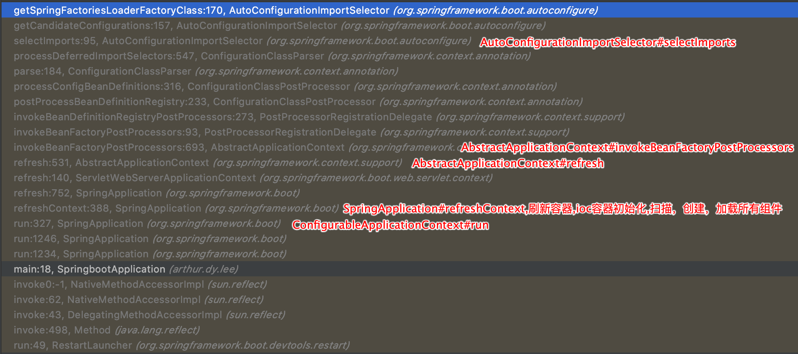

当我们启动项目时,会检查`META-INF/spring.factories`中`key`为`org.springframework.boot.autoconfigure.EnableAutoConfiguration`的值。

```java
protected List<String> getCandidateConfigurations(AnnotationMetadata metadata,
                                                  AnnotationAttributes attributes) {
  List<String> configurations = SpringFactoriesLoader.loadFactoryNames(
    getSpringFactoriesLoaderFactoryClass(), getBeanClassLoader());
  //...
  return configurations;
}
//
protected Class<?> getSpringFactoriesLoaderFactoryClass() {
  return EnableAutoConfiguration.class;
}
```

自定义的starter: hello-spring-boot-starter

META-INF/spring.factories中的值为

```xml
org.springframework.boot.autoconfigure.EnableAutoConfiguration=com.taobao.hellostarter.HelloStarterEnableAutoConfiguration
```


##### SpringBoot Starter
starter是一种服务，使用某个功能的开发者不需要关注各种依赖库的处理，不需要具体的配置信息，由Spring Boot自动通过classpath路径下的类发现并加载需要的Bean。

spring-boot-starter-web包自动帮我们引入了web模块开发需要的相关jar包，
mybatis-spring-boot-starter帮我们引入了dao开发相关的jar包。
spring-boot-starter-xxx是官方提供的starter，xxx-spring-boot-starter是第三方提供的starter。

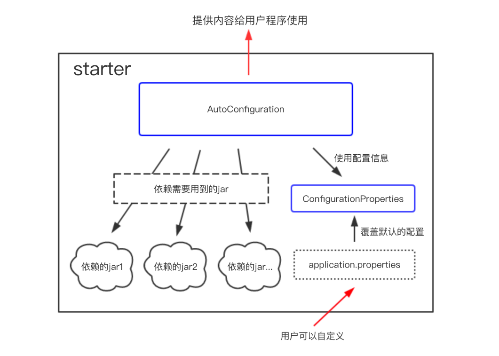
利用starter实现自动化配置只需要两个条件——maven依赖、配置文件。引入maven实质上就是导入jar包，spring-boot启动的时候会找到starter jar包中的resources/META-INF/spring.factories文件，根据spring.factories文件中的配置，找到需要自动配置的类。

配置类上面包括以下注解
@Configuration 表明是一个配置文件，被注解的类将成为一个bean配置类
@ConditionalOnClass 当classpath下发现该类的情况下进行自动配置
@ConditionalOnBean 当classpath下发现该类的情况下进行自动配置
@EnableConfigurationProperties 使@ConfigurationProperties注解生效
@AutoConfigureAfter 完成自动配置后实例化这个bean

start包解析的过程是依赖springboot初始化的过程
1. 从类路径下META-INF/spring.factories获取SpringApplicationRunListeners
2. 回调所有的获取SpringApplicationRunListener.starting()方法。
3. 准备环境，调用prepareEnvironment方法，后面将将environment保存到ioc中
4. 刷新容器,ioc容器初始化（如果是web应用还会创建嵌入式的Tomcat）,这个就是扫描，创建，加载所有组件的地方,（配置类，组件，自动配置）。
5. 所有的SpringApplicationRunListener回调started方法。


##### springboot启动时tomcat创建时机


AbstractApplicationContext#refresh -> ServletWebServerApplicationContext#onRefresh

而之前创建的web IOC容器 DEFAULT_WEB_CONTEXT_CLASS = org.springframework.boot.web.servlet.context.AnnotationConfigServletWebServerApplicationContext， 而它继承自 ServletWebServerApplicationContext
ServletWebServerApplicationContext#onRefresh 方法如下

```java
@Override
protected void onRefresh() {
	super.onRefresh();
	try {
		createWebServer();
	//...
}
//createWebServer()就是启动web服务
private void createWebServer() {
	WebServer webServer = this.webServer;
	ServletContext servletContext = getServletContext();
	if (webServer == null && servletContext == null) {
		//ServletWebServerFactory是一个接口，getWebServerFactory返回的是tomcatServletWebServerFactory
		ServletWebServerFactory factory = getWebServerFactory();
		//getSelfInitializer()值为org.springframework.boot.web.servlet.context.AnnotationConfigServletWebServerApplicationContext
		this.webServer = factory.getWebServer(getSelfInitializer());
	}
	else if (servletContext != null) {
		try {
			getSelfInitializer().onStartup(servletContext);
		}
		catch (ServletException ex) {
			throw new ApplicationContextException("Cannot initialize servlet context",
					ex);
		}
	}
	initPropertySources();
}
```
ServletWebServerFactory是一个接口，getWebServerFactory返回的是tomcatServletWebServerFactory， tomcatServletWebServerFactory的目录为：org.springframework.boot.web.embedded.tomcat
它是在spring-boot-2.0.0.RELEASE.jar下

看一下创建webServer: `factory.getWebServer(getSelfInitializer());`,即 tomcatServletWebServerFactory#getWebServer

```java
public WebServer getWebServer(ServletContextInitializer... initializers) {
	Tomcat tomcat = new Tomcat();
	File baseDir = (this.baseDirectory != null ? this.baseDirectory
			: createTempDir("tomcat"));
	tomcat.setBaseDir(baseDir.getAbsolutePath());
	Connector connector = new Connector(this.protocol);
	tomcat.getService().addConnector(connector);
	customizeConnector(connector);
	tomcat.setConnector(connector);
	tomcat.getHost().setAutoDeploy(false);
	configureEngine(tomcat.getEngine());
	for (Connector additionalConnector : this.additionalTomcatConnectors) {
		tomcat.getService().addConnector(additionalConnector);
	}
	prepareContext(tomcat.getHost(), initializers);
	return getTomcatWebServer(tomcat);
}
```
这里可以看到创建tomcat，并且初始化2个核心组件，连接器(Connector)和容器（Container）

整个调用流程：SpringApplication#run -> AbstractApplicationContext#refresh -> ServletWebServerApplicationContext#onRefresh -> tomcatServletWebServerFactory#getWebServer


参考：


##### SPI（Service Provider Interface）
spi打破了类加载器的双亲委派模型，底层就是使用的是线程上下文类加载器。

我什么时候该用Thread.currentThread().getContextClassLoader()?
A:这个问题虽然不常见，却很难正确回答。它一般出现在框架编程中，作为解决类和资源动态加载的一个好方法。总的来说，当动态加载一个资源时，至少有三种类加载器可供选择： 系统类加载器（也被称为应用类加载器）（system classloader），当前类加载器（current classloader），和当前线程的上下文类加载器（ the current thread context classloader）。

Java 提供了很多服务提供者接口（Service Provider Interface，SPI），允许第三方为这些接口提供实现。常见的 SPI 有 JDBC、JCE、JNDI、JAXP 和 JBI 等。而问题在于，SPI 的接口是 Java 核心库的一部分，是由引导类加载器来加载的；SPI 实现的 Java 类一般是由系统类加载器来加载的。引导类加载器是无法找到 SPI 的实现类的，因为它只加载 Java 的核心库。它也不能代理给系统类加载器，因为它是系统类加载器的祖先类加载器。也就是说，类加载器的代理模式无法解决这个问题。
线程上下文类加载器正好解决了这个问题。如果不做任何的设置，Java 应用的线程的上下文类加载器默认就是系统上下文类加载器。在 SPI 接口的代码中使用线程上下文类加载器，就可以成功的加载到 SPI 实现的类。线程上下文类加载器在很多 SPI 的实现中都会用到。

```
Thread context class loader存在的目的主要是为了解决parent delegation机制下无法干净的解决的问题。假如有下述委派链：
ClassLoader A -> System class loader -> Extension class loader -> Bootstrap class loader
那么委派链左边的ClassLoader就可以很自然的使用右边的ClassLoader所加载的类。
但如果情况要反过来，是右边的ClassLoader所加载的代码需要反过来去找委派链靠左边的ClassLoader去加载东西怎么办呢？没辙，parent delegation是单向的，没办法反过来从右边找左边。
这种情况下就可以把某个位于委派链左边的ClassLoader设置为线程的context class loader，这样就给机会让代码不受parent delegation的委派方向的限制而加载到类了。
```


#### 秒杀设计方案？

风控隔离预热置灰
CND负载均衡资格无效
无状态限流lua队列开关
异步分库UNSIGNED

老婆风控股票，要求在资金隔离，购买些股票预热，后将买卖股票按钮置灰。
资金通过CDN做负载均衡，判断购买股票资格无效
软件开启了无状态限流，打开lua队列开关，只能排队买股票
买完后结果都是异步的，在分库UNSIGNED中查询。

设计的时候会用到一些设计模式吗？有这样比较好的设计案例吗？

设计模式三类，以及应用，参数源码应用。
创建型模式（原工单抽建/建造单例工厂，抽象工厂原型）
结构型模式（享代装适组外桥/享元装饰外观，代理桥接适配组合）
行为型模式 （中访观模状解策命责迭备）【策略模式、模板方法模式、观察者模式、迭代子模式、责任链模式、命令模式、备忘录模式、状态模式、访问者模式、中介者模式、解释器模式。】


桥梁模式是什么以及应用

线程池都有哪些参数，队列和到达最大线程数。
keepAliveTime：多余的空闲线程的存活时间
当前线程池数量超过corePoolSize时，当空闲时间达到keepAliveTime值时，多余空闲线程会被销毁直到只剩下corePoolSize个线程为止。
handler
拒绝策略，表示当队列满了并且工作线程等于线程池的最大线程数时如何来拒绝请求执行的runnable的策略。
workQueue
缓存队列，当请求的线程数大于corePoolSize的时候，线程会进入队列进行阻塞。当这个队列达到上限之后，线程池会创建新的线程，直到到吗maximumPoolSize大小位置

##### CompletionService
CompletionService的实现目标是任务先完成可优先获取到，即结果按照完成先后顺序排序。
CompletionService实际上可以看做是Executor和BlockingQueue的结合体。CompletionService在接收到要执行的任务时，通过类似BlockingQueue的put和take获得任务执行的结果。
CompletionService的一个实现是ExecutorCompletionService，ExecutorCompletionService把具体的计算任务交给Executor完成。在实现上，ExecutorCompletionService在构造函数中会创建一个BlockingQueue（使用的基于链表的无界队列LinkedBlockingQueue），该BlockingQueue的作用是保存Executor执行的结果。

##### AutomicInteger
提供原子性的访问和更新操作，其原子性操作的实现是基于CAS
在JAVA中,CAS通过调用C++库实现，由C++库再去调用CPU指令集。不同体系结构中，cpu指令还存在着明显不同。比如，x86 CPU 提供 cmpxchg 指令；

从 AtomicInteger 的内部属性可以看出，它依赖于Unsafe 提供的一些底层能力，进行底层操作；如根据valueOffset代表的该变量值在内存中的偏移地址，从而获取数据的。
变量value用volatile修饰，保证了多线程之间的内存可见性。

```java
public class AtomicInteger extends Number implements java.io.Serializable {
// setup to use Unsafe.compareAndSwapInt for updates
private static final Unsafe unsafe = Unsafe.getUnsafe();
private static final long valueOffset;

static {
    try {
        valueOffset = unsafe.objectFieldOffset
            (AtomicInteger.class.getDeclaredField("value")); //<---- value
    } catch (Exception ex) { throw new Error(ex); }
}
//变量value用volatile修饰，保证了多线程之间的内存可见性。
private volatile int value;
```

ABA问题
Java 提供了 AtomicStampedReference 工具类，通过为引用建立类似版本号（stamp）的方式，来保证 CAS 的正确性。

##### LongAdder原理
唯一会制约AtomicLong高效的原因是高并发，高并发意味着CAS的失败几率更高，CAS失败几率又越高，变成恶性循环。LongAdder给了我们一个非常容易想到的解决方案: 减少并发，将单一value的更新压力分担到多个value中去，降低单个value的 “热度”，分段更新！！！线程数再多也会分担到多个value上去更新，只需要增加value就可以降低 value的 “热度” AtomicLong中的 恶性循环不就解决了吗？ cells 就是这个 “段” cell中的value 就是存放更新值的， 这样，当我需要总数时，把cells 中的value都累加一下不就可以了么！！

通过一个Threadlocal变量threadHashCode 获取一个HashCode对象。计算出一个在Cells 数组中当先线程的HashCode对应的更新它的value值。当然，如果Cell 索引位置，并将该位置的Cell 对象拿出来更新cas  为null 并且更新失败，才会进入retryUpdate方法。
因为cell中的value都更新失败(说明该索引到这个cell的线程也很多，并发也很高时) 或者cells数组为空时才会调用retryUpdate。

retryUpdate里面会做两件事：
1.扩容，将cells数组扩大，降低每个cell的并发量，同样，这也意味着cells数组的rehash动作。
2.给空的cells变量赋一个新的Cell数组。

casBase操作保证了在低并发时，不会立即进入分支做分段更新操作，因为低并发时，casBase操作基本都会成功，只有并发高到一定程度了，才会进入分支，所以，Doug Lead对该类的说明是： 低并发时LongAdder和AtomicLong性能差不多，高并发时LongAdder更高效！


#### 伪共享
其中L1是L2的子集，L2是L3的子集，L1到L3缓存容量依次增大，查找耗时依次增大，CPU查找顺序依次是L1、L2、L3、主存。
L1与CPU core对应，是单核独占的，不会出现其他核修改的问题。一般L2也是单核独占。而L3一般是多核共享，可能操作同一份数据，那么就有可能出问题。

Cache Line
现代CPU读取数据通常以一块连续的块为单位，即缓存行（Cache Line）。所以通常情况下访问连续存储的数据会比随机访问要快，访问数组结构通常比链结构快，因为通常数组在内存中是连续分配的。(PS. JVM标准并未规定“数组必须分配在连续空间”，一些JVM实现中大数组不是分配在连续空间的。)

缓存行的大小通常是64字节，这意味着即使只操作1字节的数据，CPU最少也会读取这个数据所在的连续64字节数据。

缓存失效
根据主流CPU为保证缓存有效性的MESI协议的简单理解，如果一个核正在使用的数据所在的缓存行被其他核修改，那么这个缓存行会失效，需要重新读取缓存。

False Sharing
如果多个核的线程在操作同一个缓存行中的不同变量数据，那么就会出现频繁的缓存失效，即使在代码层面看这两个线程操作的数据之间完全没有关系。
这种不合理的资源竞争情况学名伪共享（False Sharing），会严重影响机器的并发执行效率。

##### 伪共享如何避免
在Java8以下的版本中，可以使用填充的方式进行避免。对象引用8字节，使用了6个long变量48字节进行填充，以及一个long型的值，一共64字节。
使用了sumPaddingToPreventOptimization方法规避编译器或GC优化没使用的变量。

```java
public class PaddedAtomicLong extends AtomicLong {
    private static final long serialVersionUID = -3415778863941386253L;

    /** Padded 6 long (48 bytes) */
    public volatile long p1, p2, p3, p4, p5, p6 = 7L;

    /**
     * Constructors from {@link AtomicLong}
     */
    public PaddedAtomicLong() {
        super();
    }

    public PaddedAtomicLong(long initialValue) {
        super(initialValue);
    }

    /**
     * To prevent GC optimizations for cleaning unused padded references
     */
    public long sumPaddingToPreventOptimization() {
        return p1 + p2 + p3 + p4 + p5 + p6;
    }
}
```

Java8及以上的版本
从Java8开始原生支持避免伪共享，可以使用@Contended注解：

@Contended 注解会增加目标实例大小，要谨慎使用。默认情况下，除了 JDK 内部的类，JVM 会忽略该注解。要应用代码支持的话，要设置 -XX:-RestrictContended=false，它默认为 true（意味仅限 JDK 内部的类使用）。当然，也有个 –XX: EnableContented 的配置参数，来控制开启和关闭该注解的功能，默认是 true，如果改为 false，可以减少 Thread 和 ConcurrentHashMap 类的大小。参加《Java性能权威指南》210 页。


让主线程等待子任务执行的各种方式
1、利用java多线程工具Future.get()获取数据
2、利用CountDownLatch让主线程等待子线程任务结束
3、利用CyclicBarrier让主线程等待子线程
4、利用CompletionService

百万架构师总结

100块钱10个红包，红包大小6~12元之间。
随机，额度在0.01和(剩余平均值*2)之间。
例如：发100块钱，总共10个红包，那么平均值是10块钱一个，那么发出来的红包的额度在0.01元～20元之间波动。
当前面3个红包总共被领了40块钱时，剩下60块钱，总共7个红包，那么这7个红包的额度在：0.01～（60/7*2）=17.14之间。
注意：这里的算法是每被抢一个后，剩下的会再次执行上面的这样的算法
这样算下去，会超过最开始的全部金额，因此到了最后面如果不够这么算，那么会采取如下算法：保证剩余用户能拿到最低1分钱即可。
如果前面的人手气不好，那么后面的余额越多，红包额度也就越多，因此实际概率一样的。


哪些请求包含哪些SQL，收集起来，怎么做？url对应哪些SQL？应该的方法怎么和SQL对应起来？
思路：写个mybatis插件，打印出执行的方法和sql。
从Exception中获取调用的堆栈，从调用controller到mybatis方法名，然后拼接起来。

你自己是一个怎么样性格的人？每半年看看是否会发生一些改变，环境会改变我们的。


在现在这份工作里面对自己的评价是怎么样的？


在上一份儿的工作1年（3年中）你有什么样的成长? 技术方面哪些提升？沟通和领导力哪方面提升？能做一个简单的举例吗？比如说在领导力上你是发生了一个怎么样的变化？不一定是领导力，你觉得自己变化最大的那一部分。

向他人传达要做的事情的时候，至少说五遍，第一遍先叙述需要执行的事件；第二遍让对方复述事件，第三遍询问对方自己要求对方执行事件的目的；第四遍询问对方若执行事件过程中可能会遇到什么情况，哪些需要和自己沟通确认，哪些对方自己可以决定；第五遍询问对方，对于该事件，如果是他，有什么想法或者更好的建议。这样做比只是将事情传达给对方一遍效果要好的很多，更能接近自己最初预想的结果，而且可以极大的提升做事的效率。

关于目标制定，在西方管理学中，目标管理领域有一个非常著名的SMART法则。通过这个法则，我们可以较为容易地为自己制定出科学、合理、可实现的目标。
S （specific 明确性）：目标制定一定要明确且具体，不能摸棱两可。

你在这份工作中，有什么让你感到过受挫折或沮伤的事情？


如果让你评价一个你的TeamLeader的话，你会怎么样评价他？


工作任务之外的沟通中，如果外包觉得工作做完了，就算任务完成了。在这个过程中，你会通过什么方式和他们沟通，或通过什么样的方式去要求他们？去和他们做一个协作？

对下一份工作的期望？环境，包括技术的环境，团队的环境，等各方面的。

你在看新工作的时候，你对新工作的加班节凑，你觉得平均值是多少。


#### tomcat应用隔离

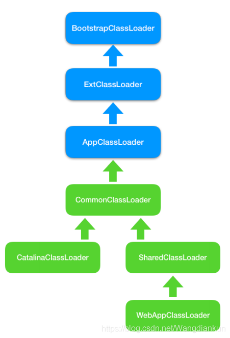

其中有关类加载器的执行步骤如下：
1/初始化commonLoader、catalinaLoader和sharedLoader;
2/将catalinaLoader设置为Tomcat主线程的线程上下文类加载器；
3/线程安全的加载class。


Catalina事实上就由 catalinaClassLoader（其实就是StandardClassLoader）加载进来了，而下一句newInstance时，所有以Catalina为根的对象的类也会全部被隐式加载进来。所谓的隐式加载，就是指在当前类中所有new的对象，如果没有被加载，则使用当前类的类加载器加载，即this.getClass(),getClassLoader()会默认加载该类中所有被new出来的对象的类（前提是他们没在别处先被加载过）。

WebappClassLoader的父类加载器是sharedLoader(即org.apache.catalina.loader.StandardClassLoader)

#### jvm表示一个是否是同一个类有两个条件

（1）这个类的完整类名是否一样（这个类名包括类所在的包名）；（2）加载这个类的Classloader是否是同一个（这里所有的同一个是指classloader的实例是否是同一个实例，如果是同一个Classloader类的两个实例，加载同一个类也会不一样）


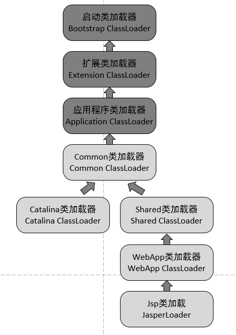

CommonClassLoader能加载的类都可以被Catalina ClassLoader和SharedClassLoader使用，从而实现了公有类库的共用，而CatalinaClassLoader和Shared ClassLoader自己能加载的类则与对方相互隔离。

WebAppClassLoader可以使用SharedClassLoader加载到的类，但各个WebAppClassLoader实例之间相互隔离。

而JasperLoader的加载范围仅仅是这个JSP文件所编译出来的那一个.Class文件，它出现的目的就是为了被丢弃：当Web容器检测到JSP文件被修改时，会替换掉目前的JasperLoader的实例，并通过再建立一个新的Jsp类加载器来实现JSP文件的HotSwap功能。

tomcat 违背了java 推荐的双亲委派模型了吗？答案是：违背了。 
每个webappClassLoader加载自己的目录下的class文件，不会传递给父类加载器。
我们扩展出一个问题：如果tomcat 的 Common ClassLoader 想加载 WebApp ClassLoader 中的类，该怎么办？
看了前面的关于破坏双亲委派模型的内容，我们心里有数了，我们可以使用线程上下文类加载器实现，使用线程上下文加载器，可以让父类加载器请求子类加载器去完成类加载的动作。牛逼吧。


#### 聚合与组合的区别

聚合，聚合关系是关联关系的一种，聚合是整体和个体之间的关系。Aggregation is used to represent ownership or a whole/part relationship。一般的表现形式是一个类持有另一个类作成员变量来体现，但绝对不可以New它。聚合关系当一个类destory的时候，持有的另一个类不会受到影响。聚合是"has a"，有一个，但它不一定只是你自己的，也可以被另的类有。

组合，组合关系是关联关系的一种，是比聚合关系强的关系。它要求普通的聚合关系中代表整体的对象负责代表部分对象的生命周期，组合关系是不能共享的。composition is used to represent an even stronger form of ownership.With composition, we get coincident lifetime of part with the whole. The composite object has sole responsibility for the disposition of its parts in terms of creation and destruction.In implementation terms, the composite is responsible for memory allocation and deallocation。If the composite is destroyed, it must either destroy all its parts or else give responsibility for them to some other object. 聚合关系当一个类destory的时候，持有的另一个类一定也会被destory。是个体的生活周期被整体所决定。组合是"contain a"，有一个，它一定只是你自己的，它跟随你的创建而创建，跟随你的消亡而消亡。
    
In fact, composition was originally called aggregation-by-value in an earlier UML draft, with “normal” aggregation being thought of as aggregation-by-reference.对这句话的理解，我认为聚合只是引用，组合而是去New对象了，赋值了。The distinction between aggregation and composition is more of a design concept and is not usually relevant during analysis. 聚合和组合是在设计时的一种关系说明.

#### JDK底层源码看过哪些

##### Integer.parseInt原理
1、前置条件判断：字符串非空；2<radix<36（radix表示进制）
2、符号位和范围判断： Integer.MIN_VALUE<result<Integer.MAX_VALUE。MIN_VALUE = 0x80000000;MAX_VALUE = 0x7fffffff，即[-2^31,2^31-1]一个int值占4个字节byte，一个字节是8位bit（即8个二进制位），所以int型占32位。
3、核心代码
```java
while (i < len) {
	digit = Character.digit(s.charAt(i++),radix);
	result *= radix;
	result -= digit;
}
return negative ? result : -result;
```

Integer.valueOf就是调用的Integer.parseInt
```java
public static Integer valueOf(String s) throws NumberFormatException {
    return Integer.valueOf(parseInt(s, 10));
}
```

StringBuilder
##### LinkedList
LinkedList内部封装的是双向链表数据结构

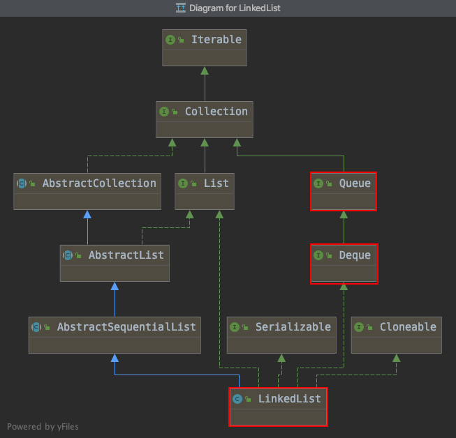

QUEUE与DEQUE的区别
Queue以及Deque都是继承于Collection，Deque是Queue的子接口。
Queue是FIFO的单端队列，Deque是双端队列。

```java
private static class Node<E> {
    E item;
    Node<E> next;
    Node<E> prev;

    Node(Node<E> prev, E element, Node<E> next) {
        this.item = element;
        this.next = next;
        this.prev = prev;
    }
}
```
##### LinkedList#get为什么慢
一半前正序遍历、一半后倒序遍历
```java
public E get(int index) {
    checkElementIndex(index);
    return node(index).item;
}
Node<E> node(int index) {
	//一半前正序遍历
	if (index < (size >> 1)) {
	    Node<E> x = first;
	    for (int i = 0; i < index; i++)
	        x = x.next;
	    return x;
	} else {//一半后倒序遍历
	    Node<E> x = last;
	    for (int i = size - 1; i > index; i--)
	        x = x.prev;
	    return x;
	}
}
```
##### 反转列表


```java
class Solution {
    public ListNode reverseList(ListNode head) {
        //申请节点，pre和 cur，pre指向null
        ListNode pre = null;
        ListNode cur = head;
        ListNode tmp = null;
        while (cur != null) {
            //记录当前节点的下一个节点
            tmp = cur.next;
            //然后将当前节点指向pre
            cur.next = pre;
            //pre和cur节点都前进一位
            pre = cur;
            cur = tmp;
        }
        return pre;
    }
}
```
##### StringBuilder
String:不可变类，属性value为不可变数组，不存在字符数组扩容一说。字符串拼接，截取，都会生成一个新的对象。频繁操作字符串效率低下，因为每次都会生成新的对象。

StringBuilder 类内部维护可变长度char[] ， 初始化数组容量为16，存在扩容， 其append拼接字符串方法内部调用System的native方法，进行数组的拷贝，不会重新生成新的StringBuilder对象。

StringBuffer 类内部维护可变长度char[]， 基本上与StringBuilder一致，但其为线程安全的字符串操作类，大部分方法都采用了Synchronized关键字修改，以此来实现在多线程下的操作字符串的安全性。

##### CopyOnWriteArrayList
CopyOnWriteArrayList是一个线程安全的ArrayList，对其进行的修改操作都是在底层的一个复制的数组（快照）上进行的，也就是使用了写时复制策略。而ReenTrantLock则用来保证只有一个线程对Array进行修改。

HashMap
##### ConcurrencyHashMap
jdk1.7中的ConcurrencyHashMap
ConcurrentHashMap 为了提高本身的并发能力，在内部采用了一个叫做 Segment 的结构，一个 Segment 其实就是一个类 Hash Table 的结构，Segment 内部维护了一个链表数组。
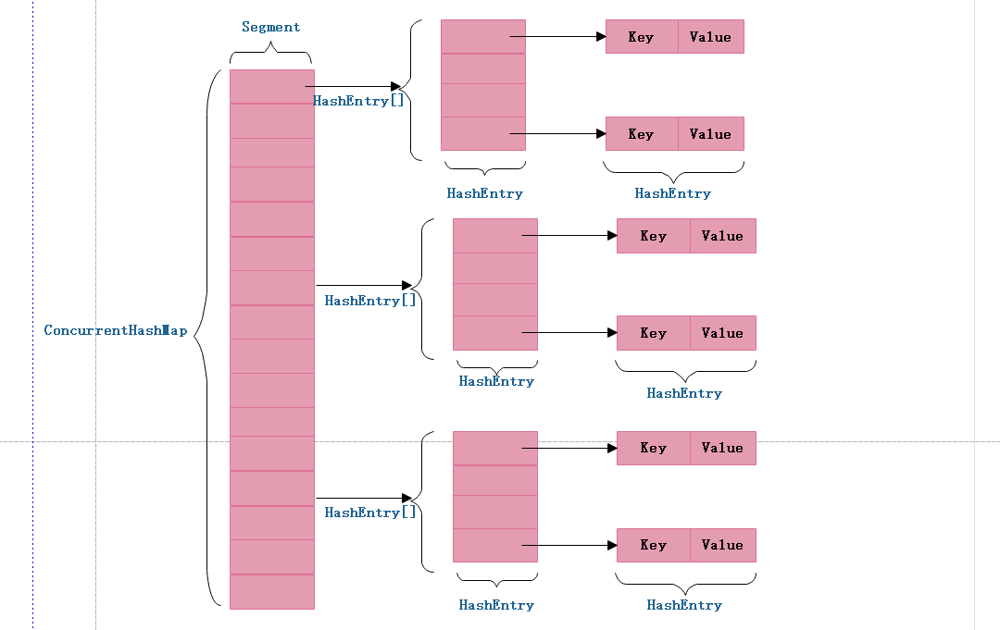

ConcurrentHashMap采用了二次hash的方式，第一次hash将key映射到对应的segment，而第二次hash则是映射到segment的不同桶(bucket)中。
为什么要用二次hash，主要原因是为了构造分离锁，使得对于map的修改不会锁住整个容器，提高并发能力。当然，没有一种东西是绝对完美的，二次hash带来的问题是整个hash的过程比hashmap单次hash要长。

jdk1.8中的ConcurrencyHashMap
在 JAVA8 中它摒弃了 Segment（锁段）的概念，而是启用了一种全新的方式实现，利用 CAS 算法和红黑树。

采用红黑树之后可以保证查询效率（O(logn)）

红黑树特征
1、根节点是黑
2、所有叶子节点是黑
3、所有的节点都是红黑相间
4、每个节点或者是黑色，或者是红色。
5、从一个节点到该节点的子孙节点的所有路径上包含相同数目的黑节点。[这里指到叶子节点的路径]


##### transient
类的有些属性需要序列化，而其他属性不需要被序列化，这些信息对应的变量就可以加上transient关键字。换句话说，这个字段的生命周期仅存于调用者的内存中而不会写到磁盘里持久化。
java 的transient关键字为我们提供了便利，你只需要实现Serilizable接口，将不需要序列化的属性前添加关键字transient，序列化对象的时候，这个属性就不会序列化到指定的目的地中。
transient关键字只能修饰变量，而不能修饰方法和类。
一个静态变量不管是否被transient修饰，均不能被序列化

我们知道在Java中，对象的序列化可以通过实现两种接口来实现，若实现的是Serializable接口，则所有的序列化将会自动进行，若实现的是Externalizable接口，则没有任何东西可以自动序列化，需要在writeExternal方法中进行手工指定所要序列化的变量，这与是否被transient修饰无关。因此第二个例子输出的是变量content初始化的内容，而不是null。

参考：
[Java transient关键字使用小记](https://www.cnblogs.com/lanxuezaipiao/p/3369962.html)

##### volatile
1、保证可见性
2、禁止指令重排序优化

volatile 修饰的变量，是直接拿的主内存的值，就是说这个值永远是最新的，对其他线程是可见的。而访问非 volatile 变量时，每个线程都会从系统内存（主内存）拷贝变量到工作内存中，然后修改工作内存中的变量值，操控的变量可能不同。

在一个变量被 volatile 修饰后，JVM 会为我们做两件事：
在每个 volatile 写操作前插入 StoreStore 屏障，在写操作后插入 StoreLoad 屏障。（StoreStore-写-StoreLoad）

在每个 volatile 读操作前插入 LoadLoad 屏障，在读操作后插入LoadStore屏障。（LoadLoad-读-LoadStore）

volatile 是不安全的
虽然 volatile 可见性保证了对 volatile 变量所有的写操作都能立刻反应到其他线程之中（即 volatile 变量在各个线程中都是一致的），但是 Java 里面的运算并非原子操作。只有是原子操作的 volatile 变量才是线程安全的，比如我们很常见的 变量++ 自增操作，在这个过程中，自增包括取数，加一，保存三个过程的操作，所以自增并不是原子性操作，使用 volatile 修饰的变量自增操作仍然是不安全的。

##### CLH锁
CLH锁即Craig, Landin, and Hagersten (CLH) locks。CLH锁是一个自旋锁。能确保无饥饿性。提供先来先服务的公平性。

CLH锁也是一种基于链表的可扩展、高性能、公平的自旋锁，申请线程仅仅在本地变量上自旋，它不断轮询前驱的状态，假设发现前驱释放了锁就结束自旋。

CLH优缺点
CLH队列锁的长处是空间复杂度低（假设有n个线程。L个锁，每一个线程每次仅仅获取一个锁，那么须要的存储空间是O（L+n），n个线程有n个myNode。L个锁有L个tail），CLH的一种变体被应用在了JAVA并发框架中。唯一的缺点是在NUMA系统结构下性能非常差。在这样的系统结构下，每一个线程有自己的内存，假设前趋结点的内存位置比較远。自旋推断前趋结点的locked域，性能将大打折扣，可是在SMP系统结构下该法还是非常有效的。
一种解决NUMA系统结构的思路是MCS队列锁。


#### ThreadLocal
实际上 ThreadLocalMap 中使用的 key 为 ThreadLocal 的弱引用，弱引用的特点是，如果这个对象只存在弱引用，那么在下一次垃圾回收的时候必然会被清理掉。

所以如果 ThreadLocal 没有被外部强引用的情况下，在垃圾回收的时候会被清理掉的，这样一来 ThreadLocalMap中使用这个 ThreadLocal 的 key 也会被清理掉。但是，value 是强引用，不会被清理，这样一来就会出现 key 为 null 的 value。

CompletionService
CompleteableFuture


#### 分布式事务的方案,两段提交、三段提交
##### 2PC
2PC的实现。通过分析可以发现，要实现2PC，所有参与者都要实现三个接口：Prepare、Commit、Rollback，这也就是XA协议

##### 3PC
2pc存在的问题是当协作者崩溃时，参与者不能做出最后的选择。
三阶段提交有两个改动点
1、引入超时机制（2PC只有协调者才拥有超时机制，3PC参与者也设置了超时时间）
2、3PC把2PC的准备（Prepare）阶段再次一分为二，这样三阶段提交就有CanCommit、PreCommit、DoCommit三个阶段。

如果所有的参与者都返回Yes的话，那么就会进入PreCommit阶段进行事务预提交
通过CanCommit、PreCommit、DoCommit三个阶段的设计，相较于2PC而言，多设置了一个缓冲阶段保证了在最后提交阶段之前各参与节点的状态是一致的。

#### 如何处理优先级最高的消息，比如有10万条消息，优先级高的在第10万条，如果优先处理第第10条消息。 
RocketMQ 没有特意支持消息优先级,有两种变通的处理思路供参考：
1.使用消息队列来表示不同的优先级：单独配置一个优先级高的队列，和一个普通优先级的队列， 将不同优先级发送到不同队列即可；
2.使用Topic来表示不同的优先级：每个优先级可以用不同的 topic 表示，发消息时，指定不同的 topic 来表示优先级。

在RabbitMQ中，可以设置消息的优先级，也就相当于在队列中置顶某条消息,设置消息的优先级一共有2个步骤：
1、设置队列的x-max-priority参数；2、设置消息的Priority参数。

#### 你在这个项目上最大的技术收获是什么


#### 在现场跑了一段程序，跑了一段时间后慢了下来，你会从哪些方面和使用哪些手段去诊断这个问题？


#### 堆的大小有没有配置过，假设JVM参数xmx配置了2G，这2G是虚拟内存还是物理内存？
物理内存

JVM最大分配的内存由-Xmx指定，默认是物理内存的1/4。
默认空余堆内存小于40%时，JVM就会增大堆直到-Xmx的最大限制；空余堆内存大于70%时，JVM会减少堆直到-Xms的最小限制。
因此服务器一般设置-Xms、-Xmx相等以避免在每次GC 后调整堆的大小。

##### 堆外缓存
1、堆外内存是什么？
在JAVA中，JVM内存指的是堆内存。机器内存中，不属于堆内存的部分即为堆外内存。
sun.misc.Unsafe类操作堆外内存
NIO类操作堆外内存

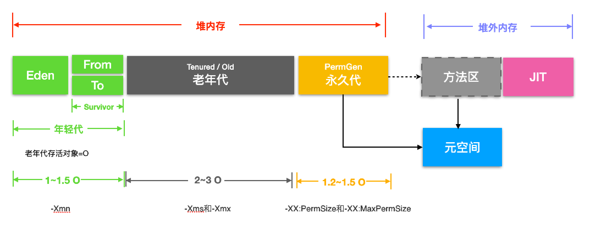

#### 你对你自己未来的发展有什么想法？


#### redis分布式锁实现原理
##### redlock分布式锁原理
1. 获取当前时间（毫秒数）。
2. 按顺序依次向N个Redis节点执行获取锁的操作。SETNX
3. 计算整个获取锁的过程总共消耗了多长时间，计算方法是用当前时间减去第1步记录的时间
4. 如果最终获取锁成功了，那么这个锁的有效时间应该重新计算
5. 如果最终获取锁失败了,那么客户端应该立即向所有Redis节点发起释放锁的操作

##### Redisson实现的分布式锁原理
RLock lock = redisson.getLock("myLock");

如果该客户端面对的是一个redis cluster集群
1. 首先会根据hash节点选择一台机器。
2. 会发送一段lua脚本到redis上
if判断语句，就是用“exists myLock”命令判断一下，如果你要加锁的那个锁key不存在的话，你就进行加锁。
如何加锁呢？很简单，用下面的命令：
hset myLock
8743c9c0-0795-4907-87fd-6c719a6b4586:1 1
"8743c9c0-0795-4907-87fd-6c719a6b4586:1"代表客户端的id
通过这个命令设置一个hash数据结构，这行命令执行后，会出现一个类似下面的数据结构：
```bash
myLock{
	"8743c9c0-0795-4907-87fd-6c719a6b4586:1":1
}
```
上述就代表“8743c9c0-0795-4907-87fd-6c719a6b4586:1”这个客户端对“myLock”这个锁key完成了加锁。

3. 锁key的默认生存时间，默认30秒。接着会执行“pexpire myLock 30000”命令，设置myLock这个锁key的生存时间是30秒。

锁互斥机制
如果客户端2来尝试加锁，执行了同样的一段lua脚本
1. 第一个if判断会执行“exists myLock”，发现myLock这个锁key已经存在了。
2. 接着第二个if判断，判断一下，myLock锁key的hash数据结构中，是否包含客户端2的ID，但是明显不是的，因为那里包含的是客户端1的ID。
3. 客户端2会获取到pttl myLock返回的一个数字，这个数字代表了myLock这个锁key的剩余生存时间。比如还剩15000毫秒的生存时间。
4. 此时客户端2会进入一个while循环，不停的尝试加锁。

##### watch dog自动延期机制
客户端1加锁的锁key默认生存时间才30秒，如果超过了30秒，客户端1还想一直持有这把锁，怎么办呢？
简单！只要客户端1一旦加锁成功，就会启动一个watch dog看门狗，他是一个后台线程，会每隔10秒检查一下，如果客户端1还持有锁key，那么就会不断的延长锁key的生存时间。

#### 产生死锁的四个必要条件【互占不循】
（1） 互斥条件：一个资源每次只能被一个进程使用。
（2） 占有且等待：一个进程因请求资源而阻塞时，对已获得的资源保持不放。
（3）不可强行占有:进程已获得的资源，在末使用完之前，不能强行剥夺。
（4） 循环等待条件:若干进程之间形成一种头尾相接的循环等待资源关系。
这四个条件是死锁的必要条件，只要系统发生死锁，这些条件必然成立，而只要上述条件之
一不满足，就不会发生死锁。

#### 分布式任务xxl-job原理再看一下
xxl-job分为调度中心和执行器。调度中心分配任务，根据任务列表cron表达式、分配策略（Hash、轮循）计算出具体由哪个执行器执行任务。执行器负责具体任务的执行。

#### 在项目上你有没有遇到比较棘手的问题？是怎么解决的？


#### 注册中心，了解一下Eureka,etcd 微服务注册与发现

了解完 Eureka 核心概念，自我保护机制，以及集群内的工作原理后，我们来整体梳理一下 Eureka 的工作流程：

1、Eureka Server 启动成功，等待服务端注册。在启动过程中如果配置了集群，集群之间定时通过 Replicate 同步注册表，每个 Eureka Server 都存在独立完整的服务注册表信息
2、Eureka Client 启动时根据配置的 Eureka Server 地址去注册中心注册服务
3、Eureka Client 会每 30s 向 Eureka Server 发送一次心跳请求，证明客户端服务正常
4、当 Eureka Server 90s 内没有收到 Eureka Client 的心跳，注册中心则认为该节点失效，会注销该实例
5、单位时间内 Eureka Server 统计到有大量的 Eureka Client 没有上送心跳，则认为可能为网络异常，进入自我保护机制，不再剔除没有上送心跳的客户端
6、当 Eureka Client 心跳请求恢复正常之后，Eureka Server 自动退出自我保护模式
7、Eureka Client 定时全量或者增量从注册中心获取服务注册表，并且将获取到的信息缓存到本地
8、服务调用时，Eureka Client 会先从本地缓存找寻调取的服务。如果获取不到，先从注册中心刷新注册表，再同步到本地缓存
9、Eureka Client 获取到目标服务器信息，发起服务调用
10、Eureka Client 程序关闭时向 Eureka Server 发送取消请求，Eureka Server 将实例从注册表中删除

Eureka Server 进入自我保护机制，会出现以下几种情况：
(1) Eureka 不再从注册列表中移除因为长时间没收到心跳而应该过期的服务
(2) Eureka 仍然能够接受新服务的注册和查询请求，但是不会被同步到其它节点上(即保证当前节点依然可用)
(3) 当网络稳定时，当前实例新的注册信息会被同步到其它节点中
Eureka 自我保护机制是为了防止误杀服务而提供的一个机制。当个别客户端出现心跳失联时，则认为是客户端的问题，剔除掉客户端；当 Eureka 捕获到大量的心跳失败时，则认为可能是网络问题，进入自我保护机制；当客户端心跳恢复时，Eureka 会自动退出自我保护机制。

#### gauva cache是用的堆内缓存、还是堆外缓存、还是磁盘缓存
gauva cache堆内内存

#### 分布式id生成器，每段含义
整个结构是64位：使用41bit作为毫秒数，10bit作为机器的ID（5个bit是数据中心，5个bit的机器ID），12bit作为毫秒内的流水号，最后还有一个符号位，永远是0。


#### 分布式的日志是怎么做的？


#### 有做过哪些系统设计、架构设计


#### 管理方面做了哪些工作


#### tomcat里面都有哪些调优属性
Tomcat的优化主要有三方面，分为系统优化，Tomcat 本身的优化，Java 虚拟机（JVM）调优。

1、工作方式选择
为了提升性能，首先就要对代码进行动静分离，让 Tomcat 只负责 jsp 文件的解析工作。如采用 Apache 和 Tomcat 的整合方式，他们之间的连接方案有三种选择，JK、http_proxy 和 ajp_proxy。相对于 JK 的连接方式，后两种在配置上比较简单的，灵活性方面也一点都不逊色。但就稳定性而言不像JK 这样久经考验，所以建议采用 JK 的连接方式。 
2、Connector 连接器的配置
之前文件介绍过的 Tomcat 连接器的三种方式： bio、nio 和 apr，三种方式性能差别很大，apr 的性能最优， bio 的性能最差。而 Tomcat 7 使用的 Connector  默认就启用的 Apr 协议，但需要系统安装 Apr 库，否则就会使用 bio 方式。
3、配置文件优化
配置文件优化其实就是对 server.xml 优化，可以提大大提高 Tomcat 的处理请求的能力，下面我们来看 Tomcat 容器内的优化。
默认配置下，Tomcat 会为每个连接器创建一个绑定的线程池（最大线程数 200），服务启动时，默认创建了 5 个空闲线程随时等待用户请求。
首先，打开 ${TOMCAT_HOME}/conf/server.xml，搜索【<Executor name="tomcatThreadPool"】，开启并调整为
```java
<Executor name="tomcatThreadPool" namePrefix="catalina-exec-"
        maxThreads="500" minSpareThreads="20" maxSpareThreads="50" maxIdleTime="60000"/>
```

更多参数设置参考：[（荐）Tomcat 调优及 JVM 参数优化](https://www.cnblogs.com/baihuitestsoftware/articles/6483690.html)

#### hystrix熔断原理

#### 包冲突时，依赖的是低版本还是高版本
##### 依赖传递原则
最短路径优先原则
假如引入了2个Jar包A和B，都传递依赖了Z这个Jar包：
```
A -> X -> Y -> Z(2.5)
B -> X -> Z(2.0)
```
那其实最终生效的是Z(2.0)这个版本。因为他的路径更加短。如果我本地引用了Z(3.0)的包，那生效的就是3.0的版本。一样的道理。

最先声明优先原则
如果路径长短一样，优先选最先声明的那个。
```
A -> Z(3.0)
B -> Z(2.5)
```
这里A最先声明，所以传递过来的Z选择用3.0版本的。

不是所有冲突都会引起运行异常,很多传递依赖的Jar包，不管是2.0版本也好，2.5版本也好，都可以运行,只有高版本Jar包不向下兼容，或者新增了某些低版本没有的API才有可能导致这样的问题

##### 解决冲突
排除法。idea的插件Meavn Helper上exclude
版本锁定法。公司的项目一般都会有父级pom，你想指定哪个版本只需要在你项目的父POM中(当然在本工程内也可以)定义指定版本号的依赖Jar包。锁定版本法可以打破2个依赖传递的原则，优先级为最高

##### 如何写一个干净依赖关系的POM文件
我本人是有些轻度代码洁癖的人，所以即便是pom文件的依赖关系也想干净而整洁。如何写好干净的POM呢，有几点技巧要注意：
1、尽量在父POM中定义<dependencyManagement>，来进行本项目一些依赖版本的管理，这样可以从很大程度上解决一定的冲突
2、如果是提供给别人依赖的Jar包，尽可能不要传递依赖不必要的Jar包
3、使用mvn dependency:analyze-only命令用于检测那些声明了但是没被使用的依赖，如有有一些是你自己声明的，那尽量去掉
4、使用mvn dependency:analyze-duplicate命令用来分析重复定义的依赖，清理那些重复定义的依赖

#### sharding基因法
普通水平切分：
　　根据帖子ID切分则无法一次查询用户的所有帖子；
　　根据用户ID切分则需要先查帖子所属用户；

什么是分库基因？
　　通过uid分库，假设分为16个库，采用uid%16的方式来进行数据库路由，这里的uid%16，其本质是uid的最后4个bit决定这行数据落在哪个库上，这4个bit，就是分库基因。

在生成tid时，先使用一种分布式ID生成算法生成前60bit
　　将分库基因加入到tid的最后4个bit
　　拼装成最终的64bit帖子tid

这般，保证了同一个用户发布的所有帖子的tid，都落在同一个库上，tid的最后4个bit都相同，于是：
　　通过uid%16能够定位到库
　　通过tid%16也能定位到库

**实际使用中，可以使用后8位一致**

#### JVM

##### 哪些对象可以作为根对象(GC Roots)吗？
虚拟机栈（栈帧中的本地变量表）中引用的对象；
方法区中类静态属于引用的对象；
方法区中常量引用的对象；
本地方法栈中JNI（即一般说的Native方法）引用的对象。

根对象包含有栈、寄存器、全局变量，此外还包含并发标记阶段未被发生变更的对象

##### java里面有哪几种引用吗？
强引用/软引用/弱引用/虚引用

只有当JVM认为内存不足时，才会去试图回收软引用指向的对象。JVM会确保在抛出OutOfMemoryError之前，清理软引用指向的对象。
当JVM进行垃圾回收时，无论内存是否充足，都会回收被弱引用关联的对象。这里所说的被弱引用关联的对象是指只有弱引用与之关联，如果存在强引用同时与之关联，则进行垃圾回收时也不会回收该对象（软引用也是如此）。

#### 可达性分析算法中被判定不可达对象，是不是一定会被回收呢？
在可达性分析算法中判定为不可达的对象，也不是“非死不可”的，要真正宣告一个对象死亡，至少要 经历两次标记过程。

第一次标记
如果对象在进行可达性分析后发现没有与GC Roots相连接的引用链，那它将会被第一次标记。

第二次标记
经过第一次标记后的对象，根据 此对象是否有必要执行finalize()方法 进行筛选，随后会由收集器对F-Queue中的对象进行第二次小规模的标记。具体如下：

经过第一次标记后的对象，根据 此对象是否有必要执行finalize()方法 进行筛选。被判定为确实有必要执行finalize()方法的对象将会被放置在一个名为F-Queue的队列之中。
假如对象没有覆盖finalize()方法，或者finalize()方法已经被虚拟机调用过，那么虚拟机将这两种情况都视为“没有必要执行”。
稍后会由一条由虚拟机自动建立的、低调度优先级的 Finalizer线程 去执行F-Queue中对象的finalize()方法。
finalize()方法是对象逃脱死亡命运的最后一次机会，稍后收集器将对F-Queue中的对象进行 第二次小规模的标记。如果对象在finalize()中成功拯救自己——只要重新与引用链上的任何一个对象建立关联即可，那在第二次标记时它将被移出 “即将回收” 的集合；如果对象这时候还没有逃脱，那基本上它就真的要被回收了。
这种自救的机会只有一次，因为对象的finalize()方法最多只会被系统调用一次。


#### 谈谈你熟悉的垃圾回收器和他们的工作过程？


#### 讲一下并发的可达性分析
并发标记要解决什么问题？

刚刚我们谈到的可达性分析算法是需要一个理论上的前提的：该算法的全过程都需要基于一个能保障一致性的快照中才能够分析，这意味着必须全程冻结用户线程的运行。
为了不冻结用户线程的运行，那我们就需要让垃圾回收线程和用户线程同时运行。

为什么遍历对象图的时候必须在一个能保障一致性的快照中？
为了说明这个问题，我们就要引入"三色标记"大法了。
在遍历对象图的过程中，把访问都的对象按照"是否访问过"这个条件标记成以下三种颜色：
白色：表示对象尚未被垃圾回收器访问过。显然，在可达性分析刚刚开始的阶段，所有的对象都是白色的，若在分析结束的阶段，仍然是白色的对象，即代表不可达。
黑色：表示对象已经被垃圾回收器访问过，且这个对象的所有引用都已经扫描过。黑色的对象代表已经扫描过，它是安全存活的，如果有其它的对象引用指向了黑色对象，无须重新扫描一遍。黑色对象不可能直接（不经过灰色对象）指向某个白色对象。
灰色：表示对象已经被垃圾回收器访问过，但这个对象至少存在一个引用还没有被扫描过。


但是垃圾回收器和用户线程同时运行呢？
垃圾回收器在对象图上面标记颜色，而同时用户线程在修改引用关系，引用关系修改了，那么对象图就变化了，这样就有可能出现两种后果：
一种是把原本消亡的对象错误的标记为存活，这不是好事，但是其实是可以容忍的，只不过产生了一点逃过本次回收的浮动垃圾而已，下次清理就可以。
一种是把原本存活的对象错误的标记为已消亡，这就是非常严重的后果了，一个程序还需要使用的对象被回收了，那程序肯定会因此发生错误。垃圾回收器是怎么解决这个问题的？

Wilson在1994年在理论上证明了，当且仅当以下两个条件同时满足时，会产生"对象消失"的问题，原来应该是黑色的对象被误标为了白色：
条件一：赋值器插入了一条或者多条从黑色对象到白色对象的新引用。
条件二：赋值器删除了全部从灰色对象到该白色对象的直接或间接引用。

由于两个条件之间是当且仅当的关系。所以，我们要解决并发标记时对象消失的问题，只需要破坏两个条件中的任意一个就行。
于是产生了两种解决方案：增量更新（Incremental Update）和原始快照（Snapshot At The Beginning，SATB）。
在HotSpot虚拟机中，CMS是基于增量更新来做并发标记的，G1则采用的是原始快照的方式。

增量更新要破坏的是第一个条件（赋值器插入了一条或者多条从黑色对象到白色对象的新引用），当黑色对象插入新的指向白色对象的引用关系时，就将这个新插入的引用记录下来，等并发扫描结束之后，再将这些记录过的引用关系中的黑色对象为根，重新扫描一次。
原始快照要破坏的是第二个条件（赋值器删除了全部从灰色对象到该白色对象的直接或间接引用），当灰色对象要删除指向白色对象的引用关系时，就将这个要删除的引用记录下来，在并发扫描结束之后，再将这些记录过的引用关系中的灰色对象为根，重新扫描一次。

虚拟机的记录操作都是通过写屏障实现的。
增量更新用的是写后屏障(Post-Write Barrier)，记录了所有新增的引用关系。
原始快照用的是写前屏障(Pre-Write Barrier)，将所有即将被删除的引用关系的旧引用记录下来。

参考：[面试官:你说你熟悉jvm?那你讲一下并发的可达性分析](https://blog.csdn.net/lilizhou2008/article/details/104489355/)


#### RocketMQ
同步发送: 如果发送失败，会在默认的超时时间3秒内进行重试，最多重试2次;投递completes不代表投递成功，要check SendResult.sendStatus来判断是否投递成功
异步发送: 异步消息不retry，投递失败回调onException()方法【可以在onException方法中根据业务情况进行理否重试】，只有同步消息才会retry
延迟发送: 会将消息放到ScheduleMessageService.SCHEDULE_TOPIC【Topic替换】这个Topic里面进行持久化，根据DelayTimeLevel选择对应的queue，后定时任务去刷待投递的消息。支持18种级别：1s~2h.
批量发送: 提升性能，建议一次消息的大小不超过1M，超大的话，官网有方法Split	


#### ShardingSphere

#### Saga
Apache ServiceComb Saga，华为开源，已交由apache。Apache ServiceComb Saga支持tcc和saga两种模式
Apache ServiceComb Saga 基于spring注解和aop切面，对用户透明，业务侵入小，开发简单，部署容易；
在高可用方面。协调者alpha支持集群模式和本地持久化，不会出现单点故障；

Saga演进后的架构，如下图所示，主要包含两个组件，即alpha和omega，其中：
alpha充当协调者的角色，主要负责对事务的事件进行持久化存储以及协调子事务的状态，使其最终得以与全局事务的状态保持一致，即保证事务中的子事务要么全执行，要么全不执行。
omega是微服务中内嵌的一个agent，负责对网络请求进行拦截并向alpha上报事务事件，并在异常情况下根据alpha下发的指令执行相应的补偿或重试操作。

#### JVM对象内存布局


一个对象在内存中分为三部分：对象头、实例数据、对齐填充。
对象头中主要存放了
Mark Word: GC 分代年龄、偏向锁、偏向 id、锁类型、hash 值等
Class Poiner: 用来指向对象对应的Class对象（其对应的元数据对象）的内存地址


#### 锁类型

##### 自旋锁
自旋锁尽可能的减少线程的阻塞，如果持有锁的线程能在很短时间内释放锁资源，那么那些等待竞争锁的线程就不需要做内核态和用户态之间的切换进入阻塞挂起状态，它们只需要等一等（自旋），自旋锁的目的是为了占着CPU的资源不释放，等到获取到锁立即进行处理。

但是线程自旋是需要消耗cup的，说白了就是让cup在做无用功，如果一直获取不到锁，那线程也不能一直占用cup自旋做无用功，所以需要设定一个自旋等待的最大时间。

##### 偏向锁
如果一个线程获得了锁，那么锁就进入偏向模式，此时Mark Word 的结构也变为偏向锁结构，当这个线程再次请求锁时，无需再做获取锁的过程。如果有其他线程竞争锁的时候就需要膨胀为轻量级锁。

当锁对象第一次被线程获取的时候，虚拟机把对象头中的标志位设为“01”，即偏向模式。同时使用CAS操作把获取到这个锁的线程的ID记录在对象的Mark Word之中的偏向线程ID，并将是否偏向锁的状态位置置为1。如果CAS操作成功，持有偏向锁的线程以后每次进入这个锁相关的同步块时，直接检查ThreadId是否和自身线程Id一致，
如果一致，则认为当前线程已经获取了锁，虚拟机就可以不再进行任何同步操作

##### 轻量级锁
一般指的是在有两个线程在交替使用锁的时候由于没有同时抢锁属于一种比较和谐的状态，就可以使用轻量级锁。
在轻量级锁释放的过程就采用 CAS 把栈上的赋值的 Mark Word 替换到锁对象上

当线程要获取锁时把锁对象的 Mark Word 复制一份到当前线程的栈顶，然后执行一个 CAS 操作把锁对象的 Mark Word 更新为指向栈顶的副本的指针，如果成功则当前线程拥有了锁。可以进行同步代码块的执行，而失败则有两种可能，要么是当前线程已经拥有了锁对象的指针，这时可以继续执行。要么是被其他线程抢占了锁对象，这时候说明了在同一时间有两个线程同时需要竞争锁，那么就打破了这种和谐的局面需要膨胀到重量级锁，锁对象的标志修改，获取线程的锁等待。

#### synchronized原理
##### 类锁
当作用于静态方法时，锁住的是Class实例，又因为Class的相关数据存储在永久带PermGen（jdk1.8则是metaspace），永久带是全局共享的，因此静态方法锁相当于类的一个全局锁，会锁所有调用该方法的线程；

##### 对象锁
synchronized的对象锁，其指针指向的是一个monitor对象（由C++实现）的起始地址。每个对象实例都会有一个 monitor。其中monitor可以与对象一起创建、销毁；亦或者当线程试图获取对象锁时自动生成。
```
ObjectMonitor() {
  _count        = 0; //记录个数
  _owner        = NULL; // 运行的线程
  //两个队列
  _WaitSet      = NULL; //调用 wait 方法会被加入到_WaitSet
  _EntryList    = NULL ; //锁竞争失败，会被加入到该列表
}
```
_owner指向持有ObjectMonitor对象的线程。当多个线程同时访问一段同步代码时，会先存放到 _EntryList 集合中，接下来当线程获取到对象的monitor时，就会把_owner变量设置为当前线程。同时count变量+1。如果线程调用wait() 方法，就会释放当前持有的monitor，那么_owner变量就会被置为null，同时_count减1，并且该线程进入 WaitSet集合中，等待下一次被唤醒

根据虚拟机规范要求，在执行monitorenter指令时，首先要尝试获取对象锁，也就是上文我们提到了monitor对象。如果这个对象没有被锁定，或者当前线程已经拥有了这个对象的锁，那么就把锁的计数器（_count）加1。当然与之对应执行monitorexit指令时，锁的计数器（_count）也会减1

字节码中，有俩个monitorexit指令，这是为什么呢？
编译器需要确保方法中调用过的每条monitorenter指令都要执行对应的monitorexit 指令。为了保证在方法异常时，monitorenter和monitorexit指令也能正常配对执行，编译器会自动产生一个异常处理器，它的目的就是用来执行 异常的monitorexit指令。而字节码中多出的monitorexit指令，就是异常结束时，被执行用来释放monitor的。

##### 修饰在方法
字节码中并没有monitorenter指令和monitorexit指令，取得代之的是ACC_SYNCHRONIZED标识，JVM通过ACC_SYNCHRONIZED标识


boolean和byte: 1字节；short和char: 2字节
int和float: 4字节；long和double: 8字节
Reference: 8字节（64位系统）

为了保证对象的大小为8字节的整数位

#### 读写分离一致性

这个方案就保证了用户A的读请求肯定是数据一致的，而且没有性能问题，因为标记是本地客户端传过去的。
但是无法保证其他用户读数据是一致的，但是实际场景很少需要保持其他用户也保持强一致。延迟个几秒也没问题。

1、在通常的读写分离基础上考虑同步延迟窗口，如果是在写操作的同步延迟窗口之内读，则读取主库，其他情况下读从库。如果一个事务中有写操作，不管是否有读操作，肯定是操作主库。入库标记放入缓存，但对吞量有影响。
使用spring AbstractRoutingDataSource（用于读写分离），Java 注解（Annotation）和aop和thread local。
   Spring提供了AbstractRoutingDataSource抽象类用于多数据源的访问，可以继承该类覆盖
determineCurrentLookupKey()方法来实现读写分离。

2、客户端cookie存标记位
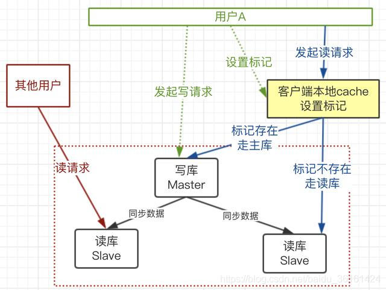

上图流程：
1）用户A发起写请求，更新了主库，并在客户端设置标记，过期时间（预估的主库和从库同步延迟的时间），可以使用cookie实现
2）用户A再发起读请求时，带上这个cookie
3）服务器处理请求时，获取请求传过来的数据，看有没有这个标记
4）有这个业务标记，走主库；没有走从库。

3、双写，保证读库写完后再返回。

#### JVM多大合适


#### JVM-FullGC触发时机

Minor GC触发条件：
当Eden区满时，触发Minor GC。
Full GC触发条件：
1、System.gc()方法的调用
2、老年代代空间不足
3、永生区空间不足
4、CMS GC时出现promotion failed和concurrent mode failure
5、统计得到的Minor GC晋升到老年代的平均大小大于老年代的剩余空间
6、堆中分配很大的对象
7、JVM使用jmap命令

并发模式失败（concurrent mode failure）：产生的原因是老年代的可用空间不够了
原因有两种：
    1.年轻代提升太快，老年代的处理速度跟不上新生代的提升速度；或者新生代空间太小，放不下新产生的对象而直接转入老年代，但老年代也空间不够
        解决办法：
        ①.调大新生代空间 -Xmn
        ②.加大新生代晋升的阈值 -XX:MaxTenuringThreshold
    2.老年代碎片过多
        解决办法：
        ①.调大老年代的比例  –XX:NewRatio 
        ②.降低老年代进行垃圾回收的阈值，
        -XX:CMSInitiatingOccupancyFraction=60（默认是 68）
        -XX:+UseCMSInitiatingOccupancyOnly
当老年代碎片过多时，这个过程注意cms的性能会比较差，退化成只有一个线程来收集垃圾，耗时可能有几秒或十几秒。

提升失败（promotion failed）：新生代太小，放不下要复制的存活对象，转而要往老年代放，但这样老年代就有大量短命对象，而很快内存不够就报错（因为MinorGC时的survivor放不下eden和另一个survivor中没回收的对象，转而进入老年代）
一个Survivor 区不能容纳eden和另外一个survivor里面的存活对象，多余的对象进入老年代，这样就会导致老年代里面的存放大量的短暂存活的对象，
而我们知道，如果老年代里面没有可用空间就会发生full gc，这样就造成扫描整个堆，造成提升失败（promotion failed）。

    解决办法：增加survivor
        ①.增加年轻代的大小 -Xmn
        ②.调整survivor和eden的比例  -XX:SurvivorRatio 默认是8 ， 各占比 s0：s1 ：eden =1：1：8 ， 减小这个值也就加大了survivor。

#### 不同垃圾回收器比较


#### Parallel Scavenge和CMS区别
Parallel Scavenge收集器的特点是它的关注点与其他收集器不同，CMS等收集器的关注点是尽可能地缩短垃圾收集时用户线程的停顿时间，而Parallel Scavenge收集器的目标则是达到一个可控制的吞吐量（Throughput）。
Parallel Scavenge收集器百也经常称为“吞吐量优先”收集器
Parallel Scavenge收集器提供了两度个参数用于精确控制吞吐量; -XX:MaxGCPauseMillis：控制最大垃圾收专集停顿时间; -XX:GCTimeRatio：设置吞吐量大小
自适应调节策略也是Parallel Scavenge收集器与属ParNew收集器的一个重要区别


#### JVM常用工具
Jmap 
得到运行java程序的内存分配的详细情况。例如实例个数，大小等 
使用jmap -histo[:live] pid查看堆内存中的对象数目、大小统计直方图，如果带上live则只统计活对象


Jstack 
jstack能得到运行java程序的java stack和native stack的信息。可以轻松得知当前线程的运行情况。

Jstat（JVM统计监测工具）
这是一个比较实用的一个命令，可以观察到classloader，compiler，gc相关信息。可以时时监控资源和性能 

```
root@ubuntu:/# jstat -gc 21711 250 4
 S0C    S1C    S0U    S1U      EC       EU        OC         OU       PC     PU    YGC     YGCT    FGC    FGCT     GCT   
192.0  192.0   64.0   0.0    6144.0   1854.9   32000.0     4111.6   55296.0 25472.7    702    0.431   3      0.218    0.649
192.0  192.0   64.0   0.0    6144.0   1972.2   32000.0     4111.6   55296.0 25472.7    702    0.431   3      0.218    0.649
192.0  192.0   64.0   0.0    6144.0   1972.2   32000.0     4111.6   55296.0 25472.7    702    0.431   3      0.218    0.649
192.0  192.0   64.0   0.0    6144.0   2109.7   32000.0     4111.6   55296.0 25472.7    702    0.431   3      0.218    0.649
```
S0C、S1C、S0U、S1U：Survivor 0/1区容量（Capacity）和使用量（Used）
EC、EU：Eden区容量和使用量
OC、OU：年老代容量和使用量
PC、PU：永久代容量和使用量
YGC、YGT：年轻代GC次数和GC耗时
FGC、FGCT：Full GC次数和Full GC耗时
GCT：GC总耗时


#### JVM 优化
稳定的 Java 堆
获得一个稳定的堆大小的方法是使-Xms 和-Xmx 的大小一致，即最大堆和最小堆 

将新对象预留在年轻代
Survivor 区的空间不够，或者占用量达到 50%时，就会使对象进入年老代。故该设置提高了 Survivor 区的使用率：–XX:TargetSurvivorRatio=90，提高 from 区的利用率，使 from 区使用到 90%时，再将对象送入年老代。

让大对象进入年老代
应该尽可能避免使用短命的大对象。可以使用参数-XX:PetenureSizeThreshold 设置大对象直接进入年老代的阈值。当对象的大小超过这个值时，将直接在年老代分配。参数-XX:PetenureSizeThreshold 只对串行收集器和年轻代并行收集器有效，并行回收收集器不识别这个参数。
如果需要将 1MB 以上的对象直接在年老代分配，设置-XX:PetenureSizeThreshold=1000000

设置对象进入年老代的年龄
这个阈值的最大值可以通过参数-XX:MaxTenuringThreshold 来设置，默认值是 15。

增大吞吐量
-Xss128k：减少线程栈的大小，这样可以使剩余的系统内存支持更多的线程；
–XX:+UseParallelGC：年轻代使用并行垃圾回收收集器。这是一个关注吞吐量的收集器，可以尽可能地减少 GC 时间。
–XX:ParallelGC-Threads：设置用于垃圾回收的线程数，通常情况下，可以设置和 CPU 数量相等。但在 CPU 数量比较多的情况下，设置相对较小的数值也是合理的；
–XX:+UseParallelOldGC：设置年老代使用并行回收收集器。

年轻代大小选择：响应时间优先的应用，尽可能设大，直到接近系统的最低响应时间限制（根据实际情况选择）。在此种情况下，年轻代收集发生gc的频率是最小的。同时，也能够减少到达年老代的对象。吞吐量优先的应用，也尽可能的设置大，因为对响应时间没有要求，垃圾收集可以并行进行
年老代大小选择：响应时间优先的应用，年老代一般都是使用并发收集器，所以其大小需要小心设置，一般要考虑并发会话率和会话持续时间等一些参数。如果堆设置小了，会造成内存碎片、高回收频率以及应用暂停而使用传统的标记清除方式；如果堆大了，则需要较长的收集时间。

较小堆引起的碎片问题：使用并发收集器时，开启对年老代的压缩。同时使用-XX:CMSFullGCsBeforeCompaction=xx设置多少次Full GC后，对年老代进行压缩。

#### 参数
Java7及以前版本的示例，在Java8中永久代的参数-XX:PermSize和-XX：MaxPermSize已经失效。
```
-Xmx4g –Xms4g –Xmn1200m –Xss512k -XX:NewRatio=4 -XX:SurvivorRatio=8 -XX:PermSize=100m -XX:MaxPermSize=256m -XX:MaxTenuringThreshold=15
```

-Xmx4g：堆内存最大值为4GB。
-Xms4g：初始化堆内存大小为4GB。
-Xmn1200m：设置年轻代大小为1200MB。增大年轻代后，将会减小年老代大小。此值对系统性能影响较大，Sun官方推荐配置为整个堆的3/8。
-Xss512k：设置每个线程的堆栈大小。JDK5.0以后每个线程堆栈大小为1MB，以前每个线程堆栈大小为256K。应根据应用线程所需内存大小进行调整。在相同物理内存下，减小这个值能生成更多的线程。但是操作系统对一个进程内的线程数还是有限制的，不能无限生成，经验值在3000~5000左右。
-XX:NewRatio=4：设置年轻代（包括Eden和两个Survivor区）与年老代的比值（除去持久代）。设置为4，则年轻代与年老代所占比值为1：4，年轻代占整个堆栈的1/5
-XX:SurvivorRatio=8：设置年轻代中Eden区与Survivor区的大小比值。设置为8，则两个Survivor区与一个Eden区的比值为2:8，一个Survivor区占整个年轻代的1/10
-XX:PermSize=100m：初始化永久代大小为100MB。
-XX:MaxPermSize=256m：设置持久代大小为256MB。
-XX:MaxTenuringThreshold=15：设置垃圾最大年龄。如果设置为0的话，则年轻代对象不经过Survivor区，直接进入年老代。对于年老代比较多的应用，可以提高效率。如果将此值设置为一个较大值，则年轻代对象会在Survivor区进行多次复制，这样可以增加对象再年轻代的存活时间，增加在年轻代即被回收的概论。

#### JVM性能指标
延迟：GC低停顿和GC低频率；
低内存占用；
高吞吐量;
其中，任何一个属性性能的提高，几乎都是以牺牲其他属性性能的损为代价的，不可兼得。

一般如果达到以下的指标，就不需要进行GC了。
Minor GC执行时间不到50ms，Minor GC执行不频繁，约10秒一次；
Full GC执行时间不到1s，Full GC执行频率不算频繁，不低于10分钟1次；

#### DDD领域驱动

#### HBASE本身作为一个分布DDD式数据库
HBase 本身其实可以完全不要考虑 HDFS 的，你完全可以只把 HBase 当作是一个分布式高并发 k-v 存储系统，只不过它底层的文件系统是通过 HDFS 来支持的罢了。换做其他的分布式文件系统也是一样的，不影响 HBase 的本质。甚至如果你不考虑文件系统的分布式或稳定性等特性的话，完全可以用简单的本地文件系统，甚至内存文件系统来代替。

HBase 在 HDFS 之上提供了：

①、高并发实时随机写，通过 LSM（内存+顺序写磁盘）的方式提供了 HDFS 所不拥有的实时随机写及修改功能

②、高并发实时点读及扫描了解一下 LSM 算法，在文件系统之上有数据库，在业务层面，HBase 完全可以独立于 HDFS 来理解

#### HSF
##### 地址注册中心


### SSD 为什么顺序写比随机写性能更好？
SSD以Page为单位做读写，以Block为单位做垃圾回收，Page一般有16KB大小，Block一般有几十MB大小，SSD写数据的逻辑是：
①将该块数据所在的Page读出
②修改该Page中该块数据的内容
③找出一个新的空闲Block将②中的Page写入，并将①中提到的Page所在的Block中的Page标志为脏
理解了写原理，也就明白了为什么顺序写比随机写好了。四个字：垃圾回收！写相同数据量的情况下，顺序写制造更少的垃圾Block，所以比随机写有更高的性能。


#### 为什么RabbitMQ会随着队列堆积吞吐量降低
RabbitMQ中的队列消息可以是以下四种状态：

alpha：消息内容和消息索引都存储在内存中
beta：消息内容保存在磁盘中，消息索引保存在内存中
gamma：消息内容保存在磁盘中，消息索引在磁盘和内存中都有
delta：消息内容和索引都在磁盘中

delta状态读取消息需要两次IO操作，第一次是读取消息索引rabbit_queue_index，第二次是读取消息内容rabbit_msg_store；beta和gamma状态都只需要一次IO操作去读取消息内容即可。
RabbitMQ运行时会根据统计的消息传送速度定期计算一个当前内存中能够保存的最大消息数量target_ram_count，如果alpha状态的消息数大于这个数量，就会引起消息状态的转换，多余的消息可能会转到其它3个状态中的一个，具体转移到哪个状态是要看当前内存容量。
在内存负载很高的情况下，能够通过将一部分消息由磁盘保存来节省内存空间，而在内存负载降低时，又可以将这部分消息渐渐流回内存中，使得整个队列具有很好的弹性。

总结：为什么堆积导致性能下降
在系统负载较高时，已接收到的消息若不能很快地被消费掉，这些消息就会进入到很深的队列中去，这样会增加处理每个消息的平均开销。因为要花更多的时间和资源处理堆积的消息，所以此时处理新入的消息能力就会降低，使得后流入的消息又被积压的更深，继续增大后续的开销，导致情况变得越来越恶化，使得系统处理能力大大降低。


### rocketMQ
https://blog.csdn.net/wb_snail/category_8848808.html

#### 消息拉取长轮询
 rocketMq对pull和push方式的消息获取都有支持，push不是本文的重点，我们就重点看看pull模式在rocketMq中是怎样实现的。首先要表明的是，在pull消息时，rocketMq也是使用了长轮询方式

长轮询是对普通轮询的优化，依然由客户端发起请求，服务端收到后并不立即响应，而是hold住客户端连接，等待数据产生变更后(或者超过指定时间还未产生变更)才回复客户端，说白了，就是对普通轮询加了个控制，你客户端可以随时请求我，但是回不回复我说了算，这就保证了服务端不会被客户端带节奏，导致自己的压力不可控

消费者主动发起pull请求，broker在处理消息拉取请求时，如果没有查询到消息，将不返回消费者任何信息(相当于挂起消费者，使其不会立即发起下一次拉取请求)，会将请求信息pullRequest添加到pullRequestTable中，等待触发通知消费者的事件(pullRequestTable表示待处理的消息拉取请求，其中包含了消费者信息(可以据此获取与该消费者的长连接channel)，以及其想要拉取的消息位置，后面需要根据这些信息来将对应的新消息返回给对应的消费者)

broker中，有两个地方会触发该事件：
    1).DefaultMessageStore.ReputMessageService.run(定时任务，1毫秒一次)
不断的检测是否有新消息产生，如果检测到了，就发出消息到达通知，将新消息发送给对应的消费者
    2).PullRequestHoldService.run(定时任务，5s一次)，该任务会逐个检查pullRequestTable中的pullRequest，判断是否有对应的新消息产生。如果有则返回给消费者；没有则检查该pullRequest从加入到现在是否已经超过长轮询等待时间(默认15秒)，如果是，也会返回消费者
消费者收到broker返回后，无论是否有收到新消息，都会在处理完成后发起下一次的pull请求


#### CMS垃圾回收
初并重并

初始标记【单线程】
并发标记（标记和执行线程交叉运行）
重新标记
并发清理


#### 如何合理设置线程池大小
要想合理的配置线程池的大小，首先得分析任务的特性，可以从以下几个角度分析：

任务的性质：CPU密集型任务、IO密集型任务、混合型任务。
任务的优先级：高、中、低。
任务的执行时间：长、中、短。
任务的依赖性：是否依赖其他系统资源，如数据库连接等。
性质不同的任务可以交给不同规模的线程池执行。

对于不同性质的任务来说，CPU密集型任务应配置尽可能小的线程，如配置CPU个数+1的线程数，IO密集型任务应配置尽可能多的线程，因为IO操作不占用CPU，不要让CPU闲下来，应加大线程数量，如配置两倍CPU个数+1，而对于混合型的任务，如果可以拆分，拆分成IO密集型和CPU密集型分别处理，前提是两者运行的时间是差不多的，如果处理时间相差很大，则没必要拆分了。

若任务对其他系统资源有依赖，如某个任务依赖数据库的连接返回的结果，这时候等待的时间越长，则CPU空闲的时间越长，那么线程数量应设置得越大，才能更好的利用CPU。
当然具体合理线程池值大小，需要结合系统实际情况，在大量的尝试下比较才能得出，以上只是前人总结的规律。

在这篇如何合理地估算线程池大小？文章中发现了一个估算合理值的公式

最佳线程数目 = （（线程等待时间+线程CPU时间）/线程CPU时间 ）* CPU数目

比如平均每个线程CPU运行时间为0.5s，而线程等待时间（非CPU运行时间，比如IO）为1.5s，CPU核心数为8，那么根据上面这个公式估算得到：((0.5+1.5)/0.5)*8=32。这个公式进一步转化为：

最佳线程数目 = （线程等待时间与线程CPU时间之比 + 1）* CPU数目
可以得出一个结论：
线程等待时间所占比例越高，需要越多线程。线程CPU时间所占比例越高，需要越少线程。
以上公式与之前的CPU和IO密集型任务设置线程数基本吻合。

#### Redis 键的过期删除策略及缓存淘汰策略
##### 过期删除策略
定期删除
Redis过期Key清理的机制对清理的频率和最大时间都有限制，在尽量不影响正常服务的情况下，进行过期Key的清理，以达到长时间服务的性能最优。redis会把设置了过期时间的key放在单独的字典中，每隔一段时间执行一次删除(在redis.conf配置文件设置hz，1s刷新的频率)过期key的操作。

具体的算法如下:

1. Redis配置项hz定义了serverCron任务的执行周期，默认为10，即CPU空闲时每秒执行10次;
2. 每次过期key清理的时间不超过CPU时间的25%，即若hz=1，则一次清理时间最大为250ms，若hz=10，则一次清理时间最大为25ms;
3. 清理时依次遍历所有的db;
4. 从db中随机取20个key，判断是否过期，若过期，则逐出;
5. 若有5个以上key过期，则重复步骤4，否则遍历下一个db;
6. 在清理过程中，若达到了25%CPU时间，退出清理过程;

这是一个基于概率的简单算法，基本的假设是抽出的样本能够代表整个key空间，redis持续清理过期的数据直至将要过期的key的百分比降到了25%以下。这也意味着在长期来看任何给定的时刻已经过期但仍占据着内存空间的key的量最多为每秒的写操作量除以4。

由于算法采用的随机取key判断是否过期的方式，故几乎不可能清理完所有的过期Key;
调高hz参数可以提升清理的频率，过期key可以更及时的被删除，但hz太高会增加CPU时间的消耗，为了保证不会循环过度，导致卡顿，扫描时间上限默认不超过25ms。
根据以上原理，系统中应避免大量的key同时过期，给要过期的key设置一个随机范围。

优点：通过限制删除操作的时长和频率，来减少删除操作对CPU时间的占用，处理"定时删除"的缺点，定期删除过期key，处理"惰性删除"的缺点
缺点：在内存友好方面，不如"定时删除" 在CPU时间友好方面，不如"惰性删除"
难点：合理设置删除操作的执行时长（每次删除执行多长时间）和执行频率（每隔多长时间做一次删除），这个要根据服务器运行情况来定了

惰性删除
过期的key并不一定会马上删除，还会占用着内存。 当你真正查询这个key时，redis会检查一下，这个设置了过期时间的key是否过期了? 如果过期了就会删除，返回空。这就是惰性删除。

优点：删除操作只发生在从数据库取出key的时候发生，而且只删除当前key，所以对CPU时间的占用是比较少的，而且此时的删除是已经到了非做不可的地步（如果此时还不删除的话，我们就会获取到了已经过期的key了）
缺点：若大量的key在超出超时时间后，很久一段时间内，都没有被获取过，那么可能发生内存泄露（无用的垃圾占用了大量的内存）

定时删除
在设置key的过期时间的同时，为该key创建一个定时器，让定时器在key的过期时间来临时，对key进行删除。

优点：保证内存被尽快释放
缺点：若过期key很多，删除这些key会占用很多的CPU时间，在CPU时间紧张的情况下，CPU不能把所有的时间用来做要紧的事儿，还需要去花时间删除这些key，定时器的创建耗时，若为每一个设置过期时间的key创建一个定时器（将会有大量的定时器产生），性能影响严重
结论：此方法基本上没人用

##### Redis采用的过期策略
惰性删除+定期删除
持久化对过期key的处理
RDB对过期key的处理
过期key对RDB没有任何影响

1）从内存数据库持久化数据到RDB文件，持久化key之前，会检查是否过期，过期的key不进入RDB文件
2）从RDB文件恢复数据到内存数据库，数据载入数据库之前，会对key先进行过期检查，如果过期，不导入数据库（主库情况）

AOF对过期key的处理
过期key对AOF没有任何影响

1）从内存数据库持久化数据到AOF文件：当key过期后，还没有被删除，此时进行执行持久化操作（该key是不会进入aof文件的，因为没有发生修改命令）当key过期后，在发生删除操作时，程序会向aof文件追加一条del命令（在将来的以aof文件恢复数据的时候该过期的键就会被删掉）
2）AOF重写：重写时，会先判断key是否过期，已过期的key不会重写到aof文件

##### 内存淘汰策略
当redis内存超出物理内存限制时，会和磁盘产生swap，这种情况性能极差，一般是不允许的。通过设置 maxmemory 限制最大使用内存。超出限制时，根据redis提供的几种内存淘汰机制让用户自己决定如何腾出新空间以提供正常的读写服务。
noeviction：当内存使用超过配置的时候会返回错误，不会驱逐任何键（默认策略，不建议使用）
allkeys-lru：加入键的时候，如果过限，首先通过LRU算法驱逐最久没有使用的键
volatile-lru：加入键的时候如果过限，首先从设置了过期时间的键集合中驱逐最久没有使用的键（不建议使用）
allkeys-random：加入键的时候如果过限，从所有key随机删除
volatile-random：加入键的时候如果过限，从过期键的集合中随机驱逐（不建议使用）
volatile-ttl：从配置了过期时间的键中驱逐马上就要过期的键
volatile-lfu：从所有配置了过期时间的键中驱逐使用频率最少的键
allkeys-lfu：从所有键中驱逐使用频率最少的键

#### redis 模糊删除key
edis-cli KEYS "pattern" | xargs redis-cli DEL 

Redis keys命令支持模式匹配，但是del命令不支持模式匹配，有时候需要根据一定的模式来模糊删除key，这时只能结合shell命令来完成了。 具体命令是： 

redis-cli KEYS "pattern" | xargs redis-cli DEL 
其中pattern是keys命令支持的模式，这样就可以模糊删除key了。服务器上测试删除150万条数据的效率也是很高的。 

问题是只能删除单机，集群模式下无法模糊删除；
【解决方案】
第一种方式：
首先通过scan在三个主节点(假设集群是三主三从)扫描出匹配前缀的keys
redis-cli -c -h $host1 -p $port1 --scan --pattern "usertags_uid_*" > /tmp/node1.log
redis-cli -c -h $host2 -p $port2 --scan --pattern "usertags_uid_*" > /tmp/node2.log
redis-cli -c -h $host3 -p $port3 --scan --pattern "usertags_uid_*" > /tmp/node3.log
然后写个简单脚本进行删除
第二种方式：
使用redis的pipeline进行删除
首先通过scan扫描出匹配前缀的keys
redis-cli -c -h $host1 -p $port1 --scan --pattern "usertags_uid_*" > /tmp/node1.log
redis-cli -c -h $host2 -p $port2 --scan --pattern "usertags_uid_*" > /tmp/node2.log
redis-cli -c -h $host3 -p $port3 --scan --pattern "usertags_uid_*" > /tmp/node3.log
然后把这些keys导入mysql中
最后利用redis协议删除

#### 分布式缓存Redis之Pipeline
Redis 的 pipeline(管道)功能在命令行中没有，但 redis 是支持 pipeline 的，而且在各个语言版的 client 中都有相应的实现。 由于网络开销延迟，就算 redis server 端有很强的处理能力，也会由于收到的 client 消息少，而造成吞吐量小。当 client 使用 pipelining 发送命令时，redis server 必须将部分请求放到队列中（使用内存），执行完毕后一次性发送结果；如果发送的命令很多的话，建议对返回的结果加标签，当然这也会增加使用的内存；

Pipeline 在某些场景下非常有用，比如有多个 command 需要被“及时的”提交，而且他们对相应结果没有互相依赖，对结果响应也无需立即获得，那么 pipeline 就可以充当这种“批处理”的工具；而且在一定程度上，可以较大的提升性能，性能提升的原因主要是 TCP 连接中减少了“交互往返”的时间。

不过在编码时请注意，pipeline 期间将“独占”链接，此期间将不能进行非“管道”类型的其他操作，直到 pipeline 关闭；如果你的 pipeline 的指令集很庞大，为了不干扰链接中的其他操作，你可以为 pipeline 操作新建 Client 链接，让 pipeline 和其他正常操作分离在2个 client 中。不过 pipeline 事实上所能容忍的操作个数，和 socket-output 缓冲区大小/返回结果的数据尺寸都有很大的关系；同时也意味着每个 redis-server 同时所能支撑的 pipeline 链接的个数，也是有限的，这将受限于 server 的物理内存或网络接口的缓冲能力。

#### 性能优化的几个方面
1、服务垂直和水平拆分
2、缓存
3、线程池优化，数据库线程池，应用线程池，tomcat线程池优化[200,4核8g内存，线程数经验值800;]
4、JVM优化
5、数据库查询优化
6、业务方面异步流量削峰
7、数据通信内部使用rpc

#### springcloud是怎么通信的

#### springlcoud Fegin原理

#### rockmq顺序消费

#### mybatis一级缓存和二级缓存的原理
一级缓存是一直开启的，一级缓存是SqlSession级别的缓存，实现在同一个会话中数据的共享。
二级缓存：全局缓存；基于namespace级别的缓存。一个namespace对应一个二级缓存。

存在于 SqlSessionFactory 的生命周期中，实现不同会话中数据的共享，是一个全局变量；存储作用域为Mapper的namespace级别，可手动开启关闭，要在具体的mapper.xml中开启二级缓存。

如果只是开启二级缓存的全局（config）开关，而会话（student）没有开启二级缓存，查询时也不会在二级缓存中查询。


#### redis的内存数据结构
1、简单动态字符串
2、链表
3、字典
4、跳跃表
5、整数集合
6、压缩列表

大多数情况下，Redis使用简单字符串SDS作为字符串的表示，相对于C语言字符串，SDS具有常数复杂度获取字符串长度，杜绝了缓存区的溢出，减少了修改字符串长度时所需的内存重分配次数，以及二进制安全能存储各种类型的文件，并且还兼容部分C函数。
通过为链表设置不同类型的特定函数，Redis链表可以保存各种不同类型的值，除了用作列表键，还在发布与订阅、慢查询、监视器等方面发挥作用（后面会介绍）。
Redis的字典底层使用哈希表实现，每个字典通常有两个哈希表，一个平时使用，另一个用于rehash时使用，使用链地址法解决哈希冲突。
跳跃表通常是有序集合的底层实现之一，表中的节点按照分值大小进行排序。
整数集合是集合键的底层实现之一，底层由数组构成，升级特性能尽可能的节省内存。
压缩列表是Redis为节省内存而开发的顺序型数据结构，通常作为列表键和哈希键的底层实现之一。

#### Java序列化为什么性能比较低

#### netty之五责任链模式，ChannelHandler 是怎么找到下一个的？

#### redis为什么快
1. redis是纯内存操作：数据存放在内存中，内存的响应时间大约是100纳秒，这是Redis每秒万亿级别访问的重要基础。
2. 非阻塞I/O：Redis采用epoll作为I/O多路复用技术的实现，再加上Redis自身的事件处理模型将epoll中的连接，读写，关闭都转换为了时间，不在I/O上浪费过多的时间。
3. 单线程避免了线程切换和竞态产生的消耗。

IO复用模型（Linux下的select、poll和epoll就是干这个的。将用户socket对应的fd（File Discriptor文件描述符）注册进epoll，然后epoll帮你监听哪些socket上有消息到达，这样就避免了大量的无用操作。此时的socket应该采用非阻塞模式。这样，整个过程只在调用select、poll、epoll这些调用的时候才会阻塞，收发客户消息是不会阻塞的，整个进程或者线程就被充分利用起来，这就是事件驱动，所谓的reactor模式。）


#### rocketMQ的推拉模式
拉模式指的是客户端主动向服务端发出请求，拉取相关数据。其优点是此过程由客户端发起请求，故不存在推模式中数据积压的问题。缺点是可能不够及时
推模式指的是客户端与服务端建立好网络长连接，服务方有相关数据，直接通过长连接通道推送到客户端。其优点是及时。缺点是不知道客户端的数据消费能力，可能导致数据积压在客户端，来不及处理。

拉模式中，为了保证消息消费的实时性，采取了长轮询消息服务器拉取消息的方式。每隔一定时间，客户端想服务端发起一次请求，服务端有数据就返回数据，服务端如果此时没有数据，保持连接。等到有数据返回（相当于一种push），或者超时返回。

MQPushConsumer方式，consumer把轮询过程封装了，并注册MessageListener监听器，取到消息后，唤醒MessageListener的consumeMessage()来消费，对用户而言，感觉消息是被推送（push）过来的。主要用的也是这种方式。

#### AQS原理
AQS：AbstractQuenedSynchronizer抽象的队列式同步器。是除了java自带的synchronized关键字之外的锁机制。
AQS的全称为（AbstractQueuedSynchronizer），这个类在java.util.concurrent.locks包

AQS的核心思想是，如果被请求的共享资源空闲，则将当前请求资源的线程设置为有效的工作线程，并将共享资源设置为锁定状态，如果被请求的共享资源被占用，那么就需要一套线程阻塞等待以及被唤醒时锁分配的机制，这个机制AQS是用CLH队列锁实现的，即将暂时获取不到锁的线程加入到队列中。
CLH（Craig，Landin，and Hagersten）队列是一个虚拟的双向队列，虚拟的双向队列即不存在队列实例，仅存在节点之间的关联关系。
AQS是将每一条请求共享资源的线程封装成一个CLH锁队列的一个结点（Node），来实现锁的分配。

用大白话来说，AQS就是基于CLH队列，用volatile修饰共享变量state，线程通过CAS去改变状态符，成功则获取锁成功，失败则进入等待队列，等待被唤醒。

**注意：AQS是自旋锁：**在等待唤醒的时候，经常会使用自旋（while(!cas())）的方式，不停地尝试获取锁，直到被其他线程获取成功

实现了AQS的锁有：自旋锁、互斥锁、读锁写锁、条件产量、信号量、栅栏都是AQS的衍生物

自定义同步器在实现的时候只需要实现共享资源state的获取和释放方式即可，至于具体线程等待队列的维护，AQS已经在顶层实现好了。


#### Java中主线程如何捕获子线程抛出的异常
线程设计的理念：“线程的问题应该线程自己本身来解决，而不要委托到外部。”
线程方法的异常只能自己来处理。
给某个thread设置一个UncaughtExceptionHandler，可以确保在该线程出现异常时能通过回调UncaughtExceptionHandler接口的public void uncaughtException(Thread t, Throwable e) 方法来处理异常

但是，给某个thread设置一个UncaughtExceptionHandler，可以确保在该线程出现异常时能通过回调UncaughtExceptionHandler接口的public void uncaughtException(Thread t, Throwable e) 方法来处理异常，这样的好处或者说目的是可以在线程代码边界之外（Thread的run()方法之外），有一个地方能处理未捕获异常。但是要特别明确的是：虽然是在回调方法中处理异常，但这个回调方法在执行时依然还在抛出异常的这个线程中！另外还要特别说明一点：如果线程是通过线程池创建，线程异常发生时UncaughtExceptionHandler接口不一定会立即回调。

#### Zookeeper 分布式锁
假设客户端A抢先一步，对zk发起了加分布式锁的请求，这个加锁请求是用到了zk中的一个特殊的概念，叫做“临时顺序节点”。这个顺序节点有zk内部自行维护的一个节点序号。客户端B过来想要加锁了，也是在，客户端B因为是第二个来创建顺序节点的，所以zk内部会维护序号为"2"。此时第一个是客户端A创建的那个顺序节点，序号为"01"的那个。所以加锁失败！加锁失败以后，客户端B就会通过ZK的API，对他的上一个顺序节点加一个监听器。zk天然就可以实现对某个节点的监听。
客户端A释放锁后，客户端B的监听器感知到了上一个顺序节点被删除，也就是排在他之前的某个客户端释放了锁。就会通知客户端B重新尝试去获取锁，客户端B一判断，发现自己居然是集合中的第一个顺序节点，bingo！可以加锁了！

Zookeeper实现的分布式锁其实存在一个缺点，那就是性能并不太高。因为每次在创建锁和释放锁的过程中，都要动态创建、销毁瞬时节点来实现锁功能。ZK中创建和删除节点只能通过Leader服务器来执行，然后Leader服务器还需要将数据同不到所有的Follower机器上。

#### serialVersionUID
在没有定义serialVersionUID的时候，会调用computeDefaultSUID 方法，生成一个默认的serialVersionUID。
先使用一个类User1定义一个对象，该类中不定义serialVersionUID，将其写入文件。然后我们修改User1类，向其中增加一个属性。在尝试将其从文件中读取出来，并进行反序列化。执行结果：同样，抛出了InvalidClassException，并且指出两个serialVersionUID不同

实现Serializable接口，而不写serialVersionUID，系统自己添加了一个serialVersionUID。所以，一旦类实现了Serializable，就建议明确的定义一个serialVersionUID。不然在修改类的时候，就会发生异常。

在兼容性升级中，在修改类的时候，不要修改serialVersionUID的原因。 除非是完全不兼容的两个版本。所以， serialVersionUID其实是验证版本一致性的。

rpc反序列化
如果使用jdk的方式， 这个必须配置
如果使用 hession, json string... 不是必须的

如果增加兼容的字段， serialVersionUID保持不变
如果增加不兼容的字段，serialVersionUID变， 要通知调用方更换jar

对外发布的jar， 还是手动加上，不要偷懒 出问题定位+更新发布的时间比手动加一下的时间多多了。


#### 准备用HashMap存1w条数据，构造时传10000还会触发扩容吗？
table.size == threshold * loadFactor
HashMap 并不是直接使用外部传递进来的 initialCapacity，而是经过了 tableSizeFor() 方法的处理，再赋值到 threshole 上

那么当我们从外部传递进来 1w 时，实际上经过 tableSizeFor() 方法处理之后，就会变成 2 的 14 次幂 16384，再算上负载因子 0.75f，实际在不触发扩容的前提下，可存储的数据容量是 12288（16384 * 0.75f）。
HashMap 初始容量指定为 1000，扩容的重要依据扩容阈值会在 resize() 中调整为 768（1024 * 0.75）。它是不足以承载 1000 条数据的，最终在存够 1k 条数据之前，还会触发一次动态扩容。

#### 怎么查看缓存集群热点问题？可以通过哪些工具查看？怎么解决这个问题？
1.客户端收集上报
改动 Redis SDK，记录每个请求，定时把收集到的数据上报，然后由一个统一的服务进行聚合计算。方案直观简单，但没法适应多语言架构，一方面多语言 SDK 对齐是个问题，另外一方面后期 SDK 的维护升级会面临比较大的困难，成本很高。

2.代理层收集上报
如果所有的 Redis 请求都经过代理的话，可以考虑改动 Proxy 代码进行收集，思路与客户端基本类似。该方案对使用方完全透明，能够解决客户端 SDK 的语言异构和版本升级问题，不过开发成本会比客户端高些。
饿了么使用此方案

3.Redis 数据定时扫描
Redis 在 4.0 版本之后添加了 hotkeys 查找特性[1]，可以直接利用 redis-cli --hotkeys 获取当前 keyspace 的热点 key，实现上是通过 scan + object freq 完成的。该方案无需二次开发，能够直接利用现成的工具，但由于需要扫描整个 keyspace，实时性上比较差，另外扫描耗时与 key 的数量正相关，如果 key 的数量比较多，耗时可能会非常长。

4.Redis 节点抓包解析
在可能存在热 key 的节点上(流量倾斜判断)，通过 tcpdump 抓取一段时间内的流量并上报，然后由一个外部的程序进行解析、聚合和计算。该方案无需侵入现有的 SDK 或者 Proxy 中间件，开发维护成本可控，但也存在缺点的，具体是热 key 节点的网络流量和系统负载已经比较高了，抓包可能会情况进一步恶化。

5.storm/spark流式计算，上报给zk
服务节点通过监听zk来将热点key放入到本地缓存中

6.采用LFU，然后使用redis自带的命令即可查看

#### DDD领域驱动？
将数据和行为封装在一起，并与现实世界中的业务对象相映射。各类具备明确的职责划分，将领域逻辑分散到领域对象中。
DDD的核心诉求就是将业务架构映射到系统架构上，在响应业务变化调整业务架构时，也随之变化系统架构。而微服务追求业务层面的复用，设计出来的系统架构和业务一致；在技术架构上则系统模块之间充分解耦，可以自由地选择合适的技术架构，去中心化地治理技术和数据。

划分限界上下文
我们的实践是，考虑产品所讲的通用语言，从中提取一些术语称之为概念对象，寻找对象之间的联系；或者从需求里提取一些动词，观察动词和对象之间的关系；我们将紧耦合的各自圈在一起，观察他们内在的联系，从而形成对应的界限上下文。形成之后，我们可以尝试用语言来描述下界限上下文的职责，看它是否清晰、准确、简洁和完整。简言之，限界上下文应该从需求出发，按领域划分。

战术建模——细化上下文
实体
当一个对象由其标识（而不是属性）区分时，这种对象称为实体（Entity）。
例：最简单的，公安系统的身份信息录入，对于人的模拟，即认为是实体，因为每个人是独一无二的，且其具有唯一标识（如公安系统分发的身份证号码）。

值对象
当一个对象用于对事务进行描述而没有唯一标识时，它被称作值对象（Value Object）。
例：比如颜色信息，我们只需要知道{“name”:“黑色”，”css”:“#000000”}这样的值信息就能够满足要求了，这避免了我们对标识追踪带来的系统复杂性。

聚合根
Aggregate(聚合）是一组相关对象的集合，作为一个整体被外界访问，聚合根（Aggregate Root）是这个聚合的根节点。

领域服务
一些重要的领域行为或操作，可以归类为领域服务。它既不是实体，也不是值对象的范畴。

领域事件
领域事件是对领域内发生的活动进行的建模。

模块
模块（Module）是DDD中明确提到的一种控制限界上下文的手段，在我们的工程中，一般尽量用一个模块来表示一个领域的限界上下文。
```
import com.company.team.bussiness.lottery.*;//抽奖上下文
import com.company.team.bussiness.riskcontrol.*;//风控上下文
import com.company.team.bussiness.counter.*;//计数上下文
import com.company.team.bussiness.condition.*;//活动准入上下文
import com.company.team.bussiness.stock.*;//库存上下文
```
对于模块内的组织结构，一般情况下我们是按照领域对象、领域服务、领域资源库、防腐层等组织方式定义的。
```
import com.company.team.bussiness.lottery.domain.valobj.*;//领域对象-值对象
import com.company.team.bussiness.lottery.domain.entity.*;//领域对象-实体
import com.company.team.bussiness.lottery.domain.aggregate.*;//领域对象-聚合根
import com.company.team.bussiness.lottery.service.*;//领域服务
import com.company.team.bussiness.lottery.repo.*;//领域资源库
import com.company.team.bussiness.lottery.facade.*;//领域防腐层
```


#### 微博用户关系怎么存？用什么存？
邻接矩阵存储方法的缺点是比较浪费空间，但是优点是查询效率高，而且方便矩阵运算。邻接表存储方法中每个顶点都对应一个链表，存储与其相连接的其他顶点。尽管邻接表的存储方式比较节省存储空间，但链表不方便查找，所以查询效率没有邻接矩阵存储方式高。针对这个问题，邻接表还有改进升级版，即将链表换成更加高效的动态数据结构，比如平衡二叉查找树、跳表、散列表等。

如果对于小规模的数据，比如社交网络中只有几万、几十万个用户，我们可以将整个社交关系存储在内存中，上面的解决思路是没有问题的。但是如果像微博那样有上亿的用户，数据规模太大，我们就无法全部存储在内存中了。
可以通过哈希算法等数据分片方式，将邻接表存储在不同的机器上。
我们还有另外一种解决思路，就是利用外部存储（比如硬盘）

#### jdbc-sharding分页
sharding-jdbc的做法就改写我们的sql, 先查出来所有的数据, 再做归并排序
例如查询第2页时
```
原sql是:
select * from ORDER_00 where create_tm >= ?  and create_tm <= ? limit 10 ,10 ;
select * from ORDER_01 where create_tm >= ?  and create_tm <= ? limit 10 ,10 ;
select * from ORDER_02 where create_tm >= ?  and create_tm <= ? limit 10 ,10 ;
会被改写成:
select * from ORDER_00 where create_tm >= ?  and create_tm <= ? limit 0 ,20 ;
select * from ORDER_01 where create_tm >= ?  and create_tm <= ? limit 0 ,20 ;
select * from ORDER_02 where create_tm >= ?  and create_tm <= ? limit 0 ,20 ;
```
查询第3页时
```
原sql是:
select * from ORDER_00 where create_tm >= ?  and create_tm <= ? limit 20 ,10 ;
select * from ORDER_01 where create_tm >= ?  and create_tm <= ? limit 20 ,10 ;
select * from ORDER_02 where create_tm >= ?  and create_tm <= ? limit 20 ,10 ;
会被改写成:
select * from ORDER_00 where create_tm >= ?  and create_tm <= ? limit 0 ,30 ;
select * from ORDER_01 where create_tm >= ?  and create_tm <= ? limit 0 ,30 ;
select * from ORDER_02 where create_tm >= ?  and create_tm <= ? limit 0 ,30 ;
```
当然, 大家肯定会觉得这样处理性能会很差, 其实事实上也的确是, 不过sharing-jdbc是在这个基础上做了优化的,就是上面提到的"归并"
具体归并过程可以戳这里查看官网(https://shardingsphere.apache.org/document/legacy/3.x/document/cn/features/sharding/principle/merge/)的说明.篇幅比较长

一、利用索引覆盖的原理, 先直接定位当前页的第一条数据的最小id, 然后再取需要的数据.

这样的确可以提高性能, 但是我认为还是没有彻底解决问题, 因为当pageNo过大的时候, mysql还是会需要扫描很多的行来找到最小的id. 而扫描的那些行都是没有意义.


二、游标查询是elasticSearch里面的一个术语, 但是我这里并不是指真正的scroll查询, 而是借鉴ES里面的思想来实现mysql的分页查询.

所谓的scroll就是滚动, 一页一页地查. 大概的思想如下:
```
  1. 查询第1页
     select * from order limit 0, pageSize;

  2. 记录第1页的最大id: maxId
  3. 查询第2页
     select * from order where id > maxId limit pageSize
  4. 把maxId更新为第2页的最大id 
  ... 以此类推   
```
当然它也有它的局限性:
```
1. 性能的提高带来的代价是代码逻辑的复杂度提高. 这个分页逻辑实现起来比较复杂.

2. 这个算法对业务数据是有要求的, 例如id必须是单调递增的,而且查询的结果需要是用Id排序的.
如果查询的结果需要按其他字段(例如createTime)排序, 那就要求createTime也是单调的, 并把算法中的id替换成createTime.
有某些排序的场景下, 这种算法会不适用.

3. 这个算法是需要业务上做妥协的, 你必须说服你的产品经理放弃"跳转到特定页"的功能, 只能通过点击"下一页"来进行翻页.
(这才是scroll的含义, 在手机或平板上,只能通过滚动来翻页,而无法直接跳转到特定页)
```

三、不分表(分区 tidb mongoDb ES)
在mysql5.5之前, 表数量大概在在500W之后就要进行优化, 在mysql5.5之后, 表数量在1KW到2KW左右才需要做优化.
在这个性能拐点之前, 可以认为mysql是完全有能力扛得住的.当然, 具体还要看qps以及读写冲突等的频率的.

基本来说, 分区和分表带来的性能提升是一样的,
由于分区实际上就可以认为是mysql底层来帮我们实现分表的逻辑了, 所以相对来说分表会比分区带来更高的编码复杂度(分区就根本不用考虑多表分页查询的问题了).
从这个角度来说, 一般的业务直接分区就可以了.

当然, 选择分区还是分表还是需要做一点权衡的:

1. 表中的数据只有部分热点数据经常访问, 其他的不常访问的话, 适合用分区表
2. 分区表相对容易维护, 可以针对单独一个分区进行检查,优化, 批量删除大量数据时, 分区表会比一般的表更快
3. 分区表可以分布在不同的物理设备上, 从而可以高效地利用多个硬盘
4. 如果查询条件不包含partition key的话, 分区表不一定有分表效率高
5. 如果分区表中绝对的热点数据, 每一条数据都有可能被访问到, 也不太适合分区
6. 如果数据量超大, 由于mysql只能分1024个分区, 如果1024个分区的数据都是千万以上, 那肯定是也不适合分区的了

四、离线计算+有损服务
不想将数据表进行拆分, 而表的数据量又的确很大的话, nosql也是一个替代方案. 特别是那些不需要强事务的表操作,
就很适合放在nosql, 从而可以避免编程的复杂度, 同时性能上也没有过多的损耗.
可以使用mysql+nosql结合的方式, 例如常规读写操作mysql, 分页查询走ES等等.

#### 分表逻辑
如果1行大于100个字节，那么就是1000万一张表
如果1行小于100个字节，那么就是5000万一张表
siezOf(row)>100B, 1kw
siezOf(row)<100B, 5kw

#### 倒排索引
倒排索引是实现“单词-文档矩阵”的一种具体存储形式，通过倒排索引，可以根据单词快速获取包含这个单词的文档列表。倒排索引主要由两个部分组成：“单词词典”和“倒排文件”。

正向索引一般是通过key，去找value。结构如下：
“文档1”的ID > 单词1：出现次数，出现位置列表；单词2：出现次数，出现位置列表；…………。
“文档2”的ID > 此文档出现的关键词列表。

倒排索引从词的关键字，去找文档。结构如下：
“关键词1”：“文档1”的ID，“文档2”的ID，…………。
“关键词2”：带有此关键词的文档ID列表。

#### Kubernetes主要由以下几个核心组件组成：
aecckks
etcd保存了整个集群的状态；
apiserver提供了资源操作的唯一入口，并提供认证、授权、访问控制、API注册和发现等机制；
controller manager负责维护集群的状态，比如故障检测、自动扩展、滚动更新等；
scheduler负责资源的调度，按照预定的调度策略将Pod调度到相应的机器上；
kubelet负责维护容器的生命周期，同时也负责Volume（CVI）和网络（CNI）的管理；
Container runtime负责镜像管理以及Pod和容器的真正运行（CRI）；
kube-proxy负责为Service提供cluster内部的服务发现和负载均衡；

除了核心组件，还有一些推荐的Add-ons：
kube-dns负责为整个集群提供DNS服务
Ingress Controller为服务提供外网入口
Heapster提供资源监控
Dashboard提供GUI
Federation提供跨可用区的集群
Fluentd-elasticsearch提供集群日志采集、存储与查询

#### netty为什么这么高效

##### 1.select、poll、epoll之间的区别
(1)select==>时间复杂度O(n)
它仅仅知道了，有I/O事件发生了，却并不知道是哪那几个流（可能有一个，多个，甚至全部），我们只能无差别轮询所有流
(2)poll==>时间复杂度O(n)
poll本质上和select没有区别，它将用户传入的数组拷贝到内核空间，然后查询每个fd对应的设备状态， 但是它没有最大连接数的限制，原因是它是基于链表来存储的.
(3)epoll==>时间复杂度O(1)
epoll可以理解为event poll，不同于忙轮询和无差别轮询，epoll会把哪个流发生了怎样的I/O事件通知我们。所以我们说epoll实际上是事件驱动（每个事件关联上fd）的，此时我们对这些流的操作都是有意义的。（复杂度降低到了O(1)）
[文件描述符fd.linux中， 每一个进程在内核中，都对应有一个“打开文件”数组，存放指向文件对象的指针，而 fd 是这个数组的下标。]

select，poll，epoll都是IO多路复用的机制。I/O多路复用就通过一种机制，可以监视多个描述符，一旦某个描述符就绪（一般是读就绪或者写就绪），能够通知程序进行相应的读写操作。但select，poll，epoll本质上都是同步I/O，因为他们都需要在读写事件就绪后自己负责进行读写，也就是说这个读写过程是阻塞的，而异步I/O则无需自己负责进行读写，异步I/O的实现会负责把数据从内核拷贝到用户空间。  

epoll的优点：
1、没有最大并发连接的限制，能打开的FD的上限远大于1024（1G的内存上能监听约10万个端口）；
2、效率提升，不是轮询的方式，不会随着FD数目的增加效率下降。只有活跃可用的FD才会调用callback函数；
即Epoll最大的优点就在于它只管你“活跃”的连接，而跟连接总数无关，因此在实际的网络环境中，Epoll的效率就会远远高于select和poll。

##### 2.netty零拷贝
在发送数据的时候，传统的实现方式四次数据拷贝和四次上下文切换：
1. 数据从磁盘读取到内核的read buffer
2. 数据从内核缓冲区拷贝到用户缓冲区
3. 数据从用户缓冲区拷贝到内核的socket buffer
4. 数据从内核的socket buffer拷贝到网卡接口的缓冲区

明显上面的第二步和第三步是没有必要的，通过java的FileChannel.transferTo方法，可以避免上面两次多余的拷贝（当然这需要底层操作系统支持）
1. 调用transferTo,数据从文件由DMA引擎拷贝到内核read buffer
2. 接着DMA从内核read buffer将数据拷贝到网卡接口buffer

Netty也提供了零拷贝的一些实现。关于ByteBuffer，Netty提供了两个接口:
1. ByteBuf
2. ByteBufHolder
对于ByteBuf，Netty提供了多种实现：
1. Heap ByteBuf:直接在堆内存分配
2. Direct ByteBuf：直接在内存区域分配而不是堆内存
3. CompositeByteBuf：组合Buffer
直接在内存区域分配空间，而不是在堆内存中分配。如果使用传统的堆内存分配，当我们需要将数据通过socket发送的时候，就需要从堆内存拷贝到直接内存，然后再由直接内存拷贝到网卡接口层。
Netty提供的直接Buffer，直接将数据分配到内存空间，从而避免了数据的拷贝，实现了零拷贝。

##### 3.基于buffer
传统的I/O是面向字节流或字符流的，以流式的方式顺序地从一个Stream 中读取一个或多个字节, 因此也就不能随意改变读取指针的位置。
在NIO中, 抛弃了传统的 I/O流, 而是引入了Channel和Buffer的概念. 在NIO中, 只能从Channel中读取数据到Buffer中或将数据 Buffer 中写入到 Channel。
基于buffer操作不像传统IO的顺序操作, NIO 中可以随意地读取任意位置的数据

##### 4.无锁化的串行设计理念
##### 5.Netty线程模型

##### 6.粘包和拆包
对于粘包和拆包问题，常见的解决方案有四种：
1.客户端在发送数据包的时候，每个包都固定长度，比如1024个字节大小，如果客户端发送的数据长度不足1024个字节，则通过补充空格的方式补全到指定长度；
2.客户端在每个包的末尾使用固定的分隔符，例如\r\n，如果一个包被拆分了，则等待下一个包发送过来之后找到其中的\r\n，然后对其拆分后的头部部分与前一个包的剩余部分进行合并，这样就得到了一个完整的包；
3.将消息分为头部和消息体，在头部中保存有当前整个消息的长度，只有在读取到足够长度的消息之后才算是读到了一个完整的消息；
4.通过自定义协议进行粘包和拆包的处理。

Netty 中的拆包器
固定长度的拆包器 FixedLengthFrameDecoder
行拆包器 LineBasedFrameDecoder
分隔符拆包器 DelimiterBasedFrameDecoder
基于数据包长度的拆包器 LengthFieldBasedFrameDecoder

#### 如果设置缓存1分钟，同时大面积缓存过期怎么办
分布式锁：保证有且只有这么一个线程代表可以去数据库取数据，并将其放入缓存中！

令牌桶和漏斗应用在什么场景？
漏桶算法思路很简单，水（请求）先进入到漏桶里，漏桶以一定的速度出水，当水流入速度过大会直接溢出，可以看出漏桶算法能强行限制数据的传输速率。 

对于很多应用场景来说，除了要求能够限制数据的平均传输速率外，还要求允许某种程度的突发传输。这时候漏桶算法可能就不合适了，令牌桶算法更为适合。令牌桶算法的原理是系统会以一个恒定的速度往桶里放入令牌，而如果请求需要被处理，则需要先从桶里获取一个令牌，当桶里没有令牌可取时，则拒绝服务。 

漏桶限制数据的平均传输速率；令牌允许某种程度的突发传输

#### HSF中的Sar包作用
隔离容器–Pandora(taobao-hsf.sar)
1.所有中间件(hsf/tddl/notify)都在Pandora内部
2.提供类隔离机制
为什么把他们打在一起，因为Pandora提供了一种类隔离的机制，这样的好处是当应用特别复杂的时候，会依赖特别多的jar包，而这些jar包可能又会依赖不同版本的中间件，排除起来会非常的痛苦，当classpath目录下有两个packagename和classname都相同的类的时候，jvm会随机加载一个，这个时候如果不把多余的依赖排除干净的话，是无法保证在运行时期所使用的hsf到底是哪个版本，如果使用sar包的话，惟一确定的一点就是hsf就是sar包里的版本，它只会用sar包里的版本，还有一点，比如说hsf会依赖google的guava库，当你的应用也要用guava库，它们之间是相互隔离的，这个隔离就是通过Pandora来做到的。

#### HSF
https://blog.csdn.net/weixin_30652271/article/details/94831019
HSF其实是一个RPC框架，RPC是Remote Procedure Call,就是远程服务调用.
预发环境和线上环境是通的，
但怎么保证预发环境的detail不会调用线上的ic呢？其实靠的就是ConfigServer,预发的ConfigServer和线上的ConfigServer是不同的，预发的detail连的是预发的ConfigServer,预发的ConfigServer肯定没有线上ic的地址，所有永远不会调用到线上的ic,集团的这些环境都是通过中间件的ConfigServer这个产品进行区分的,就是线下环境会有性能环境、二套环境啊，ConfigServer不同罢了，里面的ip列表都不一样。

HSF和tomcat其实没什么关系,hsf-standalone可以只用一个main方法就可以启动hsf
配置文件配置好后，如果是在web容器中使用hsf的，先让web容器跑起来，web容器会初始化spring，
spring会在beanFactory初始化所有bean的时候帮你把hsf发布出去，服务就提供出去了，就什么都不用管了。

HSF自身架构
hsf分成三层：
第一个是Proxy层，主要处理hsf和应用交互的一些逻辑，比如做接口的代理，执行业务的方法
第二个是Remoting层，主要处理网络层中的应用层数据，它处理的是rpc协议
第三个是Processer层，主要处理hsf自身的一些逻辑，比如说序列化反序列化，异常处理等
处理完所有的逻辑之后，hsf是基于netty编程的，netty负责处理io模块来进行通信，这样的话，
ConfigServer/Diamond与Proxy层进行交互之后，就组成了整个的consumer/provider的调用过程，

什么是软负载，说白了就是导流量， 怎么导流量呢？
第一种方式就是归组，
软负载策略–归组：归组规则是可以通过Diamond配置动态推送的，可以动态的把机器配置成A组别还是B组别，也有利于动态扩容
软负载策略–路由：路由规则–通过配置将客户端流量导到某些机器上。如何配置：Diamond规则，内容是Groovy脚本
与归组规则区别：粒度到方法参数；有保护机制(有算空保护，即当算出来的ip地址是空的时候会随机地全量调用)
归组规则的粒度只能到某个服务，不能到某个方法。
简单的来看，都是通过配置将流量导致某些机器上， 那什么时候用归组规则，什么时候用路由规则。
软负载策略–同机房优先：在阀值范围内，客户端会优先调用同机房的客户端

#### AbstractQueuedSynchronizer（AQS）
AQS（java.util.concurrent.locks.AbstractQueuedSynchronizer）是Doug Lea大师创作的用来构建锁或者其他同步组件（信号量、事件等）的基础框架类。JDK中许多并发工具类的内部实现都依赖于AQS，如ReentrantLock, Semaphore, CountDownLatch, ReetrantRead WriteLock,FutureTask等等。

提供一个框架，用于实现依赖先进先出（FIFO）等待队列的阻塞锁和相关同步器（信号量，事件等）。 该类被设计为大多数类型的同步器的有用依据，这些同步器依赖于单个原子int值来表示状
态。子类必须定义改变此状态的protected方法，以及根据该对象被获取或释放来定义该状态的含义。给定这些，这个类中的其他方法执行所有排队和阻塞机制。 子类可以保持其他状态字段，但只以
原子方式更新int使用方法操纵值getState() ， setState(int)和compareAndSetState(int, int)被跟踪相对于同步。 
　　此类支持默认独占模式和共享模式。 当以独占模式获取时，尝试通过其他线程获取不能成功。 多线程获取的共享模式可能（但不需要）成功。 除了在机械意义上，这个类不理解这些差异，当共享
模式获取成功时，下一个等待线程（如果存在）也必须确定它是否也可以获取。 在不同模式下等待的线程共享相同的FIFO队列。 通常，实现子类只支持这些模式之一，但是两者都可以在
ReadWriteLock中发挥作用。仅支持独占或仅共享模式的子类不需要定义支持未使用模式的方法。

总结来说就是：
①子类通过继承AQS并实现其抽象方法来管理同步状态，对于同步状态的更改通过提供的getState()、setState(int state)、compareAndSetState(int expect, int update)来进行操作，因为使用CAS操作保证同步状态的改变是原子的。

②子类被推荐定义为自定义同步组件的静态内部类，同步器本身并没有实现任何的同步接口，仅仅是定义了若干状态获取和释放的方法来提供自定义同步组件的使用。

③同步器既可以支持独占式的获取同步状态，也可以支持共享式的获取同步状态（ReentrantLock、ReentrantReadWriteLock、CountDownLatch等不同类型的同步组件）

#### springcloud和dubbo、hsf对比
Dubbo优点：
1.Dubbo比HSF的部署方式更轻量，HSF要求使用指定的JBoss等容器，还需要在JBoss等容器中加入sar包扩展，对用户运行环境的侵入性大，如果你要运行在Weblogic或Websphere等其它容器上，需要自行扩展容器以兼容HSF的ClassLoader加载
2.Dubbo为每个系统的集成都留出了扩展点，并已梳理干清所有依赖；HSF依赖比较多内部系统，比如配置中心，通知中心，监控中心，单点登录等等
3.Dubbo比HSF的功能更多，除了ClassLoader隔离，Dubbo基本上是HSF的超集，Dubbo也支持更多协议，更多注册中心的集成，以适应更多的网站架构。

Dubbo通过Token令牌防止用户绕过注册中心直连，然后在注册中心上管理授权。Dubbo还提供服务黑白名单，来控制服务所允许的调用方。

Dubbo的RPC来实现服务间调用的一些痛点：
服务提供方与调用方接口依赖方式太强：我们为每个微服务定义了各自的service抽象接口，并通过持续集成发布到私有仓库中，调用方应用对微服务提供的抽象接口存在强依赖关系
通常我们在提供对外服务时，都会以REST的方式提供出去，这样可以实现跨平台的特点，任何一个语言的调用方都可以根据接口定义来实现。那么在Dubbo中我们要提供REST接口时，不得不实现一层代理，用来将RPC接口转换成REST接口进行对外发布。

HSF
1.HSF框架的容错机制，配置服务器是采用长连接的方式与服务节点进行网络通讯

Dubbo 缺省协议采用单一长连接和 NIO 异步通讯
Dubbo只是实现了服务治理，而Spring Cloud下面有17个子项目

#### rocketMQ顺序消费
RocketMQ采用了局部顺序一致性的机制，实现了单个队列中的消息严格有序。也就是说，如果想要保证顺序消费，必须将一组消息发送到同一个队列中，然后再由消费者进行注意消费。
RocketMQ推荐的顺序消费解决方案是：安装业务划分不同的队列，然后将需要顺序消费的消息发往同一队列中即可，不同业务之间的消息仍采用并发消费。这种方式在满足顺序消费的同时提高了消息的处理速度，在一定程度上避免了消息堆积问题。

消息有序指的是可以按照消息的发送顺序来消费。
RocketMQ可以严格的保证消息有序。但这个顺序，不是全局顺序，只是分区（queue）顺序。要全局顺序只能一个分区。

#### 关系型数据库优化都做哪些东西
1.操作系统参数：
2.Java应用线程池
3.数据库

#### linux优化
https://blog.csdn.net/qq_29677867/article/details/90048086
1、单进程最大打开文件数限制
一般的发行版，限制单进程最大可以打开1024个文件，这是远远不能满足高并发需求的，将单一进程的最大可以打开的文件数设置为65535个。

2、内核TCP参数方面
Linux系统下，TCP连接断开后，会以TIME_WAIT状态保留一定的时间，然后才会释放端口。当并发请求过多的时候，就会产生大量的TIME_WAIT状态的连接，无法及时断开的话，会占用大量的端口资源和服务器资源。
```
vim /etc/sysctl.conf

net.ipv4.tcp_syncookies= 1	#表示开启SYNCookies。当出现SYN等待队列溢出时，启用cookies来处理，可防范少量SYN攻击，默认为0，表示关闭；
net.ipv4.tcp_tw_reuse= 1	#表示开启重用。允许将TIME-WAITsockets重新用于新的TCP连接，默认为0，表示关闭；
net.ipv4.tcp_tw_recycle= 1	#表示开启TCP连接中TIME-WAITsockets的快速回收，默认为0，表示关闭；
net.ipv4.tcp_fin_timeout= 30	#修改系統默认的TIMEOUT 时间。
```
```
net.ipv4.tcp_keepalive_time= 1200	#表示当keepalive起用的时候，TCP发送keepalive消息的频度。缺省是2小时，改为20分钟。
net.ipv4.ip_local_port_range= 1024 65535	#表示用于向外连接的端口范围。缺省情况下很小，改为1024到65535。
net.ipv4.tcp_max_syn_backlog= 8192	#表示SYN队列的长度，默认为1024，加大队列长度为8192，可以容纳更多等待连接的网络连接数。
net.ipv4.tcp_max_tw_buckets= 5000	#表示系统同时保持TIME_WAIT的最大数量，如果超过这个数字，TIME_WAIT将立刻被清除并打印警告信息。默认为180000，改为5000。此项参数可以控制TIME_WAIT的最大数量，只要超出了。
```
还有其它TCP参数...


#### hsf注册发现和市面上其它的注册发现框架相对有什么优势吗，比如说consol，nacos，eruka等有什么优点
技术对照表
            Zookeeper	Etcd	   Consul	     Eureka      Nacos
CAP模型	    CP	         CP	        CP	          AP         AP+CP
数据一致性算法	ZAB	         Raft	    Raft	      ❌         Raft
多数据中心	❌	         ❌	         ✅	          ❌          ✅
多语言支持	客户端	   Http/gRPC    Http/DNS      Http
Watch	    TCP	     Long Polling	Long Polling  Long Polling
KV存储	    ✅	         ✅	         ✅	           ❌
服务健康检查	心跳	心跳	服务状态，
内存，硬盘等	自定义
自身监控	❌	metrics	metrics	metrics
SpringCloud 支持	✅	✅	✅	✅
自身开发语言	Java	Go	Go	Java

Spring Cloud Alibaba Nacos 在 1.0.0 正式支持 AP 和 CP 两种一致性协议，其中的CP一致性协议实现，是基于简化的 Raft 的 CP 一致性。

nacos同时支持AP和CP模式,他根据服务注册选择临时和永久来决定走AP模式还是CP模式。AP模式下只支持注册临时实例。
如果需要在服务级别编辑或者存储配置信息，那么CP是必须的，K8S服务和DNS服务则适用于CP模式。CP模式下支持注册持久化实例，此时则是以Raft协议为集群运行模式，该模式下注册实例之前必须先注册服务，如果服务不存在，则会返回错误。

#### raft
Raft算法将Server划分为3种状态，或者也可以称作角色：
Leader
负责Client交互和log复制，同一时刻系统中最多存在1个。
Follower
被动响应请求RPC，从不主动发起请求RPC。
Candidate
一种临时的角色，只存在于leader的选举阶段，某个节点想要变成leader，那么就发起投票请求，同时自己变成candidate。如果选举成功，则变为candidate，否则退回为follower

在Raft中，问题分解为：领导选取、日志复制、安全和成员变化。
复制状态机通过复制日志来实现：
日志：每台机器保存一份日志，日志来自于客户端的请求，包含一系列的命令
状态机：状态机会按顺序执行这些命令
一致性模型：分布式环境下，保证多机的日志是一致的，这样回放到状态机中的状态是一致的

1、Raft算法流程
Raft 算法中服务器节点之间通信使用远程过程调用（RPCs），并且基本的一致性算法只需要两种类型的 RPCs，为了在服务器之间传输快照增加了第三种 RPC。
RPC有三种：
RequestVote RPC：候选人在选举期间发起
AppendEntries RPC：领导人发起的一种心跳机制，复制日志也在该命令中完成
InstallSnapshot RPC: 领导者使用该RPC来发送快照给太落后的追随者

选举流程
（1）follower增加当前的term，转变为candidate。
（2）candidate投票给自己，并发送RequestVote RPC给集群中的其他服务器。
（3）收到RequestVote的服务器，在同一term中只会按照先到先得投票给至多一个candidate。且只会投票给log至少和自身一样新的candidate。


2、日志复制
日志复制（Log Replication）主要作用是用于保证节点的一致性，这阶段所做的操作也是为了保证一致性与高可用性。
当Leader选举出来后便开始负责客户端的请求，所有事务（更新操作）请求都必须先经过Leader处理，日志复制（Log Replication）就是为了保证执行相同的操作序列所做的工作。

在Raft中当接收到客户端的日志（事务请求）后先把该日志追加到本地的Log中，然后通过heartbeat把该Entry同步给其他Follower，Follower接收到日志后记录日志然后向Leader发送ACK，当Leader收到大多数（n/2+1）Follower的ACK信息后将该日志设置为已提交并追加到本地磁盘中，通知客户端并在下个heartbeat中Leader将通知所有的Follower将该日志存储在自己的本地磁盘中。


raft协议和zab协议有啥区别？https://www.zhihu.com/question/28242561
可以从以下几个方向比较协议：
1、primary-backup system or state machine system：raft是state machine system，zab是primary-backup system
--2、处理只读请求：raft的读请求与写请求处理逻辑一样，zab用租约使得可以读任意副本
3、选主方式：raft比较last_log_index以及last_log_term保证选出的leader已经拥有最完整的数据，zab仅通过节点标识选主，所以需要之后的recovery过程，不过实现中zab也采用了类似于raft的选主方式
4、恢复方向：raft单向，仅从leader到follower补齐log；zab双向，leader需要从follower接收数据来生成initial history。raft协议数据只有单向地从leader到follower(成为leader的条件之一就是拥有最新的log), 而zab的zookeeper实现中 ，一个prospective leader需要将自己的log更新为quorum里面最新的log,然后才好在synchronization阶段将quorum里的其他机器的log都同步到一致.
5.zab用的是epoch和count的组合来唯一表示一个值, 而raft用的是term和index。

state machine replication vs primary backup system
https://zhuanlan.zhihu.com/p/30856272
	
primary backup system 的做法是, 当有client 请求到达的时候, primary 会立刻将这个请求apply 到自己的 state machine, 然后将这个结果发送给自己的backup, 而不是这个client 的请求(比如这里就是将y=2 发送给backup, 而不是发送y++ 这个操作), 然后这里发送给自己多个backups 的时候是通过一致性协议来进行发送.
在state machine replication 系统里面, 是直接将这个操作发送给各个replication的. 那么带来的两个结果
如果某一个操作最后并没有提交, 那么这个state machine 必须将这次的操作给回滚掉
如果一个新的节点成为primary, 那么旧的primary 的state machine 必须将最近的未提交的操作给回滚掉

zab 的解决方法就是当recovery 的时候, 将leader 上面的所有日志都拉去过来, 然后丢弃自己state machine 的内容, 直接使用新leader state machine 的内容

在 "Vive La Diffe ́rence:Paxos vs. Viewstamped Replication vs. Zab" 这个论文里面, state machine replication 也称作active replication, 而primary-backup system 也称作passive replication, 这样更加的形象, 也就是 state machine replication 是主动去同步数据, 通过达成一致性协议来返回给client, 而primary-backup system 是primary 做了所有了事情, 只是通过一致性协议把数据保存在backups 里面

#### springboot configuration的实现原理
@SpringBootApplication是一个组合注解，而它的核心功能是由@EnableAutoConfiguration来完成的
@EnableAutoConfiguration注解启用自动配置，可以将所有符合条件的@Configuration配置都加载到当前IoC容器之中。而@EnableAutoConfiguration中比较关键的功能是通过@Import注解导入配置来实现
selectImports方法调用getAutoConfigurationEntry方法，进一步调用getCandidateConfigurations方法，该方法使用SpringFactoriesLoader.loadFactoryNames来扫描META-INF/spring.factories文件，将配置的类导出，再通过反射机制实例化为对应的标注了@Configuration形式的IoC容器配置类，然后注入IoC容器。


#### CMS原理
初始标记阶段（STW）
挂起应用线程，标记系统中由根节点对象直接可达的对象
并发标记阶段
恢复应用线程，同时标记所有可达的对象。这个阶段不能保证在结束的时候能标记完所有的可达对象，因为应用线程在运行，可能会导致部分引用的变更，导致一些活对象不可达。为了解决这个问题，该算法会通过某种方式跟变更的对象的引用保持联系。
重新标记阶段（STW）
再一次挂起应用线程，将并发标记阶段更新过得对象当做根对象再一次扫描标记所有可达的对象，在这个过程可能会导致浮动垃圾（垃圾对象被错误标记了），在下一次垃圾回收的时候被回收。
并发清除阶段
再一次恢复应用线程，并发

#### 命中率
我们就可以有一个大概的公式，来大致计算命中率是否算“低”。
读盘总量/客户机上机总时长*（100%-缓存命中率）≤存放游戏磁盘的随机读取速度。
如果结果是这样的，那么这个命中率就不低，如果结果是相反的，那么说明命中率确实低了。


#### redis续期


#### -Xss参数说明
JVM内存参数设置，-Xss参数设置值过小，导致工程启动失败。

设置每个线程的堆栈大小。JDK5.0以后每个线程堆栈大小为1M，以前每个线程堆栈大小为256K。根据应用的线程所需内存大小进行调整。在相同物理内存下，减小这个值能生成更多的线程。但是操作系统对一个进程内的线程数还是有限制的，不能无限生成，经验值在3000~5000左右。

线程栈的大小是个双刃剑，如果设置过小，可能会出现栈溢出，特别是在该线程内有递归、大的循环时出现溢出的可能性更大，如果该值设置过大，就有影响到创建栈的数量，如果是多线程的应用，就会出现内存溢出的错误．

-Xss256k：在堆之外，线程占用栈内存，默认每条线程为1M。存放方法调用出参入参的栈、局部变量、标量替换后的局部变量等，有人喜欢设小点节约内存开更多线程。但反正内存够也就不必要设小，有人喜欢再设大点，特别是有JSON解析之类的递归调用时不能设太小。

#### Redis五种数据结构如下
1.String 字符串类型
简单动态字符串SDS
2.Hash （哈希）
redis的哈希对象的底层存储可以使用ziplist（压缩列表）和hashtable。当hash对象可以同时满足一下两个条件时，哈希对象使用ziplist编码。
A、哈希对象保存的所有键值对的键和值的字符串长度都小于64字节
B、哈希对象保存的键值对数量小于512个

3.List 说白了就是链表（redis 使用双端链表实现的 List）
4.Set集合
redis的集合对象set的底层存储结构特别神奇，我估计一般人想象不到，底层使用了intset和hashtable两种数据结构存储的，intset我们可以理解为数组，hashtable就是普通的哈希表（key为set的值，value为null）。是不是觉得用hashtable存储set是一件很神奇的事情。
set的底层存储intset和hashtable是存在编码转换的，使用intset存储必须满足下面两个条件，否则使用hashtable，条件如下：
A、结合对象保存的所有元素都是整数值
B、集合对象保存的元素数量不超过512个
5.zset有序集合
zset底层的存储结构包括ziplist或skiplist，在同时满足以下两个条件的时候使用ziplist，其他时候使用skiplist，两个条件如下：
A、有序集合保存的元素数量小于128个
B、有序集合保存的所有元素的长度小于64字节
当ziplist作为zset的底层存储结构时候，每个集合元素使用两个紧挨在一起的压缩列表节点来保存，第一个节点保存元素的成员，第二个元素保存元素的分值。


#### Spring框架是怎么解决Bean之间的循环依赖的

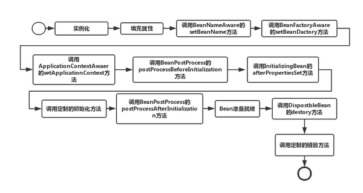

先调用构造函数进行实例化，然后填充属性，再接着进行其他附加操作和初始化，正是这样的生命周期，才有了Spring的解决循环依赖，这样的解决机制是根据Spring框架内定义的三级缓存来实现的，也就是说：三级缓存解决了Bean之间的循环依赖。我们从源码中来说明。

1. singletonObjects：第一级缓存，里面放置的是实例化好的单例对象；
2. earlySingletonObjects：第二级缓存，里面存放的是提前曝光的单例对象；
3. singletonFactories：第三级缓存，里面存放的是要被实例化的对象的对象工厂。

所以当一个Bean调用构造函数进行实例化后，即使属性还未填充，就可以通过三级缓存向外暴露依赖的引用值（所以循环依赖问题的解决也是基于Java的引用传递），这也说明了另外一点，基于构造函数的注入，如果有循环依赖，Spring是不能够解决的。还要说明一点，Spring默认的Bean Scope是单例的，而三级缓存中都包含singleton，可见是对于单例Bean之间的循环依赖的解决，Spring是通过三级缓存来实现的

#### ThreadLocal类型变量为何声明为静态
Java 中每个线程都有与之关联的Thread对象，Thread对象中有一个ThreadLocal.ThreadLocalMap类型的成员变量，该变量是一个Hash表， 所以每个线程都单独维护这样一个Hash表，当ThreadLocal类型对象调用set方法时，threadLocalID.set(id)，这个set方法会使用当前线程维护的Hash表，把自己作为key, id作为value插入到Hash表中。由于每个线程维护的Hash表是独立的，因此在不同的Hash表中，key值即使相同也是没问题的。

如果把threadLocalID声明为非静态，则在类A的每个实例中都会产生一个新对象，这是毫无意义的，只是增加了内存消耗。


把ThreadLocal定义为static还有一个好处就是，由于ThreadLocal有强引用在，那么在ThreadLocalMap里对应的Entry的键会永远存在，那么执行remove的时候就可以正确进行定位到并且删除！！！


实际上 ThreadLocalMap 中使用的 key 为 ThreadLocal 的弱引用，弱引用的特点是，如果这个对象只存在弱引用，那么在下一次垃圾回收的时候必然会被清理掉。
所以如果 ThreadLocal 没有被外部强引用的情况下，在垃圾回收的时候会被清理掉的，这样一来 ThreadLocalMap中使用这个 ThreadLocal 的 key 也会被清理掉。但是，value 是强引用，不会被清理，这样一来就会出现 key 为 null 的 value。
ThreadLocalMap实现中已经考虑了这种情况，在调用 set()、get()、remove() 方法的时候，会清理掉 key 为 null 的记录。如果说会出现内存泄漏，那只有在出现了 key 为 null 的记录后，没有手动调用 remove() 方法，并且之后也不再调用 get()、set()、remove() 方法的情况下。


#### BeanFactoryPostProcessor
BeanPostProcessor：bean后置处理器，bean创建对象初始化前后进行拦截工作的
而BeanFactoryPostProcessor：是beanFactory的后置处理器；
调用时机：在BeanFactory标准初始化之后调用，这时所有的bean定义已经保存加载到beanFactory，但是bean的实例还未创建
能干什么：来定制和修改BeanFactory的内容，如覆盖或添加属性


#### 线程池的submit和execute方法区别
1、接收的参数不一样
都可以是Runnable
submit 也可以是Callable

2、submit有返回值，而execute没有
返回值是Future

3、submit方便Exception处理

#### InheritableThreadLocal和TransmittableThreadLocal

```java
//初始化一个线程时,获取当前线程,作为父线程
 Thread parent = currentThread();
//如果父线程inheritableThreadLocals 不为空时,子线程复制一份inheritableThreadLocals 
 if (parent.inheritableThreadLocals != null)
            this.inheritableThreadLocals =
                ThreadLocal.createInheritedMap(parent.inheritableThreadLocals);
```


#### Tomcat是如何隔离Web应用的？


Ingress和nginx区别
k8s和原生springcloud的兼容性
微服务与SOA区别
Java PriprityQueue数据结构
java 生产者消费者模式

JVM 的伪共享

redis哨兵解决了什么问题？codis解决了什么问题？


对docker有了解吗
xxl-job分片
有对比过Kafka和rocketMQ吗
G1特点


LSM-Tree 的写放大写放大、读放大、空间放大RockDB 写放大3  za
优先级队列实现方案
InheritableThreadLocal原理，如何在父子线程间传递变量


微服务和模块划分原则
jvm性能调优/cpu过高/内存占用过高处理
https://blog.csdn.net/u010808135/article/details/94650074
https://www.cnblogs.com/huojg-21442/articles/8761359.html
公平锁和非公平锁的区别？
Redis分布式锁如何续期
经常FullGC,哪些指标会增长？
频繁发生FullGC的排查
https://blog.csdn.net/endlu/article/details/51144739
https://blog.csdn.net/zhanyu1/article/details/80028842
https://www.cnblogs.com/klvchen/articles/11758324.html
https://zhuanlan.zhihu.com/p/75039179
https://juejin.cn/post/6844903953004494856
https://tech.meituan.com/2017/12/29/jvm-optimize.html
https://juejin.cn/post/6844903646119854093
https://wiki.jikexueyuan.com/project/jvm-parameter/memory-tuning.html
https://blog.csdn.net/a745233700/article/details/87740314
https://blog.csdn.net/liuxinghao/article/details/73963399
