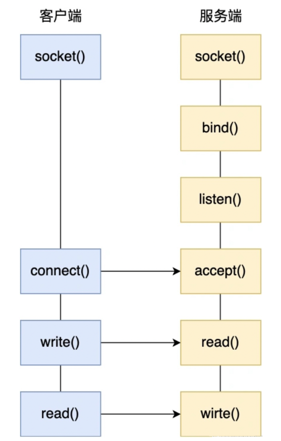
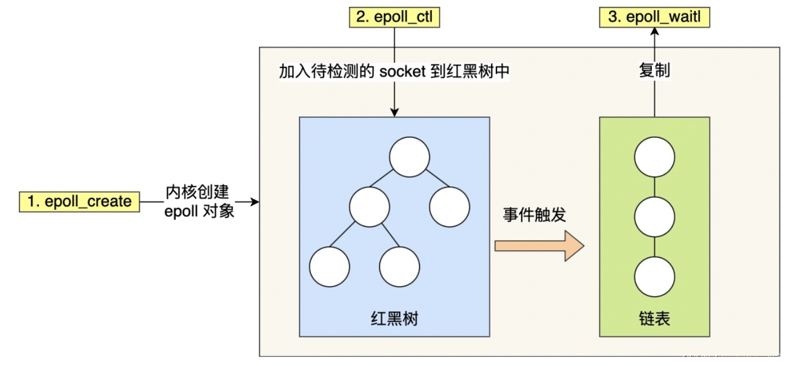

#### epoll

##### 最基本的 Socket 模型

创建 Socket 的时候，可以指定网络层使用的是 IPv4 还是 IPv6，传输层使用的是 TCP 还是 UDP。

服务端首先调用 socket() 函数，创建网络协议为 IPv4，以及传输协议为 TCP 的 Socket ，接着调用 bind() 函数，给这个 Socket 绑定一个 IP 地址和端口，绑定这两个的目的是什么？

绑定端口的目的：当内核收到 TCP 报文，通过 TCP 头里面的端口号，来找到我们的应用程序，然后把数据传递给我们。
绑定 IP 地址的目的：一台机器是可以有多个网卡的，每个网卡都有对应的 IP 地址，当绑定一个网卡时，内核在收到该网卡上的包，才会发给我们；
通过 netstat 命令查看对应的端口号是否有被监听。
在 TCP 连接的过程中，服务器的内核实际上为每个 Socket 维护了两个队列：

一个是「还没完全建立」连接的队列，称为 TCP 半连接队列，这个队列都是没有完成三次握手的连接，此时服务端处于 syn_rcvd 的状态；
一个是「已经建立」连接的队列，称为 TCP 全连接队列，这个队列都是完成了三次握手的连接，此时服务端处于 established 状态；
当 TCP 全连接队列不为空后，服务端的 accept() 函数，就会从内核中的 TCP 全连接队列里拿出一个已经完成连接的 Socket 返回应用程序，后续数据传输都用这个 Socket。

注意，监听的 Socket 和真正用来传数据的 Socket 是两个：

一个叫作监听 Socket；
一个叫作已连接 Socket；
连接建立后，客户端和服务端就开始相互传输数据了，双方都可以通过 read() 和 write() 函数来读写数据。



##### IO多路复用

I/O 多路复用技术：只使用一个进程来维护多个 Socket ，也叫做时分多路复用。

进程可以通过一个系统调用函数从内核中获取多个事件。

select/poll/epoll 是如何获取网络事件的呢？先把所有连接（文件描述符）传给内核，再由内核返回产生了事件的连接，然后在用户态中再处理这些连接对应的请求即可。

##### select/poll

select 实现多路复用的方式是，将已连接的 Socket 都放到一个文件描述符集合，然后调用 select 函数将文件描述符集合拷贝到内核里，让内核来检查是否有网络事件产生，检查的方式很粗暴，就是通过遍历文件描述符集合的方式，当检查到有事件产生后，将此 Socket 标记为可读或可写， 接着再把整个文件描述符集合拷贝回用户态里，然后用户态还需要再通过遍历的方法找到可读或可写的 Socket，然后再对其处理。

所以，对于 select 这种方式，需要进行 2 次「遍历」文件描述符集合，一次是在内核态里，一个次是在用户态里 ，而且还会发生 2 次「拷贝」文件描述符集合，先从用户空间传入内核空间，由内核修改后，再传出到用户空间中。

select 使用固定长度的 BitsMap，表示文件描述符集合，而且所支持的文件描述符的个数是有限制的，在 Linux 系统中，由内核中的 FD_SETSIZE 限制， 默认最大值为 1024，只能监听 0~1023 的文件描述符。

poll 不再用 BitsMap 来存储所关注的文件描述符，取而代之用动态数组，以链表形式来组织，突破了 select 的文件描述符个数限制，当然还会受到系统文件描述符限制。

但是 poll 和 select 并没有太大的本质区别，都是使用「线性结构」存储进程关注的 Socket 集合，因此都需要遍历文件描述符集合来找到可读或可写的 Socket，时间复杂度为 O(n)，而且也需要在用户态与内核态之间拷贝文件描述符集合，这种方式随着并发数上来，性能的损耗会呈指数级增长。

##### epoll

epoll 的用法。如下的代码中，先用e poll_create 创建一个 epol l对象 epfd，再通过 epoll_ctl 将需要监视的 socket 添加到epfd中，最后调用 epoll_wait 等待数据。

```cpp
int s = socket(AF_INET, SOCK_STREAM, 0);
bind(s, ...);
listen(s, ...)
 
int epfd = epoll_create(...);
epoll_ctl(epfd, ...); //将所有需要监听的socket添加到epfd中
 
while(1) {
    int n = epoll_wait(...);
    for(接收到数据的socket){
        //处理
    }
}
```

epoll 通过两个方面，很好解决了 select/poll 的问题。

第一点，epoll 在内核里使用**红黑树来跟踪进程所有待检测的文件描述字**，把需要监控的 socket 通过 epoll_ctl() 函数加入内核中的红黑树里，红黑树是个高效的数据结构，增删改一般时间复杂度是 O(logn)。而 select/poll 内核里没有类似 epoll 红黑树这种保存所有待检测的 socket 的数据结构，所以 select/poll 每次操作时都传入整个 socket 集合给内核，而 epoll 因为在内核维护了红黑树，可以保存所有待检测的 socket ，所以只需要传入一个待检测的 socket，减少了内核和用户空间大量的数据拷贝和内存分配。

第二点， epoll 使用**事件驱动**的机制，内核里维护了一个**链表来记录就绪事件**，当某个 socket 有事件发生时，通过回调函数内核会将其加入到这个就绪事件列表中，当用户调用 epoll_wait() 函数时，只会返回有事件发生的文件描述符的个数，不需要像 select/poll 那样轮询扫描整个 socket 集合，大大提高了检测的效率。




##### 边缘触发和水平触发
epoll 支持两种事件触发模式，分别是边缘触发（edge-triggered，ET）和水平触发（level-triggered，LT）。

这两个术语还挺抽象的，其实它们的区别还是很好理解的。

使用边缘触发模式时，当被监控的 Socket 描述符上有可读事件发生时，服务器端只会从 epoll_wait 中苏醒一次，即使进程没有调用 read 函数从内核读取数据，也依然只苏醒一次，因此我们程序要保证一次性将内核缓冲区的数据读取完；
使用水平触发模式时，当被监控的 Socket 上有可读事件发生时，服务器端不断地从 epoll_wait 中苏醒，直到内核缓冲区数据被 read 函数读完才结束，目的是告诉我们有数据需要读取；
水平触发的意思是只要满足事件的条件，比如内核中有数据需要读，就一直不断地把这个事件传递给用户；而边缘触发的意思是只有第一次满足条件的时候才触发，之后就不会再传递同样的事件了。

如果使用边缘触发模式，I/O 事件发生时只会通知一次，而且我们不知道到底能读写多少数据，所以在收到通知后应尽可能地读写数据，以免错失读写的机会。因此，我们会循环从文件描述符读写数据，那么如果文件描述符是阻塞的，没有数据可读写时，进程会阻塞在读写函数那里，程序就没办法继续往下执行。所以，边缘触发模式一般和非阻塞 I/O 搭配使用，程序会一直执行 I/O 操作，直到系统调用（如 read 和 write）返回错误，错误类型为 EAGAIN 或 EWOULDBLOCK。

epoll 是解决 C10K 问题的利器，通过两个方面解决了 select/poll 的问题。

epoll 在内核里使用「红黑树」来关注进程所有待检测的 Socket，红黑树是个高效的数据结构，增删改一般时间复杂度是 O(logn)，通过对这棵黑红树的管理，不需要像 select/poll 在每次操作时都传入整个 Socket 集合，减少了内核和用户空间大量的数据拷贝和内存分配。
epoll 使用事件驱动的机制，内核里维护了一个「链表」来记录就绪事件，只将有事件发生的 Socket 集合传递给应用程序，不需要像 select/poll 那样轮询扫描整个集合（包含有和无事件的 Socket ），大大提高了检测的效率。
而且，epoll 支持边缘触发和水平触发的方式，而 select/poll 只支持水平触发，一般而言，边缘触发的方式会比水平触发的效率高。