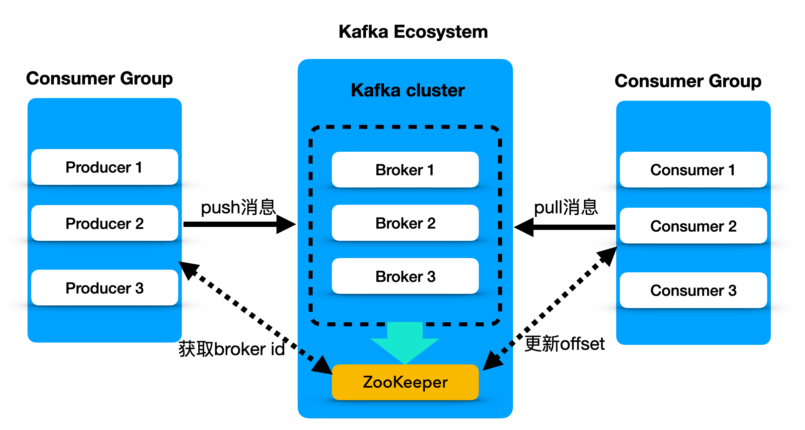
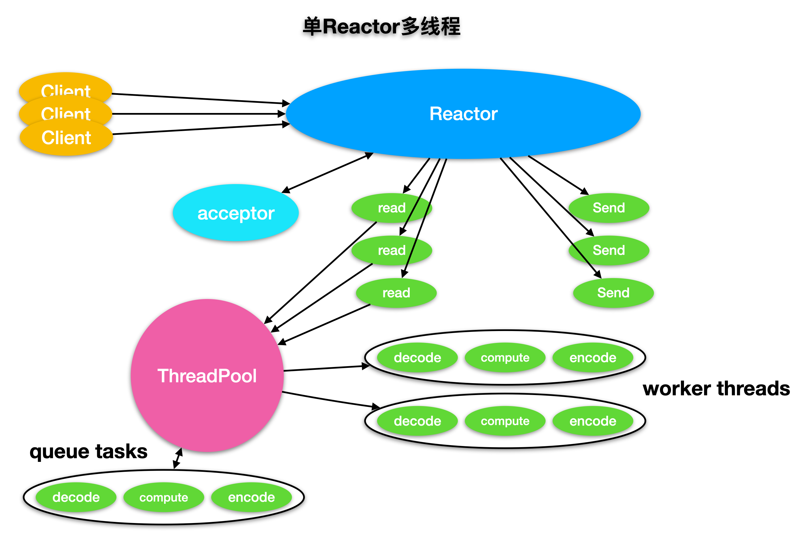
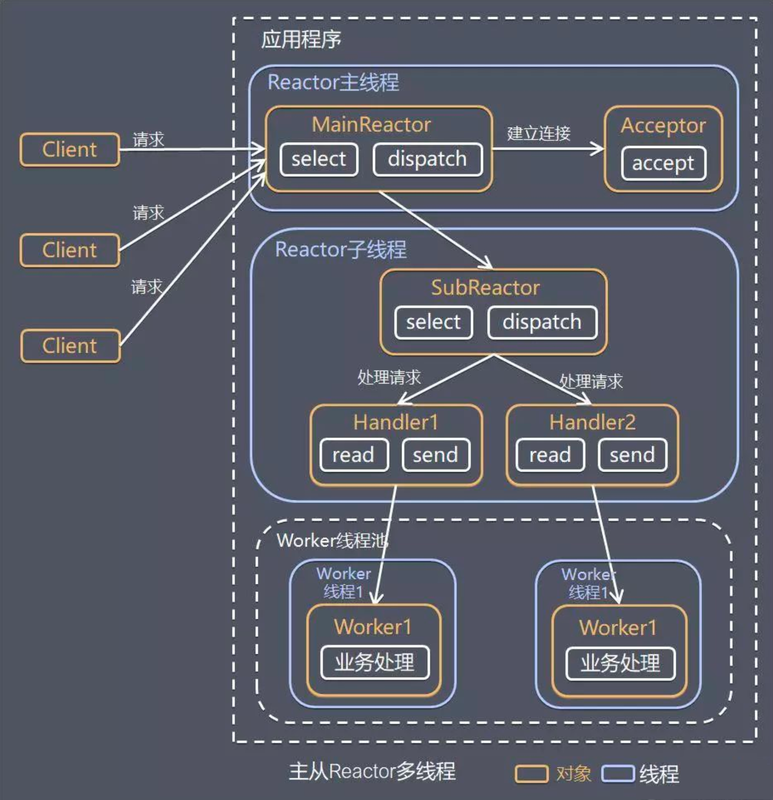
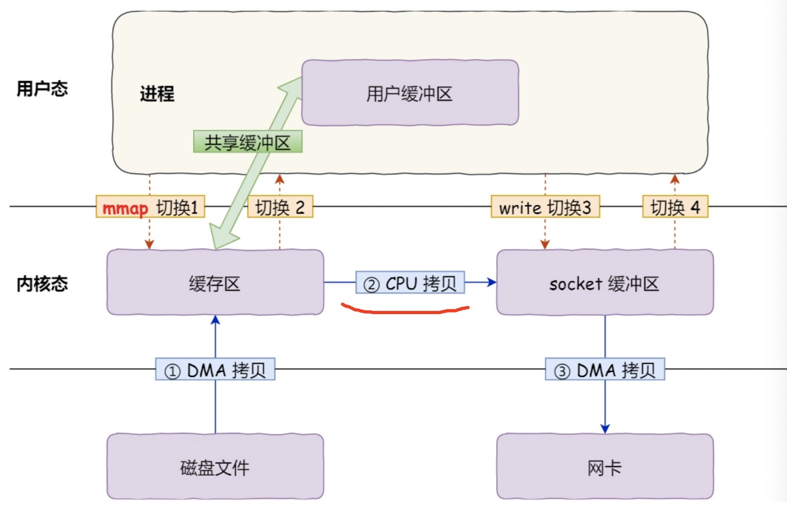

 kafka基础名词、使用说明、场景、原理、架构、快的原因、其它中间件共同的优化措施、面试集锦

## 一、kafka简介

### 1.1 kafka是什么

**Apache Kafka是 一个分布式流处理平台**

流处理平台有以下三种特性:
1. 要**发布**（写）和**订阅**（读）流事件，包括来自其他系统的数据的持续导入/导出的。
2. **存储**持久和可靠的事件流
3. 在事件发生时或追溯性地**处理**事件流。

Kafka可以用于两大类别的应用:
1. 构造实时流数据管道，它可以在系统或应用之间可靠地获取数据。(相当于message queue)
2. 构建实时流式应用程序，对这些流数据进行转换或者影响。(就是流处理，通过kafka stream topic和topic之间内部进行变化)

### 1.2 历史由来

Kafka从何而来?我们为什么要开发Kafka? Kafka到底是什么?
Kafka 最初是 LinkedIn 的一个内部基础设施系统。我们发现虽然有很多数据库和系统可以用来存储数据，但在我们的架构里，**刚好缺一个可以帮助处理持续数据流的组件**。在开发Kafka之前，我们实验了各种现成的解决方案，**从消息系统到日志聚合系统，再到ETL工具，它们都无法满足我们的需求。**
最后，我们决定从头开发一个系统。**我们不想只是开发一个能够存储数据的系统**，比如传统的关系型数据库、键值存储引擎、搜索引擎或缓存系统，**我们希望能够把数据看成是持续变化和不断增长的流**，并基于这样的想法构建出一个数据系统。事实上，是一个数据架构。
这个想法实现后比我们最初预想的适用性更广。Kafka 一开始被用在社交网络的实时应用和数据流当中，而现在已经成为下一代数据架构的基础。大型零售商正在基于持续数据流改造他们的基础业务流程，汽车公司正在从互联网汽车那里收集和处理实时数据流，银行也在重新思考基于 Kafka 改造他们的基础。


### 1.3 历史版本
| 版本号   | 备注                                                         |
| :------- | :----------------------------------------------------------- |
| 0.7      | 上古版本，提供了最基础的消息队列功能                         |
| 0.8      | 引入了**副本机制**，成为了一个真正意义上完备的分布式高可靠消息队列解决方案 |
| 0.8.2    | **新版本 Producer API**，即需要指定 Broker 地址的 Producer   |
| 0.9      | 增加了基础的安全认证 / 权限，Java 重写了新版本消费者 API     |
| 0.10.0.0 | **引入了 Kafka Streams**                                     |
| 0.11.0.0 | 提供幂等性 Producer API 以及事务（Transaction） API，对 Kafka 消息格式做了重构。 |
| 1.0      | Kafka Streams 的各种改进                                     |
| 2.0      | Kafka Streams 的各种改进                                     |

### 1.4 术语

- 消息：Record。这里的消息就是指 Kafka 处理的主要对象。
- 服务：**Broker**。一个 Kafka 集群由多个 Broker 组成，Broker 负责接收和处理客户端发送过来的请求，以及对消息进行持久化。
- 主题：**Topic**。主题是承载消息的逻辑容器，在实际使用中多用来区分具体的业务。
- 分区：**Partition**。一个有序不变的消息序列。每个主题下可以有多个分区。
- 消息位移：Offset。表示分区中每条消息的位置信息，是一个单调递增且不变的值。
- 副本：**Replica**。Kafka 中同一条消息能够被拷贝到多个地方以提供数据冗余，这些地方就是所谓的副本。副本还分为领导者副本和追随者副本，各自有不同的角色划分。副本是在分区层级下的，即每个分区可配置多个副本实现高可用。
- 生产者：**Producer**。向主题发布新消息的应用程序。
- 消费者：**Consumer**。从主题订阅新消息的应用程序。
- 消费者位移：Consumer Offset。表征消费者消费进度，每个消费者都有自己的消费者位移。
- 消费者组：Consumer Group。多个消费者实例共同组成的一个组，同时消费多个分区以实现高吞吐。
- 重平衡：Rebalance。消费者组内某个消费者实例挂掉后，其他消费者实例自动重新分配订阅主题分区的过程。Rebalance 是 Kafka 消费者端实现高可用的重要手段。 
- leader: replica 中的一个角色， producer 和 consumer 只跟 leader 交互。 
- follower: replica 中的一个角色，从 leader 中复制数据。 
- controller: kafka 集群中的其中一个服务器，用来进行 leader election 以及 各种 failover。 
- ZK: kafka 通过 zookeeper 来存储集群的 meta 信息。


### 1.5 核心API

1. Admin API ：管理和检查topic、brokers、和其它kafka对象。

   The Admin API to manage and inspect topics, brokers, and other Kafka objects.

2. 生产者API。发布流事件到一个或者多个kafka主题（topics）。

   The Producer API to publish (write) a stream of events to one or more Kafka topics.

3. 消费者API。订阅一个或多个主题，并处理产生于这些主题的流事件

   - The Consumer API to subscribe to (read) one or more topics and to process the stream of events produced to them.

4. StreamsAPI允许一个应用程序作为一个流处理器，消费一个或者多个topic产生的输入流，然后生产一个输出流到一个或多个topic中去，在输入输出流中进行有效的转换。

   The Kafka Streams API to implement stream processing applications and microservices. It provides higher-level functions to process event streams, including transformations, stateful operations like aggregations and joins, windowing, processing based on event-time, and more. Input is read from one or more topics in order to generate output to one or more topics, effectively transforming the input streams to output streams.

5. ConnectorAPI，允许构建并运行可重用的生产者或者消费者，将Kafka topics连接到已存在的应用程序或者数据系统。比如，连接到一个关系型数据库，捕捉表（table）的所有变更内容。

   The Kafka Connect API to build and run reusable data import/export connectors that consume (read) or produce (write) streams of events from and to external systems and applications so they can integrate with Kafka.

## 二、使用场景

服务解耦，异步处理，限流削峰，消息驱动的系统


## 三、架构原理

### 3.1 整体架构图

一个典型的kafka集群中包含若干个Producer，若干个Broker，若干个Consumer，以及一个zookeeper集群； kafka通过zookeeper管理集群配置，选举leader，以及在Consumer Group发生变化时进行Rebalance（负载均衡）；Producer使用push模式将消息发布到Broker；Consumer使用pull模式从Broker中订阅并消费消息。



#### 3.1.2 broker

kafka为每个主题维护了分布式的分区(partition)日志文件，每个partition在kafka存储层面是append log。任何发布到此partition的消息都会被追加到log文件的尾部，在分区中的每条消息都会按照时间顺序分配到一个单调递增的顺序编号，也就是我们的offset,offset是一个long型的数字，我们通过这个offset可以确定一条在该partition下的唯一消息。在partition下面是保证了有序性，但是在topic下面没有保证有序性。

#### 3.1.3 zk

**zk与Producer, Broker, Consumer的关系**

Kafka通过Zookeeper管理集群配置，选举leader，以及在Consumer Group发生变化时进行rebalance。Producer使用push模式将消息发布到broker，Consumer使用pull模式从broker订阅并消费消息。

1. Producer端直接连接broker.list列表,从列表中返回TopicMetadataResponse,该Metadata包含Topic下每个partition leader建立socket连接并发送消息.
2. Broker端使用zookeeper用来注册broker信息,以及监控partition leader存活性.
3. Consumer端使用zookeeper用来注册consumer信息,其中包括consumer消费的partition列表等,同时也用来发现broker列表,并和partition leader建立socket连接,并获取消息。

> Producer向zookeeper中注册watcher,了解topic的partition的消息，以动态了解运行情况，实现负载均衡。Zookeepr不管理producer，只是能够提供当前broker的相关信息。


每个Broker服务器在启动时，都会到Zookeeper上进行注册，即创建/brokers/ids/[0-N]的节点，然后写入IP，端口等信息，Broker创建的是临时节点，所有一旦Broker上线或者下线，对应Broker节点也就被删除了，因此我们可以通过zookeeper上Broker节点的变化来动态表征Broker服务器的可用性,Kafka的Topic也类似于这种方式。

**Controller 的HA中zk起到的作用**

在 broker 启动的时候，都会去尝试创建 /controller 这么一个临时节点，由于 zk 的本身机制，哪怕是并发的情况下，也只会有一个 broker 能够创建成功。因此创建成功的那个就会成为 controller，而其余的 broker 都会对这 controller 节点加上一个 Watcher，
一旦原有的 controller 出问题，临时节点被删除，那么其他 broker 都会感知到从而进行新一轮的竞争，谁先创建那么谁就是新的 controller。
当然，在这个重新选举的过程中，有一些需要 controller 参与的动作就无法进行，例如元数据更新等等。需要等到 controller 竞争成功并且就绪后才能继续进行，所以 controller 出问题对 kafka 集群的影响是不小的。

**消费者注册**

消费者服务器在初始化启动时加入消费者分组的步骤如下

注册到消费者分组。每个消费者服务器启动时，都会到Zookeeper的指定节点下创建一个属于自己的消费者节点，例如/consumers/[group_id]/ids/[consumer_id]，完成节点创建后，消费者就会将自己订阅的Topic信息写入该临时节点。

对 消费者分组 中的 消费者 的变化注册监听。每个 消费者 都需要关注所属 消费者分组 中其他消费者服务器的变化情况，即对/consumers/[group_id]/ids节点注册子节点变化的Watcher监听，一旦发现消费者新增或减少，就触发消费者的负载均衡。

对Broker服务器变化注册监听。消费者需要对/broker/ids/[0-N]中的节点进行监听，如果发现Broker服务器列表发生变化，那么就根据具体情况来决定是否需要进行消费者负载均衡。

进行消费者负载均衡。为了让同一个Topic下不同分区的消息尽量均衡地被多个 消费者 消费而进行 消费者 与 消息 分区分配的过程，通常，对于一个消费者分组，如果组内的消费者服务器发生变更或Broker服务器发生变更，会发出消费者负载均衡。

#### 3.1.4 日志

日志可能是一种最简单的不能再简单的存储抽象，只能追加、按照时间完全有序（totally-ordered）的记录序列。日志看起来的样子：


在日志的末尾添加记录，读取日志记录则从左到右。每一条记录都指定了一个唯一的顺序的日志记录编号。

日志记录的次序（ordering）定义了『时间』概念，因为位于左边的日志记录表示比右边的要早。日志记录编号可以看作是这条日志记录的『时间戳』。把次序直接看成是时间概念，刚开始你会觉得有点怪异，但是这样的做法有个便利的性质：**解耦了时间和任一特定的物理时钟（physical clock ）**。引入分布式系统后，这会成为一个必不可少的性质。

日志和文件或数据表（table）并没有什么大的不同。文件是一系列字节，表是由一系列记录组成，而日志实际上只是一种按照时间顺序存储记录的数据表或文件。

#### 3.1.4 Topic

对于每一个topic， Kafka集群都会维持一个分区日志，如下所示：


在Kafka中的每一条消息都有一个topic。一般来说在我们应用中产生不同类型的数据，都可以设置不同的主题。一个主题一般会有多个消息的订阅者，当生产者发布消息到某个主题时，订阅了这个主题的消费者都可以接收到生产者写入的新消息。

- 一个 Topic 是由多个队列组成的，被称为【Partition（分区）】。
- 生产者发送消息的时候，这条消息会被路由到此 Topic 中的某一个 Partition。
- 消费者监听的是所有分区。
- 生产者发送消息时，默认是面向 Topic 的，由 Topic 决定放在哪个 Partition，默认使用轮询策略。
- 也可以配置 Topic，让同类型的消息都在同一个 Partition。例如，处理用户消息，可以让某一个用户所有消息都在一个 Partition。用户1发送了3条消息：A、B、C，默认情况下，这3条消息是在不同的 Partition 中（如 P1、P2、P3）。在配置之后，可以确保用户1的所有消息都发到同一个分区中（如 P1）。这是为了提供消息的【有序性】。
- **消息在不同的 Partition 是不能保证有序的，只有一个 Partition 内的消息是有序的。**


#### 3.1.5 Partition

一个topic下有多个不同partition，每个partition为一个目录，partiton命名规则为**topic名称+有序序号**

1.每个partion(目录)相当于一个巨型文件被平均分配到多个大小相等segment(段)数据文件中。但每个段segment file消息数量不一定相等，这种特性方便old segment file快速被删除。

2.每个partiton只需要支持顺序读写就行了，segment文件生命周期由服务端配置参数决定。

#### 3.1.6 producer

**生产者的发送消息方式有三种**

1. 不管结果如何直接发送
2. 发送并返回结果
3. 发送并回调

**produce分区策略**

1. DefaultPartitioner 默认分区策略
   - 如果消息中指定了分区，则使用它
   - 如果未指定分区但存在key，则根据序列化key使用murmur2哈希算法对分区数取模。
   - 如果不存在分区或key，则会使用**粘性分区策略**
2. UniformStickyPartitioner 纯粹的粘性分区策略
   - UniformStickyPartitioner 是不管你有没有key, 统一都用粘性分区来分配。
3. RoundRobinPartitioner 分区策略
   - 如果消息中指定了分区，则使用它
   - 将消息平均的分配到每个分区中。
   - 与key无关

**粘性分区**

Kafka2.4版本之后，支持粘性分区。Producer在发送消息的时候,会将消息放到一个ProducerBatch中, 这个Batch可能包含多条消息,然后再将Batch打包发送。消息的发送必须要等到Batch满了或者`linger.ms`时间到了,才会发送。
- `linger.ms`，默认是0ms，当达到这个时间后，kafka producer就会立刻向broker发送数据。
- `batch.size`，默认是16kb，当产生的消息数达到这个大小后，就会立即向broker发送数据。

#### 3.1.7 Consumer

Kafka采取拉取模型(poll)，由自己控制消费速度，以及消费的进度，消费者可以按照任意的偏移量进行消费。比如消费者可以消费已经消费过的消息进行重新处理，或者消费最近的消息等等。

每个Consumer只能对应一个ConsumerGroup.

消费者组中的消费者实例个数不能超过分区的数量。否则会出现部分消费者闲置的情况发生。

**consumer分区策略**

1. RoundRobinAssignor. 针对所有topic分区。它是采用轮询分区策略，是把所有的partition和所有的consumer列举出来，然后按照hashcode进行排序，最后再通过轮询算法来分配partition给每个消费者。
2. RangeAssignor. RangeAssignor作用域为每个Topic。对于每一个Topic，将该Topic的所有可用partitions和订阅该Topic的所有consumers展开(字典排序)，然后将partitions数量除以consumers数量，算数除的结果分别分配给订阅该Topic的consumers，算数除的余数分配给前一个或者前几个consumers。
3. StickyAssignor. StickyAssignor有两个目标：首先，尽可能保证分区分配均衡(即分配给consumers的分区数最大相差为1)；其次，当发生分区重分配时，尽可能多的保留现有的分配结果。当然，第一个目标的优先级高于第二个目标。
4. CooperativeStickyAssignor. 上述三种分区分配策略均是基于eager协议，Kafka2.4.0开始引入CooperativeStickyAssignor策略。CooperativeStickyAssignor与之前的StickyAssignor虽然都是维持原来的分区分配方案，最大的区别是：StickyAssignor仍然是基于eager协议，分区重分配时候，都需要consumers先放弃当前持有的分区，重新加入consumer group；而CooperativeStickyAssignor基于cooperative协议，该协议将原来的一次全局分区重平衡，改成多次小规模分区重平衡。

>kafka2.4版本支持：一个是kafka支持从follower副本读取数据，当然这个功能并不是为了提供读取性能。kafka存在多个数据中心，不同数据中心存在于不同的机房，当其中一个数据中心需要向另一个数据中心同步数据的时候，由于只能从leader replica消费数据，那么它不得不进行跨机房获取数据，而这些流量带宽通常是比较昂贵的（尤其是云服务器）。即无法利用本地性来减少昂贵的跨机房流量。
>
>所以kafka推出这一个功能，就是帮助类似这种场景，节约流量资源。

#### 3.1.8 消费者组

Consumer Grep (CG)： 消费者组，有多个consumer组成，形成一个消费者组的条件是所有的消费者的groupid相同

- 消费者组内每个消费者负责消费不同分区的数据，一个分区只能由一个组内消费者消费
- 消费者组之间互不影响，所有的消费者都属于某个消费者组，即消费者组是逻辑上的一个订阅者
- 如果向消费者组中添加更多的消费者，超过主题分区数量，则有一部分消费者就会闲置不会接收任何消息


> kafka默认的分区策略是：一个分区只能由一个组内消费者消费。但自定义的分区策略可以打破这一限制！
>
> 因为所有的消息者都会提交它自身的offset到__comsumer_offsets中，后提交的offset会覆盖前面提交的offset，所以会引起重复消费和丢消息。例：consumer1提交了分区tp0的offset为10，consumer2提交了同一分区tp0的offset为12,如果consumer1重启，则会丢消息；如果consumer2提交的同一分区tp0的offset为8，则cosumer重启后会重复消费。
>
> 要实现真正的组内广播，需要自己保存每个消费者的offset，可以考虑通过保存本地文件、redis、数据库等试实现。

#### 3.1.9 消费者事务

  如果想完成consumer端的精准一次性消费，那么需要 **kafka消费端将消费过程和提交offset过程做原子绑定。** 此时我们需要将kafka的offset保存到支持事务的自定义介质如MySQL中。

#### 3.2.0 Kraft

替代zk

由于 zk 的实现机制，无法承受大量的并发写操作，因此 zk 只能适用于中小集群的元数据管理，这也是为什么 kafka 要去 zk 的原因之一。
其他的原因的话，主要是考虑到运维成本方面，在强依赖 zk 的场景下，运维人员在使用 kafka 的时候不得不部署维护 zk 集群，因此会增加一定的运维难度和成本。


### 3.2 网络模型

kafka为什么没有选用netty作为底层的通讯基础?

> 作者的回复其实很简单：
> 1.出于性能的考虑 
> 2.最初依赖太多外部的包，导致包膨胀。后期考虑不再依赖太多外部的资源，所以虽然苦逼的踩了很多坑但是结果还是很爽的

Kafka网络层采用的是Reactor模式，是一种基于事件驱动的模式。

Reacor模式是一种事件驱动机制，他逆转了事件处理的流程，不再是主动地等事件就绪，而是它提前注册好的回调函数，当有对应事件发生时就调用回调函数。 由[陈硕](https://item.jd.com/13280784.html)所述，**Reactor即为非阻塞IO + IO复用**。它的核心思想就是利用IO复用技术来监听套接字上的读写事件，一旦某个fd上发生相应事件，就反过来处理该套接字上的回调函数。

#### 3.2.1 reactor模型

**1. 单Reactor单线程**

1）可以实现通过一个阻塞对象监听多个链接请求
2）Reactor对象通过select监听客户端请求事件，通过dispatch进行分发
3）如果是建立链接请求，则由Acceptor通过accept处理链接请求，然后创建一个Handler对象处理完成链接后的各种事件
4）如果不是链接请求，则由Reactor分发调用链接对应的Handler来处理
5）Handler会完成Read->业务处理->send的完整业务流程


**2. 单Reactor多线程**

1）Reactor对象通过select监听客户端请求事件，收到事件后，通过dispatch分发
2）如果是建立链接请求，则由Acceptor通过accept处理链接请求，然后创建一个Handler对象处理完成链接后的各种事件
3）如果不是链接请求，则由Reactor分发调用链接对应的Handler来处理
4）Handler只负责事件响应不做具体业务处理
5）通过read读取数据后，分发到worker线程池处理，处理完成后返回给Handler，Handler收到后，通过send将结果返回给client



**3. 主从Reactor多线程**

1）Reactor主线程MainReactor对象通过select监听链接事件，通过Acceptor处理
2）当Acceptor处理链接事件后，MainReactor将链接分配给SubReactor
3）SubReactor将链接加入到队列进行监听，并创建Handler进行事件处理
4）当有新事件发生时，SubReactor就会调用对应的Handler处理
5）Handler通过read读取数据，分发到worker线程池处理，处理完成后返回给Handler，Handler收到后，通过send将结果返回给client
6）Reactor主线程可以对应多个Reactor子线程


更详细的版本：

- Reactor 主线程 MainReactor 对象通过 Select 监控建立连接事件，收到事件后通过 Acceptor 接收，处理建立连接事件；
- Acceptor 处理建立连接事件后，MainReactor 将连接分配 Reactor 子线程给 SubReactor 进行处理；
- SubReactor 将连接加入连接队列进行监听，并创建一个 Handler 用于处理各种连接事件；
- 当有新的事件发生时，SubReactor 会调用连接对应的 Handler 进行响应；
- Handler 通过 Read 读取数据后，会分发给后面的 Worker 线程池进行业务处理；
- Worker 线程池会分配独立的线程完成真正的业务处理，如何将响应结果发给 Handler 进行处理；
- Handler 收到响应结果后通过 Send 将响应结果返回给 Client。



**总结**
三种模式用生活案例来理解
1）单Reactor单线程，前台接待员和服务员是同一个人，全程为顾客服务
2）单Reactor多线程，1个前台接待员，多个服务员，接待员只负责接待
3）主从Reactor多线程，多个前台接待员，多个服务员

#### 3.2.2 kafka reactor模型

kafka是基于**主从Reactor多线程**进行设计的。Acceptor是一个继承于AbstractServerThread的线程类，Acceptor的主要目的是监听并且接收Client的请求，同时，建立数据传输通道（SocketChannel），然后通过轮询的方式交给一个Processor处理。这里还有一个块通道（BlockingChannel），用于连接Processor和Handler。


MainReactor(Acceptor)只负责监听OP_ACCEPT事件, 监听到之后把SocketChannel 传递给 SubReactor(Processor), 每个Processor都有自己的Selector。SubReactor会监听并处理其他的事件,并最终把具体的请求传递给KafkaRequestHandlerPool。


#### 3.2.4 关键类

**SocketServer**
这个类是网络通信的核心类,它持有这Acceptor和 Processor对象。

**AbstractServerThread**
AbstractServerThread是**Acceptor**线程和**Processor**线程的抽象基类，它定义了一个抽象方法`wakeup()` ,主要是用来唤醒**Acceptor** 线程和 **Processor** 对应的`Selector`的, 当然还有一些共用方法

**Acceptor 和 Processor**
**Acceptor** 线程类：继承自**AbstractServerThread**, 这是接收和创建外部 TCP 连接的线程。每个 SocketServer 实例一般会创建一个 Acceptor 线程(如果`listeners`配置了多个就会创建多个Acceptor)。它的唯一目的就是创建连接，并将接收到的 **SocketChannel**(SocketChannel通道用于传输数据) 传递给下游的 Processor 线程处理,Processor主要是处理连接之后的事情,例如读写I/O。

- 监听`OP_ACCEPT`事件，不断循环获取已经accept的连接
- 判断每个ip的连接数是否超过quota限制
- 通过round-robin的方式，选择`Processor`，放入`Processor`对应的`newConnections`缓存中

**Processor** 线程类：这是处理单个TCP 连接上所有请求的处理线程。每个**Acceptor** 实例创建若干个（`num.network.threads`）Processor 线程。Processor 线程负责将接收到的 SocketChannel(SocketChannel通道用于传输数据。), 注册读写事件,当数据传送过来的时候,会立即读取Request数据,通过解析之后, 然后将其添加到 RequestChannel 的 `requestQueue` 队列上，同时还负责将 Response 返还给 Request 发送方。

- `configureNewConnections()`: 处理新建的连接，监听`OP_READ`事件，等待读取数据
- poll()
  -  真正读取数据，并放入接收缓存队列`stagedReceives`，缓存所有channel的请求
  - 拿出每个channel的第一个请求，解析协议头部，放入`completedReceives`缓存中
  - 如果channel写出ready，则进行write，将response返回给客户端

- `processCompletedReceives()`：将请求解析为`Request`并放入`requestQueue`缓存

**KafkaApis**
负责处理broker支持的各种通信协议，如`PRODUCE/FETCH/LIST_OFFSETS/LEADER_AND_ISR/HEARTBEAT`等

**KafkaRequestHandlerPool**
负责接收消息，处理`SocketServer`接收的请求，并构建response返回给`SocketServer`。此处重要监控指标：`RequestHandlerAvgIdlePercent`

- 从`requestQueue`中拿去request，并根据协议头，选择对应的`KafkaApi`进行处理
- 使用回调，将处理完成的response通过`KafkaChannel`放入当前channel对应的`Processor`的`responseQueue`中


**Acceptor 和 Processor的关系**


1. 这两个类都是 **AbstractServerThead**的实现类,超类是`Runnable` 可运行的。
2. 每个**Acceptor**持有`num.network.threads`个 **Processor** 线程, 假如配置了多个`listeners`，那么总共**Processor**线程数是 `listeners`*`num.network.threads`.
3. **Acceptor** 创建的是**ServerSocketChannel**通道,这个通道是用来监听新进来的TCP链接的通道,
   通过`serverSocketChannel.accept()`方法可以拿到**SocketChannel**通道用于传输数据。
4. 每个**Processor** 线程都有一个唯一的id，并且通过**Acceptor**拿到的**SocketChannel**会被暂时放入到`newConnections`队列中
5. 每个**Processor** 都创建了自己的Selector
6. Processor会不断的从自身的`newConnections`队列里面获取新**SocketChannel**，并注册读写事件,如果有数据传输过来,则会读取数据,并解析成Request请求。


#### 3.2.4 通信流程


1. KafkaServer启动的时候,会根据`listeners`的配置来初始化对应的实例。
2. 一个`listeners`对应一个Acceptor，一个Acceptor持有若干个(`num.network.threads`)Processor实例。
3. Acceptor 中的nioSelector注册的是ServerSocketChannel通道,并监听**OP_ACCEPT**事件，它只负责 TCP 创建和连接,不包含读写数据。
4. 当Acceptor监听到新的连接之后,就会通过调用`socketChannel = serverSocketChannel.accept()`拿到SocketChannel,然后把SocketChannel保存在Processor里面的`newConnection`队列中。 那么具体保存在哪个Processor中呢？当然是轮询分配了,确保负载均衡嘛。当然每个Processor的`newConnection`队列最大只有20,并且是代码写死的。如果一个Processor满了,则会寻找下一个存放,如果所有的都满了,那么就会阻塞。一个Acceptor的所有Processor最大能够并发处理的请求是 `20 * num.network.threads`。
5. Processor会持续的从自己的`newConnection`中poll数据,拿到SocketChannel之后,就把它注册到自己的Selector中,并且监听事件 OP_READ。 如果`newConnection`是空的话,poll的超时时间是 300ms。
6. 监听到有新的事件,比较READ，则会读取数据,并且解析成Request, 把Request放入到 RequestChannel中的`requestQueue`阻塞队列中。所有的待处理请求都是临时放在这里面。这个队列也有最大值`queued.max.requests（默认500）`，超过这个大小就会阻塞。
7. KafkaRequestHandlerPool中创建了很多(`num.io.threads(默认8)`)的KafkaRequestHandler,用来处理Request, 他们都会一直从RequestChannel中的`requestQueue`队列中poll新的Request,来进行处理。
8. 处理Request的具体逻辑是KafkaApis里面。当Request处理完毕之后，会调用requestChannel.sendResponse()返回Response。
9. 当然,请求Request和返回Response必须是一一对应的, 你这个请求是哪个Processor监听到的,则需要哪个Processor返回, 他们通过id来标识。
10. Response也不是里面返回的,而是先放到Processor中的ResponseQueue队列中,然后慢慢返回给客户端。


### 3.3 存储模型和文件系统

消息的可靠性由多副本机制来保障，而不是由同步刷盘这种严重影响性能的行为来保障。

国内部分银行在使用kafka时就会设置副本数为5。同时，如果能够在分配分区副本的时候引入机架信息(broker.rack参数)，那么还要应对机架整体宕机的风险。

#### 3.3.1 副本同步

我们知道,kafka每个topic的partition会有N个副本，kafka通过多副本机制实现故障自动转移，当kafka集群中一个broker失效情况下，会在N个副本中重新选出一个broker作为leader提供服务，从而做到高可用。N个副本中，其中一个为leader，其他的都为follower，**leader处理partition的所有读写请求**，follower会定期地复制leader上的数据。

所谓同步，必须满足两个条件：

1. 副本节点必须能与zookeeper保持会话（心跳机制）
2. 副本能复制leader上的所有写操作，并且不能落后太多（卡主或滞后的副本控制由replica.lag.time.max.ms配置）


默认情况下，Kafka topic的replica数量为1，即每个partition都有一个唯一的leader，为了确保消息的可靠性，通常应用中将其值（由broker的参数offsets.topic.replication.factor指定）大小设定为1。所有的副本（replicas）统称为AR (Assigned Replicas）。ISR是AR的一个子集，由leader维护ISR列表，follower从Leader同步数据有一些延迟，任意一个超过阈值都会把follower踢出ISR，存入OSR（Outof-Sync Replicas）列表，新加入的follower也会先存放到OSR中。AR = ISR + OSR

HW（HighWatermark）俗称**高水位，取一个partition对应的ISR中最小的LEO作为HW**，consumer最多只能消费到HW所在的位置。另外每个replica都有HW，leader和follower各自负责更新自己的HW的状态。对于leader新写入的消息，consumer不能立即消费，**leader会等待该消息被所有ISR中的replicas都同步后，才更新HW**，此时消息才能被consumer消费，这样就保证了如果Leader所在的broker失效，该消息仍可从新选举的leader中获取。对于来自内部的broker的读取请求，没有HW的限制。


Kafka的复制机制既不是完全的同步复制，也不是单纯的异步复制，**而是基于ISR的动态复制方案**。

基于ISR的动态复制指的是ISR是由Leader动态维护的，如果Follower不能紧“跟上”Leader，它将被Leader从ISR中移除，待它又重新“跟上”Leader后，会被Leader再次加加ISR中。每次改变ISR后，Leader都会将最新的ISR持久化到Zookeeper中。而**Kafka这种使用ISR的方式则很好的均衡了确保数据不丢失以及吞吐率，实现了可用性与数据一致性的动态平衡(也可以称作可调整一致性)**

#### 3.3.2 ISR

Kafka 动态维护了一个同步状态的备份的集合 （a set of in-sync replicas）， 简称 ISR ，在这个集合中的节点都是和 leader 保持高度一致的，只有这个集合的成员才 有资格被选举为 leader，一条消息必须被这个集合 所有 节点读取并追加到日志中了，这条消息才能视为提交。这个 ISR 集合发生变化会在 ZooKeeper 持久化，正因为如此，这个集合中的任何一个节点都有资格被选为 leader 。这对于 Kafka 使用模型中， 有很多分区和并确保主从关系是很重要的。因为 ISR 模型和 f+1 副本，一个 Kafka topic 冗余 f 个节点故障而不会丢失任何已经提交的消息。

我们认为对于希望处理的大多数场景这种策略是合理的。在实际中，为了冗余 f 节点故障，大多数投票和 ISR 都会在提交消息前确认相同数量的备份被收到（例如在一次故障生存之后，大多数的 quorum 需要三个备份节点和一次确认，ISR 只需要两个备份节点和一次确认），多数投票方法的一个优点是提交时能避免最慢的服务器。但是，我们认为通过允许客户端选择是否阻塞消息提交来改善，和所需的备份数较低而产生的额外的吞吐量和磁盘空间是值得的。

> Kafka 采取了一种稍微不同的方法来选择它的投票集。 Kafka 不是用大多数投票选择 leader 。
>
> 如果选择写入时候需要保证一定数量的副本写入成功，读取时需要保证读取一定数量的副本，读取和写入之间有重叠。这样的读写机制称为 Quorum。quorum 算法更常用于共享集群配置（如 ZooKeeper ）
>
> 大多数投票的缺点是，多数的节点挂掉让你不能选择 leader。要冗余单点故障需要三份数据，并且要冗余两个故障需要五份的数据。根据我们的经验，在一个系统中，仅仅靠冗余来避免单点故障是不够的，但是每写5次，对磁盘空间需求是5倍， 吞吐量下降到 1/5，这对于处理海量数据问题是不切实际的。这可能是为什么 quorum 算法更常用于共享集群配置（如 ZooKeeper ）， 而不适用于原始数据存储的原因，例如 HDFS 中 namenode 的高可用是建立在 基于投票的元数据 ，这种代价高昂的存储方式不适用数据本身。

另一个重要的设计区别是，Kafka 不要求崩溃的节点恢复所有的数据，在这种空间中的复制算法经常依赖于存在 “稳定存储”，在没有违反潜在的一致性的情况下，出现任何故障再恢复情况下都不会丢失。 这个假设有两个主要的问题。首先，我们在持久性数据系统的实际操作中观察到的最常见的问题是磁盘错误，并且它们通常不能保证数据的完整性。其次，即使磁盘错误不是问题，我们也不希望在每次写入时都要求使用 fsync 来保证一致性， 因为这会使性能降低两到三个数量级。我们的协议能确保备份节点重新加入ISR 之前，即使它挂时没有新的数据, 它也必须完整再一次同步数据。

> 消息从生产者写入kafka，首先写入副本leader，然后follower副本同步leader的消息。同步消息落后的副本会被踢出ISR，所以ISR的概念是，能追赶上leader的所有副本。
>
> replica.lag.time.max.ms参数：如果副本落后超过这个时间就判定为落后了，直到它回来。消息复制分为异步和同步，ISR是动态的，有进有出。

#### 3.3.3 segment文件存储

kafka的每个分区数据如果不加以控制就会无限堆积，所以kafka的分区存在分片机制即每超过1g就进行分片segement，每个分片单独具有一个log和一个index,log是实实在在存储数据的，index可以看着是log的索引。

1.segment file组成：由2大部分组成，分别为index file和data file，此2个文件一一对应，成对出现，分别表示为segment索引文件、数据文件.

index全部映射到memory直接操作,避免segment file被交换到磁盘增加IO操作次数。


2.segment文件命名规则：partion全局的第一个segment从0开始，后续每个segment文件名为上一个segment文件最后一条消息的offset值。数值最大为64位long大小，19位数字字符长度，没有数字用0填充。

00000000000000368769.index：假设这个消息中有N条消息，第3条消息在index文件中对应的是497，也就是说在log文件中，第3条消息的偏移量为497。


满足以下条件，就会切分日志文件，产生一个新的segment文件：

1. segment的默认大小是1073741824 bytes（1G），这个参数可以由 log.segment.bytes设置
2. 当消息的最大的时间戳和当前系统时间戳的差值较大，也会创建一个新的Segment，有一个默认参数
   ，168 个小时（一周）：log.roll.hours=168 | log.roll.ms 如果服务器上此写入的消息是一周之前的，旧的Segment旧不写了，重新创建一个新的Segment。
3. 当offset索引文件或者timestamp索引文件达到了一定的大小，默认是10M：log.index.size.max.bytes 。也就是索引文件写满了，数据文件也要跟着拆分。

#### 3.3.4 page cache

Kafka 对消息的存储和缓存严重依赖于文件系统。人们对于“磁盘速度慢”具有普遍印象，事实上，磁盘的速度比人们预期的要慢的多，也快得多，这取决于人们使用磁盘的方式。

使用6个7200rpm、SATA接口、RAID-5的磁盘阵列在JBOD配置下的顺序写入的性能约为600MB/秒，但随机写入的性能仅约为100k/秒，相差6000倍以上。

线性的读取和写入是磁盘使用模式中最有规律的，并且由操作系统进行了大量的优化。

- read-ahead 是以大的 data block 为单位预先读取数据
- write-behind 是将多个小型的逻辑写合并成一次大型的物理磁盘写入

Kafka重度依赖底层OS提供的page cache功能。当上层有写操作时，OS只是将数据写入到page cache，同时标记page属性为dirty。当读操作发生时，先从page cache中查找，如果发生缺页才进行磁盘调度，最终返回需要的数据。

实际上page cache是把尽可能多的空闲内存都当做磁盘缓存来使用，同时如果有其它进程申请内存，回收page cache的代价又很小，所以现代的OS都支持page cache。使用page cache功能同时可以避免在JVM内部缓存数据，JVM为我们提供了强大的GC功能，同时也引入了一些问题不适用与Kafka的设计。如果在heap內管理缓存，JVM的GC线程会频繁扫描heap空间，带来不必要的开销。如果heap过大，执行一次Full GC对系统的可用性来说将会是极大的挑战。此外所有在JVM內的对象都不免带有一个Object Overhead（对象数量足够多时，不可小觑此部分内存占用），内存的有效空间利用率会因此降低。所有In-Process Cache在OS中都有一份同样的page cache。所以通过将缓存只放在page cache，可以至少让可用缓存空间翻倍。如果Kafka重启，所有的In-Process Cache都会失效，而OS管理的page cache依然可以继续使用。

#### 3.3.5 日志刷盘

没有fsync系统调用强制刷盘类似rocket的同步异步刷盘机制，个人感觉两个原因那，
一：如果应用程序每写入1次数据，都调用一次fsync，那性能损耗就很大，所以一般都会 在性能和可靠性之间进行权衡。因为对应一个应用来说，虽然应用挂了，只要操作系统 不挂，数据就不会丢。
二：kafka是多副本的，当你配置了同步复制之后。多个副本的数据都在page cache里 面，出现多个副本同时挂掉的概率比1个副本挂掉，概率就小很多了。
但是可配合配置实现“同步”

1. **日志数量**。当达到下面的消息数量时，会将数据flush到日志文件中。默认10000。

   log.flush.interval.messages=10000

2. **周期性的刷盘**。当达到下面的时间(ms)时，执行一次强制的flush操作。interval.ms和interval.messages无论哪个达到，都会flush。默认3000ms。

   log.flush.interval.ms=1000

   log.flush.scheduler.interval.ms = 3000

   log.flush.interval.ms如果没有设置，则使用log.flush.scheduler.interval.ms

> 注意：定时任务里只会根据时间策略进行判断是否刷盘，根据大小判断是在append追加日志时进行的判断

broker写数据以及同步的一个过程。broker写数据只写到PageCache中，而pageCache位于内存。这部分数据在断电后是会丢失的。pageCache的数据通过linux的flusher程序进行刷盘。刷盘触发条件有三：

1. 可用内存低于阀值
2. 主动调用sync或fsync函数
3. dirty data时间达到阀值。dirty是pagecache的一个标识位，当有数据写入到pageCache时，pagecache被标注为dirty，数据刷盘以后，dirty标志清除。

Kafka没有提供同步刷盘的方式。同步刷盘在RocketMQ中有实现，实现原理是将异步刷盘的流程进行阻塞，等待响应，类似ajax的callback或者是java的future。下面是一段rocketmq的源码。

```java
GroupCommitRequest request = new GroupCommitRequest(result.getWroteOffset() + result.getWroteBytes());
service.putRequest(request);
boolean flushOK = request.waitForFlush(this.defaultMessageStore.getMessageStoreConfig().getSyncFlushTimeout()); // 刷盘
```

也就是说，理论上，要完全让kafka保证单个broker不丢失消息是做不到的，只能通过调整刷盘机制的参数缓解该情况。比如，减少刷盘间隔，减少刷盘数据量大小。时间越短，性能越差，可靠性越好（尽可能可靠）。这是一个选择题。

为了解决该问题，kafka通过producer和broker协同处理单个broker丢失参数的情况。一旦producer发现broker消息丢失，即可自动进行retry。除非retry次数超过阀值（可配置），消息才会丢失。此时需要生产者客户端手动处理该情况。那么producer是如何检测到数据丢失的呢？是通过ack机制，类似于http的三次握手的方式。

官方对于参数acks的解释

1. acks=0，producer不等待broker的响应，效率最高，但是消息很可能会丢。
2. acks=1，leader broker收到消息后，不等待其他follower的响应，即返回ack。也可以理解为ack数为1。此时，如果follower还没有收到leader同步的消息leader就挂了，那么消息会丢失。按照上图中的例子，如果leader收到消息，成功写入PageCache后，会返回ack，此时producer认为消息发送成功。但此时，按照上图，数据还没有被同步到follower。如果此时leader断电，数据会丢失。
3. acks=-1，leader broker收到消息后，挂起，等待所有ISR列表中的follower返回结果后，再返回ack。-1等效与all。这种配置下，只有leader写入数据到pagecache是不会返回ack的，还需要所有的ISR返回“成功”才会触发ack。如果此时断电，producer可以知道消息没有被发送成功，将会重新发送。如果在follower收到数据以后，成功返回ack，leader断电，数据将存在于原来的follower中。在重新选举以后，新的leader会持有该部分数据。数据从leader同步到follower，需要2步：
   - 数据从pageCache被刷盘到disk。因为只有disk中的数据才能被同步到replica。
   - 数据同步到replica，并且replica成功将数据写入PageCache。在producer得到ack后，哪怕是所有机器都停电，数据也至少会存在于leader的磁盘内。

上面第三点提到了ISR的列表的follower，需要配合另一个参数才能更好的保证ack的有效性。ISR是Broker维护的一个“可靠的follower列表”，in-sync Replica列表，broker的配置包含一个参数：min.insync.replicas。该参数表示ISR中最少的副本数。如果不设置该值，ISR中的follower列表可能为空。此时相当于acks=1。

### 3.4 高可用模型及幂等

#### 3.4.1 committed log

Kafka 使用完全不同的方式解决消息丢失问题。Kafka的 topic 被分割成了一组完全有序的 partition，其中每一个 partition 在任意给定的时间内只能被每个订阅了这个 topic 的 consumer 组中的一个 consumer 消费。这意味着 partition 中 每一个 consumer 的位置仅仅是一个数字，即下一条要消费的消息的offset。这使得被消费的消息的状态信息相当少，每个 partition 只需要一个数字。这个状态信息还可以作为周期性的 checkpoint。这以非常低的代价实现了和消息确认机制等同的效果。

发布消息时，我们会有一个消息的概念被“committed”到 log 中。 一旦消息被提交，只要有一个 broker 备份了该消息写入的 partition，并且保持“alive”状态，该消息就不会丢失。

#### 3.4.2 ISR

如3.3.2所示

#### 3.4.3 一旦分区上的所有备份节点都挂了，怎么去保证数据不会丢失

一旦分区上的所有备份节点都挂了，怎么去保证数据不会丢失，这里有两种实现的方法
1.等待一个 ISR 的副本重新恢复正常服务，并选择这个副本作为领 leader （它有极大可能拥有全部数据）。
2.选择第一个重新恢复正常服务的副本（不一定是 ISR 中的）作为leader。
kafka 默认选择第二种策略，当所有的 ISR 副本都挂掉时，会选择一个可能不同步的备份作为 leader ，可以配置属性 unclean.leader.election.enable 禁用此策略，那么就会使用第 一种策略即停机时间优于不同步。
这种困境不只有 Kafka 遇到，它存在于任何 quorum-based 规则中。例如，在大多数投票算法当中，如果大多数服务器永久性的挂了，那么您要么选择丢失100%的数据，要么违背数据的一致性选择一个存活的服务器作为数据可信的来源。

默认情况下，当 acks = all 时，只要 ISR 副本同步完成，就会返回消息已经写入。

### 3.5 如何实现exactly-once

在分布式系统中一般有三种处理语义:

- at-least-once：
  至少一次，有可能会有多次。如果producer收到来自ack的确认，则表示该消息已经写入到Kafka了，此时刚好是一次，也就是我们后面的exactly-once。但是如果producer超时或收到错误，并且request.required.acks配置的不是-1，则会重试发送消息，客户端会认为该消息未写入Kafka。如果broker在发送Ack之前失败，但在消息成功写入Kafka之后，这一次重试将会导致我们的消息会被写入两次，所以消息就不止一次地传递给最终consumer，如果consumer处理逻辑没有保证幂等的话就会得到不正确的结果。
  在这种语义中会出现乱序，也就是当第一次ack失败准备重试的时候，但是第二消息已经发送过去了，这个时候会出现单分区中乱序的现象,我们需要设置Prouducer的参数max.in.flight.requests.per.connection，flight.requests是Producer端用来保存发送请求且没有响应的队列，保证Producer端未响应的请求个数为1。
- at-most-once:
  如果在ack超时或返回错误时producer不重试，也就是我们讲request.required.acks=-1，则该消息可能最终没有写入kafka，所以consumer不会接收消息。
- exactly-once：
  刚好一次，即使producer重试发送消息，消息也会保证最多一次地传递给consumer。该语义是最理想的，也是最难实现的。在0.10之前并不能保证exactly-once，需要使用consumer自带的幂等性保证。0.11.0使用事务保证了

**Kafka 分别通过 幂等性（Idempotence）和事务（Transaction）这两种机制实现了 精确一次（exactly once）语义。**

#### 3.5.1 幂等

> 幂等这个词原是数学领域中的概念，指的是某些操作或函数能够被执行多次，但每次得到的结果都是不变的。

在 Kafka 中，Producer 默认不是幂等性的，但我们可以创建幂等性 Producer。它其实是 0.11.0.0 版本引入的新功能。指定 Producer 幂等性的方法很简单，仅需要设置一个参数即可，即 props.put(“enable.idempotence”, ture)，或 props.put(ProducerConfig.ENABLE_IDEMPOTENCE_CONFIG， true)。

为了实现生产者的幂等性，Kafka引入了 Producer ID（PID）和 Sequence Number的概念。
1.  PID：每个Producer在初始化时，向 Broker 申请一个 ProducerID，作为每个Producer会话的唯一标识，这个PID对用户来说，是透明的。
2. Sequence Number：针对每个生产者（对应PID）发送到指定主题分区的消息都对应一个从0开始递增的Sequence Number。

Broker端也会维护一个维度为<PID,Topic,Partition>序号，并且每次Commit一条消息时将其对应序号递增。对于接收的每条消息，如果其序号比Broker维护的序号（即最后一次Commit的消息的序号）大一，则Broker会接受它，否则将其丢弃：
1. 如果消息序号比Broker维护的序号大一以上，说明中间有数据尚未写入，也即乱序，此时Broker拒绝该消息，Producer抛出InvalidSequenceNumber
2. 如果消息序号小于等于Broker维护的序号，说明该消息已被保存，即为重复消息，Broker直接丢弃该消息，Producer抛出DuplicateSequenceNumber

上述设计解决了0.11.0.0之前版本中的两个问题：
1. Broker保存消息后，发送ACK前宕机，Producer认为消息未发送成功并重试，造成数据重复；
2. 前一条消息发送失败，后一条消息发送成功，前一条消息重试后成功，造成数据乱序。

实现比较简单，同样的限制也比较大：

1. **首先，它只能保证单分区上的幂等性**。即一个幂等性 Producer 能够保证某个主题的一个分区上不出现重复消息，它无法实现多个分区的幂等性。因为 SequenceNumber 是以 Topic + Partition 为单位单调递增的，如果一条消息被发送到了多个分区必然会分配到不同的 SequenceNumber ,导致重复问题。
2. 其次，它只能实现**单会话上的幂等性**。不能实现跨会话的幂等性。当你重启 Producer 进程之后，这种幂等性保证就丧失了。重启 Producer 后会分配一个新的 ProducerID，相当于之前保存的 SequenceNumber 就丢失了。

#### 3.5.2 事务

Kafka 自 0.11 版本开始也提供了对事务的支持，目前主要是在 read committed 隔离级别上做事情。它能保证多条消息原子性地写入到目标分区，同时也能保证 Consumer 只能看到事务成功提交的消息。

事务型 Producer 能够保证将消息原子性地写入到多个分区中。这批消息要么全部写入成功，要么全部失败。另外，事务型 Producer 也不惧进程的重启。Producer 重启回来后，Kafka 依然保证它们发送消息的精确一次处理。

设置事务型 Producer 的方法也很简单，满足两个要求即可：

1. 和幂等性 Producer 一样，开启 enable.idempotence = true。

2. 设置 Producer 端参数 transactional. id。最好为其设置一个有意义的名字。

   为了保证新的 Producer 启动后，旧的具有相同 Transaction ID 的 Producer 失效，每次 Producer 通过 Transaction ID 拿到 PID 的同时，还会获取一个单调递增的 epoch。由于旧的 Producer 的 epoch 比新 Producer 的 epoch 小，Kafka 可以很容易识别出该 Producer 是老的 Producer 并拒绝其请求。

此外，你还需要在 Producer 代码中做一些调整，如这段代码所示：

```java
producer.initTransactions();
try {
     producer.beginTransaction();
     producer.send(record1);
     producer.send(record2);
     producer.commitTransaction();
} catch (KafkaException e) {
     producer.abortTransaction();
}
```

和普通 Producer 代码相比，事务型 Producer 的显著特点是调用了一些事务 API，如 initTransaction、beginTransaction、commitTransaction 和 abortTransaction，它们分别对应事务的初始化、事务开始、事务提交以及事务终止。

这段代码能够保证 Record1 和 Record2 被当作一个事务统一提交到 Kafka，要么它们全部提交成功，要么全部写入失败。

实际上即使写入失败，Kafka 也会把它们写入到底层的日志中，也就是说 Consumer 还是会看到这些消息。因此在 Consumer 端，读取事务型 Producer 发送的消息也是需要一些变更的。修改起来也很简单，设置 isolation.level 参数的值即可。当前这个参数有两个取值：

- read_uncommitted：这是默认值，表明 Consumer 能够读取到 Kafka 写入的任何消息，不论事务型 Producer 提交事务还是终止事务，其写入的消息都可以读取。
  很显然，如果你用了事务型 Producer，那么对应的 Consumer 就不要使用这个值。
- **read_committed：表明 Consumer 只会读取事务型 Producer 成功提交事务写入的消息。
  当然了，它也能看到非事务型 Producer 写入的所有消息。**

幂等性 Producer 和事务型 Producer 都是 Kafka 社区力图为 Kafka 实现精确一次处理语义所提供的工具，只是它们的作用范围是不同的。

- 幂等性 Producer 只能保证单分区、单会话上的消息幂等性；
- 而**事务能够保证跨分区、跨会话间的幂等性。**

**比起幂等性 Producer，事务型 Producer 的性能要更差**


## 四、kafka快的原因

### 4.1 page cache

见上一节`文件系统`

### 4.2 sendfile(零拷贝)

**零拷贝（Zero-copy）技术，因为我们没有在内存层面去拷贝数据，也就是说全程没有通过 CPU 来搬运数据，所有的数据都是通过 DMA 来进行传输的。**

使用 sendfile 方法，可以允许操作系统将数据从 pagecache 直接发送到网络，这样避免重新复制数据。

>直接内存访问（DMA），是一种完全由硬件执行IO交换的工作方式。DMA控制器从CPU完全接管对总线的控制，数据交换不经过CPU，而直接在内存和IO设备之间进行。
>
>CPU 来告诉 DMA 控制器 传输什么数据，从哪里传输到哪里。CPU 不再参与任何与数据搬运相关的事情，全都是DMA控制器完成，这样 CPU 就可以去处理别的事务。
>
>早期DMA只存在于主板上，如今基本上*每个I/0设备都有自己的DMA控制器*。

在sendfile前，先了解一下传统IO、mmap

#### 传统IO 

传统 I/O 的工作方式是，**数据读取和写入是从用户空间到内核空间来回复制，而内核空间的数据是通过操作系统层面的 I/O 接口从磁盘读取或写入。**

一般会需要两个系统调用：

```cpp
read(file, tmp_buf, len);
write(socket, tmp_buf, len);
```

**常规文件操作为了提高读写效率和保护磁盘，使用了页缓存机制。**这样造成读文件时需要先**将文件页从磁盘拷贝到页缓存中**，由于页缓存处在内核空间，不能被用户进程直接寻址，所以还需要**将数据页从页缓存中再次拷贝到内存对应的用户空间中**。这样，通过了两次数据拷贝过程，才能完成进程对文件内容的获取任务。写操作也是一样，待写入的buffer在内核空间不能直接访问，必须要先拷贝至内核空间对应的主存，再写回磁盘中（延迟写回），也是需要两次数据拷贝。


**文件到套接字的常见数据传输路径**

1. 操作系统从磁盘读取数据到内核空间的 pagecache (read1)
2. 应用程序读取内核空间的数据到用户空间的缓冲区 (read2)
3. 然后用户进程再把数据写入到Socket，数据流入内核空间的socket buffer上 (write1)
4. OS再把数据从buffer中拷贝到网卡 NIC buffer上，这样完成一次发送  (write2)

传统IO，传统IO 传输文件从磁盘到网卡，4次上下文切换4次拷贝。

**要想提高文件传输的性能，就需要减少「用户态与内核态的上下文切换」和「内存拷贝」的次数**。

#### mmap

**mmap简介**

mmap是一种内存映射文件的方法，mmap将一个文件或者其它对象映射到内存（进程的地址空间），实现文件磁盘地址和进程虚拟地址空间中一段虚拟地址的一一对映关系。文件被映射到多个页上（PageCache）。

实现这样的映射关系后，进程就可以采用指针的方式读写操作这一段内存，而系统会自动回写脏页面到对应的文件磁盘上，即完成了对文件的操作而不必再调用read,write等系统调用函数。相反，内核空间对这段区域的修改也直接反映用户空间，从而可以实现不同进程间的文件共享。

mmap共享存储映射又称为 **存储I/O映射**，是Unix **共享内存** 概念中的一种。

> Linux 操作系统和驱动程序运行在内核空间，应用程序运行在用户空间，两者不能简单地使用指针传递数据，因为Linux使用的虚拟内存机制，用户空间的数据可能被换出，当内核空间使用用户空间指针时，对应的数据可能不在内存中。
>
> Linux内核地址映射模型采用了段页式地址映射模型。进程代码中的地址为逻辑地址，经过段页式地址映射后，才真正访问物理内存。

mmap()实现了这样的一个映射过程：它将用户空间的一段内存与设备内存关联，当用户访问用户空间的这段地址范围时，实际上会转化为对设备的访问。**mmap()必须以PAGE_SIZE为单位进行映射，实际上，内存只能以页为单位进行映射，若要映射非PAGE_SIZE整数倍的地址范围，要先进行页对齐，强行以PAGE_SIZE的倍数大小进行映射.

**mmap + write (4次上下文切换3次拷贝**)** 

```c
buf = mmap(file, len);
write(sockfd, buf, len);
```

**mmap()系统调用函数会直接把内核缓冲区里的数据「**映射**」到用户空间，这样，操作系统内核与用户空间就不需要再进行任何的数据拷贝操作，它替换了read()系统调用函数。**




**mmap技术特点**

1. 利用 DMA 技术来取代 CPU 来在内存与其他组件之间的数据拷贝，例如从磁盘到内存，从内存到网卡；
2. 用户空间的 mmap file 使用虚拟内存，实际上并不占据物理内存，只有在内核空间的 kernel buffer cache 才占据实际的物理内存；
3. mmap() 函数需要配合 write() 系统调动进行配合操作，这与 sendfile() 函数有所不同，后者一次性代替了 read() 以及 write()；因此 mmap 也至少需要 4 次上下文切换；
4. mmap 仅仅能够避免内核空间到用户空间的全程 CPU 负责的数据拷贝，但是内核空间内部还是需要全程 CPU 负责的数据拷贝；


#### sendfile(真正零拷贝)

sendfile可以替代前面的 `read()` 和 `write()` 这两个系统调用，这样就可以减少一次系统调用，也就减少了 2 次上下文切换的开销。

```cpp
#include <sys/socket.h>
ssize_t sendfile(int out_fd, int in_fd, off_t *offset, size_t count);
```


如果网卡支持 SG-DMA（*The Scatter-Gather Direct Memory Access*）技术（和普通的 DMA 有所不同），我们可以进一步减少通过 CPU 把内核缓冲区里的数据拷贝到 socket 缓冲区的过程。

新版本：从 Linux 内核 2.4 版本开始起，对于支持网卡支持 SG-DMA 技术的情况下，sendfile() 系统调用的过程发生了点变化，具体过程如下：

第一步，通过 DMA 将磁盘上的数据拷贝到内核缓冲区里；
第二步，缓冲区描述符和数据长度传到 socket 缓冲区，这样网卡的 SG-DMA 控制器就可以直接将内核缓存中的数据拷贝到网卡的缓冲区里，此过程不需要将数据从操作系统内核缓冲区拷贝到 socket 缓冲区中，这样就减少了一次数据拷贝；


**零拷贝（Zero-copy）技术，因为我们没有在内存层面去拷贝数据，也就是说全程没有通过 CPU 来搬运数据，所有的数据都是通过 DMA 来进行传输的。**

零拷贝技术的文件传输方式相比传统文件传输的方式，减少了 2 次上下文切换和数据拷贝次数，只需要 2 次上下文切换和2次数据拷贝，就可以完成文件的传输，而且 2 次的数据拷贝过程，都不需要通过 CPU，2 次都是由 DMA 来搬运  

#### PageCache (延伸)

文件传输过程，其中第一步都是先需要先把磁盘文件数据拷贝「内核缓冲区」里，这个「内核缓冲区」实际上是磁盘高速缓存（PageCache）在内存里。

通过 DMA 把磁盘里的数据搬运到内存里，这样就可以用读内存替换读磁盘。

> Page Cache是内核管理的内存，不属于用户内存

PageCache 的优点主要是两个：

缓存最近被访问的数据；
预读功能；
但是，**在传输大文件（GB 级别的文件）的时候，PageCache 会不起作用，那就白白浪费 DMA 多做的一次数据拷贝，造成性能的降低，即使使用了 PageCache 的零拷贝也会损失性能。**每当用户访问这些大文件的时候，内核就会把它们载入 PageCache 中，于是 PageCache 空间很快被这些大文件占满。

由于文件太大，可能某些部分的文件数据被再次访问的概率比较低，这样就会带来 2 个问题：

PageCache 由于长时间被大文件占据，其他「热点」的小文件可能就无法充分使用到 PageCache，于是这样磁盘读写的性能就会下降了；
PageCache 中的大文件数据，由于没有享受到缓存带来的好处，但却耗费 DMA 多拷贝到 PageCache 一次；
所以，针对大文件的传输，不应该使用 PageCache，也就是说不应该使用零拷贝技术，因为可能由于 PageCache 被大文件占据，而导致「热点」小文件无法利用到 PageCache，这样在高并发的环境下，会带来严重的性能问题 

**绕开 PageCache 的 I/O 叫直接 I/O，使用 PageCache 的 I/O 则叫缓存 I/O。**

在高并发的场景下，针对大文件的传输的方式，应该使用「异步 I/O + 直接 I/O」来替代零拷贝技术。 

所以，传输文件的时候，我们要根据文件的大小来使用不同的方式：

传输大文件的时候，使用「异步 I/O + 直接 I/O」；
传输小文件的时候，则使用「零拷贝技术」；
在 nginx 中，我们可以用如下配置，来根据文件的大小来使用不同的方式：

```cobol
location /video/ { 
   sendfile on; 
   aio on; 
   directio 1024m; 
}
```

当文件大小大于 directio 值后，使用「异步 I/O + 直接 I/O」，否则使用「零拷贝技术」。

### 4.3降低大量小型IO操作的影响

小型的 I/O 操作发生在客户端和服务端之间以及服务端自身的持久化操作中。

为了避免这种情况，kafka的协议是建立在一个 “消息块” 的抽象基础上，合理将消息分组。将多个消息打包成一组，而不是每次发送一条消息，从而使整组消息分担网络中往返的开销。

### 4.4 日志压缩

当Topic中的cleanup.policy（默认为delete）设置为compact时，Kafka的后台线程会定时将Topic遍历两次，第一次将每个Key的哈希值最后一次出现的offset记录下来，第二次检查每个offset对应的Key是否在较为后面的日志中出现过，如果出现了就删除对应的日志。

日志压缩是允许删除的，这个删除标记将导致删除任何先前带有该Key的消息，但是删除标记的特殊之处在于，它们将在一段时间后从日志中清理，以释放空间。这些需要注意的是，日志压缩是针对Key的，所以在使用时应注意每个消息的Key值不为NULL。

压缩是在Kafka后台通过定时的重新打开Segment来完成的

日志压缩可以确保的内容，这里笔者总结了以下几点：

- 任何保持在日志头部以内的使用者都将看到所写的每条消息，这些消息将具有顺序偏移量。可以使用Topic的min.compaction.lag.ms属性来保证消息在被压缩之前必须经过的最短时间。也就是说，它为每个消息在（未压缩）头部停留的时间提供了一个下限。可以使用Topic的max.compaction.lag.ms属性来保证从编写消息到消息符合压缩条件之间的最大延时
- 消息始终保持顺序，压缩永远不会重新排序消息，只是删除一些而已
- 消息的偏移量永远不会改变，它是日志中位置的永久标识符
- 从日志开始的任何使用者将至少看到所有记录的最终状态，按记录的顺序写入。另外，如果使用者在比Topic的log.cleaner.delete.retention.ms短的时间内到达日志的头部，则会看到已删除记录的所有delete标记。保留时间默认是24小时。

#### 4.5 epoll

见：[epoll原理](https://blog.csdn.net/paincupid/article/details/128925450?spm=1001.2014.3001.5501)

## 五、其它中间件共同的优化

### 5.1 双写或多写来保证数据一致性

ISR默认值为1，ISR像不像数据库双写。

### 5.2 reactor模型

netty也有使用到, 以及它所用的mmap, epoll

### 5.3 和rocketMQ相同点

#### **相同点**

两者均利用了操作系统Page Cache的机制，同时尽可能通过顺序io降低读写的随机性，将读写集中在很小的范围内。均使用零拷贝和epoll等

#### **不同点**

**存储**

1. Kafka采用partition，每个topic的每个partition对应一个文件。顺序写入，定时刷盘。但一旦单个broker的partition过多，则顺序写将退化为随机写，Page Cache脏页过多，频繁触发缺页中断，性能大幅下降。
2. RocketMQ采用CommitLog+ConsumeQueue，单个broker所有topic在CommitLog中顺序写，Page Cache只需保持最新的页面即可。同时每个topic下的每个queue都有一个对应的ConsumeQueue文件作为索引。ConsumeQueue占用Page Cache极少，刷盘影响较小。

**存储可靠性**
- RocketMQ支持异步刷盘，同步刷盘，同步Replication，异步Replication。
- Kafka使用异步刷盘，异步Replication。

**顺序消息**

- Kafka和RocketMQ都仅支持单topic分区有序。
- RocketMQ官方虽宣称支持严格有序，但方式为使用单个分区。

**延时消息**

- RocketMQ支持固定延时等级的延时消息，等级可配置。
- kfaka不支持延时消息。

**消息重复**

- RocketMQ仅支持At Least Once。
- Kafka支持At Least Once、Exactly Once。

**消息过滤**
- RocketMQ执行过滤是在Broker端，支持tag过滤及自定义过滤逻辑。
- Kafka不支持Broker端的消息过滤，需要在消费端自定义实现。

**死信队列DLQ（dead letter queue）**

- RocketMQ通过DLQ来记录所有消费失败的消息。
- Kafka无DLQ。Spring等第三方工具有实现，方式为将失败消息写入一个专门的topic。

**回溯消费**

- RocketMQ支持按照时间回溯消费，实现原理与Kafka相同。
- Kafka需要先根据时间戳找到offset，然后从offset开始消费。

**事务**

- RocketMQ支持事务消息，采用二阶段提交+broker定时回查。但也只能保证生产者与broker的一致性，broker与消费者之间只能单向重试。即保证的是最终一致性。
- Kafka从0.11版本开始支持事务消息，除支持最终一致性外，还实现了消息Exactly Once语义（单个partition）。


## 六、常见问题QA

#### 6.1 无消息丢失如何配置

**producer**

1. **调用方式**

   （1）网络抖动导致消息丢失，Producer 端可以进行重试。

   （2）消息大小不合格，可以进行适当调整，符合 Broker 承受范围再发送。

   不要使用 producer.send(msg)，而要使用 producer.send(msg, callback)。记住，一定要使用带有回调通知的 send 方法。在剖析 Producer 端丢失场景的时候， 我们得出其是通过「异步」方式进行发送的，所以如果此时是使用「发后即焚」的方式发送，即调用 Producer.send(msg) 会立即返回，由于没有回调，可能因网络原因导致 Broker 并没有收到消息，此时就丢失了。

2. **ACK 确认机制**

   将 **request.required.acks 设置为 -1/ all**。acks 是 Producer 的一个参数，代表了你对“已提交”消息的定义。如果设置成 all，则表明所有副本 Broker 都要接收到消息，该消息才算是“已提交”。这是最高等级的“已提交”定义。

3. **重试次数 retries**

   设置 retries 为一个较大的值。这里的 retries 同样是 Producer 的参数，对应前面提到的 Producer 自动重试。当出现网络的瞬时抖动时，消息发送可能会失败，此时配置了 retries > 0 的 Producer 能够自动重试消息发送，避免消息丢失。

4. **重试时间 retry.backoff.ms**

   发送超时的时候两次发送的间隔，避免太过频繁重试，默认值为100ms, **推荐设置为300ms**。

5. **启用幂等传递的方法配置**

   enable.idempotence = true 

**consumer**

1. **确保消息消费完成再提交。Consumer 端有个参数 enable.auto.commit，最好把它设置成 false，并采用手动提交位移的方式。**就像前面说的，这对于单 Consumer 多线程处理的场景而言是至关重要的。

**broker配置**

1. 设置 unclean.leader.election.enable = false。它控制的是哪些 Broker 有资格竞选分区的 Leader。如果一个 Broker 落后原先的 Leader 太多，那么它一旦成为新的 Leader，必然会造成消息的丢失。故一般都要将该参数设置成 false，即不允许这种情况的发生。

2. 设置 replication.factor >= 3。该参数表示分区副本的个数。建议设置 replication.factor >=3, 这样如果 Leader 副本异常 Crash 掉，Follower 副本会被选举为新的 Leader 副本继续提供服务。

3. ISR配置>1, 即设置参数 min.insync.replicas > 1。这依然是 Broker 端参数，控制的是消息至少要被写入到多少个副本才算是“已提交”。设置成大于 1 可以提升消息持久性。在实际环境中千万不要使用默认值 1。

   我们还需要确保一下 replication.factor > min.insync.replicas, 如果相等，只要有一个副本异常 Crash 掉，整个分区就无法正常工作了，因此推荐设置成： replication.factor = min.insync.replicas +1, 最大限度保证系统可用性。

4. 确保 replication.factor > min.insync.replicas。如果两者相等，那么只要有一个副本挂机，整个分区就无法正常工作了。我们不仅要改善消息的持久性，防止数据丢失，还要在不降低可用性的基础上完成。推荐设置成 replication.factor = min.insync.replicas + 1。

#### 6.2 producer在接收到ack后会刷盘吗？有可能丢消息吗？

producer在接收到broker的ack后不会刷盘，有可能丢消息。

1. ack=all或-1，配置成所有ISR同步后才会返回ack，保证broker中有多个副本中都存有这条消息，即使leader挂了，也不会丢消息。
2. 通过配置ISR>1, 至少还有一个以上的副本保存了消息。

kafka 通过「多 Partition （分区）多 Replica（副本）机制」已经可以最大限度的保证数据不丢失，如果数据已经写入 PageCache 中但是还没来得及刷写到磁盘，此时如果所在 Broker 突然宕机挂掉或者停电，极端情况还是会造成数据丢失。

更多配置见上面。

#### 6.3 如何保证消息的顺序存储

1. 全局有序只能让一个Topic只有一个Partition。可以通过生产者在写消息的时候指定一个key，通过partitionKey将某类消息写入同一个Partition中。
2. Kafka通过引入生产者的幂等性来解决重传机制引起的消息乱序。每一个新的生产者在初始化的时候会生成一个Producer ID，即PID。对于每一个PID，该Producer发送消息的每个<Topic,Partition> 都对应一个单调递增的Sequence Number。broker端会缓存这个序号。每收到一条消息，判断该消息的序号是否比缓存的序号大1，是则接收，不是则丢弃。

#### 6.4 顺序消费

Kafka 只保证分区内的记录是有序的，而不保证主题中不同分区的顺序。每个 partition 分区按照key值排序足以满足大多数应用程序的需求。但如果你需要总记录在所有记录的上面，可使用仅有一个分区的主题来实现，这意味着每个消费者组只有一个消费者进程。

#### 6.5 消息优先级

实际上，这个需求也在Kafka的官方需求中([KIP-349: Priorities for Source Topics](https://cwiki.apache.org/confluence/display/KAFKA/KIP-349%3A+Priorities+for+Source+Topics))，目前的状态是Under Vote，这个Proposal是2019年提出来的，看来官方的方案是指望不上了，只能找些第三方的轮子，或者自己来实现。

在每个Topic中，Kafka顺序写以获得尽可能获得高吞吐，使用Index文件来维护Consumer的消息拉取，维护维度是Offset。Offset不包含优先级语义，但需要顺序语义，优先级语义本身包含非顺序语义，因此就语义来看，以Offset为维度的拉模型MQ和优先级需求本质是冲突的。所以对于单个Topic，在Kafka原生实现消息优先级可行性不高。
因此很自然的，我们能够想到，可以创建多个Topic，每个Topic代表一个优先级。

在生产者端，引入优先级字段，以数字来表示，数值越高优先级越高。在向broker推消息时，根据其优先级推送到不同的topic中。
在消费者端，通过实现对不同优先级Topic的消费，以实现消息的优先消费。
对于消息的生产，实现起来比较简单，问题的难点在于消费者端如何消费不同Topic的消息，以实现高优先级的消息能够被优先处理？

这里大致有三种方案

1. 对于不同的topic，各个consumer分别拉取，拉去后在服务内部使用优先队列进行缓冲。

   为了避免OOM，需要使用有界优先队列。然而对于有界优先队列，在消息消费逻辑复杂，处理速度不够快时，可能会导致优先队列的阻塞。这里一个可能的做法是不在服务内部的优先队列中维护，而是将消息再放到Redis Zset中进行排序。这样会避免OOM和阻塞的问题，但是会增加系统的复杂度。

2. 使用一个consumer，优先拉取高优先级消息，没有的话再拉去次优先级消息。 

   每次都要串行的判断各个优先级数据是否存在，实际的场景中往往是高优消息时比较少的，每次轮询到较低优先级才拉取到消息，一个consumer在性能上可能存在问题。

3. **权重消费**。使用不同的consumer分别拉取各个topic，但是拉取的消息数量不同，对于高优先级的消息，拉取的“配额”更多。

   有一个开源的实现[flipkart-incubator/priority-kafka-client](https://github.com/flipkart-incubator/priority-kafka-client)。对于每次拉取的数量，按照优先级的“权重”不同，分配到不同的topic上。默认的分配策略是按照指数分配。

4. **桶优先级消费**。开源实现：[prioritization-kafka](https://github.com/riferrei/prioritization-kafka) 

**权重消费**

同时拉取多Topic，“权重”不同

对于每次拉取的数量，按照优先级的“权重”不同，分配到不同的topic上。默认的分配策略是按照指数分配。

比如对于每次拉取50个记录，3个优先级的情况下，三个优先级的比例按指数分布，为1:2:4，实际的配额即为7:14:29。
这里有一个很明显的问题是对于高优先级的数据，如果每次拉取不到指定的数量，这部分配额相当于被浪费掉了，这样会影响整体的拉取性能。

对于这种情况，代码中为每个优先级维护了一个“滑动窗口”来记录近期拉取的数量的历史记录，在拉取前，会根据历史拉取情况来进行配额的rebalance，以此来实现配额的动态分配。


**桶优先级实现**

自定义一个Partitioner：BucketPriorityPartitioner， 优先级高的有更多数量的Partition, 消费的时候，更多的消费者去消费。这种模式允许消费者在给定时间内消费所有优先级消息。只有给定优先级的消费者数量会发生变化。

在设定优先级时，可以设置不同的topic比例

```java
configs.setProperty(BucketPriorityConfig.BUCKETS_CONFIG, "Platinum, Gold");
configs.setProperty(BucketPriorityConfig.ALLOCATION_CONFIG, "70%, 30%");
```


#### 6.6 kafka为什么不支持主从读写

主从的模式带来的数据延迟，从节点总是会落后主节点ms级别，甚至s级别。但是在kafka除了用做削峰，异步的中间件外，它还是流式处理中间件，比如Flink,Spark，Spark的实时性要求不高，它是一批一批处理，减少批次间的间隔来完成假的实时功能；但Flink对实时性要求比较高。在实时性要求高的场景下，如果出现秒级甚至由于网络的原因，出现了分区级别的延迟，这是不能接受的。

#### 6.7 数据积压，消费者如何提高吞吐量

1. 如果是kafka的消费能力不足，则可以考虑**增加topic的分区数**，并且同时提升消费组的消费者数量，**消费者数=分区数**，两者缺一不可
2. 如果是下游的数据处理不及时，**提高每批次拉取的数量。** 批次拉取数量过少(拉取数据/处理时间 < 生产速度)，使处理的数据小于生产的数据，也会造成数据积压

#### 6.8 消息默认保存多久

默认保存7天。kafka支持消息持久化，消费端为拉模型来拉取数据，消费状态和订阅关系有客户端负责维护，消息消费完后，不会立即删除，会保留历史消息。因此支持多订阅时，消息只会存储一份就可以了。

#### 6.9 哪些情况会落后于leader？

- 副本是新加入的，直到它同步与leader一致才能加入ISR
- 副本卡死，副本机器死亡或GC卡死
- 副本同步因为网络或其它原因导致延迟

#### 6.10 怎么判断副本落后？
replica.lag.time.max.ms参数：如果副本落后超过这个时间就判定为落后了，直到它回来。消息复制分为异步和同步，ISR是动态的，有进有出。

#### 6.11 哪些情况consumer会发生再均衡的情形呢？

1. 同一组中消费者数量发生变化
2. 主题的分区数发生变化，加减分区
3. 组协调者节点下线

#### 6.12 in-memory cache 和 in-process cache

in-memory cache（内存缓存）是位于应用程序和数据库之间的数据存储层，通过存储来自早期请求的数据或直接从数据库复制的数据来高速传递响应。当构建在基于磁盘的数据库上的应用程序必须在处理之前从磁盘检索数据时，内存中的缓存可以消除性能延迟。从内存读取数据比从磁盘读取数据快。内存缓存避免了延迟，提高了在线应用程序的性能。

in-process cache（进程内缓存）是在与应用程序相同的地址空间中构建的对象缓存，在使用进程内缓存时，缓存元素只存在于应用程序的单个实例中。谷歌Guava库提供了一个简单的进程内缓存API，这就是一个很好的例子。另一方面，分布式缓存位于应用程序外部，很可能部署在多个节点上，形成一个大型逻辑缓存。Memcached是一种流行的分布式缓存。来自Terracotta的Ehcache是一款可以配置为任意一种功能的产品。

#### 6.13 一个Partition就是一个queue吗？

和java中的queue没有关系，一个Partition是由一个或多个segment文件组成。

#### 6.14 新增一个consumer是会发生什么？

[What happens when a new consumer joins the group in Kafka?](https://chrzaszcz.dev/2019/06/kafka-rebalancing/)

#### 6.15 一个消费者可以订阅和消费多个topic? 

消费者组中的2个或多个消费者可以订阅不同的topic。同一个topic下的某一个分区只能被某个组中的同一个消费者所消费。

#### 6.17 什么是事件流(**event streaming**)?

**event streaming 是一个动态的概念，它描述了一个个 event ( “something happened” in the world ) 在不同主体间连续地、正确地流动的状态(state)**。event source 产生 event，event source 可以是数据库、传感器、移动设备、应用程序，等等。


event source 产生 event，event source 可以是数据库、传感器、移动设备、应用程序，等等。
event broker 持久化 event，以备 event sink 可以随时获取它们。
event sink 实时或回顾性地从 broker 中获取 event 进行处理。

producer 发布 event，broker 持久化 even，consumer 订阅 event。

**事件流应用场景**

我们可以在很多的应用场景中找到 event streaming 的身影，例如：
实时处理支付、金融交易、客户订单等等；
实时跟踪和监控物流进度；
持续捕获和分析来自物联网设备或其他设备的传感器数据；
不同数据源的数据连接；
作为数据平台、事件驱动架构和微服务等的技术基础；

我们来看一段英文[What is Event Streaming?](https://www.tibco.com/reference-center/what-is-event-streaming)的关于事件流的解释

> An event is defined as a change in state such as a transaction or a prospect navigating to your website. Businesses want to be able to react to these crucial business moments in real time.
>
> [Event-processing](https://www.tibco.com/reference-center/what-is-event-processing) programs aggregate information from distributed systems in real time, applying rules that reveal key patterns, relationships or trends. An “event stream” is a sequence of business events ordered by time. With event stream processing you connect to all data sources and normalize, enrich and filter the data. 
>
> **Event streaming** platforms process the inbound data while it is in flight, as it streams through the server. It performs ultra-fast, continuous computations against high-speed streaming data, and uses a continuous query engine that drives real time alerts and actions as well as live, user-configured visualizations.


事件流是一个或多个**状态的改变**，它具有实时性，它的来源多种多样，可以是事务记录、IOT数据、业务和操作的metrics等，而这些数据来源，即事件具有一系列的连续性。

#### 6.18 直接io和裸io区别

直接io是经过文件系统但不经过page cache，直接io的一个比较常见的用法就是在备份文件的时候会用直接io，这样它不会污染文件系统的cache，造成缓存命中率的下降。

裸io是绕过了文件系统直接操作磁盘，数据库实际上就是裸io ，因为它不需要经过文件系统的cache那一层，也不需要经过文件系统传递，它能够自己去保存这种读取到的内存资源。

裸io指direct io。有两种绕过文件系统的方法： 1、禁止掉文件系统的io缓存。这种做法实际上不是绕过文件系统，而是不采纳文件系统的io缓存算法。因为数据库可能自己有自己的缓存算法，如果文件系统也有缓存，就比较累赘，浪费了宝贵的内存空间，同样的内存空间给数据库扩大缓存空间更好。 2、直接裸写磁盘分区。这时不存在文件系统，也就是说磁盘分区不需要格式化。这种做法在对象存储系统中用得更多一点，在数据库中用得不多。

#### 6.19 follower如何同步leader? 如何保证数据强一致性？

Kafka中partition replication之间同步数据，从partition的leader复制数据到follower只需要一个线程(ReplicaFetcherThread)，实际上复制是follower(一个follower相当于consumer)主动从leader批量拉取消息的。Kafka中每个Broker启动时都会创建一个副本管理服务(ReplicaManager)，该服务负责维护ReplicaFetcherThread与其他Broker链路连接关系，该Broker中存在多少Follower的partitions，就会创建相同数量的ReplicaFetcherThread线程同步对应partition数据，Kafka中partition间复制数据是由follower(扮演consumer角色)主动向leader获取消息，follower每次读取消息都会更新HW状态。

当Producer发送消息到leader partition所在Broker时，首先保证leader commit消息成功，然后创建一个“生产者延迟请求任务”，并判断当前partiton的HW是否大于等于logEndOffset，如果满足条件即表示本次Producer请求partition replicas之间数据已经一致，立即向Producer返回Ack。否则待Follower批量拉取Leader的partition消息时，同时更新Leader ISR中HW，然后检查是否满足上述条件，如果满足向Producer返回Ack。

#### 6.20 堆外内存

kafka并没有直接使用堆外内存，但由于kafka的网络IO使用了java的nio中的DirectMemory的方式,而这个申请的是堆外内存。在对于HeapByteBuffer进行读写操作时，需要开辟堆外内存空间作为中间数据交换的空间。而这部分堆外内存并非由Kafka直接申请，而是由JVM申请。

如果在jvm参数里，`-XX:MaxDirectMemorySize`参数配置的过小，kafka可能会出现java.lang.OutOfMemoryError: Direct buffer memory的错误。

#### 6.21 Kafka判断一个节点是否活着有两个条件

1. 节点必须可以维护和ZooKeeper的连接，Zookeeper通过心跳机制检查每个节点的连接。
2. 如果节点是个follower,他必须能及时的同步leader的写操作，延时不能太久。

符合以上条件的节点准确的说应该是“同步中的（in sync）”，而不是模糊的说是“活着的”或是“失败的”。Leader会追踪所有“同步中”的节点，一旦一个down掉了，或是卡住了，或是延时太久，leader就会把它移除。至于延时多久算是“太久”，是由参数replica.lag.max.messages决定的，怎样算是卡住了，怎是由参数replica.lag.time.max.ms决定的。

#### 6.22 Kafa consumer是否可以消费指定分区消息？

在某些业务场景下，比如上游生产者希望通过分区将不同类型的业务数据发送到不同的分区，而对下游的消费者来说，就需要从指定的分区消费数据；或者在另一种业务情况下，消费者希望能够顺序消费，那么就可以通过生产端将消息发送到指定的分区下即可；

#### 6.23 Kafka存储在硬盘上的消息格式是什么？

Segment由log、index、timeindex三个文件组成，index和timeindex分别是一些索引信息。

消息由一个固定长度的头部和可变长度的字节数组组成。头部包含了一个版本号、CRC32校验码、消息长度、具体的消息。

#### 6.24 Kafka创建Topic时如何将分区放置到不同的Broker中

[实现类AdminUtils](https://github.com/apache/kafka/blob/trunk/core/src/main/scala/kafka/admin/AdminUtils.scala)

1. 副本因⼦**不能⼤于 Broker的个数**；
2. 第⼀个分区（编号为 0 ）的第⼀个副本放置位置是随机从 **brokerList** 选择的；
3. **其他分区的第⼀个副本放置位置相对于第 0 个分区依次往后移**。也就是如果我们有 5 个Broker， 5个分区，假设第⼀个分区放在第四个 Broker 上，那么第⼆个分区将会放在第五个 Broker 上；第三个分区将会放在第⼀个 Broker 上；第四个分区将会放在第⼆个Broker 上，依次类推；
4. 剩余的副本相对于第⼀个副本放置位置其实是由 nextReplicaShift 决定的，⽽ 这个数也是随机产⽣的

#### 6.25 Kafka新建的分区会在哪个目录下创建

配置好 log.dirs 参数，其值是 Kafka 数据的存放目录。

Kafka 会在含有分区目录最少的文件夹中创建新的分区目录，分区目录名为 Topic名+分区 ID。注意，是分区文件夹总数最少的目录，而不是磁盘使用量最少的目录！也就是说，如果你给 log.dirs 参数新增了一个新的磁盘，新的分区目录肯定是先在这个新的磁盘上创建直到这个新的磁盘目录拥有的分区目录不是最少为止。

#### 6.26 Kafka再平衡机制

所谓的再平衡，指的是在kafka consumer所订阅的topic发生变化时发生的一种分区重分配机制。一般有三种情况会触发再平衡：

- consumer group中的新增或删除某个consumer，导致其所消费的分区需要分配到组内其他的consumer上；
- consumer订阅的topic发生变化，比如订阅的topic采用的是正则表达式的形式，如`test-*`此时如果有一个新建了一个topic `test-user`，那么这个topic的所有分区也是会自动分配给当前的consumer的，此时就会发生再平衡；
- consumer所订阅的topic发生了新增分区的行为，那么新增的分区就会分配给当前的consumer，此时就会触发再平衡。

Kafka提供的再平衡策略主要有三种：`Round Robin`，`Range`和`Sticky`，默认使用的是`Range`。这三种分配策略的主要区别在于：

- `Round Robin`：会采用轮询的方式将当前所有的分区依次分配给所有的consumer；

- `Range`：首先会计算每个consumer可以消费的分区个数，然后按照顺序将指定个数范围的分区分配给各个consumer；

- `Sticky`：这种分区策略是最新版本中新增的一种策略，其主要实现了两个目的：

- - 将现有的分区尽可能均衡的分配给各个consumer，存在此目的的原因在于`Round Robin`和`Range`分配策略实际上都会导致某几个consumer承载过多的分区，从而导致消费压力不均衡；
  - 如果发生再平衡，那么重新分配之后在前一点的基础上会尽力保证当前未宕机的consumer所消费的分区不会被分配给其他的consumer上；

#### 6.27 kafka为什么比rocketmq支持的单机partion要少?

kafka是一个分区一个文件，当topic过多，分区的总量也会增加，kafka中存在过多的文件，当对消息刷盘时，就会出现文件竞争磁盘，出现性能的下降。

rocketMq中，所有的队列都存储在一个文件中，每个队列的存储的消息量也比较小，因此topic的增加对rocketMq的性能的影响较小。也从而rocketMq可以存在的topic比较多，可以适应比较复杂的业务。

#### 6.28 partition分区数设置多少合适

没有一个统一的标准答案，可以根据当前这个topic所属业务的某个维度来，也可以按照你kafka的broker数量来决定，还可以根据kafka系统默认的分区数量来。 


在回答前，先说明partition数量对业务和性能的影响：

1. 越多的partition可以提供更高的吞吐量，同时IO压力也会增加。越多的分区需要打开更多的文件句柄。
2. 建立topic时最好要确定partition的数量，虽然后期可以动态增加，但原本小的partition数改大，必定会导致宽依赖的产生，而宽依赖则一定会产生shuffle，既然产生shuffle，那数据处理效率也就必然下降。

那么可以从2方面出发：

1. 性能。如果一次有大批量的数据过来，需要在短时间内存储，那么在资源请允许的情况下，尽量设置多一些，增加吞吐量，partition数量>=consumer数量，这些也影响comsumer的消费速度；如果在资源有限，一旦单个broker的partition过多，则顺序写将退化为随机写，Page Cache脏页过多，频繁触发缺页中断，性能大幅下降。
2. 业务的角度。有多少数据源，或者按业务的维度去划分更有利于消费，比如topic省市来划分partition等


##  七、参考

[Kafka：这次分享我只想把原理讲清楚](https://toutiao.io/posts/0etokja/preview)
[kafka中文网](https://kafka.apachecn.org/intro.html)

[关于OS Page Cache的简单介绍](https://www.cnblogs.com/leadership/p/12349486.html)

[《图解系统》笔记（一）](https://blog.csdn.net/weixin_39892358/article/details/127692631)

[zookeeper和Kafka的关系](https://blog.csdn.net/wwwwwww31311/article/details/119840991)

[Kafka源码深度解析－序列4 －Producer －network层核心原理](https://blog.csdn.net/chunlongyu/article/details/52651960)

[Reactor模式介绍](https://zhuanlan.zhihu.com/p/428693405)

[Reactor模型](https://blog.csdn.net/wlddhj/article/details/123872275)

[图解Kafka服务端网络模型](https://bbs.huaweicloud.com/blogs/344672?utm_source=weibo&utm_medium=bbs-ex&utm_campaign=other&utm_content=content)]

待读：

```
0.kafka documentation:https://kafka.apachecn.org/documentation.html#des
1.The Log: What every software engineer should know about real-time data’s unifying abstraction ：https://engineering.linkedin.com/distributed-systems/log-what-every-software-engineer-should-know-about-real-time-datas-unifying
https://github.com/oldratlee/translations/tree/master/log-what-every-software-engineer-should-know-about-real-time-datas-unifying
2.分布式发布订阅消息系统 Kafka 架构设计 ：https://www.oschina.net/translate/kafka-design?lang=chs&p=1
3.消息中间件部署及比较：https://juejin.cn/post/6844903626171760653
4.零拷贝8张图：https://www.cnblogs.com/xiaolincoding/p/13719610.html
5.消息队列漫谈：https://zhuanlan.zhihu.com/p/99791229
6.深入浅出kafka设计：https://cloud.tencent.com/developer/news/377137
7.Kafka是个奇葩: https://www.shangmayuan.com/a/f5385ba0d3ef45f0a11b6929.html
8.kafka文件存储机制那些事：https://tech.meituan.com/2015/01/13/kafka-fs-design-theory.html
9.linux中的pagecache和buffercache：https://zhuanlan.zhihu.com/p/35277219
10.Kafka之数据存储：https://matt33.com/2016/03/08/kafka-store/
11.消息中间件—Kafka数据存储：https://www.jianshu.com/p/3e54a5a39683
12.深入理解 Kafka 副本机制：https://juejin.cn/post/6844903950009794567
13.Kafka ISR 副本同步机制: https://objcoding.com/2019/11/05/kafka-isr/
14.Kafka副本同步机制：https://segmentfault.com/a/1190000021377440
15.极客-kafka核心技术与实战
16.《Kafka权威指南》
17.《Apache kafka 实战》
```


what construct does your mind creat when you think of your brother. Does it offer you comfort? Or torment?

