# mybatis源码分析以及整合spring过程

----

mybatis源码分析版本：mybaits3 (3.5.0-SNAPSHOT)

mybatis源码下载地址：[https://github.com/mybatis/mybatis-3](https://github.com/mybatis/mybatis-3)

mybatis整合spring的jar版本：mybatis-spring-1.3.2-sources.jar，后使用2.0.0-SNAPSHOT

spring源码版本： 4.2.0.RELEASE

本篇更多的是讲解spring与mybatis的整合与交互的过程，其实mybatis可以单独存在和使用的。

spring-mybatis的整合，只要引入以下Jar包即可

```xml
<dependency>
    <groupId>org.mybatis.spring.boot</groupId>
    <artifactId>mybatis-spring-boot-starter</artifactId>
    <version>1.3.0</version>
</dependency>
```

# 一、启动时注入spring
-------
## 1.1 springmvc的xml配置方式

在springmvc中我们常这样配置

```xml
<!-- sessionFactory 将spring和mybatis整合 -->
<bean id="sqlSessionFactory" class="org.mybatis.spring.SqlSessionFactoryBean">
    <property name="dataSource" ref="dataSource" />
    <property name="mapperLocations" value="classpath*:com/paincupid/springmvc/persistence/*.xml" />
    <property name="typeAliasesPackage" value="com.paincupid.springmvc.domain" />
</bean>

<bean class="org.mybatis.spring.mapper.MapperScannerConfigurer">
    <property name="basePackage" value="com.paincupid.springmvc.persistence" />
</bean>
```

可以通过mybatis-spring-1.3.2-sources.jar下载源码看2个类：

> org.mybatis.spring.SqlSessionFactoryBean

SqlSessionFactoryBean负责创建mybatis的SqlSessionFactory。并将*mapper.xml, dataSource注入到SqlSessionFactory中。

> org.mybatis.spring.mapper.MapperScannerConfigurer

MapperScannerConfigurer负责扫描装载dal的java文件到spring容器中。


## 1.2 SqlSessionFactoryBean 创建mybatis的SqlSessionFactory。并将*mapper.xml, dataSource注入到SqlSessionFactory中

在基本的(纯的，不与spring整合的) MyBatis 中,session 工厂可以使用 SqlSessionFactoryBuilder 来创建。而在 MyBatis-Spring 中,则使用 SqlSessionFactoryBean 来替代。

### 1.2.1 SqlSessionFactoryBean作用

```txt
{@code FactoryBean} that creates an MyBatis {@code SqlSessionFactory}.
This is the usual way to set up a shared MyBatis {@code SqlSessionFactory} in a Spring application context;
the SqlSessionFactory can then be passed to MyBatis-based DAOs via dependency injection. Either {@code DataSourceTransactionManager} or {@code JtaTransactionManager} can be used for transaction demarcation in combination with a {@code SqlSessionFactory}. JTA should be used for transactions which span multiple databases or when container managed transactions (CMT) are being used.
```

FactoryBean(SqlSessionFactoryBean)创建mybatis的SqlSessionFactory，在spring上下文中，通常用它来装载mybatis；SqlSessionFactory能够通过依赖注入的方式，传到MyBatis的dao中。同时，DataSourceTransactionManager或者JtaTransactionManager与SqlSessionFactory组合进行事务管理。JTA应该用于跨多个数据库的事务或使用容器管理事务(CMT) 。


### 1.2.2 SqlSessionFactoryBean的继承关系

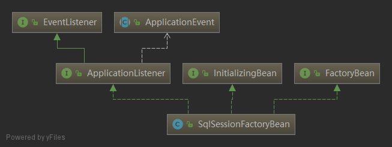

1、实现FactoryBean<SqlSessionFactory>接口，FactoryBean用于创建复杂对象时使用，通过getObject对外提供SqlSessionFactory实例。

2、实现InitializingBean，在spring启动初始化时执行`afterPropertiesSet()`方法。

### 1.2.3 SqlSessionFactoryBean#getObject

在一般的 MyBatis-Spring 用法中, 你不需要直接使用 SqlSessionFactoryBean 或和其对应的 SqlSessionFactory。相反,session 工厂将会被注入到 MapperFactoryBean 或其它扩 展了 SqlSessionDaoSupport 的 DAO中。 

通过FacotryBean.getObject提供DefaultSqlSessionFactory对象实例

返回之前创建的DefaultSqlSessionFactory，这里可以看到**DefaultSqlSessionFactory只会被初始化一次**。

SqlSessionFactoryBean#getObject

```java
@Override
public SqlSessionFactory getObject() throws Exception {
  if (this.sqlSessionFactory == null) {
    afterPropertiesSet();
  }

  return this.sqlSessionFactory;
}
```


### 1.2.4 afterPropertiesSet源码

初始化sqlSessionFactory，相当于，先组装和注册configuration，将configuration传给sqlSessionFactory ：

> sqlSessionFactory = new DefaultSqlSessionFactory(configuration);

```java
@Override
public void afterPropertiesSet() throws Exception {
  notNull(dataSource, "Property 'dataSource' is required");
  notNull(sqlSessionFactoryBuilder, "Property 'sqlSessionFactoryBuilder' is required");
  state((configuration == null && configLocation == null) || !(configuration != null && configLocation != null),
            "Property 'configuration' and 'configLocation' can not specified with together");

  this.sqlSessionFactory = buildSqlSessionFactory();
}
```


buildSqlSessionFactory

```java
/**
* Build a {@code SqlSessionFactory} instance.
*
* The default implementation uses the standard MyBatis {@code XMLConfigBuilder} API to build a
* {@code SqlSessionFactory} instance based on an Reader.
* Since 1.3.0, it can be specified a {@link Configuration} instance directly(without config file).
*
* @return SqlSessionFactory
* @throws IOException if loading the config file failed
*/
protected SqlSessionFactory buildSqlSessionFactory() throws IOException {

Configuration configuration;

XMLConfigBuilder xmlConfigBuilder = null;
if (this.configuration != null) {
  configuration = this.configuration;
  if (configuration.getVariables() == null) {
	configuration.setVariables(this.configurationProperties);
  } else if (this.configurationProperties != null) {
	configuration.getVariables().putAll(this.configurationProperties);
  }
} else if (this.configLocation != null) {
  xmlConfigBuilder = new XMLConfigBuilder(this.configLocation.getInputStream(), null, this.configurationProperties);
  configuration = xmlConfigBuilder.getConfiguration();
} 
//为configuration的属性赋值以及注册一些东西.....


if (xmlConfigBuilder != null) {
  try {
	//解析xml文件  
	xmlConfigBuilder.parse();
	//....	
}

if (this.transactionFactory == null) {
  this.transactionFactory = new SpringManagedTransactionFactory();
}

configuration.setEnvironment(new Environment(this.environment, this.transactionFactory, this.dataSource));

//<property name="mapperLocations" value="classpath*:com/paincupid/springmvc/persistence/*.xml" />
//解析*mapper.xml
if (!isEmpty(this.mapperLocations)) {
  for (Resource mapperLocation : this.mapperLocations) {
	if (mapperLocation == null) {
	  continue;
	}

	try {
      //XMLMapperBuilder解析*Mapper.xml文件中的标签...  
	  XMLMapperBuilder xmlMapperBuilder = new XMLMapperBuilder(mapperLocation.getInputStream(),
		  configuration, mapperLocation.toString(), configuration.getSqlFragments());
	  xmlMapperBuilder.parse();
	//....
  }
}

return this.sqlSessionFactoryBuilder.build(configuration);
}
```

### 1.2.5 创建DefaultSqlSessionFactory并返回SqlSessionFactory

```java
public SqlSessionFactory build(Configuration config) {
  return new DefaultSqlSessionFactory(config);
}
```


## 1.3 *Mapper.xml解析 XMLMapperBuilder#parse

XMLMapperBuilder#parse 入口类

```java
public void parse() {
  if (!configuration.isResourceLoaded(resource)) {
    configurationElement(parser.evalNode("/mapper")); //<----- 1.3.1
    configuration.addLoadedResource(resource);
    bindMapperForNamespace();//<----- 1.3.3
  }

  parsePendingResultMaps();
  parsePendingCacheRefs();
  parsePendingStatements();
}
```

### 1.3.1 XMLMapperBuilder#configurationElement

XMLMapperBuilder#configurationElement

```java
private void configurationElement(XNode context) {
  try {
    String namespace = context.getStringAttribute("namespace"); //得到namespace
    if (namespace == null || namespace.equals("")) {
      throw new BuilderException("Mapper's namespace cannot be empty");
    }
    builderAssistant.setCurrentNamespace(namespace);
    cacheRefElement(context.evalNode("cache-ref"));
    cacheElement(context.evalNode("cache"));
    parameterMapElement(context.evalNodes("/mapper/parameterMap"));
    //处理<resultMap>这类标签，然后再MapperBuilderAssistant类的addResultMap()方法中把每个ResultMap对象加到Configuration对象中的resultMaps属性中（中间会把<resultMap>标签中的每一个子标签封装成ResultMapping对象，然后封装成ResultMap对象，最后put到Configuration对象中，id规则为：namespace+<resultMap>的id属性 ）
    resultMapElements(context.evalNodes("/mapper/resultMap"));
    sqlElement(context.evalNodes("/mapper/sql"));
    buildStatementFromContext(context.evalNodes("select|insert|update|delete"));//<--------
  } catch (Exception e) {
    throw new BuilderException("Error parsing Mapper XML. Cause: " + e, e);
  }
}
```

XMLMapperBuilder#buildStatementFromContext

```java
private void buildStatementFromContext(List<XNode> list) {
  if (configuration.getDatabaseId() != null) {
    buildStatementFromContext(list, configuration.getDatabaseId());
  }
  buildStatementFromContext(list, null);
}
```

XMLMapperBuilder#buildStatementFromContext

```java
private void buildStatementFromContext(List<XNode> list, String requiredDatabaseId) {
  for (XNode context : list) {
    final XMLStatementBuilder statementParser = new XMLStatementBuilder(configuration, builderAssistant, context, requiredDatabaseId);
    try {
      statementParser.parseStatementNode();
    } catch (IncompleteElementException e) {
      configuration.addIncompleteStatement(statementParser);
    }
  }
}
```

XMLStatementBuilder#parseStatementNode 解析标签

```java
public void parseStatementNode() {
  String id = context.getStringAttribute("id");
  String databaseId = context.getStringAttribute("databaseId");

  if (!databaseIdMatchesCurrent(id, databaseId, this.requiredDatabaseId)) {
    return;
  }

  Integer fetchSize = context.getIntAttribute("fetchSize");
  Integer timeout = context.getIntAttribute("timeout");
  String parameterMap = context.getStringAttribute("parameterMap");
  String parameterType = context.getStringAttribute("parameterType");
  Class<?> parameterTypeClass = resolveClass(parameterType);
  String resultMap = context.getStringAttribute("resultMap");
  String resultType = context.getStringAttribute("resultType");
  String lang = context.getStringAttribute("lang");
  LanguageDriver langDriver = getLanguageDriver(lang);

  Class<?> resultTypeClass = resolveClass(resultType);
  String resultSetType = context.getStringAttribute("resultSetType");
  StatementType statementType = StatementType.valueOf(context.getStringAttribute("statementType", StatementType.PREPARED.toString()));
  ResultSetType resultSetTypeEnum = resolveResultSetType(resultSetType);

  String nodeName = context.getNode().getNodeName();
  SqlCommandType sqlCommandType = SqlCommandType.valueOf(nodeName.toUpperCase(Locale.ENGLISH));
  boolean isSelect = sqlCommandType == SqlCommandType.SELECT;
  boolean flushCache = context.getBooleanAttribute("flushCache", !isSelect);
  boolean useCache = context.getBooleanAttribute("useCache", isSelect);
  boolean resultOrdered = context.getBooleanAttribute("resultOrdered", false);

  // Include Fragments before parsing
  XMLIncludeTransformer includeParser = new XMLIncludeTransformer(configuration, builderAssistant);
  includeParser.applyIncludes(context.getNode());

  // Parse selectKey after includes and remove them.
  processSelectKeyNodes(id, parameterTypeClass, langDriver);
  
  // <----------------------  
  // Parse the SQL (pre: <selectKey> and <include> were parsed and removed)
  SqlSource sqlSource = langDriver.createSqlSource(configuration, context, parameterTypeClass);
  String resultSets = context.getStringAttribute("resultSets");
  String keyProperty = context.getStringAttribute("keyProperty");
  String keyColumn = context.getStringAttribute("keyColumn");
  KeyGenerator keyGenerator;
  String keyStatementId = id + SelectKeyGenerator.SELECT_KEY_SUFFIX;
  keyStatementId = builderAssistant.applyCurrentNamespace(keyStatementId, true);
  if (configuration.hasKeyGenerator(keyStatementId)) {
    keyGenerator = configuration.getKeyGenerator(keyStatementId);
  } else {
    keyGenerator = context.getBooleanAttribute("useGeneratedKeys",
        configuration.isUseGeneratedKeys() && SqlCommandType.INSERT.equals(sqlCommandType))
        ? Jdbc3KeyGenerator.INSTANCE : NoKeyGenerator.INSTANCE;
  }

  builderAssistant.addMappedStatement(id, sqlSource, statementType, sqlCommandType,
      fetchSize, timeout, parameterMap, parameterTypeClass, resultMap, resultTypeClass,
      resultSetTypeEnum, flushCache, useCache, resultOrdered, 
      keyGenerator, keyProperty, keyColumn, databaseId, langDriver, resultSets);
}
```

下面看：

> SqlSource sqlSource = langDriver.createSqlSource(configuration, context, parameterTypeClass);


### 1.3.2 XMLLanguageDriver
XMLLanguageDriver#createSqlSource

```java
@Override
public SqlSource createSqlSource(Configuration configuration, XNode script, Class<?> parameterType) {
  XMLScriptBuilder builder = new XMLScriptBuilder(configuration, script, parameterType);
  return builder.parseScriptNode();
}
```

XMLLanguageDriver#parseScriptNode

```java
public SqlSource parseScriptNode() {
  //解析动态标签比如if、foreach...每个动态标签都会有不同的handel去处理，如果动态标签嵌套动态标签的话，还会递归去调用parseDynamicTags(XNode node)方法，每一个标签封装成一个sqlNode  
  List<SqlNode> contents = parseDynamicTags(context);
  //封装一个MixedSqlNode对象，有一个apply方法，用户解析动态sql  
  MixedSqlNode rootSqlNode = new MixedSqlNode(contents);
  SqlSource sqlSource = null;
  if (isDynamic) {
    sqlSource = new DynamicSqlSource(configuration, rootSqlNode);
  } else {
    sqlSource = new RawSqlSource(configuration, rootSqlNode, parameterType);
  }
  return sqlSource;
}
```

到这里整个`configurationElement(XNode context)`方法就分析完了。 


### 1.3.3 XMLMapperBuilder#bindMapperForNamespace

```java
private void bindMapperForNamespace() {
  String namespace = builderAssistant.getCurrentNamespace();
  if (namespace != null) {
    Class<?> boundType = null;
    try {
      boundType = Resources.classForName(namespace);
    } catch (ClassNotFoundException e) {
      //ignore, bound type is not required
    }
    if (boundType != null) {
      if (!configuration.hasMapper(boundType)) {
        // Spring may not know the real resource name so we set a flag
        // to prevent loading again this resource from the mapper interface
        // look at MapperAnnotationBuilder#loadXmlResource
        configuration.addLoadedResource("namespace:" + namespace);
        configuration.addMapper(boundType);
      }
    }
  }
}
```

看代码`configuration.addMapper(boundType);`

### 1.3.4 configuration#addMapper#

将MapperProxyFactory放到knownMappers，后面会通过MapperRegistry#getMapper重新取出来，可以看1.5.5 getObject时取。knownMappers里面放的都是自己工程中的*Mapper.xml

```java
public <T> void addMapper(Class<T> type) {
  mapperRegistry.addMapper(type);
}
```

MapperRegistry#addMapper

```java
public <T> void addMapper(Class<T> type) {
  if (type.isInterface()) {
    if (hasMapper(type)) {
      throw new BindingException("Type " + type + " is already known to the MapperRegistry.");
    }
    boolean loadCompleted = false;
    try {
      // 将MapperProxyFactory放到knownMappers，后面会通过MapperRegistry#getMapper重新取出来，可以看1.5.5 getObject时取。
      knownMappers.put(type, new MapperProxyFactory<T>(type)); 
      // It's important that the type is added before the parser is run
      // otherwise the binding may automatically be attempted by the
      // mapper parser. If the type is already known, it won't try.
      MapperAnnotationBuilder parser = new MapperAnnotationBuilder(config, type);
      parser.parse();
      loadCompleted = true;
    } finally {
      if (!loadCompleted) {
        knownMappers.remove(type);
      }
    }
  }
}
```


## 1.4 通过MapperScannerConfigurer，将*mapper.java注入到spring容器中

### 1.4.1 MapperScannerConfigurer作用

将*mapper.java注入到spring容器中，在组装mapper的BeanDefinition的时候，会将`sqlSessionFactory`、`sqlSessionTemplate`一起放到BeanDefinition中。


### 1.4.2 MapperScannerConfigurer继承关系

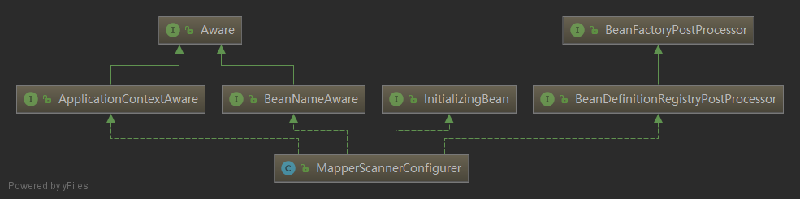

1、实现`postProcessBeanDefinitionRegistry`接口，它实际是一个`BeanFactoryPostProcessor`，它会调用`BeanDefinitionRegistryPostProcessor.postProcessBeanDefinitionRegistry(BeanDefinitionRegistry registry)`方法。

2、实现`InitializingBean`，调用`afterPropertiesSet()`，在`MapperScannerConfigurer`中，只是用它用做校验

```java
@Override
public void afterPropertiesSet() throws Exception {
  notNull(this.basePackage, "Property 'basePackage' is required");
}
```

3、实现`ApplicationContextAware`接口，执行ApplicationContextAware.setApplicationContext(ApplicationContext applicationContext)`方法。用于将applicationContext传过来。

```java
@Override
public void setApplicationContext(ApplicationContext applicationContext) {
  this.applicationContext = applicationContext;
}
```

4、实现`BeanNameAware` 接口，为bean命名

```java
@Override
public void setBeanName(String name) {
    this.beanName = name;
}
```

这里主要看`postProcessBeanDefinitionRegistry`方法


### 1.4.3 postProcessBeanDefinitionRegistry源码

```java
@Override
public void postProcessBeanDefinitionRegistry(BeanDefinitionRegistry registry) {
  if (this.processPropertyPlaceHolders) {
    processPropertyPlaceHolders();
  }

  ClassPathMapperScanner scanner = new ClassPathMapperScanner(registry);
  scanner.setAddToConfig(this.addToConfig);
  scanner.setAnnotationClass(this.annotationClass);
  scanner.setMarkerInterface(this.markerInterface);
  scanner.setSqlSessionFactory(this.sqlSessionFactory);
  scanner.setSqlSessionTemplate(this.sqlSessionTemplate);
  scanner.setSqlSessionFactoryBeanName(this.sqlSessionFactoryBeanName);
  scanner.setSqlSessionTemplateBeanName(this.sqlSessionTemplateBeanName);
  scanner.setResourceLoader(this.applicationContext);
  scanner.setBeanNameGenerator(this.nameGenerator);
  scanner.registerFilters();
  //<------  
  scanner.scan(StringUtils.tokenizeToStringArray(this.basePackage, ConfigurableApplicationContext.CONFIG_LOCATION_DELIMITERS));
}
```

ClassPathMapperScanner#scan

```java
public int scan(String... basePackages) {
   int beanCountAtScanStart = this.registry.getBeanDefinitionCount();

   doScan(basePackages);

   // Register annotation config processors, if necessary.
   //如果有注解，也一起注册到容器中 
   if (this.includeAnnotationConfig) {
      AnnotationConfigUtils.registerAnnotationConfigProcessors(this.registry);
   }

   return (this.registry.getBeanDefinitionCount() - beanCountAtScanStart);
}
```

ClassPathMapperScanner#doScan
```java
public Set<BeanDefinitionHolder> doScan(String... basePackages) {
  //会调用父类的ClassPathBeanDefinitionScanner。doScan方法 <-----
  Set<BeanDefinitionHolder> beanDefinitions = super.doScan(basePackages);

  if (beanDefinitions.isEmpty()) {
    logger.warn("No MyBatis mapper was found in '" + Arrays.toString(basePackages) + "' package. Please check your configuration.");
  } else {
    //<-----
    processBeanDefinitions(beanDefinitions);
  }
  return beanDefinitions;
}
```

> public class ClassPathMapperScanner extends ClassPathBeanDefinitionScanner

`ClassPathBeanDefinitionScanner`是`spring-context`包下的类，直接使用spring的类去进行*mapper.java的注册。
`ClassPathBeanDefinitionScanner`的包全路径为：
org.springframework.context.annotation.ClassPathBeanDefinitionScanner

ClassPathBeanDefinitionScanner#doScan源码
```java
protected Set<BeanDefinitionHolder> doScan(String... basePackages) {
   Assert.notEmpty(basePackages, "At least one base package must be specified");
   Set<BeanDefinitionHolder> beanDefinitions = new LinkedHashSet<BeanDefinitionHolder>();
   for (String basePackage : basePackages) {
      Set<BeanDefinition> candidates = findCandidateComponents(basePackage);
      for (BeanDefinition candidate : candidates) {
         ScopeMetadata scopeMetadata = this.scopeMetadataResolver.resolveScopeMetadata(candidate);
         candidate.setScope(scopeMetadata.getScopeName());
         String beanName = this.beanNameGenerator.generateBeanName(candidate, this.registry);
         if (candidate instanceof AbstractBeanDefinition) {
            postProcessBeanDefinition((AbstractBeanDefinition) candidate, beanName);
         }
         if (candidate instanceof AnnotatedBeanDefinition) {
            AnnotationConfigUtils.processCommonDefinitionAnnotations((AnnotatedBeanDefinition) candidate);
         }
         if (checkCandidate(beanName, candidate)) {
            BeanDefinitionHolder definitionHolder = new BeanDefinitionHolder(candidate, beanName);
            definitionHolder = AnnotationConfigUtils.applyScopedProxyMode(scopeMetadata, definitionHolder, this.registry);
            beanDefinitions.add(definitionHolder);
            registerBeanDefinition(definitionHolder, this.registry);
         }
      }
   }
   return beanDefinitions;
}
```

这里只看一下`doScan()`的结果。`Set<BeanDefinitionHolder> beanDefinitions`断点，我们可以看到包扫描得的mapper，当然现在还是beanDefinition的形式。

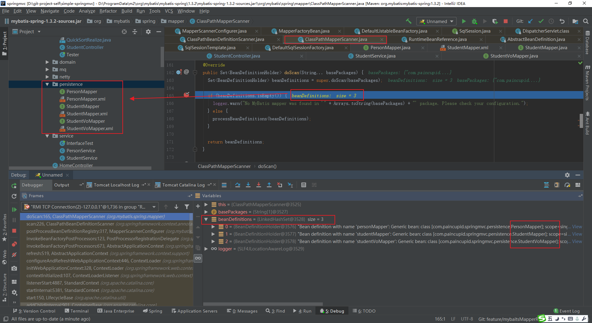

`processBeanDefinitions`方法

#### ClassPathMapperScanner#processBeanDefinitions作用是重新组装BeanDefinitions

1、将`MapperFactoryBean`放到`beanDefinitions`。将`beanDefinitions`的`beanClass`设置为`MapperFactoryBean`。mapper接口是原始的bean，但`MapperFactoryBean`是真正的bean。也就是说注册到spring容器中的是`MapperFactoryBean`。

> the mapper interface is the original class of the bean. but, the actual class of the bean is MapperFactoryBean 

2、将`sqlSessionFactory`放到`beanDefinitions`

3、将`sqlSessionTemplate`放到`beanDefinitions`

```java
private void processBeanDefinitions(Set<BeanDefinitionHolder> beanDefinitions) {
  GenericBeanDefinition definition;
  for (BeanDefinitionHolder holder : beanDefinitions) {
    definition = (GenericBeanDefinition) holder.getBeanDefinition();

    // the mapper interface is the original class of the bean
    // but, the actual class of the bean is MapperFactoryBean 
    definition.getConstructorArgumentValues().addGenericArgumentValue(definition.getBeanClassName()); // issue #59
    //实际类为 MapperFactoryBean  <------------
    definition.setBeanClass(this.mapperFactoryBean.getClass());

    definition.getPropertyValues().add("addToConfig", this.addToConfig);

    boolean explicitFactoryUsed = false;
    if (StringUtils.hasText(this.sqlSessionFactoryBeanName)) {
      //注册sqlSessionFactory <---------    
      definition.getPropertyValues().add("sqlSessionFactory", new RuntimeBeanReference(this.sqlSessionFactoryBeanName));
      explicitFactoryUsed = true;
    } else if (this.sqlSessionFactory != null) {
      //注册sqlSessionFactory <---------  
      definition.getPropertyValues().add("sqlSessionFactory", this.sqlSessionFactory);
      explicitFactoryUsed = true;
    }

    if (StringUtils.hasText(this.sqlSessionTemplateBeanName)) {
      //注册 sqlSessionTemplate <-------------  
      definition.getPropertyValues().add("sqlSessionTemplate", new RuntimeBeanReference(this.sqlSessionTemplateBeanName));
      explicitFactoryUsed = true;
    } else if (this.sqlSessionTemplate != null) {
      //注册 sqlSessionTemplate <-------------
      definition.getPropertyValues().add("sqlSessionTemplate", this.sqlSessionTemplate);
      explicitFactoryUsed = true;
    }

    if (!explicitFactoryUsed) {
      //将beanDefinition设为按类型注入
      definition.setAutowireMode(AbstractBeanDefinition.AUTOWIRE_BY_TYPE);
    }
  }
}
```


## 1.5 调用MapperFactoryBean#getObject

在将`**Mapper`变成`MapperFactoryBean`组装成`beanDefinition`注册到容器beanFactory容器后，会继续执行spring的`refresh()`中的`finishBeanFactoryInitialization`方法，此方法的作用是：完成spring上下文的初始化，初始化beanFactory剩余的单例bean。这时，会实例化`MapperFactoryBean`。

### 1.5.1 `MapperFactoryBean`的继承结构

`MapperFactoryBean`也是一个FactoryBean，并且间接实现了InitializingBean接口。


`DaoSupport.afterPropertiesSet()`

此处用模板板式，2个抽象方法：`checkDaoConfig()`和`initDao()`，先执行`checkDaoConfig()`，后执行`initDao()`

```java
@Override
public final void afterPropertiesSet() throws IllegalArgumentException, BeanInitializationException {
   // Let abstract subclasses check their configuration.
   checkDaoConfig();

   // Let concrete implementations initialize themselves.
   try {
      initDao();
   }
   catch (Exception ex) {
      throw new BeanInitializationException("Initialization of DAO failed", ex);
   }
}
protected abstract void checkDaoConfig() throws IllegalArgumentException;

protected void initDao() throws Exception {}
```

### 1.5.2 SqlSessionTemplate初始化

**SqlSessionTemplate，是spring连接mybatis的模板类，是由spring负责生成的**

`MapperFactoryBean`继承`SqlSessionDaoSupport`，`SqlSessionDaoSupport`使用构造函数，创建`SqlSessionTemplate`对象，并将它保存到`sqlSession`属性中。

```java
public void setSqlSessionFactory(SqlSessionFactory sqlSessionFactory) {
  if (!this.externalSqlSession) {
    this.sqlSession = new SqlSessionTemplate(sqlSessionFactory);
  }
}
```

SqlSessionTemplate 3个构造函数调用过程

```java
public SqlSessionTemplate(SqlSessionFactory sqlSessionFactory) {
  this(sqlSessionFactory, sqlSessionFactory.getConfiguration().getDefaultExecutorType());
}
```

```java
public SqlSessionTemplate(SqlSessionFactory sqlSessionFactory, ExecutorType executorType) {
  this(sqlSessionFactory, executorType,
      new MyBatisExceptionTranslator(
          sqlSessionFactory.getConfiguration().getEnvironment().getDataSource(), true));
}
```
在SqlSessionTemplate初始化的时候，就将拦截器`SqlSessionInterceptor`放进去。
```java
public SqlSessionTemplate(SqlSessionFactory sqlSessionFactory, ExecutorType executorType,
    PersistenceExceptionTranslator exceptionTranslator) {

  notNull(sqlSessionFactory, "Property 'sqlSessionFactory' is required");
  notNull(executorType, "Property 'executorType' is required");

  this.sqlSessionFactory = sqlSessionFactory;
  this.executorType = executorType;
  this.exceptionTranslator = exceptionTranslator;
  this.sqlSessionProxy = (SqlSession) newProxyInstance(
      SqlSessionFactory.class.getClassLoader(),
      new Class[] { SqlSession.class },
      new SqlSessionInterceptor());
}
```


### 1.5.3 实例化栈信息打印(创建MapperFactoryBean)

如下图所示：

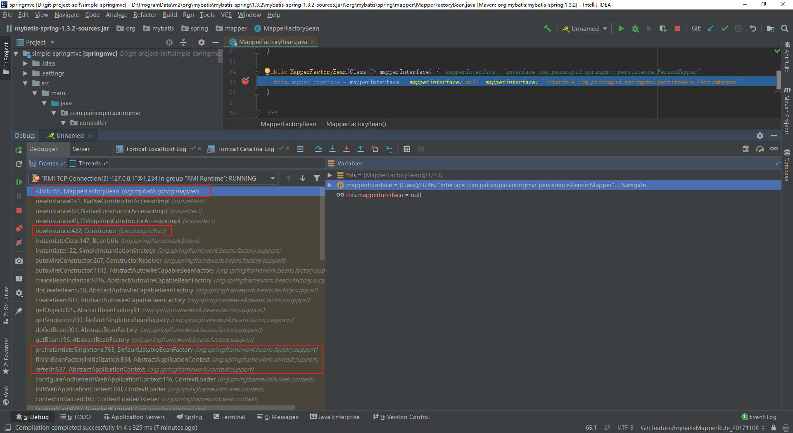

可以看到最后是通过反射，调用构造函数来实现`MapperFactoryBean`的实例化。

看一下`java.lang.reflect.Constructor.newInstance()`

```java
public T newInstance(Object ... initargs)
    throws InstantiationException, IllegalAccessException,
           IllegalArgumentException, InvocationTargetException
{
    //......
    ConstructorAccessor ca = constructorAccessor;   // read volatile
    if (ca == null) {
        ca = acquireConstructorAccessor();
    }
    @SuppressWarnings("unchecked")
    T inst = (T) ca.newInstance(initargs);
    return inst;
}
```

这些执行步骤只是用反射把对象new出来，但还没有完成对象实例，下面还会进行对象的初始化。


### 1.5.4 初始化栈信息，即调用MapperFactoryBean#getObject的栈过程

```java
public T getObject() throws Exception {
  return getSqlSession().getMapper(this.mapperInterface); //getSqlSession()是SqlSessionTemplate
}
```

备注：getSqlSession()`是`SqlSessionTemplate, 上面已讲了SqlSessionTemplate的初始化。

```txt
newInstance:47, MapperProxyFactory (org.apache.ibatis.binding)
newInstance:52, MapperProxyFactory (org.apache.ibatis.binding)
getMapper:50, MapperRegistry (org.apache.ibatis.binding)
getMapper:732, Configuration (org.apache.ibatis.session)
getMapper:318, SqlSessionTemplate (org.mybatis.spring)
getObject:95, MapperFactoryBean (org.mybatis.spring.mapper)
doGetObjectFromFactoryBean:168, FactoryBeanRegistrySupport (org.springframework.beans.factory.support)
getObjectFromFactoryBean:103, FactoryBeanRegistrySupport (org.springframework.beans.factory.support)
getObjectForBeanInstance:1574, AbstractBeanFactory (org.springframework.beans.factory.support)
doGetBean:253, AbstractBeanFactory (org.springframework.beans.factory.support)
getBean:201, AbstractBeanFactory (org.springframework.beans.factory.support)
doGetBean:274, AbstractBeanFactory (org.springframework.beans.factory.support)
getBean:196, AbstractBeanFactory (org.springframework.beans.factory.support)
findAutowireCandidates:1145, DefaultListableBeanFactory (org.springframework.beans.factory.support)
doResolveDependency:1069, DefaultListableBeanFactory (org.springframework.beans.factory.support)
resolveDependency:967, DefaultListableBeanFactory (org.springframework.beans.factory.support)
inject:543, AutowiredAnnotationBeanPostProcessor$AutowiredFieldElement (org.springframework.beans.factory.annotation)
inject:88, InjectionMetadata (org.springframework.beans.factory.annotation)
postProcessPropertyValues:331, AutowiredAnnotationBeanPostProcessor (org.springframework.beans.factory.annotation)
populateBean:1214, AbstractAutowireCapableBeanFactory (org.springframework.beans.factory.support)
doCreateBean:543, AbstractAutowireCapableBeanFactory (org.springframework.beans.factory.support)
createBean:482, AbstractAutowireCapableBeanFactory (org.springframework.beans.factory.support)
getObject:305, AbstractBeanFactory$1 (org.springframework.beans.factory.support)
getSingleton:230, DefaultSingletonBeanRegistry (org.springframework.beans.factory.support)
doGetBean:301, AbstractBeanFactory (org.springframework.beans.factory.support)
getBean:196, AbstractBeanFactory (org.springframework.beans.factory.support)
findAutowireCandidates:1145, DefaultListableBeanFactory (org.springframework.beans.factory.support)
doResolveDependency:1069, DefaultListableBeanFactory (org.springframework.beans.factory.support)
resolveDependency:967, DefaultListableBeanFactory (org.springframework.beans.factory.support)
inject:543, AutowiredAnnotationBeanPostProcessor$AutowiredFieldElement (org.springframework.beans.factory.annotation)
inject:88, InjectionMetadata (org.springframework.beans.factory.annotation)
postProcessPropertyValues:331, AutowiredAnnotationBeanPostProcessor (org.springframework.beans.factory.annotation)
populateBean:1214, AbstractAutowireCapableBeanFactory (org.springframework.beans.factory.support)
doCreateBean:543, AbstractAutowireCapableBeanFactory (org.springframework.beans.factory.support)
createBean:482, AbstractAutowireCapableBeanFactory (org.springframework.beans.factory.support)
getObject:305, AbstractBeanFactory$1 (org.springframework.beans.factory.support)
getSingleton:230, DefaultSingletonBeanRegistry (org.springframework.beans.factory.support)
doGetBean:301, AbstractBeanFactory (org.springframework.beans.factory.support)
getBean:196, AbstractBeanFactory (org.springframework.beans.factory.support)
preInstantiateSingletons:772, DefaultListableBeanFactory (org.springframework.beans.factory.support)
finishBeanFactoryInitialization:834, AbstractApplicationContext (org.springframework.context.support)
```


在调用过程中，我们可以看一下

AbstractBeanFactory#getObjectForBeanInstance 如果是普通beanInstance或者beanName前有&符号，则返回它；如果是FactoryBean类型的实例，则返回FactoryBean.getObject。

```java
protected Object getObjectForBeanInstance(
      Object beanInstance, String name, String beanName, RootBeanDefinition mbd) {

   // Don't let calling code try to dereference the factory if the bean isn't a factory.
   if (BeanFactoryUtils.isFactoryDereference(name) && !(beanInstance instanceof FactoryBean)) {
      throw new BeanIsNotAFactoryException(transformedBeanName(name), beanInstance.getClass());
   }

   // Now we have the bean instance, which may be a normal bean or a FactoryBean.
   // If it's a FactoryBean, we use it to create a bean instance, unless the
   // caller actually wants a reference to the factory.
   // <-------------- 
   if (!(beanInstance instanceof FactoryBean) || BeanFactoryUtils.isFactoryDereference(name)) {
      return beanInstance;
   }

   Object object = null;
   if (mbd == null) {
      object = getCachedObjectForFactoryBean(beanName);
   }
   if (object == null) {
      // Return bean instance from factory.
      FactoryBean<?> factory = (FactoryBean<?>) beanInstance;
      // Caches object obtained from FactoryBean if it is a singleton.
      if (mbd == null && containsBeanDefinition(beanName)) {
         mbd = getMergedLocalBeanDefinition(beanName);
      }
      boolean synthetic = (mbd != null && mbd.isSynthetic());
      object = getObjectFromFactoryBean(factory, beanName, !synthetic);
   }
   return object;
}
```

看一下BeanFactoryUtils.isFactoryDereference源码：

```java
public static boolean isFactoryDereference(String name) {
   //String FACTORY_BEAN_PREFIX = "&"; 
   return (name != null && name.startsWith(BeanFactory.FACTORY_BEAN_PREFIX));
}
```


FactoryBeanRegistrySupport#doGetObjectFromFactoryBean，会调用FactoryBean.getObject方法。

```java
/**
 * Obtain an object to expose from the given FactoryBean.
 * @param factory the FactoryBean instance
 * @param beanName the name of the bean
 * @return the object obtained from the FactoryBean
 * @throws BeanCreationException if FactoryBean object creation failed
 * @see org.springframework.beans.factory.FactoryBean#getObject()
 */
private Object doGetObjectFromFactoryBean(final FactoryBean<?> factory, final String beanName)
      throws BeanCreationException {

   Object object;
   try {
      if (System.getSecurityManager() != null) {
         AccessControlContext acc = getAccessControlContext();
         try {
            object = AccessController.doPrivileged(new PrivilegedExceptionAction<Object>() {
               @Override
               public Object run() throws Exception {
                     return factory.getObject();
                  }
               }, acc);
         }
         catch (PrivilegedActionException pae) {
            throw pae.getException();
         }
      }
      else {
         object = factory.getObject();
      }
   }
   // ...
   return object;
}
```


### 1.5.5 getObject内容分析

```java
public T getObject() throws Exception {
  return getSqlSession().getMapper(this.mapperInterface); //getSqlSession()是SqlSessionTemplate
}
```

`getSqlSession()`是`SqlSessionTemplate`

是SqlSessionTemplate#getMapper

```java
public class SqlSessionTemplate implements SqlSession, DisposableBean {

  private final SqlSessionFactory sqlSessionFactory;
  private final ExecutorType executorType;
  private final SqlSession sqlSessionProxy;
  private final PersistenceExceptionTranslator exceptionTranslator;
    
  @Override
  public <T> T getMapper(Class<T> type) {
    return getConfiguration().getMapper(type, this);
  }
}
```

`getConfiguration()`

```java
@Override
public Configuration getConfiguration() {
  return this.sqlSessionFactory.getConfiguration();
}
```

sqlSessionFactory的值为：DefaultSqlSessionFactory

`DefaultSqlSessionFactory`是`SqlSessionFactory`的实现类。前面springmvc配置xml文件中的`org.mybatis.spring.SqlSessionFactoryBean`，就是用来产生`SqlSessionFactory`，在`SqlSessionFactoryBean`。getObject()`的时候，就会返回一个`DefaultSqlSessionFactory`。

Configuration#getMapper

```java
public <T> T getMapper(Class<T> type, SqlSession sqlSession) {
  return mapperRegistry.getMapper(type, sqlSession);
}
```


MapperRegistry#getMapper

```java
public class MapperRegistry {
  private final Configuration config;
  private final Map<Class<?>, MapperProxyFactory<?>> knownMappers = new HashMap<Class<?>, MapperProxyFactory<?>>();

  public MapperRegistry(Configuration config) {
    this.config = config;
  }
    
    public <T> T getMapper(Class<T> type, SqlSession sqlSession) {
      final MapperProxyFactory<T> mapperProxyFactory = (MapperProxyFactory<T>) knownMappers.get(type);
      if (mapperProxyFactory == null) {
        throw new BindingException("Type " + type + " is not known to the MapperRegistry.");
      }
      try {
        return mapperProxyFactory.newInstance(sqlSession);
      } catch (Exception e) {
        throw new BindingException("Error getting mapper instance. Cause: " + e, e);
      }
    }
    
}
```

knownMappers会缓存所有的 *Mapper。此时knownMappers， size = 3里面存的是：

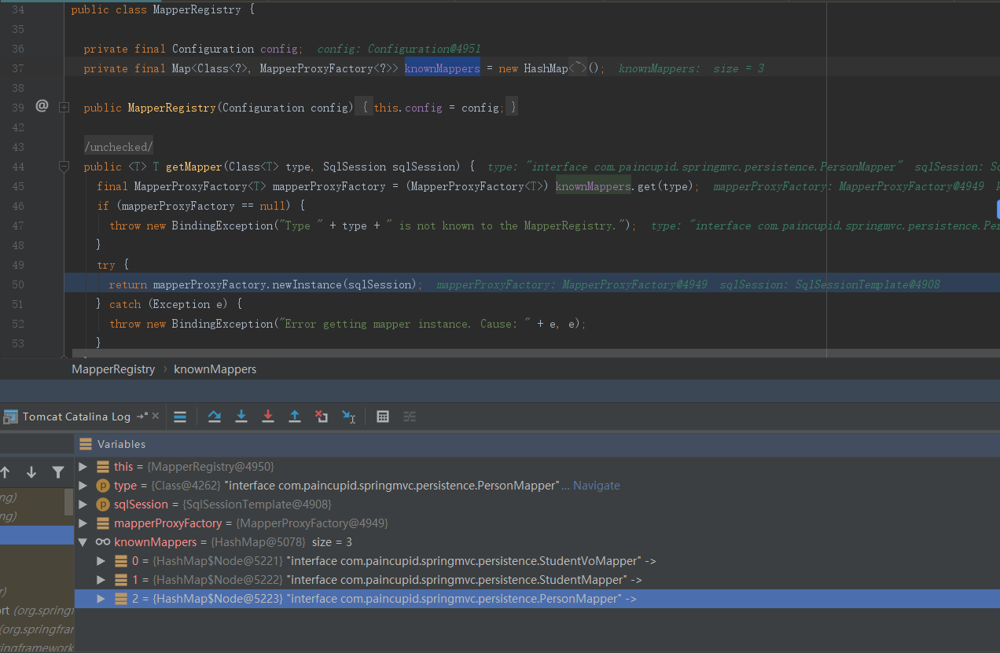


MapperProxyFactory#newInstance 通过代理工厂来创建实例。

```java
protected T newInstance(MapperProxy<T> mapperProxy) {
  return (T) Proxy.newProxyInstance(mapperInterface.getClassLoader(), new Class[] { mapperInterface }, mapperProxy);
}

public T newInstance(SqlSession sqlSession) {
  final MapperProxy<T> mapperProxy = new MapperProxy<T>(sqlSession, mapperInterface, methodCache);
  return newInstance(mapperProxy);
}
```

此处 mapperInterface = interface com.paincupid.springmvc.persistence.PersonMapper

后由`MapperProxy`代理`*Mapper`执行，上面返回Mapper的代理类实例`mapperProxy`，在执行时，通过JDK来执行`MapperProxy.invoke`方法。最后getObject得到的是`MapperProxy`。


# 二、调用前的拦截器工作

---------------

## 2.1 简介做准备工作

1、`SqlSessionInterceptor`代理了`SqlSessionTemplate`。在创建`MapperFactoryBean`时，通过构造函数就会创建`SqlSessionInterceptor`，所以在执行`SqlSessionTemplate`时，会被`SqlSessionInterceptor`拦截，然后执行时，真正是通过`DefaultSqlSession`执行。

2、`DefaultSqlSession`持有执行器、configuration。事务保存在执行器中，由执行器执行查询操作。


## 2.2 SqlSessionTemplate创建时，加入拦截器SqlSessionInterceptor


```java
public SqlSessionTemplate(SqlSessionFactory sqlSessionFactory, ExecutorType executorType,
    PersistenceExceptionTranslator exceptionTranslator) {

  notNull(sqlSessionFactory, "Property 'sqlSessionFactory' is required");
  notNull(executorType, "Property 'executorType' is required");

  this.sqlSessionFactory = sqlSessionFactory;
  this.executorType = executorType;
  this.exceptionTranslator = exceptionTranslator;
  this.sqlSessionProxy = (SqlSession) newProxyInstance(
      SqlSessionFactory.class.getClassLoader(),
      new Class[] { SqlSession.class },
      new SqlSessionInterceptor());
}
```


## 2.3 SqlSessionIntercepteor 

托管流程：spring创建了SqlSessionTemplate，在创建SqlSessionTemplate的时候提供了方法拦截器 SqlSessionInterceptor；SqlSessionTemplate实现了SqlSession接口，所以SqlSessionInterceptor会对SqlSessionTemplate中所有SqlSession接口定义的方法进行拦截；也就是说，整合spring之后的crud操作都会经过SqlSessionTemplate类，并且所有crud方法会被SqlSessionInterceptor拦截；最终SqlSessionTemplate通过代理拦截，并且通过SqlSessionHolder实现的sqlsession线程安全和自动新建和释放连接。 


使用JDK动态代理，`SqlSessionInterceptor`实现InvocationHandler`接口，在`SqlSessionTemplate`类中，源码如下：

```java
/**
 * Proxy needed to route MyBatis method calls to the proper SqlSession got
 * from Spring's Transaction Manager
 * It also unwraps exceptions thrown by {@code Method#invoke(Object, Object...)} to
 * pass a {@code PersistenceException} to the {@code PersistenceExceptionTranslator}.
 */
private class SqlSessionInterceptor implements InvocationHandler {
  @Override
  public Object invoke(Object proxy, Method method, Object[] args) throws Throwable {
    //getSqlSession很重要，创建了DefaultSqlSession、事务、执行器。事务保存在执行器中，  DefaultSqlSession持有执行器、configuration
    SqlSession sqlSession =getSqlSession(
        SqlSessionTemplate.this.sqlSessionFactory,
        SqlSessionTemplate.this.executorType,
        SqlSessionTemplate.this.exceptionTranslator);
    try {
      //通过sqlSession对象执行真正的crud操作  
      Object result = method.invoke(sqlSession, args);
      if (!isSqlSessionTransactional(sqlSession, SqlSessionTemplate.this.sqlSessionFactory)) {
        // force commit even on non-dirty sessions because some databases require
        // a commit/rollback before calling close()
        sqlSession.commit(true);
      }
      return result;
    } catch (Throwable t) {
      Throwable unwrapped = unwrapThrowable(t);
      if (SqlSessionTemplate.this.exceptionTranslator != null && unwrapped instanceof PersistenceException) {
        // release the connection to avoid a deadlock if the translator is no loaded. See issue #22
        closeSqlSession(sqlSession, SqlSessionTemplate.this.sqlSessionFactory);
        sqlSession = null;
        Throwable translated = SqlSessionTemplate.this.exceptionTranslator.translateExceptionIfPossible((PersistenceException) unwrapped);
        if (translated != null) {
          unwrapped = translated;
        }
      }
      throw unwrapped;
    } finally {
      if (sqlSession != null) {
        closeSqlSession(sqlSession, SqlSessionTemplate.this.sqlSessionFactory);
      }
    }
  }
}
```

## 2.3 SqlSession

### 2.3.1 SqlSession类继承结构

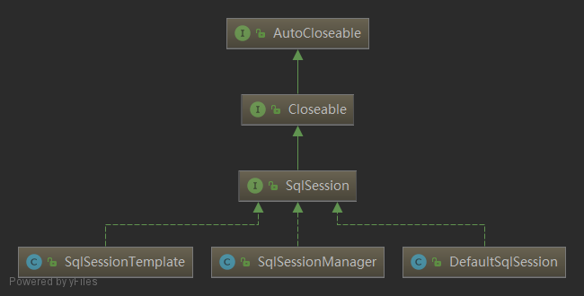

### 2.3.2 DefaultSqlSession

上面的getSession，得到的是DefaultSqlSession。事务保存在执行器中，  DefaultSqlSession持有执行器、configuration

```java
public class DefaultSqlSession implements SqlSession {

  private Configuration configuration;
  private Executor executor;

  private boolean autoCommit;
  private boolean dirty;
  private List<Cursor<?>> cursorList;

  public DefaultSqlSession(Configuration configuration, Executor executor, boolean autoCommit) {
    this.configuration = configuration;
    this.executor = executor;
    this.dirty = false;
    this.autoCommit = autoCommit;
  }
}
```


### 2.3.3 SqlSessionUtils#getSqlSession

```java
/**
 * Gets an SqlSession from Spring Transaction Manager or creates a new one if needed.
 * Tries to get a SqlSession out of current transaction. If there is not any, it creates a new one.
 * Then, it synchronizes the SqlSession with the transaction if Spring TX is active and
 * <code>SpringManagedTransactionFactory</code> is configured as a transaction manager.
 *
 * @param sessionFactory a MyBatis {@code SqlSessionFactory} to create new sessions
 * @param executorType The executor type of the SqlSession to create
 * @param exceptionTranslator Optional. Translates SqlSession.commit() exceptions to Spring exceptions.
 * @throws TransientDataAccessResourceException if a transaction is active and the
 *             {@code SqlSessionFactory} is not using a {@code SpringManagedTransactionFactory}
 * @see SpringManagedTransactionFactory
 */
public static SqlSession getSqlSession(SqlSessionFactory sessionFactory, ExecutorType executorType, PersistenceExceptionTranslator exceptionTranslator) {

  notNull(sessionFactory, NO_SQL_SESSION_FACTORY_SPECIFIED);
  notNull(executorType, NO_EXECUTOR_TYPE_SPECIFIED);

  SqlSessionHolder holder = (SqlSessionHolder) TransactionSynchronizationManager.getResource(sessionFactory);

  SqlSession session = sessionHolder(executorType, holder);
  if (session != null) {
    return session;
  }

  if (LOGGER.isDebugEnabled()) {
    LOGGER.debug("Creating a new SqlSession");
  }

  session = sessionFactory.openSession(executorType); //new DefaultSqlSession <-----

  registerSessionHolder(sessionFactory, executorType, exceptionTranslator, session);

  return session;
}
```


## 2.3 DefaultSqlSessionFactory创建事务、SqlSession、Executor

在执行`openSessionFromDataSource()`时，会创建

1、执行器`Executor executor = configuration.newExecutor(tx, execType);`

2、创建SqlSession：`new DefaultSqlSession(configuration, executor, autoCommit);`

3、创建Transaction ：`tx = transactionFactory.newTransaction(environment.getDataSource(), level, autoCommit);`

DefaultSqlSessionFactory#openSession

`openSession`创建了DefaultSqlSession、事务、执行器。事务保存在执行器中，  DefaultSqlSession持有执行器、configuration

```java
@Override
public SqlSession openSession(ExecutorType execType) {
  return openSessionFromDataSource(execType, null, false);
}
```

```java
private SqlSession openSessionFromDataSource(ExecutorType execType, TransactionIsolationLevel level, boolean autoCommit) {
  Transaction tx = null;
  try {
    final Environment environment = configuration.getEnvironment();
    final TransactionFactory transactionFactory = getTransactionFactoryFromEnvironment(environment);
    //创建事务  
    tx = transactionFactory.newTransaction(environment.getDataSource(), level, autoCommit);
    //创建执行器  
    final Executor executor = configuration.newExecutor(tx, execType);
    return new DefaultSqlSession(configuration, executor, autoCommit); // <-----------
  } catch (Exception e) {
    closeTransaction(tx); // may have fetched a connection so lets call close()
    throw ExceptionFactory.wrapException("Error opening session.  Cause: " + e, e);
  } finally {
    ErrorContext.instance().reset();
  }
}
```

`configuration.newExecutor(tx, execType);`根据类型创建执行器。

## 2.4 Executor执行器介绍

Executor是MyBatis执行器，是MyBatis 调度的核心，负责SQL语句的生成和查询缓存的维护 。

Configuration#newExecutor 会根据`ExecutorType`创建不同的`Executor`: `SimpleExecutor`、`BatchExecutor`、`ReuseExecutor`

Executor代表执行器，他来调度StatementHandler、ParameterHandler、ResultHandler等来执行SQL； 

Configuration#newExecutor 

```java
public Executor newExecutor(Transaction transaction, ExecutorType executorType) {
  executorType = executorType == null ? defaultExecutorType : executorType;
  executorType = executorType == null ? ExecutorType.SIMPLE : executorType;
  Executor executor;
  if (ExecutorType.BATCH == executorType) {
    executor = new BatchExecutor(this, transaction);
  } else if (ExecutorType.REUSE == executorType) {
    executor = new ReuseExecutor(this, transaction);
  } else {
    executor = new SimpleExecutor(this, transaction);
  }
  if (cacheEnabled) {
    //new CachingExecutor, 在本例中，executor = new SimpleExecutor 所以后面调用的是先是CachingExecutor，后是SimpleExecutor。
    executor = new CachingExecutor(executor);
  }
  //可追加拦截器  
  executor = (Executor) interceptorChain.pluginAll(executor);
  return executor;
}
```

在本例中，`executor = new SimpleExecutor` 所以后面调用的是先是`CachingExecutor`，后是`SimpleExecutor`。


` executor = (Executor)   interceptorChain .pluginAll(executor);`表明可追加拦截器。

用户可以自定义拦截器，可以实现Interceptor接口，然后封装插件，比如分页插件。 

```java
public class InterceptorChain {

  private final List<Interceptor> interceptors = new ArrayList<Interceptor>();

  public Object pluginAll(Object target) {
    for (Interceptor interceptor : interceptors) {
      target = interceptor.plugin(target);
    }
    return target;
  }

  public void addInterceptor(Interceptor interceptor) {
    interceptors.add(interceptor);
  }
  
  public List<Interceptor> getInterceptors() {
    return Collections.unmodifiableList(interceptors);
  }

}
```


### 2.4.1 SimpleExecutor类结构

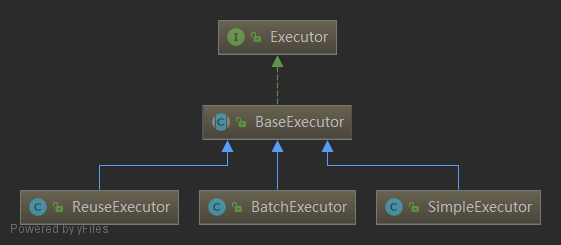

SimpleExecutor#doQuery

这个和传统的JDBC调用就没什么区别了，先建立链接，再创建Statement，然后再执行，最后返回结果集。

```java
@Override
public <E> List<E> doQuery(MappedStatement ms, Object parameter, RowBounds rowBounds, ResultHandler resultHandler, BoundSql boundSql) throws SQLException {
  Statement stmt = null;
  try {
    Configuration configuration = ms.getConfiguration();
    //创建Statement  
    StatementHandler handler = configuration.newStatementHandler(wrapper, ms, parameter, rowBounds, resultHandler, boundSql);
    stmt = prepareStatement(handler, ms.getStatementLog());
    return handler.<E>query(stmt, resultHandler);
  } finally {
    closeStatement(stmt);
  }
}
```


# 三、调用过程详解

---------------

## 3.1 原生mybatis创建和执行SqlSession的流程示例

```java
SqlSession sqlSession = null;
try {
    sqlSession = sqlSessionFactory.openSession();
    sqlSession.insert("cn.jarjar.dao.BlogMapper.insertBlog", blog);
    sqlSession.commit(true)
} catch (Exception e) {
    e.printStackTrace();
    sqlSession.rollback(true);
} finally { 
    sqlSession.close();
}
```


## 3.2 spring调用mybatis过程栈打印

栈显示的是PersionMapper.list()方法为示例的。

```txt
query:62, PreparedStatementHandler (org.apache.ibatis.executor.statement)
query:79, RoutingStatementHandler (org.apache.ibatis.executor.statement)
doQuery:63, SimpleExecutor (org.apache.ibatis.executor)
queryFromDatabase:324, BaseExecutor (org.apache.ibatis.executor)
query:156, BaseExecutor (org.apache.ibatis.executor)
query:109, CachingExecutor (org.apache.ibatis.executor)
query:83, CachingExecutor (org.apache.ibatis.executor)
selectList:148, DefaultSqlSession (org.apache.ibatis.session.defaults)
selectList:141, DefaultSqlSession (org.apache.ibatis.session.defaults)
invoke0:-1, NativeMethodAccessorImpl (sun.reflect)
invoke:62, NativeMethodAccessorImpl (sun.reflect)
invoke:43, DelegatingMethodAccessorImpl (sun.reflect)
invoke:497, Method (java.lang.reflect)
invoke:433, SqlSessionTemplate$SqlSessionInterceptor (org.mybatis.spring)
selectList:-1, $Proxy11 (com.sun.proxy)
selectList:230, SqlSessionTemplate (org.mybatis.spring)
executeForMany:137, MapperMethod (org.apache.ibatis.binding)
execute:75, MapperMethod (org.apache.ibatis.binding)
invoke:59, MapperProxy (org.apache.ibatis.binding)
listPerson:-1, $Proxy20 (com.sun.proxy)
listPerson:24, PersonService (com.paincupid.springmvc.service)
listPerson:35, PersonController (com.paincupid.springmvc.controller)
```

从`controller`一路调用下去。`PersonController`调用 `PersonService`。

1、`PersonService`调用 `PersonMapper`的时候，会调用它的代理类 `MapperProxy`。

2、`MapperProxy`执行由`MapperMethod`执行：`mapperMethod.execute(sqlSession, args);`


##  

## 3.3 MapperProxy 代理Mapper执行

MapperProxy 代理实例生成，在调用后加了一层缓存。

```java
public class MapperProxy<T> implements InvocationHandler, Serializable {

  private static final long serialVersionUID = -6424540398559729838L;
  private final SqlSession sqlSession;
  private final Class<T> mapperInterface;
  private final Map<Method, MapperMethod> methodCache;

  public MapperProxy(SqlSession sqlSession, Class<T> mapperInterface, Map<Method, MapperMethod> methodCache) {
    this.sqlSession = sqlSession;
    this.mapperInterface = mapperInterface;
    this.methodCache = methodCache;
  }

  @Override
  public Object invoke(Object proxy, Method method, Object[] args) throws Throwable {
    try {
      if (Object.class.equals(method.getDeclaringClass())) {
        return method.invoke(this, args);
      } else if (isDefaultMethod(method)) {
        return invokeDefaultMethod(proxy, method, args);
      }
    } catch (Throwable t) {
      throw ExceptionUtil.unwrapThrowable(t);
    }
    final MapperMethod mapperMethod = cachedMapperMethod(method);//将新生成的MapperMethod缓存起来
    return mapperMethod.execute(sqlSession, args);
  }    
  //...
}
```

MapperMethod持有 `mapperInterface`、`method`、`Configuration`

```java
private MapperMethod cachedMapperMethod(Method method) {
  MapperMethod mapperMethod = methodCache.get(method);
  if (mapperMethod == null) {
    mapperMethod = new MapperMethod(mapperInterface, method, sqlSession.getConfiguration());
    methodCache.put(method, mapperMethod);
  }
  return mapperMethod;
}
```

## 3.4 MapperMethod#execute 

### 3.4.1 MapperMethod#execute

MapperMethod会调用

```java
public Object execute(SqlSession sqlSession, Object[] args) {
  Object result;
  switch (command.getType()) {
    case INSERT: {
   Object param = method.convertArgsToSqlCommandParam(args);
      result = rowCountResult(sqlSession.insert(command.getName(), param));
      break;
    }
    case UPDATE: {
      Object param = method.convertArgsToSqlCommandParam(args);
      result = rowCountResult(sqlSession.update(command.getName(), param));
      break;
    }
    case DELETE: {
      Object param = method.convertArgsToSqlCommandParam(args);
      result = rowCountResult(sqlSession.delete(command.getName(), param));
      break;
    }
    case SELECT:
      if (method.returnsVoid() && method.hasResultHandler()) {
        executeWithResultHandler(sqlSession, args);
        result = null;
      } else if (method.returnsMany()) {
        result = executeForMany(sqlSession, args);//<---------
      } else if (method.returnsMap()) {
        result = executeForMap(sqlSession, args);
      } else if (method.returnsCursor()) {
        result = executeForCursor(sqlSession, args);
      } else {
        Object param = method.convertArgsToSqlCommandParam(args);
        result = sqlSession.selectOne(command.getName(), param);
      }
      break;
    case FLUSH:
      result = sqlSession.flushStatements();
      break;
    default:
      throw new BindingException("Unknown execution method for: " + command.getName());
  }
  if (result == null && method.getReturnType().isPrimitive() && !method.returnsVoid()) {
    throw new BindingException("Mapper method '" + command.getName() 
        + " attempted to return null from a method with a primitive return type (" + method.getReturnType() + ").");
  }
  return result;
}
```


### 3.4.2 executeForMany

```java
private <E> Object executeForMany(SqlSession sqlSession, Object[] args) {
  List<E> result;
  Object param = method.convertArgsToSqlCommandParam(args);
  if (method.hasRowBounds()) {
    RowBounds rowBounds = method.extractRowBounds(args);
    //sqlSession是SqlSessionTemplate  <----------
    result = sqlSession.<E>selectList(command.getName(), param, rowBounds);
  } else {
    result = sqlSession.<E>selectList(command.getName(), param);
  }
  // issue #510 Collections & arrays support
  if (!method.getReturnType().isAssignableFrom(result.getClass())) {
    if (method.getReturnType().isArray()) {
      return convertToArray(result);
    } else {
      return convertToDeclaredCollection(sqlSession.getConfiguration(), result);
    }
  }
  return result;
}
```

可以看到还是由`sqlSession` 执行，此处`sqlSession` ，就是上面的`SqlSessionTemplate`，所以会执行`SqlSessionTemplate.selectList()`

## 3.5 SqlSessionTemplate#selectList 

```java
@Override
public <E> List<E> selectList(String statement, Object parameter) {
  return this.sqlSessionProxy.<E> selectList(statement, parameter);
}
```

调用`sqlSessionProxy`时，会被`SqlSessionInterceptor`拦截。反射执行其方法。

## 3.5 SqlSessionInterceptor#invoke

执行`sqlSession.<E>selectList`（`SqlSessionTemplate.selectList`）的时候 ，会被拦截器`SqlSessionIntercepteor`拦截，上面已经讲过。然后先getSession方法，得到的是 `DefaultSqlSession`。

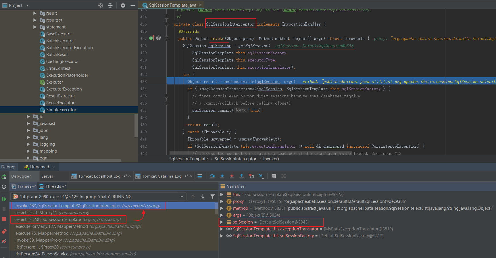


```java
private class SqlSessionInterceptor implements InvocationHandler {
  @Override
  public Object invoke(Object proxy, Method method, Object[] args) throws Throwable {
    SqlSession sqlSession = getSqlSession(
        SqlSessionTemplate.this.sqlSessionFactory,
        SqlSessionTemplate.this.executorType,
        SqlSessionTemplate.this.exceptionTranslator);
    try {
      Object result = method.invoke(sqlSession, args);
      if (!isSqlSessionTransactional(sqlSession, SqlSessionTemplate.this.sqlSessionFactory)) {
        // force commit even on non-dirty sessions because some databases require
        // a commit/rollback before calling close()
        sqlSession.commit(true);
      }
      return result;
    } //...
  }
}
```

在`getSqlSession()`上面介绍过了这一步，创建了DefaultSqlSession、事务、执行器。事务保存在执行器中，  DefaultSqlSession持有执行器、configuration

`method.invoke`代理的是`DefaultSqlSession`

## 3.7 DefaultSqlSession#selectList

DefaultSqlSession#selectList

先取出MappedStatement，然后执行查询，调用`executor.query`，之前的准备工作分析了，`DefaultSqlSession`持有执行器`Executor`

```java
@Override
public <E> List<E> selectList(String statement, Object parameter) {
  return this.selectList(statement, parameter, RowBounds.DEFAULT);
}

@Override
public <E> List<E> selectList(String statement, Object parameter, RowBounds rowBounds) {
  try {
    MappedStatement ms = configuration.getMappedStatement(statement);
    return executor.query(ms, wrapCollection(parameter), rowBounds, Executor.NO_RESULT_HANDLER);
  } //....
}
```


## 3.8 CachingExecutor#query

CachingExecutor#query

```java
@Override
public <E> List<E> query(MappedStatement ms, Object parameterObject, RowBounds rowBounds, ResultHandler resultHandler) throws SQLException {
  BoundSql boundSql = ms.getBoundSql(parameterObject);
  CacheKey key = createCacheKey(ms, parameterObject, rowBounds, boundSql);
  return query(ms, parameterObject, rowBounds, resultHandler, key, boundSql);
}
```

CachingExecutor#query

```java
@Override
public <E> List<E> query(MappedStatement ms, Object parameterObject, RowBounds rowBounds, ResultHandler resultHandler, CacheKey key, BoundSql boundSql)
    throws SQLException {
  Cache cache = ms.getCache();
  if (cache != null) {
    flushCacheIfRequired(ms);
    if (ms.isUseCache() && resultHandler == null) {
      ensureNoOutParams(ms, parameterObject, boundSql);
      @SuppressWarnings("unchecked")
      List<E> list = (List<E>) tcm.getObject(cache, key);
      if (list == null) {
        list = delegate.<E> query(ms, parameterObject, rowBounds, resultHandler, key, boundSql);
        tcm.putObject(cache, key, list); // issue #578 and #116
      }
      return list;
    }
  }
  return delegate.<E> query(ms, parameterObject, rowBounds, resultHandler, key, boundSql);
}
```

delegate代理的是自己，此处的delegate是`SimpleExecutor`

```java
public class CachingExecutor implements Executor {

  private Executor delegate;
  private TransactionalCacheManager tcm = new TransactionalCacheManager();

  public CachingExecutor(Executor delegate) {
    this.delegate = delegate;
    delegate.setExecutorWrapper(this); //代理的是自己
  }
}
```


## 3.9 SimpleExecutor

### 3.9.1 BaseExecutor#query

SimpleExecutor执行继承自父类方法：BaseExecutor#query

```java
@Override
public <E> List<E> query(MappedStatement ms, Object parameter, RowBounds rowBounds, ResultHandler resultHandler, CacheKey key, BoundSql boundSql) throws SQLException {
  ErrorContext.instance().resource(ms.getResource()).activity("executing a query").object(ms.getId());
  if (closed) {
    throw new ExecutorException("Executor was closed.");
  }
  if (queryStack == 0 && ms.isFlushCacheRequired()) {
    clearLocalCache();
  }
  List<E> list;
  try {
    queryStack++;
    //localCache是个PerpetualCache类型的实例，PerpetualCache类是实现了MyBatis的Cache缓存接口的实现类之一，内部有个Map<Object, Object>类型的属性用来存储缓存数据。 这个localCache就是一级缓存！  
    list = resultHandler == null ? (List<E>) localCache.getObject(key) : null;
    if (list != null) {
      handleLocallyCachedOutputParameters(ms, key, parameter, boundSql);
    } else {
      // <------------  
      list = queryFromDatabase(ms, parameter, rowBounds, resultHandler, key, boundSql);
    }
  } finally {
    queryStack--;
  }
  if (queryStack == 0) {
    for (DeferredLoad deferredLoad : deferredLoads) {
      deferredLoad.load();
    }
    // issue #601
    deferredLoads.clear();
    if (configuration.getLocalCacheScope() == LocalCacheScope.STATEMENT) {
      // issue #482
      clearLocalCache();
    }
  }
  return list;
}
```

localCache是个PerpetualCache类型的实例，PerpetualCache类是实现了MyBatis的Cache缓存接口的实现类之一，内部有个Map<Object, Object>类型的属性用来存储缓存数据。 这个localCache就是一级缓存！

### 3.9.2 BaseExecutor#queryFromDatabase 

SimpleExecutor执行继承自父类方法：BaseExecutor#queryFromDatabase

```java
private <E> List<E> queryFromDatabase(MappedStatement ms, Object parameter, RowBounds rowBounds, ResultHandler resultHandler, CacheKey key, BoundSql boundSql) throws SQLException {
  List<E> list;
  localCache.putObject(key, EXECUTION_PLACEHOLDER);
  try {
    list = doQuery(ms, parameter, rowBounds, resultHandler, boundSql);
  } finally {
    localCache.removeObject(key);
  }
  localCache.putObject(key, list);
  if (ms.getStatementType() == StatementType.CALLABLE) {
    localOutputParameterCache.putObject(key, parameter);
  }
  return list;
}
```

### 3.9.3 SimpleExecutor#doQuery

SimpleExecutor创建StatementHandler，由StatementHandler以

```java
@Override
public <E> List<E> doQuery(MappedStatement ms, Object parameter, RowBounds rowBounds, ResultHandler resultHandler, BoundSql boundSql) throws SQLException {
  Statement stmt = null;
  try {
    Configuration configuration = ms.getConfiguration();
    StatementHandler handler = configuration.newStatementHandler(wrapper, ms, parameter, rowBounds, resultHandler, boundSql);
    stmt = prepareStatement(handler, ms.getStatementLog());// <----------
    return handler.<E>query(stmt, resultHandler);// <----------
  } finally {
    closeStatement(stmt);
  }
}
```

### 3.9.4 SimpleExecutor#prepareStatement

像jdbc一样，先建立`Connection`，然后再建`Statement`。

把`Statement`委托给`StatementHandler`最后去执行。

```java
private Statement prepareStatement(StatementHandler handler, Log statementLog) throws SQLException {
  Statement stmt;
  Connection connection = getConnection(statementLog);
  stmt = handler.prepare(connection, transaction.getTimeout());
  handler.parameterize(stmt);
  return stmt;
}
```


## 3.10 RoutingStatementHandler#query


```java
public class RoutingStatementHandler implements StatementHandler {
  private final StatementHandler delegate;

  @Override
  public <E> List<E> query(Statement statement, ResultHandler resultHandler) throws SQLException {
    return delegate.<E>query(statement, resultHandler);
}
```

此处`delegate`的值是：`PreparedStatementHandler`


## 3.11 PreparedStatementHandler#query

最后由`PreparedStatement`执行查询操作，由`ResultHandler`处理返回结果集。

```java
@Override
public <E> List<E> query(Statement statement, ResultHandler resultHandler) throws SQLException {
  PreparedStatement ps = (PreparedStatement) statement;
  ps.execute();
  return resultSetHandler.<E> handleResultSets(ps);
}
```

这就是一个查询的整个调用过程了。


# 四、MyBatis核心构件


| 名称  | 	作用 |
| ---- | ---- |
| SqlSession  | 	作为MyBatis工作的主要顶层API，表示和数据库交互的会话，完成必要数据库增删改查功能 |
| Executor  | 	MyBatis执行器，是MyBatis 调度的核心，负责SQL语句的生成和查询缓存的维护 |
| StatementHandler  | 	封装了JDBC Statement操作，负责对JDBC statement 的操作，如设置参数、将Statement结果集转换成List集合 |
| ParameterHandler  | 	负责对用户传递的参数转换成JDBC Statement 所需要的参数 |
| ResultSetHandler  | 	负责将JDBC返回的ResultSet结果集对象转换成List类型的集合 |
| TypeHandler  | 	负责java数据类型和jdbc数据类型之间的映射和转换 |
| MappedStatement  | 	MappedStatement维护了一条select |
| SqlSource  | 	负责根据用户传递的parameterObject，动态地生成SQL语句，将信息封装到BoundSql对象中，并返回 |
| BoundSql  | 	表示动态生成的SQL语句以及相应的参数信息 |
| Configuration  | 	MyBatis所有的配置信息都维持在Configuration对象之中 |


# 五、事务

----------

MyBatis自动参与到spring事务管理中，无需额外配置，只要org.mybatis.spring.SqlSessionFactoryBean引用的数据源与DataSourceTransactionManager引用的数据源一致即可，否则事务管理会不起作用。

另外需要下载依赖包[aopalliance](http://aopalliance.sourceforge.net/).jar放置到WEB-INF/lib目录下。否则spring初始化时会报异常
java.lang.NoClassDefFoundError: org/aopalliance/intercept/MethodInterceptor

## 5.1 mybatis-spring的Transaction准备阶段 

下面一段是复制别人的博客，感觉有道理，就直接拿来用了。

> 下面方法中有一个步骤是如果用户没有配置`transactionFactory`，默认将Mybatis的`transactionFactory`配置为`SpringManagedTransactionFactory`，我们在分析Mybatis源码的时候看到，在用户没有指定`transactionFactory`配置的时候，Mybatis使用`ManagedTransactionFactory`作为默认的`TransactionFactory`，Mybatis在创建`SqlSession`时，需要为其添加一个Executor执行器，构建`Executor`执行器时需要的Transaction对象就是通过`TransactionFactory`的`newTransaction`方法创建的，后续`Executor`执行sql命令时会通过`Transaction`的`getConnection`方法获取数据库连接，这里添加的`SpringManagedTransactionFactory`有什么作用呢？我们可以思考一下，Spring在开启事务的时候需要获取数据库连接，Mybatis执行的时候也要获取数据库连接，在一次调用过程中，两者配合使用时，如果想让Spring的事务作用于Mybatis的数据库操作，那么在这次调用的过程中两者肯定要共用同一个数据库连接，不然事务无法生效，`SpringManagedTransactionFactory`就可以解决共用数据库连接的问题。


1.2.4介绍了`buildSqlSessionFactory()`方法，返回了`DefaultSqlSessionFactory`。

SqlSessionFactoryBean#buildSqlSessionFactory 在创建`DefaultSqlSessionFactory`时，创建了`SpringManagedTransactionFactory`，并将它放到`configuration`中。

```java
protected SqlSessionFactory buildSqlSessionFactory() throws IOException {

  Configuration configuration;
  //....
  if (this.transactionFactory == null) {
    this.transactionFactory = new SpringManagedTransactionFactory();//<--
  }
  		
  configuration.setEnvironment(new Environment(this.environment, this.transactionFactory, this.dataSource));  

  return this.sqlSessionFactoryBuilder.build(configuration);
}
```

调用如下图所示：

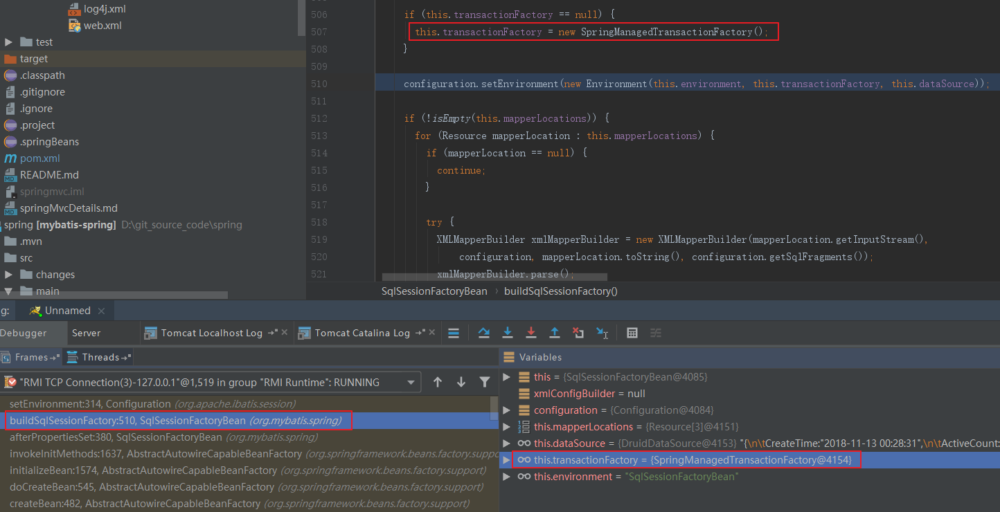


`SpringManagedTransactionFactory`继承了mybatis的`TransactionFactory`


## 5.2 mybatis-spring创建SqlSession，并交由spring去得到connection

SqlSession的调用栈如下：

```txt
getConnection:150, ConnectionHolder (org.springframework.jdbc.datasource)
doGetConnection:106, DataSourceUtils (org.springframework.jdbc.datasource)
getConnection:77, DataSourceUtils (org.springframework.jdbc.datasource)
openConnection:82, SpringManagedTransaction (org.mybatis.spring.transaction)
getConnection:68, SpringManagedTransaction (org.mybatis.spring.transaction)
getConnection:336, BaseExecutor (org.apache.ibatis.executor)
prepareStatement:84, SimpleExecutor (org.apache.ibatis.executor)
doUpdate:49, SimpleExecutor (org.apache.ibatis.executor)
update:117, BaseExecutor (org.apache.ibatis.executor)
update:76, CachingExecutor (org.apache.ibatis.executor)
update:198, DefaultSqlSession (org.apache.ibatis.session.defaults)
insert:185, DefaultSqlSession (org.apache.ibatis.session.defaults)
invoke0:-1, NativeMethodAccessorImpl (sun.reflect)
invoke:62, NativeMethodAccessorImpl (sun.reflect)
invoke:43, DelegatingMethodAccessorImpl (sun.reflect)
invoke:497, Method (java.lang.reflect)
invoke:433, SqlSessionTemplate$SqlSessionInterceptor (org.mybatis.spring)
insert:-1, $Proxy13 (com.sun.proxy)
insert:278, SqlSessionTemplate (org.mybatis.spring)
execute:57, MapperMethod (org.apache.ibatis.binding)
invoke:59, MapperProxy (org.apache.ibatis.binding)
insertStudentByVoMapper:-1, $Proxy25 (com.sun.proxy)
testTransactional:35, StudentService (com.paincupid.springmvc.service)
```


调用入口已经讲过，SqlSessionInterceptor#invoke阶段，SqlSessionUtils#getSqlSession()方法，再来看一下：

`TransactionSynchronizationManager`已经是spring包下的类了`org.springframework.transaction.support.getResource`，根据当前的`sessionFactory`做key，拿到当前的`SqlSessionHolder`。`org.mybatis.spring.SqlSessionUtils`是mybatis-spring包下的类，这个类比较重要，尤其是`getSqlSession`方法，是spring和mybatis的结合点。

SqlSessionUtils#getSqlSession

```java
public static SqlSession getSqlSession(SqlSessionFactory sessionFactory, ExecutorType executorType, PersistenceExceptionTranslator exceptionTranslator) {

  notNull(sessionFactory, NO_SQL_SESSION_FACTORY_SPECIFIED);
  notNull(executorType, NO_EXECUTOR_TYPE_SPECIFIED);

  SqlSessionHolder holder = (SqlSessionHolder) TransactionSynchronizationManager.getResource(sessionFactory);

  SqlSession session = sessionHolder(executorType, holder);
  if (session != null) {
    return session;
  }

  session = sessionFactory.openSession(executorType); //new DefaultSqlSession <-----

  registerSessionHolder(sessionFactory, executorType, exceptionTranslator, session);

  return session;
}
```


> session = sessionFactory.openSession(executorType);


### 5.2.2 openSession 时创建mybatis事务 

本质就是将**当前的`dataSource`放入`SpringManagedTransaction`对象中**。

2.3 DefaultSqlSessionFactory#openSession时，会创建事务，前面已介绍过。

DefaultSqlSessionFactory#openSessionFromConnection

> final Transaction tx = transactionFactory.newTransaction(connection);

相当于调用`SpringManagedTransactionFactory.newTransaction`，此处创建的是mybatis事务，`SpringManagedTransaction`负责mybatis的提交、回滚等。

`SpringManagedTransaction`后由spring调用：`SpringManagedTransaction.commit()`(如果事务交由 spring去控制，那么不会真正提交，最后还是调用spring的方法去提交事务。)

**为什么spring能调用到`SpringManagedTransaction`呢？ 是因为通过将它注册到spring的事务同步管理器：`TransactionSynchronizationManager`中，这样就完成了spring对mybatis的事务管理。**

```java
public Transaction newTransaction(DataSource dataSource, TransactionIsolationLevel level, boolean autoCommit) {
  return new SpringManagedTransaction(dataSource);
}
public SpringManagedTransaction(DataSource dataSource) {
  notNull(dataSource, "No DataSource specified");
  this.dataSource = dataSource;
}
```


### 5.2.3 保存前当sqlSession，创建并注册事务同步器。

SqlSessionUtils#registerSessionHolder

创建`SqlSessionHolder`对象, 将当前的`session`, `executorType`, `exceptionTranslator`存进去。然后通过spring的`TransactionSynchronizationManager.bindResource`方法， sessionFactory做key，holder作value，存起来，下次进getSqlSession时从缓存中取出来直接用，如果能取出holder，并从holer中得到session，则直接返回。

**看到`TransactionSynchronizationManager.register*()`方法，那就是spring和mybatis的结合点，通过`mybatis-spring`将spring和mybatis结合起来了。**

```java
private static void registerSessionHolder(SqlSessionFactory sessionFactory, ExecutorType executorType, PersistenceExceptionTranslator exceptionTranslator, SqlSession session) {
  SqlSessionHolder holder;
  if (TransactionSynchronizationManager.isSynchronizationActive()) {
    Environment environment = sessionFactory.getConfiguration().getEnvironment();

    if (environment.getTransactionFactory() instanceof SpringManagedTransactionFactory) {
      LOGGER.debug(() -> "Registering transaction synchronization for SqlSession [" + session + "]");

      holder = new SqlSessionHolder(session, executorType, exceptionTranslator);
        
      TransactionSynchronizationManager.bindResource(sessionFactory, holder);
      //事务的处理，后面介绍，这里和spring结合，调用spring的TransactionSynchronizationManager
      TransactionSynchronizationManager.registerSynchronization(new SqlSessionSynchronization(holder, sessionFactory));
      holder.setSynchronizedWithTransaction(true);
      holder.requested();
    }//...
  }
```


`TransactionSynchronizationManager.bindResource `绑定当前`sessionFactory`和`holder`

`TransactionSynchronizationManager.registerSynchronization `为当前线程注册一个事务同步器，其实就是创建一个`SqlSessionSynchronization`放到`ThreadLocal`中，交给spring去管理。后面执行完sql后，提交时，再由spring交由mybatis-spring从TransactionSynchronizationManager取出来，然后从holder中拿 到sqSession提交。

```java
private static final ThreadLocal<Set<TransactionSynchronization>> synchronizations =
			new NamedThreadLocal<>("Transaction synchronizations");
/**
 * Register a new transaction synchronization for the current thread.
 * Typically called by resource management code.
 * <p>Note that synchronizations can implement the
 * {@link org.springframework.core.Ordered} interface.
 * They will be executed in an order according to their order value (if any).
 * @param synchronization the synchronization object to register
 * @throws IllegalStateException if transaction synchronization is not active
 * @see org.springframework.core.Ordered
 */
public static void registerSynchronization(TransactionSynchronization synchronization)
      throws IllegalStateException {

   Assert.notNull(synchronization, "TransactionSynchronization must not be null");
   if (!isSynchronizationActive()) {
      throw new IllegalStateException("Transaction synchronization is not active");
   }
   synchronizations.get().add(synchronization);
}
```


### 5.2.4 SpringManagedTransaction.getConnection()取出当前connection

3.9.4 SimpleExecutor#prepareStatement时，调用getConnect()时，会从之前的`SpringManagedTransaction`得到当前的connection

```java
protected Connection getConnection(Log statementLog) throws SQLException {
  Connection connection = transaction.getConnection();
  if (statementLog.isDebugEnabled()) {
    return ConnectionLogger.newInstance(connection, statementLog, queryStack);
  } else {
    return connection;
  }
}
```

SpringManagedTransaction#getConnection

```java
@Override
public Connection getConnection() throws SQLException {
  if (this.connection == null) {
    openConnection();
  }
  return this.connection;
}
```

#### SpringManagedTransaction#openConnection

**此处是`mybatis-spring`用来结合spring的，mybatis的dataSource交由spring去管理和获取。也是通过`mybatis-spring.jar`包中的`SpringManagedTransaction`**

由spring去创建Connection，同时设置`this.isConnectionTransactional`为`true`，后面调用mybatis的commit方法时，就无法commit，交给spring提交commit。

```java
private void openConnection() throws SQLException {
  this.connection = DataSourceUtils.getConnection(this.dataSource);
  this.autoCommit = this.connection.getAutoCommit();
  this.isConnectionTransactional = DataSourceUtils.isConnectionTransactional(this.connection, this.dataSource);
}
```


### 5.2.5 交由spring根据dataSource去创建Connection

DataSourceUtils#getConnection

`org.springframework.jdbc.datasource.DataSourceUtils.getConnection()`

```java
public static Connection getConnection(DataSource dataSource) throws CannotGetJdbcConnectionException {
    try {
        return doGetConnection(dataSource);
    } //...
}
```


`org.springframework.jdbc.datasource.DataSourceUtils.doGetConnection()`  如果从事务同步管理器的当前线程中取不到`dataSource`，则会从jdbc中得到`connection`，放到`ConnectionHolder`中。然后：为当前线程注册一个新的事务同步器 和 绑定当前dataSource和holder到事务同步器。

因为本项目用的是`druid`，所以在IOC启动的时候，`dataSource`中的`connection`已经是被`druid`代理的`connection`:`ConnectionProxyImpl`

DataSourceUtils#doGetConnection

```java
public static Connection doGetConnection(DataSource dataSource) throws SQLException {
    Assert.notNull(dataSource, "No DataSource specified");
    // 从当前dataSource中获取绑定的ConnectionHolder
    ConnectionHolder conHolder = (ConnectionHolder)TransactionSynchronizationManager.getResource(dataSource);
    if (conHolder == null || !conHolder.hasConnection() && !conHolder.isSynchronizedWithTransaction()) {
        logger.debug("Fetching JDBC Connection from DataSource");
        Connection con = fetchConnection(dataSource);
        //
        if (TransactionSynchronizationManager.isSynchronizationActive()) {
            logger.debug("Registering transaction synchronization for JDBC Connection");
            // 在事务中使用相同的连接进一步JDBC操作，线程绑定对象将在事务完成时被同步删除
            ConnectionHolder holderToUse = conHolder;
            if (conHolder == null) {
                holderToUse = new ConnectionHolder(con);
            } else {
                conHolder.setConnection(con);
            }
            // 将ConnectionHolder请求数+1
            holderToUse.requested();           
            // 为当前线程注册一个新的事务同步器
            TransactionSynchronizationManager.registerSynchronization(new DataSourceUtils.ConnectionSynchronization(holderToUse, dataSource));
            holderToUse.setSynchronizedWithTransaction(true);
            if (holderToUse != conHolder) {
                //绑定当前dataSource和holder到事务同步器
                TransactionSynchronizationManager.bindResource(dataSource, holderToUse);
            }
        }

        return con;
    } else {
        conHolder.requested();
        if (!conHolder.hasConnection()) {
            logger.debug("Fetching resumed JDBC Connection from DataSource");
            conHolder.setConnection(fetchConnection(dataSource));
        }

        return conHolder.getConnection();
    }
}
```

这里我们看到通过调用TransactionSynchronizationManager的getResource方法获取当前线程绑定的ConnectionHolder，TransactionSynchronizationManager这个类我们在分析Spring事务源码的时候看到过，用来管理每个线程的资源和事务同步，内部维护了很多ThreadLocal变量来保存一些线程相关的资源。

方法中我们发现有一个注册事务同步的过程，这个事务同步是做什么用的呢？我们在分析Spring事务源码的时候提到过，在Spring事务回滚、提交、挂起等操作时会激活事务同步的相关方法，而这里添加的事务同步的作用主要是在Spring事务提交、回滚等操作后将ConnectionHolder的请求数量置为0、将一些属性置为初始状态、将数据库连接放回连接池、释放数据库连接等。

===================


## 5.3 spring事务调用

如果是spring配置了事务，那么会在IOC的时候 ，在@Transactional的注解的Service上，加代理。在调用目标代理方法前，会先调用CGLIB代理：在调用到@Transactional 注解方法时，匹配上了CGLIB代理CglibAopProxy$DynamicAdvisedInterceptor#intercept，  然后会先执行TransactionInterceptor#invoke事务拦截器，通过TransactionAspectSupport#invokeWithinTransaction来调用AbstractPlatformTransactionManager#getTransaction，开始spring事务：getTransaction，在DataSourceTransactionManager#doBegin时，创建链接Connection。


### 5.3.1 执行过程摘要


#### **invokeWithinTransaction**

事务相关的部分，基本上是围绕着 `TransactionAspectSupport.invokeWithinTransaction`这个方法的，在service方法执行前，先执行`createTransactionIfNecessary`创建`TransactionStatus`并保存到当前线程中；第二步执行真正Mapper的sql方法；第三步，在返回前执行事务提交。其本质就是一个环切面。

TransactionAspectSupport#invokeWithinTransaction

```java
protected Object invokeWithinTransaction(Method method, Class<?> targetClass, final InvocationCallback invocation) throws Throwable {

   // If the transaction attribute is null, the method is non-transactional.
   final TransactionAttribute txAttr = getTransactionAttributeSource().getTransactionAttribute(method, targetClass);
   //创建DataSourceTransactionManager，并为DataSourceTransactionManager赋值dataSoucre属性值 
   final PlatformTransactionManager tm = determineTransactionManager(txAttr);
   final String joinpointIdentification = methodIdentification(method, targetClass);

   if (txAttr == null || !(tm instanceof CallbackPreferringPlatformTransactionManager)) {
      // Standard transaction demarcation with getTransaction and commit/rollback calls.
      // 在执行sql前创建事务，如果加了@Transactional后会走到这里 <----- sql执行前开户事务
      TransactionInfo txInfo = createTransactionIfNecessary(tm, txAttr, joinpointIdentification);
      Object retVal = null;
      try {
         // This is an around advice: Invoke the next interceptor in the chain.
         // This will normally result in a target object being invoked.
         retVal = invocation.proceedWithInvocation(); // <----执行真正mapper方法
      }
      catch (Throwable ex) {
         // target invocation exception
         completeTransactionAfterThrowing(txInfo, ex);
         throw ex;
      }
      finally {
         cleanupTransactionInfo(txInfo);
      }
      //在执行完service中的mapper sql语句后，会用TransactionStatus执行最后的提交。 
      //<----- sql执行后提交
      commitTransactionAfterReturning(txInfo);
      return retVal;
   }
    //.....
}
```


### 5.3.2  执行目标方法(`Service.*methoad()`)前的CGLIB代理拦截器调用

#### 创建`PlatformTransactionManager(DataSourceTransactionManager)`，并为`DataSourceTransactionManager`的属性`dataSoucre`赋值

`DataSourceTransactionManager`继承了`AbstractPlatformTransactionManager`，创建的其实是`DataSourceTransactionManager`实例。

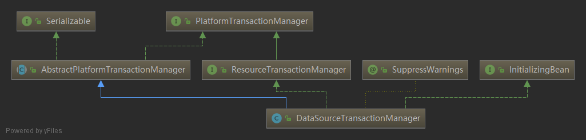

以下栈信息就是创建`PlatformTransactionManager`:

>final PlatformTransactionManager tm = determineTransactionManager(txAttr);

```txt
setDataSource:146, DataSourceTransactionManager (org.springframework.jdbc.datasource)
invoke0:-1, NativeMethodAccessorImpl (sun.reflect)
invoke:62, NativeMethodAccessorImpl (sun.reflect)
invoke:43, DelegatingMethodAccessorImpl (sun.reflect)
invoke:497, Method (java.lang.reflect)
setValue:344, BeanWrapperImpl$BeanPropertyHandler (org.springframework.beans)
setPropertyValue:454, AbstractNestablePropertyAccessor (org.springframework.beans)
setPropertyValue:280, AbstractNestablePropertyAccessor (org.springframework.beans)
setPropertyValues:95, AbstractPropertyAccessor (org.springframework.beans)
setPropertyValues:75, AbstractPropertyAccessor (org.springframework.beans)
applyPropertyValues:1514, AbstractAutowireCapableBeanFactory (org.springframework.beans.factory.support)
populateBean:1226, AbstractAutowireCapableBeanFactory (org.springframework.beans.factory.support)
doCreateBean:543, AbstractAutowireCapableBeanFactory (org.springframework.beans.factory.support)
createBean:482, AbstractAutowireCapableBeanFactory (org.springframework.beans.factory.support)
getObject:305, AbstractBeanFactory$1 (org.springframework.beans.factory.support)
getSingleton:230, DefaultSingletonBeanRegistry (org.springframework.beans.factory.support)
doGetBean:301, AbstractBeanFactory (org.springframework.beans.factory.support)
getBean:201, AbstractBeanFactory (org.springframework.beans.factory.support)
getBeansOfType:534, DefaultListableBeanFactory (org.springframework.beans.factory.support)
getBeansOfType:523, DefaultListableBeanFactory (org.springframework.beans.factory.support)
beansOfTypeIncludingAncestors:261, BeanFactoryUtils (org.springframework.beans.factory)
qualifiedBeanOfType:80, BeanFactoryAnnotationUtils (org.springframework.beans.factory.annotation)
qualifiedBeanOfType:56, BeanFactoryAnnotationUtils (org.springframework.beans.factory.annotation)
determineQualifiedTransactionManager:378, TransactionAspectSupport (org.springframework.transaction.interceptor)
determineTransactionManager:362, TransactionAspectSupport (org.springframework.transaction.interceptor)
invokeWithinTransaction:271, TransactionAspectSupport (org.springframework.transaction.interceptor)
invoke:96, TransactionInterceptor (org.springframework.transaction.interceptor)
proceed:179, ReflectiveMethodInvocation (org.springframework.aop.framework)
intercept:653, CglibAopProxy$DynamicAdvisedInterceptor (org.springframework.aop.framework)
testTransactional:-1, StudentService$$EnhancerBySpringCGLIB$$4461afed (com.paincupid.springmvc.service)
listTran:50, StudentController (com.paincupid.springmvc.controller)
```

`beanName`为`transactionManager`的类 `org.springframework.jdbc.datasource.DataSourceTransactionManager`是`singleton`的。因为`DataSourceTransactionManager`就单例，所以只有服务重启后，`dataSrouce`只会被set一次，以后取单例，只会在缓存中取。


#### CGLIB代理拦截器栈调用过程


```txt
doBegin:204, DataSourceTransactionManager (org.springframework.jdbc.datasource)
getTransaction:373, AbstractPlatformTransactionManager (org.springframework.transaction.support)
createTransactionIfNecessary:427, TransactionAspectSupport (org.springframework.transaction.interceptor)
invokeWithinTransaction:276, TransactionAspectSupport (org.springframework.transaction.interceptor)
invoke:96, TransactionInterceptor (org.springframework.transaction.interceptor)
proceed:179, ReflectiveMethodInvocation (org.springframework.aop.framework)
intercept:653, CglibAopProxy$DynamicAdvisedInterceptor (org.springframework.aop.framework)
testTransactional:-1, StudentService$$EnhancerBySpringCGLIB$$2e9a2dc4 (com.paincupid.springmvc.service)
listTran:28, StudentController (com.paincupid.springmvc.controller)
```

###   

**摘要过程：AbstractPlatformTransactionManager#getTransaction创建TransactionStatus，返回后绑定到当前线程。 **


DataSourceTransactionManager#doBegin作用

1、 创建Connection 并放到ConnectionHolder中保存起来。

> Connection newCon = this.dataSource.getConnection();
>
> txObject.setConnectionHolder(new ConnectionHolder(newCon), true);

2、除了创建connectionHolder，它还会设置并保存上一个事务的隔离级别：isolation level。

>Integer previousIsolationLevel = DataSourceUtils.prepareConnectionForTransaction(con, definition);txObject.setPreviousIsolationLevel(previousIsolationLevel);

3、最后将dataSrouce和connection绑定到`TransactionSynchronizationManager`中

> TransactionSynchronizationManager.bindResource(getDataSource(), txObject.getConnectionHolder());


在`getTransaction()`方法最主要是功能还是创建`TransactionStatus`(`DefaultTransactionStatus`)，并返回。

在`TransactionAspectSupport.createTransactionIfNecessary`得到`TransactionStatus`后，将它包装成`TransactionInfo`

并把它绑定到当前线程。

TransactionAspectSupport#prepareTransactionInfo

> txInfo.bindToThread();

TransactionAspectSupport$TransactionInfo#bindToThread 主要是通过ThreadLocal保存`TransactionStatus`

```java
private static final ThreadLocal<TransactionInfo> transactionInfoHolder =
			new NamedThreadLocal<TransactionInfo>("Current aspect-driven transaction");
private void bindToThread() {
   // Expose current TransactionStatus, preserving any existing TransactionStatus
   // for restoration after this transaction is complete.
   this.oldTransactionInfo = transactionInfoHolder.get();
   transactionInfoHolder.set(this);
}
```

执行完代理，会执行真正的service方法：StudentService#testTransactional


### 5.3.3  执行目标方法(`Service.*methoad()`)

执行方法栈如下图所示。同时可以看到`studentVoMapper`的执行其它是交给`org.apache.ibatis.binding.MapperProxy@7fecf7ab`去执行的。上面已经讲解了`MapperProxy`的调用过程 。

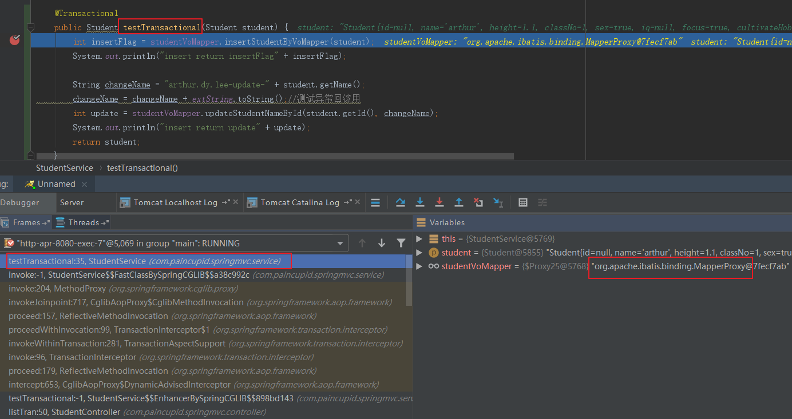

后执行*mapper.insert方法


### 5.3.4 执行目标方法(`Service.*methoad()`)后的CGLIB代理拦截器调用：commit提交

#### commit真正提交栈信息打印

```txt
commit:750, DruidPooledConnection (com.alibaba.druid.pool)
doCommit:272, DataSourceTransactionManager (org.springframework.jdbc.datasource)
processCommit:761, AbstractPlatformTransactionManager (org.springframework.transaction.support)
commit:730, AbstractPlatformTransactionManager (org.springframework.transaction.support)
commitTransactionAfterReturning:485, TransactionAspectSupport (org.springframework.transaction.interceptor)
invokeWithinTransaction:291, TransactionAspectSupport (org.springframework.transaction.interceptor)
invoke:96, TransactionInterceptor (org.springframework.transaction.interceptor)
proceed:179, ReflectiveMethodInvocation (org.springframework.aop.framework)
intercept:653, CglibAopProxy$DynamicAdvisedInterceptor (org.springframework.aop.framework)
testTransactional:-1, StudentService$$EnhancerBySpringCGLIB$$4461afed (com.paincupid.springmvc.service)
listTran:50, StudentController (com.paincupid.springmvc.controller)
```


/在执行完service中的mapper sql语句后，会用TransactionStatus执行最后的提交。在doBegin的时候，先将自动提交设置成了false.

DataSourceTransactionManager#doBegin 自动提交设置在false，所以在执行真正的service目标方法时不会提交到数据库。

```java
if (con.getAutoCommit()) {
   txObject.setMustRestoreAutoCommit(true);
   if (logger.isDebugEnabled()) {
      logger.debug("Switching JDBC Connection [" + con + "] to manual commit");
   }
   con.setAutoCommit(false);
}
```


#### DataSourceTransactionManager#doCommit 真正提交

```java
@Override
protected void doCommit(DefaultTransactionStatus status) {
   DataSourceTransactionObject txObject = (DataSourceTransactionObject) status.getTransaction();
   Connection con = txObject.getConnectionHolder().getConnection();
   if (status.isDebug()) {
      logger.debug("Committing JDBC transaction on Connection [" + con + "]");
   }
   try {
      con.commit();
   }
   catch (SQLException ex) {
      throw new TransactionSystemException("Could not commit JDBC transaction", ex);
   }
}
```

因为项目用的是druid，所以，connection的值为：

> com.alibaba.druid.proxy.jdbc.ConnectionProxyImpl@28d21ddc

由druid做了connection的代理。


#### 真正提交前的预提交

在真正提交前，会执行预提交。

```txt
commit:107, SpringManagedTransaction (org.mybatis.spring.transaction)
commit:244, BaseExecutor (org.apache.ibatis.executor)
commit:119, CachingExecutor (org.apache.ibatis.executor)
commit:224, DefaultSqlSession (org.apache.ibatis.session.defaults)
commit:218, DefaultSqlSession (org.apache.ibatis.session.defaults)
beforeCommit:286, SqlSessionUtils$SqlSessionSynchronization (org.mybatis.spring)
triggerBeforeCommit:95, TransactionSynchronizationUtils (org.springframework.transaction.support)
triggerBeforeCommit:932, AbstractPlatformTransactionManager (org.springframework.transaction.support)
processCommit:744, AbstractPlatformTransactionManager (org.springframework.transaction.support)
commit:730, AbstractPlatformTransactionManager (org.springframework.transaction.support)
commitTransactionAfterReturning:485, TransactionAspectSupport (org.springframework.transaction.interceptor)
invokeWithinTransaction:291, TransactionAspectSupport (org.springframework.transaction.interceptor)
invoke:96, TransactionInterceptor (org.springframework.transaction.interceptor)
proceed:179, ReflectiveMethodInvocation (org.springframework.aop.framework)
intercept:653, CglibAopProxy$DynamicAdvisedInterceptor (org.springframework.aop.framework)
testTransactional:-1, StudentService$$EnhancerBySpringCGLIB$$4461afed (com.paincupid.springmvc.service)
listTran:50, StudentController (com.paincupid.springmvc.controller)
```


AbstractPlatformTransactionManager#processCommit

```java
/**
 * Process an actual commit.
 * Rollback-only flags have already been checked and applied.
 * @param status object representing the transaction
 * @throws TransactionException in case of commit failure
 */
private void processCommit(DefaultTransactionStatus status) throws TransactionException {
   try {
      boolean beforeCompletionInvoked = false;
      try {
         prepareForCommit(status);
         triggerBeforeCommit(status); //执行mybatis提交 <-------
         triggerBeforeCompletion(status); //将sessionFactory和connectionHolder从当前线程解绑
         beforeCompletionInvoked = true;
         boolean globalRollbackOnly = false;
         if (status.isNewTransaction() || isFailEarlyOnGlobalRollbackOnly()) {
            globalRollbackOnly = status.isGlobalRollbackOnly();
         }
         if (status.hasSavepoint()) {
            //...
            status.releaseHeldSavepoint();
         }
         else if (status.isNewTransaction()) {
            //...
            doCommit(status); //由spring提交 <-------
         }//....
      }//.....

      // Trigger afterCommit callbacks, with an exception thrown there
      // propagated to callers but the transaction still considered as committed.
      try {
         triggerAfterCommit(status);
      }
      finally {
         triggerAfterCompletion(status, TransactionSynchronization.STATUS_COMMITTED);
      }
   }
   finally {
      cleanupAfterCompletion(status);
   }
}
```

在执行`doCommit(status)`前，会先执行mybatis的commit: `triggerBeforeCommit`。会先从当前线程中取出线程同步器`TransactionSynchronizationManager.getSynchronizations()`。

##### TransactionSynchronizationUtils#triggerBeforeCommit

```java
/**
 * Trigger {@code beforeCommit} callbacks on all currently registered synchronizations.
 * @param readOnly whether the transaction is defined as read-only transaction
 * @throws RuntimeException if thrown by a {@code beforeCommit} callback
 * @see TransactionSynchronization#beforeCommit(boolean)
 */
public static void triggerBeforeCommit(boolean readOnly) {
   for (TransactionSynchronization synchronization : TransactionSynchronizationManager.getSynchronizations()) {
      synchronization.beforeCommit(readOnly);
   }
}
```

此处`synchronization`就是之前注册过的： `SqlSessionSynchronization$SqlSessionSynchronization`

在SqlSessionUtils#registerSessionHolder方法中注册的。

> TransactionSynchronizationManager.registerSynchronization(new SqlSessionSynchronization(holder, sessionFactory));


SqlSessionSynchronization$SqlSessionSynchronization#beforeCommit

```java
@Override
public void beforeCommit(boolean readOnly) {
  // Connection commit or rollback will be handled by ConnectionSynchronization or
  // DataSourceTransactionManager.
  // But, do cleanup the SqlSession / Executor, including flushing BATCH statements so
  // they are actually executed.
  // SpringManagedTransaction will no-op the commit over the jdbc connection
  // TODO This updates 2nd level caches but the tx may be rolledback later on! 
  if (TransactionSynchronizationManager.isActualTransactionActive()) {
    try {
      this.holder.getSqlSession().commit(); //<---------
    } //....
  }
}
```

`holder`值是`SqlSessionHolder`

> holder = new SqlSessionHolder(session, executorType, exceptionTranslator);

`this.holder.getSqlSession()`的值为`DefaultSqlSession`

SqlSessionUtils#getSqlSession

>session = sessionFactory.openSession(executorType); //new DefaultSqlSession

DefaultSqlSession.commit --> CachingExecutor.commit  --> BaseExecutor.commit --> SpringManagedTransaction.commit

SpringManagedTransaction#commit

```java
@Override
public void commit() throws SQLException {
  if (this.connection != null && !this.isConnectionTransactional && !this.autoCommit) {
    if (LOGGER.isDebugEnabled()) {
      LOGGER.debug("Committing JDBC Connection [" + this.connection + "]");
    }
    this.connection.commit();
  }
}
```

由于 `this.isConnectionTransactional`值为`true`，所以不会执行`this.connection.commit();`，最后交由了spring去提交。


那么 `isConnectionTransactional`什么时候为 `ture` 的呢？

SpringManagedTransaction#openConnection()

> this.isConnectionTransactional = DataSourceUtils.isConnectionTransactional(this.connection, this.dataSource);

DataSourceUtils#isConnectionTransactional

```java
public static boolean isConnectionTransactional(Connection con, DataSource dataSource) {
   if (dataSource == null) {
      return false;
   }
   ConnectionHolder conHolder = (ConnectionHolder) TransactionSynchronizationManager.getResource(dataSource);
   return (conHolder != null && connectionEquals(conHolder, con));
}
```

因为之前绑定了dataSource，所以此处ConnectionHolder不为空。connectionEquals为true.


##### TransactionSynchronizationUtils#triggerBeforeCompletion

>TransactionSynchronizationManager.unbindResource(sessionFactory);

将sessionFactory和connectionHolder从当前线程解绑


# 六 spring事务调用总结

------------


## 6.1 调用

当前端发起一次请求的时候，调用到目标方法  `*Service.*method()`方法时，如果加了@Transactional注解，springIOC的启动时，会对当前Service生成代理类，当匹配到@Transactional注解方法时，在执行前和执行后，会执行一些代理方法。事务的执行可以说是围绕着`TransactionAspectSupport.invokeWithinTransaction`来执行的。

**执行前：**

1. 创建DataSourceTransactionManager，并为DataSourceTransactionManager赋值dataSoucre属性值

   >final PlatformTransactionManager tm = determineTransactionManager(txAttr);

2. 前创建事务

   > TransactionInfo txInfo = createTransactionIfNecessary(tm, txAttr, joinpointIdentification);

3. 在创建事务过程中，将`dataSource`和`connectionHolder`注册到事务同步器中，以便为mybatis获取执行，统一dataSource。

   >TransactionSynchronizationManager.bindResource(obtainDataSource(), txObject.getConnectionHolder());

**执行真正的目标方法**

可以参考第三章分析的*Mapper调用过程。

这里主要把提交过程中和spring相关的部分提出来。尤其是SqlSessionUtils#getSqlSession方法

4. 在执行*Mapper的过程中，调用SqlSessionUtils#getSqlSession方法，却获取当前的SqlSession，在执行getSqlSession()方法的过程中：

   A、先偿试从根据key:sessionFactory从TransactionSynchronizationManager中取SqlSessionHolder，获取到的话，直接从SqlSessionHolder中得到SqlSession返回。

   B、如果得不到，会通过`sessionFactory.openSession`创建SqlSession。在创建过程中，会由`SpringManagedTransaction.openConnection`会调用spring的类（`DataSourceUtils.getConnection`）去取connection，从而保证事务是同一个`Connection`。`DataSourceUtils.doGetConnection`会先根据`dataSource`为key，从

   > `ConnectionHolder conHolder = (ConnectionHolder) TransactionSynchronizationManager.getResource(dataSource)`

   中去取，因为上面已经放进去了，所以从当前线程中就取到了ConnectionHolder，然后返回`Connection`：

   > `conHolder.getConnection()`


**执行后**

主要是执行`commitTransactionAfterReturning(txInfo);`方法

5. `TransactionSynchronizationUtils.triggerBeforeCommit`预提交。因为之前注册过SqlSessionSynchronization：

   > `TransactionSynchronizationManager.registerSynchronization(new SqlSessionSynchronization(holder, sessionFactory));`

   所以预提交的时候，从TransactionSynchronizationManager取出`SqlSessionSynchronization`，然后得到SqlSessionHolder，后执行提交

   > this.holder.getSqlSession().commit();

   由于不满足条件，未能真正提交。

6. 通过``TransactionSynchronizationUtils.triggerBeforeCompletion()`将`sessionFactory`和`connectionHolder`从当前线程解绑

   >TransactionSynchronizationManager.unbindResource(sessionFactory);

7. 通过`DataSourceTransactionManager.doCommit()`真正执行：

   >Connection con = txObject.getConnectionHolder().getConnection();
   >
   >con.commit();


不同的线程是怎么得到不同的connection?怎么做到同一个事务获取的是同一个connection?

从上面的getSqlSession()过程，每一次请求都会进行一次openSession，去spring中取一次connection，而这个connection可能是交由druid管理，从线程池中取出。

每次请求都会用同一个connection。虽然SessionFactory只会初始化一次，但每次请求前都会将sessionFactory和sessionHolder放到`TransactionSynchronizationManager`绑定到当前线程，即使一次请求如果有多个Mapper去执行，但放到同一个事物中，那么只会用同一个connection，因为下次还是从当线线程去取。当当线线程执行完所有的操作时，会将当前线程解绑sessionFactory。`TransactionSynchronizationManager`其实维护的是一个`ThreadLocal`。那么当下次请求或其它线程再进来时，因为正在执行的线程没有绑定过`TransactionSynchronizationManager`，所以取不到connectionHolder，这时又会回到线程池中去取connection。

结合 `ThreadLocal`实现了多么强大的功能！


# 七、 插一段初始化执行顺序

-------------

doCreateBean创建Bean以及Bean的初始化顺序

AbtractAutowireCapableBeanFactory#doCreateBean

```java
protected Object doCreateBean(final String beanName, final RootBeanDefinition mbd, final Object[] args) {
   // Instantiate the bean.
   BeanWrapper instanceWrapper = null;
   if (mbd.isSingleton()) {
      instanceWrapper = this.factoryBeanInstanceCache.remove(beanName);
   }
   if (instanceWrapper == null) {
      instanceWrapper = createBeanInstance(beanName, mbd, args);//<------1.4.1 实例化
   }
   //.....

   // Initialize the bean instance.
   Object exposedObject = bean;
   try {
      populateBean(beanName, mbd, instanceWrapper); // <--------- 1.4.2 初始化
      if (exposedObject != null) {
         exposedObject = initializeBean(beanName, exposedObject, mbd);
      }
   }
   //....
   return exposedObject;
}
```

在执行完《1.4.1 实例化》后，会马上执行《1.4.2初始化》吗？

就Mapper的实例化来说，不是的。再通过MapperFactoryBean构造对象创建 MapperFactoryBean（Class<T> mapperInterfacer的属性值为：interface com.paincupid.springmvc.persistence.PersonMapper）后，会行检查它的依赖。发现是SqlSessionFactory，然后再找谁还依赖了SqlSessionFactory，这时候会找到其它的MapperFactoryBean，然后通过反射构造函数将他们new出来，这时候反射时的入参就是其它mapper，比如：interface com.paincupid.springmvc.persistence.StudentMapper，将它放到缓存中。这些都做完后才会执行《1.4.2初始化操作》


*Mapper注入过程，是由service来决定的，当service中有mapper属性性，容器会自动查找符合条件的mapper，找到后进行实例注入。


具体执行步骤：

1、执行行AbstractAutowireCapableBeanFactory#populateBean时，如果RootBeanDefinition的类型是AUTOWIRE_BY_TYPE，那么会执行AbstractAutowireCapableBeanFactory#autowireByType

2、AbstractAutowireCapableBeanFactory#autowireByType 通过resolveDependency 得到sqlSessionFactory实例，并将它保存起来。然后，保存当前beanName和实例的关系: personMapper和sqlSessionFactory。

```java
MutablePropertyValues pvs //是autowireByType的入参
pvs.add(propertyName, autowiredArgument); //autowiredArgument就是sqlSessionFactory实例
```


3、DefaultListableBeanFactory#resolveDependency --> DefaultListableBeanFactory#doResolveDependency 返回依赖的对象实例sqlSessionFactory

4、DefaultListableBeanFactory#findAutowireCandidates 通过调用beanNamesForTypeIncludingAncestors 返回的名字：sqlSessionFactory，再根据名字去getBean()去得到实例sqlSessionFactory。后返回`Map<String, Object> matchingBeans`集合

```java
if (!isSelfReference(beanName, candidateName) && isAutowireCandidate(candidateName, descriptor)) {
   result.put(candidateName, getBean(candidateName));
}
```


5、BeanFactoryUtils#beanNamesForTypeIncludingAncestors --> DefaultListableBeanFactory#getBeanNamesForType --> DefaultListableBeanFactory#doGetBeanNamesForType。根据类型得到beanName。此处类型为`org.apache.ibatis.session.SqlSessionFactory`，includeNonSingletons=true,allowEagerInit=true。最后返回的是beanName数组，此处数据大小为1，返回的beanName=sqlSessionFactory.

```java
private String[] doGetBeanNamesForType(ResolvableType type, boolean includeNonSingletons, boolean allowEagerInit) {
   List<String> result = new ArrayList<String>();

   // Check all bean definitions.
   for (String beanName : this.beanDefinitionNames) {
      // Only consider bean as eligible if the bean name
      // is not defined as alias for some other bean.
      if (!isAlias(beanName)) {
         try {
            RootBeanDefinition mbd = getMergedLocalBeanDefinition(beanName);
            // Only check bean definition if it is complete.
            if (!mbd.isAbstract() && (allowEagerInit ||
                  ((mbd.hasBeanClass() || !mbd.isLazyInit() || isAllowEagerClassLoading())) &&
                        !requiresEagerInitForType(mbd.getFactoryBeanName()))) {
               // In case of FactoryBean, match object created by FactoryBean.
               boolean isFactoryBean = isFactoryBean(beanName, mbd);
               boolean matchFound = (allowEagerInit || !isFactoryBean || containsSingleton(beanName)) &&
                     (includeNonSingletons || isSingleton(beanName)) && isTypeMatch(beanName, type);
               if (!matchFound && isFactoryBean) {
                  // In case of FactoryBean, try to match FactoryBean instance itself next.
                  beanName = FACTORY_BEAN_PREFIX + beanName; //<---- FactoryBean做特殊处理，加'&'
                  matchFound = (includeNonSingletons || mbd.isSingleton()) && isTypeMatch(beanName, type); //此处对于studentMapper组装成有factoryBean来说，仍是false。
               }
               if (matchFound) {//最扣匹配成功的是beanName=sqlSessionFactory
                  result.add(beanName);
               }
            }
         }
         //........
      }
   }

   // Check manually registered singletons too.
   //....	
   return StringUtils.toStringArray(result);
}
```


6、AbstractBeanFactory#isTypeMatch(String name, ResolvableType typeToMatch)。 name=studentMapper, tryToMatch=org.apache.ibatis.session.SqlSessionFactory。 虽然下面getTypeForFactoryBean只是返回了factoryBean.getObjectType()，但在执行过程中，实例化了FactoryBean(studentMapper)。此处isTypeMatch返回的是false

如果是FactoryBean类型，那么我们想要看的是它创建的类，而不是FactoryBean类本身。

```java
public boolean isTypeMatch(String name, ResolvableType typeToMatch) throws NoSuchBeanDefinitionException {
    //......
    // Check bean class whether we're dealing with a FactoryBean.
    if (FactoryBean.class.isAssignableFrom(beanType)) {
        if (!BeanFactoryUtils.isFactoryDereference(name)) {
            // If it's a FactoryBean, we want to look at what it creates, not the factory class.
            beanType = getTypeForFactoryBean(beanName, mbd);
            if (beanType == null) {
                return false;
            }
        }    
    //....   
    return typeToMatch.isAssignableFrom(beanType);    
}
```


7、AbstractAutowireCapableBeanFactory#getTypeForFactoryBean 在下面调用得到FactoryBean后，返回factoryBean.getObjectType()。getObjectType就FactoryBean的接口方法。


8、AbstractAutowireCapableBeanFactory#getSingletonFactoryBeanForTypeCheck 得到下面调用返回的BeanWrapperImpl，并将它缓存起来。后返回FactoryBean对象。

> this.factoryBeanInstanceCache.put(beanName, bw); //bw即BeanWrapperImpl


9、ConstructorResolver#autowireConstructor 通过SimpleInstantiationStrategy#instantiate实例化MapperFactoryBean，并为BeanWrapperImpl的属性赋值，后返回BeanWrapperImpl。autowireConstructor 方法作用：构造函数注入:在这种模式下 ，Spring bean工厂能够宿主基于构造函数的组件依赖性解析。


10、SimpleInstantiationStrategy#instantiate --> BeanUtils#instantiateClass，通过反射构造函数创建MapperFactoryBean对象，mapperInterfacer的属性值为：interface com.paincupid.springmvc.persistence.StudentMapper


下面是实例化MapperFactoryBean（studentMapper）的全过程

```txt
<init>:65, MapperFactoryBean (org.mybatis.spring.mapper)
newInstance0:-1, NativeConstructorAccessorImpl (sun.reflect)
newInstance:62, NativeConstructorAccessorImpl (sun.reflect)
newInstance:45, DelegatingConstructorAccessorImpl (sun.reflect)
newInstance:422, Constructor (java.lang.reflect)
instantiateClass:147, BeanUtils (org.springframework.beans)
instantiate:122, SimpleInstantiationStrategy (org.springframework.beans.factory.support)
autowireConstructor:267, ConstructorResolver (org.springframework.beans.factory.support)
autowireConstructor:1143, AbstractAutowireCapableBeanFactory (org.springframework.beans.factory.support)
createBeanInstance:1046, AbstractAutowireCapableBeanFactory (org.springframework.beans.factory.support)
getSingletonFactoryBeanForTypeCheck:865, AbstractAutowireCapableBeanFactory (org.springframework.beans.factory.support)
getTypeForFactoryBean:796, AbstractAutowireCapableBeanFactory (org.springframework.beans.factory.support)
isTypeMatch:543, AbstractBeanFactory (org.springframework.beans.factory.support)
doGetBeanNamesForType:447, DefaultListableBeanFactory (org.springframework.beans.factory.support)
getBeanNamesForType:423, DefaultListableBeanFactory (org.springframework.beans.factory.support)
beanNamesForTypeIncludingAncestors:220, BeanFactoryUtils (org.springframework.beans.factory)
findAutowireCandidates:1130, DefaultListableBeanFactory (org.springframework.beans.factory.support)
doResolveDependency:1069, DefaultListableBeanFactory (org.springframework.beans.factory.support)
resolveDependency:967, DefaultListableBeanFactory (org.springframework.beans.factory.support)
autowireByType:1292, AbstractAutowireCapableBeanFactory (org.springframework.beans.factory.support)
populateBean:1199, AbstractAutowireCapableBeanFactory (org.springframework.beans.factory.support)
<--------------
doCreateBean:543, AbstractAutowireCapableBeanFactory (org.springframework.beans.factory.support)
createBean:482, AbstractAutowireCapableBeanFactory (org.springframework.beans.factory.support)
getObject:305, AbstractBeanFactory$1 (org.springframework.beans.factory.support)
getSingleton:230, DefaultSingletonBeanRegistry (org.springframework.beans.factory.support)
doGetBean:301, AbstractBeanFactory (org.springframework.beans.factory.support)
getBean:196, AbstractBeanFactory (org.springframework.beans.factory.support)
preInstantiateSingletons:753, DefaultListableBeanFactory (org.springframework.beans.factory.support)
finishBeanFactoryInitialization:834, AbstractApplicationContext (org.springframework.context.support)
```


# 八、其它补充

---------

## 8.1 Mapper接口对应的bean在容器中的数量

Mapper在容器中是单例的，isSingleton()方法返回的是：true;

```java
public class MapperFactoryBean<T> extends SqlSessionDaoSupport implements FactoryBean<T> {
  @Override
  public boolean isSingleton() {
    return true;
  }
}
```


本文只涉及到部分Mybatis源码解析，以及mybatis-spring怎么把mybatis和spring整合起来，在事务中调用的。

还有很多mybatis的文章，可以参考：[Mybatis源码解析优秀博文](https://blog.csdn.net/nmgrd/article/details/54608702)

