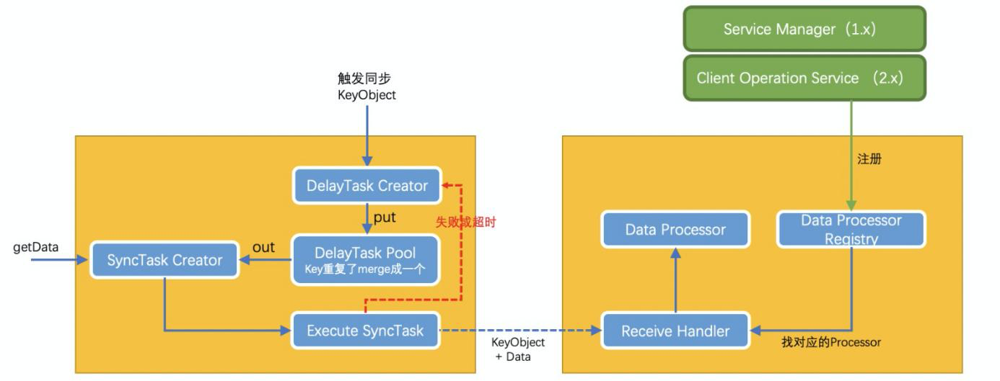

# Nacos

## 一、简介

Nacos /nɑ:kəʊs/ 是 Dynamic Naming and Configuration Service的首字母简称，一个更易于构建云原生应用的动态服务发现、配置管理和服务管理平台。

Nacos 致力于帮助您发现、配置和管理微服务。Nacos 提供了一组简单易用的特性集，帮助您快速实现动态服务发现、服务配置、服务元数据及流量管理。

### 1.1 Nacos 的关键特性

- **服务发现和服务健康监测**

  Nacos 支持基于 DNS 和基于 RPC 的服务发现。服务提供者使用 [原生SDK](https://nacos.io/zh-cn/docs/v2/guide/user/sdk.html)、[OpenAPI](https://nacos.io/zh-cn/docs/v2/guide/user/open-api.html)、或一个[独立的Agent TODO](https://nacos.io/zh-cn/docs/v2/guide/user/other-language.html)注册 Service 后，服务消费者可以使用[DNS TODO](https://nacos.io/zh-cn/docs/v2/xx) 或[HTTP&API](https://nacos.io/zh-cn/docs/v2/guide/user/open-api.html)查找和发现服务。

  Nacos 提供对服务的实时的健康检查，阻止向不健康的主机或服务实例发送请求。Nacos 支持传输层 (PING 或 TCP)和应用层 (如 HTTP、MySQL、用户自定义）的健康检查。 对于复杂的云环境和网络拓扑环境中（如 VPC、边缘网络等）服务的健康检查，Nacos 提供了 agent 上报模式和服务端主动检测2种健康检查模式。Nacos 还提供了统一的健康检查仪表盘，帮助您根据健康状态管理服务的可用性及流量。

- **动态配置服务**

  动态配置服务可以让您以中心化、外部化和动态化的方式管理所有环境的应用配置和服务配置。

  动态配置消除了配置变更时重新部署应用和服务的需要，让配置管理变得更加高效和敏捷。

  配置中心化管理让实现无状态服务变得更简单，让服务按需弹性扩展变得更容易。

- **动态 DNS 服务**

  动态 DNS 服务支持权重路由，让您更容易地实现中间层负载均衡、更灵活的路由策略、流量控制以及数据中心内网的简单DNS解析服务。动态DNS服务还能让您更容易地实现以 DNS 协议为基础的服务发现，以帮助您消除耦合到厂商私有服务发现 API 上的风险。

- **服务及其元数据管理**

  Nacos 能让您从微服务平台建设的视角管理数据中心的所有服务及元数据，包括管理服务的描述、生命周期、服务的静态依赖分析、服务的健康状态、服务的流量管理、路由及安全策略、服务的 SLA 以及最首要的 metrics 统计数据。

### 1.2 Nacos 地图


## 二、架构原理

### 2.1 基本架构及概念


生产者、消费者、nacos信息的同步主要的几种方式：

- push （服务端主动push）
- pull （客户端的轮询）， 超时时间比较短
- long pull （超时时间比较长）

架构图中分为这么几个模块：

- **Provider APP**：服务提供者。
- **Consumer APP**：服务消费者。
- **Name Server**：通过Virtual IP或者DNS的方式实现Nacos高可用集群的服务路由。
- **Nacos Server**：Nacos服务提供者。
- **OpenAPI**：暴露标准Rest风格HTTP接口，简单易用，方便多语言集成
- **Config Service**: Nacos提供的配置服务
- **Naming Service**：名字服务模块。提供分布式系统中所有对象(Object)、实体(Entity)的“名字”到关联的元数据之间的映射管理服务，例如 ServiceName -> Endpoints Info, Distributed Lock Name -> Lock Owner/Status Info, DNS Domain Name -> IP List, 服务发现和 DNS 就是名字服务的2大场景。
- **Consistency Protocol**：一致性协议，用来实现Nacos集群节点的数据同步，使用蚂蚁JRaft（CP）和阿里Distro协议（AP）
- [更多概念](https://nacos.io/zh-cn/docs/v2/concepts.html)

### 2.2 逻辑架构


- 服务管理：实现服务CRUD，域名CRUD，服务健康状态检查，服务权重管理等功能
- 配置管理：实现配置管CRUD，版本管理，灰度管理，监听管理，推送轨迹，聚合数据等功能
- 元数据管理：提供元数据CURD 和打标能力
- 插件机制：实现三个模块可分可合能力，实现扩展点SPI机制
- 事件机制：实现异步化事件通知，sdk数据变化异步通知等逻辑
- Nameserver：解决namespace到clusterid的路由问题，解决用户环境与nacos物理环境映射问题
- CMDB：解决元数据存储，与三方cmdb系统对接问题，解决应用，人，资源关系
- OpenAPI：暴露标准Rest风格HTTP接口，简单易用，方便多语言集成
- Agent：Sidecar 模式运行，通过标准 DNS 协议与业务解耦。
- CLI：命令行对产品进行轻量化管理，像 git ⼀样好用。
- SDK：多语言sdk
- ... [更多概念请查看](https://nacos.io/zh-cn/docs/v2/architecture.html)

### 2.3 领域模型

Nacos 数据模型 Key 由三元组唯一确定, Namespace默认是空串，公共命名空间（public），分组默认是 DEFAULT_GROUP。


服务的逻辑隔离模型


服务的分级模型


### 2.4 配置中心原理


nacos 配置中心就是采用：客户端 long pull 的方式

- Nacos 客户端会循环请求服务端变更的数据，并且超时时间设置为30s，当配置发生变化时，请求的响应会立即返回，否则会一直等到 29.5s+ 之后再返回响应
- 客户端的请求到达服务端后，服务端将该请求加入到一个叫 allSubs 的队列中，等待配置发生变更时 DataChangeTask主动去触发，并将变更后的数据写入响应对象。
- 调度任务保底。与此同时服务端也将该请求封装成一个调度任务去执行，等待调度的期间就是等DataChangeTask 主动触发的，如果延迟时间到了 DataChangeTask 还未触发的话，则调度任务开始执行数据变更的检查，然后将检查的结果写入响应对象（基于文件的MD5）

#### 2.4.1 动态刷新


### 2.5 注册中心原理

1. 功能上：Nacos既支持配置中心，又支持注册中心，并且注册中心根据是否是临时节点来判断用AP模式还是CP模式，从这点来看，功能是比较强大的；
2. 运维上：Nacoa支持配置中心和注册中心独立部署，也支持配置中心和注册中心合并部署到一个进程，完全看自己需求，从这一点看，部署是比较灵活的；


nacos注册中心采用了 ：pull （客户端的轮询）和push （服务端主动push）


#### 2.5.1 服务注册

##### 临时实例和持久化实例

临时实例和持久化实例。在定义上区分临时实例和持久化 实例的关键是健康检查的方式。

- 临时实例使用客户端上报模式，而持久化实例使用服务端反向探测模式。
- 临时实例需要能够自动摘除不健康实例，而且无需持久化存储实例，那么这种实例就适用于 类 Gossip 的协议。持久化实例使用服务端探测的健康检查方式，因为客户端不会上报心跳， 那么自然就不能去自动摘除下线的实例。

⼀些基础的组件例如数据库、缓存等，这些往往 不能上报心跳，这种类型的服务在注册时，就需要作为持久化实例注册。

**非持久化的实例**

Nacos2.0 的版本，会通过 gRPC 的长连接来维持状态，当连接发生中断时， 该非持久化实例则终止生命周期。当然，非持久化实例也可以通过注销实例的请求，主动终止其生 命周期，但是由于长连接和心跳续约的存在，可能导致前⼀个实例数据的生命周期刚被终止移除， 立刻又因为心跳和长连接的补偿请求，再次开启实例的生命周期，给人⼀种注销失败的假象。

临时实例只是临时存在于注册中心中，会在服务下线或不可用时被注册中心剔除，临时实例会与注 册中心保持心跳，注册中心会在⼀段时间没有收到来自客户端的心跳后会将实例设置为不健康，然 后在⼀段时间后进行剔除。

在 Nacos 中，用户可以通过两种方式进行临时实例的注册，通过 Nacos 的 OpenAPI 进行服务注 册或通过 Nacos 提供的 SDK 进行服务注册。

**持久化实例**

在 Nacos2.0 中将是否持久化的数据抽象至服务级别， 且不再允许⼀个服务同时存在持久化实例和非持久化实例，实例的持久化属性继承自服务的持久化属性。

在 Nacos2.0 版本后，持久化属性的定义被抽象到服务中，⼀个服务只能被定义成持久化服务或非持久化服务，⼀旦定义完成，在服务生命周期结束之前，无法更改其持久化属性。

**持久化属性将会影响服务及实例的数据是否会被 Nacos 进行持久化存储，设置为持久化之后，实 例将不会再被自动移除，需要使用者手动移除实例。**

持久化的实例，会通过健康检查的状态维护健康状态，但是不会自动的终止该实例的生命周期；唯⼀终止持久化实例生命周期的方式就是注销实例的请求。

永久实例在被删除之前会永久的存在于注册中心，且有可能并不知道注册中心存在，不会主动向注 册中心上报心跳，那么这个时候就需要注册中心主动进行探活。

**临时实例健康检查机制**

在 Nacos 中，用户可以通过两种方式进行临时实例的注册，通过 Nacos 的 OpenAPI 进行服务注 册或通过 Nacos 提供的 SDK 进行服务注册。

OpenAPI 的注册方式实际是用户根据自身需求调用 Http 接口对服务进行注册，然后通过 Http 接 口发送心跳到注册中心。

SDK 的注册方式实际是通过 RPC 与注册中心保持连接（Nacos 2.x 版本中，旧版的还是仍然通过 OpenAPI 的方式），客户端会定时的通过 RPC 连接向 Nacos 注册中心发送心跳，保持连接的存 活。

**永久实例健康检查机制**

Nacos 中使用 SDK 对于永久实例的注册实际也是使用 OpenAPI 的方式进行注册，这样可以保证即使是客户端下线后也不会影响永久实例的健康检查。

**Nacos 现在内置提供了三种探测的协议， 即 Http、TCP 以及 MySQL** 。 ⼀般而言 Http 和 TCP 已经可以涵盖绝大多数的健康检查场景。 MySQL 主要用于特殊的业务场景，例如数据库的主备需要通过服务名对外提供访问，需要确定当前 访问数据库是否为主库时，那么我们此时的健康检查接口，是⼀个检查数据库是否为主库的 MySQL 命令。


##### **注册过程**

1. springboot启动时，进行初始化，就会把自己注册到nacos server中。

   Spring Boot通过读取 `META-INF/spring.factories` 里面的监听器类来做相应的启动。**NacosServiceRegistryAutoConfiguration** =>**NacosAutoServiceRegistration**=>**NacosServiceRegistry**=>**NacosNamingService#registerInstance**。 `NacosServiceRegistry`实现了 **ApplicationContextAware和ApplicationListener**接口，也就是说，项目启动的时候就会触发该类， 然后把自己注册到nacos server中。

2. 生产者nacos client**通过NamingService接口进行实例注册**，**NamingService** 接口是Nacos命名服务对外提供的一个统一接口。

   **Nacos Client** 会通过发送grpc/http请求的方式向 **Nacos Server** 注册自己的服务，提供自身的元数据，比如ip地址、端口等信息。**Nacos Server接收到注册请求后，就会把这些元数据信息存储在一个 ConcurrentMap 中，Map的key=`groupName + "@@" + serviceName`。**

3. 心跳和健康检查

   当前实例注册时会告诉Nacos Server：心跳间隙、心跳超时时间、IP剔除超时时间，告诉Nacos server按照这个值来判断我这个实例是否健康。Nacos默认提供的值心跳5s，健康检查15s，服务IP剔除30s。

   在服务注册后，**Nacos Client** 会维护一个 **定时心跳** 来持续通知 **Nacos Server** ，说明服务一直处于可用状态，防止被剔除。 **默认5s发送一次心跳**。**Nacos Server** 会开启一个 **定时任务** 用来检查注册服务实例的健康情况，对于 **超过15s没有收到客户端心跳的实例会将它的healthy属性置为false** (客户端服务发现时不会发现)，如果某个 **实例超过30秒没有收到心跳，直接剔除该实例** (**被剔除的实例如果恢复发送心跳则会重新注册**)。


#### 2.5.2 服务发现

**服务消费者（Nacos Client）在调用服务提供者的服务时，会发送一个REST请求给Nacos Server，获取上面注册的服务清单，并且缓存在Nacos Client本地，同时会在Nacos Client本地开启一个定时任务定时拉取服务端最新的注册表信息更新到本地缓存** 。

1. 客户端启动时会将当前服务的信息包含ip、端口号、服务名、集群名等信息封装为一个Instance对象，然后创建一个定时任务，每隔一段时间向Nacos服务器发送PUT请求并携带相关信息。
2. nacos服务器端在接收到心跳请求后，会去检查当前服务列表中有没有该实例，如果没有的话将当前服务实例重新注册，注册完成后立即开启一个异步任务，更新客户端实例的最后心跳时间，如果当前实例是非健康状态则将其改为健康状态。
3. 心跳定时任务创建完成后，通过POST请求将当前服务实例信息注册进nacos服务器。
4. nacos服务器端在接收到注册实例请求后，会将请求携带的数据封装为一个Instance对象，然后为这个服务实例创建一个服务Service，一个Service下可能有多个服务实例，服务在Nacos保存到一个ConcurrentHashMap中Map(namespace,Map(group::serviceName, Service))； 。
5. nacos将实例添加到对应服务列表中会根据AP和CP不同的模式，采用不同协议。
   - CP模式就是基于Raft协议（通过leader节点将实例数据更新到内存和磁盘文件中，并且通过CountDownLatch实现了一个简单的raft写入数据的逻辑，必须集群半数以上节点写入成功才会给客户端返回成功）
   - AP模式基于Distro协议（向任务阻塞队列添加一个本地服务实例改变任务，去更新本地服务列表，然后在遍历集群中所有节点，分别创建数据同步任务放进阻塞队列异步进行集群数据同步，不保证集群节点数据同步完成即可返回）
   - nacos在将服务实例更新到服务注册表中时，为了防止并发读写冲突，采用的是写时复制的思想，将原注册表数据拷贝一份，添加完成之后再替换回真正的注册表。
6. nacos在更新完成之后，通过发布服务变化事件，将服务变动通知给客户端，采用的是UDP通信，客户端接收到UDP消息后会返回一个ACK信号，如果一定时间内服务端没有收到ACK信号，还会尝试重发，当超出重发时间后就不在重发。
7. 客户端通过定时任务定时从服务端拉取服务数据保存在本地缓存。

### 2.6 心跳和服务健康检查

#### 2.6.1 健康检查

Zookeeper 和 Eureka 都实现了⼀种 TTL 的机制，就是如果客户端在⼀定时间内没有向注册中心发送心跳，则会将这个客户端摘除。

Nacos 也支持这种 TTL 机制，Nacos 目前支持临时实 例使用心跳上报方式维持活性，发送心跳的周期默认是 5 秒，Nacos 服务端会在 15 秒没收到心 跳后将实例设置为不健康，在 30 秒没收到心跳时将这个临时实例摘除。

有⼀些服务无法上报心跳，但是可以提供⼀个检测接口，由外部去探测。

服务端健康检查最常见的方式是 TCP 端口探测和 HTTP 接口返回码探测，这两种探测方式因为其协 议的通用性可以支持绝大多数的健康检查场景。例如部署了数据库的主备，数据库的主备可能会在某些情况下切换，需要通过服务名对外提供访问，保证当前访问的库是主库。此时的健康检查接口，可能就是⼀个检查数据库是否是主库的 MYSQL 命令了。

**Nacos 既支持客户端的健康检查，也支持服务端的健康检查，同⼀个服务可以切换健康检查模式。**

客户端健康检查和服务端健康检查有⼀些不同的关注点。客户端健康检查主要关注客户端上报心跳 的方式、服务端摘除不健康客户端的机制。而服务端健康检查，则关注探测客户端的方式、灵敏度 及设置客户端健康状态的机制。从实现复杂性来说，服务端探测肯定是要更加复杂的，因为需要服 务端根据注册服务配置的健康检查方式，去执行相应的接口，判断相应的返回结果，并做好重试机 制和线程池的管理。这与客户端探测，只需要等待心跳，然后刷新 TTL 是不⼀样的。同时服务端健 康检查无法摘除不健康实例，这意味着只要注册过的服务实例，如果不调用接口主动注销，这些服 务实例都需要去维持健康检查的探测任务，而客户端则可以随时摘除不健康实例，减轻服务端的压 力。

**注册时的健康检查**

在 Nacos 中，服务的注册我们从注册方式维度实际可以分为两大类。第⼀类通过 SDK RPC 连接进 行注册，客户端会和注册中心保持链接。第二类，通过 OpenAPI 进行 IP 和端口注册。

1. SDK RPC 连接进行注册。如何寻找到对其负责的注册中心节点呢？只需要和注册中心集 群中的任意⼀台节点建立联系，那么由这个节点负责这个客户端就可以了。注册中心会在启动时注 册⼀个全局的同步任务，用于将其当前负责的所有节点信息同步到集群中的其他节点，其他非负责 的节点也会创建该客户端的信息，在非负责的节点上，连接类型的客户端，会有⼀个续约时间的概 念，在收到其他节点的同步信息时，更新续约时间为当前时间，如果在集群中的其他节点在⼀段时 间内没有收到不是自己的负责的节点的同步信息，那么认为此节点已经不健康，从而达到对不是自 己负责的节点健康状态检查。
2. 通过 OpenAPI 进行 IP 和端口注册。方式其实也基本和第⼀类⼀致，OpenAPI 注册的临时实例也是通过同步自身负责的节 点到其他节点来更新其他节点的对应的临时实例的心跳时间，保证其他节点不会删除或者修改此实 例的健康状态。

#### 2.6.2 心跳

服务的健康检查分为两种模式：

- 客户端上报模式：客户端通过心跳上报的方式告知nacos 注册中心健康状态（默认心跳间隔5s，nacos将超过超过15s未收到心跳的实例设置为不健康，超过30s将实例删除）
- 服务端主动检测：nacos主动检查客户端的健康状态（默认时间间隔20s，健康检查失败后会设置为不健康，不会立即删除）

nacos 目前的instance有一个ephemeral字段属性，该字段表示实例是否是临时实例还是持久化实例。如果是临时实例则不会在nacos中持久化，需要通过心跳上报，如果一段时间没有上报心跳，则会被nacos服务端删除。删除后如果又重新开始上报，则会重新实例注册。而持久化实例会被nacos服务端持久化，此时即使注册实例的进程不存在，这个实例也不会删除，只会将健康状态设置成不健康。

这里就涉及到了nacos的AP和CP模式 ，默认是AP，即nacos的client的节点注册时ephemeral=true，那么nacos集群中这个client节点就是AP，采用的是distro 协议，而ephemeral=false时就是CP采用的是raft协议实现。

**为什么nacos有两种心跳机制？**

对于临时实例，健康检查失败，则直接删除。这种特性适合于需要应对流量突增的场景，服务可以弹性扩容，当流量过去后，服务停掉即可自动注销。
对于持久化实例，健康检查失败，会设置为不健康状态。它的优点就是可以实时的监控到实例的健康状态，便于后续的告警和扩容等一系列处理。

**自我保护机制**

nacos也有自我保护机制（当前健康实例数/当前服务总实例数），值为0-1之间的浮点类型。正常情况下nacos 只会健康的实例。单在高并发场景，如果只返回健康实例的话，流量洪峰到来可能直接打垮剩下的健康实例，产生雪崩效应。

保护阈值存在的意义在于当服务A健康实例数/总实例数 < 保护阈值时，Nacos会把该服务所有的实例信息（健康的+不健康的）全部提供给消费者，消费者可能访问到不健康的实例，请求失败，但这样远比造成雪崩要好。牺牲了请求，保证了整个系统的可用。

简单来说不健康实例的另外一个作用：防止雪崩

如果所有的实例都是临时实例，当雪崩出现时，Nacos的阈值保护机制是不是就没有足够的（包含不健康实例）实例返回了，其实如果有部分实例是持久化实例，即便它们已经挂掉，状态为不健康，但当触发自我保护时，还是可以起到分流的作用。

### 2.7 负载均衡

**传统负载均衡**

注册中心本身⼀般不限定服务消费者的访问策略。 Eureka、Zookeeper 包括 Consul，本身都没有去实现可配置及可扩展的负载均衡机制，Eureka 的 负载均衡是由 ribbon 来完成的，而 Consul 则是由 Fabio 做负载均衡。

负载均衡有基于权重、服务提供者负载、响应时间、标签等策略。其中 Ribbon 设计的客户端负载均衡机制，主要是选择合适现有的 IRule、ServerListFilter 等接口实现，或者自己继承这些接口，实现自己的过滤逻辑。这里 Ribbon 采用的是**两步负载均衡，第⼀步是先过滤掉不会采用的服务提供者实例，第二步 是在过滤后的服务提供者实例里，实施负载均衡策略**。Ribbon 内置的几种负载均衡策略功能还是比较强大的，同时又因为**允许用户去扩展**，这可以说是⼀种比较好的设计。

**Nacos负载均衡**

Nacos 试图做的是将服务端负载均衡与客户端负载均衡通过某种机制结合起来，提供用户扩展性，并给予用户充分的自主选择权和轻便的使用方式。


## 三、一致性和通信

### 3.1 共识

Nacos的服务注册发现和配置管理同时支持CP和AP。

- CP使用蚂蚁金服的 JRaft，选择 JRaft 是因为 JRaft 支持多 RaftGroup，为 Nacos 后 面的多数据分片带来了可能； 

- AP使用Distro 协议，它是阿里巴巴自研的⼀个最终⼀致性协议。

  最终⼀致性协议有很多，比如 Gossip、 Eureka 内的数据同步算法。而 Distro 算法是集 Gossip 以及 Eureka 协议的优点并加以优化而出 来的，对于原生的 Gossip，由于随机选取发送消息的节点，也就不可避免的存在消息重复发送给同 ⼀节点的情况，增加了网络的传输的压力，也给消息节点带来额外的处理负载，而 Distro 算法引入 了权威 Server 的概念，每个节点负责⼀部分数据以及将自己的数据同步给其他节点，有效的降低 了消息冗余的问题。

Nacos做了⼀致性协议抽象和数据存储抽象。服务注册发现和配置管理专注于数据的使用以及计算，而非数据怎么存储、怎么保障数据⼀致性， 数据存储以及多节点⼀致的问题应该交由存储层来保证。服务模块以及配置模块也无需为直接依赖⼀致性 协议而承担多余的编码工作（快照、状态机实现、数据同步），**服务注册发现和配置管理由原来的依赖⼀致性协议接口转变为了依赖存储接口，而存储接口后面 的具体实现**。

通过功能边界将 Nacos 进程进⼀步分离为计算逻辑层和存储逻辑层，计算层和存储层 之间的交互仅通过⼀层薄薄的数据操作胶水代码，这样就在单个 Nacos 进程里面实现了计算和存储 二者逻辑的彻底分离。如下图所示


#### 3.1.1 Distro 协议的

Distro 协议的主要设计思想如下：

- Nacos 每个节点是平等的都可以处理写请求，同时把新数据同步到其他节点。 
- 每个节点只负责部分数据，定时发送自己负责数据的校验值到其他节点来保持数据⼀致性。 
- 每个节点独立处理读请求，及时从本地发出响应。

Nacos 每个节点是平等的都可以处理写请求，同时把新数据同步到其他节点。 每个节点只负责部分数据，定时发送自己负责数据的校验值到其他节点来保持数据⼀致性。 每个节点独立处理读请求，及时从本地发出响应。

**数据初始化**

新加入的 Distro 节点会进行全量数据拉取。具体操作是轮询所有的 Distro 节点，通过向其他的机 器发送请求拉取全量数据。在全量拉取操作完成之后，Nacos 的每台机器上都维护了当前的所有注册上来的非持久化实例数据。


**数据校验**

在 Distro 集群启动之后，各台机器之间会定期的发送心跳。心跳信息主要为各个机器上的所有数据 的元信息（之所以使用元信息，是因为需要保证网络中数据传输的量级维持在⼀个较低水平）。⼀旦在数据校验过程中，某台机器发现其他机器上的数据与本地数据不⼀致，则会发起⼀次全量拉 取请求，将数据补齐。


**写操作**


整个步骤包括几个部分（图中从上到下顺序）：

- 前置的 Filter 拦截请求，并根据请求中包含的 IP 和 port 信息计算其所属的 Distro 责任节点， 并将该请求转发到所属的 Distro 责任节点上。 
- 责任节点上的 Controller 将写请求进行解析。
- Distro 协议定期执行 Sync 任务，将本机所负责的所有的实例信息同步到其他节点上。

前置的 Filter 拦截请求，并根据请求中包含的 IP 和 port 信息计算其所属的 Distro 责任节点， 并将该请求转发到所属的 Distro 责任节点上。 责任节点上的 Controller 将写请求进行解析。 Distro 协议定期执行 Sync 任务，将本机所负责的所有的实例信息同步到其他节点上。

**读操作**

由于每台机器上都存放了全量数据，因此在每⼀次读操作中，Distro 机器会直接从本地拉取数据。 快速响应。

这种机制保证了 Distro 协议可以作为⼀种 AP 协议，对于读操作都进行及时的响应。在网络分区 的情况下，对于所有的读操作也能够正常返回；**当网络恢复时，各个 Distro 节点会把各数据分片的 数据进行合并恢复。**

**小结**

所有的 Distro 协议的请 求场景主要分为三种情况：

1. 当该节点接收到属于该节点负责的实例的写请求时，直接写入。

2. 当该节点接收到不属于该节点负责的实例的写请求时，将在集群内部路由，转发给对应的节点， 从而完成读写。

3. 当该节点接收到任何读请求时，都直接在本机查询并返回（因为所有实例都被同步到了每台机 器上）。

Distro 协议作为 Nacos 的内嵌临时实例⼀致性协议，可以维持数十万量级服务实例的存储和⼀致性。

### 3.2 通信

整个服务注册与发现过程，都离不开通讯协议，在1.x的 Nacos 版本中服务端只支持 http 协议，后来为了提升性能在2.x版本引入了谷歌的 grpc，grpc 是一款长连接协议，极大的减少了 http 请求频繁的连接创建和销毁过程，能大幅度提升性能，节约资源。

据官方测试，Nacos服务端 grpc 版本，相比 http 版本的性能提升了9倍以上。

#### 3.2.1 SDK 和 Server 之间

- 客户端 SDK 需要感知服务节点列表，并按照某种策略选择其中⼀个节点进行连接；底层连接断开时，需要进行切换 Server 进行重连。
- **客户端基于当前可用的长链接进行通信**，包括配置的查询，发布，删除，监听，取消监听等配置领域的 RPC 语意接口通信。
- 感知配置变更消息，需要将配置变更消息通知推送当前监听的客户端；网络不稳定时，客户端接收失败，需要支持重推，并告警。
- 感知客户端连接断开事件，将连接注销，并且清空连接对应的上下文，比如该客户端连接注册的服务和订阅的服务。
- 对于长链接，客户端调用服务端支持同步阻塞，异步 Future，异步 CallBack 三种模式。底层连接自动切换能力。

#### 3.2.2 Server 之间通信

- **每⼀个 Server 创建独立的长链接**，单个 Server 需要获取到集群的所有 Server 间的列表接；连接断开时，需要进行重连，服务端列表发生变更时，需要创建新节点的长链接，销毁下线的节点长链接。
- Server 间需要进行数据同步，包括配置变更信息同步,当前连接数信息，系统负载信息同步，负载调节信息同步等。服务端之间进行 AP Distro 数据同步，需要异步 RPC 带 ack 能力。


## 3.3 长链接

长连接模式下无法使用CP模式。

- 理解 TCP Keepalive： https://blog.csdn.net/chrisnotfound/article/details/80111559 
- grpc keepalive ：https://blog.csdn.net/zhaominpro/article/details/103127023 
- netty 的心跳检测：https://www.cnblogs.com/rickiyang/p/12792120.html

#### 3.3.1 服务⼀致性模型

sdk-server 间⼀致性


server 间⼀致性





## 四、高可用

### 4.1 全局高可用

Eure ka 的部署模式天然支持多机房容灾，因为 Eureka 采用的是纯临时实例的注册模式：不持久化、所有数据都可以通过客户端心跳上报进行补偿。

Nacos 支持两种模式的部署，⼀种是和 Eureka ⼀样的 AP 协议的部署， 这种模式只支持临时实例，可以完美替代当前的 Zookeeper、Eureka，并支持机房容灾。另⼀种是支持持久化实例的 CP 模式，这种情况下不支持双机房容灾。

多数据中心其实也算是异地多活的⼀部分。从单个产品的维度上，Zookeeper 和 Eureka 没有给出 官方的多数据中心方案。Nacos提供的解决方案是采用 Nacos-Sync 组件来做数据中心之间的数据同步，这意味着每个数据中心的 Nacos 集群都会有多个数据中心的全量数据。

Nacos 部署架构上是单 Region 封闭，Region 间独立，跨 Region 通过网关或者 Nacos-sync 完 成服务互通。

### 4.2 跨 Region容灾


### 4.3 同城容灾

Nacos 本身是采用 AP 的⼀致性模式，同 Region 多个可用区部署，任何⼀个可用区出问题，剩下部分继续工作。


### 4.4 数据多级容灾

Nacos 持久化存储做了主备容灾，而且底层存储数据多副本高可用保障。

Nacos Server 有全量缓存数据，即使存储挂或者不可用，只影响写，核心的读服务不受影响。

Nacos SDK 有所需服务和配置缓存，Server 即使全挂，走本地缓存，保证核心业务调用不受影响。


## 五、Nacos 配置管理模块

Nacos 配置管理⼀致性协议分为两个大部分，第⼀部分是 Server 间⼀致性协议，⼀个是 SDK 与 Server 的⼀致性协议，配置作为分布式系统中非强⼀致数据，在出现脑裂的时候可用性高于⼀致性， 因此阿里**配置中心是采用 AP ⼀致性协议。**

### 5.1 Server 间的⼀致性协议

**有 DB 模式（读写分离架构）**

⼀致性的核心是 Server 与 DB 保持数据⼀致性，从而保证 Server 数据⼀致；Server 之间都是对 等的。数据写任何⼀个 Server，优先持久化，**持久化成功后异步通知其他节点到数据库中拉取最新配置值，并且通知写入成功。**


**无 DB 模式**

Server 间采用 Raft 协议保证数据⼀致性，行业大部分产品采用此模式

### 5.2 SDK 与 Server 的⼀致性协议

SDK 与 Server ⼀致性协议的核心是通过 MD5 值是否⼀致，如果不⼀致就拉取最新值。

Nacos 2.x 相比上面 30s ⼀次的长轮训，升级成长链接模式，配置变更，启动建立长链接，配置变 更服务端推送变更配置列表，然后 SDK 拉取配置更新，因此通信效率大幅提升。


## 六、应用相关

### 6.1 集群节点管理

在集群模式下，不管是AP模式还是CP模式，一般都需要知道有那些server列表，以便于server之间进行通信，那在Nacao中该如何知道有那些server节点呢？Nacos中提供了相关API`LookupFactory`、`MemberLookup`：`LookupFactory`是一个更高层次的API，便于我们快速获取/切换`MemberLookup`，重点关注`MemberLookup`。`MemberLookup`在Nacos中国有3种实现：

1. `StandaloneMemberLookup`: 对应Nacos单机模式，这个类核心实现就是获取本地的IP 端口。
2. `FileConfigMemberLookup`: 从`/${user.home}/nacos/conf/cluster.conf`中获取server列表
3. `AddressServerMemberLookup`: 从独立的地址服务器上获取server列表

1、如果只是简单测试，可以通过单机模式启动，此时对应的是`StandaloneMemberLookup`

```
-Dnacos.standalone=true
```

2、以集群模式启动，每个server对应一台机器，通过配置文件的方式管理server节点信息

```java
1. 启动参数添加 -Dnacos.member.list=IP1:8848,IP2:8848,IP3:8848
2. 或者在这文件文件中配置`/Users/luoxy/nacos/conf/cluster.conf`，每个IP:端口 对应一行记录
```

3、以集群模式启动，3个server节点部署在同一台机器，但是通过不同端口区分，注意这时候有一些限制

```
-Dserver.port=8848
-Dnacos.home=/Users/luoxy/nacos8848
-Ddebug=true
-Dnacos.member.list=172.16.120.249:8848,172.16.120.249:8858,172.16.120.249:8868 

必须要指定`nacos.home`参数， 因为默认是用户目录，如果此时三个server节点在同一台机器上启动，此时jraft对应的数据目录会有冲突，导致后面的两个节点启动失败
```


## 七、Eurka对比


## 八、扩展

### 8.1 TCP长连接（Keepalive）

#### 8.1.1 TCP Keepalive的起源

TCP协议中有长连接和短连接之分。短连接环境下，数据交互完毕后，主动释放连接；

长连接的环境下，进行一次数据交互后，很长一段时间内无数据交互时，客户端可能意外断电、死机、崩溃、重启，还是中间路由网络无故断开，这些TCP连接并未来得及正常释放，那么，连接的另一方并不知道对端的情况，它会一直维护这个连接，长时间的积累会导致非常多的半打开连接，造成端系统资源的消耗和浪费，且有可能导致在一个无效的数据链路层面发送业务数据，结果就是发送失败。所以服务器端要做到快速感知失败，减少无效链接操作，这就有了TCP的Keepalive（保活探测）机制。

#### 8.1.2 TCP Keepalive工作原理
当一个 TCP 连接建立之后，启用 TCP Keepalive 的一端便会启动一个计时器，当这个计时器数值到达 0 之后（也就是经过tcp_keep-alive_time时间后，这个参数之后会讲到），一个 TCP 探测包便会被发出。这个 TCP 探测包是一个纯 ACK 包（规范建议，不应该包含任何数据，但也可以包含1个无意义的字节，比如0x0。），其 Seq号 与上一个包是重复的，所以其实探测保活报文不在窗口控制范围内。

有三个重要的参数：

1.     tcp_keepalive_time，在TCP保活打开的情况下，最后一次数据交换到TCP发送第一个保活探测包的间隔，即允许的持续空闲时长，或者说每次正常发送心跳的周期，默认值为7200s（2h）。

2.     tcp_keepalive_probes 在tcp_keepalive_time之后，没有接收到对方确认，继续发送保活探测包次数，默认值为9（次）

3.     tcp_keepalive_intvl，在tcp_keepalive_time之后，没有接收到对方确认，继续发送保活探测包的发送频率，默认值为75s。

其他编程语言有相应的设置方法，这里只谈linux内核参数的配置。例如C语言中的setsockopt()函数，java的Netty服务器框架中也提供了相关接口。

#### 8.1.3 TCP Keepalive作用

1. 探测连接的对端是否存活

   在应用交互的过程中，可能存在以下几种情况：

   - 客户端或服务器意外断电，死机，崩溃，重启。

   - 中间网络已经中断，而客户端与服务器并不知道。
   
   利用保活探测功能，可以探知这种对端的意外情况，从而保证在意外发生时，可以释放半打开的TCP连接。
   
1. 防止中间设备因超时删除连接相关的连接表

   中间设备如防火墙等，会为经过它的数据报文建立相关的连接信息表，并为其设置一个超时时间的定时器，如果超出预定时间，某连接无任何报文交互的话，中间设备会将该连接信息从表中删除，在删除后，再有应用报文过来时，中间设备将丢弃该报文，从而导致应用出现异常。

#### 8.1.4 TCP Keepalive可能导致的问题
Keepalive 技术只是 TCP 技术中的一个可选项。因为不当的配置可能会引起一些问题，所以默认是关闭的。

可能导致下列问题：

1.     在短暂的故障期间，Keepalive设置不合理时可能会因为短暂的网络波动而断开健康的TCP连接

2.     需要消耗额外的宽带和流量

3.     在以流量计费的互联网环境中增加了费用开销

#### 8.1.5 TCP Keepalive HTTP Keep-Alive 的关系

这里简单介绍下HTTP Keep-Alive 。

在HTTP/1.0中，默认使用的是短连接。也就是说，浏览器和服务器每进行一次HTTP操作，就建立一次连接，但任务结束就中断连接。如果客户端浏览器访问的某个HTML或其他类型的 Web页中包含有其他的Web资源，如JavaScript文件、图像文件、CSS文件等；当浏览器每遇到这样一个Web资源，就会建立一个HTTP会话。

但从 HTTP/1.1起，默认使用长连接，用以保持连接特性。使用长连接的HTTP协议，会在响应头加上Connection、Keep-Alive字段.如下图所示

HTTP 1.0 和 1.1 在 TCP连接使用方面的差异如下图所示


HTTP协议的Keep-Alive意图在于TCP连接复用，同一个连接上串行方式传递请求-响应数据；TCP的Keepalive机制意图在于探测连接的对端是否存活。

#### 8.1.6 TCP KeepAlive和心跳的区别

TCP KeepAlive 是用于检测连接的死活，而心跳机制则附带一个额外的功能：**检测通讯双方的存活状态**。两者听起来似乎是一个意思，但实际上却大相径庭。

考虑一种情况，某台服务器因为某些原因导致负载超高，CPU 100%，无法响应任何业务请求，但是使用 TCP 探针则仍旧能够确定连接状态，这就是典型的连接活着但业务提供方已死的状态，对客户端而言，这时的最好选择就是断线后重新连接其他服务器，而不是一直认为当前服务器是可用状态一直向当前服务器发送些必然会失败的请求。

Netty 通过 IdleStateHandler 实现最常见的心跳机制不是一种双向心跳的 PING-PONG 模式，而是客户端发送心跳数据包，服务端接收心跳但不回复，因为如果服务端同时有上千个连接，心跳的回复需要消耗大量网络资源。

如果服务端一段时间内一直收到客户端的心跳数据包则认为客户端已经下线，将通道关闭避免资源的浪费。在这种心跳模式下服务端可以感知客户端的存活情况，无论是宕机的正常下线还是网络问题的非正常下线，服务端都能感知到，而客户端不能感知到服务端的非正常下线。

要想实现客户端感知服务端的存活情况，需要进行双向的心跳；Netty 中的 `channelInactive()` 方法是通过 Socket 连接关闭时挥手数据包触发的，因此可以通过 `channelInactive()` 方法感知正常的下线情况，但是因为网络异常等非正常下线则无法感知。Z
