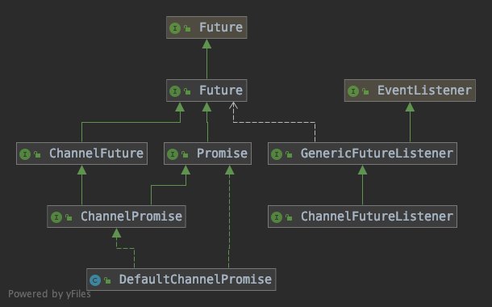

# Netty笔记-小知识点


### 判断一个数是否为2的幂

```java
private static boolean isPowerOfTwo(int val) {
  return (val & -val) == val;
}
```

or

```java
return (n > 0) && (n & (n -1) ==0)
```


### 通过反射操作构造方法创建对象

直接通过Class类中的newInstance()和获取getConstructor()有什么区别？

newInstance()方法, 只能通过空参的构造方法创建对象

getConstructor(Class<T>… parameterTypes)方法, 方法接受一个可变参数, 可以根据传入的类型来匹配对应的构造方法

```java
Class<? extends T> clazz= io.netty.channel.socket.nio.NioServerSocketChannel；

Constructor<? extends T> constructor = clazz.getConstructor(EventLoop.class, EventLoopGroup.class)
  
constructor.newInstance(eventLoop, childEventLoopGroup);
```

相当于：

```java
new NioServerSocketChannel(eventLoop, childEventLoopGroup)
```


### @Sharable

正常情况下同一个ChannelHandler,的不同的实例会被添加到不同的Channel管理的管线里面的，但是如果你需要全局统计一些信息，比如所有连接报错次数（exceptionCaught）等，这时候你可能需要使用单例的ChannelHandler，需要注意的是这时候ChannelHandler上需要添加@Sharable注解。


标注一个channel handler可以被多个channel安全地共享。

ChannelHandlerAdapter还提供了实用方法isSharable()。如果其对应的实现被标注为Sharable，那么这个方法将返回true，表示它可以被添加到多个ChannelPipeline中。

因为一个ChannelHandler可以从属于多个ChannelPipeline，所以它也可以绑定到多个ChannelHandlerContext实例。用于这种用法的ChannelHandler必须要使用@Sharable注解标注；否则，试图将它添加到多个ChannelPipeline时将会触发异常。显而易见，为了安全地被用于多个并发的Channel（即连接），这样的ChannelHandler必须是线程安全的。


### new抽象类

如果是抽象，可以通过`new Test() {}`来创建，如果抽象类中有抽象方法，则必须实现抽象方法，如下面第二个例子所示。在创建抽象类时，`{}`的作用，其实相当于创建一个抽象类的匿名实现类。

If the class instance creation expression ends in a class body, then the class being instantiated is an anonymous class. Then:

- If T denotes a class, then an anonymous direct subclass of the class named by T is declared. It is a compile-time error if the class denoted by T is a final class.
- If T denotes an interface, then an anonymous direct subclass of Object that implements the interface named by T is declared.
- In either case, the body of the subclass is the ClassBody given in the class instance creation expression.
- **The class being instantiated is the anonymous subclass.**

```java
public abstract class Test{
    public String tt(){
        return "tt";
    }
    public static void main(String[] args) {
        Test t = new Test() {};
        System.out.println(t.tt());
    }
}
```

```java
public abstract class Test{
    protected abstract void initChannel(Channel ch) throws Exception;
    public String tt(){
        return "tt";
    }
    public static void main(String[] args) {
        Test t = new Test() {
            @Override protected void initChannel(Channel ch) throws Exception {

            }
        };
        System.out.println(t.tt());
    }
}

```


### ExecutorService的execute和submit方法

1、接收的参数不一样

> <T> Future<T> submit(Callable<T> task);
>
> void execute(Runnable command);

2、submit有返回值，而execute没有

>Method submit extends base method Executor.execute by creating and returning a Future that can be used to cancel execution and/or wait for completion. 

3、submit方便Exception处理。在task里会抛出checked或者unchecked exception，而你又希望外面的调用者能够感知这些exception并做出及时的处理，那么就需要用到submit，通过捕获Future.get抛出的异常。

> There is a difference when looking at exception handling. If your tasks throws an exception and if it was submitted with `execute` this exception will go to the uncaught exception handler (when you don't have provided one explicitly, the default one will just print the stack trace to `System.err`). If you submitted the task with `submit` **any** thrown exception, checked or not, is then part of the task's return status. For a task that was submitted with `submit` and that terminates with an exception, the `Future.get` will rethrow this exception, wrapped in an `ExecutionException`.


### ChannelFuture



#### channelFuture

```java
                                      +---------------------------+
                                      | Completed successfully    |
                                      +---------------------------+
                                 +---->      isDone() = true      |
 +--------------------------+    |    |   isSuccess() = true      |
 |        Uncompleted       |    |    +===========================+
 +--------------------------+    |    | Completed with failure    |
 |      isDone() = false    |    |    +---------------------------+
 |   isSuccess() = false    |----+---->      isDone() = true      |
 | isCancelled() = false    |    |    |       cause() = non-null  |
 |       cause() = null     |    |    +===========================+
 +--------------------------+    |    | Completed by cancellation |
                                 |    +---------------------------+
                                 +---->      isDone() = true      |
                                      | isCancelled() = true      |
                                      +---------------------------+
```

channelFuture分为了四个状态，初始状态为uncompleted，isDone()所返回的状态为false，isSuccess()返回的状态为true，isCancelled()返回的状态为false，cause()所返回的异常为null。

接下来可以看到，可以改变为完成成功，完成失败，完成中被取消三个状态。

从上面也可以看到三个状态的改变也会改变channelFuture的三个状态量。首先不管状态如何改变，只要从未完成状态改变，isDone()都会变为true，然后成功isSuccess()会是true，被取消则isCancelled()则会变成true，异常发生则会cause()返回相应的异常类型。

以上就是channelFuture的基本，而channelPromise作为channelFuture的扩展，在实际作用中发挥上面的功能。

#### ChannelPromise

ChannelPromise是一种可写的特殊ChannelFuture。**允许设置I/O操作的结果，使ChannelFutureListener可以执行相关操作**

```java
public interface ChannelPromise extends ChannelFuture, Promise<Void>
```

#### Promise

```java
public interface Promise<V> extends Future<V>
```

#### netty中的Future

```java
public interface Future<V> extends java.util.concurrent.Future<V>
```

下面是一些比较重要方法的定义，其中addListener方法非常重要：

1. cause方法表示如果I/O操作失败，返回异常信息
2. cancel方法的boolean参数表示是否对已经开始执行的操作进行中断
3. isSuccess方法表示I/O操作是否已经成功的完成。**对于上述jdk中Future申明的isDone方法，只能知道I/O是否结束，有可能是成功完成、被取消、异常中断。netty中Future的此isSuccess方法能够很好的判断出操作是否正真地成功完成。**
4. sync方法阻塞直到future完成操作，如果操作失败会重新抛出异常
5. addListener方法会添加特定的监听器到future，这些监听器会在future isDone返回true的时候立刻被通知。这是netty中很重要的扩展方法，这里用到了观察者模式。

### AtomicReferenceFieldUpdater

SingleThreadEventExecutor.STATE_UPDATER

```java
private static final AtomicIntegerFieldUpdater<SingleThreadEventExecutor> STATE_UPDATER =
        AtomicIntegerFieldUpdater.newUpdater(SingleThreadEventExecutor.class, "state");
```

```java
STATE_UPDATER.compareAndSet(this, ST_NOT_STARTED, ST_STARTED)
```


### lambda表达式::new


### 零拷贝

零拷贝（zero-copy）是一种目前只有在使用 NIO 和 Epoll 传输时才可使用的特性。它使你可以快速 高效地将数据从文件系统移动到网络接口，而不需要将其从内核空间复制到用户空间，其在像 FTP 或者 HTTP 这样的协议中可以显著地提升性能。但是，并不是所有的操作系统都支持这一特性。特别地，它对 于实现了数据加密或者压缩的文件系统是不可用的——只能传输文件的原始内容。反过来说，传输已被 加密的文件则不是问题。


### http和socket通信的区别

应用层：HTTP协议（基于传输层的TCP协议，主要解决如何包装数据）
传输层： TCP协议（基于网络层的IP协议）、TPC/IP协议（主要解决数据如何在网络中传输）
网络层： IP 协议

socket则是对TCP/IP协议的封装和应用（程序员层面上），Socket本身并不是协议，而是一个调用接口（API，它只是提供了一个针对TCP或者UDP编程的接口），通过Socket，我们才能使用TCP/IP协议，实际上，Socket跟TCP/IP协议没有必然的联系。 

Socket编程接口在设计的时候，就希望也能适应其他的网络协议。所以说，Socket的出现只是使得程序员更方便地使用TCP/IP协议栈而已，是对TCP/IP协议的抽象，从而形成了我们知道的一些最基本的函数接口，比如create、 listen、connect、accept、send、read和write等等。

关于TCP /IP和HTTP协议的关系，网络有一段比较容易理解的介绍： 

>  “我们在传输数据时，可以只使用（传输层）TCP/IP协议，但是那样的话，如果没有应用层，便无法识别数据内容，如果想要使传输的数据有意义，则必须使用到应用层协议，应用层协议有很多，比如HTTP、FTP、TELNET等，也可以自己定义应用层协议。WEB使用HTTP协议作应用层协议，以封装 HTTP 文本信息，然后使用TCP/IP做传输层协议将它发到网络上。”  

网络有一段关于socket和TCP/IP协议关系的说法比较容易理解：   

> “TCP/IP只是一个协议栈，就像操作系统的运行机制一样，必须要具体实现，同时还要提供对外的操作接口。这个就像操作系统会提供标准的编程接口，比如win32编程接口一样，TCP/IP也要提供可供程序员做网络开发所用的接口，这就是Socket编程接口。”  

建立一个TCP连接需要经过“三次握手”，具体如下：
第一次握手：客户端发送请求包到服务器，等待服务器确认
第二次握手：服务器响应客户端请求，同时也发送一个回应包给客户端
第三次握手：客户端收到服务器的回应包后，向服务器发送确认包

握手过程中传送的包里，不包含数据，三次握手完毕后，客户端与服务端才正式的开始传递数据。
TCP一旦连接起来，在客户端和服务端任何一方主动关闭连接之前，TCP连接都将被一直保持下去。
断开连接时，服务器和客户端都可以主动发起断开TCP连接的请求，断开过程需要经过“四次握手”