# Netty笔记

## 一、Netty简介

Netty is a non-blocking framework. This leads to high throughput compared to blocking IO. **Understanding non-blocking IO is crucial to understanding Netty’s core components and their relationships.**


## 二、Netty组件

### 2.1 组件简介

#### Channel

Channel是Java NIO的基础。它表示一个开放的连接，进行IO操作。基本的 I/O 操作（ bind() 、 connect() 、 read() 和 write() ）依赖于底层网络传输所提 供的原语。在基于 Java 的网络编程中，其基本的构造是 class Socket 。Netty 的 Channel 接 口所提供的 API，大大地降低了直接使用 Socket 类的复杂性。

#### EventLoop

EventLoop 定义了 Netty 的核心抽象，用于处理连接的生命周期中所发生的事件。

#### ChannelHandler

它充当了所有 处理入站和出站数据的应用程序逻辑的容器。

ChannelHandler 的方法是 由网络事件（其中术语“事件”的使用非常广泛）触发的。事实上， ChannelHandler 可专 门用于几乎任何类型的动作，例如将数据从一种格式转换为另外一种格式，或者处理转换过程中所抛出的异常。

#### ChannelPipeline

ChannelPipeline 为 ChannelHandler 链提供了容器，并定义了用于在该链上传播入站 和出站事件流的 API。 当 Channel 被创建时，它会被自动地分配到它专属的 ChannelPipeline 。

#### Future/ChannelFuture

Netty中所有的I/O操作都是异步的。Netty提供了ChannelFuture，它的addListener()方法注册一个ChannelFutureListener，当操作完成时可以收到通知。

#### Bootstrap和ServerBootstrap 

Bootstrap 和 ServerBootstrap 这两个引导类分别是用来处理客户端和服务端的信息，服务器端的引导一个父 Channel 用来接收客户端的连接，一个子 Channel 用来处理客户端和服务器端之间的通信，客户端则只需要一个单独的、没有父 Channel 的 Channel 来去处理所有的网络交互（或者是无连接的传输协议，如 UDP）
**Bootstrap**
这个类主要是为客户端和无连接协议的应用程序创建 Channel, 创建步骤如下：

- Bootstrap 在 bind() 方法被调用之后创建一个新的 Channel

- Bootstrap 的 connect() 方法被调用后，也会创建一个新的 Channel

**ServerBootstrap**
对于引导服务器

- bind() 方法调用时，将会创建一个 ServerChannel
- 当连接被接受时，ServerChannel 将会创建一个新的子 Channel
- ServerChannel 和子 Channel 之间是一对多的关系

#### Encoders and Decoders

当我们使用网络协议时，我们需要执行数据序列化和反序列化。为此，Netty为了能够解码传入数据引入了ChannelInboundHandler的扩展解码器，大多数解码器的基类`ByteToMessageDecoder`。对于编码输出数据，Netty同样提供了ChannelOutboundHandler的扩展编码器， `MessageToByteEncoder`是大多数编码器实现的基础。


### 2.2 关系

#### 2.2.1 Reactor简介

##### 基于事件驱动模式的设计

基于事件驱动的架构设计通常比其他架构模型更加有效，因为可以节省一定的性能资源，事件驱动模式下通常不需要为每一个客户端建立一个线程，这意味这更少的线程开销，更少的上下文切换和更少的锁互斥，但任务的调度可能会慢一些，而且通常实现的复杂度也会增加，相关功能必须分解成简单的非阻塞操作，类似与GUI的事件驱动机制，当然也不可能把所有阻塞都消除掉，特别是GC， page faults(内存缺页中断)等。由于是基于事件驱动的，所以需要跟踪服务的相关状态（因为你需要知道什么时候事件会发生）;

下图是AWT中事件驱动设计的一个简单示意图，可以看到，在不同的架构设计中的基于事件驱动的IO操作使用的基本思路是一致的；

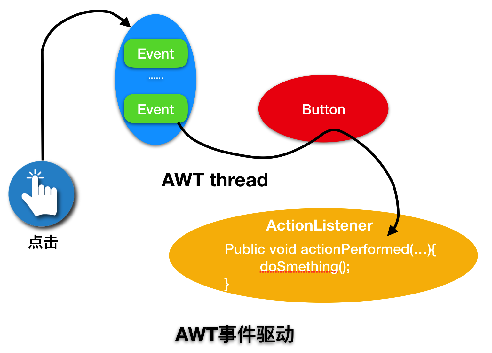

##### Reactor线程模型

**Reactor也可以称作反应器模式，它有以下几个特点：**
①　Reactor模式中会通过分配适当的handler(处理程序)来响应IO事件，类似与AWT 事件处理线程；
②　每个handler执行非阻塞的操作，类似于AWT ActionListeners 事件监听
③　通过将handler绑定到事件进行管理，类似与AWT addActionListener 添加事件监听；

**在多处理器场景下，为实现服务的高性能我们可以有目的的采用多线程模式：**
 1、增加Worker线程，专门用于处理非IO操作，因为通过上面的程序我们可以看到，反应器线程需要迅速触发处理流程，而如果处理过程也就是process()方法产生阻塞会拖慢反应器线程的性能，所以我们需要把一些非IO操作交给Woker线程来做；
 2、拆分并增加反应器Reactor线程，一方面在压力较大时可以饱和处理IO操作，提高处理能力；另一方面维持多个Reactor线程也可以做负载均衡使用；线程的数量可以根据程序本身是CPU密集型还是IO密集型操作来进行合理的分配；

**Reactor多线程设计模式具备以下几个特点**
①　通过卸载非IO操作来提升Reactor 线程的处理性能，这类似与POSA2 中Proactor的设计；
②　比将非IO操作重新设计为事件驱动的方式更简单；
③　但是很难与IO重叠处理，最好能在第一时间将所有输入读入缓冲区；（这里我理解的是最好一次性读取缓冲区数据，方便异步非IO操作处理数据）
④　可以通过线程池的方式对线程进行调优与控制，一般情况下需要的线程数量比客户端数量少很多；

下图来自于Doug Lea《Scalable IO in Java》，是Reactor多线程设计模式的一个示意图与示例代码（我们可以看到在这种模式中在Reactor线程的基础上把非IO操作放在了Worker线程中执行）：
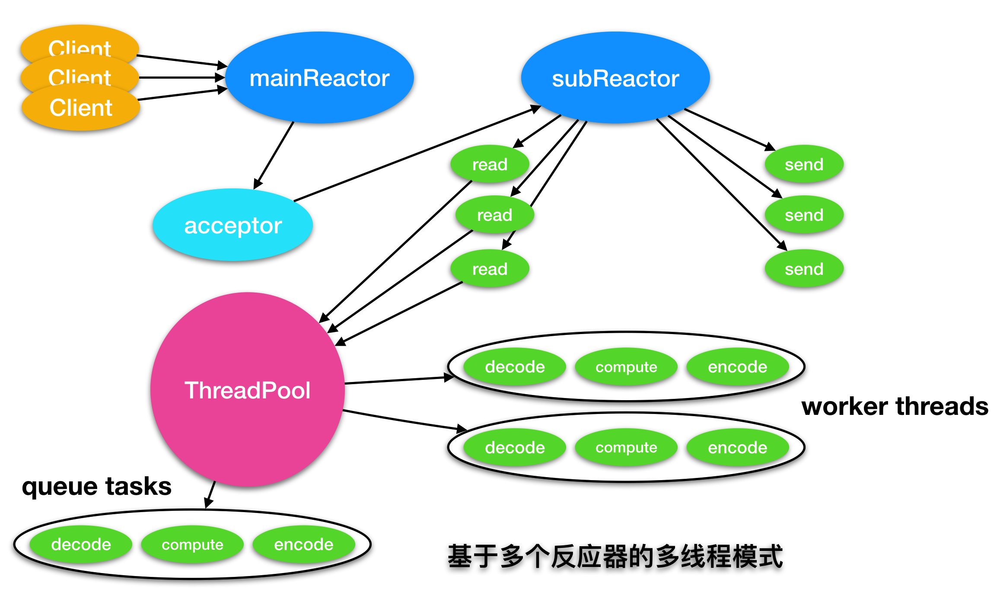

#### 2.2.2 Netty的reactor工作架构图

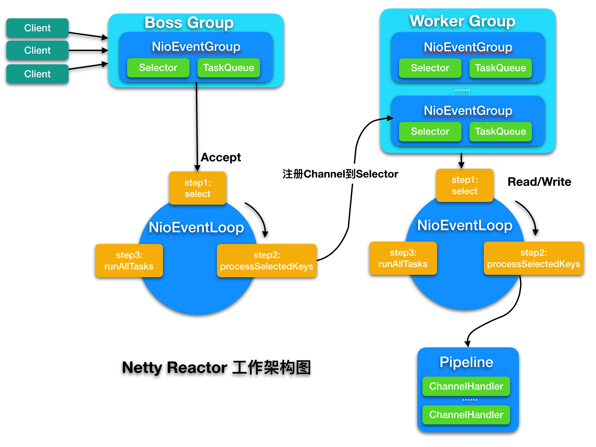

Server 端包含 1 个 Boss NioEventLoopGroup 和 1 个 Worker NioEventLoopGroup。
NioEventLoopGroup 相当于 1 个事件循环组，这个组里包含多个事件循环 NioEventLoop，每个 NioEventLoop 包含 1 个 Selector 和 1 个事件循环线程。

每个 Boss NioEventLoop 循环执行的任务包含 3 步：

1. 轮询 Accept 事件。
2. 处理 Accept I/O 事件，与 Client 建立连接，生成 NioSocketChannel，并将 NioSocketChannel 注册到某个 Worker NioEventLoop 的 Selector 上。
3. 处理任务队列中的任务，runAllTasks。任务队列中的任务包括用户调用 eventloop.execute 或 schedule 执行的任务，或者其他线程提交到该 eventloop 的任务。

每个 Worker NioEventLoop 循环执行的任务包含 3 步：

1. 轮询 Read、Write 事件。
2. 处理 I/O 事件，即 Read、Write 事件，在 NioSocketChannel 可读、可写事件发生时进行处理。
3. 处理任务队列中的任务，runAllTasks。

#### 2.2.3 selector处理逻辑

NIO 提供了一个所有 I/O 操作的全异步的实现。它利用了自 NIO 子系统被引入 JDK 1.4 时便可用的基于选择器的 API。

选择器背后的基本概念是充当一个注册表，在那里你将可以请求在Channel的状态变化时得到通知。可能的状态变化有：

- 新的Channel已被接受并且就绪；
- Channel连接已经完成；
- Channel有已经就绪的可供读取的数据；
- Channel可用于写数据。

选择器运行在一个检查状态变化并对其做出相应响应的线程上，在应用程序对状态的改变做 出响应之后，选择器将会被重置，并将重复这个过程。

对于所有 Netty 的传输实现都共有的用户级别 API 完全地隐藏了这些 NIO 的内部细节。 下图展示了该处理流程。

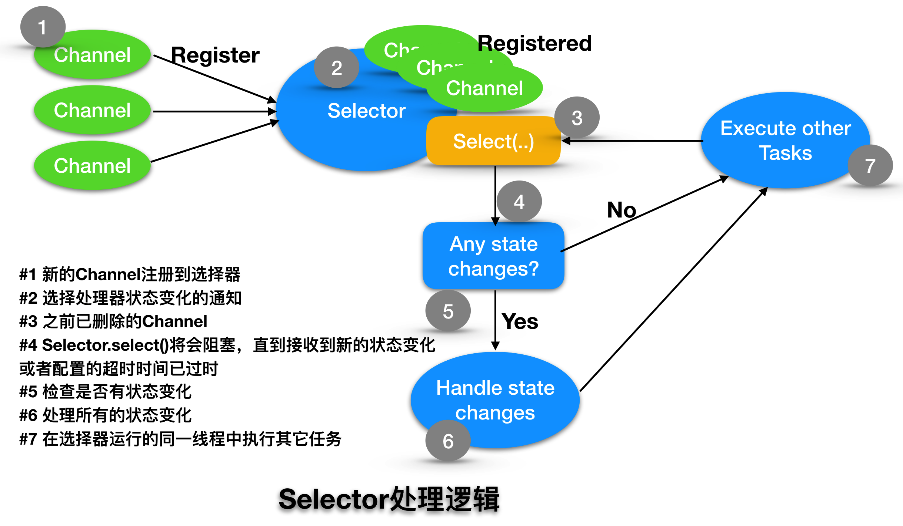


#### 2.2.4 Channel、EventLoop和EventLoopGroup关系

**EventLoop 定义了 Netty 的核心抽象，用于处理连接的生命周期中所发生的事件。**

- 一个 EventLoopGroup 包含一个或者多个 EventLoop ；
- 一个 EventLoop在它的生命周期内只和一个Thread绑定；
- 所有由 EventLoop 处理的 I/O 事件都将在它专有的 Thread 上被处理；
- 所有由 EventLoop 处理的 I/O 事件都将在它专有的 Thread 上被处理；
- 一个 EventLoop 可能会被分配给一个或多个 Channel 。

注意，在这种设计中，一个给定Channel的 I/O 操作都是由相同的Thread执行的，实际上消除了对于同步的需要。

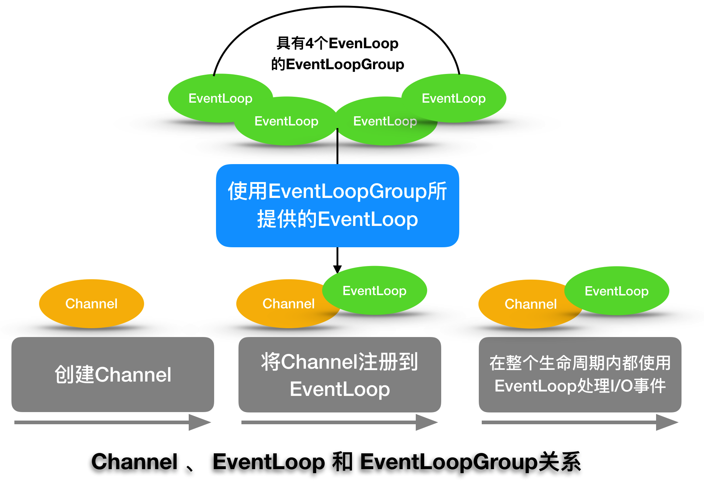

具有2个EventLoopGroup的服务器

有两种类型的引导：一种用于客户端（简单地称为 Bootstrap ）， 而另一种 （ ServerBootstrap ）用于服务器。ServerBootstrap 将绑定到一个 端口，因为服务器必须要监听连接，而 Bootstrap 则是由想要连接到远程节点的客户端应用程 序所使用的。

引导一个客户端只需要一个 EventLoopGroup ， 但是一个 ServerBootstrap 则需要两个（也可以是同一个实例）。

因为服务器需要两组不同的 Channel 。第一组将只包含一个 ServerChannel ，代表服务 器自身的已绑定到某个本地端口的正在监听的套接字。而第二组将包含所有已创建的用来处理传 入客户端连接（对于每个服务器已经接受的连接都有一个）的 Channel 。下图说明了这个模 型，并且展示了为何需要两个不同的 EventLoopGroup 。

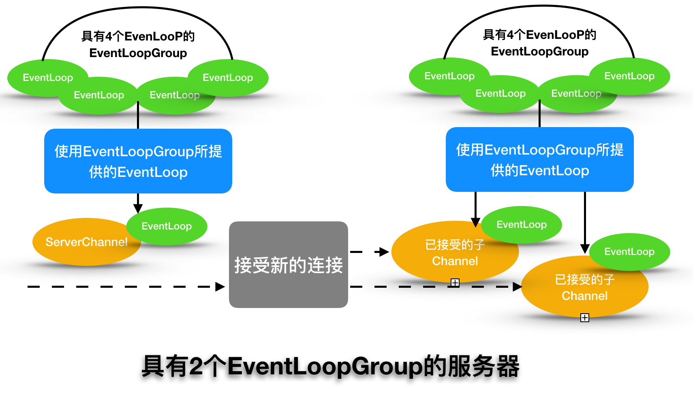


##### Netty线程管理

Netty线程模型的卓越性能取决于对于当前执行的 Thread 的身份的确定（通过调用 EventLoop 的 inEventLoop(Thread)方法实现），也就是说，确定 它是否是分配给当前 Channel 以及它的 EventLoop 的那一个线程。（ EventLoop 将负责处理一个 Channel 的整个生命周期内的所有事件。）

如果（当前）调用线程正是支撑 EventLoop 的线程，那么所提交的代码块将会被（直接） 执行。否则， EventLoop 将调度该任务以便稍后执行，并将它放入到内部队列中。当 EventLoop 下次处理它的事件时，它会执行队列中的那些任务/事件。这也就解释了任何的 Thread 是如何 与 Channel 直接交互而无需在 ChannelHandler 中进行额外同步的。

注意，每个 EventLoop 都有它自已的任务队列，独立于任何其他的 EventLoop。下图展示了 EventLoop 用于调度任务的执行逻辑。这是 Netty 线程模型的关键组成部分。

我们之前已经阐明了不要阻塞当前 I/O 线程的重要性。我们再以另一种方式重申一次：“永 远不要将一个长时间运行的任务放入到执行队列中，因为它将阻塞需要在同一线程上执行的任何 其他任务。”如果必须要进行阻塞调用或者执行长时间运行的任务，我们建议使用一个专门的 EventExecutor 。


##### 非阻塞传输的EventLoop分配方式

EventLoopGroup 负责为每个新创建的 Channel 分配一个 EventLoop。相同的 EventLoop 可能会被分配给多个 Channel 。一旦一个 Channel 被分配给一个 EventLoop ，它将在它的整个生命周期中都使用这个 EventLoop （以及相关联的 Thread ）。请牢记这一点，因为它可以使你从担忧你的 ChannelHandler 实现中的线程安全和同步问题中解脱出来。

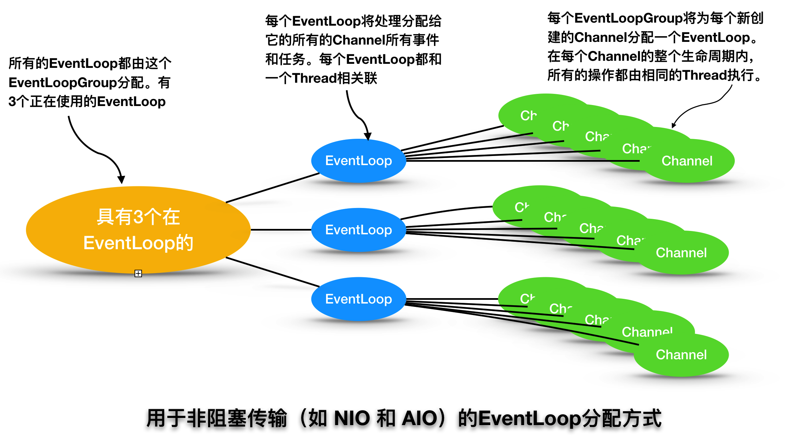

#### 2.2.5 ChannelPipeline

ChannelPipeline 是一个拦截流经 Channel 的入站和出站事件的 ChannelHandler 实例链。

每一个新创建的 Channel 都将会被分配一个新的 ChannelPipeline 。这项关联是永久性 的； Channel 既不能附加另外一个 ChannelPipeline ，也不能分离其当前的。

下图展示了一个典型的同时具有入站和出站 ChannelHandler 的 ChannelPipeline 的布局。一个出站 I/O 事件将从 ChannelPipeline 的最右边开始，然后向左传播。

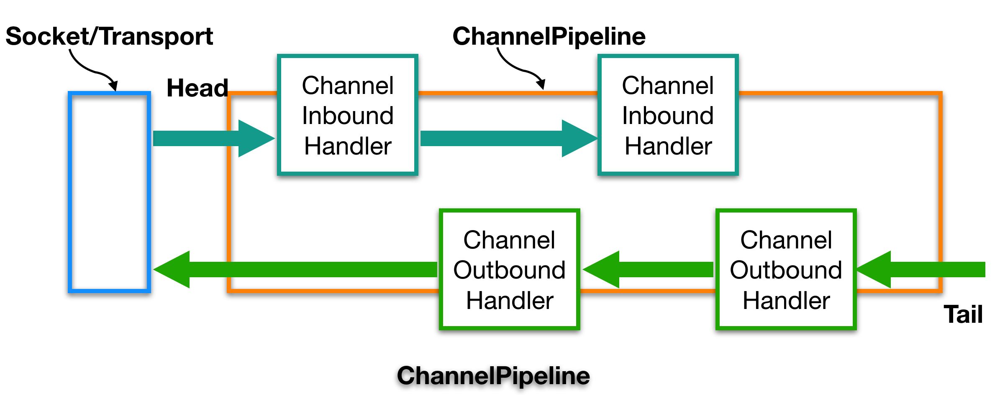

> Netty 总是将 ChannelPipeline 的入站口（图 6-3 中的左侧） 作为头部，而将出站口（该图的右侧）作为尾端。
>
> 当你完成了通过调用 ChannelPipeline.add*()方法将入站处理器（ChannelInboundHandler） 和 出 站 处 理 器 （ ChannelOutboundHandler ） 混 合 添 加 到 ChannelPipeline 之 后 ， 每一个 ChannelHandler 从头部到尾端的顺序位置正如同我们方才所定义它们的一样。因此，如果你将上图中的处理器（ChannelHandler）从左到右进行编号，那么第一个被入站事件看到的 ChannelHandler 将是 1，而第一个被出站事件看到的 ChannelHandler 将是 4。

在 ChannelPipeline 传播事件时，它会测试 ChannelPipeline 中的下一个 ChannelHandler 的类型是否和事件的运动方向相匹配。如果不匹配， ChannelPipeline 将跳过该 ChannelHandler 并前进到下一个，直到它找到和该事件所期望的方向相匹配的为止。（当然， ChannelHandler 也可以同时实现 ChannelInboundHandler 接口和 ChannelOutboundHandler 接口。）

##### ChannelHandlerContext

ChannelHandlerContext 使得 ChannelHandler 能够和它的 ChannelPipeline 以及其他的 ChannelHandler 交互。 ChannelHandler 可以通知其所属的 ChannelPipeline 中的下一个 ChannelHandler， 甚至可以动态修改它所属的 ChannelPipeline（修改 ChannelPipeline 中的 ChannelHandler 的编排）

##### Channel、ChannelPipeline、ChannelHandler 以及 ChannelHandlerContext 之间的关系

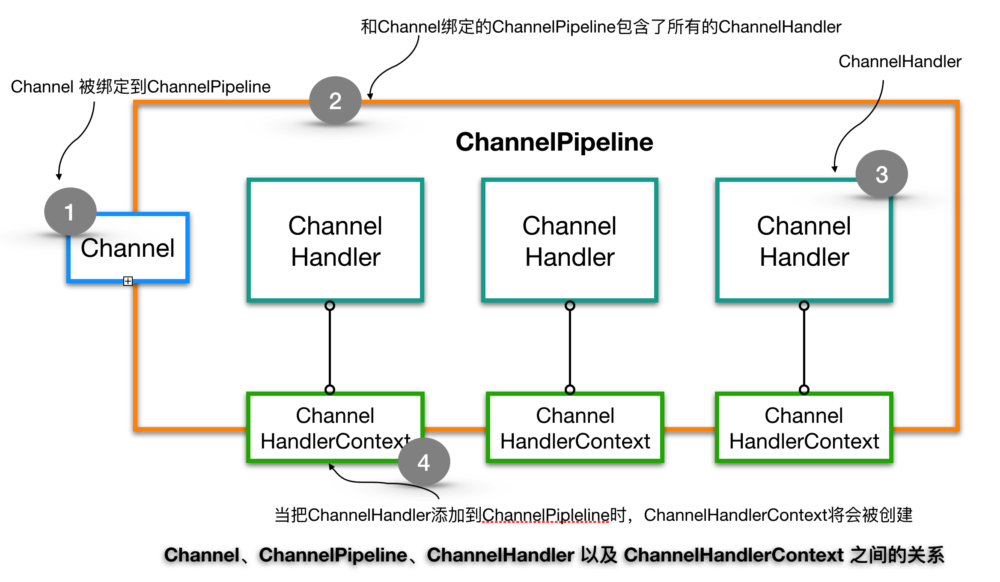

##### 通过Channel或者ChannelPipeline进行的事件传播

虽然被调用的 Channel 或 ChannelPipeline 上的 write() 方法将一直传播事件通 过整个 ChannelPipeline ，但是在 ChannelHandler 的级别上，事件从一个 ChannelHandler 到下一个 ChannelHandler 的移动是由 ChannelHandlerContext 上的调用完成的。

1. 事件被传递给了ChannelPipeline中的第一个ChannelHandler 

2. 通过使用与之相关联的ChannelHandlerContext，ChannelHandler将事件传递给了ChannelPipleline中的下一个ChannelHandler

3. 通过使用与之相关联的ChannelHandlerContext，ChannelHandler将事件传递给了ChannelPipleline中的下一个ChannelHandler

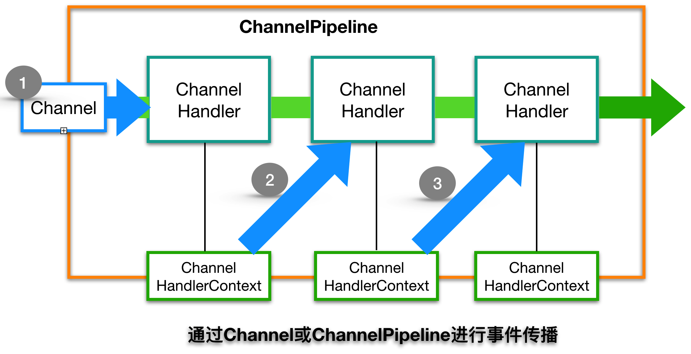


## 三、组件创建

### 3.1 EventLoopGroup创建

```java
EventLoopGroup bossGroup   = new MultithreadEventLoopGroup(1, NioHandler.newFactory());
EventLoopGroup workerGroup = new MultithreadEventLoopGroup(NioHandler.newFactory());
```

#### 创建NioHandler

先看一下`NioHandler.newFactory()`代码

```java
public static IoHandlerFactory newFactory() {
    return NioHandler::new;
}
```

#### MultithreadEventLoopGroup构造方法

bossGroup nThreads值为1，如果nThreads为0，则给个默认值，我机器的默认值为32，workerGroup为32。
创建MultithreadEventLoopGroup执行线程。

```java
protected MultithreadEventLoopGroup(int nThreads, Executor executor,
                                 IoHandlerFactory ioHandlerFactory,
                                 int maxPendingTasks, RejectedExecutionHandler rejectedHandler,
                                 int maxTasksPerRun, Object... args) {
  //如果nThreads为0，则给个默认值，我机器的默认值为32，bossGroup值为1，workerGroup为32
  //创建MultithreadEventLoopGroup执行线程  
  super(pickThreadCount(nThreads),
            executor == null ? new ThreadPerTaskExecutor(newDefaultThreadFactory()) : executor,
            maxPendingTasks, rejectedHandler, merge(ioHandlerFactory, maxTasksPerRun, args));
  
}
```

```java
protected MultithreadEventLoopGroup(int nThreads, ThreadFactory threadFactory,
                                 IoHandlerFactory ioHandlerFactory,
                                 int maxPendingTasks, RejectedExecutionHandler rejectedHandler,
                                 int maxTasksPerRun, Object... args) {
    super(pickThreadCount(nThreads), threadFactory == null ? newDefaultThreadFactory() : threadFactory,
            maxPendingTasks, rejectedHandler, merge(ioHandlerFactory, maxTasksPerRun, args));
  //将IoHandlerFactory，即NioHandler放入args
}
```

```java
protected MultithreadEventExecutorGroup(int nThreads, Executor executor, int maxPendingTasks,
                                        RejectedExecutionHandler rejectedHandler, Object... args) {
    //...
    children = new EventExecutor[nThreads];
    powerOfTwo = isPowerOfTwo(children.length);
    for (int i = 0; i < nThreads; i ++) {
        boolean success = false;
        try {
            //<---创建SingleThreadEventExecutor
            children[i] = newChild(executor, maxPendingTasks, rejectedHandler, args); 
            success = true;
        } //...
}
```

#### ThreadPerTaskExecutor执行器创建

ThreadPerTaskExecutor中是MultithreadEventLoopGroup

```java
private static ThreadFactory newDefaultThreadFactory() {
    return new DefaultThreadFactory(MultithreadEventLoopGroup.class, Thread.MAX_PRIORITY);
}
```


### SingleThreadEventExecutor创建

MultithreadEventLoopGroup#newChild 

1、args[0]中是NioHandler

2、executor为ThreadPerTaskExecutor，即MultithreadEventLoopGroup

```java
protected final EventLoop newChild(Executor executor, int maxPendingTasks,
                                       RejectedExecutionHandler rejectedExecutionHandler, Object... args) {
  			//args[0]中是NioHandler
        return newChild(executor, maxPendingTasks, rejectedExecutionHandler,
                ((IoHandlerFactory) args[0]).newHandler(), (Integer) args[1],
                Arrays.copyOfRange(args, 2, args.length));
    }

protected EventLoop newChild(Executor executor, int maxPendingTasks,
                             RejectedExecutionHandler rejectedExecutionHandler,
                             IoHandler ioHandler, int maxTasksPerRun,
                             Object... args) {
    assert args.length == 0;
    return new SingleThreadEventLoop(executor, ioHandler, maxPendingTasks,
            rejectedExecutionHandler, maxTasksPerRun);
}
```


#### SingleThreadEventExecutor添加任务

```java
@Override
public void execute(Runnable task) {
    requireNonNull(task, "task");

    boolean inEventLoop = inEventLoop();
    addTask(task);
    if (!inEventLoop) {
        startThread();
        //....
    }

    if (!addTaskWakesUp && wakesUpForTask(task)) {
        wakeup(inEventLoop);
    }
}
```

SingleThreadEventExecutor#execute -> startThread -> doStartThread -> SingleThreadEventLoop#run

```java
private void doStartThread() {
    assert thread == null;
    executor.execute(() -> {
        thread = Thread.currentThread();
        //...
        try {
            run();
            success = true;
        //....
```


```java
protected void run() {
    assert inEventLoop();
    do {
        Runnable task = takeTask(); // 执行任务  <--------
        if (task != null) {
            task.run();
            updateLastExecutionTime();
        }
    } while (!confirmShutdown());
}
```


### 3.2 Channel创建

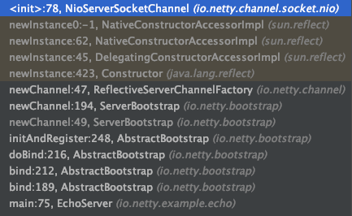


```java
ServerBootstrap b = new ServerBootstrap();
b.group(bossGroup, workerGroup)
 .channel(NioServerSocketChannel.class)
ChannelFuture f = b.bind(PORT).sync();
```

先绑定。通过`.channel(NioServerSocketChannel.class)`绑定NioServerSocketChannel

```java
public ServerBootstrap channel(Class<? extends ServerChannel> channelClass) {
    requireNonNull(channelClass, "channelClass");
    return channelFactory(new ReflectiveServerChannelFactory<ServerChannel>(channelClass));
}
```

```java
public ReflectiveServerChannelFactory(Class<? extends T> clazz) {
    requireNonNull(clazz, "clazz");
    try {
        this.constructor = clazz.getConstructor(EventLoop.class, EventLoopGroup.class);
    } catch (NoSuchMethodException e) {
        //...
    }
}
```

再通过NioServerSocketChannel创建Channel

```java
ChannelFuture f = b.bind(PORT).sync();
```

```java
public ChannelFuture bind(int inetPort) {
    return bind(new InetSocketAddress(inetPort));
}
```

```java
final ChannelFuture initAndRegister() {
    EventLoop loop = group.next();
    final Channel channel;
    try {
        channel = newChannel(loop);
   //..
```

```java
ServerChannel newChannel(EventLoop eventLoop) throws Exception {
    return channelFactory.newChannel(eventLoop, childGroup);
}
```

```java
public T newChannel(EventLoop eventLoop, EventLoopGroup childEventLoopGroup) {
    try {
        return constructor
                .newInstance(eventLoop, childEventLoopGroup);
   //...
```

反射调用NioServerSocketChannel构造方法创建Channel： NioServerSocketChannel

```java
public NioServerSocketChannel(EventLoop eventLoop, EventLoopGroup childEventLoopGroup) {
    this(eventLoop, childEventLoopGroup, newSocket(DEFAULT_SELECTOR_PROVIDER));
}
```

NioServerSocketChannel实现了Channel接口。看一下它的类继承关系

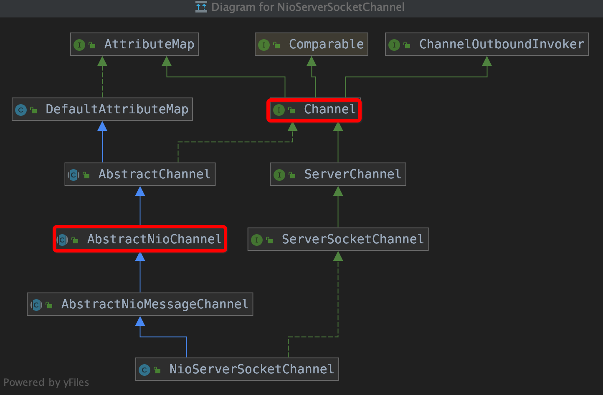


### 3.3 ChannelPipeline创建

```java
public NioServerSocketChannel(
        EventLoop eventLoop, EventLoopGroup childEventLoopGroup, ServerSocketChannel channel) {
    super(null, eventLoop, channel, SelectionKey.OP_ACCEPT);
    this.childEventLoopGroup = requireNonNull(childEventLoopGroup, "childEventLoopGroup");
    config = new NioServerSocketChannelConfig(this, javaChannel().socket());
}
```

继续NioServerSocketChannel构造函数，看可以看到，在创建NioServerSocketChannel的时候，会先调用父类super创建父类AbstractChannel

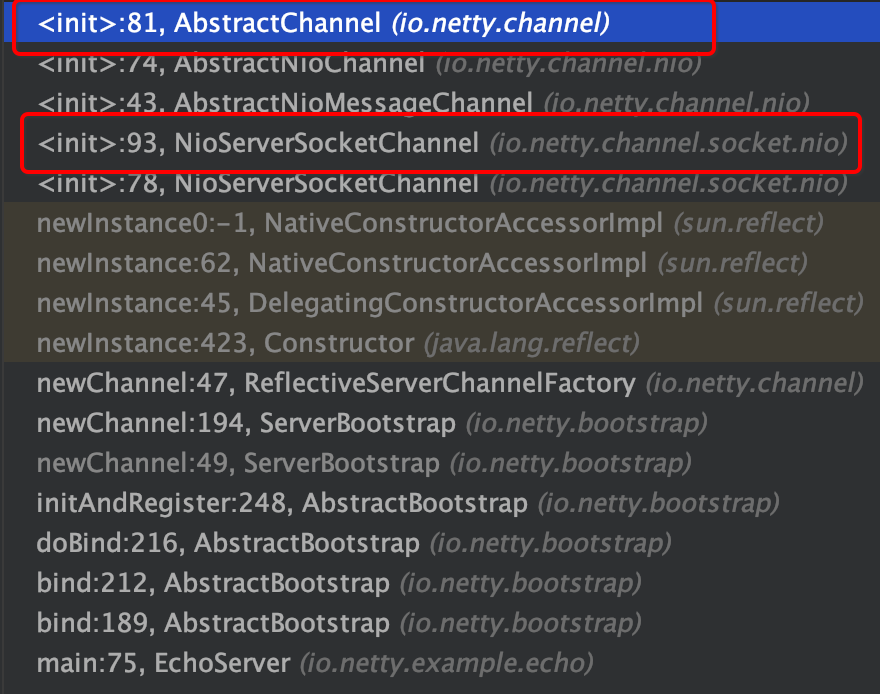


下面可以看到创建了newChannelPipeline: `pipeline = newChannelPipeline();`

```java
protected AbstractChannel(Channel parent, EventLoop eventLoop) {
    this.parent = parent;
    this.eventLoop = validateEventLoop(eventLoop);
    closeFuture = new CloseFuture(this, eventLoop);
    succeedFuture = new SucceededChannelFuture(this, eventLoop);
    id = newId();
    unsafe = newUnsafe();
    pipeline = newChannelPipeline();
}
```

Channel（NioServerSocketChannel）创建时，每个channel都会有的属性：

- ChannelFuture succeedFuture （新创建）
- EventLoop eventLoop
- ChannelId id（新创建）
- ChannelPipeline pipeline（新创建）


# #

-------

###  Bootstrap


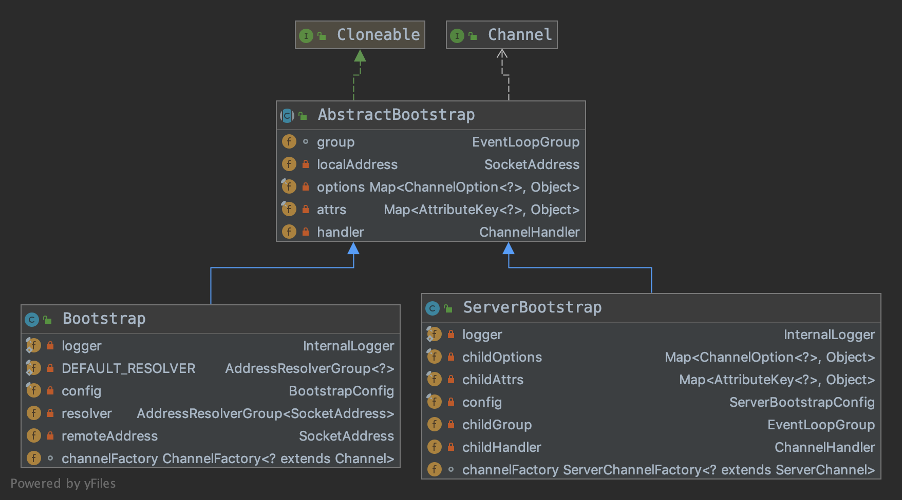

#### ServerBootstrap

ServerBootstrap#init代码片段

```java
@Override
ChannelFuture init(Channel channel) {
    final ChannelPromise promise = channel.newPromise();
    setChannelOptions(channel, options0().entrySet().toArray(newOptionArray(0)), logger);
    setAttributes(channel, attrs0().entrySet().toArray(newAttrArray(0)));

    ChannelPipeline p = channel.pipeline();

    final ChannelHandler currentChildHandler = childHandler;
    final Entry<ChannelOption<?>, Object>[] currentChildOptions =
            childOptions.entrySet().toArray(newOptionArray(0));
    final Entry<AttributeKey<?>, Object>[] currentChildAttrs = childAttrs.entrySet().toArray(newAttrArray(0));

    p.addLast(new ChannelInitializer<Channel>() {
        @Override
        public void initChannel(final Channel ch) {
            final ChannelPipeline pipeline = ch.pipeline();
            ChannelHandler handler = config.handler();
            if (handler != null) {
                pipeline.addLast(handler);
            }

            ch.eventLoop().execute(() -> {
                pipeline.addLast(new ServerBootstrapAcceptor(
                        ch, currentChildHandler, currentChildOptions, currentChildAttrs));
                promise.setSuccess();
            });
        }
    });
    return promise;
}
```


`MultithreadEventExecutorGroup`


创建MultithreadEventExecutorGroup时（`new MultithreadEventLoopGroup(1, NioHandler.newFactory())`）做了：

1. 创建Executor executor：`ThreadPerTaskExecutor`。`ThreadPerTaskExecutor`中是`DefaultThreadFactory`。

   执行时执行时：executor.execute(Runnable command)，是为执行DefaultThreadFactory.newThread(Runnable r)。

2. 创建`RejectedExecutionHandlers`

3. 如果默认传空nThreads，则默认创建个数：`NettyRuntime.availableProcessors() * 2`，我的是值是32

4. 创建数组EventExecutor[] children。数组值等于nThreads。

   `new SingleThreadEventLoop(executor, ioHandler, maxPendingTasks, rejectedExecutionHandler, maxTasksPerRun)`

干活儿的还是SingleThreadEventLoop和它的的父类SingleThreadEventExecutor

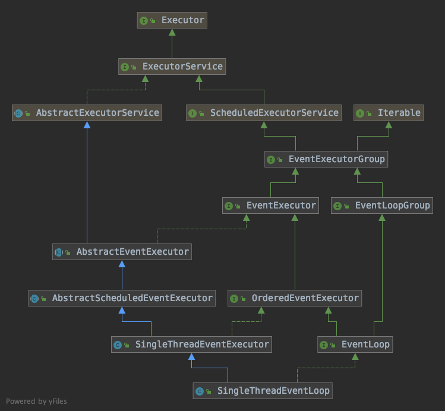

### Channel

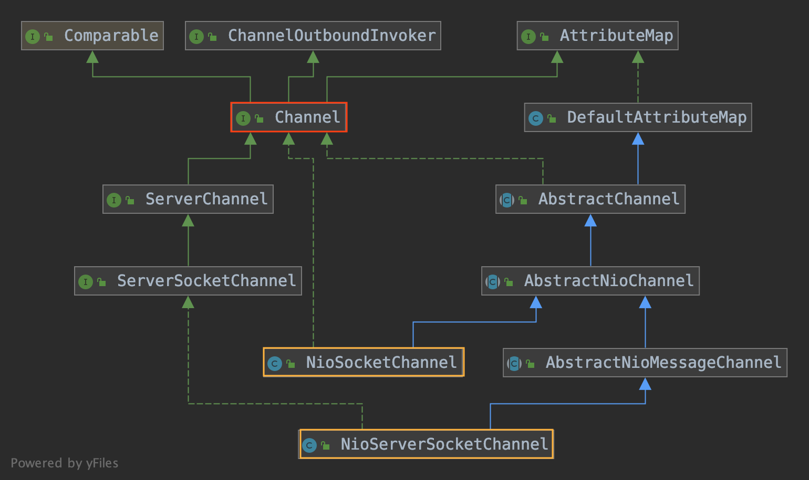

```java
ServerBootstrap b = new ServerBootstrap();
b.channel(NioServerSocketChannel.class)
```

通过反射创建`NioServerSocketChannel`


### Handler

```java
ServerBootstrap b = new ServerBootstrap();
b.handler(new LoggingHandler(LogLevel.INFO))
 .childHandler(new ChannelInitializer<SocketChannel>() {
    @Override
    public void initChannel(SocketChannel ch) throws Exception {
      ChannelPipeline p = ch.pipeline();
      if (sslCtx != null) {
        p.addLast(sslCtx.newHandler(ch.alloc()));
      }
      //p.addLast(new LoggingHandler(LogLevel.INFO));
      p.addLast(serverHandler);
    }
  });
```

`b.handler`被调用关系链：

AbstractBootstrap#handler(new LoggingHandler(LogLevel.INFO)) -> AbstractBootstrap#handler -> AbstractBootstrapConfig#handler() -> ServerBootstrap#init

b.childHandler`被调用关系链：

ServerBootstrap#childHandler(new ChannelInitializer()) -> ServerBootstrap#childHandler(childHandler) -> ServerBootstrap#init


`.childHandler(new ChannelInitializer<SocketChannel>() {};` debug展示的内容是：`EchoServer$1@1463`，看到`$1`，说明是匿名内部类。通过反射查看ChannelInitializer的子类，也可以看到Anonymous in main() in EchoServer。


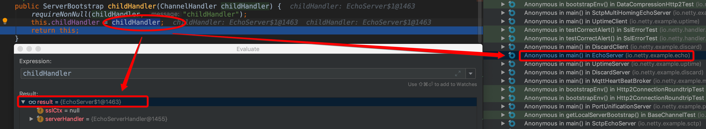


### ChannelInitializer

netty提供了一种将多个ChannelHandler添加到一个ChannelPipeline中的简便方法。你只需要简单地向Bootstrap或ServerBootstrap的实例提供你的ChannelInitializer实现即可，并且一旦Channel被注册到了它的EventLoop之后，就会调用你的initChannel()版本。在该方法返回之后，ChannelInitializer的实例将会从ChannelPipeline中移除它自己。

在大部分的场景下，如果你不需要使用只存在于SocketChannel上的方法，使用ChannelInitializer就可以了，否则你可以使用ChannelInitializer，其中SocketChannel扩展了Channel。 如果你的应用程序使用了多个ChannelHandler，请定义你自己的ChannelInitializer实现来将它们安装到ChannelPipeline中。


### ChannelFuture

实例化NioServerSocketChannel

```java
ServerBootstrap b = new ServerBootstrap();
//....
ChannelFuture f = b.bind(PORT).sync();
```

AbstractBootstrap#bind -> doBind

1. ChannelFuture regFuture = initAndRegister()。创建Channel和ChannelPipeline: NioServerSocketChannel和DefaultChannelPipeline 
2. 创建ChannelPromise：DefaultChannelPromise。
3. 判断是否regFuture完成。……..

```java
private static final SelectorProvider DEFAULT_SELECTOR_PROVIDER = SelectorProvider.provider();
private static ServerSocketChannel newSocket(SelectorProvider provider) {
  return provider.openServerSocketChannel();
}
private final ServerSocketChannelConfig config;
private final EventLoopGroup childEventLoopGroup;

public NioServerSocketChannel(EventLoop eventLoop, EventLoopGroup childEventLoopGroup, SelectorProvider provider) {
    this(eventLoop, childEventLoopGroup, newSocket(provider));
}

public NioServerSocketChannel(
        EventLoop eventLoop, EventLoopGroup childEventLoopGroup, ServerSocketChannel channel) {
    super(null, eventLoop, channel, SelectionKey.OP_ACCEPT);
    this.childEventLoopGroup = requireNonNull(childEventLoopGroup, "childEventLoopGroup");
    config = new NioServerSocketChannelConfig(this, javaChannel().socket());
}
```


#### initAndRegister

1. AbstractBootstrap#initAndRegister。**创建Channel和ChannelPipeline: NioServerSocketChannel和DefaultChannelPipeline**。从MultithreadEventLoopGroup中取出EventLoop，通过NioServerSocketChannel将EventLoop注册到AbstractChannel（closeFuture和succeedFuture）。过程如下：newChannel -> ServerBootstrap#newChannel -> channelFactory#newChannel -> ReflectiveServerChannelFactory#newChannel -> constructor#newInstance -> NioServerSocketChannel(eventLoop, childEventLoopGroup)

   DefaultChannelPipeline是在NioServerSocketChannel的抽象类AbstractChannel中实例化。

2. 创建ChannelPromise。channel.newPromise() -> new DefaultChannelPromise(this, eventLoop)

3. 

4. loop.execute -> SingleThreadEventLoop.execute(Runnable task)

   1. SingleThreadEventExecutor#execute -> startThread -> doStartThread -> `SingleThreadEventExecutor.this.run()` -> SingleThreadEventLoop#run -> runIo -> `NioHandler.run(IoExecutionContext context)`
   2. init(channel)。
   3. promise#addListener，

   


```java
final ChannelFuture initAndRegister() {
    EventLoop loop = group.next();
    final Channel channel;
    try {
        channel = newChannel(loop);
    } catch (Throwable t) {
        return new FailedChannel(loop).newFailedFuture(t);
    }

    final ChannelPromise promise = channel.newPromise();
    //ServerBootstrap初始化init
    loop.execute(() -> init(channel).addListener((ChannelFutureListener) future -> {
        if (future.isSuccess()) {
            channel.register(promise);
        } else {
            channel.unsafe().closeForcibly();
            promise.setFailure(future.cause());
        }
    }));

    return promise;
}
```


AbstractChannel#AbstractChannel

```java
protected AbstractChannel(Channel parent, EventLoop eventLoop) {
    this.parent = parent;
    this.eventLoop = validateEventLoop(eventLoop);
    closeFuture = new CloseFuture(this, eventLoop);
    succeedFuture = new SucceededChannelFuture(this, eventLoop);
    id = newId();
    unsafe = newUnsafe();
    pipeline = newChannelPipeline();
}
```


##### init(Channel channel)

创建ChannelPromise，new DefaultChannelPromise(this, eventLoop)。


```java
ChannelFuture init(Channel channel) {
    final ChannelPromise promise = channel.newPromise();
    setChannelOptions(channel, options0().entrySet().toArray(newOptionArray(0)), logger);
    setAttributes(channel, attrs0().entrySet().toArray(newAttrArray(0)));

    ChannelPipeline p = channel.pipeline();

    final ChannelHandler currentChildHandler = childHandler;
    final Entry<ChannelOption<?>, Object>[] currentChildOptions =
            childOptions.entrySet().toArray(newOptionArray(0));
    final Entry<AttributeKey<?>, Object>[] currentChildAttrs = childAttrs.entrySet().toArray(newAttrArray(0));

    p.addLast(new ChannelInitializer<Channel>() {
        @Override
        public void initChannel(final Channel ch) {
            final ChannelPipeline pipeline = ch.pipeline();
            ChannelHandler handler = config.handler();
            if (handler != null) {
                pipeline.addLast(handler);
            }

            ch.eventLoop().execute(() -> {
                pipeline.addLast(new ServerBootstrapAcceptor(
                        ch, currentChildHandler, currentChildOptions, currentChildAttrs));
                promise.setSuccess();
            });
        }
    });
    return promise;
}
```


### `ChannelPipeline`


ChannelPipeline是一个拦截流经Channel的入站和出站事件的ChannelHandler实例链。

每一个新创建的Channel都将会被分配一个新的ChannelPipeline。这项关联是永久性的；Channel既不能附加另外一个ChannelPipeline，也不能分离其当前的。在Netty组件的生命周期中，这是一项固定的操作，不需要开发人员的任何干预。 根据事件的起源，事件将会被ChannelInboundHandler或者ChannelOutbboundHandler处理。随后，通过调用ChannelHandlerContext实现，它将被转发给同一超类型的下一个ChannelHandler。

### ChannelPipeline添加顺序

对于进站事件来说，先添加的先执行。 对于出站事件来说，后添加的先执行。


### SimpleChannelInboundHandler

当某个ChannelInboundHandler的实现重写channelRead()方法时，它将负责显式地释放与池化的ByteBuf实例相关的内存。Netty为此提供了一个实用方法ReferenceCountUtil.release() 但是以这种方式管理资源可能很繁琐。

一个更加简单的方式是使用SimpleChannelInboundHandler。 由于SimpleChannelInboundHandler会自动释放资源，所以你不应该存储指向任何消息的引用供将来使用，因为这些引用都将会失效。


## 顺一下类关系

```java
public class DefaultChannelPromise extends DefaultPromise<Void> implements ChannelPromise, FlushCheckpoint {

    private final Channel channel;
    private long checkpoint;
```


`AbstractEventExecutor`创建`RunnableFutureAdapter`

`new RunnableFutureAdapter<>(promise, Executors.callable(task, value));`

`AbstractExecutorService.submit(Callable<T> task)`-> `AbstractExecutorService.newTaskFor(Callable<T> callable)`


AbstractEventExecutorGroup#submit -> AbstractEventExecutor#submit -> AbstractEventExecutor#newTaskFor ->new RunnableFutureAdapter

```java
protected <T> RunnableFuture<T> newTaskFor(Callable<T> callable) {
    return newRunnableFuture(this.newPromise(), callable);
}
private static <V> RunnableFuture<V> newRunnableFuture(Promise<V> promise, Callable<V> task) {
  return new RunnableFutureAdapter<>(promise, task);
}
```

