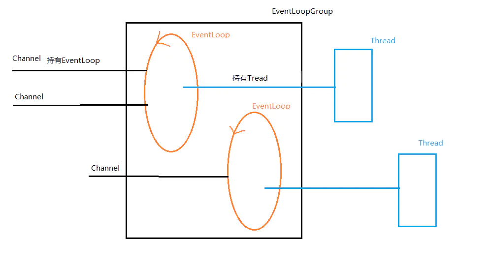
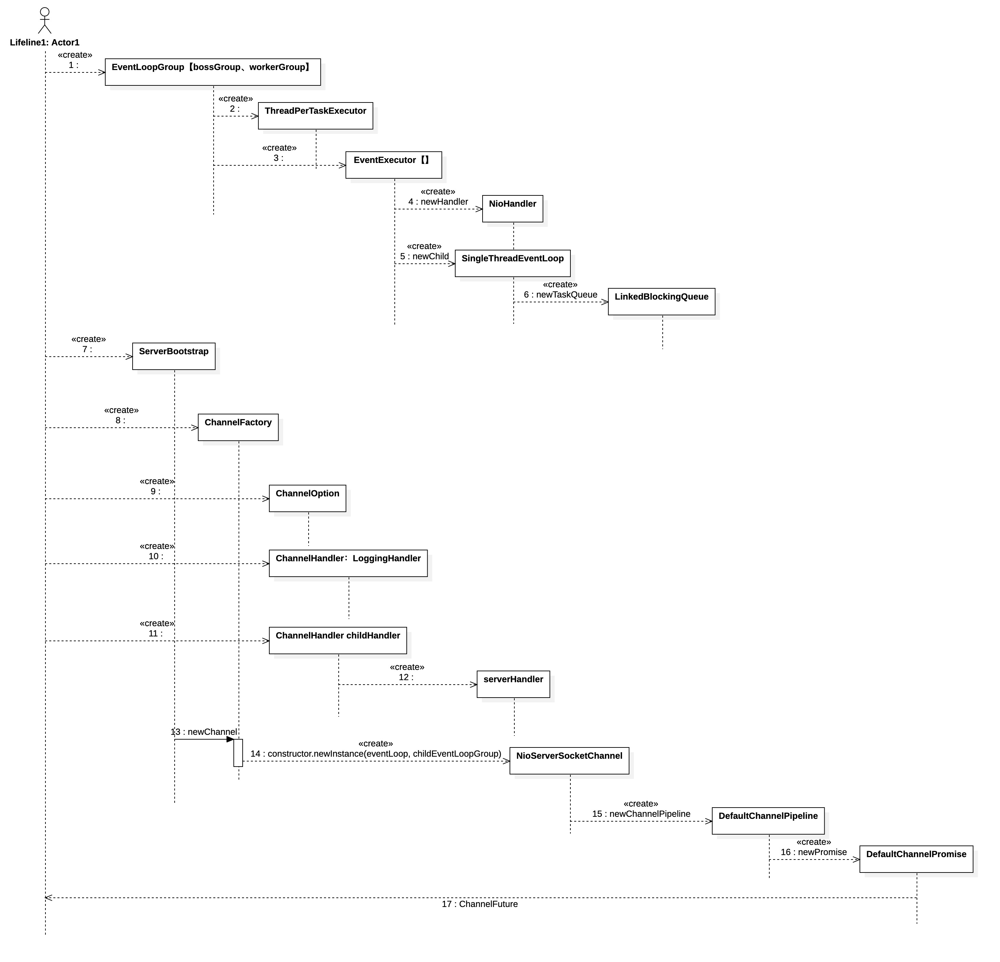
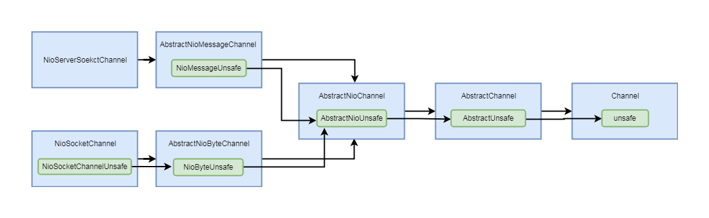
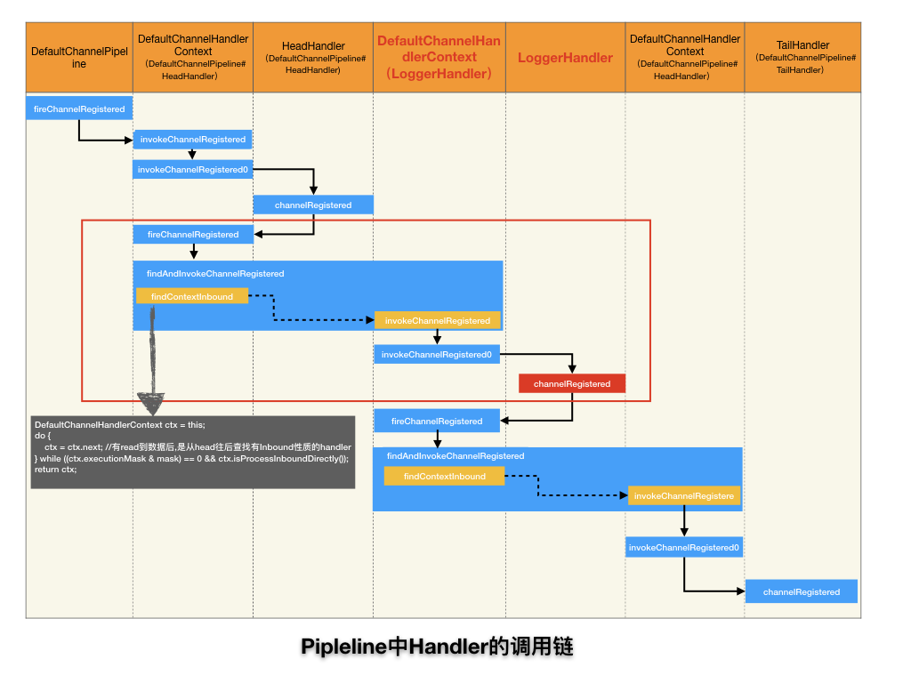
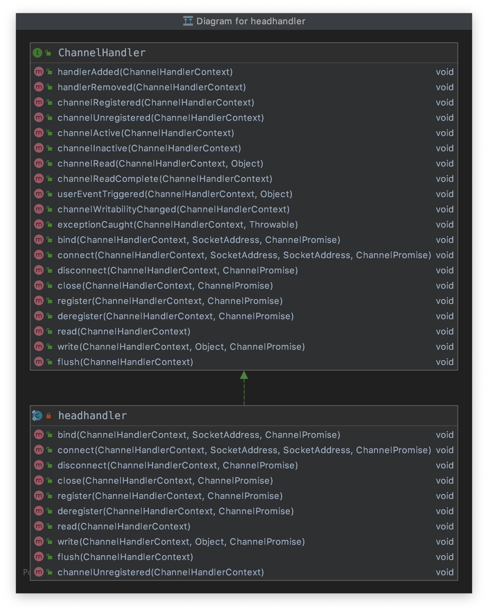
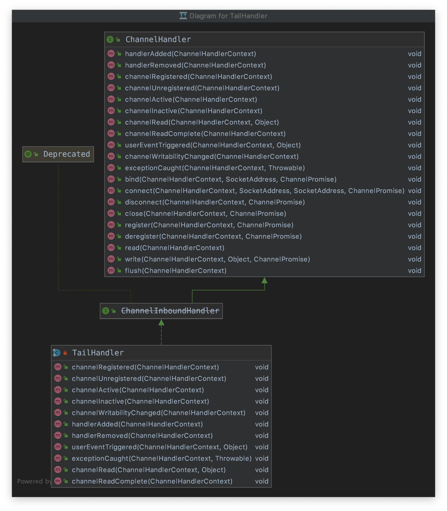

# Netty笔记

Netty分析版本：4.1

## 一、Netty简介

Netty is a non-blocking framework. This leads to high throughput compared to blocking IO. **Understanding non-blocking IO is crucial to understanding Netty’s core components and their relationships.**

Netty是一个异步的事件驱动的网络应用框架，基于NIO。

## 二、Netty组件

### 2.1 组件简介

#### Channel

Channel是Java NIO的基础。它表示一个开放的连接，进行IO操作。基本的 I/O 操作（ bind() 、 connect() 、 read() 和 write() ）依赖于底层网络传输所提 供的原语。在基于 Java 的网络编程中，其基本的构造是 class Socket 。Netty 的 Channel 接 口所提供的 API，大大地降低了直接使用 Socket 类的复杂性。

#### EventLoop

EventLoop 定义了 Netty 的核心抽象，用于处理连接的生命周期中所发生的事件。

#### ChannelHandler

它充当了所有 处理入站和出站数据的应用程序逻辑的容器。

ChannelHandler 的方法是由网络事件（其中术语“事件”的使用非常广泛）触发的。事实上， ChannelHandler 可专 门用于几乎任何类型的动作，例如将数据从一种格式转换为另外一种格式，或者处理转换过程中所抛出的异常。

#### ChannelPipeline

ChannelPipeline 为 ChannelHandler 链提供了容器，并定义了用于在该链上传播入站 和出站事件流的 API。 当 Channel 被创建时，它会被自动地分配到它专属的 ChannelPipeline 。

#### Future/ChannelFuture

Netty中所有的I/O操作都是异步的。Netty提供了ChannelFuture，它的addListener()方法注册一个ChannelFutureListener，当操作完成时可以收到通知。

#### Bootstrap和ServerBootstrap 

Bootstrap 和 ServerBootstrap 这两个引导类分别是用来处理客户端和服务端的信息，服务器端的引导一个父 Channel 用来接收客户端的连接，一个子 Channel 用来处理客户端和服务器端之间的通信，客户端则只需要一个单独的、没有父 Channel 的 Channel 来去处理所有的网络交互（或者是无连接的传输协议，如 UDP）
**Bootstrap**
这个类主要是为客户端和无连接协议的应用程序创建 Channel, 创建步骤如下：

- Bootstrap 在 bind() 方法被调用之后创建一个新的 Channel

- Bootstrap 的 connect() 方法被调用后，也会创建一个新的 Channel

**ServerBootstrap**
对于引导服务器

- bind() 方法调用时，将会创建一个 ServerChannel
- 当连接被接受时，ServerChannel 将会创建一个新的子 Channel
- ServerChannel 和子 Channel 之间是一对多的关系

#### Encoders and Decoders

 当我们使用网络协议时，我们需要执行数据序列化和反序列化。为此，Netty为了能够解码传入数据引入了ChannelInboundHandler的扩展解码器，大多数解码器的基类`ByteToMessageDecoder`。对于编码输出数据，Netty同样提供了ChannelOutboundHandler的扩展编码器， `MessageToByteEncoder`是大多数编码器实现的基础。


### 2.2 关系

#### 2.2.1 Reactor简介

##### 基于事件驱动模式的设计

基于事件驱动的架构设计通常比其他架构模型更加有效，因为可以节省一定的性能资源，事件驱动模式下通常不需要为每一个客户端建立一个线程，这意味这更少的线程开销，更少的上下文切换和更少的锁互斥，但任务的调度可能会慢一些，而且通常实现的复杂度也会增加，相关功能必须分解成简单的非阻塞操作，类似与GUI的事件驱动机制，当然也不可能把所有阻塞都消除掉，特别是GC， page faults(内存缺页中断)等。由于是基于事件驱动的，所以需要跟踪服务的相关状态（因为你需要知道什么时候事件会发生）;

下图是AWT中事件驱动设计的一个简单示意图，在不同的架构设计中的基于事件驱动的IO操作使用的基本思路是一致的


##### Reactor线程模型

**Reactor也可以称作反应器模式，它有以下几个特点：**
①　Reactor模式中会通过分配适当的handler(处理程序)来响应IO事件，类似与AWT 事件处理线程；
②　每个handler执行非阻塞的操作，类似于AWT ActionListeners 事件监听
③　通过将handler绑定到事件进行管理，类似与AWT addActionListener 添加事件监听；

**在多处理器场景下，为实现服务的高性能我们可以有目的的采用多线程模式：**
 1、增加Worker线程，专门用于处理非IO操作，因为通过上面的程序我们可以看到，反应器线程需要迅速触发处理流程，而如果处理过程也就是process()方法产生阻塞会拖慢反应器线程的性能，所以我们需要把一些非IO操作交给Woker线程来做；
 2、拆分并增加反应器Reactor线程，一方面在压力较大时可以饱和处理IO操作，提高处理能力；另一方面维持多个Reactor线程也可以做负载均衡使用；线程的数量可以根据程序本身是CPU密集型还是IO密集型操作来进行合理的分配；

**Reactor多线程设计模式具备以下几个特点**
①　通过卸载非IO操作来提升Reactor 线程的处理性能，这类似与POSA2 中Proactor的设计；
②　比将非IO操作重新设计为事件驱动的方式更简单；
③　但是很难与IO重叠处理，最好能在第一时间将所有输入读入缓冲区；（这里我理解的是最好一次性读取缓冲区数据，方便异步非IO操作处理数据）
④　可以通过线程池的方式对线程进行调优与控制，一般情况下需要的线程数量比客户端数量少很多；

下图来自于Doug Lea《Scalable IO in Java》，是Reactor多线程设计模式的一个示意图与示例代码（我们可以看到在这种模式中在Reactor线程的基础上把非IO操作放在了Worker线程中执行）：


#### 2.2.2 Netty的reactor工作架构图


Server 端包含 1 个 Boss NioEventLoopGroup 和 1 个 Worker NioEventLoopGroup。
NioEventLoopGroup 相当于 1 个事件循环组，这个组里包含多个事件循环 NioEventLoop，每个 NioEventLoop 包含 1 个 Selector 和 1 个事件循环线程。

每个 Boss NioEventLoop 循环执行的任务包含 3 步：

1. 轮询 Accept 事件。
2. 处理 Accept I/O 事件，与 Client 建立连接，生成 NioSocketChannel，并将 NioSocketChannel 注册到某个 Worker NioEventLoop 的 Selector 上。
3. 处理任务队列中的任务，runAllTasks。任务队列中的任务包括用户调用 eventloop.execute 或 schedule 执行的任务，或者其他线程提交到该 eventloop 的任务。

每个 Worker NioEventLoop 循环执行的任务包含 3 步：

1. 轮询 Read、Write 事件。
2. 处理 I/O 事件，即 Read、Write 事件，在 NioSocketChannel 可读、可写事件发生时进行处理。
3. 处理任务队列中的任务，runAllTasks。

#### 2.2.3 selector处理逻辑

NIO 提供了一个所有 I/O 操作的全异步的实现。它利用了自 NIO 子系统被引入 JDK 1.4 时便可用的基于选择器的 API。

选择器背后的基本概念是充当一个注册表，在那里你将可以请求在Channel的状态变化时得到通知。可能的状态变化有：

- 新的Channel已被接受并且就绪；
- Channel连接已经完成；
- Channel有已经就绪的可供读取的数据；
- Channel可用于写数据。

选择器运行在一个检查状态变化并对其做出相应响应的线程上，在应用程序对状态的改变做出响应之后，选择器将会被重置，并将重复这个过程。

对于所有 Netty 的传输实现都共有的用户级别 API 完全地隐藏了这些 NIO 的内部细节。 下图展示了该处理流程。


#### 2.2.4 Channel、EventLoop和EventLoopGroup关系

**EventLoop 定义了 Netty 的核心抽象，用于处理连接的生命周期中所发生的事件。**

- 一个 EventLoopGroup 包含一个或者多个 EventLoop ；
- 一个 EventLoop在它的生命周期内只和一个Thread绑定；
- 所有由 EventLoop 处理的 I/O 事件都将在它专有的 Thread 上被处理；`NioEventLoop`的父类`SingleThreadEventExecutor`中持有`Thread`对象，**它负责处理`EventLoop`中所有的I/O事件**
- 一个`EventLoop`上可以注册多个`Channel` 。
- 一个`Channel`只会注册到一个`EventLoop`中。
- 由于`EventLoop`由单线程处理I/O事件，因此在**Channel**的**Handler**的回调方法中不能执行耗时较长的任务，否则会阻塞其他**Channel**中事件的处理。因此通常在**Channel**的**Handler**的回调方法中新启线程池，在新的线程中执行耗时任务。或者在**Handler**添加到**ChannelPipeline**时，指定事件执行组**EventExecutorGroup**





注意，在这种设计中，一个给定Channel的 I/O 操作都是由相同的Thread执行的，实际上消除了对于同步的需要。


具有2个EventLoopGroup的服务器

有两种类型的引导：一种用于客户端（简单地称为 Bootstrap ）， 而另一种 （ ServerBootstrap ）用于服务器。ServerBootstrap 将绑定到一个端口，因为服务器必须要监听连接，而 Bootstrap 则是由想要连接到远程节点的客户端应用程序所使用的。

引导一个客户端只需要一个 EventLoopGroup ， 但是一个 ServerBootstrap 则需要两个（也可以是同一个实例）。

因为服务器需要两组不同的Channel 。第一组将只包含一个 ServerChannel ，代表服务器自身的已绑定到某个本地端口的正在监听的套接字。而第二组将包含所有已创建的用来处理传入客户端连接（对于每个服务器已经接受的连接都有一个）的Channel 。下图说明了这个模型，并且展示了为何需要两个不同的 EventLoopGroup 。


与ServerChannel相关联的EventLoopGroup将分配一个负责为传入连接请求创建Channel的EventLoop 。一旦连接被接受，第二个 EventLoopGroup 就会给它的 Channel 分配一个EventLoop 。

##### Netty线程管理

Netty线程模型的卓越性能取决于对于当前执行的 Thread 的身份的确定（通过调用 EventLoop 的 inEventLoop(Thread)方法实现），也就是说，确定它是否是分配给当前 Channel 以及它的 EventLoop 的那一个线程。（ EventLoop 将负责处理一个 Channel 的整个生命周期内的所有事件。）

如果（当前）调用线程正是支撑 EventLoop 的线程，那么所提交的代码块将会被（直接） 执行。否则， EventLoop 将调度该任务以便稍后执行，并将它放入到内部队列中。当 EventLoop 下次处理它的事件时，它会执行队列中的那些任务/事件。这也就解释了任何的 Thread 是如何与 Channel 直接交互而无需在 ChannelHandler 中进行额外同步的。

注意，**每个 EventLoop 都有它自已的任务队列，独立于任何其他的 EventLoop**。下图展示了 EventLoop 用于调度任务的执行逻辑。这是 Netty 线程模型的关键组成部分。

我们之前已经阐明了不要阻塞当前 I/O 线程的重要性。我们再以另一种方式重申一次：**“永远不要将一个长时间运行的任务放入到执行队列中，因为它将阻塞需要在同一线程上执行的其他任务。” 如果必须要进行阻塞调用或者执行长时间运行的任务，我们建议使用一个专门的 EventExecutor 。**


##### 非阻塞传输的EventLoop分配方式

EventLoopGroup 负责为每个新创建的 Channel 分配一个 EventLoop。相同的 EventLoop 可能会被分配给多个 Channel 。**一旦一个 Channel 被分配给一个 EventLoop ，它将在它的整个生命周期中都使用这个 EventLoop （以及相关联的 Thread ）。请牢记这一点，因为它可以使你从担忧你的 ChannelHandler 实现中的线程安全和同步问题中解脱出来。**


#### 2.2.5 ChannelPipeline

ChannelPipeline 是一个拦截流经 Channel 的入站和出站事件的 ChannelHandler 实例链。

每一个新创建的 Channel 都将会被分配一个新的 ChannelPipeline 。这项关联是永久性的； Channel既不能附加另外一个 ChannelPipeline ，也不能分离其当前的。

下图展示了一个典型的同时具有入站和出站 ChannelHandler 的 ChannelPipeline 的布局。一个出站 I/O 事件将从 ChannelPipeline 的最右边开始，然后向左传播。


> Netty 总是将 ChannelPipeline 的入站口（上图中的左侧） 作为头部，而将出站口（上图的右侧）作为尾端。
>
> 当你完成了通过调用 ChannelPipeline.add*()方法将入站处理器（ChannelInboundHandler） 和 出 站 处 理 器 （ ChannelOutboundHandler ） 混 合 添 加 到 ChannelPipeline 之 后 ， 每一个 ChannelHandler 从头部到尾端的顺序位置正如同我们方才所定义它们的一样。因此，如果你将上图中的处理器（ChannelHandler）从左到右进行编号，那么第一个被入站事件看到的 ChannelHandler 将是 1，而第一个被出站事件看到的 ChannelHandler 将是 4。

在 ChannelPipeline 传播事件时，它会测试 ChannelPipeline 中的下一个 ChannelHandler 的类型是否和事件的运动方向相匹配。如果不匹配， ChannelPipeline 将跳过该 ChannelHandler 并前进到下一个，直到它找到和该事件所期望的方向相匹配的为止。（当然， ChannelHandler 也可以同时实现 ChannelInboundHandler 接口和 ChannelOutboundHandler 接口。）

##### ChannelHandlerContext

**ChannelHandlerContext 使得 ChannelHandler 能够和它的 ChannelPipeline 以及其他的 ChannelHandler 交互。 **ChannelHandler 可以通知其所属的 ChannelPipeline 中的下一个 ChannelHandler， 甚至可以动态修改它所属的 ChannelPipeline（修改 ChannelPipeline 中的 ChannelHandler 的编排）

##### Channel、ChannelPipeline、ChannelHandler 以及 ChannelHandlerContext 之间的关系


##### 通过Channel或者ChannelPipeline进行的事件传播

虽然被调用的 Channel 或 ChannelPipeline 上的 write() 方法将一直传播事件通过整个 ChannelPipeline ，但是在 ChannelHandler 的级别上，**事件从一个 ChannelHandler 到下一个 ChannelHandler 的移动是由 ChannelHandlerContext 上的调用完成的**。

1. 事件被传递给了ChannelPipeline中的第一个ChannelHandler 

2. 通过使用与之相关联的ChannelHandlerContext，ChannelHandler将事件传递给了ChannelPipleline中的下一个ChannelHandler

3. 通过使用与之相关联的ChannelHandlerContext，ChannelHandler将事件传递给了ChannelPipleline中的下一个ChannelHandler


## 三、组件创建

Server端组件创建总流程图



### 3.1 EventLoopGroup/MultithreadEventLoopGroup（创建bossGroup和workerGroup）

**EventLoopGroup的实例类是MultithreadEventLoopGroup**

```java
EventLoopGroup bossGroup   = new MultithreadEventLoopGroup(1, NioHandler.newFactory());
EventLoopGroup workerGroup = new MultithreadEventLoopGroup(NioHandler.newFactory());
```

#### 创建NioHandler

先看一下`NioHandler.newFactory()`代码

```java
public static IoHandlerFactory newFactory() {
    return NioHandler::new;
}
```

#### MultithreadEventLoopGroup构造方法

bossGroup nThreads值为1，如果nThreads为0，则给个默认值，我机器的默认值为32，workerGroup为32。
创建MultithreadEventLoopGroup执行线程。

```java
protected MultithreadEventLoopGroup(int nThreads, Executor executor,
                                 IoHandlerFactory ioHandlerFactory,
                                 int maxPendingTasks, RejectedExecutionHandler rejectedHandler,
                                 int maxTasksPerRun, Object... args) {
  //如果nThreads为0，则给个默认值，我机器的默认值为32，bossGroup值为1，workerGroup为32
  //创建MultithreadEventLoopGroup执行线程  
  super(pickThreadCount(nThreads),
            executor == null ? new ThreadPerTaskExecutor(newDefaultThreadFactory()) : executor,
            maxPendingTasks, rejectedHandler, merge(ioHandlerFactory, maxTasksPerRun, args));
  
}
```

```java
protected MultithreadEventLoopGroup(int nThreads, ThreadFactory threadFactory,
                                 IoHandlerFactory ioHandlerFactory,
                                 int maxPendingTasks, RejectedExecutionHandler rejectedHandler,
                                 int maxTasksPerRun, Object... args) {
    super(pickThreadCount(nThreads), threadFactory == null ? newDefaultThreadFactory() : threadFactory,
            maxPendingTasks, rejectedHandler, merge(ioHandlerFactory, maxTasksPerRun, args));
  //将IoHandlerFactory，即NioHandler放入args
}
```

```java
private final EventExecutor[] children;
protected MultithreadEventExecutorGroup(int nThreads, Executor executor, int maxPendingTasks,
                                        RejectedExecutionHandler rejectedHandler, Object... args) {
    //...
    children = new EventExecutor[nThreads];
    powerOfTwo = isPowerOfTwo(children.length);
    for (int i = 0; i < nThreads; i ++) {
        boolean success = false;
        try {
            //<---创建SingleThreadEventExecutor（即EventLoopGroup创建EventLoop）
            children[i] = newChild(executor, maxPendingTasks, rejectedHandler, args); 
            success = true;
        } //...
}
```

#### ThreadPerTaskExecutor执行器创建

DefaultThreadFactory做为ThreadPerTaskExecutor的入参，DefaultThreadFactory中维护的是一个FastThreadLocalThread，即ThreadGroup，等待被ThreadPerTaskExecutor#execute方法调用。

```java
private static ThreadFactory newDefaultThreadFactory() {
    //MultithreadEventLoopGroup.class做为threadGroup的名字poolName
    return new DefaultThreadFactory(MultithreadEventLoopGroup.class, Thread.MAX_PRIORITY);
}
```

```java
public class DefaultThreadFactory implements ThreadFactory {
  	public DefaultThreadFactory(String poolName, boolean daemon, int priority) {
        this(poolName, daemon, priority, System.getSecurityManager() == null ?
                Thread.currentThread().getThreadGroup() : System.getSecurityManager().getThreadGroup()); //创建ThreadGroup
    }
  
    @Override
    public Thread newThread(Runnable r) {
        Thread t = newThread(FastThreadLocalRunnable.wrap(r), prefix + nextId.incrementAndGet());
        //....
        return t;
    }
    //此处会被ThreadPerTaskExecutor#execute调用
    protected Thread newThread(Runnable r, String name) {
        return new FastThreadLocalThread(threadGroup, r, name);
    }
}
```

DefaultThreadFactory#newThread -> FastThreadLocalThread -> System.getSecurityManager().getThreadGroup()

ThreadPerTaskExecutor执行

```java
public final class ThreadPerTaskExecutor implements Executor {
    private final ThreadFactory threadFactory;

    public ThreadPerTaskExecutor(ThreadFactory threadFactory) {
        requireNonNull(threadFactory, "threadFactory");
        this.threadFactory = threadFactory;
    }

    @Override
    public void execute(Runnable command) {
        threadFactory.newThread(command).start();
    }
}
```

那么是谁调用ThreadPerTaskExecutor#execute呢？

EventLoop#execute 【SingleThreadEventExecutor.execute(Runnable task)】 -> startThread -> doStartThread -> ThreadPerTaskExecutor#execute->DefaultThreadFactory#newThread#start -> command#run

在netty源码中，大多都是通过EventLoop#execute或channel.eventLoop#execute执行的，比如以下3处应用，主要是用来添加任务。
ServerBootstrap#init

```java
ch.eventLoop().execute(() -> {
    pipeline.addLast(new ServerBootstrapAcceptor(
            ch, currentChildHandler, currentChildOptions, currentChildAttrs));
    promise.setSuccess();
});
```

AbstractBootstrap#initAndRegister

```java
EventLoop loop = group.next();
loop.execute(() -> init(channel).addListener((ChannelFutureListener) future -> {
    if (future.isSuccess()) {
        channel.register(promise);
    } else {
        channel.unsafe().closeForcibly();
        promise.setFailure(future.cause());
    }
}));
```

AbstractBootstrap#doBind0

```java
channel.eventLoop().execute(() -> {
    if (regFuture.isSuccess()) {
        channel.bind(localAddress, promise).addListener(ChannelFutureListener.CLOSE_ON_FAILURE);
    } else {
        promise.setFailure(regFuture.cause());
    }
});
```

### 3.2 EventLoop创建

**EventLoop的实现类是SingleThreadEventLoop/SingleThreadEventExecutor**

```java
public class SingleThreadEventLoop extends SingleThreadEventExecutor implements EventLoop
```

MultithreadEventLoopGroup#newChild 

1、args[0]中是NioHandler

2、executor为ThreadPerTaskExecutor，做为SingleThreadEventExecutor的入参

```java
protected final EventLoop newChild(Executor executor, int maxPendingTasks,
                                       RejectedExecutionHandler rejectedExecutionHandler, Object... args) {
  			//args[0]中是NioHandler
        return newChild(executor, maxPendingTasks, rejectedExecutionHandler,
                ((IoHandlerFactory) args[0]).newHandler(), (Integer) args[1],
                Arrays.copyOfRange(args, 2, args.length));
    }

protected EventLoop newChild(Executor executor, int maxPendingTasks,
                             RejectedExecutionHandler rejectedExecutionHandler,
                             IoHandler ioHandler, int maxTasksPerRun,
                             Object... args) {
    assert args.length == 0;
    return new SingleThreadEventLoop(executor, ioHandler, maxPendingTasks,
            rejectedExecutionHandler, maxTasksPerRun);
}
```

#### SingleThreadEventLoop构造方法

```java
public SingleThreadEventLoop(Executor executor,
                             IoHandler ioHandler, int maxPendingTasks,
                             RejectedExecutionHandler rejectedHandler, int maxTasksPerRun) {
    super(executor, maxPendingTasks, rejectedHandler); 
    this.ioHandler = requireNonNull(ioHandler, "ioHandler");
    this.maxTasksPerRun = checkPositive(maxTasksPerRun, "maxTasksPerRun");
}
```

SingleThreadEventLoop继承自SingleThreadEventExecutor：`SingleThreadEventLoop extends SingleThreadEventExecutor`

**SingleThreadEventExecutor是一个很重要的类。用它来添加任务和执行任务。**

SingleThreadEventExecutor构造方法，即super的内容如下

```java
private final Executor executor;

public SingleThreadEventExecutor(Executor executor, int maxPendingTasks, RejectedExecutionHandler rejectedHandler) {
    this.executor = ThreadExecutorMap.apply(executor, this); //执行器
    taskQueue = newTaskQueue(Math.max(16, maxPendingTasks));
    this.addTaskWakesUp = taskQueue instanceof BlockingQueue;
    rejectedExecutionHandler = requireNonNull(rejectedHandler, "rejectedHandler");
}

public SingleThreadEventExecutor(Executor executor, int maxPendingTasks, RejectedExecutionHandler rejectedHandler) {
        this.executor = ThreadExecutorMap.apply(executor, this); //<----this:SingleThreadEventLoop
        taskQueue = newTaskQueue(Math.max(16, maxPendingTasks));
        this.addTaskWakesUp = taskQueue instanceof BlockingQueue;
        rejectedExecutionHandler = requireNonNull(rejectedHandler, "rejectedHandler");
    }
```

ThreadExecutorMap#apply

ThreadExecutorMap#apply返回一个Executor，为SingleThreadEventExecutor属性executor赋值, this为SingleThreadEventLoop（此executor持有ThreadPerTaskExecutor和SingleThreadEventLoop）

```java
private static final FastThreadLocal<EventExecutor> mappings = new FastThreadLocal<EventExecutor>(); //用于保存当前线程EventExecutor eventExecutor
public static Executor apply(final Executor executor, final EventExecutor eventExecutor) {
    return new Executor() {
        @Override
        public void execute(final Runnable command) {
            executor.execute(apply(command, eventExecutor));
        }
    };
}

/**
 * Decorate the given {@link Runnable} and ensure {@link #currentExecutor()} will return {@code eventExecutor}
 * when called from within the {@link Runnable} during execution.
 */
public static Runnable apply(final Runnable command, final EventExecutor eventExecutor) {
    ObjectUtil.checkNotNull(command, "command");
    ObjectUtil.checkNotNull(eventExecutor, "eventExecutor");
    return new Runnable() {
        @Override
        public void run() {
            setCurrentEventExecutor(eventExecutor);
            try {
                command.run();
            } finally {
                setCurrentEventExecutor(null);
            }
        }
    };
}
```


#### SingleThreadEventExecutor添加任务

```java
@Override
public void execute(Runnable task) {
    boolean inEventLoop = inEventLoop(); // <------- 判断是否是当前线程
    addTask(task);
    if (!inEventLoop) {
        startThread();
        //....
    }

    if (!addTaskWakesUp && wakesUpForTask(task)) {
        wakeup(inEventLoop);
    }
}
```

##### inEventLoop方法判断是否是当前线程

**inEventLoop确定它是否是分配给当前 Channel 以及它的 EventLoop 的那一个线程**

调用链：SingleThreadEventExecutor#execute -> AbstractEventExecutor#inEventLoop -> SingleThreadEventExecutor#inEventLoop

SingleThreadEventExecutor extends AbstractEventExecutor

AbstractEventExecutor#inEventLoop

```java
@Override
public final boolean inEventLoop() {
    return inEventLoop(Thread.currentThread());
}
```

SingleThreadEventExecutor#inEventLoop

```java
@Override
public final boolean inEventLoop(Thread thread) {
    return thread == this.thread;
}
```

#####  执行任务

SingleThreadEventExecutor#execute -> startThread -> doStartThread -> SingleThreadEventLoop#run

此处executor已经经过上面的初始化：`this.executor = ThreadExecutorMap.apply(executor, this);`, 相当于调用 ThreadPerTaskExecutor#execute，至于执行的Runnable就是下面的匿名类 ()-{....}

SingleThreadEventExecutor#doStartThread

```java
private final Executor executor;
private void doStartThread() {
    //....
    executor.execute(() -> {
        thread = Thread.currentThread();
        //...
        try {
            SingleThreadEventExecutor.this.run();
            success = true;
        //....
```


```java
protected void run() {
    assert inEventLoop();
    do {
        Runnable task = takeTask(); // 执行任务  <--------
        if (task != null) {
            task.run();
            updateLastExecutionTime();
        }
    } while (!confirmShutdown());
}
```


### 3.3 Channel创建


```java
ServerBootstrap b = new ServerBootstrap();
b.group(bossGroup, workerGroup)
 .channel(NioServerSocketChannel.class)
ChannelFuture f = b.bind(PORT).sync();
```

- NioSocketChannel, 代表异步的客户端 TCP Socket 连接.
- NioServerSocketChannel, 异步的服务器端 TCP Socket 连接.

####  3.3.1 通过ServerChannelFactory持有channel的构造

先绑定。通过`.channel(NioServerSocketChannel.class)`让ServerChannelFactory（ReflectiveServerChannelFactory）持有NioServerSocketChannel的构造。

```java
public ServerBootstrap channel(Class<? extends ServerChannel> channelClass) {
    return channelFactory(new ReflectiveServerChannelFactory<ServerChannel>(channelClass));
}
```

通过ReflectiveServerChannelFactory持有NioServerSocketChannel的构造，后面随时可通过ReflectiveServerChannelFactory.constructor，去创建NioServerSocketChannel

ReflectiveServerChannelFactory类

```java
private final Constructor<? extends T> constructor;
public ReflectiveServerChannelFactory(Class<? extends T> clazz) {
    try {
        this.constructor = clazz.getConstructor(EventLoop.class, EventLoopGroup.class);
    } catch (NoSuchMethodException e) {
        //...
    }
}
@Override
public T newChannel(EventLoop eventLoop, EventLoopGroup childEventLoopGroup) {
  try {
    return constructor.newInstance(eventLoop, childEventLoopGroup);
  } catch (Throwable t) {
    throw new ChannelException(
      "Unable to create ServerChannel from class " + constructor.getDeclaringClass(), t);
  }
}
```

看一下NioServerSocketChannel构造函数，后面是通过ReflectiveServerChannelFactory#newChannel来创建NioServerSocketChannel。

```java
public NioServerSocketChannel(EventLoop eventLoop, EventLoopGroup childEventLoopGroup) {
    this(eventLoop, childEventLoopGroup, newSocket(DEFAULT_SELECTOR_PROVIDER));
}
```

#### 3.3.2 创建Channel/NioServerSocketChannel

```java
ChannelFuture f = b.bind(PORT).sync();
```

```java
public ChannelFuture bind(int inetPort) {
    return bind(new InetSocketAddress(inetPort));
}
```

```java
final ChannelFuture initAndRegister() {
    EventLoop loop = group.next();
    final Channel channel;
    try {
        channel = newChannel(loop); //创建channel:NioServerSocketChannel
   //..
      //init初始化channel
      loop.execute(() -> init(channel).addListener((ChannelFutureListener) future -> {
```

```java
ServerChannel newChannel(EventLoop eventLoop) throws Exception {
    return channelFactory.newChannel(eventLoop, childGroup);
}
```

```java
public T newChannel(EventLoop eventLoop, EventLoopGroup childEventLoopGroup) {
    try {
        return constructor
                .newInstance(eventLoop, childEventLoopGroup);
   //...
```

反射调用NioServerSocketChannel构造方法创建Channel： NioServerSocketChannel

```java
public NioServerSocketChannel(EventLoop eventLoop, EventLoopGroup childEventLoopGroup) {
    //newSocket(DEFAULT_SELECTOR_PROVIDER)创建ServerSocketChannel
    //随后会调用NioServerSocketChannel的父类AbstractNioChannel
    this(eventLoop, childEventLoopGroup, newSocket(DEFAULT_SELECTOR_PROVIDER)); 
}
public NioServerSocketChannel(
  EventLoop eventLoop, EventLoopGroup childEventLoopGroup, ServerSocketChannel channel) {
  super(null, eventLoop, channel, SelectionKey.OP_ACCEPT);
  this.childEventLoopGroup = requireNonNull(childEventLoopGroup, "childEventLoopGroup");
  config = new NioServerSocketChannelConfig(this, javaChannel().socket());
}
```

NioServerSocketChannel实现了Channel接口。看一下它的类继承关系


##### 创建Java底层ServerSocketChannel、配置和pipeline

NioServerSocketChannel#newSocket

```java
private static ServerSocketChannel newSocket(SelectorProvider provider) {
    try {
        /**
         *  Use the {@link SelectorProvider} to open {@link SocketChannel} and so remove condition in
         *  {@link SelectorProvider#provider()} which is called by each ServerSocketChannel.open() otherwise.
         *
         *  See <a href="https://github.com/netty/netty/issues/2308">#2308</a>.
         */
        return provider.openServerSocketChannel();
    } catch (IOException e) {
        throw new ChannelException(
                "Failed to open a server socket.", e);
    }
}
```

SelectorProviderImpl#openServerSocketChannel 返回ServerSocketChannel

```java
public ServerSocketChannel openServerSocketChannel() throws IOException {
    return new ServerSocketChannelImpl(this);
}
```

最后这个ServerSocketChannel会被保存到NioServerSocketChannel的父类AbstractNioChannel中。

接着看NioServerSocketChannel构造器

```java
public NioServerSocketChannel(
        EventLoop eventLoop, EventLoopGroup childEventLoopGroup, ServerSocketChannel channel) {
    super(null, eventLoop, channel, SelectionKey.OP_ACCEPT);
    this.childEventLoopGroup = requireNonNull(childEventLoopGroup, "childEventLoopGroup");
    config = new NioServerSocketChannelConfig(this, javaChannel().socket());
}
```

看super内容，NioServerSocketChannel extends AbstractNioMessageChannel

AbstractNioMessageChannel

```java
protected AbstractNioMessageChannel(Channel parent, EventLoop eventLoop, SelectableChannel ch, int readInterestOp) {
    //readInterestOp:SelectionKey.OP_ACCEPT
    super(parent, eventLoop, ch, readInterestOp);
}
```

看super内容，AbstractNioMessageChannel  extends AbstractNioChannel

AbstractNioChannel

```java
protected AbstractNioChannel(Channel parent, EventLoop eventLoop, SelectableChannel ch, int readInterestOp) {
    super(parent, eventLoop);
    this.ch = ch; //此处保存Java NIO ServerSocketChannel 
    this.readInterestOp = readInterestOp;
    try {
        //将jdk的channel设置为非阻塞模式
        ch.configureBlocking(false);
    //...
}
```

看super内容，AbstractNioChannel extends AbstractChannel

```java
protected AbstractChannel(Channel parent, EventLoop eventLoop) {
    this.parent = parent;
    this.eventLoop = validateEventLoop(eventLoop);
    closeFuture = new CloseFuture(this, eventLoop);
    succeedFuture = new SucceededChannelFuture(this, eventLoop);
    id = newId();
    unsafe = newUnsafe(); //创建unsafe
    pipeline = newChannelPipeline(); //创建pipeline
}
```


NioServerSocketChannel的类关系图如下


##### Channel中的属性

一个完整的 NioSocketChannel 就初始化完成了, 我们可以稍微总结一下构造一个 NioSocketChannel 所需要做的工作:

- 调用 NioSocketChannel.newSocket(DEFAULT_SELECTOR_PROVIDER) 创建一个新的 Java NIO SocketChannel
- AbstractChannel(Channel parent) 中初始化 AbstractChannel 的属性:
  - parent 属性置为 null
  - unsafe 通过newUnsafe() 实例化一个 unsafe 对象, 它的类型是 AbstractNioByteChannell#NioByteUnsafe/AbstractNioMessageChanne#NioMessageUnsafe 内部类，后面会提到这块Unsafe
  - pipeline 是 new DefaultChannelPipeline(this) 新创建的实例，创建每一个channel时，都会自动跟随创建一个的pipeline，独属于这个channel。
  - eventLoop
- AbstractNioChannel 中的属性:
  - SelectableChannel ch 被设置为 Java SocketChannel, 即 NioSocketChannel#newSocket 返回的 Java NIO SocketChannel.
  - readInterestOp 被设置为 SelectionKey.OP_READ
  - SelectableChannel ch 被配置为非阻塞的 **ch.configureBlocking(false)**
  - SelectionKey
- NioSocketChannel 中的属性:
  - SocketChannelConfig config = new NioSocketChannelConfig(this, socket.socket())

#### 3.3.3 创建Unsafe

//TODO NioMessageUnsafe 还是messageUnsafe

AbstractNioMessageChannel#newUnsafe

```java
@Override
protected AbstractNioUnsafe newUnsafe() {
    return new NioMessageUnsafe();
}
```

unsafe封装了对 Java 底层 Socket 的操作, 因此实际上是沟通 Netty 上层和 Java 底层的重要的桥梁。简单介绍下unsafe接口, unsafe顾名思义就是不安全的, 因为很多对channel的io方法都定义在unsafe中, 所以netty将其作为内部类进行封装, 防止被外部直接调用, unsafe接口是Channel接口的内部接口, unsafe的子类也分别封装在Channel的子类中, 有关Unsafe和Channel的继承关系如下



Unsafe 接口所提供的方法，这些方法其实都会对应到相关的 Java 底层的 Socket 的操作。

```java
interface Unsafe {
    SocketAddress localAddress();
    SocketAddress remoteAddress();
    void register(EventLoop eventLoop, ChannelPromise promise);
    void bind(SocketAddress localAddress, ChannelPromise promise);
    void connect(SocketAddress remoteAddress, SocketAddress localAddress, ChannelPromise promise);
    void disconnect(ChannelPromise promise);
    void close(ChannelPromise promise);
    void closeForcibly();
    void deregister(ChannelPromise promise);
    void beginRead();
    void write(Object msg, ChannelPromise promise);
    void flush();
    ChannelPromise voidPromise();
    ChannelOutboundBuffer outboundBuffer();
}
```


#### 3.3.3 初始化channel

初始化channel同样在initAndRegister中，是紧跟着创建之后

init做以下事：

1、为channel赋值options

2、将ServerBootstrapAcceptor添加到pipleline中， ServerBootstrapAcceptor用于接口客户端请求。

ServerBootstrap#init

```java
@Override
ChannelFuture init(Channel channel) {
    final ChannelPromise promise = channel.newPromise();
    //为channel赋值options
    setChannelOptions(channel, options0().entrySet().toArray(newOptionArray(0)), logger);
    setAttributes(channel, attrs0().entrySet().toArray(newAttrArray(0)));

    ChannelPipeline p = channel.pipeline();

    final ChannelHandler currentChildHandler = childHandler; //main中的childHandler赋值
    final Entry<ChannelOption<?>, Object>[] currentChildOptions =
            childOptions.entrySet().toArray(newOptionArray(0));
    final Entry<AttributeKey<?>, Object>[] currentChildAttrs = childAttrs.entrySet().toArray(newAttrArray(0));

    p.addLast(new ChannelInitializer<Channel>() {
        @Override
        public void initChannel(final Channel ch) {
            final ChannelPipeline pipeline = ch.pipeline();
            ChannelHandler handler = config.handler();
            if (handler != null) {
                pipeline.addLast(handler);
            }
            //执行器执行任务后，promise.setSuccess()成功，会执行futuer回调
            //loop.execute(() -> init(channel).addListener((ChannelFutureListener) future -> {
            ch.eventLoop().execute(() -> {
                // ServerBootstrapAcceptor 接口客户端请求
                pipeline.addLast(new ServerBootstrapAcceptor(
                        ch, currentChildHandler, currentChildOptions, currentChildAttrs));
                promise.setSuccess();
            });
        }
    });
    return promise;
}
```

Main函数中的option和childHandler

```java
b.group(bossGroup, workerGroup)
 .channel(NioServerSocketChannel.class)
 .option(ChannelOption.SO_BACKLOG, 100) //Main函数中的option,在ServerBootstrap#init赋值给channel
 .handler(new LoggingHandler(LogLevel.INFO))
 .childHandler(new ChannelInitializer<SocketChannel>() { //ServerBootstrap#init中赋值给channel
     @Override
     public void initChannel(SocketChannel ch) throws Exception {
         ChannelPipeline p = ch.pipeline();
         if (sslCtx != null) {
             p.addLast(sslCtx.newHandler(ch.alloc()));
         }
         p.addLast(serverHandler);
     }
 });
```


####3.3.4 注册channel1-init(channel).addListener

 继续看AbstractBootstrap#initAndRegister方法

```java
final ChannelPromise promise = channel.newPromise();
loop.execute(() -> init(channel).addListener((ChannelFutureListener) future -> {
    if (future.isSuccess()) {
        channel.register(promise); //注册promise
    } else {
        channel.unsafe().closeForcibly();
        promise.setFailure(future.cause());
    }
}));
```

AbstractChannel#register

```java
@Override
public ChannelFuture register(ChannelPromise promise) {
    return pipeline.register(promise);
}
```

DefaultChannelPipeline#register

DefaultChannelHandlerContext上场，所有channelHandler的流转，都是通过ChannelHandlerContext进行的。而ChannelHandlerContext都是在ChannelPipeline中。

```java
private final DefaultChannelHandlerContext tail;
@Override
public final ChannelFuture register(final ChannelPromise promise) {
    return tail.register(promise);
}
```

DefaultChannelHandlerContext维护了一个双向链接

```java
DefaultChannelHandlerContext next;
DefaultChannelHandlerContext prev;
private final DefaultChannelPipeline pipeline;
```

继续DefaultChannelHandlerContext#register

```java
@Override
public ChannelFuture register(final ChannelPromise promise) {
    if (isNotValidPromise(promise, false)) {
        // cancelled
        return promise;
    }
    //executor：SingleThreadEventLoop
    EventExecutor executor = executor();
    //只有当前线程在executor中的才可以
    if (executor.inEventLoop()) {
        findAndInvokeRegister(promise); //<---Context传播
    } else {
        safeExecute(executor, () -> findAndInvokeRegister(promise), promise, null);
    }
    return promise;
}
```

看到这里，我们回忆下

>Netty线程模型的卓越性能取决于对于当前执行的 Thread 的身份的确定（通过调用 EventLoop 的 inEventLoop(Thread)方法实现），也就是说，确定它是否是分配给当前 Channel 以及它的 EventLoop 的那一个线程。（ EventLoop 将负责处理一个 Channel 的整个生命周期内的所有事件。）
>
>如果（当前）调用线程正是支撑 EventLoop 的线程，那么所提交的代码块将会被（直接） 执行。否则， EventLoop 将调度该任务以便稍后执行，并将它放入到内部队列中。当 EventLoop 下次处理它的事件时，它会执行队列中的那些任务/事件。这也就解释了任何的 Thread 是如何与 Channel 直接交互而无需在 ChannelHandler 中进行额外同步的。
>
>注意，每个 EventLoop 都有它自已的任务队列，独立于任何其他的 EventLoop

如下图所示


#### 3.3.5 注册channel2

```java
private void findAndInvokeRegister(ChannelPromise promise) {
    DefaultChannelHandlerContext context = findContextOutbound(MASK_REGISTER);
    if (context.isProcessOutboundDirectly()) {
        context.invokeRegister(promise);
    } else {
        executeOutboundReentrance(context, () -> context.invokeRegister0(promise), promise, null);
    }
}
```

findContextOutbound查找HeadHandler

findContextOutbound/findContextInbound是个关键方法，在双向链表中查找指定类型的HandlerContext就靠这个方法。入参mask是查找指定特殊类型的handler。

ctx链：HeadHandler <- LoggingHandler#0 <- `ServerBootstrap$ServerBootstrapAcceptor#0` <- `DefaultChannelPipeline$TailHandler#0`

```java
private DefaultChannelHandlerContext findContextOutbound(int mask) {
    DefaultChannelHandlerContext ctx = this;  //从当前的ctx 开始查找
    do {
        // ctx是pipeline中的属性，ctx组成了环形链表，这里ctx最后取得的是 包含HeadHandler的DefaultChannelHandlerContext:DefaultChannelPipeline$HeadHandler#0
        ctx = ctx.prev;
    } while ((ctx.executionMask & mask) == 0 && ctx.isProcessOutboundDirectly());
    return ctx;
}
```


```java
private void invokeRegister(ChannelPromise promise) {
    incrementOutboundOperations();
    invokeRegister0(promise);
}
private void incrementOutboundOperations() {
    assert outboundOperations >= 0;
    outboundOperations++;  //invokeRegister0前先+1
}
private void invokeRegister0(ChannelPromise promise) {
   try {
     //handler(): DefaultChannelPipeline$HeadHandler@2370 是在pipleline中创建的HeadHandler
     //this: DefaultChannelPipeline$HeadHandler#0
     handler().register(this, promise);
   } catch (Throwable t) {
     notifyOutboundHandlerException(t, promise);
   } finally {
     decrementOutboundOperations();
   }
}
```


HeadHandler#register

```java
@Override
public void register(ChannelHandlerContext ctx, ChannelPromise promise) {
    ctx.channel().unsafe().register(promise);
}
```

ctx: DefaultChannelPipeline$HeadHandler#0

ctx.channel(): NioServerSockerChannel

ctx.channel().unsafe(): AbstractNioMessageChannel$NioMessageUnsafe

ctx.channel().unsafe().register: AbstractUnsafe#register


AbstractUnsafe#register

```java
@Override
public final void register(final ChannelPromise promise) {
    assertEventLoop();

    if (isRegistered()) {
        promise.setFailure(new IllegalStateException("registered to an event loop already"));
        return;
    }

    try {
        // check if the channel is still open as it could be closed in the mean time when the register
        // call was outside of the eventLoop
        if (!promise.setUncancellable() || !ensureOpen(promise)) {
            return;
        }
        boolean firstRegistration = neverRegistered;
        doRegister();  //<---- 做实际的注册(1)
        neverRegistered = false;
        registered = true;

        safeSetSuccess(promise);  
        pipeline.fireChannelRegistered();  //<--- 触发注册成功事件(2)，在pipleline中执行带有register方法的Inbound性质的handler
        // Only fire a channelActive if the channel has never been registered. This prevents firing
        // multiple channel actives if the channel is deregistered and re-registered.
        if (isActive()) {
            if (firstRegistration) {
                pipeline.fireChannelActive();
            }
            readIfIsAutoRead();
        }
    //...
}
```

下面主要分析doRegister()实际注册channel方法。pipeline.fireChannelRegistered();主要是执行pipeline中各handler的register方法，其中利用pipleline的事件传播机制。

AbstractNioChannel#doRegister

```java
@Override
protected void doRegister() throws Exception {
   //eventLoop(): SinglethreadEventLoop$2
   //this: NioserverSocketChannel
   eventLoop().unsafe().register(this);
}
```

使用Unsafe注册

SingleThreadEventLoop.unsafe#register

```java
private final Unsafe unsafe = new Unsafe() {
    @Override
    public void register(Channel channel) throws Exception {
        SingleThreadEventLoop.this.register(channel);
    }
    //...
};
```

SingleThreadEventLoop#register

```java
protected void register(Channel channel) throws Exception {
    assert inEventLoop();
    ioHandler.register(channel); //ioHandler: NioHandler
}
```

doRegister()最终会调用NioHandler#doRegister

```java
@Override
public void register(Channel channel) throws Exception {
    AbstractNioChannel nioChannel = cast(channel);
    boolean selected = false;
    for (;;) {
        try {
            // java NIO
            //javaChannel方法返回一个SelectableChannel对象，然后调用register方法，注册到Selector。
            //eventLoop().unwrappedSelector()的类型是Selector
            nioChannel.selectionKey = nioChannel.javaChannel().register(unwrappedSelector(), 0, nioChannel);
            return;
        //...
    }
}
```

我们终于看到和java底层相关的方法了, 跟到nioChannel.javaChannel()的方法中:

```java
protected SelectableChannel javaChannel() {
    return ch;
}
```

这个ch, 就是创建NioServerSocketChannel中初始化的jdk底层ServerSocketChannel(sun.nio.ch.ServerSocketChannelImpl)

这里register(eventLoop().selector, 0, this)方法中eventLoop().selector, 是获得每一个eventLoop绑定的唯一的selector, 0代表这次只是注册, 并不监听任何事件, this是代表将自身(NioEventLoopChannel)作为属性绑定在返回的selectionKey当中, 这个selectionKey就是与每个channel绑定的jdk底层的SelectionKey对象


```java
@Override
public final ChannelPipeline fireChannelRegistered() {
    head.invokeChannelRegistered();
    return this;
}
```

pipleline中的handler传播如下所示




### 3.4 ChannelPipeline创建

前文已提到，在创建Channel（NioServerSocketChannel）时，会一并创建ChannelPipeline。

> Each channel has its own pipeline and it is created automatically when a new channel is created

```java
public NioServerSocketChannel(
        EventLoop eventLoop, EventLoopGroup childEventLoopGroup, ServerSocketChannel channel) {
    super(null, eventLoop, channel, SelectionKey.OP_ACCEPT);
    this.childEventLoopGroup = requireNonNull(childEventLoopGroup, "childEventLoopGroup");
    config = new NioServerSocketChannelConfig(this, javaChannel().socket());
}
```

继续NioServerSocketChannel构造函数，可以看到，在创建NioServerSocketChannel的时候，会先调用父类super创建父类AbstractChannel


下面可以看到创建了ChannelPipeline: `pipeline = newChannelPipeline();`，所以每一个channel中都会有一个ChannelPipeline。

```java
protected AbstractChannel(Channel parent, EventLoop eventLoop) {
    this.parent = parent;
    this.eventLoop = validateEventLoop(eventLoop);
    closeFuture = new CloseFuture(this, eventLoop);
    succeedFuture = new SucceededChannelFuture(this, eventLoop);
    id = newId();
    unsafe = newUnsafe();
    pipeline = newChannelPipeline();
}
```

newChannelPipeline方法中会创建DefaultChannelHandlerContext双向链表，头指向尾。

DefaultChannelPipeline

```java
private static final ChannelHandler HEAD_HANDLER = new HeadHandler();
private static final ChannelHandler TAIL_HANDLER = new TailHandler();
public DefaultChannelPipeline(Channel channel) {
    this.channel = requireNonNull(channel, "channel");
    succeededFuture = new SucceededChannelFuture(channel, channel.eventLoop());
    voidPromise =  new VoidChannelPromise(channel, true);
    
    //HEAD_NAME: DefaultChannelPipeline$HeadHandler#0
    tail = new DefaultChannelHandlerContext(this, TAIL_NAME, TAIL_HANDLER);
    head = new DefaultChannelHandlerContext(this, HEAD_NAME, HEAD_HANDLER);

    head.next = tail;  //头指向尾
    tail.prev = head;  //尾前驱指向头
    head.setAddComplete();
    tail.setAddComplete();
}
```

### 3.5 创建ChannelHandlerContext

创建头尾DefaultChannelHandlerContext时，传入的handler：TAIL_HANDLER和HEAD_HANDLER

```java
DefaultChannelHandlerContext(DefaultChannelPipeline pipeline, String name,
                             ChannelHandler handler) {
    this.name = requireNonNull(name, "name");
    this.pipeline = pipeline;
    this.executionMask = mask(handler.getClass());
    this.handler = handler;
}
```


HeadHandler和TailHandler是DefaultChannelPipeline的私有类，他们的方法也不同。

HeadHandler：bind、connect、disconnect、close、register、read、write、flush、channelUnregistered等。

TailHandler：channelActive、handlerAdded、handlerRemoved、channelRead、channelReadComplete

private static final class HeadHandler implements ChannelHandler



private static final class TailHandler implements ChannelInboundHandler




## 四、调用

### 4.1 bind调用

```java
ServerBootstrap b = new ServerBootstrap();
//...
ChannelFuture f = b.bind(PORT).sync();
```

ServerBootstrap#bind -> AbstractBootstrap#doBind

initAndRegister绑定操作是比较费时的，在initAndRegister返回前，Channel可能还未注册成功。因此很大几率会执行到 else 分支, 并且 if 分支和 else 分支从结果上说没有不同, 都是执行了`doBind0(regFuture, channel, localAddress, promise);`，只是else分支是新增了一个回调监听。**regFuture** 是一个 `ChannelFuture`, 而 `ChannelFuture` 代表了一个 Channel 的异步 IO 的操作结果, 因此这里 `regFuture` 代表了 `Channel 注册(register)` 的这个异步 IO 的操作结果.
Netty 这里之所以要为 `regFuture` 设置一个回调监听器, 是为了保证 register 和 bind 的时序上的正确性: `Channel 的注册必须要发生在 Channel 的绑定之前`.

```java
private ChannelFuture doBind(final SocketAddress localAddress) {
    final ChannelFuture regFuture = initAndRegister();
    final Channel channel = regFuture.channel();
    //...
    if (regFuture.isDone()) {  //regFuture即promise-B
        // At this point we know that the registration was complete and successful.
        ChannelPromise promise = channel.newPromise();  //promise-A
        doBind0(regFuture, channel, localAddress, promise);
        return promise;
    } else {
        // Registration future is almost always fulfilled already, but just in case it's not.
        final ChannelPromise promise = channel.newPromise();  //promise-A`
        regFuture.addListener((ChannelFutureListener) future -> {
            Throwable cause = future.cause();
            if (cause != null) {
                // Registration on the EventLoop failed so fail the ChannelPromise directly to not cause an
                // IllegalStateException once we try to access the EventLoop of the Channel.
                promise.setFailure(cause);
            } else {
                doBind0(regFuture, channel, localAddress, promise);
            }
        });
        return promise;
    }
}
```

#### 4.1.1 执行注册channel任务

 AbstractBootstrap#doBind -> AbstractBootstrap#initAndRegister -> SingleThreadEventExecutor#execute -> SingleThreadEventExecutor#startThread -> SingleThreadEventExecutor#doStartThread 

-> ThreadExecutorMap中的匿名内部类Executor#execute -> ThreadPerTaskExecutor#execute -> threadFactory#newThread 【threadFactory.newThread(command).start()】-> DefaultThreadFactory#newThread -> FastThreadLocalThread 【new FastThreadLocalThread(threadGroup, r, name)】

eventLoop.execute(Runnable task)是将要执行的任务放到队列中，然后新创建线程去执行任务。

之前已经分析过创建channel和初始化channel了，下面主要讲一下channel的注册过程。channel的注册主要是通过增加一个listener来实现addListener(匿名内部类): `channel.register(promise);`。

下面的代码

1. 先初始化channel，然后直接异步返回了。init(channel)的初始化也是一个异步的，返回future，假设返回的是promise-C（promise即是一个futer）。此处添加了一个listener，如果init完成了(future.isSuccess()，即promise-C完成了)
2. 会继续执行`channel.register(promise);`(此promise-B为入参)，在注册完成channel后，会`safeSetSuccess(promise);`，为promise-B设置返回结果
3. promise-B返回后，会被AbstractBootstrap#doBind得到结果，判断`regFuture.isDone()`是否完成，然后进行绑定工作。

关于一些promise的介绍可以参照 [JAVA 拾遗 --Future 模式与 Promise 模式](https://blog.csdn.net/paincupid/article/details/102659114) 和 [netty中promise和future实例详解](https://blog.csdn.net/paincupid/article/details/102656144)

AbstractBootstrap#initAndRegister 

```java
final ChannelFuture initAndRegister() {
    EventLoop loop = group.next(); //group为bossGroup,loop为SingleThreadEventLoop
    final Channel channel;
    try {
        channel = newChannel(loop);
    } catch (Throwable t) {
        return new FailedChannel(loop).newFailedFuture(t);
    }

    final ChannelPromise promise = channel.newPromise(); //promise-B
    //init返回的是prmoise-C
    loop.execute(() -> init(channel).addListener((ChannelFutureListener) future -> {
        if (future.isSuccess()) {
            channel.register(promise);
        } else {
            channel.unsafe().closeForcibly();
            promise.setFailure(future.cause());
        }
    }));

    return promise;
}
```

ServerBootstrap#ServerBootstrap#init

```java
@Override
ChannelFuture init(Channel channel) {
    final ChannelPromise promise = channel.newPromise(); //promise-C
    //...
    p.addLast(new ChannelInitializer<Channel>() {
        @Override
        public void initChannel(final Channel ch) {
            //...
            ch.eventLoop().execute(() -> {
                pipeline.addLast(new ServerBootstrapAcceptor(
                        ch, currentChildHandler, currentChildOptions, currentChildAttrs));
                promise.setSuccess();
            });
        }
    });
    return promise;
}
```

继续看调用过程

SingleThreadEventLoop#execute执行的匿名内部类Runnable为以下代码，暂且起个别名叫：`AbstractBootstrap$lambda@1396A`，因为此匿名内部类是在AbstractBootstrap中创建，一般命名方式为AbstractBootstrap@**** ，如果匿名是通过lambda表达式写的，但表现形式为AbstractBootstrap$lambda@****

```java
() -> init(channel).addListener((ChannelFutureListener) future -> {
  if (future.isSuccess()) {
    channel.register(promise);
  } else {
    channel.unsafe().closeForcibly();
    promise.setFailure(future.cause());
  }
})
```

然后它（`AbstractBootstrap$lambda@1706-A`）做为task添加到了队列中addTask(task)， 在刚开始初始化initAndRegister的时候，thread为空， 所以inEventLoop=false，会后启动线程startThread -> doStartThread，启动执行器ThreadPerTaskExecutor线程。

SingleThreadEventExecutor#execute

```java
@Override
public void execute(Runnable task) {
    //...
    boolean inEventLoop = inEventLoop();
    addTask(task); //添加任务
    if (!inEventLoop) {
        startThread();
//...      
```

只有在thread==null时，才会启动线程，并为SingleThreadEventExecutor中的属性赋值：thread = Thread.currentThread()， 此处executor是ThreadExecutorMap中创建的匿名内部类Executor，上面提到过，executor包括：ThreadPerTaskExecutor和SingleThreadEventLoop

```java
private void doStartThread() {
    assert thread == null;
    executor.execute(() -> {
        thread = Thread.currentThread();
        //...
        boolean success = false;
        updateLastExecutionTime();
        try {
            SingleThreadEventExecutor.this.run();
//....
```

在往下继续之前，我们先记住匿名内部类：

SingleThreadEventExecutor$lambda@1743-B

```java
() -> {
    thread = Thread.currentThread();
    //...
    boolean success = false;
    updateLastExecutionTime();
    try {
        SingleThreadEventExecutor.this.run();
```

此处调用executor#execute，相当于启动执行器线程池ThreadPerTaskExecutor#execute

```java
public static Executor apply(final Executor executor, final EventExecutor eventExecutor) {
    return new Executor() {
        @Override
        public void execute(final Runnable command) {
            //apply(command, eventExecutor) 为Runnable，通过执行器执行
            //exectuor为ThreadPerTaskExecutor
            executor.execute(apply(command, eventExecutor)); 
        }
    };
}
```

这里的`apply(command, eventExecutor)`仍是一个匿名内部类

ThreadPerTaskExecutor#execute

```java
@Override
public void execute(Runnable command) {
    threadFactory.newThread(command).start(); //threadFactory为DefaultThreadFactory
}
```

DefaultThreadFactory#newThread， 创建完FastThreadLocalThread后，就通过上面的start开始执行Runnable command了。

```java
@Override
public Thread newThread(Runnable r) {
    Thread t = newThread(FastThreadLocalRunnable.wrap(r), prefix + nextId.incrementAndGet());
    //....
}
protected Thread newThread(Runnable r, String name) {
  return new FastThreadLocalThread(threadGroup, r, name);
}
```

这个要执行的Runnable command内容即是apply(command, eventExecutor)

```java
public static Runnable apply(final Runnable command, final EventExecutor eventExecutor) {
    return new Runnable() {
        @Override
        public void run() {
             //将eventExecutor放入到了threadLocal中
            setCurrentEventExecutor(eventExecutor);
            try {
                command.run(); //此处command为SingleThreadEventExecutor$lambda@1743-B
            } finally {
                setCurrentEventExecutor(null);
            }
        }
    };
}
```

此处command为SingleThreadEventExecutor$lambda@1743-B，就是上面记的匿名内部类。线程start启动后就会执行Runnable方法: `SingleThreadEventExecutor.this.run();`。接下来会执行

SingleThreadEventExecutor

```java
thread = Thread.currentThread(); //先为thread赋值
//...
SingleThreadEventExecutor.this.run();
```

SingleThreadEventLoop#run

```java
@Override
protected void run() {
    assert inEventLoop(); //先判断是否是当前线程
    do {
        runIo();  //每次取任务前，都会先执行ioHandler.run
        if (isShuttingDown()) {
            ioHandler.prepareToDestroy();
        }
        runAllTasks(maxTasksPerRun);
    } while (!confirmShutdown());
}
```

```java
protected int runIo() {
    assert inEventLoop();
    return ioHandler.run(context); //此处ioHandler为刚开始main函数初始化时的NioHandler
}
```

runAllTasks从任务队列中取出任务`Runnable task = pollTask();`，取出来的任务就是之前的匿名Runnable类：`AbstractBootstrap$lambda@1396-A`

```java
protected int runAllTasks(int maxTasks) {
    assert inEventLoop();
    boolean fetchedAll;
    int processedTasks = 0;
    do {
        fetchedAll = fetchFromScheduledTaskQueue();
        for (; processedTasks < maxTasks; processedTasks++) {
            Runnable task = pollTask(); //取从队列中取任务
            if (task == null) {
                break;
            }

            try {
                task.run(); //执行任务
            } catch (Throwable t) {
                logger.warn("A task raised an exception.", t);
            }
        }
    } while (!fetchedAll && processedTasks < maxTasks); // keep on processing until we fetched all scheduled tasks.
    //...
    return processedTasks;
}
```

后执行里面的内容，执行以下代码，注册channel

```java
() -> init(channel).addListener((ChannelFutureListener) future -> {
    if (future.isSuccess()) {
        channel.register(promise);  //channel: NioServerSocketChannel
    } else {
        channel.unsafe().closeForcibly();
        promise.setFailure(future.cause());
    }
})
```


#### 4.1.2 注册channel

之前已讲过注册channel了


#### 4.1.3 doBind0

在执行完initAndRegister后，执行端口绑定

AbstractBootstrap#doBind0

```java
private static void doBind0(
        final ChannelFuture regFuture, final Channel channel,
        final SocketAddress localAddress, final ChannelPromise promise) {

    // This method is invoked before channelRegistered() is triggered.  Give user handlers a chance to set up
    // the pipeline in its channelRegistered() implementation.
    channel.eventLoop().execute(() -> {
        if (regFuture.isSuccess()) {
            channel.bind(localAddress, promise).addListener(ChannelFutureListener.CLOSE_ON_FAILURE);
        } else {
            promise.setFailure(regFuture.cause());
        }
    });
}
```

regFuture就是initAndRegister返回的promise，只有成功的时候，才会channel.bind

AbstractChannel#bind

```java
@Override
public ChannelFuture bind(SocketAddress localAddress, ChannelPromise promise) {
    return pipeline.bind(localAddress, promise);
}
```

DefaultChannelPipeline#bind

```java
@Override
public final ChannelFuture bind(SocketAddress localAddress, ChannelPromise promise) {
    return tail.bind(localAddress, promise);
}
```

AbstractChannel#bind

```java
@Override
public final void bind(final SocketAddress localAddress, final ChannelPromise promise) {
    assertEventLoop();

    if (!promise.setUncancellable() || !ensureOpen(promise)) {
        return;
    }

    // See: https://github.com/netty/netty/issues/576
    if (Boolean.TRUE.equals(config().getOption(ChannelOption.SO_BROADCAST)) &&
        localAddress instanceof InetSocketAddress &&
        !((InetSocketAddress) localAddress).getAddress().isAnyLocalAddress() &&
        !PlatformDependent.isWindows() && !PlatformDependent.maybeSuperUser()) {
        // Warn a user about the fact that a non-root user can't receive a
        // broadcast packet on *nix if the socket is bound on non-wildcard address.
        logger.warn(
                "A non-root user can't receive a broadcast packet if the socket " +
                "is not bound to a wildcard address; binding to a non-wildcard " +
                "address (" + localAddress + ") anyway as requested.");
    }

    boolean wasActive = isActive();
    try {
        doBind(localAddress);  //<--- 绑定
    } catch (Throwable t) {
        safeSetFailure(promise, t);
        closeIfClosed();
        return;
    }

    if (!wasActive && isActive()) {
        invokeLater(() -> {
            pipeline.fireChannelActive();
            readIfIsAutoRead();
        });
    }

    safeSetSuccess(promise);
}
```

NioServerSocketChannel#doBind

```java
@Override
protected void doBind(SocketAddress localAddress) throws Exception {
    javaChannel().bind(localAddress, config.getBacklog());
}
```

参数localAddress：0.0.0.0/0.0.0.0:8009，其中8009就是在main函数中已经定义了的。

javaChannel()： sun.nio.ch.ServerSocketChannelImpl

javaChannel().bind就是调用Java底层serverSocketChannel进行注册了，断点进行就是jar包反编译的源码了。


### 4.2 客户端connect调用

```java
EventLoopGroup group = new MultithreadEventLoopGroup(NioHandler.newFactory());
try {
    Bootstrap b = new Bootstrap();
    b.group(group)
     .channel(NioSocketChannel.class)
     .handler(new ChannelInitializer<SocketChannel>() {
         @Override
         protected void initChannel(SocketChannel ch) throws Exception {
             ChannelPipeline p = ch.pipeline();
             if (sslCtx != null) {
                 p.addLast(sslCtx.newHandler(ch.alloc(), HOST, PORT));
             }
             p.addLast(new DiscardClientHandler());
         }
     });

    // Make the connection attempt.
    ChannelFuture f = b.connect(HOST, PORT).sync();
//...
```

Bootstrap#doConnect

```java
private static void doConnect(
        final SocketAddress remoteAddress, final SocketAddress localAddress, final ChannelPromise connectPromise) {
    //...
    final Channel channel = connectPromise.channel();
    channel.eventLoop().execute(() -> {
        if (localAddress == null) {
            channel.connect(remoteAddress, connectPromise);
        } else {
            channel.connect(remoteAddress, localAddress, connectPromise);
        }
        connectPromise.addListener(ChannelFutureListener.CLOSE_ON_FAILURE);
    });
}
```

AbstractChannel#connect

```java
@Override
public ChannelFuture connect(SocketAddress remoteAddress, ChannelPromise promise) {
    return pipeline.connect(remoteAddress, promise);
}
```

最后会调用DefaultChannelPipeline$HeadHandler#connect

```java
@Override
public void connect(
        ChannelHandlerContext ctx,
        SocketAddress remoteAddress, SocketAddress localAddress,
        ChannelPromise promise) {
    ctx.channel().unsafe().connect(remoteAddress, localAddress, promise);
}
```

AbstractNioChannel#connect

```java
@Override
public final void connect(
        final SocketAddress remoteAddress, final SocketAddress localAddress, final ChannelPromise promise) {
   //...
        boolean wasActive = isActive();
        if (doConnect(remoteAddress, localAddress)) {  //<--- (1)连接
            fulfillConnectPromise(promise, wasActive);  //<--- (2) active=true
        } else {
   //...
```

##### doConnect

NioSocketChannel#doConnect

```java
@Override
protected boolean doConnect(SocketAddress remoteAddress, SocketAddress localAddress) throws Exception {
    if (localAddress != null) {  //localAddress == null 所以doBind0不会走
        doBind0(localAddress);
    }
    boolean success = false;
    try {
        //发起连接
        boolean connected = SocketUtils.connect(javaChannel(), remoteAddress);
        //如果连接没有马上建立成功，则设置对链接完成事件感兴趣
        if (!connected) { //底层socket连接后，connected为false，所以会执行下面的代码
            //SelectionKey.OP_CONNECT
            selectionKey().interestOps(SelectionKey.OP_CONNECT);
        }
        success = true;
        return connected;
    //...
```

selectionKey(): SelectionKeyImpl


SocketUtils#connect

```java
public static boolean connect(final SocketChannel socketChannel, final SocketAddress remoteAddress)
        throws IOException {
    try {
        return AccessController.doPrivileged((PrivilegedExceptionAction<Boolean>) () ->
        //socketChannel:java.nio.channels.SocketChannel
        //remoteAddres: /127.0.0.1:8009
                socketChannel.connect(remoteAddress));
    } catch (PrivilegedActionException e) {
        throw (IOException) e.getCause();
    }
}
```

socketChannel:java.nio.channels.SocketChannel 调用java底层socket进行连接了。

后面执行`selectionKey().interestOps(SelectionKey.OP_CONNECT);`

##### fulfillConnectPromise


```java
private void fulfillConnectPromise(ChannelPromise promise, boolean wasActive) {
    //...
    // Get the state as trySuccess() may trigger an ChannelFutureListener that will close the Channel.
    // We still need to ensure we call fireChannelActive() in this case.
    boolean active = isActive();

    // trySuccess() will return false if a user cancelled the connection attempt.
    boolean promiseSet = promise.trySuccess();

    // Regardless if the connection attempt was cancelled, channelActive() event should be triggered,
    // because what happened is what happened.
    if (!wasActive && active) {
        //pipleline，从head往后找Inbound类型的handler，后执行他们的channelActive方法
        pipeline().fireChannelActive();  
        readIfIsAutoRead(); 
    }
//....
```

pipleline，从head往后找Inbound类型的handler，后执行他们的channelActive方法


AbstractChannel#readIfIsAutoRead

```java
protected final void readIfIsAutoRead() {
    if (config().isAutoRead()) {
        read();
    }
}
@Override
public Channel read() {
    pipeline.read();
    return this;
}
```

DefaultChannelPipeline#read

```java
@Override
public final ChannelPipeline read() {
    tail.read();
    return this;
}
```


DefaultChannelPipeline$HeadHandler#read

```java
@Override
public void read(ChannelHandlerContext ctx) {
    ctx.channel().unsafe().beginRead();
}
```

ctx: DefaultChannelPipeline$HeadHandler#0

ctx.channel(): NioSocketChannel

ctx.channel().unsafe(): NioSocketChannel$NiosocketChannelUnsafe


AbstractChannel#beginRead

```java
@Override
public final void beginRead() {
    //...
        doBeginRead();
    } catch (final Exception e) {
        invokeLater(() -> pipeline.fireExceptionCaught(e)); //处理pipleline异常
        close(voidPromise());
    }
}
```

AbstractNioChannel#doBeginRead

```java
@Override
protected void doBeginRead() throws Exception {
    // Channel.read() or ChannelHandlerContext.read() was called
    final SelectionKey selectionKey = this.selectionKey;
    //...
    readPending = true;

    final int interestOps = selectionKey.interestOps();
    if ((interestOps & readInterestOp) == 0) {
        //interestOps=0, readInterestOp=1
        selectionKey.interestOps(interestOps | readInterestOp);
    }
}
```


NioEventLoop#processSelectedKey

```java
private void processSelectedKey(SelectionKey k, AbstractNioChannel ch) {
    final AbstractNioChannel.NioUnsafe unsafe = ch.unsafe();
    if (!k.isValid()) {

        // close the channel if the key is not valid anymore
        unsafe.close(unsafe.voidPromise());
        return;
    }

    try {
        int readyOps = k.readyOps();
        // We first need to call finishConnect() before try to trigger a read(...) or write(...) as otherwise
        // the NIO JDK channel implementation may throw a NotYetConnectedException.
        if ((readyOps & SelectionKey.OP_CONNECT) != 0) {
            // remove OP_CONNECT as otherwise Selector.select(..) will always return without blocking
            // See https://github.com/netty/netty/issues/924
            int ops = k.interestOps();
            ops &= ~SelectionKey.OP_CONNECT;
            k.interestOps(ops);

            unsafe.finishConnect();
        }

        // Process OP_WRITE first as we may be able to write some queued buffers and so free memory.
        if ((readyOps & SelectionKey.OP_WRITE) != 0) {
            // Call forceFlush which will also take care of clear the OP_WRITE once there is nothing left to write
            ch.unsafe().forceFlush();
        }

        // Also check for readOps of 0 to workaround possible JDK bug which may otherwise lead
        // to a spin loop
        if ((readyOps & (SelectionKey.OP_READ | SelectionKey.OP_ACCEPT)) != 0 || readyOps == 0) {
            unsafe.read();
        }
    } catch (CancelledKeyException ignored) {
        unsafe.close(unsafe.voidPromise());
    }
}
```


##  五、请求过程

### 5.1 循环执行线程

`SingleThreadEventExecutor.this.run();` ，其中this是指SingleThreadEventLoop

SingleThreadEventLoop#run

```java
@Override
protected void run() {
    assert inEventLoop();
    do {
        runIo();
        if (isShuttingDown()) {
            ioHandler.prepareToDestroy();
        }
        runAllTasks(maxTasksPerRun);
    } while (!confirmShutdown());
}
```

NioHandler#run

```java
protected int runIo() {
    assert inEventLoop();
    return ioHandler.run(context);
}

@Override
public int run(IoExecutionContext runner) {
    int handled = 0;
    try {
        try {
            switch (selectStrategy.calculateStrategy(selectNowSupplier, !runner.canBlock())) {
                case SelectStrategy.CONTINUE:
                    return 0;

                case SelectStrategy.BUSY_WAIT:
                    // fall-through to SELECT since the busy-wait is not supported with NIO

                case SelectStrategy.SELECT:
                    select(runner, wakenUp.getAndSet(false));
                    if (wakenUp.get()) {
                        selector.wakeup();
                    }
                    // fall through
                default:
            }
        } catch (IOException e) {
            // If we receive an IOException here its because the Selector is messed up. Let's rebuild
            // the selector and retry. https://github.com/netty/netty/issues/8566
            rebuildSelector();
            handleLoopException(e);
            return 0;
        }

        cancelledKeys = 0;
        needsToSelectAgain = false;
        handled = processSelectedKeys();
    } catch (Throwable t) {
        handleLoopException(t);
    }
    return handled;
}
```


### 5.1 客户端：往服务器端写数据

SingleThreadEventExecutor.this.run();

​	-> SingleThreadEventLoop#run -> runIo

​		->ioHandler#run 【NioHandler#run】-> processSelectedKeys -> processSelectedKeysOptimized -> `processSelectedKey(k, (AbstractNioChannel) a)` -> processSelectedKey

​			-> `ch.unsafe().forceFlush();`

```java
if ((readyOps & SelectionKey.OP_WRITE) != 0) {
    // Call forceFlush which will also take care of clear the OP_WRITE once there is nothing left to write
    ch.unsafe().forceFlush();
}
```

​				-> AbstractNioChannel$AbstractNioUnsafe#forceFlush

​					-> NioSocketChannel#doWrite

AbstractNioChannel$AbstractNioUnsafe#doWrite

```java
@Override
protected void doWrite(ChannelOutboundBuffer in) throws Exception {
    SocketChannel ch = javaChannel();
    int writeSpinCount = config().getWriteSpinCount();
    do {
        if (in.isEmpty()) {
            // All written so clear OP_WRITE
            clearOpWrite();
            // Directly return here so incompleteWrite(...) is not called.
            return;
        }

        // Ensure the pending writes are made of ByteBufs only.
        int maxBytesPerGatheringWrite = ((NioSocketChannelConfig) config).getMaxBytesPerGatheringWrite();
        ByteBuffer[] nioBuffers = in.nioBuffers(1024, maxBytesPerGatheringWrite);
        int nioBufferCnt = in.nioBufferCount();

        // Always us nioBuffers() to workaround data-corruption.
        // See https://github.com/netty/netty/issues/2761
        switch (nioBufferCnt) {
            case 0:
                // We have something else beside ByteBuffers to write so fallback to normal writes.
                writeSpinCount -= doWrite0(in);
                break;
            case 1: {
                // Only one ByteBuf so use non-gathering write
                // Zero length buffers are not added to nioBuffers by ChannelOutboundBuffer, so there is no need
                // to check if the total size of all the buffers is non-zero.
                ByteBuffer buffer = nioBuffers[0];
                int attemptedBytes = buffer.remaining();
      // <---  从客户端往服务器端写数据         
                final int localWrittenBytes = ch.write(buffer);
                if (localWrittenBytes <= 0) {
                    incompleteWrite(true);
                    return;
                }
                adjustMaxBytesPerGatheringWrite(attemptedBytes, localWrittenBytes, maxBytesPerGatheringWrite);
                in.removeBytes(localWrittenBytes);
                --writeSpinCount;
                break;
            }
            default: {
                // Zero length buffers are not added to nioBuffers by ChannelOutboundBuffer, so there is no need
                // to check if the total size of all the buffers is non-zero.
                // We limit the max amount to int above so cast is safe
                long attemptedBytes = in.nioBufferSize();
                final long localWrittenBytes = ch.write(nioBuffers, 0, nioBufferCnt);
                if (localWrittenBytes <= 0) {
                    incompleteWrite(true);
                    return;
                }
                // Casting to int is safe because we limit the total amount of data in the nioBuffers to int above.
                adjustMaxBytesPerGatheringWrite((int) attemptedBytes, (int) localWrittenBytes,
                        maxBytesPerGatheringWrite);
                in.removeBytes(localWrittenBytes);
                --writeSpinCount;
                break;
            }
        }
    } while (writeSpinCount > 0);

    incompleteWrite(writeSpinCount < 0);
}
```


### 5.2 服务器端：读客户端数据

SingleThreadEventExecutor.this.run();

​	-> SingleThreadEventLoop#run -> runIo

​		->ioHandler#run 【NioHandler#run】-> processSelectedKeys -> processSelectedKeysOptimized -> `processSelectedKey(k, (AbstractNioChannel) a)` -> processSelectedKey

​			-> `unsafe.read();`

```java
//readyOps=1, SelectionKey.OP_READ=1,SelectionKey.OP_ACCEPT=16
if ((readyOps & (SelectionKey.OP_READ | SelectionKey.OP_ACCEPT)) != 0 || readyOps == 0) {
    unsafe.read();
}
```

​				-> AbstractNioByteChannel$NioByteUnsafe#read

```java
public final void read() {
    final ChannelConfig config = config();
    if (shouldBreakReadReady(config)) {
        clearReadPending();
        return;
    }
    final ChannelPipeline pipeline = pipeline();
    final ByteBufAllocator allocator = config.getAllocator();
    final RecvByteBufAllocator.Handle allocHandle = recvBufAllocHandle();
    allocHandle.reset(config);

    ByteBuf byteBuf = null;
    boolean close = false;
    try {
        do {
            //（1）
            byteBuf = allocHandle.allocate(allocator);
            allocHandle.lastBytesRead(doReadBytes(byteBuf));
            if (allocHandle.lastBytesRead() <= 0) {
                //... nothing was read. release the buffer.
            }
            allocHandle.incMessagesRead(1);
            readPending = false;
            // （2）读到的资源，交由handler处理
            pipeline.fireChannelRead(byteBuf);
            byteBuf = null;
        } while (allocHandle.continueReading());

        allocHandle.readComplete();
        // （3）handler执行读结束操作invokeChannelReadComplete动作,过程和（2）相似，从头到尾执行handler中带有invokeChannelReadComplete方法的。
        pipeline.fireChannelReadComplete();

        if (close) {
            closeOnRead(pipeline);
        } else {
            // （4）这个方法的作用是把原来注册到selector上面的事件重新绑定为accept事件，这样子有新连接进来netty就会接受这个时间并交给netty处理
            readIfIsAutoRead();
        }
    } catch (Throwable t) {
        handleReadException(pipeline, byteBuf, t, close, allocHandle);
    } finally {
        // Check if there is a readPending which was not processed yet.
        // This could be for two reasons:
        // * The user called Channel.read() or ChannelHandlerContext.read() in channelRead(...) method
        // * The user called Channel.read() or ChannelHandlerContext.read() in channelReadComplete(...) method
        //
        // See https://github.com/netty/netty/issues/2254
        if (!readPending && !config.isAutoRead()) {
            removeReadOp();
        }
    }
}
```

#### pipeline.fireChannelRead调到自定义的handler

看一下pipeline.fireChannelRead(byteBuf);执行流程

```java
pipeline.fireChannelRead(byteBuf);
```


pipeline#fireChannelRead

​	-> DefaultChannelPipeline#invokeChannelRead(msg); 【head#invokeChannelRead】-> invokeChannelRead0 

​		-> ChannelHandler#channelRead
​			-> DefaultChannelHandlerContext#fireChannelRead -> findAndInvokeChannelRead -> invokeChannelRead -> invokeChannelRead0

DefaultChannelHandlerContext#findAndInvokeChannelRead

```java
//找mask类型为：MASK_CHANNEL_READ，且从前往后找Inbound类型的handler，找到DiscardServerHandler
DefaultChannelHandlerContext context = findContextInbound(MASK_CHANNEL_READ);
```

​				-> SimpleChannelInboundHandler#channelRead

​					-> DiscardServerHandler#channelRead0 【调到自定义的handler】


#### readIfIsAutoRead

AbstractChannel#readIfIsAutoRead

​	-> AbstractChannel#read

​		-> DefaultChannelPipeline#read 【tail.read()】-> findAndInvokeRead -> invokeRead -> invokeRead0

DefaultChannelHandlerContext#findAndInvokeChannelRead

```java
DefaultChannelHandlerContext context = findContextOutbound(MASK_READ);
```

​			-> ChannelHandlerContext(DefaultChannelPipeline$HeadHandler

```java
public void read(ChannelHandlerContext ctx) {
    ctx.channel().unsafe().beginRead();
}
```

​				-> AbstractChannel$AbstractUnsafe#beginRead -> doBeginRead

AbstractChannel$AbstractUnsafe#doBeginRead

```java
protected void doBeginRead() throws Exception {
    //如果是服务端: 这里的SelectionKey就是我们在把NioServerSocketChannel 注册进BoosGroup中的eventLoop时，返回的selectionKey , 就在上面this.selectionKey
		//如果是客户端: 这里的SelectionKey就是我们在把NioSocketChannel 注册进BoosGroup中的eventLoop时，返回的selectionKey , 就在上面this.selectionKey
    // Channel.read() or ChannelHandlerContext.read() was called
    final SelectionKey selectionKey = this.selectionKey;
    //...
    readPending = true;

    final int interestOps = selectionKey.interestOps();
    //SelectionKey的性趣集中添加OP_READ，最终实现读数据。添加过一次就不用再添加了
    //如果是服务端, readInterestOp是创建服务端channel时设置的 op_accept
    //如果是客户端的新连接,readInterestOp是创建客户端channel时设置的 op_read
    //interestOps | readInterestOp两者进行或运算，原来是0事件 ， 现在又增加了一个事件， accept事件或者是read。进而从新注册到SelectionKey上面去。。。 0P_Accept 或者 OP_Read
    if ((interestOps & readInterestOp) == 0) {
        selectionKey.interestOps(interestOps | readInterestOp);
    }
}
```

在我们把jdk底层的channel注册到selector上的时候，我们并不关心什么事件，之前的文章讲过，所以这里的interestOps是0。

我们看看readInterestOp从哪里来。在这里我们首先明确的是，这里的read并不是指“读事件”，而是“读到的事件”，这个“读到的事件”有可能是读事件、写事件、accept事件。


# #


-------

###  Bootstrap


#### ServerBootstrap

ServerBootstrap#init代码片段

```java
@Override
ChannelFuture init(Channel channel) {
    final ChannelPromise promise = channel.newPromise();
    setChannelOptions(channel, options0().entrySet().toArray(newOptionArray(0)), logger);
    setAttributes(channel, attrs0().entrySet().toArray(newAttrArray(0)));

    ChannelPipeline p = channel.pipeline();

    final ChannelHandler currentChildHandler = childHandler;
    final Entry<ChannelOption<?>, Object>[] currentChildOptions =
            childOptions.entrySet().toArray(newOptionArray(0));
    final Entry<AttributeKey<?>, Object>[] currentChildAttrs = childAttrs.entrySet().toArray(newAttrArray(0));

    p.addLast(new ChannelInitializer<Channel>() {
        @Override
        public void initChannel(final Channel ch) {
            final ChannelPipeline pipeline = ch.pipeline();
            ChannelHandler handler = config.handler();
            if (handler != null) {
                pipeline.addLast(handler);
            }

            ch.eventLoop().execute(() -> {
                pipeline.addLast(new ServerBootstrapAcceptor(
                        ch, currentChildHandler, currentChildOptions, currentChildAttrs));
                promise.setSuccess();
            });
        }
    });
    return promise;
}
```


`MultithreadEventExecutorGroup`


创建MultithreadEventExecutorGroup时（`new MultithreadEventLoopGroup(1, NioHandler.newFactory())`）做了：

1. 创建Executor executor：`ThreadPerTaskExecutor`。`ThreadPerTaskExecutor`中是`DefaultThreadFactory`。

   执行时执行时：executor.execute(Runnable command)，是为执行DefaultThreadFactory.newThread(Runnable r)。

2. 创建`RejectedExecutionHandlers`

3. 如果默认传空nThreads，则默认创建个数：`NettyRuntime.availableProcessors() * 2`，我的是值是32

4. 创建数组EventExecutor[] children。数组值等于nThreads。

   `new SingleThreadEventLoop(executor, ioHandler, maxPendingTasks, rejectedExecutionHandler, maxTasksPerRun)`

干活儿的还是SingleThreadEventLoop和它的的父类SingleThreadEventExecutor


### Channel


```java
ServerBootstrap b = new ServerBootstrap();
b.channel(NioServerSocketChannel.class)
```

通过反射创建`NioServerSocketChannel`


### Handler

```java
ServerBootstrap b = new ServerBootstrap();
b.handler(new LoggingHandler(LogLevel.INFO))
 .childHandler(new ChannelInitializer<SocketChannel>() {
    @Override
    public void initChannel(SocketChannel ch) throws Exception {
      ChannelPipeline p = ch.pipeline();
      if (sslCtx != null) {
        p.addLast(sslCtx.newHandler(ch.alloc()));
      }
      //p.addLast(new LoggingHandler(LogLevel.INFO));
      p.addLast(serverHandler);
    }
  });
```

`b.handler`被调用关系链：

AbstractBootstrap#handler(new LoggingHandler(LogLevel.INFO)) -> AbstractBootstrap#handler -> AbstractBootstrapConfig#handler() -> ServerBootstrap#init

b.childHandler`被调用关系链：

ServerBootstrap#childHandler(new ChannelInitializer()) -> ServerBootstrap#childHandler(childHandler) -> ServerBootstrap#init


`.childHandler(new ChannelInitializer<SocketChannel>() {};` debug展示的内容是：`EchoServer$1@1463`，看到`$1`，说明是匿名内部类。通过反射查看ChannelInitializer的子类，也可以看到Anonymous in main() in EchoServer。


### ChannelInitializer

netty提供了一种将多个ChannelHandler添加到一个ChannelPipeline中的简便方法。你只需要简单地向Bootstrap或ServerBootstrap的实例提供你的ChannelInitializer实现即可，并且一旦Channel被注册到了它的EventLoop之后，就会调用你的initChannel()版本。在该方法返回之后，ChannelInitializer的实例将会从ChannelPipeline中移除它自己。

在大部分的场景下，如果你不需要使用只存在于SocketChannel上的方法，使用ChannelInitializer就可以了，否则你可以使用ChannelInitializer，其中SocketChannel扩展了Channel。 如果你的应用程序使用了多个ChannelHandler，请定义你自己的ChannelInitializer实现来将它们安装到ChannelPipeline中。


### ChannelFuture

实例化NioServerSocketChannel

```java
ServerBootstrap b = new ServerBootstrap();
//....
ChannelFuture f = b.bind(PORT).sync();
```

AbstractBootstrap#bind -> doBind

1. ChannelFuture regFuture = initAndRegister()。创建Channel和ChannelPipeline: NioServerSocketChannel和DefaultChannelPipeline 
2. 创建ChannelPromise：DefaultChannelPromise。
3. 判断是否regFuture完成。……..

```java
private static final SelectorProvider DEFAULT_SELECTOR_PROVIDER = SelectorProvider.provider();
private static ServerSocketChannel newSocket(SelectorProvider provider) {
  return provider.openServerSocketChannel();
}
private final ServerSocketChannelConfig config;
private final EventLoopGroup childEventLoopGroup;

public NioServerSocketChannel(EventLoop eventLoop, EventLoopGroup childEventLoopGroup, SelectorProvider provider) {
    this(eventLoop, childEventLoopGroup, newSocket(provider));
}

public NioServerSocketChannel(
        EventLoop eventLoop, EventLoopGroup childEventLoopGroup, ServerSocketChannel channel) {
    super(null, eventLoop, channel, SelectionKey.OP_ACCEPT);
    this.childEventLoopGroup = requireNonNull(childEventLoopGroup, "childEventLoopGroup");
    config = new NioServerSocketChannelConfig(this, javaChannel().socket());
}
```


#### initAndRegister

1. AbstractBootstrap#initAndRegister。**创建Channel和ChannelPipeline: NioServerSocketChannel和DefaultChannelPipeline**。从MultithreadEventLoopGroup中取出EventLoop，通过NioServerSocketChannel将EventLoop注册到AbstractChannel（closeFuture和succeedFuture）。过程如下：newChannel -> ServerBootstrap#newChannel -> channelFactory#newChannel -> ReflectiveServerChannelFactory#newChannel -> constructor#newInstance -> NioServerSocketChannel(eventLoop, childEventLoopGroup)

   DefaultChannelPipeline是在NioServerSocketChannel的抽象类AbstractChannel中实例化。

2. 创建ChannelPromise。channel.newPromise() -> new DefaultChannelPromise(this, eventLoop)

3. 

4. loop.execute -> SingleThreadEventLoop.execute(Runnable task)

   1. SingleThreadEventExecutor#execute -> startThread -> doStartThread -> `SingleThreadEventExecutor.this.run()` -> SingleThreadEventLoop#run -> runIo -> `NioHandler.run(IoExecutionContext context)`
   2. init(channel)。
   3. promise#addListener，

   


```java
final ChannelFuture initAndRegister() {
    EventLoop loop = group.next();
    final Channel channel;
    try {
        channel = newChannel(loop);
    } catch (Throwable t) {
        return new FailedChannel(loop).newFailedFuture(t);
    }

    final ChannelPromise promise = channel.newPromise();
    //ServerBootstrap初始化init
    loop.execute(() -> init(channel).addListener((ChannelFutureListener) future -> {
        if (future.isSuccess()) {
            channel.register(promise);
        } else {
            channel.unsafe().closeForcibly();
            promise.setFailure(future.cause());
        }
    }));

    return promise;
}
```


AbstractChannel#AbstractChannel

```java
protected AbstractChannel(Channel parent, EventLoop eventLoop) {
    this.parent = parent;
    this.eventLoop = validateEventLoop(eventLoop);
    closeFuture = new CloseFuture(this, eventLoop);
    succeedFuture = new SucceededChannelFuture(this, eventLoop);
    id = newId();
    unsafe = newUnsafe();
    pipeline = newChannelPipeline();
}
```


##### init(Channel channel)

创建ChannelPromise，new DefaultChannelPromise(this, eventLoop)。


```java
ChannelFuture init(Channel channel) {
    final ChannelPromise promise = channel.newPromise();
    setChannelOptions(channel, options0().entrySet().toArray(newOptionArray(0)), logger);
    setAttributes(channel, attrs0().entrySet().toArray(newAttrArray(0)));

    ChannelPipeline p = channel.pipeline();

    final ChannelHandler currentChildHandler = childHandler;
    final Entry<ChannelOption<?>, Object>[] currentChildOptions =
            childOptions.entrySet().toArray(newOptionArray(0));
    final Entry<AttributeKey<?>, Object>[] currentChildAttrs = childAttrs.entrySet().toArray(newAttrArray(0));

    p.addLast(new ChannelInitializer<Channel>() {
        @Override
        public void initChannel(final Channel ch) {
            final ChannelPipeline pipeline = ch.pipeline();
            ChannelHandler handler = config.handler();
            if (handler != null) {
                pipeline.addLast(handler);
            }

            ch.eventLoop().execute(() -> {
                pipeline.addLast(new ServerBootstrapAcceptor(
                        ch, currentChildHandler, currentChildOptions, currentChildAttrs));
                promise.setSuccess();
            });
        }
    });
    return promise;
}
```


### `ChannelPipeline`


ChannelPipeline是一个拦截流经Channel的入站和出站事件的ChannelHandler实例链。

每一个新创建的Channel都将会被分配一个新的ChannelPipeline。这项关联是永久性的；Channel既不能附加另外一个ChannelPipeline，也不能分离其当前的。在Netty组件的生命周期中，这是一项固定的操作，不需要开发人员的任何干预。 根据事件的起源，事件将会被ChannelInboundHandler或者ChannelOutbboundHandler处理。随后，通过调用ChannelHandlerContext实现，它将被转发给同一超类型的下一个ChannelHandler。

### ChannelPipeline添加顺序

对于进站事件来说，先添加的先执行。 对于出站事件来说，后添加的先执行。


### SimpleChannelInboundHandler

当某个ChannelInboundHandler的实现重写channelRead()方法时，它将负责显式地释放与池化的ByteBuf实例相关的内存。Netty为此提供了一个实用方法ReferenceCountUtil.release() 但是以这种方式管理资源可能很繁琐。

一个更加简单的方式是使用SimpleChannelInboundHandler。 由于SimpleChannelInboundHandler会自动释放资源，所以你不应该存储指向任何消息的引用供将来使用，因为这些引用都将会失效。


## 顺一下类关系

```java
public class DefaultChannelPromise extends DefaultPromise<Void> implements ChannelPromise, FlushCheckpoint {

    private final Channel channel;
    private long checkpoint;
```


`AbstractEventExecutor`创建`RunnableFutureAdapter`

`new RunnableFutureAdapter<>(promise, Executors.callable(task, value));`

`AbstractExecutorService.submit(Callable<T> task)`-> `AbstractExecutorService.newTaskFor(Callable<T> callable)`


AbstractEventExecutorGroup#submit -> AbstractEventExecutor#submit -> AbstractEventExecutor#newTaskFor ->new RunnableFutureAdapter

```java
protected <T> RunnableFuture<T> newTaskFor(Callable<T> callable) {
    return newRunnableFuture(this.newPromise(), callable);
}
private static <V> RunnableFuture<V> newRunnableFuture(Promise<V> promise, Callable<V> task) {
  return new RunnableFutureAdapter<>(promise, task);
}
```


```
ChannelHandlerMask
```


ChannelPipeline是一个大的接口，是一个Facade门面模式的实例。它主要包括三部分的接口，

> 1. 链表的接口，包括各种遍历，修改链表的操作；
> 2. inbound事件的接口，以fireXXXX开头的方法；
> 3. outbound事件的接口, 不带fire的方法，比如read, write，bind, connect等。
>    inbound，outbound事件是Netty抽象的事件概念，从底层IO事件到用户事件的方向是inbound事件，从用户事件到底层IO事件的方向是outbound事件

　　DefaultChannelPipeline是ChannelPipeline接口的具体实现，它处理实际的事件分发。它采用了两个单链表head, tail 来处理inbound，outbound事件。
单链表的节点是ChannelHandlerContext，它通过next, prev两个指针指向前后的节点。head链表的第一个节点是HeadHandler, tail节点的第一个节点是TailHandler。HeadHandler里面封装了Unsafe接口, 来进行实际的IO读写。inbound事件从底层IO开始，outbound事件到底层IO结束，所以inbound事件链的起点从HeadHandler开始，outbound事件链的终点在HeadHandler结束。

连接在pipeline的整个生命周期是：
Server端：
1、ServerSocketChannel: fireChannelRegistered（注册到EventLoop） -> bind（绑定端口）-> fireChannelActive（激活） -> 【 read（注册OP_ACCEPT到SelectorKey） -> fireChannelRead（接收到客户端连接，此时会将客户端连接注册到workerGroup） -> fireChannelReadComplete（读取客户端连接完成） -> 接收下一个连接】 -> 直到最终关闭触发fireChannelUnregistered（从EventLoop中取消注册）；
2、SocketChannel: ServerSocketChannel接收到客户端请求后，将其注册到workerGroup -> fireChannelRegistered（注册） -> fireChannelActive （激活） ->【 read（注册OP_READ到SelectorKey） -> fireChannelRead（读取到数据） -> （业务数据处理） -> write（写数据到buffer） -> flush（数据最终发送）/ writeAndFlush（前两个操作的组合） -> fireChannelReadComplete（读取过程结束）】 -> fireChannelInactive（连接关闭） -> fireChannelUnregistered（从EventLoop中取消注册）;

Client端：
SocketChannel: fireChannelRegistered（注册到EventLoop） -> connect（连接server） -> fireChannelActive（连接成功） -> 【 read（注册OP_READ） -> write（写数据到buffer） -> flush（数据最终发送） / writeAndFlush（前两个操作的组合） -> fireChannelRead（读取到server传回的数据） -> （业务数据处理） -> fireChannelReadComplete（读取完成）】-> fireChannelInactive（接收关闭连接的请求）-> close（关闭连接） -> fireChannelUnregistered（从EventLoop中取消注册）；
上面是一个简化的监听、连接、处理、关闭流程，实际的流程会更加复杂。