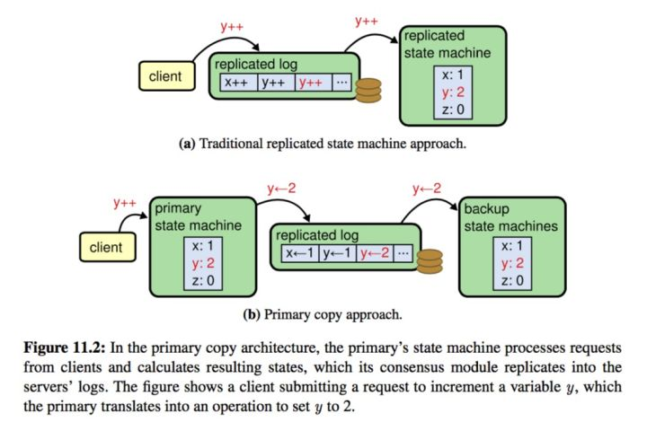

# raft一致性算法

[toc]

## 一、raft简介

⼀ 致性算法在构建可信赖的⼤规模软件系统中扮演着重要的⾓⾊。Raft 算法在许多⽅⾯和现有的⼀致性算法都很相似（主要是 Oki 和 Liskov 的 Viewstamped Replication），但是它 也有⼀些独特的特性：

- 强领导⼈：和其他⼀致性算法相⽐，Raft 使⽤⼀种更强的领导能⼒形式。⽐如，⽇志条⽬只从领导⼈发送给其他 的服务器。这种⽅式简化了对复制⽇志的管理并且使得 Raft 算法更加易于理解。 
- 领导选举：Raft 算法使⽤⼀个随机计时器来选举领导⼈。这种⽅式只是在任何⼀致性算法都必须实现的⼼跳机制 上增加了⼀点机制。在解决冲突的时候会更加简单快捷。 
- 成员关系调整：Raft 使⽤⼀种共同⼀致的⽅法来处理集群成员变换的问题，在这种⽅法下，处于调整过程中的两 种不同的配置集群中⼤多数机器会有重叠，这就使得集群在成员变换的时候依然可以继续⼯作。

### 1.1 raft涉及到的名词

Raft算法将Server划分为3种状态，或者也可以称作角色：

- Leader
  负责Client交互和log复制，同一时刻系统中最多存在1个。
- Follower
  被动响应请求RPC，从不主动发起请求RPC。
- Candidate
  一种临时的角色，只存在于leader的选举阶段，某个节点想要变成leader，那么就发起投票请求，同时自己变成candidate。如果选举成功，则变为candidate，否则退回为follower

### 1.2 Rpc请求

Raft 算法中服务器节点之间通信使用远程过程调用（RPCs），并且基本的一致性算法只需要两种类型的 RPCs，为了在服务器之间传输快照增加了第三种 RPC。
RPC有三种：

- RequestVote RPC（请求投票）：由候选⼈负责调⽤⽤来征集选票
- AppendEntries RPC（追加条⽬）：由领导⼈调⽤，⽤于⽇志条⽬的复制，同时也被当做⼼跳使⽤.
- InstallSnapshot RPC: 领导者使用该RPC来发送快照给太落后的追随者

### 1.3 复制状态机

⼀致性算法是从复制状态机的背景下提出的。在这种⽅法中，⼀组服务器上的状态机产⽣ 相同状态的副本，并且在⼀些机器宕掉的情况下也可以继续运⾏。

> 图 1 ：复制状态机的结构。⼀致性算法管理着来⾃客户端指令的复制⽇志。状态机从⽇志中处理相同顺序的相 同指令，所以产⽣的结果也是相同的。

复制状态机通常都是基于复制⽇志实现的，如图 1。每⼀个服务器存储⼀个包含⼀系列指令的⽇志，并且按照⽇志 的顺序进⾏执⾏。每⼀个⽇志都按照相同的顺序包含相同的指令，所以每⼀个服务器都执⾏相同的指令序列。

⼀致性算法的任务是保证复制⽇志的⼀致性。⼀旦指令被正确的复制，每⼀个服务器的状态机按照⽇志顺序处理他们，然后输出结果 被返回给客户端。因此，服务器集群看起来形成了⼀个⾼可靠的状态机。

⼀致性算法通常含有以下特性：

- 安全性保证（绝对不会返回⼀个错误的结果）：在⾮拜占庭错误情况下，包括⽹络延迟、分区、丢包、重复和乱 序等错误都可以保证正确。 
- 可⽤性：集群中只要有⼤多数的机器可运⾏并且能够相互通信、和客户端通信，就可以保证可⽤。因此，⼀个典 型的包含 5 个节点的集群可以容忍两个节点的失败。服务器被停⽌就认为是失败。它们稍后可能会从可靠存储的状态中恢复并重新加⼊集群。 
- 不依赖时序来保证⼀致性：物理时钟错误或者极端的消息延迟只有在最坏情况下才会导致可⽤性问题。
-  通常情况下，⼀条指令可以尽可能快的在集群中⼤多数节点响应⼀轮远程过程调⽤时完成。⼩部分⽐较慢的节点不会影响系统整体的性能。

## 二、raft⼀致性算法

Raft 通过选举⼀个杰出的领导⼈，然后给予他全部的管理复制⽇志的责任来实现⼀致性。领导⼈从客户端接收⽇志 条⽬（log entries），把⽇志条⽬复制到其他服务器上，并告诉其他的服务器什么时候可以安全地将⽇志条⽬应⽤ 到他们的状态机中。

### 2.0  摘要

#### 2.0.1 所有服务器需遵守的规则

- 如果commitIndex > lastApplied，则 lastApplied 递增，并将log[lastApplied]应⽤到状态机中
- 如果接收到的 RPC 请求或响应中，任期号T > currentTerm，则令 currentTerm = T，并切换为跟随者状态

#### 2.0.2 跟随者

响应来⾃候选⼈和领导⼈的请求 如果在超过选举超时时间的情况之前没有收到当前领导⼈（即该领导⼈的任期需与这个跟随者的当前任期相同） 的⼼跳/附加⽇志，或者是给某个候选⼈投了票，就⾃⼰变成候选⼈

#### 2.0.3 候选⼈

* 在转变成候选人后就立即开始选举过程
  * 自增当前的任期号（currentTerm）
  * 给自己投票
  * 重置选举超时计时器
  * 发送请求投票的 RPC 给其他所有服务器
* 如果接收到大多数服务器的选票，那么就变成领导人
* 如果接收到来自新的领导人的附加日志（AppendEntries）RPC，则转变成跟随者
* 如果选举过程超时，则再次发起一轮选举

#### 2.0.4 领导人

* 一旦成为领导人：发送空的附加日志（AppendEntries）RPC（心跳）给其他所有的服务器；在一定的空余时间之后不停的重复发送，以防止跟随者超时（5.2 节）
* 如果接收到来自客户端的请求：附加条目到本地日志中，在条目被应用到状态机后响应客户端
* 如果对于一个跟随者，最后日志条目的索引值大于等于 nextIndex（`lastLogIndex ≥ nextIndex`），则发送从 nextIndex 开始的所有日志条目：
  * 如果成功：更新相应跟随者的 nextIndex 和 matchIndex
  * 如果因为日志不一致而失败，则 nextIndex 递减并重试
* 假设存在 N 满足`N > commitIndex`，使得大多数的 `matchIndex[i] ≥ N`以及`log[N].term == currentTerm` 成立，则令 `commitIndex = N`

### 2.0.5 状态

所有服务器上的持久性状态(在响应 RPC 请求之前，已经更新到了稳定的存储设备)

| 参数        | 解释                                                         |
| ----------- | ------------------------------------------------------------ |
| currentTerm | 服务器已知最新的任期（在服务器首次启动时初始化为0，单调递增） |
| votedFor    | 当前任期内收到选票的 candidateId，如果没有投给任何候选人 则为空 |
| log[]       | 日志条目；每个条目包含了用于状态机的命令，以及领导人接收到该条目时的任期（初始索引为1） |

所有服务器上的易失性状态
| 参数            | 解释                                                         |
| --------------- | ------------------------------------------------------------ |
| **commitIndex** | 已知已提交的最高的日志条目的索引（初始值为0，单调递增）      |
| **lastApplied** | 已经被应用到状态机的最高的日志条目的索引（初始值为0，单调递增） |

Leader视角同样维护了这些信息，只不过commitIndex的概念稍有不同，表示的是已经被半数Follower成功接受了的日志ID (在加上Leader自身，目标日志已被半数以上的节点所记录)

领导人（服务器）上的易失性状态(选举后已经重新初始化)

| 参数             | 解释                                                         |
| ---------------- | ------------------------------------------------------------ |
| **nextIndex[]**  | 对于每一台服务器，发送到该服务器的下一个日志条目的索引（初始值为领导人最后的日志条目的索引+1） |
| **matchIndex[]** | 对于每一台服务器，已知的已经复制到该服务器的最高日志条目的索引（初始值为0，单调递增） |

**追加条目（AppendEntries）RPC**：

由领导人调用，用于日志条目的复制，同时也被当做心跳使用

| 参数         | 解释                                                         |
| ------------ | ------------------------------------------------------------ |
| term         | 领导人的任期                                                 |
| leaderId     | 领导人 ID 因此跟随者可以对客户端进行重定向（译者注：跟随者根据领导人 ID 把客户端的请求重定向到领导人，比如有时客户端把请求发给了跟随者而不是领导人） |
| prevLogIndex | 紧邻新日志条目之前的那个日志条目的索引                       |
| prevLogTerm  | 紧邻新日志条目之前的那个日志条目的任期                       |
| entries[]    | 需要被保存的日志条目（被当做心跳使用时，则日志条目内容为空；为了提高效率可能一次性发送多个） |
| leaderCommit | 领导人的已知已提交的最高的日志条目的索引                     |

| 返回值  | 解释                                                         |
| ------- | ------------------------------------------------------------ |
| term    | 当前任期，对于领导人而言 它会更新自己的任期                  |
| success | 如果跟随者所含有的条目和 prevLogIndex 以及 prevLogTerm 匹配上了，则为 true |

#### 2.0.6 特性

| 特性             | 解释                                                         |
| ---------------- | ------------------------------------------------------------ |
| 选举安全特性     | 对于一个给定的任期号，最多只会有一个领导人被选举出来         |
| 领导人只附加原则 | **领导人绝对不会删除或者覆盖自己的日志，只会增加**           |
| 日志匹配原则     | 如果两个日志在某一相同索引位置日志条目的任期号相同，那么我们就认为这两个日志从头到该索引位置之间的内容完全一致 |
| 领导人完全特性   | **如果某个日志条目在某个任期号中已经被提交，那么这个条目必然出现在更大任期号的所有领导人中** |
| 状态机安全特性   | 如果某一服务器已将给定索引位置的日志条目应用至其状态机中，则其他任何服务器在该索引位置不会应用不同的日志条目 |

### 2.1 raft基础

领导⼈处理所有的客户端请求（如果⼀个客户端和跟随者联系，那么跟随者会把请求重定向 给领导⼈）

> 图 4：服务器状态。跟随者只响应来自其他服务器的请求。如果跟随者接收不到消息，那么他就会变成候选人并发起一次选举。获得集群中大多数选票的候选人将成为领导人。**在一个任期内，领导人一直都会是领导人，直到自己宕机了**。

> 图 5：时间被划分成一个个的任期，每个任期始于一次选举。在选举成功后，**领导人会管理整个集群直到任期结束。有时候选举会失败，那么这个任期就会没有领导人而结束**。任期之间的切换可以在不同的时间不同的服务器上观察到。

Raft 保证了在⼀个给定的任期内，最多只有⼀个领导⼈。任期在 Raft 算法中充当逻辑时钟的作⽤，任期使得服务器可以检测⼀些过期的信息：⽐如过期的领 导⼈。

如果⼀个服务器的当前任期号⽐其他⼈⼩，那么他会更新⾃⼰的任期号到较⼤的任期号值。如果⼀个候选 ⼈或者领导⼈发现⾃⼰的任期号过期了，那么他会⽴即恢复成跟随者状态。如果⼀个节点接收到⼀个包含过期的任 期号的请求，那么他会直接拒绝这个请求。

### 2.2 leader选举

领导⼈周期性的向所有跟随者发送⼼跳包（即不 包含⽇志项内容的附加条⽬（AppendEntries） RPCs）来维持⾃⼰的权威。如果⼀个跟随者在⼀段时间⾥没有接收到任何消息，也就是选举超时，那么他就会认为系统中没有可⽤的领导⼈,并且发起选举以选出新的领导⼈。

每⼀个服务器最多会对⼀个任期号投出⼀张选票，按照先来先服务的原则

在等待投票的时候，候选⼈可能会从其他的服务器接收到声明它是领导⼈的附加条⽬（AppendEntries）RPC。如果这个领导⼈的任期号（包含在此次的 RPC中）不⼩于候选⼈当前的任期号，那么候选⼈会承认领导⼈合法并回到跟随者状态。

选举超时时间是从⼀个固定的区间随机选择。

#### 2.2.1 集群启动时选举

当启动集群 A、B、C 三个节点时，三个节点都处于 Follower 状态中，在心跳超时时间内没有收到 Leader 节点的信息，某一个节点优先转入 Candidate 状态，并发起一个投票请求，这里假设是 A 节点，A 在发起投票请求之前会先投一票给自己，如果 B 和 C 在收到请求的时候，还处于 election time out ，会直接投给 A ，A 就成为了 Leader 节点，并通知其他节点自己当选，并维护心跳。

Raft 集群各个节点之间是通过 RPC 通讯传递消息的，每个节点都包含一个RPC 服务端与客户端，初始时启动 RPC 服务端、状态设置为 Follower、启动选举定时器，每个 Raft 节点的选举定时器超时时间都在 100-500 毫秒之间且并不一致。

处于 Candidate 状态的节点会发起一个投票请求，请求内容：候选人任期（term）、候选人ID(candidateId)、日志项索引(lastLogIndex)、日志项任期(lastLogTerm)。 响应内容： 当前任期(term)、投票结果(voteGranted)。每个任期内，每个 Raft 节点都只能投票一次。

Follower将其当前term加一然后转换为Candidate。它首先给自己投票并且给集群中的其他服务器发送 RequestVote RPC。结果有以下三种情况：

- 赢得了多数的选票，成功选举为Leader；
- 收到了Leader的消息，表示有其它服务器已经抢先当选了Leader；
- 没有服务器赢得多数的选票，Leader选举失败，等待选举时间超时后发起下一次选举。

选举出Leader后，Leader通过定期向所有Followers发送心跳信息维持其统治。

#### 2.2.2 崩溃时选举

同2.1的候选⼈选举过程

* 在转变成候选人后就立即开始选举过程
  * 自增当前的任期号（currentTerm）
  * 给自己投票
  * 重置选举超时计时器
  * 发送请求投票的 RPC 给其他所有服务器
* 如果接收到大多数服务器的选票，那么就变成领导人
* 如果接收到来自新的领导人的附加日志（AppendEntries）RPC，则转变成跟随者
* 如果选举过程超时，则再次发起一轮选举

#### 2.2.3 成为leader条件

- 一个节点得到 majority(半数以上) 的投票才能成为 leader；
- 当选 Leader 的节点 commited 日志数据不能旧于其他节点；
- C 未发起投票请求，且最先收到 A 的投票请求，则A能获得 C 的票；

#### 2.2.4 触发重新选举条件

1. Leader: leader 收不到majority（半数）节点的消息。Leader 可以自己 step down，自行转换到 follower 状态。
2. Follower: 心跳超时。Leader向所有Followers周期性发送heartbeat。如果Follower在选举超时时间内没有收到Leader的heartbeat，Follower就会等待一段随机的时间后发起一次Leader选举。

心跳超时后，Follower 等待自身竞选超时后成为 Candidate 身份并发起选举。假设集群由3个节点组成，为了防止3个节点同时发起投票，Raft会给每个节点分配一个随机的选举超时时间（Election Timeout）。在这个时间内，节点必须等待，不能成为Candidate状态。

竞选超时是随机的，大概在几十到几百毫秒；通常情况下，心跳超时比竞选超时长得多，心跳是秒级，竞选是毫秒级。

心跳超时好理解，两次心跳之间间隔的时间，超过时限就叫超时；选举超时是心跳超时后才起算的。选举超时并不是一段不停运行的代码，它只是一个参数，在心跳超时后系统启动一个计时器与选举超时参数比较，超过这个参数就发起选举。

**最小选举超时**

在分布式系统中，有时候需要对集群中的成员数量进行更新的操作。对于被删除的服务器而言，如果它们没有及时关闭，那么它们将不会接收到心跳信息和日志信息，从而不断发生超时，最后导致任期不断增加（高于集群中所有成员的任期），然后不断向集群中发送请求投票消息。集群中的Leader将变为Follower，集群中将不断开始新的选举，从而扰乱集群的正常运行。

解决方案：Raft引入了一个最小选举超时时间，意思是如果集群中存在Leader时，并且接收到心跳信息之后在最小选举超时时间内接受到请求投票消息，那么将会忽略掉该投票消息。

### 2.3 日志复制

当 Leader 被选举出来之后，由 Leader 处理来自客户端的请求，Leader 会对并发处理进行排序，并将这些请求的排序和信息通过心跳的方式传递到 Follower 节点。日志复制（Log Replication）主要作用是用于保证节点的一致性。

Raft日志同步保证如下两点：

- 如果不同日志中的两个条目有着相同的索引和任期号，则它们所存储的命令是相同的。
- 如果不同日志中的两个条目有着相同的索引和任期号，则它们之前的所有条目都是完全一样的。

#### 2.3.1 日志复制完整流程

1. leader append log entry
2. leader issue AppendEntries RPC in parallel
3. leader wait for majority response  //应该已经commited了 todo
4. leader apply entry to state machine
5. leader reply to client    // <-- **获得半数回复后，就会追加到状态机中了，后面就开始回复client了**
6. leader notify follower apply log   //**不需要等follower apply log后再返回客户端**

在Raft中当接收到客户端的日志（事务请求）后先把该日志追加到本地的Log中，然后通过heartbeat把该Entry同步给其他Follower，Follower接收到日志后记录日志然后向Leader发送ACK，当Leader收到大多数（n/2+1）Follower的ACK信息后leader将该日志设置为已提交并追加到本地磁盘中，通知客户端，并在下个heartbeat中Leader将通知所有的Follower将该日志存储在自己的本地磁盘中。

第6步后挂了，则日志还不是committed，不过后面选出来的leader还有这部分的日志entry，新的term在提交时，会附加提交未同步到状态机中的日志，到达到最终一致性。

#### 2.3.2 Log entry

在 Raft 中，Leader 将客户端请求（Command）封装到一个个 Log Entry，并将 Log Entry 按与 Leader 中存储的先后顺序同步到 Follower 节点。

> 图 6：日志由有序序号标记的条目组成。每个条目都包含创建时的任期号（图中框中的数字），和一个状态机需要执行的指令。一个条目当可以安全地被应用到状态机中去的时候，就认为是可以提交了。

Logs 顺序排列的 Log Entry 组成 ，每个 Log Entry 除了包含 Command，还包含产生该 Log Entry 时的 Leader Term。从上图可以看到，5 个节点的日志并不完全一致，Raft 算法为了保证高可用，并不是强一致性，而是最终一致性，Leader 会不断尝试给 Follower 发 Log Entries，直到所有节点的 Log Entries 都相同。

在上面的流程中，Leader 只需要 Log Entry 被复制到大多数节点即可向客户端返回，一旦向客户端返回成功消息，那么系统就必须保证 Log Entry（其实是 Log 所包含的 Command ）在任何异常的情况下都不会发生回滚，即：当前 Log Entry 处于 Commited 状态了。

**领导人来决定什么时候把日志条目应用到状态机中是安全的；这种日志条目被称为已提交**。Raft 算法保证所有已提交的日志条目都是持久化的并且最终会被所有可用的状态机执行。**在领导人将创建的日志条目复制到大多数的服务器上的时候，日志条目就会被提交**（例如在图 6 中的条目 7）。**同时，领导人的日志中之前的所有日志条目也都会被提交**，包括由其他领导人创建的条目。领导人跟踪了最大的将会被提交的日志项的索引，并且索引值会被包含在未来的所有附加日志 RPCs （包括心跳包），这样其他的服务器才能最终知道领导人的提交位置。**一旦跟随者知道一条日志条目已经被提交，那么他也会将这个日志条目应用到本地的状态机中（按照日志的顺序）**。

**⽇志匹配特性（Log Matching Property）**

- 如果在不同的⽇志中的两个条⽬拥有相同的索引和任期号，那么他们存储了相同的指令。
-  如果在不同的⽇志中的两个条⽬拥有相同的索引和任期号，那么他们之前的所有⽇志条⽬也全部相同。

#### 2.3.3 网络分区(脑裂)时

> 图 7：当一个领导人成功当选时，跟随者可能是任何情况（a-f）。每一个盒子表示是一个日志条目；里面的数字表示任期号。跟随者可能会缺少一些日志条目（a-b），可能会有一些未被提交的日志条目（c-d），或者两种情况都存在（e-f）。例如，场景 f 可能会这样发生，某服务器在任期 2 的时候是领导人，已附加了一些日志条目到自己的日志中，但在提交之前就崩溃了；很快这个机器就被重启了，在任期 3 重新被选为领导人，并且又增加了一些日志条目到自己的日志中；在任期 2 和任期 3 的日志被提交之前，这个服务器又宕机了，并且在接下来的几个任期里一直处于宕机状态。

存在网络问题、Leader 选举等情况从而存在 Follower 与 Leader 之间的数据不一致性。在 Raft 中， 一切根据 Leader 数据进行覆盖，因为 Leader 一定包含最新的 Committed Log ，这里注意是 Committed Log，也就是说已经被绝大多节点所复制了确认的，不能回滚的日志数据。

如果follower和leader的日志不一致怎么办？

**leader日志会覆盖follower日志**。要使得跟随者的⽇志进⼊和⾃⼰⼀致的状态，领导⼈必须找到最后两者达成⼀致的地⽅，然后删除跟随者从那个点之后的所有⽇志条⽬，并发送⾃⼰在那个点之后的⽇志给跟随者。

如果有2个leader会网络同步后，会怎么办？

在网络分区下，即使有2个leader，有一个leader因为无法获取半数以上的follower，所以无法追加日志，网络恢复后，日志落后的leader会被覆盖。

**领导⼈从来不会覆盖或者删除⾃⼰的⽇志**

### 2.4 安全性

任何的领导⼈对于给定的任期号，都拥有了之前任期的所有被提交的⽇志条⽬。

Raft增加了如下两条限制以保证安全性：

- 选举限制。leader最终必须存储所有committed log entries，即拥有最新的committed log entry的Follower才有资格成为Leader。这意味着log entries传送是单向的，只从领导⼈传给跟随者，并且领导⼈从不会覆盖⾃⾝本地⽇志中已经存在的条⽬。

  RequestVote RPC实现了这个限制: RPC包含关于candidate日志的信息，如果投票者自己的日志比candidate的日志更新，那么投票者就会拒绝投票。 Raft通过比较日志中最后一项的索引和项来确定两个日志中哪一个是最新的。如果日志的最后一个条目具有不同的term，那么具有较晚的term的日志是最新的。如果日志以相同的term，那么较长的日志就是最新的。

- 提交之前任期内的⽇志条⽬

  Raft 永远不会通过计算副本数⽬的⽅式去提交⼀个之前任期内的⽇志条⽬。只有leader当前任期⾥的⽇志条⽬通过计算副本数⽬可以被提交；⼀旦当前任期的⽇志条⽬以这种⽅式被提交，那么由于⽇志匹配特性，**之前的⽇志条⽬也都会被间接的提交**。

### 2.5 跟随着和候选人崩溃

如果跟随者或者候选⼈崩溃了，那么后续发送给他们的 RPCs 都会失败。Raft 中处理这种 失败就是简单地通过⽆限的重试。

如果⼀个服务器在完 成了⼀个 RPC，但是还没有响应的时候崩溃了，那么在他重新启动之后就会再次收到同样的请求。Raft 的 RPCs 都 是幂等的，所以这样重试不会造成任何问题。

### 5.6 时间和可用性

Raft 的要求之一就是安全性不能依赖时间：整个系统不能因为某些事件运行的比预期快一点或者慢一点就产生了错误的结果。

领导人选举是 Raft 中对时间要求最为关键的方面。Raft 可以选举并维持一个稳定的领导人,只要系统满足下面的时间要求：

> 广播时间（broadcastTime）  <<  选举超时时间（electionTimeout） <<  平均故障间隔时间（MTBF）

在这个不等式中，广播时间指的是从一个服务器并行的发送 RPCs 给集群中的其他服务器并接收响应的平均时间；广播时间必须比选举超时时间小一个量级，这样领导人才能够发送稳定的心跳消息来阻止跟随者开始进入选举状态。

广播时间大约是 0.5 毫秒到 20 毫秒，取决于存储的技术。因此，选举超时时间可能需要在 10 毫秒到 500 毫秒之间。

## 三、集群成员变更

成员变更是在集群运行过程中副本发生变化，如增加/减少副本数、节点替换等。

如果将成员变更当成一般的一致性问题，直接向Leader发送成员变更请求，Leader复制成员变更日志，达成多数派之后提交，各服务器提交成员变更日志后从旧成员配置（Cold）切换到新成员配置（Cnew）。因为各个服务器提交成员变更日志的时刻可能不同，可能出现在Cold和Cnew中同时存在两个不相交的多数派，进而可能选出两个Leader，形成不同的决议，破坏安全性。

> 图 10：直接从一种配置转到新的配置是十分不安全的，因为各个机器可能在任何的时候进行转换。在这个例子中，集群配额从 3 台机器变成了 5 台。不幸的是，存在这样的一个时间点，两个不同的领导人在同一个任期里都可以被选举成功。一个是通过旧的配置，一个通过新的配置。

由于成员变更的这一特殊性，成员变更不能当成一般的一致性问题去解决。

### 3.1 两阶段的成员变更

为了保证安全性，配置更改必须使用两阶段方法。在 Raft 中，集群先切换到一个过渡的配置，我们称之为共同一致（*joint consensus*)；一旦共同一致已经被提交了，那么系统就切换到新的配置上。共同一致是老配置和新配置的结合：

* 日志条目被复制给集群中新、老配置的所有服务器。
* 新、旧配置的服务器都可以成为领导人。
* 达成一致（针对选举和提交）需要分别在两种配置上获得大多数的支持。

图 11 展⽰了配置转换的过程。当⼀个领导⼈接收到⼀个改 变配置从 C-old 到 C-new 的请求，他会为了共同⼀致存储配置（图中的 C-old,new）。

⼀旦 C-old,new 被提交，那么⽆论是 C-old 还是 C-new，如果不经过另⼀个配置的允许都不能单独做出决定，并且 领导⼈完全特性保证了只有拥有 C-old,new ⽇志条⽬的服务器才有可能被选举为领导⼈。这个时候，领导⼈创建⼀ 条关于 C-new 配置的⽇志条⽬并复制给集群就是安全的了。

> 图 11：一个配置切换的时间线。虚线表示已经被创建但是还没有被提交的配置日志条目，实线表示最后被提交的配置日志条目。领导人首先创建了 C-old,new 的配置条目在自己的日志中，并提交到 C-old,new 中（C-old 的大多数和  C-new 的大多数）。然后他创建 C-new 条目并提交到 C-new 中的大多数。这样就不存在  C-new 和 C-old 可以同时做出决定的时间点。

新的服务器可能初始化没有存储任何的⽇志条⽬，新的服务器以没有投票权⾝份加 ⼊到集群中来（领导⼈复制⽇志给他们，但是不考虑他们是⼤多数）。

当服务器确认当前领导⼈存在时，服务器会忽略请求投票 RPCs。确切地说，当服务器在当前 最⼩选举超时时间内收到⼀个请求投票 RPC，他不会更新当前的任期号或者投出选票。这不会影响正常的选举，每 个服务器在开始⼀次选举之前，⾄少等待⼀个最⼩选举超时时间。然⽽，这有利于避免被移除的服务器扰乱：如果 领导⼈能够发送⼼跳给集群，那么他就不会被更⼤的任期号废黜。

#### 3.1.1一阶段变更

那么如何限制Cold与Cnew，使之任意的多数派交集不为空呢？方法就是每次成员变更只允许增加或删除一个成员。

可从数学上严格证明，只要每次只允许增加或删除一个成员，Cold与Cnew不可能形成两个不相交的多数派。

## 四、日志压缩

在实际的系统中，不能让日志无限增长，否则系统重启时需要花很长的时间进行回放，从而影响可用性。Raft采用对整个系统进行snapshot来解决，snapshot之前的日志都可以丢弃。

每个副本独立的对自己的系统状态进行snapshot，并且只能对已经提交的日志记录进行snapshot。

当Leader要发给某个日志落后太多的Follower的log entry被丢弃，Leader会将snapshot发给Follower。或者当新加进一台机器时，也会发送snapshot给它。发送snapshot使用InstalledSnapshot RPC。

做一次snapshot可能耗时过长，会影响正常日志同步。可以通过使用copy-on-write技术避免snapshot过程影响正常日志同步。

> 图 12：一个服务器用新的快照替换了从 1 到 5 的条目，快照值存储了当前的状态。快照中包含了最后的索引位置和任期号。

## 五、客户端交互

Raft 中的客户端发送所有请求给领导人。当客户端启动的时候，他会随机挑选一个服务器进行通信。如果客户端第一次挑选的服务器不是领导人，那么那个服务器会拒绝客户端的请求并且提供他最近接收到的领导人的信息（附加条目请求包含了领导人的网络地址）。如果领导人已经崩溃了，那么客户端的请求就会超时。

leader完全特性保证了leader⼀定拥有所有已经被提交的⽇志条⽬，但是在leader任期开始的时候，他可能不知道哪些是已经被提交的。为了知道这些信息，他需要在他的任期里提交一条日志条目。Raft 中通过领导人在任期开始的时候提交一个空白的没有任何操作的日志条目到日志中去来实现。第二，领导人在处理只读的请求之前必须检查自己是否已经被废黜了（他⾃⼰的信息已经变脏了如果⼀个更新的领导⼈被选举出来）。

### leader更新状态机

当有一半的follower成功接收到日志以后(可通过其next_index值是否大于目标日志编号来判断)，Leader开始对其进行提交处理，首先更新自己的commitId，然后将日志内容应用到本地状态机上面，自此完成了数据内容对客户端的可见。

### follower写状态机

Follower一侧的写入则可在心跳通信阶段去完成。心跳过程同样是走AppendEntries逻辑，所传递的payload包含了当前Leader的commitId(值为4)，以及一条NOOP日志。

Follower收到心跳请求之后会去判断当前Leader的commitIndex(值为4)是否已经大于了自己的lastApplied(已经被应⽤到状态机的最⾼的⽇志条⽬的索引)，条件满足则将目标日志提交到本地状态机上面，并返回ack响应给Leader，以便其更新对应的matchIndex（目标Follower已应用到状态机的日志ID，也即Follower视角的lastApplied）。为了确保状态机的更新不阻塞心跳线程(比如将rocksdb作为状态机，写压力大的时候会stall)，更新过程可采用异步的方式进行。

## 六、raft应用

后面可以出个专题来写raft在各个中间件中的应用，待完成。

raft应用场景比较多，例如：etcd， nacos, Kafka, TiDB, rocksdb

### 6.1 etcd

etcd是raft协议的一个实现。

如果你使用过zookeeper这样的分布式键值对，你应该知道有个叫paxos的协议，paxos协议是挺复杂的，raft协议是paxos协议的简化版本。

大多数同意原则：一群人怎么达成原则，往往是通过投票，当多数人同意的时候就按照多数人投票的结果去执行。

在服务端一般是多个成员组成了一个集群，针对客户端任何的变更，这个变更首先会发到服务端，服务端在处理变更请求的时候，它会有一个一致性的模块，这个一致性模块会将这个变更请求发给其他所有的peer，请求经过一致性模块(选主、日志复制)之后，请求就会转发到raft集群所有成员里面去，同时会将变更请求写入自己的日志模块当中，当其他成员处理了变更请求之后，也会将变更请求写入到自己的日志当中，并将结果返回给发起方，发起方会去做确认，只要有多数人确认了这个变更，那么这个变更就正真的生效了，最后会将状态写到状态机里面。

当我们去读取数据的时候，是从状态机里面去获取数据，状态机里面能够获取的数据都是经过多数人同意的。

一致性模块实现两件事，它其实就是raft协议的实现者，第一，它会实现选主，第二就是日志复制。 

所谓raft协议就是大多数人同意的原则来保证数据的一致性。

### 6.2 Nacos

### 6.3 kafka

## 七、raft和zk对比

### 7.1 定义
ZAB通过事务ID，区别不同的纪元epoch，事务ID共64位，前32位在一个纪元中相同
Raft定义了term任期和logIndex。

### 7.2 投票

ZK中的每个server，在某个electionEpoch轮次内，可以投多次票，只要遇到更大的票就更新，ZK先比较epoch，epoch大的当选；epoch相同，再比较事务id zxid；都相同比较myid，myid大的优先。
Raft中的每个server在某个term轮次内只能投一次票，哪个candidate先请求投票谁就可能先获得投票,Raft通过candidate设置不同的超时时间，来快速解决这个问题

### 7.3 过半

ZAB协议，只有当过半节点提交了事务，才会给客户端事务提交的回应; 而Raft协议，leader提交了事务，并且收到过半follower对准备完成事务的ack后，自身节点提交事务，至于过半数节点提交事务这件事，是在之后通信过程中渐渐完成的。

### 7.4primary-backup system or state machine system

raft是state machine system，zab是primary-backup system

从这个图可以看出primary backup system 的做法是, 当有client 请求到达的时候, primary 会立刻将这个请求apply 到自己的 state machine, 然后将这个结果发送给自己的backup, 而不是这个client 的请求(比如这里就是将y=2 发送给backup, 而不是发送y++ 这个操作), 然后这里发送给自己多个backups 的时候是通过一致性协议来进行发送.

在primary backup system 里面, primary 在接收到client 的请求以后, 会立刻apply 到自己的state machine, 然后计算出这个结果, 写到自己的log, 以及发送给所有的backups. 而在state machine replication 系统里面, 是直接将这个操作发送给各个replication的.

### 7.5 恢复方向

raft单向，仅从leader到follower补齐log；zab双向，leader需要从follower接收数据来生成initial history。

zab 的解决方法就是当recovery 的时候, 将leader 上面的所有日志都拉去过来, 然后丢弃自己state machine 的内容, 直接使用新leader state machine 的内容

在 "Vive La Diffe ́rence:Paxos vs. Viewstamped Replication vs. Zab" 这个论文里面, state machine replication 也称作active replication, 而primary-backup system 也称作passive replication, 这样更加的形象, 也就是 state machine replication 是主动去同步数据, 通过达成一致性协议来返回给client, 而primary-backup system 是primary 做了所有了事情, 只是通过一致性协议把数据保存在backups 里面

## 八 QA

### 8.1 Q：每个 Follower 都在其磁盘上存储了 3 个信息：当前任期（currentTerm）、最近的投票（votedFor）、以及所有接受的日志记录（log[]）。 

a. 假设 Follower 崩溃了，并且当它重启时，它最近的投票信息已丢失。该 Follower 重新加入集群是否安全（假设未对算法做任何修改）？解释一下你的答案。

b. 现在，假设崩溃期间 Follower 的日志被截断（truncated）了，日志丢失了最后的一些记录。该 Follower 重新加入集群是否安全（假设未对算法做任何修改）？解释一下你的答案。

### 8.2 Q：在配置变更过程中，如果当前 Leader 不在 C-new 中，一旦 C-new 的日志记录被提及，它就会下台。然而，这意味着有一段时间，Leader 不属于它所领导的集群（Leader 上存储的当前配置条目是 C-new，它不包括 Leader）。假设修改算法，如果 C-new 不包含 Leader，则使 Leader 在其日志存储了 C-new 时就立即下台。这种方法可能发生的最坏情况是什么？

### 8.3 Q：Raft协议的leader选举，正常情况下，网络抖动造成follower发起leader选举，且该follower的Term比现有leader高，集群中所有结点的日志信息当前一致，这种情况下会选举成功吗？

同8.5

### 8.4 Q：Ｍaster在准备Commit某条Log的时候挂了，Raft如何保证一致性？

因为Master在Commit某条Log的时候，这个Log已经被复制到集群中半数以上节点了。根据Raft的选举性质，那么之后再选举出来的Leader，一定会包含这条Log。对于这条Log，是上一个Term的，那么当前Leader不能直接commit，而是要发送AppendEntries RPC来commit这条log。具体原因见论文图８。

### 8.5 Q: 假设某个Follower节点出现网络分区，由于接收不到Leader的心跳包，所以会不断选举，Term会一直增加。加入原集群后会把原Leader降级为Follower，导致重新选举。但实际上它并不能成为Leader(没有最新日志)，造成disruption。如何解决？

Raft作者博士论文《CONSENSUS: BRIDGING THEORY AND PRACTICE》的第9.6节 "Preventing disruptions when a server rejoins the cluster"提到了PreVote算法的大概实现思路。

主要就是Prevote的思想。把选举也拆成一个两阶段提交的方式，先进行一轮prevote，这一轮prevote并不会更改自己的Term＋１，但是Vote请求里的Term是＋１的。在Pre-Vote算法中，只有当一个候选人首先从集群的大多数成员那里了解到他们愿意将选票授予该candidate时，才会增加其任期(如果candidate的日志足够最新，并且candidate至少在选举超时内没有收到来自有效领导人的心跳)。

pre-vote就杜绝了重新加入的节点随意发起选举。

Pre-Vote算法解决了分区服务器在重新加入时中断集群的问题。当一个服务器被分区时，它将不能增加它的期限，因为它不能从大多数集群中获得权限。然后，当它重新加入集群时，它仍然不能增加它的期限，因为其他服务器将一直从leader接收定期的心跳。一旦服务器接收到来自leader本身的心跳，它将返回到follower状态(在相同的期限内)。

### 8.6 Q: 假设Ａ, B, C三节点，A为Leader。A和B之间出现分区，但是A, C和B, C之间连接不受影响，会导致Leader频繁切换，有什么方法优化？

A, B, C三节点，只有A和B之间的网络不通，而C是可以和A, B 连通的，有什么办法优化？由于Leader A和B无法连通，B会选举成为新Leader (C 会投给它)。同时Leader A的心跳包会被拒绝，降级为Follower(因为Term的原因)。过一段时间后，A也会经历一样的过程，选举成为Leader，B降级为Follower，如此反复。

应该办法是在系统中去detect这种网络分区，如果发现了的话，要及时修复连接。以及C其实可以观测到频繁的Leader切换，从而报警，或者自己选举成为新Leader。

**为了解决幽灵复现问题，每次新leader选取成功后，会主动插入noop log，因此一定有新日志，被网络分区的candidate是得不到投票的**

## 参考：

[raft论文](https://raft.github.io/raft.pdf)

https://it.cha138.com/jingpin/show-76874.html

https://zhuanlan.zhihu.com/p/30856272 

https://www.zhihu.com/question/28242561

[Raft算法详解](https://zhuanlan.zhihu.com/p/32052223?utm_medium=social)

[Paxos、Raft分布式一致性最佳实践](https://www.zhihu.com/column/paxos)

[Raft 作者亲自出的 Raft 面试题！（含答案）](https://juejin.cn/post/6902221596765716488)]

https://zhuanlan.zhihu.com/p/471233410