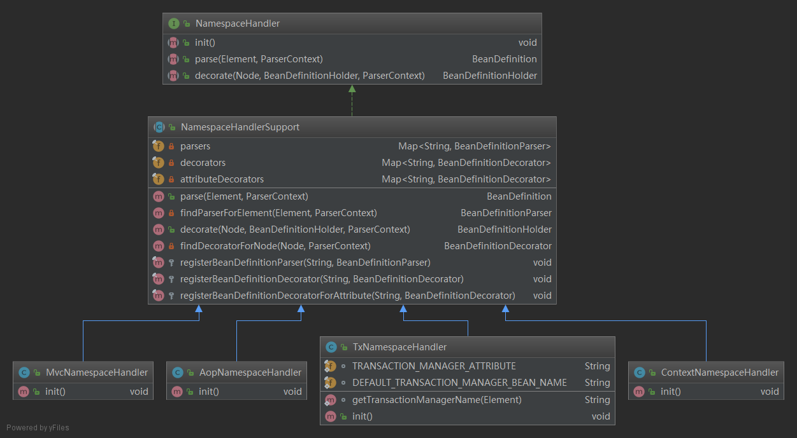
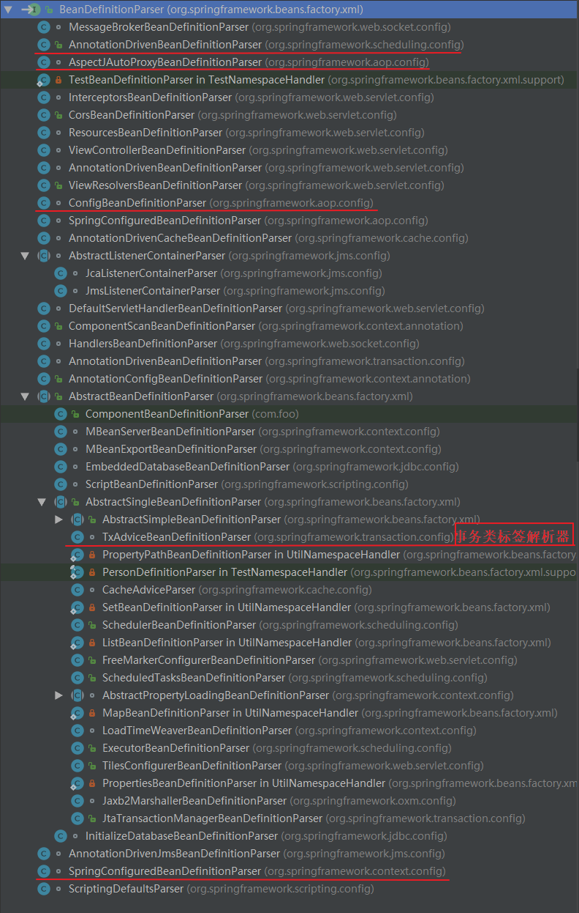
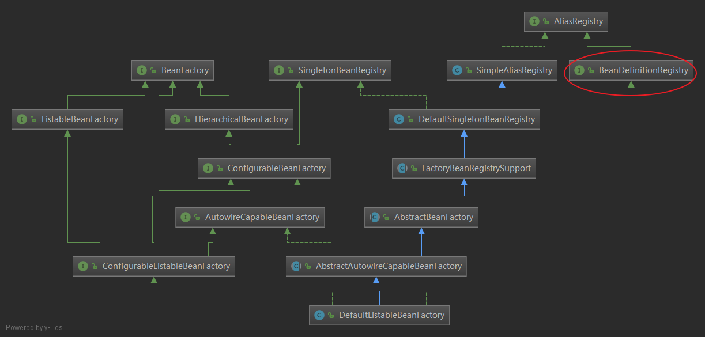
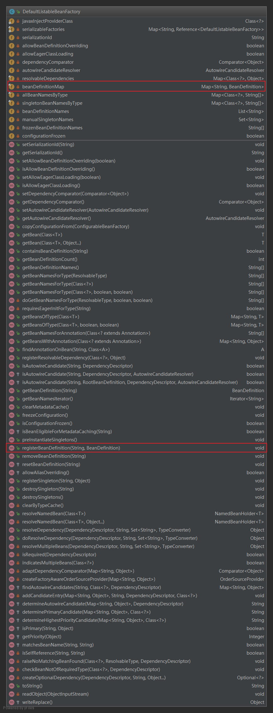
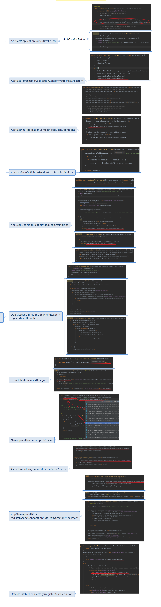

# AOP源码解读

spring version: 5.0.0; jdk: 1.8

AOP是怎么作用到代码上的呢？我觉得从2方面考虑：

1、IOC启动的时候，注册一些AOP相关的类或代码

2、在代码运行时，根据注册的AOP去动态的代理目标对象。

下面先从IOC启动说起。


## 1.调用顺序

-----

### 1.1aop调用顺序：

NamespaceHandlerSupport的继承类AopNamespaceHandler.init方法，为config, spring-configured, aspectj-autoproxy, scoped-proxy 标签注册BeanDefinitionParsers

NamespaceHandlerSupport.parse(AopNamespaceHandler.parse) -> BeanDefinitionParser.parser(AspectJAutoProxyBeanDefinitionParser.parser) -> ParserContext -> XmlReaderContext.getRegistry()-> BeanDefinitionRegistry.registerBeanDefinition(DefaultListableBeanFactory.registerBeanDefinition) 

### 1.2 IOC大致调用顺序(IOC调用的AOP标签解析)

> AbstractApplicationContext#refresh()
>
> AbstractRefreshableApplicationContext#refreshBeanFactory
>
> AbstractXmlApplicationContext#loadBeanDefinitions
>
> AbstractBeanDefinitionReader#loadBeanDefinitions
>
> XmlBeanDefinitionReader#loadBeanDefinitions
>
> DefaultBeanDefinitionDocumentReader#registerBeanDefinitions
>
> BeanDefinitionParserDelegate#parseCustomElement
>
> NamespaceHandlerSupport#parse
>
> AspectJAutoProxyBeanDefinitionParser#parse
>
> AopNamespaceUtils#registerAspectJAnnotationAutoProxyCreatorIfNecessary
>
> DefaultListableBeanFactory#registerBeanDefinition

最后会贴一张[IOC代码的调用顺序图](https://gitee.com/paincupid/IT_note/raw/master/spring-note/spring-aop/blogpic/sping-IOC-beanLoad.png)，如果不清楚的话，可以[下载xmind](https://download.csdn.net/download/paincupid/10598727)文件看高清的。

## 2.NamespaceHandlerSupport

-----

NamespaceHandlerSupport实现类，图如下所示。


继承结构，图中只写了4个子类



在spring中，如果想要自定义标签：

> 1. 可以继承NamespaceHandlerSupport
> 2. 继承AbstractSingleBeanDefinitionParser,或者实现BeanDefinitionParser接口，在init中注册自定义的BeanDefinitionParser解析器。
> 3. ....

NamespaceHandlerSupport有一个很重要的方法：parse，具体的handler会调用这个方法，返回一个BeanDefinition。

NamespaceHandlerSupport属性parsers包括BeanDefinitionParser，BeanDefinitionParser.parser真正解析返回一下BeanDefinition

调用顺序：handler.parse -> BeanDefinitionParser.parser -> return BeanDefinition

```java
private final Map<String, BeanDefinitionParser> parsers = new HashMap<>();

public BeanDefinition parse(Element element, ParserContext parserContext) {
    BeanDefinitionParser parser = findParserForElement(element, parserContext);
    return (parser != null ? parser.parse(element, parserContext) : null);
}
private BeanDefinitionParser findParserForElement(Element element, ParserContext parserContext) {
    String localName = parserContext.getDelegate().getLocalName(element);
    BeanDefinitionParser parser = this.parsers.get(localName);
    if (parser == null) {
        parserContext.getReaderContext().fatal(
            "Cannot locate BeanDefinitionParser for element [" + localName + "]", element);
    }
    return parser;
}
```


## 3. AopNamespaceHandler

-----

初始化定义的标签解析处理器, 为config, spring-configured, aspectj-autoproxy, scoped-proxy 标签注册BeanDefinitionParsers。<aop:config>包括pointcut, advisor和aspect标签页

```java
public class AopNamespaceHandler extends NamespaceHandlerSupport {

	/**
	 * Register the {@link BeanDefinitionParser BeanDefinitionParsers} for the
	 * '{@code config}', '{@code spring-configured}', '{@code aspectj-autoproxy}'
	 * and '{@code scoped-proxy}' tags.
	 */
	@Override
	public void init() {
		// In 2.0 XSD as well as in 2.1 XSD.
		registerBeanDefinitionParser("config", new ConfigBeanDefinitionParser());
		registerBeanDefinitionParser("aspectj-autoproxy", new AspectJAutoProxyBeanDefinitionParser());
		registerBeanDefinitionDecorator("scoped-proxy", new ScopedProxyBeanDefinitionDecorator());

		// Only in 2.0 XSD: moved to context namespace as of 2.1
		registerBeanDefinitionParser("spring-configured", new SpringConfiguredBeanDefinitionParser());
	}

}
```

- config–>ConfigBeanDefinitionParser
- aspectj-autoproxy–>AspectJAutoProxyBeanDefinitionParser
- scoped-proxy–>ScopedProxyBeanDefinitionDecorator
- spring-configured–>SpringConfiguredBeanDefinitionParser


### 3.1 使用 <aop:config />标签的前提条件

配置如<aop:config />这样的标签，在配置这个标签之前，通常我们需要引入这个aop所在的命名空间 

```xml
<?xml version="1.0" encoding="UTF-8"?>
<beans xmlns="http://www.springframework.org/schema/beans"
 xmlns:xsi="http://www.w3.org/2001/XMLSchema-instance"
 xmlns:aop="http://www.springframework.org/schema/aop"
 xmlns:context="http://www.springframework.org/schema/context"
 xsi:schemaLocation="http://www.springframework.org/schema/beans http://www.springframework.org/schema/beans/spring-beans.xsd
  http://www.springframework.org/schema/aop http://www.springframework.org/schema/aop/spring-aop.xsd
  http://www.springframework.org/schema/context http://www.springframework.org/schema/context/spring-context.xsd />
```

只有通过配置aop的命名空间才会找到AOP标签的处理器AopNamespaceHandler，在AOP的目录下可以找到spring.handlers配置文件，文件配置了命名空间和命名空间处理器之间的关系。 

spring.handlers内容

> http\://www.springframework.org/schema/aop=org.springframework.aop.config.AopNamespaceHandler 

在spring.schemas配置文件中添加了url和本地xsd标签解析文件的关系 

```scheme
http\://www.springframework.org/schema/aop/spring-aop-2.0.xsd=org/springframework/aop/config/spring-aop.xsd
http\://www.springframework.org/schema/aop/spring-aop-2.5.xsd=org/springframework/aop/config/spring-aop.xsd
http\://www.springframework.org/schema/aop/spring-aop-3.0.xsd=org/springframework/aop/config/spring-aop.xsd
http\://www.springframework.org/schema/aop/spring-aop-3.1.xsd=org/springframework/aop/config/spring-aop.xsd
http\://www.springframework.org/schema/aop/spring-aop-3.2.xsd=org/springframework/aop/config/spring-aop.xsd
http\://www.springframework.org/schema/aop/spring-aop-4.0.xsd=org/springframework/aop/config/spring-aop.xsd
http\://www.springframework.org/schema/aop/spring-aop-4.1.xsd=org/springframework/aop/config/spring-aop.xsd
http\://www.springframework.org/schema/aop/spring-aop-4.2.xsd=org/springframework/aop/config/spring-aop.xsd
http\://www.springframework.org/schema/aop/spring-aop-4.3.xsd=org/springframework/aop/config/spring-aop.xsd
http\://www.springframework.org/schema/aop/spring-aop.xsd=org/springframework/aop/config/spring-aop.xsd
```

内置的xsd文件，文件内容包含了命名空间处理器AopNamespaceHandler对于标签处理的规则 

## 4. BeanDefinitionParser  

-----

BeanDefinition被DefaultBeanDefinitionDocumentReader使用，用来解析<bean/>标签页，将BeanDefinition注册给BeanDefinitionRegistry，并返回BeanDefinition

所有解析器，都是由 BeanDefinitionParser 接口的统一实现，入口都是从 parse函数开始的 。

```java
public interface BeanDefinitionParser {
	@Nullable
	BeanDefinition parse(Element element, ParserContext parserContext);
}
```

### 4.1继承BeanDefinitionParser的实现类，以及它 们的子类

如下图所示：



AnnotationDrivenBeanDefinitionParser、AspectJAutoProxyBeanDefinitionParser、ConfigBeanDefinitionParser、SpringConfiguredBeanDefinitionParser这些类，并不返回BeanDefinition，在方法parse(Element element, ParserContext parserContext)主要是对BeanDefinition进行注册，保存起来。

### 4.2 AspectJAutoProxyBeanDefinitionParser

```java
public BeanDefinition parse(Element element, ParserContext parserContext) {
    AopNamespaceUtils.registerAspectJAnnotationAutoProxyCreatorIfNecessary(parserContext, element);
    extendBeanDefinition(element, parserContext);
    return null;
}
```

### 4.3 ParserContext

```java
public final class ParserContext {
    private final XmlReaderContext readerContext;
    private final BeanDefinitionParserDelegate delegate;
    @Nullable
    private BeanDefinition containingBeanDefinition;

    public final BeanDefinitionRegistry getRegistry() {
        return this.readerContext.getRegistry();
    }
}
```


### 4.4 BeanDefinitionRegistry

下面会介绍DefaultListableBeanFactory会继承BeanDefinitionRegistry，然后进行注册BeanDefinition到一个concurrentHashMap中。

### 4.5 TxAdviceBeanDefinitionParser

一定要讲一下 TxAdviceBeanDefinitionParser 这个类，主要是为了 <tx:advice> 标签页的使用，这个单独拉一章讲。


### 4.6 AOP的Parse们

4.2只讲了AspectJAutoProxyBeanDefinitionParser，在AopNamespaceHandler初始化的时候，还有其它AOP标签，如:

- config-->ConfigBeanDefinitionParser
- aspectj-autoproxy-->AspectJAutoProxyBeanDefinitionParser
- scoped-proxy-->ScopedProxyBeanDefinitionDecorator
- spring-configured-->SpringConfiguredBeanDefinitionParser

## 5.DefaultListableBeanFactory

-----

DefaultListableBeanFactory有一个很重要的作用就是注册和保存BeanDefinition。


### 5.1 DefaultListableBeanFactory的继承结构

可以看到DefaultListableBeanFactory实现了BeanDefinitionRegistry接口，通过方法registerBeanDefinition，将BeanDefinition注册到DefaultListableBeanFactory中去。这也是IOC初始化的一部分。



### 5.2 DefaultListableBeanFactory的属性和方法

> private final Map<String, BeanDefinition> beanDefinitionMap = new ConcurrentHashMap<>(256);
>
> public void registerBeanDefinition(String beanName, BeanDefinition beanDefinition)

从代码可以看到，属性beanDefinitionMap 中存放的BeanDefinition。

以及通过方法registerBeanDefinition，将BeanDefinition注册到DefaultListableBeanFactory中去。




## 6 IOC调用AOP大致顺序

