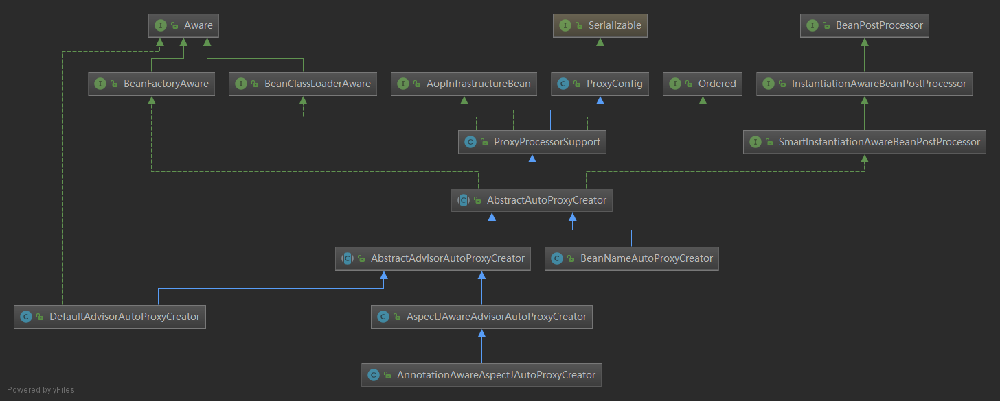

# AspectJAwareAdvisorAutoProxyCreator

-----

## 作用

主要为`AspectJ`切面服务。具体的针对如何创建代理，是在父类中（`AbstractAutoProxyCreator#createProxy`）实现。


`AbstractAutoProxyCreator` 实现了`BeanPostProcess`接口，所以在创建时，调用``postProcessAfterInitialization`方法

1、获取可用的切面advice，从beanFactory中查找可用的切面

2、由ProxyFactory来创建代理对象。默认是采用JDK静态代理，对beanClass为非接口实现类采取CGLIB动态代理 


## 一、AspectJAwareAdvisorAutoProxyCreator类继承关系

----




`SmartInstantiationAwareBeanPostProcessor`是beanPostProcessor接口的子类，spring在实例化bean对象的时候会调用beanPostProcessor的公有接口。 
	
BeanPostProcessor，针对所有Spring上下文中所有的bean，可以在配置文档applicationContext.xml中配置一个BeanPostProcessor，然后对所有的bean进行一个初始化之前和之后的代理。
	
BeanPostProcessor接口中有两个方法： postProcessBeforeInitialization和postProcessAfterInitialization。 postProcessBeforeInitialization方法在bean初始化之前执行， postProcessAfterInitialization方法在bean初始化之后执行。 
	
afterPropertiesSet 和init-method之间的执行顺序是afterPropertiesSet 先执行，init-method 后执行。从BeanPostProcessor的作用，可以看出最先执行的是postProcessBeforeInitialization，然后是afterPropertiesSet，然后是init-method，然后是postProcessAfterInitialization。 
	
postProcessAfterInitialization是bean对象被实例化的最后一步操作的


**bean实例化顺序**，看下面代码：

AbstractAutowireCapableBeanFactory#initializeBean

1、applyBeanPostProcessorsBeforeInitialization-->beanProcessor.postProcessBeforeInitialization

2、invokeInitMethods(beanName, wrappedBean, mbd);  -->

	((InitializingBean) bean).afterPropertiesSet(); 
	
	invokeCustomInitMethod(beanName, bean, mbd);

3、applyBeanPostProcessorsAfterInitialization --> beanProcessor.postProcessAfterInitialization(result, beanName);

```java
/**
 * Initialize the given bean instance, applying factory callbacks
 * as well as init methods and bean post processors.
 * <p>Called from {@link #createBean} for traditionally defined beans,
 * and from {@link #initializeBean} for existing bean instances.
 */
protected Object initializeBean(final String beanName, final Object bean, @Nullable RootBeanDefinition mbd) {
    if (System.getSecurityManager() != null) {
        AccessController.doPrivileged((PrivilegedAction<Object>) () -> {
            invokeAwareMethods(beanName, bean);
            return null;
        }, getAccessControlContext());
    }
    else {
        invokeAwareMethods(beanName, bean);
    }

    Object wrappedBean = bean;
    if (mbd == null || !mbd.isSynthetic()) {
        wrappedBean = applyBeanPostProcessorsBeforeInitialization(wrappedBean, beanName);
    }

    try {
        invokeInitMethods(beanName, wrappedBean, mbd);
    }
    catch (Throwable ex) {
        throw new BeanCreationException((mbd != null ? mbd.getResourceDescription() : null),beanName, "Invocation of init method failed", ex);
    }
    if (mbd == null || !mbd.isSynthetic()) {
        wrappedBean = applyBeanPostProcessorsAfterInitialization(wrappedBean, beanName);
    }

    return wrappedBean;
}
```


## 二、AbstractAutoProxyCreator#postProcessAfterInitialization()-创建代理的入口函数

---

**postProcessAfterInitialization方法主要调用顺序**

AbstractAutoProxyCreator#postProcessAfterInitialization 入口类

-wrapIfNecessary 得到可用的切面，并缓存起来

-- AbstractAdvisorAutoProxyCreator#getAdvicesAndAdvisorsForBean

--- findEligibleAdvisors

----1.findCandidateAdvisors查找所有的切面

----- AbstractAdvisorAutoProxyCreator#findCandidateAdvisors 

------ BeanFactoryAdvisorRetrievalHelper#findAdvisorBeans 查找接口类型为Advisor的

> advisorNames = BeanFactoryUtils.beanNamesForTypeIncludingAncestors(
> 						this.beanFactory, Advisor.class, true, false);
>
> .....
>
> advisors.add(this.beanFactory.getBean(name, Advisor.class));

advisors.add(this.beanFactory.getBean(name, Advisor.class)); 

----2.findAdvisorsThatCanApply在所有的切面有，查找可用切面

-----  AopUtils#findAdvisorsThatCanApply

------  AopUtils#canApply

-------  BeanFactoryTransactionAttributeSourceAdvisor#getPointcut 如果是事务类的会进入到BeanFactoryTransactionAttributeSourceAdvisor


### AbstractAutoProxyCreator#postProcessAfterInitialization()

```java
/**
 * Create a proxy with the configured interceptors if the bean is
 * identified as one to proxy by the subclass.
 * @see #getAdvicesAndAdvisorsForBean
 */
@Override
public Object postProcessAfterInitialization(@Nullable Object bean, String beanName) {
    if (bean != null) {
        // 1、如果之前调用过getEarlyBeanReference获取包装目标对象到AOP代理对象（如果需要），则不再执行 
        Object cacheKey = getCacheKey(bean.getClass(), beanName);
        if (!this.earlyProxyReferences.contains(cacheKey)) {
            //2、包装目标对象到AOP代理对象（如果需要）
            return wrapIfNecessary(bean, beanName, cacheKey);
        }
    }
    return bean;
}
```

`getEarlyBeanReference`和`postProcessAfterInitialization`是二者选一的，而且单例`Bean`目标对象只能被增强一次 

## 三、 AbstractAutoProxyCreator#wrapIfNecessary()  如果bean需要被代理，包装bean返回代理对象
-----
wrapIfNecessary 里面就2个重要方法：
1、getAdvicesAndAdvisorsForBean
2、createProxy

```java
/**
 * Wrap the given bean if necessary, i.e. if it is eligible for being proxied.
 * @param bean the raw bean instance //被代理的bean实例
 * @param beanName the name of the bean //bean名称
 * @param cacheKey the cache key for metadata access
 * @return a proxy wrapping the bean, or the raw bean instance as-is
 */
protected Object wrapIfNecessary(Object bean, String beanName, Object cacheKey) {
    //通过TargetSourceCreator进行自定义TargetSource不需要包装  
    if (StringUtils.hasLength(beanName) && this.targetSourcedBeans.contains(beanName)) {
        return bean;
    }
    //不应该被增强对象不需要包装 
    if (Boolean.FALSE.equals(this.advisedBeans.get(cacheKey))) {
        return bean;
    }
    //Advice/Advisor/AopInfrastructureBean接口的beanClass不进行代理以及对beanName为aop内的切面名也不进行代理，此处可查看子类复写的sholdSkip()方法
    if (isInfrastructureClass(bean.getClass()) || shouldSkip(bean.getClass(), beanName)) {
        this.advisedBeans.put(cacheKey, Boolean.FALSE);
        return bean;
    }

    // Create proxy if we have advice. 
    //获取可用的切面advice，并创建代理
    Object[] specificInterceptors = getAdvicesAndAdvisorsForBean(bean.getClass(), beanName, null);
    if (specificInterceptors != DO_NOT_PROXY) {
        // 将cacheKey添加到已经被增强列表，防止多次增强
        this.advisedBeans.put(cacheKey, Boolean.TRUE);
        // 创建代理对象 <-------------
        Object proxy = createProxy(
            bean.getClass(), beanName, specificInterceptors, new SingletonTargetSource(bean));
        // 缓存代理类型
        this.proxyTypes.put(cacheKey, proxy.getClass());
        return proxy;
    }

    this.advisedBeans.put(cacheKey, Boolean.FALSE);
    return bean;
}
```

从类继承结构上看，AbstractAdvisorAutoProxyCreator和BeanNameAutoProxyCreator都继承了：AbstractAutoProxyCreator。AbstractAdvisorAutoProxyCreator和BeanNameAutoProxyCreator都有getAdvicesAndAdvisorsForBean方法，下面且看AbstractAdvisorAutoProxyCreator


**AbstractAutoProxyCreator有两个子类**

 - 一个是BeanNameAutoProxyCreator，它是基于bean名字的自动代理类。  它会给spring容器中bean名字与指定名字匹配的bean自动创建代理。其中匹配的规则定义在PatternMatchUtils.simpleMatch()方法中。注意：若需要给某个FactoryBean创建代理，可以在bean名字前面加上&.  

-  第二类是AbstractAdvisorAutoProxyCreator，相对BeanNameAutoProxyCreator而言，它更为强大，它会自动获取spring容器中注册的所有的Advisor类（除了子类中isEligibleAdvisorBean（）方法指定的不满足条件的Advisor除外。），然后自动给spring容器中满足Advisor中pointCut创建代理。  

   

   DefaultAdvisorAutoProxyCreator是默认实现，默认会自动代理所有的Advisor，当然也可以通过设置usePrefix和advisorBeanNamePrefix来过滤部分advisor  

   AspectJAwareAdvisorAutoProxyCreator用于支持AspectJ方式的自动代理。 


## 四、 AbstractAdvisorAutoProxyCreator.getAdvicesAndAdvisorsForBean 获取可用的切面advices和Advisors

----


```java
@Override
@Nullable
protected Object[] getAdvicesAndAdvisorsForBean(
    Class<?> beanClass, String beanName, @Nullable TargetSource targetSource) {

    List<Advisor> advisors = findEligibleAdvisors(beanClass, beanName);
    if (advisors.isEmpty()) {
        return DO_NOT_PROXY;
    }
    return advisors.toArray();
}
/**
 * Find all eligible Advisors for auto-proxying this class.
 * @param beanClass the clazz to find advisors for
 * @param beanName the name of the currently proxied bean
 * @return the empty List, not {@code null},
 * if there are no pointcuts or interceptors
 * @see #findCandidateAdvisors
 * @see #sortAdvisors
 * @see #extendAdvisors
 */
protected List<Advisor> findEligibleAdvisors(Class<?> beanClass, String beanName) {
    //Find all candidate Advisors to use in auto-proxying.
    //在自动代理中，查找所有advisors
    List<Advisor> candidateAdvisors = findCandidateAdvisors();
    //Search the given candidate Advisors to find all Advisors that can apply to the specified bean.
    //在所有的advisors中查找符合条件的advisors
    List<Advisor> eligibleAdvisors = findAdvisorsThatCanApply(candidateAdvisors, beanClass, beanName);
    extendAdvisors(eligibleAdvisors);
    if (!eligibleAdvisors.isEmpty()) {
        eligibleAdvisors = sortAdvisors(eligibleAdvisors);
    }
    return eligibleAdvisors;
}
```

findCandidateAdvisors()方法有2个实现方法：

- AbstractAdvisorAutoProxyCreator.findCandidateAdvisors()
- AnnotationAwareAspectJAutoProxyCreator.findCandidateAdvisors()

> AnnotationAwareAspectJAutoProxyCreator extends AspectJAwareAdvisorAutoProxyCreator
>
> AnnotationAwareAspectJAutoProxyCreator重写了findCandidateAdvisors()

`AnnotationAwareAspectJAutoProxyCreator`注解AOP解析，可以看这篇文章：[https://blog.csdn.net/heroqiang/article/details/79037741](https://blog.csdn.net/heroqiang/article/details/79037741)

下面看`AbstractAdvisorAutoProxyCreator.findCandidateAdvisors()`

findCandidateAdvisors会在beanFactory中查找所有的Advisor，调用BeanFactoryAdvisorRetrievalHelper.findAdvisorBeans

BeanFactoryUtils.beanNamesForTypeIncludingAncestors()方法，查找实现接口Advisor的实现类，其中BeanFactoryTransactionAttributeSourceAdvisor、TransactionInterceptor都是Advisor的实现类，在事务AOP时用到。

```java
/**
 * Find all eligible Advisor beans in the current bean factory,
 * ignoring FactoryBeans and excluding beans that are currently in creation.
 * @return the list of {@link org.springframework.aop.Advisor} beans
 * @see #isEligibleBean
 */
public List<Advisor> findAdvisorBeans() {
    // Determine list of advisor bean names, if not cached already.
    String[] advisorNames = null;
    synchronized (this) {
        advisorNames = this.cachedAdvisorBeanNames;
        if (advisorNames == null) {
            // Do not initialize FactoryBeans here: We need to leave all regular beans
            // uninitialized to let the auto-proxy creator apply to them!
            //查找实现接口Advisor的类，其中BeanFactoryTransactionAttributeSourceAdvisor、TransactionInterceptor都是Advisor的实现类，在事务AOP时用到。
            advisorNames = BeanFactoryUtils.beanNamesForTypeIncludingAncestors(
                this.beanFactory, Advisor.class, true, false);
            this.cachedAdvisorBeanNames = advisorNames;
        }
    }
    List<Advisor> advisors = new LinkedList<>();
    for (String name : advisorNames) {
        if (isEligibleBean(name)) {
           //....            
           advisors.add(this.beanFactory.getBean(name, Advisor.class)); 
        }
    }
    return advisors;
}
```


## 五、AbstractAutoProxyCreator#createProxy 创建AOP代理

-----


```java
/**
 * Create an AOP proxy for the given bean.
 * @param beanClass the class of the bean
 * @param beanName the name of the bean
 * @param specificInterceptors the set of interceptors that is
 * specific to this bean (may be empty, but not null)
 * @param targetSource the TargetSource for the proxy,
 * already pre-configured to access the bean
 * @return the AOP proxy for the bean
 * @see #buildAdvisors
 */
protected Object createProxy(Class<?> beanClass, @Nullable String beanName,
                             @Nullable Object[] specificInterceptors, TargetSource targetSource) {

    if (this.beanFactory instanceof ConfigurableListableBeanFactory) {
        AutoProxyUtils.exposeTargetClass((ConfigurableListableBeanFactory) this.beanFactory, beanName, beanClass);
    }
	//采用ProxyFactory对象来创建代理对象
    ProxyFactory proxyFactory = new ProxyFactory();
    proxyFactory.copyFrom(this);
	//是否采用动态代理
    if (!proxyFactory.isProxyTargetClass()) {
        if (shouldProxyTargetClass(beanClass, beanName)) {
            proxyFactory.setProxyTargetClass(true);
        }
        else {
            //Check the interfaces on the given bean class and apply them to the ProxyFactory, if appropriate.
            // 查看beanClass对应的类是否含有InitializingBean.class/DisposableBean.class/Aware.class接口,以及groovy.lang.GroovyObject，.cglib.proxy.Factory，.bytebuddy.MockAccess。无则采用静态代理，有则采用动态代理
            evaluateProxyInterfaces(beanClass, proxyFactory);
        }
    }
	//应用中如果存在高优先级的切面，先它们放到前面去。决定切面的顺序
    Advisor[] advisors = buildAdvisors(beanName, specificInterceptors);
    proxyFactory.addAdvisors(advisors);
    proxyFactory.setTargetSource(targetSource);
    customizeProxyFactory(proxyFactory);

    proxyFactory.setFrozen(this.freezeProxy);
    if (advisorsPreFiltered()) {
        proxyFactory.setPreFiltered(true);
    }

    return proxyFactory.getProxy(getProxyClassLoader());
}
```

### 5.1 创建 `DefaultAopProxyFactory`

当创建`ProxyFactory`时，因为它继承了`ProxyCreatorSupport`，所以会先调用父亲的构造函数，这时会创建`DefaultAopProxyFactory`

> ProxyFactory proxyFactory = new ProxyFactory();

> public class ProxyFactory extends ProxyCreatorSupport

> public ProxyCreatorSupport() {   this.aopProxyFactory = new DefaultAopProxyFactory();}


## 六、proxyFactory#getProxy() 根据proxyFactory中的设置参数，创建代理对象

----


```java
/**
 * Create a new proxy according to the settings in this factory.
 * <p>Can be called repeatedly. Effect will vary if we've added
 * or removed interfaces. Can add and remove interceptors.
 * <p>Uses the given class loader (if necessary for proxy creation).
 * @param classLoader the class loader to create the proxy with
 * (or {@code null} for the low-level proxy facility's default)
 * @return the proxy object
 */
public Object getProxy(@Nullable ClassLoader classLoader) {
    return createAopProxy().getProxy(classLoader); // <---------
}
```


### 6.1 ProxyCreatorSupport#createAopProxy 创建AOP代理：使用JDK或CGLIB

`ProxyCreatorSupport#createAopProxy ` 时，`getAopProxyFactory()`  是指 `DefaultAopProxyFactory`，所以`getAopProxyFactory().createAopProxy`是会调用`DefaultAopProxyFactory#createAopProxy `

```java
/**
 * Subclasses should call this to get a new AOP proxy. They should <b>not</b>
 * create an AOP proxy with {@code this} as an argument.
 */
protected final synchronized AopProxy createAopProxy() {
    if (!this.active) {
        activate();
    }
    return getAopProxyFactory().createAopProxy(this);
}

/**
 * Return the AopProxyFactory that this ProxyConfig uses.
 */
public AopProxyFactory getAopProxyFactory() {
    return this.aopProxyFactory;
}
```

### 6.2 DefaultAopProxyFactory#createAopProxy 决定使用cglib还是jdk代理

默认是采用JDK代理，对beanClass为非接口实现类采取CGLIB动态代理。

**碰到以下三种情况使用CGLIB**

1. ProxyConfig的isOptimize方法为true，这表示让Spring自己去优化。可以通过 ProxyFactory 的 `setOptimize(true)` 方法让 ProxyFactory 启动优化代理方式，这样，针对接口的代理也会使用 CglibAopProxy 
2. ProxyConfig的isProxyTargetClass方法为true，这表示配置了proxy-target-class=”true”
3. ProxyConfig满足hasNoUserSuppliedProxyInterfaces方法执行结果为true，这表示`<bean>`对象没有实现任何接口或者实现的接口是SpringProxy接口

```java
@Override
public AopProxy createAopProxy(AdvisedSupport config) throws AopConfigException {
    if (config.isOptimize() || config.isProxyTargetClass() || hasNoUserSuppliedProxyInterfaces(config)) {
        Class<?> targetClass = config.getTargetClass();
        //...
        if (targetClass.isInterface() || Proxy.isProxyClass(targetClass)) {
            return new JdkDynamicAopProxy(config);
        }
        return new ObjenesisCglibAopProxy(config);
    }
    else {
        return new JdkDynamicAopProxy(config);
    }
}
```


在创建AOP代理后

> return createAopProxy().getProxy(classLoader);

再来看下一节的 `getProxy`方法。

最后根据jdk还是cglib（ObjenesisCglibAopProxy），选择对应的getProxy方法创建代理对象。

下面分别看JdkDynamicAopProxy#getProxy 和 CglibAopProxy#getProxy

### 6.3 JdkDynamicAopProxy#getProxy#

```java
@Override
public Object getProxy(@Nullable ClassLoader classLoader) {
    //.....
    //拿到所有要代理的接口
    Class<?>[] proxiedInterfaces = AopProxyUtils.completeProxiedInterfaces(this.advised, true);
    //寻找这些接口方法里面有没有equals方法和hashCode方法，同时都有的话打个标记，寻找结束，equals方法和hashCode方法有特殊处理
    findDefinedEqualsAndHashCodeMethods(proxiedInterfaces);
    return Proxy.newProxyInstance(classLoader, proxiedInterfaces, this);
}
```

JDK的代理执行，是在 `JdkDynamicAopProxy.invoke()` 中执行的，后面执行调用的时候 ，再来分析这个方法。

Proxy是JDK原生包下的，Proxy.newProxyInstance通过反射构造函数来进行类的实例化。

```
java.lang.reflect.Proxy
```


### 6.4 CglibAopProxy#getProxy 通过返射构造函数创建代理实例

作用：创建并配置 Enhancer，  Enhancer 是CGLIB 主要的操作类，并将`DynamicAdvisedInterceptor`拦截器放到callback 

因为 

>  class ObjenesisCglibAopProxy extends CglibAopProxy

但ObjenesisCglibAopProxy 并没有覆盖getProxy()方法，所以会调用父亲的 `CglibAopProxy#getProxy`

```java
@Override
public Object getProxy(@Nullable ClassLoader classLoader) {
 	//....
    Class<?> rootClass = this.advised.getTargetClass();
    Assert.state(rootClass != null, "Target class must be available for creating a CGLIB proxy");

    Class<?> proxySuperClass = rootClass;
    if (ClassUtils.isCglibProxyClass(rootClass)) {
        proxySuperClass = rootClass.getSuperclass();
        Class<?>[] additionalInterfaces = rootClass.getInterfaces();
        for (Class<?> additionalInterface : additionalInterfaces) {
            this.advised.addInterface(additionalInterface);
        }
    }

    // Validate the class, writing log messages as necessary.
    validateClassIfNecessary(proxySuperClass, classLoader);

    // Configure CGLIB Enhancer...
    //创建并配置 Enhancer，  Enhancer 是CGLIB 主要的操作类
    Enhancer enhancer = createEnhancer();
    if (classLoader != null) {
        enhancer.setClassLoader(classLoader);
        if (classLoader instanceof SmartClassLoader &&
            ((SmartClassLoader) classLoader).isClassReloadable(proxySuperClass)) {
            enhancer.setUseCache(false);
        }
    }
    //配置超类，代理类实现的接口，回调方法等
    enhancer.setSuperclass(proxySuperClass);
    enhancer.setInterfaces(AopProxyUtils.completeProxiedInterfaces(this.advised));
    enhancer.setNamingPolicy(SpringNamingPolicy.INSTANCE);
    enhancer.setStrategy(new ClassLoaderAwareUndeclaredThrowableStrategy(classLoader));

    Callback[] callbacks = getCallbacks(rootClass); // <--------------- 6.4.1
    Class<?>[] types = new Class<?>[callbacks.length];
    for (int x = 0; x < types.length; x++) {
        types[x] = callbacks[x].getClass();
    }
    // fixedInterceptorMap only populated at this point, after getCallbacks call above
    enhancer.setCallbackFilter(new ProxyCallbackFilter(
        this.advised.getConfigurationOnlyCopy(), this.fixedInterceptorMap, this.fixedInterceptorOffset));
    enhancer.setCallbackTypes(types);

    // Generate the proxy class and create a proxy instance.
    return createProxyClassAndInstance(enhancer, callbacks); // <------ 6.4.2
}
```

#### 6.4.1 CglibAopProxy#getCallbacks 来实现AOP代理的拦截

下面的代码，我们可以看到创建了一个`DynamicAdvisedInterceptor`，它最后，被放到Callbacks里面。当被代理的方法执行时，会执行`DynamicAdvisedInterceptor.intercept()`方法。后面执行调用的时候 ，再来分析这个方法。

在Callback[]中有的拦截器包括：

DynamicAdvisedInterceptor、AdvisedDispatcher、SerializableNoOp、EqualsInterceptor、HashCodeInterceptor。

以及根据exposeProxy属性，以及是否是静态对象来决定使用下面哪个拦截器

StaticUnadvisedExposedInterceptor、DynamicUnadvisedExposedInterceptor

StaticUnadvisedInterceptor、DynamicUnadvisedInterceptor

最后将上面这些拦截器放入到callback[]中，返回。
```java
private Callback[] getCallbacks(Class<?> rootClass) throws Exception {
   // Parameters used for optimization choices...
   boolean exposeProxy = this.advised.isExposeProxy();
   boolean isFrozen = this.advised.isFrozen();
   boolean isStatic = this.advised.getTargetSource().isStatic();

   // Choose an "aop" interceptor (used for AOP calls).
   Callback aopInterceptor = new DynamicAdvisedInterceptor(this.advised); //<-----------

   // Choose a "straight to target" interceptor. (used for calls that are
   // unadvised but can return this). May be required to expose the proxy.
   Callback targetInterceptor;
   if (exposeProxy) {
      // 判断被代理的对象是否是静态的，如果是静态的，则将目标对象缓存起来，每次都使用该对象即可，
      // 如果目标对象是动态的，则在DynamicUnadvisedExposedInterceptor中每次都生成一个新的
      // 目标对象，以织入后面的代理逻辑 
      targetInterceptor = (isStatic ?
            new StaticUnadvisedExposedInterceptor(this.advised.getTargetSource().getTarget()) :
            new DynamicUnadvisedExposedInterceptor(this.advised.getTargetSource()));
   }
   else {
      // 下面两个类与上面两个的唯一区别就在于是否使用AopContext暴露生成的代理对象 
      targetInterceptor = (isStatic ?
            new StaticUnadvisedInterceptor(this.advised.getTargetSource().getTarget()) :
            new DynamicUnadvisedInterceptor(this.advised.getTargetSource()));
   }

   // Choose a "direct to target" dispatcher (used for
   // unadvised calls to static targets that cannot return this).
   Callback targetDispatcher = (isStatic ?
         new StaticDispatcher(this.advised.getTargetSource().getTarget()) : new SerializableNoOp());

   Callback[] mainCallbacks = new Callback[] {
         aopInterceptor,  // for normal advice <-----DynamicAdvisedInterceptor放入callbacks中
         targetInterceptor,  // invoke target without considering advice, if optimized
         new SerializableNoOp(),  // no override for methods mapped to this
         targetDispatcher, this.advisedDispatcher,
         new EqualsInterceptor(this.advised),
         new HashCodeInterceptor(this.advised)
   };

   Callback[] callbacks;

   // If the target is a static one and the advice chain is frozen,
   // then we can make some optimizations by sending the AOP calls
   // direct to the target using the fixed chain for that method.
   if (isStatic && isFrozen) {
      Method[] methods = rootClass.getMethods();
      Callback[] fixedCallbacks = new Callback[methods.length];
      this.fixedInterceptorMap = new HashMap<>(methods.length);

      // TODO: small memory optimization here (can skip creation for methods with no advice)
      for (int x = 0; x < methods.length; x++) {
         List<Object> chain = this.advised.getInterceptorsAndDynamicInterceptionAdvice(methods[x], rootClass);
         fixedCallbacks[x] = new FixedChainStaticTargetInterceptor(
               chain, this.advised.getTargetSource().getTarget(), this.advised.getTargetClass());
         this.fixedInterceptorMap.put(methods[x].toString(), x);
      }
    
      // Now copy both the callbacks from mainCallbacks
      // and fixedCallbacks into the callbacks array.
      callbacks = new Callback[mainCallbacks.length + fixedCallbacks.length];
      System.arraycopy(mainCallbacks, 0, callbacks, 0, mainCallbacks.length);
      System.arraycopy(fixedCallbacks, 0, callbacks, mainCallbacks.length, fixedCallbacks.length);
      this.fixedInterceptorOffset = mainCallbacks.length;
   }
   else {
      callbacks = mainCallbacks;
   }
   return callbacks;
}
```


#### 6.4.2 createProxyClassAndInstance 创建代理类和代理实例

如果上面createAOP时，创建的是`ObjenesisCglibAopProxy`，那么`createProxyClassAndInstance()`会调用`ObjenesisCglibAopProxy.createProxyClassAndInstance`方法。

重点，还是将callbacks放到proxyInstance中。

```java
@Override
@SuppressWarnings("unchecked")
protected Object createProxyClassAndInstance(Enhancer enhancer, Callback[] callbacks) {
   Class<?> proxyClass = enhancer.createClass();
   Object proxyInstance = null;

   if (objenesis.isWorthTrying()) {
      try {
         proxyInstance = objenesis.newInstance(proxyClass, enhancer.getUseCache());
      }//.....
   }

   if (proxyInstance == null) {
      // Regular instantiation via default constructor...
      try {
         Constructor<?> ctor = (this.constructorArgs != null ?
               proxyClass.getDeclaredConstructor(this.constructorArgTypes) :
               proxyClass.getDeclaredConstructor());
         ReflectionUtils.makeAccessible(ctor);
         proxyInstance = (this.constructorArgs != null ?
               ctor.newInstance(this.constructorArgs) : ctor.newInstance());
      }//....
   }

   ((Factory) proxyInstance).setCallbacks(callbacks);
   return proxyInstance;
}
```


### 6.5 StaticUnadvisedExposedInterceptor和DynamicUnadvisedExposedInterceptor区别

StaticUnadvisedExposedInterceptor#intercept

每次从线程副本中取旧的代理，然后执行

```java
@Override
@Nullable
public Object intercept(Object proxy, Method method, Object[] args, MethodProxy methodProxy) throws Throwable {
   Object oldProxy = null;
   try {
      oldProxy = AopContext.setCurrentProxy(proxy);
      Object retVal = methodProxy.invoke(this.target, args);
      return processReturnType(proxy, this.target, method, retVal);
   }
   finally {
      AopContext.setCurrentProxy(oldProxy);
   }
}
```


DynamicUnadvisedExposedInterceptor#intercept

每次取出要代理的目前对象，然后执行。

```java
public Object intercept(Object proxy, Method method, Object[] args, MethodProxy methodProxy) throws Throwable {
   Object target = this.targetSource.getTarget();
   try {
      Object retVal = methodProxy.invoke(target, args);
      return processReturnType(proxy, target, method, retVal);
   }
   finally {
      if (target != null) {
         this.targetSource.releaseTarget(target);
      }
   }
}
```


参考：

[Spring AOP源码分析](https://zsr.github.io/2017/11/30/Spring-AOP%E6%BA%90%E7%A0%81%E5%88%86%E6%9E%90/)