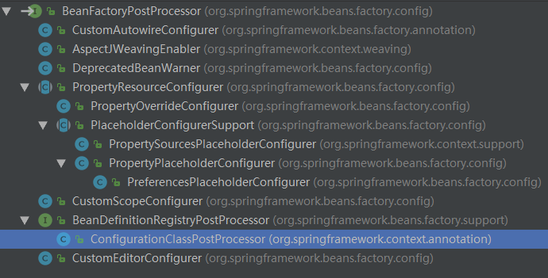
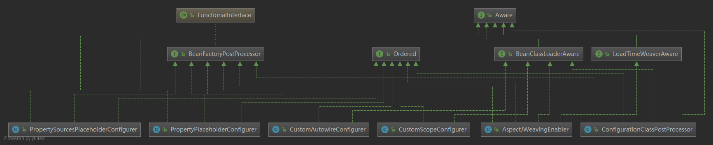
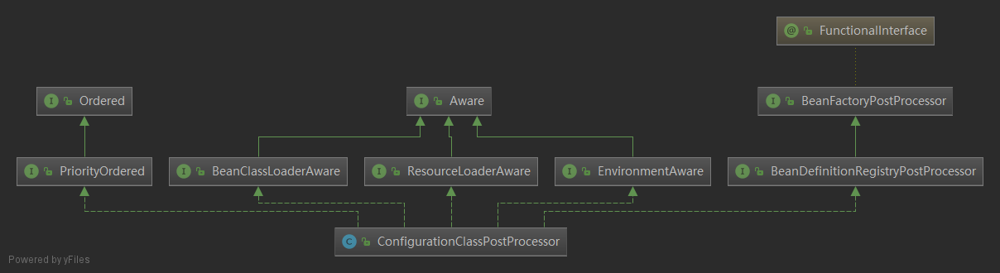

# AbstractApplicationContext#invokeBeanFactoryPostProcessors解析

```java
/**
 * Instantiate and invoke all registered BeanFactoryPostProcessor beans,
 * respecting explicit order if given.
 * <p>Must be called before singleton instantiation.
 */
protected void invokeBeanFactoryPostProcessors(ConfigurableListableBeanFactory beanFactory) {
	PostProcessorRegistrationDelegate.invokeBeanFactoryPostProcessors(beanFactory, getBeanFactoryPostProcessors());

	// Detect a LoadTimeWeaver and prepare for weaving, if found in the meantime
	// (e.g. through an @Bean method registered by ConfigurationClassPostProcessor)
	if (beanFactory.getTempClassLoader() == null && beanFactory.containsBean(LOAD_TIME_WEAVER_BEAN_NAME)) {
		beanFactory.addBeanPostProcessor(new LoadTimeWeaverAwareProcessor(beanFactory));
		beanFactory.setTempClassLoader(new ContextTypeMatchClassLoader(beanFactory.getBeanClassLoader()));
	}
}
```


**invokeBeanFactoryPostProcessors主要的作用**

1、调用实现 了`BeanFactoryPostProcessor`接口的的方法`postProcessBeanFactory`，其中主要是通过2个方法实现的：

- **invokeBeanDefinitionRegistryPostProcessors(Collection<? extends BeanDefinitionRegistryPostProcessor> postProcessors, BeanDefinitionRegistry registry)**，处理`beanFactory`为`BeanDefinitionRegistryPostProcessor`类型的，将`beanFactory`转为`registry`。通过调用`ConfigurationClassPostProcessor#postProcessBeanDefinitionRegistry`

  <font color='red'>`ConfigurationClassPostProcessor#processConfigBeanDefinitions` 注册`<context:annotation-config/>`或者`<context:component-scan/>`，主要是查找`@PropertySource、@ComponentScan、@Import、@ImportResource、@Bean`之类的注解。先将它们筛选出来，解析，再进行注册。</font>

- **invokeBeanFactoryPostProcessors(Collection<? extends BeanFactoryPostProcessor> postProcessors, ConfigurableListableBeanFactory beanFactory)**，调用实现`BeanFactoryPostProcessor`接口的`postProcessBeanFactory`方法。里面有一个重要的类`ConfigurationClassPostProcessor`实现了`postProcessBeanFactory`接口

  <font color='red'>`ConfigurationClassPostProcessor#postProcessBeanFactory`加工处理`ConfigurationClass`， CGLIB对`ConfigurationClass`做了增强，替换原来的`bean`，以便在运行时做代理</font>

2、检测LoadTimeWeaver，并为织入做准备


当然，也有许多其它类实现了`BeanFactoryPostProcessor`接口，但这里主要介绍`ConfigurationClassPostProcessor`，因为`ConfigurationClassPostProcessor`实现了`<context:annotation-config/>`或者`<context:component-scan/>`解析，`@PropertySource、@ComponentScan、@Import、@ImportResource、@Bean`注册，以及加工处理`ConfigurationClass`， CGLIB对`ConfigurationClass`做了增强。

以上功能，invokeBeanFactoryPostProcessors主要是通过代理类`PostProcessorRegistrationDelegate`，对@PriorityOrdered、@Order排序，并调用`ConfigurationClassPostProcessor`的方法，来完成以上功能。


## 一、简介BeanFactoryPostProcessor

-----------

### 1.1 简介

上面的代码，主要还是调用`BeanFactoryPostProcessor`接口实现类的`postProcessBeanFactory`方法

当spring初始化好BenaDefinnitionMap之后，提供了一个接口BeanFactoryPostProcessor。postProcessBeanFactory用于在标准的初始化完成后修改容器上下文中的beanFactory。所有bean定义将被加载，但是它们将暂时不被实例化，这允许覆盖，甚至添加一些属性到延迟初始化的bean上。也就是说，允许我们开发者自定义的去修改BeanFactory中的内容，这也是符合“spring”的开闭原则。invokeBeanFactoryPostProcessors，就是调用postProcessBeanFactory。

BeanDefinitionRegistryPostProcessor继承自BeanFactoryPostProcessor ，提供了更强大的功能。

```java
public interface BeanFactoryPostProcessor {

    /**
     * 这里提供了修改beanFacotry的机会
     */
    void postProcessBeanFactory(ConfigurableListableBeanFactory beanFactory) throws BeansException;

}
```


### 1.2、实现类

### BeanFactoryPostProcessor的实现类

`ConfigurationClassPostProcessor`, `AspectJWeavingEnabler`,`CustomAutowireConfigurer`,`CustomEditorConfigurer`,`CustomScopeConfigurer`,`PlaceholderConfigurerSupport`,`PropertyPlaceholderConfigurer`,`PropertyPlaceholderConfigurer`,`PropertyPlaceholderConfigurer`等等。

【ConfigurationClassPostProcessor】ConfigurationClassPostProcessor 位于 org.springframework.context.annotation 包中，这是一个 **BeanFactoryPostProcessor** ，用于 Spring应用启动过程中 @Configuration 类的处理 。

- 非Springboot的Sping应用，当在配置文件中使用，`<context:annotation-config/> `or`<context:component-scan/>`时，该BeanFactoryPostProcessor 会被注册。
- Springboot 应用，在ApplicationContext对象创建时，会调用 AnnotationConfigUtils.registerAnnotationConfigProcessors() 注册这个BeanFactoryPostProcessor。

【PropertyPlaceholderConfigurer】可以从属性文件、属性类获取属性  

【PreferencesPlaceholderConfigurer】对属性来源具有优先级顺序  

【PropertySourcesPlaceholderConfigurer 】提供了比PropertyPlaceholderConfigurer更强大的功能，可以从属性文件、属性类、环境、PropertySources等获取属性（Spring3.1以后推荐使用这个类）  

【PropertyOverrideConfigurer】可以读取带有bean id的属性直接向bean注入属性，而不需要配置


实现类如下图所示:





稍后取其中一个BeanFactoryPostProcessor继承类：ConfigurationClassPostProcessor做重点分析。


## 二、调用顺序

-----

-AbstractApplicationContext#refresh()

--AbstractApplicationContext#invokeBeanFactoryPostProcessors

---PostProcessorRegistrationDelegate#invokeBeanFactoryPostProcessors

----ConfigurationClassPostProcessor#postProcessBeanDefinitionRegistry

----1、**PostProcessorRegistrationDelegate#invokeBeanDefinitionRegistryPostProcessors**

-----ConfigurationClassPostProcessor#postProcessBeanDefinitionRegistry

------ConfigurationClassPostProcessor#processConfigBeanDefinitions //构建、验证、解析和注册@Configuration class

-------ConfigurationClassUtils#checkConfigurationClassCandidate //判断给定的beanDefinition是否是@Configuration类（或者包括configuration/component的类）

--------ConfigurationClassUtils#isFullConfigurationCandidate /isLiteConfigurationCandidate

> public static boolean isFullConfigurationCandidate(AnnotationMetadata metadata) {
> 	return metadata.isAnnotated(Configuration.class.getName());
> }

-------new ConfigurationClassParser(this.metadataReaderFactory, this.problemReporter, this.environment,this.resourceLoader, this.componentScanBeanNameGenerator, registry)

-------ConfigurationClassParser#parse

--------1.1ConfigurationClassParser#processConfigurationClass

---------ConfigurationClassParser#doProcessConfigurationClass //应用处理并构建一个完整的ConfigurationClass，`doProcessConfigurationClass` 真正的去解析和构建ConfigurationClas，包括`@PropertySource、@ComponentScan、@Import、@ImportResource、@Bean`

--------1.2ConfigurationClassParser#processDeferredImportSelectors() //处理ImportSelector接口

---------ConfigurationClassParser#processImports

----------ImportSelector#selectImports //ImportSelector接口的实现方法selectImports终于被调用成功


----2、**PostProcessorRegistrationDelegate#invokeBeanFactoryPostProcessors**

-----ConfigurationClassPostProcessor#postProcessBeanFactory

------2.1ConfigurationClassPostProcessor#processConfigBeanDefinitions //构建、验证、解析和注册@Configuration class

------2.2ConfigurationClassPostProcessor#enhanceConfigurationClasses //在beanFactory中查找@Configuration类，并通过CGLIB将它增强

-------A、ConfigurationClassUtils#isFullConfigurationClass //通过检查checkConfigurationClassCandidate的元数据标记，确定给定的bean定义是否表示完整的@configuration类。

-------B、beanDef.resolveBeanClass[AbstractBeanDefinition#resolveBeanClass(ClassLoader classLoader)]

--------ClassUtils.forName

---------ClassLoader#loadClass or Class.forName

-------C、ConfigurationClassEnhancer#enhance

--------ConfigurationClassEnhancer#newEnhancer //创建CGLIB Enhancer实例 enhancer

---------Enhancer#createClass //使用增强器enhancer来生成超类的子类，并确保回调注册到新的子类。

----------Enhancer#createHelper

---------Enhancer#registerStaticCallbacks

----------Enhancer#setCallbacksHelper(generatedClass, callbacks, SET_STATIC_CALLBACKS_NAME) //CGLIB$SET_THREAD_CALLBACKS

-------D、beanDef.setBeanClass(enhancedClass); //CGLIB增加类替代原beanClass

------2.3beanFactory.addBeanPostProcessor(new ImportAwareBeanPostProcessor(beanFactory));


## 三、代码分析

-----

```java
/**
 * Instantiate and invoke all registered BeanFactoryPostProcessor beans,
 * respecting explicit order if given.
 * <p>Must be called before singleton instantiation.
 */
protected void invokeBeanFactoryPostProcessors(ConfigurableListableBeanFactory beanFactory) {
	PostProcessorRegistrationDelegate.invokeBeanFactoryPostProcessors(beanFactory, getBeanFactoryPostProcessors());

	// Detect a LoadTimeWeaver and prepare for weaving, if found in the meantime
	// (e.g. through an @Bean method registered by ConfigurationClassPostProcessor)
	if (beanFactory.getTempClassLoader() == null && beanFactory.containsBean(LOAD_TIME_WEAVER_BEAN_NAME)) {
		beanFactory.addBeanPostProcessor(new LoadTimeWeaverAwareProcessor(beanFactory));
		beanFactory.setTempClassLoader(new ContextTypeMatchClassLoader(beanFactory.getBeanClassLoader()));
	}
}
```

下面主要看一下：PostProcessorRegistrationDelegate.invokeBeanFactoryPostProcessors


```java
public static void invokeBeanFactoryPostProcessors(
		ConfigurableListableBeanFactory beanFactory, List<BeanFactoryPostProcessor> beanFactoryPostProcessors) {

	// Invoke BeanDefinitionRegistryPostProcessors first, if any.
	Set<String> processedBeans = new HashSet<>();

	if (beanFactory instanceof BeanDefinitionRegistry) {
		BeanDefinitionRegistry registry = (BeanDefinitionRegistry) beanFactory;
		List<BeanFactoryPostProcessor> regularPostProcessors = new LinkedList<>();
		List<BeanDefinitionRegistryPostProcessor> registryProcessors = new LinkedList<>();

		for (BeanFactoryPostProcessor postProcessor : beanFactoryPostProcessors) {
			if (postProcessor instanceof BeanDefinitionRegistryPostProcessor) {
				BeanDefinitionRegistryPostProcessor registryProcessor =
						(BeanDefinitionRegistryPostProcessor) postProcessor;
                  //这个方法比较重要
				registryProcessor.postProcessBeanDefinitionRegistry(registry);
				registryProcessors.add(registryProcessor);
			}
			else {
				regularPostProcessors.add(postProcessor);
			}
		}

		// Do not initialize FactoryBeans here: We need to leave all regular beans
		// uninitialized to let the bean factory post-processors apply to them!
		// Separate between BeanDefinitionRegistryPostProcessors that implement
		// PriorityOrdered, Ordered, and the rest.
		List<BeanDefinitionRegistryPostProcessor> currentRegistryProcessors = new ArrayList<>();

		// First, invoke the BeanDefinitionRegistryPostProcessors that implement PriorityOrdered.
		String[] postProcessorNames =
				beanFactory.getBeanNamesForType(BeanDefinitionRegistryPostProcessor.class, true, false);
		for (String ppName : postProcessorNames) {
			if (beanFactory.isTypeMatch(ppName, PriorityOrdered.class)) {
				currentRegistryProcessors.add(beanFactory.getBean(ppName, BeanDefinitionRegistryPostProcessor.class));
				processedBeans.add(ppName);
			}
		}
		sortPostProcessors(currentRegistryProcessors, beanFactory);
		registryProcessors.addAll(currentRegistryProcessors);
         //创建@Configuration 类，并在解析后，进行注册
		invokeBeanDefinitionRegistryPostProcessors(currentRegistryProcessors, registry);
		currentRegistryProcessors.clear();

		// Next, invoke the BeanDefinitionRegistryPostProcessors that implement Ordered.
		postProcessorNames = beanFactory.getBeanNamesForType(BeanDefinitionRegistryPostProcessor.class, true, false);
		for (String ppName : postProcessorNames) {
			if (!processedBeans.contains(ppName) && beanFactory.isTypeMatch(ppName, Ordered.class)) {
				currentRegistryProcessors.add(beanFactory.getBean(ppName, BeanDefinitionRegistryPostProcessor.class));
				processedBeans.add(ppName);
			}
		}
		sortPostProcessors(currentRegistryProcessors, beanFactory);
		registryProcessors.addAll(currentRegistryProcessors);
		invokeBeanDefinitionRegistryPostProcessors(currentRegistryProcessors, registry);
		currentRegistryProcessors.clear();

		// Finally, invoke all other BeanDefinitionRegistryPostProcessors until no further ones appear.
		boolean reiterate = true;
		while (reiterate) {
			reiterate = false;
			postProcessorNames = beanFactory.getBeanNamesForType(BeanDefinitionRegistryPostProcessor.class, true, false);
			for (String ppName : postProcessorNames) {
				if (!processedBeans.contains(ppName)) {
					currentRegistryProcessors.add(beanFactory.getBean(ppName, BeanDefinitionRegistryPostProcessor.class));
					processedBeans.add(ppName);
					reiterate = true;
				}
			}
			sortPostProcessors(currentRegistryProcessors, beanFactory);
			registryProcessors.addAll(currentRegistryProcessors);
			invokeBeanDefinitionRegistryPostProcessors(currentRegistryProcessors, registry);
			currentRegistryProcessors.clear();
		}

		// Now, invoke the postProcessBeanFactory callback of all processors handled so far.
		invokeBeanFactoryPostProcessors(registryProcessors, beanFactory);
		invokeBeanFactoryPostProcessors(regularPostProcessors, beanFactory);
	}

	else {
		// Invoke factory processors registered with the context instance.
		invokeBeanFactoryPostProcessors(beanFactoryPostProcessors, beanFactory);
	}

	// Do not initialize FactoryBeans here: We need to leave all regular beans
	// uninitialized to let the bean factory post-processors apply to them!
	String[] postProcessorNames =
			beanFactory.getBeanNamesForType(BeanFactoryPostProcessor.class, true, false);

	// Separate between BeanFactoryPostProcessors that implement PriorityOrdered,
	// Ordered, and the rest.
	List<BeanFactoryPostProcessor> priorityOrderedPostProcessors = new ArrayList<>();
	List<String> orderedPostProcessorNames = new ArrayList<>();
	List<String> nonOrderedPostProcessorNames = new ArrayList<>();
	for (String ppName : postProcessorNames) {
		if (processedBeans.contains(ppName)) {
			// skip - already processed in first phase above
		}
		else if (beanFactory.isTypeMatch(ppName, PriorityOrdered.class)) {
			priorityOrderedPostProcessors.add(beanFactory.getBean(ppName, BeanFactoryPostProcessor.class));
		}
		else if (beanFactory.isTypeMatch(ppName, Ordered.class)) {
			orderedPostProcessorNames.add(ppName);
		}
		else {
			nonOrderedPostProcessorNames.add(ppName);
		}
	}

	// First, invoke the BeanFactoryPostProcessors that implement PriorityOrdered.
	sortPostProcessors(priorityOrderedPostProcessors, beanFactory);
	invokeBeanFactoryPostProcessors(priorityOrderedPostProcessors, beanFactory);

	// Next, invoke the BeanFactoryPostProcessors that implement Ordered.
	List<BeanFactoryPostProcessor> orderedPostProcessors = new ArrayList<>();
	for (String postProcessorName : orderedPostProcessorNames) {
		orderedPostProcessors.add(beanFactory.getBean(postProcessorName, BeanFactoryPostProcessor.class));
	}
	sortPostProcessors(orderedPostProcessors, beanFactory);
	invokeBeanFactoryPostProcessors(orderedPostProcessors, beanFactory);

	// Finally, invoke all other BeanFactoryPostProcessors.
	List<BeanFactoryPostProcessor> nonOrderedPostProcessors = new ArrayList<>();
	for (String postProcessorName : nonOrderedPostProcessorNames) {
		nonOrderedPostProcessors.add(beanFactory.getBean(postProcessorName, BeanFactoryPostProcessor.class));
	}
	invokeBeanFactoryPostProcessors(nonOrderedPostProcessors, beanFactory);

	// Clear cached merged bean definitions since the post-processors might have
	// modified the original metadata, e.g. replacing placeholders in values...
	beanFactory.clearMetadataCache();
}
```


 ### 3.1、如果beanFactory是BeanDefinitionRegistry类型 (beanFactory instanceof BeanDefinitionRegistry)

```java
public static void invokeBeanFactoryPostProcessors(
			ConfigurableListableBeanFactory beanFactory, List<BeanFactoryPostProcessor> beanFactoryPostProcessors)
```

3.1 后面主要是对`BeanDefinitionRegistry registry`进行操作:

> invokeBeanDefinitionRegistryPostProcessors(Collection<? extends BeanDefinitionRegistryPostProcessor> postProcessors, BeanDefinitionRegistry registry)
>
> 为了后面方便描述，简化成：
>
> invokeBeanDefinitionRegistryPostProcessors(currentRegistryProcessors, registry);

**`invokeBeanDefinitionRegistryPostProcessors`调用 `ConfigurationClassPostProcessor#processConfigBeanDefinitions` 注册`<context:annotation-config/>`或者`<context:component-scan/>`，主要是查找`@PropertySource、@ComponentScan、@Import、@ImportResource、@Bean`之类的注解。先将它们筛选出来，解析，再进行注册。**


A、判断入参`beanFactoryPostProcessors`的类型，如果是`BeanDefinitionRegistryPostProcessor`，则进行遍历强转:

> `BeanDefinitionRegistry registry = (BeanDefinitionRegistry) beanFactory;`

- 执行 `ConfigurationClassPostProcessor#postProcessBeanDefinitionRegistry(registry)`，此方法第四节讲到，主要功能2个

> 第一步，根据registryId生成hashCode，做为唯一id，注册到registriesPostProcessed中。
>
> 第二步，执行ConfigurationClassPostProcessor#processConfigBeanDefinitions 主要是注册@configuration @Bean之类的注解。先将它们筛选出来，再进行注册。

- 将转后的类型存到`List<BeanDefinitionRegistryPostProcessor> registryProcessors`中
- 如果不是`BeanDefinitionRegistryPostProcessor`类型，则存到`List<BeanDefinitionRegistryPostProcessor> registryProcessors`中

B、在`beanFactory`中找出所有`BeanDefinitionRegistryPostProcessors.class`类型的，并带有`@PriorityOrdered`注解的，加了`@Confiuration`的类，进行解析构建`Configuration`类，通过`invokeBeanDefinitionRegistryPostProcessors(currentRegistryProcessors, registry)`并进行注册。

**如果BeanFactoryPostProcessor实现了PriorityOrdered接口（PriorityOrdered接口是Ordered的子接口，没有自己的接口方法定义，只是做一个标记，表示调用优先级高于Ordered接口的子接口），是优先级最高的调用，调用顺序是按照接口方法getOrder()的实现，对返回的int值从小到大进行排序，进行调用。**

C、在beanFactory中找出所有BeanDefinitionRegistryPostProcessors.class类型的，并带有@Ordered注解的,加了@Confiuration的类，进行解析构建Configuration类，通过`invokeBeanDefinitionRegistryPostProcessors(currentRegistryProcessors, registry)`并进行注册。

D、在beanFactory中找出所有BeanDefinitionRegistryPostProcessors.class类型的，除了PriorityOrdered、Ordered的，取出剩下的，带有@configuration类进行解析，并通过`invokeBeanDefinitionRegistryPostProcessors(currentRegistryProcessors, registry)`并进行注册。

E、根据入参`List<BeanFactoryPostProcessor> beanFactoryPostProcessors`，调用所有实现BeanFactoryPostProcessor接口类的方法：postProcessBeanFactory。第五节有讲`ConfigurationClassPostProcessor#postProcessBeanFactory` ，其它的接口实现类省略，`ConfigurationClassPostProcessor#postProcessBeanFactory` 主要的功能还是对@configuration做CGLIB增强，并替换原来的beanDefinition，以便在运行时做代理。

```java
@FunctionalInterface
public interface BeanFactoryPostProcessor {

	/**
	 * Modify the application context's internal bean factory after its standard
	 * initialization. All bean definitions will have been loaded, but no beans
	 * will have been instantiated yet. This allows for overriding or adding
	 * properties even to eager-initializing beans.
	 * @param beanFactory the bean factory used by the application context
	 * @throws org.springframework.beans.BeansException in case of errors
	 */
	void postProcessBeanFactory(ConfigurableListableBeanFactory beanFactory) throws BeansException;

}
```


### 3.2 如果beanFactory不是BeanDefinitionRegistry类型，则根据入参`List<BeanFactoryPostProcessor> beanFactoryPostProcessors`，调用所有实现BeanFactoryPostProcessor接口类的方法：postProcessBeanFactory


### 3.3 在beanFactory中，取出BeanFactoryPostProcessor.class的类型的，进行处理。

A、查找带@PriorityOrdered的，排序后，调用 `invokeBeanFactoryPostProcessors`,CGLIB对`ConfigurationClass`做了增强，替换原来的`bean`，以便在运行时做代理

B、查找带@Ordered的，排序后，调用 `invokeBeanFactoryPostProcessors`,CGLIB对`ConfigurationClass`做了增强，替换原来的`bean`，以便在运行时做代理

C、查找剩下的，调用 `invokeBeanFactoryPostProcessors`


## 四、分析ConfigurationClassPostProcessor#postProcessBeanDefinitionRegistry方法

------------
### 4.1 ConfigurationClassPostProcessor类简介

ConfigurationClassPostProcessor的继承关系如下图所示：



```java
/**
 * {@link BeanFactoryPostProcessor} used for bootstrapping processing of
 * {@link Configuration @Configuration} classes.
 *
 * <p>Registered by default when using {@code <context:annotation-config/>} or
 * {@code <context:component-scan/>}. Otherwise, may be declared manually as
 * with any other BeanFactoryPostProcessor.
 *
 * <p>This post processor is {@link Ordered#HIGHEST_PRECEDENCE} as it is important
 * that any {@link Bean} methods declared in Configuration classes have their
 * respective bean definitions registered before any other BeanFactoryPostProcessor
 * executes.
 */
public class ConfigurationClassPostProcessor implements BeanDefinitionRegistryPostProcessor,
		PriorityOrdered, ResourceLoaderAware, BeanClassLoaderAware, EnvironmentAware {
```


### 4.1 postProcessBeanDefinitionRegistry方法

第一步，根据registryId生成hashCode，做为唯一id，注册到registriesPostProcessed中。

<font color='red'>第二步，执行`ConfigurationClassPostProcessor#processConfigBeanDefinitions` 注册`<context:annotation-config/>`或者`<context:component-scan/>`，主要是查找`@PropertySource、@ComponentScan、@Import、@ImportResource、@Bean`之类的注解。先将它们筛选出来，解析，再进行注册。</font>

```java
/**
 * Derive further bean definitions from the configuration classes in the registry.
 */
@Override
public void postProcessBeanDefinitionRegistry(BeanDefinitionRegistry registry) {
	int registryId = System.identityHashCode(registry);
	//.....
	this.registriesPostProcessed.add(registryId);

	processConfigBeanDefinitions(registry);
}
```


### 4.2 processConfigBeanDefinitions  创建@Configuration 解析类，并在其解析后，进行注册。

```java
/**
 * Build and validate a configuration model based on the registry of
 * {@link Configuration} classes.
 */
public void processConfigBeanDefinitions(BeanDefinitionRegistry registry) {
	List<BeanDefinitionHolder> configCandidates = new ArrayList<>();
	String[] candidateNames = registry.getBeanDefinitionNames();

	for (String beanName : candidateNames) {
		BeanDefinition beanDef = registry.getBeanDefinition(beanName);
		//....
         //4.2.1 判断当前的BeanDefinition是否包含configuration，或者类里面是否包含configuration/component，如果有，则入到configCandidates中
		if (ConfigurationClassUtils.checkConfigurationClassCandidate(beanDef, this.metadataReaderFactory)) {
			configCandidates.add(new BeanDefinitionHolder(beanDef, beanName));
		}
	}

	// Return immediately if no @Configuration classes were found
	if (configCandidates.isEmpty()) {
		return;
	}

	// Sort by previously determined @Order value, if applicable
	configCandidates.sort((bd1, bd2) -> {
		int i1 = ConfigurationClassUtils.getOrder(bd1.getBeanDefinition());
		int i2 = ConfigurationClassUtils.getOrder(bd2.getBeanDefinition());
		return Integer.compare(i1, i2);
	});

	// Detect any custom bean name generation strategy supplied through the enclosing application context
	SingletonBeanRegistry sbr = null;
	if (registry instanceof SingletonBeanRegistry) {
		sbr = (SingletonBeanRegistry) registry;
		if (!this.localBeanNameGeneratorSet) {
			BeanNameGenerator generator = (BeanNameGenerator) sbr.getSingleton(CONFIGURATION_BEAN_NAME_GENERATOR);
			if (generator != null) {
				this.componentScanBeanNameGenerator = generator;
				this.importBeanNameGenerator = generator;
			}
		}
	}

	if (this.environment == null) {
		this.environment = new StandardEnvironment();
	}

	// Parse each @Configuration class
	ConfigurationClassParser parser = new ConfigurationClassParser(
			this.metadataReaderFactory, this.problemReporter, this.environment,
			this.resourceLoader, this.componentScanBeanNameGenerator, registry);

	Set<BeanDefinitionHolder> candidates = new LinkedHashSet<>(configCandidates);
	Set<ConfigurationClass> alreadyParsed = new HashSet<>(configCandidates.size());
	do {
		parser.parse(candidates);
		parser.validate();

		Set<ConfigurationClass> configClasses = new LinkedHashSet<>(parser.getConfigurationClasses());
		configClasses.removeAll(alreadyParsed);

		// Read the model and create bean definitions based on its content
		if (this.reader == null) {
			this.reader = new ConfigurationClassBeanDefinitionReader(
					registry, this.sourceExtractor, this.resourceLoader, this.environment,
					this.importBeanNameGenerator, parser.getImportRegistry());
		}
		this.reader.loadBeanDefinitions(configClasses);
		alreadyParsed.addAll(configClasses);

		candidates.clear();
		if (registry.getBeanDefinitionCount() > candidateNames.length) {
			String[] newCandidateNames = registry.getBeanDefinitionNames();
			Set<String> oldCandidateNames = new HashSet<>(Arrays.asList(candidateNames));
			Set<String> alreadyParsedClasses = new HashSet<>();
			for (ConfigurationClass configurationClass : alreadyParsed) {
				alreadyParsedClasses.add(configurationClass.getMetadata().getClassName());
			}
			for (String candidateName : newCandidateNames) {
				if (!oldCandidateNames.contains(candidateName)) {
					BeanDefinition bd = registry.getBeanDefinition(candidateName);
					if (ConfigurationClassUtils.checkConfigurationClassCandidate(bd, this.metadataReaderFactory) &&
							!alreadyParsedClasses.contains(bd.getBeanClassName())) {
						candidates.add(new BeanDefinitionHolder(bd, candidateName));
					}
				}
			}
			candidateNames = newCandidateNames;
		}
	}
	while (!candidates.isEmpty());

	// Register the ImportRegistry as a bean in order to support ImportAware @Configuration classes
    //如果SingletonBeanRegistry 不包含org.springframework.context.annotation.ConfigurationClassPostProcessor.importRegistry则注册一个,bean 为 ImportRegistry. 一般都会进行注册的
	if (sbr != null && !sbr.containsSingleton(IMPORT_REGISTRY_BEAN_NAME)) {
		sbr.registerSingleton(IMPORT_REGISTRY_BEAN_NAME, parser.getImportRegistry());
	}

	if (this.metadataReaderFactory instanceof CachingMetadataReaderFactory) {
		// Clear cache in externally provided MetadataReaderFactory; this is a no-op
		// for a shared cache since it'll be cleared by the ApplicationContext.
		((CachingMetadataReaderFactory) this.metadataReaderFactory).clearCache();
	}
}
```


#### 4.2.1 ConfigurationClassUtils#checkConfigurationClassCandidate 判断当前的BeanDefinition是否包含configurationClass类，或者类里面是否包含configuration/component/Import/ComponentScan

```java
public static boolean checkConfigurationClassCandidate(
		BeanDefinition beanDef, MetadataReaderFactory metadataReaderFactory) {
	String className = beanDef.getBeanClassName();
	if (className == null || beanDef.getFactoryMethodName() != null) {
		return false;
	}
	AnnotationMetadata metadata;
    //获得AnnotationMetadata
	if (beanDef instanceof AnnotatedBeanDefinition &&
			className.equals(((AnnotatedBeanDefinition) beanDef).getMetadata().getClassName())) {
		// Can reuse the pre-parsed metadata from the given BeanDefinition...
        //如果BeanDefinition 是 AnnotatedBeanDefinition的实例,并且className 和BeanDefinition中的元数据的类名相同,则直接从BeanDefinition 获得Metadata
		metadata = ((AnnotatedBeanDefinition) beanDef).getMetadata();
	}
    //如果BeanDefinition 是 AnnotatedBeanDefinition的实例,并且beanDef 有 beanClass 属性存在,则实例化StandardAnnotationMetadata
	else if (beanDef instanceof AbstractBeanDefinition && ((AbstractBeanDefinition) beanDef).hasBeanClass()) {
		// Check already loaded Class if present...
		// since we possibly can't even load the class file for this Class.
		Class<?> beanClass = ((AbstractBeanDefinition) beanDef).getBeanClass();
		metadata = new StandardAnnotationMetadata(beanClass, true);
	}
	else {
        try {
            // 否则 通过MetadataReaderFactory 中的MetadataReader 进行读取
            MetadataReader metadataReader = metadataReaderFactory.getMetadataReader(className);
            metadata = metadataReader.getAnnotationMetadata();
        }
        catch (IOException ex) {
            if (logger.isDebugEnabled()) {
                logger.debug("Could not find class file for introspecting configuration annotations: " + className, ex);
            }
            return false;
        }
    }

	//4.2.1 判断是否包括Configuration.class
    //如果存在Configuration 注解,则为BeanDefinition 设置configurationClass属性为full
	if (isFullConfigurationCandidate(metadata)) {
		beanDef.setAttribute(CONFIGURATION_CLASS_ATTRIBUTE, CONFIGURATION_CLASS_FULL);
	}
    //4.2.2判断是否包含Component、Bean等注解
    //如果AnnotationMetadata 中有Component,ComponentScan,Import,ImportResource 注解中的任意一个,或者存在 被@bean 注解的方法,则返回true. 则设置configurationClass属性为lite
	else if (isLiteConfigurationCandidate(metadata)) {
		beanDef.setAttribute(CONFIGURATION_CLASS_ATTRIBUTE, CONFIGURATION_CLASS_LITE);
	}
	else {
		return hasNestedConfigurationClass(metadata, metadataReaderFactory);
	}
	// It's a full or lite configuration candidate... Let's determine the order value, if any.
    //如果该类被@Order所注解,则设置order属性为@Order的值
	Integer order = getOrder(metadata);
	if (order != null) {
		beanDef.setAttribute(ORDER_ATTRIBUTE, order);
	}
	return true;
}
```


##### 4.2.1.1 ConfigurationClassUtils#isFullConfigurationCandidate判断是否包括Configuration.class

```java
public static boolean isFullConfigurationCandidate(AnnotationMetadata metadata) {
    return metadata.isAnnotated(Configuration.class.getName());
}
```

##### 4.2.2.2 ConfigurationClassUtils#isLiteConfigurationCandidate判断是否包含Component、ComponentScan、Bean/ImportResource等注解

```java
private static final Set<String> candidateIndicators = new HashSet<>(8);

static {
    candidateIndicators.add(Component.class.getName());
    candidateIndicators.add(ComponentScan.class.getName());
    candidateIndicators.add(Import.class.getName());
    candidateIndicators.add(ImportResource.class.getName());
}

public static boolean isLiteConfigurationCandidate(AnnotationMetadata metadata) {
	//....
	// Any of the typical annotations found?
	for (String indicator : candidateIndicators) {
		if (metadata.isAnnotated(indicator)) {
			return true;
		}
	}
	// Finally, let's look for @Bean methods...
	try {
		return metadata.hasAnnotatedMethods(Bean.class.getName());
	}
	//....
	return false;	
}
```


#### 4.2.2 configCandidates.sort如果@order存在，则进行排序

#### 4.2.3 registry 是SingletonBeanRegistry类型...

#### 4.2.4 创建ConfigurationClassParser解析器，解析ConfigurationClass类

ConfigurationClassParser，是ConfigurationClass的解析类

```java
// Parse each @Configuration class
ConfigurationClassParser parser = new ConfigurationClassParser(
    this.metadataReaderFactory, this.problemReporter, this.environment,
    this.resourceLoader, this.componentScanBeanNameGenerator, registry);
```


#### 4.2.5 ConfigurationClassParser#parser.parse(candidates) 进行解析

根据checkConfigurationClassCandidate筛选出configuration的class进行解析

1. 实例化deferredImportSelectors
2. 遍历configCandidates ,进行处理.根据BeanDefinition 的类型 做不同的处理,一般都会调用ConfigurationClassParser#parse 进行解析
3. 处理ImportSelect

```java
public void parse(Set<BeanDefinitionHolder> configCandidates) {
	this.deferredImportSelectors = new LinkedList<>();

	for (BeanDefinitionHolder holder : configCandidates) {
		BeanDefinition bd = holder.getBeanDefinition();
		try {
			if (bd instanceof AnnotatedBeanDefinition) {
                  //4.2.5.1会最终调用processConfigurationClass
				parse(((AnnotatedBeanDefinition) bd).getMetadata(), holder.getBeanName());
			}
             //4.2.5.1会最终调用processConfigurationClass
			else if (bd instanceof AbstractBeanDefinition && ((AbstractBeanDefinition) bd).hasBeanClass()) {
				parse(((AbstractBeanDefinition) bd).getBeanClass(), holder.getBeanName());
			}
             //4.2.5.1会最终调用processConfigurationClass
			else {
				parse(bd.getBeanClassName(), holder.getBeanName());
			}
		}
		catch (BeanDefinitionStoreException ex) {
			throw ex;
		}
		catch (Throwable ex) {
			throw new BeanDefinitionStoreException(
					"Failed to parse configuration class [" + bd.getBeanClassName() + "]", ex);
		}
	}
	//4.2.5.2 
	processDeferredImportSelectors();
}
```

#### 4.2.5.1 会最终调用ConfigurationClassParser#processConfigurationClass 去解析和构建ConfigurationClass

```java
protected final void parse(@Nullable String className, String beanName) throws IOException {
	Assert.notNull(className, "No bean class name for configuration class bean definition");
	MetadataReader reader = this.metadataReaderFactory.getMetadataReader(className);
	processConfigurationClass(new ConfigurationClass(reader, beanName));
}

protected final void parse(Class<?> clazz, String beanName) throws IOException {
	processConfigurationClass(new ConfigurationClass(clazz, beanName));
}

protected final void parse(AnnotationMetadata metadata, String beanName) throws IOException {
	processConfigurationClass(new ConfigurationClass(metadata, beanName));
}
```

##### 4.2.5.1.1 ConfigurationClassParser#processConfigurationClass

```java
protected void processConfigurationClass(ConfigurationClass configClass) throws IOException {
	//.....
	// Recursively process the configuration class and its superclass hierarchy.
	SourceClass sourceClass = asSourceClass(configClass);
	do {
		sourceClass = doProcessConfigurationClass(configClass, sourceClass);
	}
	while (sourceClass != null);

	this.configurationClasses.put(configClass, configClass);
}
```

##### 4.2.5.1.2 ConfigurationClassParser#doProcessConfigurationClass 真正的去解析和构建ConfigurationClass，包括@PropertySource、@ComponentScan、@Import、@ImportResource、@Bean

<font color="red" size="4"> 真正的去解析ConfigurationClass，包括：@PropertySource、@ComponentScan、@Import、@ImportResource、@Bean </font>


```java
/**
 * Apply processing and build a complete {@link ConfigurationClass} by reading the
 * annotations, members and methods from the source class. This method can be called
 * multiple times as relevant sources are discovered.
 * @param configClass the configuration class being build
 * @param sourceClass a source class
 * @return the superclass, or {@code null} if none found or previously processed
 */
@Nullable
protected final SourceClass doProcessConfigurationClass(ConfigurationClass configClass, SourceClass sourceClass)
		throws IOException {

	// Recursively process any member (nested) classes first
	processMemberClasses(configClass, sourceClass);

	// Process any @PropertySource annotations
	for (AnnotationAttributes propertySource : AnnotationConfigUtils.attributesForRepeatable(
			sourceClass.getMetadata(), PropertySources.class,
			org.springframework.context.annotation.PropertySource.class)) {
		if (this.environment instanceof ConfigurableEnvironment) {
			processPropertySource(propertySource);
		}
		else {
			logger.warn("Ignoring @PropertySource annotation on [" + sourceClass.getMetadata().getClassName() +
					"]. Reason: Environment must implement ConfigurableEnvironment");
		}
	}

	// Process any @ComponentScan annotations
	Set<AnnotationAttributes> componentScans = AnnotationConfigUtils.attributesForRepeatable(
			sourceClass.getMetadata(), ComponentScans.class, ComponentScan.class);
	if (!componentScans.isEmpty() &&
			!this.conditionEvaluator.shouldSkip(sourceClass.getMetadata(), ConfigurationPhase.REGISTER_BEAN)) {
		for (AnnotationAttributes componentScan : componentScans) {
			// The config class is annotated with @ComponentScan -> perform the scan immediately
			Set<BeanDefinitionHolder> scannedBeanDefinitions =
					this.componentScanParser.parse(componentScan, sourceClass.getMetadata().getClassName());
			// Check the set of scanned definitions for any further config classes and parse recursively if needed
			for (BeanDefinitionHolder holder : scannedBeanDefinitions) {
				BeanDefinition bdCand = holder.getBeanDefinition().getOriginatingBeanDefinition();
				if (bdCand == null) {
					bdCand = holder.getBeanDefinition();
				}
				if (ConfigurationClassUtils.checkConfigurationClassCandidate(bdCand, this.metadataReaderFactory)) {
					parse(bdCand.getBeanClassName(), holder.getBeanName());
				}
			}
		}
	}

	// Process any @Import annotations
	processImports(configClass, sourceClass, getImports(sourceClass), true);

	// Process any @ImportResource annotations
	AnnotationAttributes importResource =
			AnnotationConfigUtils.attributesFor(sourceClass.getMetadata(), ImportResource.class);
	if (importResource != null) {
		String[] resources = importResource.getStringArray("locations");
		Class<? extends BeanDefinitionReader> readerClass = importResource.getClass("reader");
		for (String resource : resources) {
			String resolvedResource = this.environment.resolveRequiredPlaceholders(resource);
			configClass.addImportedResource(resolvedResource, readerClass);
		}
	}

	// Process individual @Bean methods
	Set<MethodMetadata> beanMethods = retrieveBeanMethodMetadata(sourceClass);
	for (MethodMetadata methodMetadata : beanMethods) {
		configClass.addBeanMethod(new BeanMethod(methodMetadata, configClass));
	}

	// Process default methods on interfaces
	processInterfaces(configClass, sourceClass);

	// Process superclass, if any
	if (sourceClass.getMetadata().hasSuperClass()) {
		String superclass = sourceClass.getMetadata().getSuperClassName();
		if (superclass != null && !superclass.startsWith("java") &&
				!this.knownSuperclasses.containsKey(superclass)) {
			this.knownSuperclasses.put(superclass, configClass);
			// Superclass found, return its annotation metadata and recurse
			return sourceClass.getSuperClass();
		}
	}

	// No superclass -> processing is complete
	return null;
}
```


#### 4.2.5.2 ConfigurationClassParser#processDeferredImportSelectors

ImportSelector的导入实现是通过BeanFactoryPostProcessor接口的子接口BeanDefinitionRegistryPostProcessor来实现的。

ImportSelector接口的处理是伴随着@Configuration注解的处理一起处理的。

ImportSelector接口可以实现自定义条件选择性导入classes。

ImportSelector接口的字接口DeferredImportSelector在所有@Configuration处理完成后才被处理的。

处理ImportSelector接口时，bean定义已经被加载，但是bean还没有被实例化。

Spring Bootn的自动配置功能就是通过DeferredImportSelector接口的实现类EnableAutoConfigurationImportSelector做到的。

```java
private void processDeferredImportSelectors() {
	List<DeferredImportSelectorHolder> deferredImports = this.deferredImportSelectors;
	//....
	Map<Object, DeferredImportSelectorGrouping> groupings = new LinkedHashMap<>();
	Map<AnnotationMetadata, ConfigurationClass> configurationClasses = new HashMap<>();
	for (DeferredImportSelectorHolder deferredImport : deferredImports) {
		//...
		configurationClasses.put(deferredImport.getConfigurationClass().getMetadata(),
				deferredImport.getConfigurationClass());
	}
	for (DeferredImportSelectorGrouping grouping : groupings.values()) {
		grouping.getImports().forEach(entry -> {
			ConfigurationClass configurationClass = configurationClasses.get(entry.getMetadata());
			try {
				processImports(configurationClass, asSourceClass(configurationClass),
						asSourceClasses(entry.getImportClassName()), false);
			}
            //.....
		});
	}
}
```


##### 4.2.5.2.1 ConfigurationClassParser#processImports //ImportSelector接口的实现方法selectImports被调用成功

```java
private void processImports(ConfigurationClass configClass, SourceClass currentSourceClass,
			Collection<SourceClass> importCandidates, boolean checkForCircularImports) {

	//...
	this.importStack.push(configClass);
	//...
	for (SourceClass candidate : importCandidates) {
		//检查类型是否是ImportSelector
		if (candidate.isAssignable(ImportSelector.class)) {
			// Candidate class is an ImportSelector -> delegate to it to determine imports
			Class<?> candidateClass = candidate.loadClass();
			ImportSelector selector = BeanUtils.instantiateClass(candidateClass, ImportSelector.class);
			//Invoke BeanClassLoaderAware,  BeanFactoryAware,EnvironmentAware, and ResourceLoaderAware contracts if implemented by the given object.
			ParserStrategyUtils.invokeAwareMethods(
					selector, this.environment, this.resourceLoader, this.registry);
			if (this.deferredImportSelectors != null && selector instanceof DeferredImportSelector) {
				this.deferredImportSelectors.add(
						new DeferredImportSelectorHolder(configClass, (DeferredImportSelector) selector));
			}
			else {
				//调用selector的selectImpors方法，把要导入的类的元数据信息作为参数，根据具体的实现逻辑返回要导入的classes
				String[] importClassNames = selector.selectImports(currentSourceClass.getMetadata());
				Collection<SourceClass> importSourceClasses = asSourceClasses(importClassNames);
				processImports(configClass, currentSourceClass, importSourceClasses, false);
			}
		}
		else if (candidate.isAssignable(ImportBeanDefinitionRegistrar.class)) {
			// Candidate class is an ImportBeanDefinitionRegistrar ->
			// delegate to it to register additional bean definitions
			Class<?> candidateClass = candidate.loadClass();
			ImportBeanDefinitionRegistrar registrar =
					BeanUtils.instantiateClass(candidateClass, ImportBeanDefinitionRegistrar.class);
			ParserStrategyUtils.invokeAwareMethods(
					registrar, this.environment, this.resourceLoader, this.registry);
			configClass.addImportBeanDefinitionRegistrar(registrar, currentSourceClass.getMetadata());
		}
		else {
			// Candidate class not an ImportSelector or ImportBeanDefinitionRegistrar ->
			// process it as an @Configuration class
			this.importStack.registerImport(
					currentSourceClass.getMetadata(), candidate.getMetadata().getClassName());
			processConfigurationClass(candidate.asConfigClass(configClass));
		}
	}	
	//....	
}
```


#### 4.2.6 注册ImportRegistry到单例工厂中

```java
// Register the ImportRegistry as a bean in order to support ImportAware @Configuration classes
if (sbr != null && !sbr.containsSingleton(IMPORT_REGISTRY_BEAN_NAME)) {
   sbr.registerSingleton(IMPORT_REGISTRY_BEAN_NAME, parser.getImportRegistry());
}
```


## 五、  PostProcessorRegistrationDelegate

PostProcessorRegistrationDelegate在类中有3个，外面的public调用里面的2个private 

> public static void invokeBeanFactoryPostProcessors(
> 	ConfigurableListableBeanFactory beanFactory, List<BeanFactoryPostProcessor> beanFactoryPostProcessors)

> private static void invokeBeanDefinitionRegistryPostProcessors(
> 	Collection<? extends BeanDefinitionRegistryPostProcessor> postProcessors, BeanDefinitionRegistry registry) {


> private static void invokeBeanFactoryPostProcessors(
>       Collection<? extends BeanFactoryPostProcessor> postProcessors, ConfigurableListableBeanFactory beanFactory)

### 5.1  invokeBeanDefinitionRegistryPostProcessors  调用 `ConfigurationClassPostProcessor#postProcessBeanDefinitionRegistry`，如4节分析：创建`@Configuration` 类，并在解析后，进行注册

```java
/**
 * Invoke the given BeanDefinitionRegistryPostProcessor beans.
 */
private static void invokeBeanDefinitionRegistryPostProcessors(
		Collection<? extends BeanDefinitionRegistryPostProcessor> postProcessors, BeanDefinitionRegistry registry) {

	for (BeanDefinitionRegistryPostProcessor postProcessor : postProcessors) {
		postProcessor.postProcessBeanDefinitionRegistry(registry);
	}
}
```


### 5.2  invokeBeanFactoryPostProcessors，调用实现`BeanFactoryPostProcessor`接口的`postProcessBeanFactory`方法


```java
/**
 * Invoke the given BeanFactoryPostProcessor beans.
 */
private static void invokeBeanFactoryPostProcessors(
		Collection<? extends BeanFactoryPostProcessor> postProcessors, ConfigurableListableBeanFactory beanFactory) {

	for (BeanFactoryPostProcessor postProcessor : postProcessors) {
		postProcessor.postProcessBeanFactory(beanFactory);
	}
}
```

下面主要分析ConfigurationClassPostProcessor#postProcessBeanFactory 

### 5.3 ConfigurationClassPostProcessor#postProcessBeanFactory 加工处理Configuration的类， CGLIB对@Configuration做了增强，替换原来的bean，以便在运行时做代理。

```java
/**
 * Prepare the Configuration classes for servicing bean requests at runtime
 * by replacing them with CGLIB-enhanced subclasses.
 */
@Override
public void postProcessBeanFactory(ConfigurableListableBeanFactory beanFactory) {
	int factoryId = System.identityHashCode(beanFactory);
	if (this.factoriesPostProcessed.contains(factoryId)) {
		throw new IllegalStateException(
				"postProcessBeanFactory already called on this post-processor against " + beanFactory);
	}
	this.factoriesPostProcessed.add(factoryId);
	if (!this.registriesPostProcessed.contains(factoryId)) {
		// BeanDefinitionRegistryPostProcessor hook apparently not supported...
		// Simply call processConfigurationClasses lazily at this point then.
         //此处方法前面介绍过了，扫描和创建@configuration类
		processConfigBeanDefinitions((BeanDefinitionRegistry) beanFactory);
	}
	//创建CGLIB Enhancer实例做代理，并替代原来的bean返回
	enhanceConfigurationClasses(beanFactory);
    //将beanFactory封装成ImportAwareBeanPostProcessor，并在进行注册
	beanFactory.addBeanPostProcessor(new ImportAwareBeanPostProcessor(beanFactory));
}
```

enhanceConfigurationClasses其实也就4步

1、找出full的beanDef. `ConfigurationClassUtils.isFullConfigurationClass(beanDef)`

2、beanDef.setAttribute(AutoProxyUtils.PRESERVE_TARGET_CLASS_ATTRIBUTE, Boolean.TRUE);

3、Class<?> enhancedClass = enhancer.enhance(configClass, this.beanClassLoader); //对原有bean进行增强

4、beanDef.setBeanClass(enhancedClass); //使用增强后的类替换了原有的 `beanClass`

### 5.3.1 ConfigurationClassEnhancer#enhance

通过 cglib 代理的类在调用方法时，会通过 `CallbackFilter` 调用


**对于AOP动态代理，非接口的类使用的是基于CGLIB的动态代理，而CGLIB的动态代理，是基于现有类创建一个子类，并实例化子类对象。在调用动态代理对象方法时，都是先调用子类方法，子类方法中使用方法增强Advice或者拦截器MethodInterceptor处理子类方法调用后，选择性的决定是否执行父类方法。**

```java
/**
 * Loads the specified class and generates a CGLIB subclass of it equipped with
 * container-aware callbacks capable of respecting scoping and other bean semantics.
 * @return the enhanced subclass
 */
public Class<?> enhance(Class<?> configClass, @Nullable ClassLoader classLoader) {
	if (EnhancedConfiguration.class.isAssignableFrom(configClass)) {
		if (logger.isDebugEnabled()) {
			logger.debug(String.format("Ignoring request to enhance %s as it has " +
					"already been enhanced. This usually indicates that more than one " +
					"ConfigurationClassPostProcessor has been registered (e.g. via " +
					"<context:annotation-config>). This is harmless, but you may " +
					"want check your configuration and remove one CCPP if possible",
					configClass.getName()));
		}
		return configClass;
	}
    //1.创建CGLIB实例
    //2.
	Class<?> enhancedClass = createClass(newEnhancer(configClass, classLoader));
	if (logger.isDebugEnabled()) {
		logger.debug(String.format("Successfully enhanced %s; enhanced class name is: %s",
				configClass.getName(), enhancedClass.getName()));
	}
	return enhancedClass;
}
/**
 * Creates a new CGLIB {@link Enhancer} instance.
 */
private Enhancer newEnhancer(Class<?> configSuperClass, @Nullable ClassLoader classLoader) {
	Enhancer enhancer = new Enhancer();
	enhancer.setSuperclass(configSuperClass);
	enhancer.setInterfaces(new Class<?>[] {EnhancedConfiguration.class});
	enhancer.setUseFactory(false);
	enhancer.setNamingPolicy(SpringNamingPolicy.INSTANCE);
	enhancer.setStrategy(new BeanFactoryAwareGeneratorStrategy(classLoader));
	enhancer.setCallbackFilter(CALLBACK_FILTER);
	enhancer.setCallbackTypes(CALLBACK_FILTER.getCallbackTypes());
	return enhancer;
}

// The callbacks to use. Note that these callbacks must be stateless.
private static final Callback[] CALLBACKS = new Callback[] {
    new BeanMethodInterceptor(),
    new BeanFactoryAwareMethodInterceptor(),
    NoOp.INSTANCE
};
private static final ConditionalCallbackFilter CALLBACK_FILTER = new ConditionalCallbackFilter(CALLBACKS);

/**
 * Uses enhancer to generate a subclass of superclass,
 * ensuring that callbacks are registered for the new subclass.
 */
private Class<?> createClass(Enhancer enhancer) {
	Class<?> subclass = enhancer.createClass();
	// Registering callbacks statically (as opposed to thread-local)
	// is critical for usage in an OSGi environment (SPR-5932)...
	Enhancer.registerStaticCallbacks(subclass, CALLBACKS);
	return subclass;
}
```

#### 5.3.1.1 Enhancer#createClass

```java
/**
 * Generate a new class if necessary and return it without creating a new instance.
 * This ignores any callbacks that have been set.
 * To create a new instance you will have to use reflection, and methods
 * called during the constructor will not be intercepted. To avoid this problem,
 * use the multi-arg <code>create</code> method.
 * @see #create(Class[], Object[])
 */
public Class createClass() {
	classOnly = true;
	return (Class) createHelper();
}
private Object createHelper() {
	preValidate();
	Object key = KEY_FACTORY.newInstance((superclass != null) ? superclass.getName() : null,
			ReflectUtils.getNames(interfaces),
			filter == ALL_ZERO ? null : new WeakCacheKey<CallbackFilter>(filter),
			callbackTypes,
			useFactory,
			interceptDuringConstruction,
			serialVersionUID);
	this.currentKey = key;
	Object result = super.create(key);
	return result;
}
```


#### 5.3.1.2 Enhancer#registerStaticCallbacks

```java
/**
 * Similar to {@link #registerCallbacks}, but suitable for use
 * when multiple threads will be creating instances of the generated class.
 * The thread-level callbacks will always override the static callbacks.
 * Static callbacks are never cleared.
 * @param generatedClass a class previously created by {@link Enhancer}
 * @param callbacks the array of callbacks to use when instances of the generated
 * class are created
 */
public static void registerStaticCallbacks(Class generatedClass, Callback[] callbacks) {
	setCallbacksHelper(generatedClass, callbacks, SET_STATIC_CALLBACKS_NAME);
}
private static void setCallbacksHelper(Class type, Callback[] callbacks, String methodName) {
	// TODO: optimize
	try {
		Method setter = getCallbacksSetter(type, methodName);
		setter.invoke(null, new Object[]{callbacks});
	}
	//.....
}
private static Method getCallbacksSetter(Class type, String methodName) throws NoSuchMethodException {
	return type.getDeclaredMethod(methodName, new Class[]{Callback[].class});
}
```


## 六、其它备注

------

###  6.1 @PriorityOrdered和@Ordered区别

这段代码的逻辑：

　　1. 若对象o1是Ordered接口类型，o2是PriorityOrdered接口类型，那么o2的优先级高于o1

　　2. 若对象o1是PriorityOrdered接口类型，o2是Ordered接口类型，那么o1的优先级高于o2

　　3. 其他情况，若两者都是Ordered接口类型或两者都是PriorityOrdered接口类型，调用Ordered接口的getOrder方法得到order值，order值越大，优先级越小

简单概括就是：

　　**OrderComparator比较器进行排序的时候，若2个对象中有一个对象实现了PriorityOrdered接口，那么这个对象的优先级更高。**

　　**若2个对象都是PriorityOrdered或Ordered接口的实现类，那么比较Ordered接口的getOrder方法得到order值，值越低，优先级越高。**

 OrderComparator#doCompare

```java
private int doCompare(@Nullable Object o1, @Nullable Object o2, @Nullable OrderSourceProvider sourceProvider) {
    boolean p1 = (o1 instanceof PriorityOrdered);
    boolean p2 = (o2 instanceof PriorityOrdered);
    if (p1 && !p2) {
        return -1;
    }
    else if (p2 && !p1) {
        return 1;
    }

    // Direct evaluation instead of Integer.compareTo to avoid unnecessary object creation.
    int i1 = getOrder(o1, sourceProvider);
    int i2 = getOrder(o2, sourceProvider);
    return (i1 < i2) ? -1 : (i1 > i2) ? 1 : 0;
}
```


### 6.2. @Configuration和@Component 

`@Configuration` 注解本质上还是 `@Component`，因此 `<context:component-scan/>` 或者 `@ComponentScan` 都能处理`@Configuration` 注解的类。


`@Configuration` 标记的类必须符合下面的要求：

- 配置类必须以类的形式提供（不能是工厂方法返回的实例），允许通过生成子类在运行时增强（cglib 动态代理）。
- 配置类不能是 `final` 类（没法动态代理）。
- 配置注解通常为了通过 `@Bean` 注解生成 Spring 容器管理的类，
- 配置类必须是非本地的（即不能在方法中声明，不能是 private）。
- 任何嵌套配置类都必须声明为`static`。
- `@Bean` 方法可能不会反过来创建进一步的配置类（也就是返回的 bean 如果带有 `@Configuration`，也不会被特殊处理，只会作为普通的 bean）。


ConfigurationClassPostProcessor类之中，通过调用enhanceConfigurationClasses方法，为被注解@Configuration的类进行CGLIB代理

@Component注解也会当做配置类，但是并不会为其生成CGLIB代理Class


### 6.3. BeanDefinitionRegistryPostProcessor和BeanBeanFactoryPostProcessor区别

BeanDefinitionRegistryPostProcessor spring官方解释是:允许在正常的BeanFactoryPostProcessor检测开始*之前*注册更多的自定义bean。特别是，BeanDefinitionRegistryPostProcessor可以注册更多的bean定义，然后定义BeanFactoryPostProcessor实例。也就是说可以借此方法实现自定义的bean。

BeanDefinitionRegistryPostProcessor继承了BeanBeanFactoryPostProcessor, 也就是说想实现自定义的bean 可以实现BeanDefinitionRegistryPostProcessor或者BeanBeanFactoryPostProcessor中的方法。通过springboot启动后发现这2个方法执行顺序有先后。


### 6.4 BeanFactoryPostProcessor和BeanPostProcessor区别

Spring IoC容器允许BeanFactoryPostProcessor在容器实例化任何bean之前读取bean的定义(配置元数据)，并可以修改它。同时可以定义多个BeanFactoryPostProcessor，通过设置'order'属性来确定各个BeanFactoryPostProcessor执行顺序。

注册一个BeanFactoryPostProcessor实例需要定义一个Java类来实现BeanFactoryPostProcessor接口，并重写该接口的postProcessorBeanFactory方法。通过beanFactory可以获取bean的定义信息，并可以修改bean的定义信息。这点是和BeanPostProcessor最大区别。而BeanPostProcessor不可以。同时BeanFactoryPostProcessor的回调比BeanPostProcessor要早。