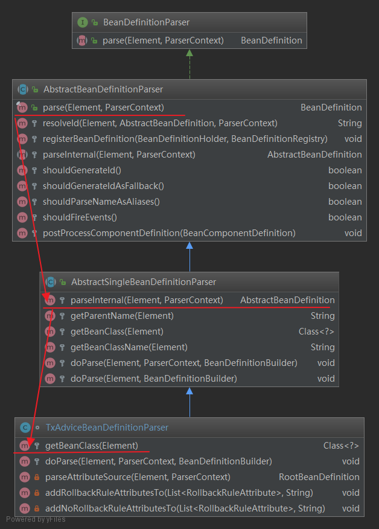
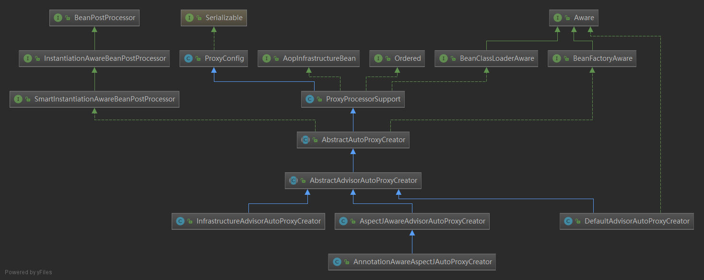
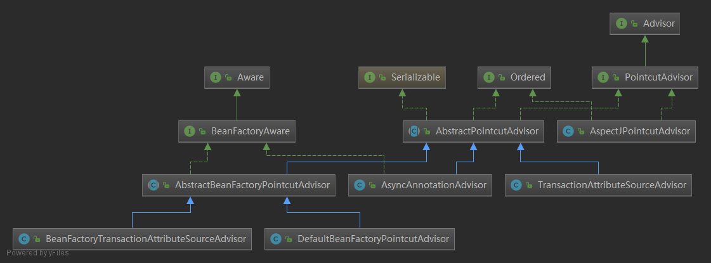
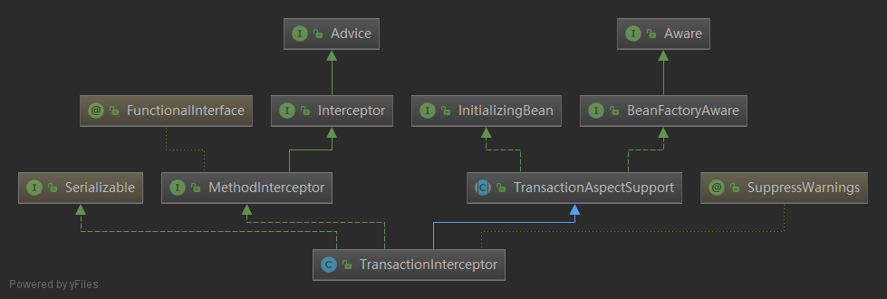

# 事物是怎么执行的

---


# 一、spring-IOC启动时，注册

------

## 1.1 TxNamespaceHandler会去注册事务相关的解析器

1.TxAdviceBeanDefinitionParser，运行时使用TransactionInterceptor处理事物。

2.AnnotationDrivenBeanDefinitionParser

3.JtaTransactionManagerBeanDefinitionParser

NamespaceHandler 允许在xml或者annotations中使用配置的声明事件管理。TxNamespaceHandler在spring事务管理中核心功能，提供2种声名事物：\<tx:advice>和\<tx:annotation-driven>

```java
/**
 * {@code NamespaceHandler} allowing for the configuration of
 * declarative transaction management using either XML or using annotations.
 *
 * <p>This namespace handler is the central piece of functionality in the
 * Spring transaction management facilities and offers two approaches
 * to declaratively manage transactions.
 *
 * <p>One approach uses transaction semantics defined in XML using the
 * {@code <tx:advice>} elements, the other uses annotations
 * in combination with the {@code <tx:annotation-driven>} element.
 * Both approached are detailed to great extent in the Spring reference manual.
 *
 * @author Rob Harrop
 * @author Juergen Hoeller
 * @since 2.0
 */
public class TxNamespaceHandler extends NamespaceHandlerSupport {
    static final String TRANSACTION_MANAGER_ATTRIBUTE = "transaction-manager";
    static final String DEFAULT_TRANSACTION_MANAGER_BEAN_NAME = "transactionManager";

    //<tx:annotation-driven/>标签在不指定transaction-manager属性的时候，会默认寻找id固定名为transactionManager的bean作为事务管理器
    static String getTransactionManagerName(Element element) {
        return (element.hasAttribute(TRANSACTION_MANAGER_ATTRIBUTE) ?
                element.getAttribute(TRANSACTION_MANAGER_ATTRIBUTE) : DEFAULT_TRANSACTION_MANAGER_BEAN_NAME);
    }

    @Override
    public void init() {
        registerBeanDefinitionParser("advice", new TxAdviceBeanDefinitionParser());
        registerBeanDefinitionParser("annotation-driven", new AnnotationDrivenBeanDefinitionParser());
        registerBeanDefinitionParser("jta-transaction-manager", new JtaTransactionManagerBeanDefinitionParser());
    }

}
```

## 1.2 TxAdviceBeanDefinitionParser调用时机

之前讲AOP以及IOC时，有说明，IOC启动过程中，在NamespaceHandlerSupport中的parse()方法会调用相应的解析器（TxAdviceBeanDefinitionParser、AnnotationDrivenBeanDefinitionParser、AspectJAutoProxyBeanDefinitionParser、ConfigBeanDefinitionParser......）的parse()去解析xml或者annotation。之前文章讲过ConfigBeanDefinitionParser。

IOC启动时，将TransactionInterceptor.class、AnnotationTransactionAttributeSource 包装成beanDefinition注册到beanFactory

先来看继承关系
	


### AbstractBeanDefinitionParser#parse

```java
public final BeanDefinition parse(Element element, ParserContext parserContext) {
    AbstractBeanDefinition definition = parseInternal(element, parserContext);
    if (definition != null && !parserContext.isNested()) {
        //....
        BeanDefinitionHolder holder = new BeanDefinitionHolder(definition, id, aliases);
        registerBeanDefinition(holder, parserContext.getRegistry());           
    }
    return definition;
}
```

### AbstractSingleBeanDefinitionParser#parseInternal

```java
protected final AbstractBeanDefinition parseInternal(Element element, ParserContext parserContext) {
    BeanDefinitionBuilder builder = BeanDefinitionBuilder.genericBeanDefinition();
    //......
    //getBeanClass是在TxAdviceBeanDefinitionParser中实现的
    Class<?> beanClass = getBeanClass(element);
    if (beanClass != null) {
        builder.getRawBeanDefinition().setBeanClass(beanClass);
    }
    //...
    builder.getRawBeanDefinition().setSource(parserContext.extractSource(element));
    BeanDefinition containingBd = parserContext.getContainingBeanDefinition();
    //....
    doParse(element, parserContext, builder);
    return builder.getBeanDefinition();
}
```

### TxAdviceBeanDefinitionParser#getBeanClass

将TransactionInterceptor.class 包装成beanDefinition注册到beanFactory

```java
protected Class<?> getBeanClass(Element element) {
    return TransactionInterceptor.class;
}
```

### TxAdviceBeanDefinitionParser#doParse

注册transactionManager、transactionAttributeSource、org.springframework.transaction.annotation.AnnotationTransactionAttributeSource

```java
@Override
protected void doParse(Element element, ParserContext parserContext, BeanDefinitionBuilder builder) {
    //<tx:annotation-driven/>标签在不指定transaction-manager属性的时候，会默认寻找id固定名为transactionManager的bean作为事务管理器
    builder.addPropertyReference("transactionManager", TxNamespaceHandler.getTransactionManagerName(element));
    List<Element> txAttributes = DomUtils.getChildElementsByTagName(element, ATTRIBUTES_ELEMENT);
    //....
    if (txAttributes.size() == 1) {
        // Using attributes source.
        Element attributeSourceElement = txAttributes.get(0);
        RootBeanDefinition attributeSourceDefinition = parseAttributeSource(attributeSourceElement, parserContext);
        builder.addPropertyValue("transactionAttributeSource", attributeSourceDefinition);
    }else {
        // Assume annotations source.
        builder.addPropertyValue("transactionAttributeSource",
                                 //AnnotationTransactionAttributeSource会调用SpringTransactionAnnotationParser,SpringTransactionAnnotationParser解析@Transactional
                                 new RootBeanDefinition("org.springframework.transaction.annotation.AnnotationTransactionAttributeSource"));
    }
}
```


## 1.3 SpringTransactionAnnotationParser#parseTransactionAnnotation解析@Transactional 这个后面说，暂时放到这里

parseTransactionAnnotation查找 @Transactional，找到后，parseTransactionAnnotation，解析注解属性。

```java
public class SpringTransactionAnnotationParser implements TransactionAnnotationParser, Serializable {

	@Override
	@Nullable
	public TransactionAttribute parseTransactionAnnotation(AnnotatedElement ae) {
		AnnotationAttributes attributes = AnnotatedElementUtils.findMergedAnnotationAttributes(
				ae, Transactional.class, false, false);
		if (attributes != null) {
			return parseTransactionAnnotation(attributes);
		}
		else {
			return null;
		}
	}

	public TransactionAttribute parseTransactionAnnotation(Transactional ann) {
		return parseTransactionAnnotation(AnnotationUtils.getAnnotationAttributes(ann, false, false));
	}
	//解析Transactional注解属性
	protected TransactionAttribute parseTransactionAnnotation(AnnotationAttributes attributes) {
		RuleBasedTransactionAttribute rbta = new RuleBasedTransactionAttribute();
		Propagation propagation = attributes.getEnum("propagation");
		rbta.setPropagationBehavior(propagation.value());
		Isolation isolation = attributes.getEnum("isolation");
		rbta.setIsolationLevel(isolation.value());
		rbta.setTimeout(attributes.getNumber("timeout").intValue());
		rbta.setReadOnly(attributes.getBoolean("readOnly"));
		rbta.setQualifier(attributes.getString("value"));
		ArrayList<RollbackRuleAttribute> rollBackRules = new ArrayList<>();
		Class<?>[] rbf = attributes.getClassArray("rollbackFor");
		for (Class<?> rbRule : rbf) {
			RollbackRuleAttribute rule = new RollbackRuleAttribute(rbRule);
			rollBackRules.add(rule);
		}
		String[] rbfc = attributes.getStringArray("rollbackForClassName");
		for (String rbRule : rbfc) {
			RollbackRuleAttribute rule = new RollbackRuleAttribute(rbRule);
			rollBackRules.add(rule);
		}
		Class<?>[] nrbf = attributes.getClassArray("noRollbackFor");
		for (Class<?> rbRule : nrbf) {
			NoRollbackRuleAttribute rule = new NoRollbackRuleAttribute(rbRule);
			rollBackRules.add(rule);
		}
		String[] nrbfc = attributes.getStringArray("noRollbackForClassName");
		for (String rbRule : nrbfc) {
			NoRollbackRuleAttribute rule = new NoRollbackRuleAttribute(rbRule);
			rollBackRules.add(rule);
		}
		rbta.getRollbackRules().addAll(rollBackRules);
		return rbta;
	}

}
```


## 1.4 AnnotationDrivenBeanDefinitionParser#parse


```java
public BeanDefinition parse(Element element, ParserContext parserContext) {
    registerTransactionalEventListenerFactory(parserContext);
    String mode = element.getAttribute("mode");
    if ("aspectj".equals(mode)) {
        // mode="aspectj"
        registerTransactionAspect(element, parserContext);
        if (ClassUtils.isPresent("javax.transaction.Transactional", getClass().getClassLoader())) {
            registerJtaTransactionAspect(element, parserContext);
        }
    }
    else {
        // mode="proxy"
        AopAutoProxyConfigurer.configureAutoProxyCreator(element, parserContext);
    }
    return null;
}
```

### 1.4.1 AopAutoProxyConfigurer.configureAutoProxyCreator

1、注册InfrastructureAdvisorAutoProxyCreator

2、注册三个BeanDefinition: AnnotationTransactionAttributeSource、TransactionInterceptor、BeanFactoryTransactionAttributeSourceAdvisor 到beanFactory的beanDefinitionMap中。beanDefinitionMap是一个map，key为beanName, value为BeanDefinition。在第三个注册中，会将前2个BeanDefinition的beanName保存下来，放到第三个BeanFactoryTransactionAttributeSourceAdvisor 中去。

```java
public static void configureAutoProxyCreator(Element element, ParserContext parserContext) {
    AopNamespaceUtils.registerAutoProxyCreatorIfNecessary(parserContext, element);

    String txAdvisorBeanName = TransactionManagementConfigUtils.TRANSACTION_ADVISOR_BEAN_NAME;
    if (!parserContext.getRegistry().containsBeanDefinition(txAdvisorBeanName)) {
        Object eleSource = parserContext.extractSource(element);

        // Create the TransactionAttributeSource definition.
        //注册AnnotationTransactionAttributeSource
        RootBeanDefinition sourceDef = new RootBeanDefinition(
            "org.springframework.transaction.annotation.AnnotationTransactionAttributeSource");
        sourceDef.setSource(eleSource);
        sourceDef.setRole(BeanDefinition.ROLE_INFRASTRUCTURE);
        //registerWithGeneratedName返回beanName,注册beanDefinition里作为key存map中
        String sourceName = parserContext.getReaderContext().registerWithGeneratedName(sourceDef);

        // Create the TransactionInterceptor definition.
        //注册TransactionInterceptor
        RootBeanDefinition interceptorDef = new RootBeanDefinition(TransactionInterceptor.class);
        interceptorDef.setSource(eleSource);
        interceptorDef.setRole(BeanDefinition.ROLE_INFRASTRUCTURE);
        //<tx:annotation-driven/>标签在不指定transaction-manager属性的时候，会默认寻找id固定名为transactionManager的bean作为事务管理器
        registerTransactionManager(element, interceptorDef);
        interceptorDef.getPropertyValues().add("transactionAttributeSource", new RuntimeBeanReference(sourceName));
        String interceptorName = parserContext.getReaderContext().registerWithGeneratedName(interceptorDef);

        // Create the TransactionAttributeSourceAdvisor definition.
        //注册BeanFactoryTransactionAttributeSourceAdvisor
        RootBeanDefinition advisorDef = new RootBeanDefinition(BeanFactoryTransactionAttributeSourceAdvisor.class);
        advisorDef.setSource(eleSource);
        advisorDef.setRole(BeanDefinition.ROLE_INFRASTRUCTURE);
        //将注册的beanDefinitionMap的key（sourceName）保存到advisorDef
        advisorDef.getPropertyValues().add("transactionAttributeSource", new RuntimeBeanReference(sourceName));
        ////将注册的beanDefinitionMap的key（interceptorName）保存到advisorDef
        advisorDef.getPropertyValues().add("adviceBeanName", interceptorName);
        if (element.hasAttribute("order")) {
            advisorDef.getPropertyValues().add("order", element.getAttribute("order"));
        }
        parserContext.getRegistry().registerBeanDefinition(txAdvisorBeanName, advisorDef);

        //将AnnotationTransactionAttributeSource、TransactionInterceptor、BeanFactoryTransactionAttributeSourceAdvisor注册registerComponent
        CompositeComponentDefinition compositeDef = new CompositeComponentDefinition(element.getTagName(), eleSource);
        compositeDef.addNestedComponent(new BeanComponentDefinition(sourceDef, sourceName));
        compositeDef.addNestedComponent(new BeanComponentDefinition(interceptorDef, interceptorName));
        compositeDef.addNestedComponent(new BeanComponentDefinition(advisorDef, txAdvisorBeanName));
        parserContext.registerComponent(compositeDef);
    }
}
```

AopNamespaceUtils.registerAutoProxyCreatorIfNecessary(parserContext, element);

注册InfrastructureAdvisorAutoProxyCreator，它实现了BeanPostProcessor.postProcessAfterInitialization()

```java
public static void registerAutoProxyCreatorIfNecessary(
    ParserContext parserContext, Element sourceElement) {
	//注册InfrastructureAdvisorAutoProxyCreator
    BeanDefinition beanDefinition = AopConfigUtils.registerAutoProxyCreatorIfNecessary(
        parserContext.getRegistry(), parserContext.extractSource(sourceElement));
    useClassProxyingIfNecessary(parserContext.getRegistry(), sourceElement);
    registerComponentIfNecessary(beanDefinition, parserContext);
}
@Nullable
public static BeanDefinition registerAutoProxyCreatorIfNecessary(BeanDefinitionRegistry registry,
                                                                 @Nullable Object source) {

    return registerOrEscalateApcAsRequired(InfrastructureAdvisorAutoProxyCreator.class, registry, source);
}
```




InfrastructureAdvisorAutoProxyCreator extends AbstractAdvisorAutoProxyCreator extends AbstractAutoProxyCreator, 

AbstractAutoProxyCreator#postProcessAfterInitialization会在bean实例化最后一步执行。


# 二、初始化bean时，查找可用切面，扫描@Transactional

---

## **postProcessAfterInitialization方法主要调用顺序**

AbstractAutoProxyCreator#postProcessAfterInitialization 入口类

-wrapIfNecessary 得到可用的切面，并缓存起来

-- AbstractAdvisorAutoProxyCreator#getAdvicesAndAdvisorsForBean

--- findEligibleAdvisors

----1.findCandidateAdvisors查找所有的切面

----- AbstractAdvisorAutoProxyCreator#findCandidateAdvisors 

------ BeanFactoryAdvisorRetrievalHelper#findAdvisorBeans 查找接口类型为Advisor的

> advisorNames = BeanFactoryUtils.beanNamesForTypeIncludingAncestors(
> 						this.beanFactory, Advisor.class, true, false);
>
> .....
>
> advisors.add(this.beanFactory.getBean(name, Advisor.class));

advisors.add(this.beanFactory.getBean(name, Advisor.class)); 

----2.findAdvisorsThatCanApply在所有的切面有，查找可用切面

-----  AopUtils#findAdvisorsThatCanApply

------  AopUtils#canApply

-------  BeanFactoryTransactionAttributeSourceAdvisor#getPointcut 如果是事务类的会进入到BeanFactoryTransactionAttributeSourceAdvisor

-------  MethodMatcher#matches -> TransactionAttributeSourcePointcut#matches （TransactionAttributeSourcePointcut实现了接口MethodMatcher)

-------- AbstractFallbackTransactionAttributeSource#getTransactionAttribute

--------- AbstractFallbackTransactionAttributeSource#computeTransactionAttribute

---------- AnnotationTransactionAttributeSource#findTransactionAttribute

----------- AnnotationTransactionAttributeSource#determineTransactionAttribute

------------ SpringTransactionAnnotationParser#parseTransactionAnnotation 终于找到@Transactional注解了

> AnnotationAttributes attributes = AnnotatedElementUtils.findMergedAnnotationAttributes(
> 				ae, Transactional.class, false, false);

------------- SpringTransactionAnnotationParser#parseTransactionAnnotation 解析@Transactional注解内容


## 1. findCandidateAdvisors查找所有的切面

### BeanFactoryTransactionAttributeSourceAdvisor

PointcutAdvisor.getPointcut 还有很多实现类 BeanFactoryTransactionAttributeSourceAdvisor是其中一个。




BeanFactoryTransactionAttributeSourceAdvisor 就是一个Advice。在执行postProcessAfterInitialization会取到它。


## 2.findAdvisorsThatCanApply在所有的切面有，查找可用切面

### AopUtils#findAdvisorsThatCanApply

```java
public static List<Advisor> findAdvisorsThatCanApply(List<Advisor> candidateAdvisors, Class<?> clazz) {
	//...
	List<Advisor> eligibleAdvisors = new LinkedList<>();
	for (Advisor candidate : candidateAdvisors) {
        //canApply方法
		if (candidate instanceof IntroductionAdvisor && canApply(candidate, clazz)) {
			eligibleAdvisors.add(candidate);
		}
	}
	boolean hasIntroductions = !eligibleAdvisors.isEmpty();
	for (Advisor candidate : candidateAdvisors) {
		//....
        //canApply,hasIntroductions=false
		if (canApply(candidate, clazz, hasIntroductions)) {
			eligibleAdvisors.add(candidate);
		}
	}
	return eligibleAdvisors;
}
/**
 * Can the given advisor apply at all on the given class?
 * <p>This is an important test as it can be used to optimize out a advisor for a class.
 * This version also takes into account introductions (for IntroductionAwareMethodMatchers).
 */
public static boolean canApply(Advisor advisor, Class<?> targetClass, boolean hasIntroductions) {
    if (advisor instanceof IntroductionAdvisor) {
        return ((IntroductionAdvisor) advisor).getClassFilter().matches(targetClass);
    }
    else if (advisor instanceof PointcutAdvisor) {
        PointcutAdvisor pca = (PointcutAdvisor) advisor;
        //下面分2步分析
        //1、pca.getPointcut()会调用TransactionAttributeSourcePointcut#matches
        //2、canApply
        return canApply(pca.getPointcut(), targetClass, hasIntroductions);
    }
    else {
        // It doesn't have a pointcut so we assume it applies.
        return true;
    }
}
```


### BeanFactoryTransactionAttributeSourceAdvisor.getPointcut()   （pca.getPointcut()）


```java
/**
 * Advisor driven by a {@link TransactionAttributeSource}, used to include
 * a transaction advice bean for methods that are transactional.
 */
@SuppressWarnings("serial")
public class BeanFactoryTransactionAttributeSourceAdvisor extends AbstractBeanFactoryPointcutAdvisor {

	@Nullable
	private TransactionAttributeSource transactionAttributeSource;

	private final TransactionAttributeSourcePointcut pointcut = new TransactionAttributeSourcePointcut() {
		@Override
		@Nullable
		protected TransactionAttributeSource getTransactionAttributeSource() {
			return transactionAttributeSource;
		}
	};
	//......
	@Override
	public Pointcut getPointcut() {
		return this.pointcut;
	}

}
```

BeanFactoryTransactionAttributeSourceAdvisor 实例化的时候，	会实例化类型为TransactionAttributeSourcePointcut的pointcut属性，pointcut其实就是一个包了一层的TransactionAttributeSource。

AbstractFallbackTransactionAttributeSource实现了接口TransactionAttributeSource，AnnotationTransactionAttributeSource又继承了AbstractFallbackTransactionAttributeSource。

所以，在后面调用TransactionAttributeSource#getTransactionAttribute，会调用AbstractFallbackTransactionAttributeSource，AbstractFallbackTransactionAttributeSource模板模式，又会调用AnnotationTransactionAttributeSource去解析@Transactional标签


### AopUtils#canApply (canApply(pca.getPointcut(), targetClass, hasIntroductions))

```java
/**
 * Can the given pointcut apply at all on the given class?
 * <p>This is an important test as it can be used to optimize
 * out a pointcut for a class.
 * @param pc the static or dynamic pointcut to check
 * @param targetClass the class to test
 * @param hasIntroductions whether or not the advisor chain
 * for this bean includes any introductions
 * @return whether the pointcut can apply on any method
 */
public static boolean canApply(Pointcut pc, Class<?> targetClass, boolean hasIntroductions) {
	Assert.notNull(pc, "Pointcut must not be null");
	if (!pc.getClassFilter().matches(targetClass)) {
		return false;
	}

	MethodMatcher methodMatcher = pc.getMethodMatcher();
	//....
	for (Class<?> clazz : classes) {
		Method[] methods = ReflectionUtils.getAllDeclaredMethods(clazz);
		for (Method method : methods) {
			if (introductionAwareMethodMatcher != null ?
					introductionAwareMethodMatcher.matches(method, targetClass, hasIntroductions) :
                	 //	TransactionAttributeSourcePointcut#matches  
					methodMatcher.matches(method, targetClass)) {
				return true;
			}
		}
	}

	return false;
}
```


### TransactionAttributeSourcePointcut#matches   (methodMatcher.matches)

```java
/**
 * Inner class that implements a Pointcut that matches if the underlying
 * {@link TransactionAttributeSource} has an attribute for a given method.
 *
 * @author Juergen Hoeller
 * @since 2.5.5
 */
abstract class TransactionAttributeSourcePointcut extends StaticMethodMatcherPointcut implements Serializable {

	@Override
	public boolean matches(Method method, @Nullable Class<?> targetClass) {
		if (targetClass != null && TransactionalProxy.class.isAssignableFrom(targetClass)) {
			return false;
		}
		TransactionAttributeSource tas = getTransactionAttributeSource();
         //AbstractFallbackTransactionAttributeSource#getTransactionAttributeSource
		return (tas == null || tas.getTransactionAttribute(method, targetClass) != null);
	}
	//.....
}
```


### AbstractFallbackTransactionAttributeSource#getTransactionAttributeSource

```java
/**
 * Determine the transaction attribute for this method invocation.
 * <p>Defaults to the class's transaction attribute if no method attribute is found.
 * @param method the method for the current invocation (never {@code null})
 * @param targetClass the target class for this invocation (may be {@code null})
 * @return a TransactionAttribute for this method, or {@code null} if the method
 * is not transactional
 */
@Override
@Nullable
public TransactionAttribute getTransactionAttribute(Method method, @Nullable Class<?> targetClass){
	//...
	// First, see if we have a cached value.
	Object cacheKey = getCacheKey(method, targetClass);
	Object cached = this.attributeCache.get(cacheKey);
	//....
	else {
		// We need to work it out.
         //SpringTransactionAnnotationParser解析@Transactional标签
		TransactionAttribute txAttr = computeTransactionAttribute(method, targetClass);
		}
		return txAttr;
	}
}
```


### SpringTransactionAnnotationParser#parseTransactionAnnotation 终于找到@Transactional

```java
/**
 * Strategy implementation for parsing Spring's {@link Transactional} annotation.
 */
@SuppressWarnings("serial")
public class SpringTransactionAnnotationParser implements TransactionAnnotationParser, Serializable {

	@Override
	@Nullable
	public TransactionAttribute parseTransactionAnnotation(AnnotatedElement ae) {
        //@Transactional 注解
		AnnotationAttributes attributes = AnnotatedElementUtils.findMergedAnnotationAttributes(
				ae, Transactional.class, false, false);
		if (attributes != null) {
			return parseTransactionAnnotation(attributes);
		}
		else {
			return null;
		}
	}

	public TransactionAttribute parseTransactionAnnotation(Transactional ann) {
		return parseTransactionAnnotation(AnnotationUtils.getAnnotationAttributes(ann, false, false));
	}

	protected TransactionAttribute parseTransactionAnnotation(AnnotationAttributes attributes) {
		RuleBasedTransactionAttribute rbta = new RuleBasedTransactionAttribute();
		Propagation propagation = attributes.getEnum("propagation");
		rbta.setPropagationBehavior(propagation.value());
		Isolation isolation = attributes.getEnum("isolation");
		rbta.setIsolationLevel(isolation.value());
		rbta.setTimeout(attributes.getNumber("timeout").intValue());
		rbta.setReadOnly(attributes.getBoolean("readOnly"));
		rbta.setQualifier(attributes.getString("value"));
		ArrayList<RollbackRuleAttribute> rollBackRules = new ArrayList<>();
		Class<?>[] rbf = attributes.getClassArray("rollbackFor");
		for (Class<?> rbRule : rbf) {
			RollbackRuleAttribute rule = new RollbackRuleAttribute(rbRule);
			rollBackRules.add(rule);
		}
		String[] rbfc = attributes.getStringArray("rollbackForClassName");
		for (String rbRule : rbfc) {
			RollbackRuleAttribute rule = new RollbackRuleAttribute(rbRule);
			rollBackRules.add(rule);
		}
		Class<?>[] nrbf = attributes.getClassArray("noRollbackFor");
		for (Class<?> rbRule : nrbf) {
			NoRollbackRuleAttribute rule = new NoRollbackRuleAttribute(rbRule);
			rollBackRules.add(rule);
		}
		String[] nrbfc = attributes.getStringArray("noRollbackForClassName");
		for (String rbRule : nrbfc) {
			NoRollbackRuleAttribute rule = new NoRollbackRuleAttribute(rbRule);
			rollBackRules.add(rule);
		}
		rbta.getRollbackRules().addAll(rollBackRules);
		return rbta;
	}

	@Override
	public boolean equals(Object other) {
		return (this == other || other instanceof SpringTransactionAnnotationParser);
	}

	@Override
	public int hashCode() {
		return SpringTransactionAnnotationParser.class.hashCode();
	}

}
```


# 三、调用TransactionInterceptor执行过程

--------

spring在处理事务的aop增强是，主要调用了return ((MethodInterceptor) interceptorOrInterceptionAdvice).invoke(this);

TranctionInterceptor（位于spring-tx-*.jar中的org.springframework.transaction.interceptor）的结构：

继承类TransactionAspectSupport：其实对其进行了增强（模板方法模式）

实现接口MethodInterceptor：方法拦截器，执行代理类的目标方法，会触发invoke方法执行


TransactionInterceptor 继承关系图：



可以看到 TransactionInterceptor 是一个advice，在上面查找可用切面时，也会被拿到。

下面主要看一下TransactionInterceptor执行过程

```java
/**
 * AOP Alliance MethodInterceptor for declarative transaction
 * management using the common Spring transaction infrastructure
 * ({@link org.springframework.transaction.PlatformTransactionManager}).
 *
 * <p>Derives from the {@link TransactionAspectSupport} class which
 * contains the integration with Spring's underlying transaction API.
 * TransactionInterceptor simply calls the relevant superclass methods
 * such as {@link #invokeWithinTransaction} in the correct order.
 *
 * <p>TransactionInterceptors are thread-safe.
 *
 * @see TransactionProxyFactoryBean
 * @see org.springframework.aop.framework.ProxyFactoryBean
 * @see org.springframework.aop.framework.ProxyFactory
 */
@SuppressWarnings("serial")
public class TransactionInterceptor extends TransactionAspectSupport implements MethodInterceptor, Serializable {
    @Override
    @Nullable
    public Object invoke(final MethodInvocation invocation) throws Throwable {
        // Work out the target class: may be {@code null}.
        // The TransactionAttributeSource should be passed the target class
        // as well as the method, which may be from an interface.
        Class<?> targetClass = (invocation.getThis() != null ? AopUtils.getTargetClass(invocation.getThis()) : null);

        // Adapt to TransactionAspectSupport's invokeWithinTransaction...
        return invokeWithinTransaction(invocation.getMethod(), targetClass, invocation::proceed);
    }
}
```

## 3.1 TransactionAspectSupport#invokeWithinTransaction

此方法会调用逻辑

1、判断是否是CallbackPreferringPlatformTransactionManager类型，如果不是：

不同类型的PlatformTransactionManager调用方式不同，CallbackPreferringPlatformTransactionManager需要回调函数来实现事务流程，而我们常用的DataSourceTransactionManager就不是CallbackPreferringPlatformTransactionManager

- createTransactionIfNecessary。调用AbstractPlatformTransactionManager.getTransaction方法，返回TransactionStatus，并封装成TransactionInfo。TransactionInfo是一个事务对象，对象中包含事务的所有属性，包括PlatformTransactionManager、TransactionAttribute、TransactionStatus。事务的管理都是通过TransactionInfo对象来完成，它封装了事务对象和事务处理的状态信息

  一句话：通过DataSourceTransactionManager创建一个TransactionStatus，并将TransactionStatus设置到当前的TransactionInfo中，同时将此TransactionInfo与当前线程绑定。

- retVal = invocation.proceedWithInvocation(); 回调方法执行，执行目标方法（原有的业务逻辑）

- 上一步调用成功后，commitTransactionAfterReturning调用AbstractPlatformTransactionManager.commit方法提交事务

2、如果是编程式事务处理CallbackPreferringPlatformTransactionManager.....(编程式的事务处理是不需要有事务属性的，暂不做分析)


method invocation(spring aop是基于method的)!根据我们的配置，来决定是不是对method使用事务。

```java
/**
 * General delegate for around-advice-based subclasses, delegating to several other template
 * methods on this class. Able to handle {@link CallbackPreferringPlatformTransactionManager}
 * as well as regular {@link PlatformTransactionManager} implementations.
 * @param method the Method being invoked
 * @param targetClass the target class that we're invoking the method on
 * @param invocation the callback to use for proceeding with the target invocation
 * @return the return value of the method, if any
 * @throws Throwable propagated from the target invocation
 */
@Nullable
protected Object invokeWithinTransaction(Method method, @Nullable Class<?> targetClass,
			final InvocationCallback invocation) throws Throwable {

    // If the transaction attribute is null, the method is non-transactional.
    // 获取对应事务属性.如果事务属性为空（则目标方法不存在事务）
    TransactionAttributeSource tas = getTransactionAttributeSource();    
    final TransactionAttribute txAttr = (tas != null ? tas.getTransactionAttribute(method, targetClass) : null);
    // 根据事务的属性获取beanFactory中的PlatformTransactionManager(spring事务管理器的顶级接口)，一般这里或者的是DataSourceTransactiuonManager
    final PlatformTransactionManager tm = determineTransactionManager(txAttr);
    
    final String joinpointIdentification = methodIdentification(method, targetClass, txAttr);

    //声明式事物处理
    if (txAttr == null || !(tm instanceof CallbackPreferringPlatformTransactionManager)) {
        // Standard transaction demarcation with getTransaction and commit/rollback calls.
        //调用AbstractPlatformTransactionManager.getTransaction方法，返回TransactionStatus，并封闭成TransactionInfo
        TransactionInfo txInfo = createTransactionIfNecessary(tm, txAttr, joinpointIdentification);
        Object retVal = null;
        try {
            // This is an around advice: Invoke the next interceptor in the chain.
            // This will normally result in a target object being invoked.
            //回调目标类的目标方法（原有的业务逻辑）
            retVal = invocation.proceedWithInvocation();
        }catch (Throwable ex) {
            // target invocation exception
            completeTransactionAfterThrowing(txInfo, ex);
            throw ex;
        }//....
        //事务提交。上一步调用成功后，调用AbstractPlatformTransactionManager.commit方法提交事务
        commitTransactionAfterReturning(txInfo);
        return retVal;
    }
	//编程式事务处理
    else {
        final ThrowableHolder throwableHolder = new ThrowableHolder();

        // It's a CallbackPreferringPlatformTransactionManager: pass a TransactionCallback in.
        try {
            Object result = ((CallbackPreferringPlatformTransactionManager) tm).execute(txAttr, status -> {
                TransactionInfo txInfo = prepareTransactionInfo(tm, txAttr, joinpointIdentification, status);
                try {
                    return invocation.proceedWithInvocation();
                }
                //....
            });

            // Check result state: It might indicate a Throwable to rethrow.
            if (throwableHolder.throwable != null) {
                throw throwableHolder.throwable;
            }
            return result;
        }//....
    }
}
```

### 3.1.1 createTransactionIfNecessary调用PlatformTransactionManager.getTransaction方法,返回TransactionStatus,

```java
protected TransactionInfo createTransactionIfNecessary(@Nullable PlatformTransactionManager tm,
			@Nullable TransactionAttribute txAttr, final String joinpointIdentification) {

    // If no name specified, apply method identification as transaction name.
    if (txAttr != null && txAttr.getName() == null) {
        txAttr = new DelegatingTransactionAttribute(txAttr) {
            @Override
            public String getName() {
                return joinpointIdentification;
            }
        };
    }

    TransactionStatus status = null;
    if (txAttr != null) {
        if (tm != null) {
            //调用 PlatformTransactionManager.getTransaction方法,返回TransactionStatus
            status = tm.getTransaction(txAttr);
        }//...
    }
    return prepareTransactionInfo(tm, txAttr, joinpointIdentification, status);
}
```

prepareTransactionInfo方法，封装PlatformTransactionManager、TransactionAttribute、joinpointIdentification、joinpointIdentification成TransactionInfo对象，并将TransactionInfo与当前线程绑定。

```java
/**
 * Prepare a TransactionInfo for the given attribute and status object.
 * @param txAttr the TransactionAttribute (may be {@code null})
 * @param joinpointIdentification the fully qualified method name
 * (used for monitoring and logging purposes)
 * @param status the TransactionStatus for the current transaction
 * @return the prepared TransactionInfo object
 */
protected TransactionInfo prepareTransactionInfo(@Nullable PlatformTransactionManager tm,
                                                 @Nullable TransactionAttribute txAttr, String joinpointIdentification,
                                                 @Nullable TransactionStatus status) {

    TransactionInfo txInfo = new TransactionInfo(tm, txAttr, joinpointIdentification);
    if (txAttr != null) {
        // We need a transaction for this method...
        if (logger.isTraceEnabled()) {
            logger.trace("Getting transaction for [" + txInfo.getJoinpointIdentification() + "]");
        }
        // The transaction manager will flag an error if an incompatible tx already exists.
        txInfo.newTransactionStatus(status);
    }
    else {
        // The TransactionInfo.hasTransaction() method will return false. We created it only
        // to preserve the integrity of the ThreadLocal stack maintained in this class.
        if (logger.isTraceEnabled()) {
            logger.trace("Don't need to create transaction for [" + joinpointIdentification +
                         "]: This method isn't transactional.");
        }
    }

    // We always bind the TransactionInfo to the thread, even if we didn't create
    // a new transaction here. This guarantees that the TransactionInfo stack
    // will be managed correctly even if no transaction was created by this aspect.
    txInfo.bindToThread();
    return txInfo;
}
```
### 3.1.2 completeTransactionAfterThrowing异常回滚

```java
protected void completeTransactionAfterThrowing(@Nullable TransactionInfo txInfo, Throwable ex) {
    if (txInfo != null && txInfo.getTransactionStatus() != null) {
        if (logger.isTraceEnabled()) {
            logger.trace("Completing transaction for [" + txInfo.getJoinpointIdentification() +
                         "] after exception: " + ex);
        }
        //如果是默认的DefaultTransactionAttribute#rollbackOn，则只判断RuntimeException或Error
        if (txInfo.transactionAttribute != null && txInfo.transactionAttribute.rollbackOn(ex)) {
            try {
                txInfo.getTransactionManager().rollback(txInfo.getTransactionStatus());
            }
            catch (TransactionSystemException ex2) {
                logger.error("Application exception overridden by rollback exception", ex);
                ex2.initApplicationException(ex);
                throw ex2;
            }
            catch (RuntimeException | Error ex2) {
                logger.error("Application exception overridden by rollback exception", ex);
                throw ex2;
            }
        }
        else {
            // We don't roll back on this exception.
            // Will still roll back if TransactionStatus.isRollbackOnly() is true.
            try {
                txInfo.getTransactionManager().commit(txInfo.getTransactionStatus());
            }
            catch (TransactionSystemException ex2) {
                logger.error("Application exception overridden by commit exception", ex);
                ex2.initApplicationException(ex);
                throw ex2;
            }
            catch (RuntimeException | Error ex2) {
                logger.error("Application exception overridden by commit exception", ex);
                throw ex2;
            }
        }
    }
}
```

如果是默认的DefaultTransactionAttribute#rollbackOn，则只判断RuntimeException或Error

```java
@Override
public boolean rollbackOn(Throwable ex) {
    return (ex instanceof RuntimeException || ex instanceof Error);
}
```


### 3.1.3 commitTransactionAfterReturning提交事务

```java
/**
 * Execute after successful completion of call, but not after an exception was handled.
 * Do nothing if we didn't create a transaction.
 * @param txInfo information about the current transaction
 */
protected void commitTransactionAfterReturning(@Nullable TransactionInfo txInfo) {
    if (txInfo != null && txInfo.getTransactionStatus() != null) {
        //....
        txInfo.getTransactionManager().commit(txInfo.getTransactionStatus());
    }
}
```


另起一篇文章，介绍了 TransactionSynchronizationManager、AbstractPlatformTransactionManager、DataSourceTransactionManager


参考了部分：

[http://www.linkedkeeper.com/1045.html](http://www.linkedkeeper.com/1045.html)