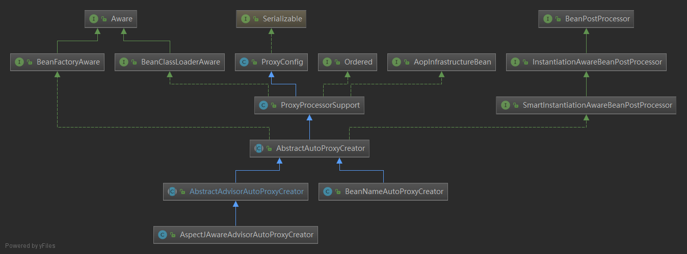

# ConfigBeanDefinitionParser

<aop:config /> 所有的配置，由 ConfigBeanDefinitionParser 来解析 

解析标签，并将标签相应的BeanDefinition注册BeanFactory（DefaultListableBeanFactory）

1、注册AspectJAwareAdvisorAutoProxyCreator:

AspectJAwareAdvisorAutoProxyCreator, 如果proxy-target-class=true，强制使用CGLIB代理，会将proxyTargetClass保存到definition，否则默认采取JDK代理。

2、注册其它BeanDefinition

`aop:point-cut`对应的beanClass为`org.springframework.aop.aspectj.AspectJExpressionPointcut`
`aop:before/aop:after`等对应的beanClass为`org.springframework.aop.aspectj.AbstractAspectJAdvice`的子类
`aop:advisor`对应的beanClass为`org.springframework.aop.support.DefaultBeanFactoryPointcutAdvisor`
`aop:aspect`对应的beanClass为`org.springframework.aop.aspectj.AspectJPointcutAdvisor`

2.aop最终会对point-cut表达式提及的类以及方法进行代理操作，默认采取JDK代理，如果指定`proxy-target-class`属性为true，则也会采用CGLIB代理


## 1.parse方法

-------

```java
public BeanDefinition parse(Element element, ParserContext parserContext) {
    CompositeComponentDefinition compositeDef =
        new CompositeComponentDefinition(element.getTagName(), parserContext.extractSource(element));
    parserContext.pushContainingComponent(compositeDef);

    configureAutoProxyCreator(parserContext, element);

    List<Element> childElts = DomUtils.getChildElements(element);
    for (Element elt: childElts) {
        String localName = parserContext.getDelegate().getLocalName(elt);
        if (POINTCUT.equals(localName)) {
            parsePointcut(elt, parserContext);
        }
        else if (ADVISOR.equals(localName)) {
            parseAdvisor(elt, parserContext);
        }
        else if (ASPECT.equals(localName)) {
            parseAspect(elt, parserContext);
        }
    }

    parserContext.popAndRegisterContainingComponent();
    return null;
}
```

## 2.ConfigBeanDefinitionParser#configureAutoProxyCreator方法

---

```java
private void configureAutoProxyCreator(ParserContext parserContext, Element element) {
    AopNamespaceUtils.registerAspectJAutoProxyCreatorIfNecessary(parserContext, element);
}
```

如果proxy-target-class="true" ，会强制使用代理。

configureAutoProxyCreator作用：

1. 注册名为org.springframework.aop.config.internalAutoProxyCreator的beanDefinition，其中的class类为**AspectJAwareAdvisorAutoProxyCreator**，其也会被注册到bean工厂中。AspectJAwareAdvisorAutoProxyCreator用于支持AspectJ方式的自动代理 
2. 如果proxy-target-class=true，强制使用代理。会将proxyTargetClass保存到definition


AbstractAdvisorAutoProxyCreator的继承结构如下图。它AbstractAdvisorAutoProxyCreator继承自BeanPostProcessor。


### 2.1 AopNamespaceUtils#registerAspectJAutoProxyCreatorIfNecessary

```java
public static void registerAspectJAutoProxyCreatorIfNecessary(
			ParserContext parserContext, Element sourceElement) {
   //2.1.1 注册名为org.springframework.aop.config.internalAutoProxyCreator的beanDefinition，其中的class类为`AspectJAwareAdvisorAutoProxyCreator`
    BeanDefinition beanDefinition = AopConfigUtils.registerAspectJAutoProxyCreatorIfNecessary(
        parserContext.getRegistry(), parserContext.extractSource(sourceElement));
    //2.1.2 如果指定proxy-target-class=true，则使用CGLIB代理，否则使用JDK代理
    //其实其为AspectJAwareAdvisorAutoProxyCreator类的proxyTargetClass属性
    useClassProxyingIfNecessary(parserContext.getRegistry(), sourceElement);
    registerComponentIfNecessary(beanDefinition, parserContext);
}

```

#### 2.1.1 AopConfigUtils.registerAspectJAutoProxyCreatorIfNecessary

在AopConfigUtils类初始化的时候，

会执行一段静态代码块

```java
static {
   APC_PRIORITY_LIST.add(InfrastructureAdvisorAutoProxyCreator.class);
   APC_PRIORITY_LIST.add(AspectJAwareAdvisorAutoProxyCreator.class);
   APC_PRIORITY_LIST.add(AnnotationAwareAspectJAutoProxyCreator.class); //<-----
}
```


**AspectJAwareAdvisorAutoProxyCreator注册**到beanDefinitionMap 中。

实现AOP处理是其实是通过BeanPostProcessor机制实现的。AnnotationAwareAspectJAutoProxyCreator的父类也实现一个BeanPostProcessor类型的接口，而生成代理的逻辑就在AnnotationAwareAspectJAutoProxyCreator的BeanPostProcessor接口实现里面。

```java
public static BeanDefinition registerAspectJAutoProxyCreatorIfNecessary(BeanDefinitionRegistry registry,@Nullable Object source) {
    //2.1.1 AspectJAwareAdvisorAutoProxyCreator注册到bean中。
    return registerOrEscalateApcAsRequired(AspectJAwareAdvisorAutoProxyCreator.class, registry, source);
}

public static final String AUTO_PROXY_CREATOR_BEAN_NAME =      "org.springframework.aop.config.internalAutoProxyCreator";

//cls值为：AspectJAwareAdvisorAutoProxyCreator.class;
private static BeanDefinition registerOrEscalateApcAsRequired(Class<?> cls, BeanDefinitionRegistry registry, @Nullable Object source) {
    if (registry.containsBeanDefinition(AUTO_PROXY_CREATOR_BEAN_NAME)) {
        //org.springframework.aop.config.internalAutoProxyCreator
        BeanDefinition apcDefinition = registry.getBeanDefinition(AUTO_PROXY_CREATOR_BEAN_NAME);
        if (!cls.getName().equals(apcDefinition.getBeanClassName())) {
            int currentPriority = findPriorityForClass(apcDefinition.getBeanClassName());
            int requiredPriority = findPriorityForClass(cls);
            if (currentPriority < requiredPriority) {
                apcDefinition.setBeanClassName(cls.getName());
            }
        }
        return null;
    }

    RootBeanDefinition beanDefinition = new RootBeanDefinition(cls);
    beanDefinition.setSource(source);
    beanDefinition.getPropertyValues().add("order", Ordered.HIGHEST_PRECEDENCE);
    beanDefinition.setRole(BeanDefinition.ROLE_INFRASTRUCTURE);
    registry.registerBeanDefinition(AUTO_PROXY_CREATOR_BEAN_NAME, beanDefinition);
    return beanDefinition;
}
```

#### 2.1.2 AopNamespaceUtils#useClassProxyingIfNecessary 

useClassProxyingIfNecessary方法，如果proxy-target-class=true，强制使用代理。会将proxyTargetClass保存到definition

```java
public static final String PROXY_TARGET_CLASS_ATTRIBUTE = "proxy-target-class";
private static void useClassProxyingIfNecessary(BeanDefinitionRegistry registry, @Nullable Element sourceElement) {
    if (sourceElement != null) {
        //PROXY_TARGET_CLASS_ATTRIBUTE = "proxy-target-class"
        boolean proxyTargetClass = Boolean.parseBoolean(sourceElement.getAttribute(PROXY_TARGET_CLASS_ATTRIBUTE));
        if (proxyTargetClass) {
            AopConfigUtils.forceAutoProxyCreatorToUseClassProxying(registry);
        }
        //EXPOSE_PROXY_ATTRIBUTE = "expose-proxy"
        boolean exposeProxy = Boolean.parseBoolean(sourceElement.getAttribute(EXPOSE_PROXY_ATTRIBUTE));
        if (exposeProxy) {
            AopConfigUtils.forceAutoProxyCreatorToExposeProxy(registry);
        }
    }
}
```

AopConfigUtils.forceAutoProxyCreatorToUseClassProxying 会将proxyTargetClass保存到definition

```java
public static void forceAutoProxyCreatorToUseClassProxying(BeanDefinitionRegistry registry) {
    if (registry.containsBeanDefinition(AUTO_PROXY_CREATOR_BEAN_NAME)) {
        BeanDefinition definition = registry.getBeanDefinition(AUTO_PROXY_CREATOR_BEAN_NAME);
        definition.getPropertyValues().add("proxyTargetClass", Boolean.TRUE);
    }
}
```


## 3.ConfigBeanDefinitionParser#parsePointcut

----

作用：生成pointcutDefinition（将beanClass设置为：AspectJExpressionPointcut.class，保存expression表达式到），并将pointcutDefinition注册。这里的注册，应该会调用DefaultListableBeanFactory.registerBeanDefinition方法，注册到beanDefinitionMap中。

```java
private AbstractBeanDefinition parsePointcut(Element pointcutElement, ParserContext parserContext){
    String id = pointcutElement.getAttribute(ID);
    String expression = pointcutElement.getAttribute(EXPRESSION);//获取切入点的表达式

    AbstractBeanDefinition pointcutDefinition = null;

    try {
        this.parseState.push(new PointcutEntry(id));
        //创建切入点bean对象,beanClass为AspectJExpressionPointcut.class。并且设置属性expression到该beanClass
        pointcutDefinition = createPointcutDefinition(expression);
        pointcutDefinition.setSource(parserContext.extractSource(pointcutElement));

        String pointcutBeanName = id;
        if (StringUtils.hasText(pointcutBeanName)) {
            //注册bean对象
            parserContext.getRegistry().registerBeanDefinition(pointcutBeanName, pointcutDefinition);
        }
        else {
            pointcutBeanName = parserContext.getReaderContext().registerWithGeneratedName(pointcutDefinition);
        }

        parserContext.registerComponent(
            new PointcutComponentDefinition(pointcutBeanName, pointcutDefinition, expression));
    }
    finally {
        this.parseState.pop();
    }

    return pointcutDefinition;
}

protected AbstractBeanDefinition createPointcutDefinition(String expression) {
    //注册AspectJExpressionPointcut
    RootBeanDefinition beanDefinition = new RootBeanDefinition(AspectJExpressionPointcut.class);
    beanDefinition.setScope(BeanDefinition.SCOPE_PROTOTYPE);
    beanDefinition.setSynthetic(true);
    beanDefinition.getPropertyValues().add(EXPRESSION, expression);
    return beanDefinition;
}
```

parserContext.registerComponent -> containingComponent.addNestedComponent(component)

```java
public class CompositeComponentDefinition extends AbstractComponentDefinition {
    private final List<ComponentDefinition> nestedComponents = new LinkedList<>();
    public void addNestedComponent(ComponentDefinition component) {
		this.nestedComponents.add(component);
	}
}
```


## 4.ConfigBeanDefinitionParser#parseAdvice 

作用

`aop:advisor`的解析最终包装为beanClass为`DefaultBeanFactoryPointcutAdvisor`的beanDefinition对象，其内部的属性`advisorBeanName`和`pointcut`是必须被赋值的，对应的节点信息为`<aop:advisor advice-ref="" pointcut="">` 


代码中的用法

```java
<tx:advice id="txAdvice" transaction-manager="transactionManager">  
        <tx:attributes>  
            <tx:method name="save*" propagation="REQUIRED"/>  
            <tx:method name="delete*" propagation="REQUIRED"/>  
            <tx:method name="get*" read-only="true"/>  
            <tx:method name="find*" read-only="true"/>  
        </tx:attributes>  
</tx:advice> 
<aop:config>
    <aop:advisor advice-ref="txAdvice" pointcut="execution(* com.XXX..*.*Dao.*(..))" />
    <aop:advisor advice-ref="txAdvice" pointcut="execution(* com.XXX..*.*Service.*(..))" />
    <aop:advisor advice-ref="txAdvice" pointcut="execution(* com.XXX..*.*Controller.*(..))" />
<aop:config>
```

源码：

```java
private void parseAdvisor(Element advisorElement, ParserContext parserContext) {
    //解析<aop:advisor>节点，最终创建的beanClass为`DefaultBeanFactoryPointcutAdvisor`
    AbstractBeanDefinition advisorDef = createAdvisorBeanDefinition(advisorElement, parserContext);
    String id = advisorElement.getAttribute(ID);

    try {
        this.parseState.push(new AdvisorEntry(id));
        String advisorBeanName = id;
        if (StringUtils.hasText(advisorBeanName)) {
            parserContext.getRegistry().registerBeanDefinition(advisorBeanName, advisorDef);
        }
        else {
            advisorBeanName = parserContext.getReaderContext().registerWithGeneratedName(advisorDef);
        }
		//解析point-cut属性并赋值到DefaultBeanFactoryPointcutAdvisor#pointcut内部属性
        Object pointcut = parsePointcutProperty(advisorElement, parserContext);
        if (pointcut instanceof BeanDefinition) {
            advisorDef.getPropertyValues().add(POINTCUT, pointcut);
            parserContext.registerComponent(
                new AdvisorComponentDefinition(advisorBeanName, advisorDef, (BeanDefinition) pointcut));
        }
        else if (pointcut instanceof String) {
            advisorDef.getPropertyValues().add(POINTCUT, new RuntimeBeanReference((String) pointcut));
            parserContext.registerComponent(
                new AdvisorComponentDefinition(advisorBeanName, advisorDef));
        }
    }
    finally {
        this.parseState.pop();
    }
}
```


## 5. ConfigBeanDefinitionParser#parseAspect


```java
private void parseAspect(Element aspectElement, ParserContext parserContext) {
    String aspectId = aspectElement.getAttribute(ID);
    String aspectName = aspectElement.getAttribute(REF);

    try {
        this.parseState.push(new AspectEntry(aspectId, aspectName));
        List<BeanDefinition> beanDefinitions = new ArrayList<>();
        List<BeanReference> beanReferences = new ArrayList<>();

        List<Element> declareParents = DomUtils.getChildElementsByTagName(aspectElement, DECLARE_PARENTS);
        for (int i = METHOD_INDEX; i < declareParents.size(); i++) {
            Element declareParentsElement = declareParents.get(i);
            beanDefinitions.add(parseDeclareParents(declareParentsElement, parserContext));
        }

        // We have to parse "advice" and all the advice kinds in one loop, to get the
        // ordering semantics right.
        NodeList nodeList = aspectElement.getChildNodes();
        boolean adviceFoundAlready = false;
        for (int i = 0; i < nodeList.getLength(); i++) {
            Node node = nodeList.item(i);
            //5.1 判断是否包括 before, after, after-returning,after-throwing, around.
            if (isAdviceNode(node, parserContext)) {
                if (!adviceFoundAlready) {
                    adviceFoundAlready = true;
                    if (!StringUtils.hasText(aspectName)) {
                        parserContext.getReaderContext().error(
                            "<aspect> tag needs aspect bean reference via 'ref' attribute when declaring advices.",
                            aspectElement, this.parseState.snapshot());
                        return;
                    }
                    beanReferences.add(new RuntimeBeanReference(aspectName));
                }
                //5.2 解析advice节点并注册到bean工厂中
                AbstractBeanDefinition advisorDefinition = parseAdvice(
                    aspectName, i, aspectElement, (Element) node, parserContext, beanDefinitions, beanReferences);
                beanDefinitions.add(advisorDefinition);
            }
        }

        AspectComponentDefinition aspectComponentDefinition = createAspectComponentDefinition(
            aspectElement, aspectId, beanDefinitions, beanReferences, parserContext);
        parserContext.pushContainingComponent(aspectComponentDefinition);

        List<Element> pointcuts = DomUtils.getChildElementsByTagName(aspectElement, POINTCUT);
        for (Element pointcutElement : pointcuts) {
            parsePointcut(pointcutElement, parserContext);
        }

        parserContext.popAndRegisterContainingComponent();
    }
    finally {
        this.parseState.pop();
    }
}
```

### 5.1  ConfigBeanDefinitionParser#isAdviceNode 

判断是否包括 before, after, after-returning,after-throwing, around.

```java
/**
* Return {@code true} if the supplied node describes an advice type. May be one of:
* '{@code before}', '{@code after}', '{@code after-returning}',
* '{@code after-throwing}' or '{@code around}'.
*/
private boolean isAdviceNode(Node aNode, ParserContext parserContext) {
    if (!(aNode instanceof Element)) {
        return false;
    }
    else {
        String name = parserContext.getDelegate().getLocalName(aNode);
        return (BEFORE.equals(name) || AFTER.equals(name) || AFTER_RETURNING_ELEMENT.equals(name) ||
                AFTER_THROWING_ELEMENT.equals(name) || AROUND.equals(name));
    }
}
```


### 5,2 ConfigBeanDefinitionParser#parseAdvice

解析advice节点并注册到bean工厂中。parseAdvice 解析并注册了:AspectJPointcutAdvisor.class、SimpleBeanFactoryAwareAspectInstanceFactory.class、MethodLocatingFactoryBean.class

```java
/**
* Parses one of '{@code before}', '{@code after}', '{@code after-returning}',
* '{@code after-throwing}' or '{@code around}' and registers the resulting
* BeanDefinition with the supplied BeanDefinitionRegistry.
* @return the generated advice RootBeanDefinition
*/
private AbstractBeanDefinition parseAdvice(
    String aspectName, int order, Element aspectElement, Element adviceElement, ParserContext parserContext,
    List<BeanDefinition> beanDefinitions, List<BeanReference> beanReferences) {

    try {
        this.parseState.push(new AdviceEntry(parserContext.getDelegate().getLocalName(adviceElement)));

        // create the method factory bean
        RootBeanDefinition methodDefinition = new RootBeanDefinition(MethodLocatingFactoryBean.class);
        methodDefinition.getPropertyValues().add("targetBeanName", aspectName);
        methodDefinition.getPropertyValues().add("methodName", adviceElement.getAttribute("method"));
        methodDefinition.setSynthetic(true);

        // create instance factory definition
        RootBeanDefinition aspectFactoryDef =
            new RootBeanDefinition(SimpleBeanFactoryAwareAspectInstanceFactory.class);
        aspectFactoryDef.getPropertyValues().add("aspectBeanName", aspectName);
        aspectFactoryDef.setSynthetic(true);

        // register the pointcut
        AbstractBeanDefinition adviceDef = createAdviceDefinition(
            adviceElement, parserContext, aspectName, order, methodDefinition, aspectFactoryDef,
            beanDefinitions, beanReferences);

        // configure the advisor
        RootBeanDefinition advisorDefinition = new RootBeanDefinition(AspectJPointcutAdvisor.class);
        advisorDefinition.setSource(parserContext.extractSource(adviceElement));
        advisorDefinition.getConstructorArgumentValues().addGenericArgumentValue(adviceDef);
        if (aspectElement.hasAttribute(ORDER_PROPERTY)) {
            advisorDefinition.getPropertyValues().add(
                ORDER_PROPERTY, aspectElement.getAttribute(ORDER_PROPERTY));
        }

        // register the final advisor
        parserContext.getReaderContext().registerWithGeneratedName(advisorDefinition);

        return advisorDefinition;
    }
    finally {
        this.parseState.pop();
    }
}
```

bean名称的生成

`generateBeanName` 生成注册的名字BeanName，和`<bean>`的注册差不多，使用的是**Class全路径+”#”+全局计数器**的方式，其中的Class全路径为`org.springframework.aop.aspectj.AspectJPointcutAdvisor`，依次类推，每一个BeanName应当为org.springframework.aop.aspectj.AspectJPointcutAdvisor#0、org.springframework.aop.aspectj.AspectJPointcutAdvisor#1、org.springframework.aop.aspectj.AspectJPointcutAdvisor#2这样下去。 

```java
public String registerWithGeneratedName(BeanDefinition beanDefinition) {
   String generatedName = generateBeanName(beanDefinition);
   getRegistry().registerBeanDefinition(generatedName, beanDefinition);
   return generatedName;
}	
```

