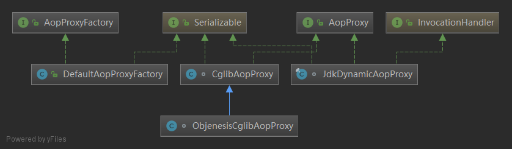
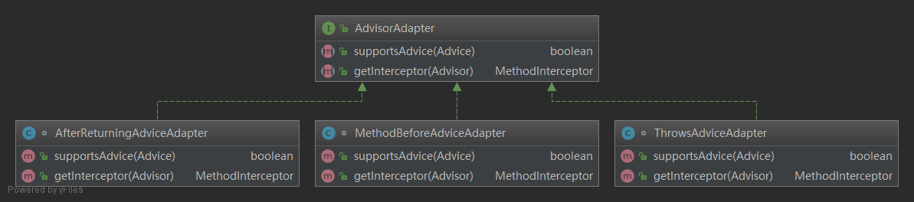
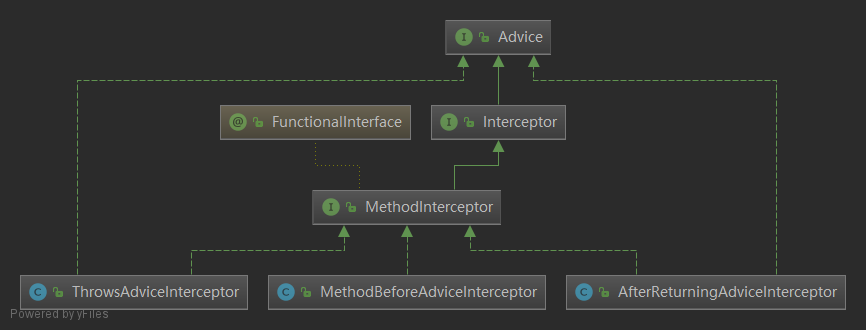
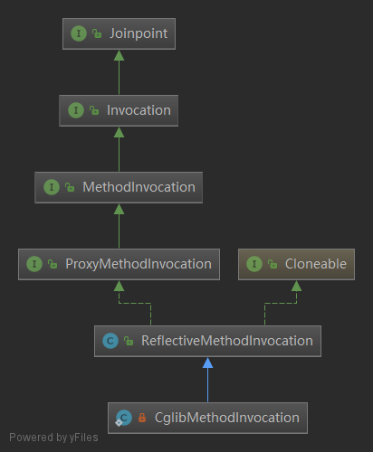

# spring-AOP-invoke 调用

-----------

## 一、调用概述

### 1.1 JDK代理和CGLIB的调用

AOP调用，主要分为2个部分： JDK代理调用和CGLIB代理调用

**1、JDK代理的执行通过`JdkDynamicAopProxy.invoke`方法**

- A、获取拦截器和动态拦截器列表
  - （1） 获取全局注册的advice,默认注册会将`MethodBeforeAdviceAdapter`、`AfterReturningAdviceAdapter`、`ThrowsAdviceAdapter`放入adapterList中。
  - （2） 表point表达式进行匹配，匹配成功放入List中返回。List中存的是`MethodBeforeAdviceInterceptor(advice)`, `AfterReturningAdviceInterceptor(advice)`, `ThrowsAdviceInterceptor(advisor.getAdvice())`
  - （3） 返回List后，会缓存起来，下次就不需要重新匹配。
- B、切面执行：先调用拦截器链(chain)，再调用原生方法
  - （1）先执行拦截器链advice chain.
  - （2）通过CGLIB调用fci.f1.invoke(fci.i1, obj, args)
  - （3）通过反射调用method.invoke(target, args)

**2、CGLIB代理的执行是通过 `DynamicAdvisedInterceptor.intercept()`方法**

AOP调用之前，在AopProxy#getProxy() (即CglibAopProxy#getProxy)创建代理对象时，会先将拦截器放到callback[]中，以便后面调用。

AOP调用，最后调用MethodProxy.invoke()或ReflectiveMethodInvocation.procee()


### 1.2 调用路径链

1、JDK调用

-JdkDynamicAopProxy.invoke(MethodInterceptor.invoke) 入口类
--AdvisedSupport.exposeProxy 判断是否exposeProxy=true为了解决有时候目标对象内部的自我调用无法实现切面增强
--AdvisedSupport.getInterceptorsAndDynamicInterceptionAdvice(method,targetClass)  获取拦截器和动态拦截器列表
--1/AopUtils.invokeJoinpointUsingReflection 如果拦截器列表为空，通过反射直接调用该方法
---method.invoke反射执行
--2/new ReflectiveMethodInvocation(proxy, target, method, args, targetClass, chain) 不为空，new对象
--ReflectiveMethodInvocation.proceed() 通过proceed方法对原方法进行拦截
---1/MethodInterceptor#invoke 前置后置等拦截器调用
---2/ReflectiveMethodInvocation#invokeJoinpoint 或执行invokeJoinpoint 方法
----1/MethodProxy#invoke 最终执行CGLIB:MethodProxy#invoke
----2/ReflectiveMethodInvocation#invokeJoinpoint(super.invokeJoinpoint()) 调用父类invokeJoinpoint
-----AopUtils.invokeJoinpointUsingReflection 反射直接调用该方法
------Method.invoke 方法执行

2、AOP调用

-DynamicAdvisedInterceptor.intercept
--AdvisedSupport.exposeProxy
--AdvisedSupport.getInterceptorsAndDynamicInterceptionAdvice(method,targetClass)
--1/methodProxy.invoke chain拦截器链为空，直接执行methodProxy.invoke
--2/new CglibMethodInvocation().proceed() chain拦截器链不为空，执行ReflectiveMethodInvocation.proceed()
--ReflectiveMethodInvocation.proceed() 与上面的执行过程相同
--2/CglibAopProxy.processReturnType 返回执行类型


### 1.3 JDK和AOP调用比较

相同：拦截器链不为空时，都会执行ReflectiveMethodInvocation.proceed()

不同：拦截器链为空时，JDK会直接通过反射执行原方法；AOP会通过methodProxy.invoke执行。当然他们的入口类也是不同的。


### 1.4 JdkDynamicAopProxy和ObjenesisCglibAopProxy继承关系

它们都实现了AopProxy, JdkDynamicAopProxy实现了`InvocationHandler`接口




### 1.5 InvocationHandler接口

每一个动态代理类都必须要实现InvocationHandler这个接口，并且每个代理类的实例都关联到了一个handler，当我们通过代理对象调用一个方法的时候，这个方法的调用就会被转发为由InvocationHandler这个接口的 invoke 方法来进行调用。 

```java
/**
 * {@code InvocationHandler} is the interface implemented by
 * the <i>invocation handler</i> of a proxy instance.
 *
 * <p>Each proxy instance has an associated invocation handler.
 * When a method is invoked on a proxy instance, the method
 * invocation is encoded and dispatched to the {@code invoke}
 * method of its invocation handler.
 */
package java.lang.reflect;
public interface InvocationHandler {
    public Object invoke(Object proxy, Method method, Object[] args)
        throws Throwable;
}
```

第一个参数[解释](http://stackoverflow.com/questions/22930195/understanding-proxy-arguments-of-the-invoke-method-of-java-lang-reflect-invoca ) Object proxy

1. 可以使用反射获取代理对象的信息（也就是proxy.getClass().getName()）。
2. 可以将代理对象返回以进行连续调用，这就是proxy存在的目的，因为this并不是代理对象。


## 二、JDK调用(JdkDynamicAopProxy#invoke)

---------------

### 2.1 JdkDynamicAopProxy#invoke入口类和方法

JdkDynamicAopProxy 实现了InvocationHandler接口。

一个代理对象和一个`InvocationHandler`绑定，当执行代理对象的方法时，就会去执行`InvocationHandler.invoke(Object proxy, Method method, Object[] args)`方法。

JdkDynamicAopProxy继承了InvocationHandler，所以上文中在创建代理对象时传的参数是this:

> Proxy.newProxyInstance(classLoader, proxiedInterfaces, this);


Proxy#newProxyInstance通过反射构造函数来进行类的实例化

```java
public static Object newProxyInstance(ClassLoader loader,
                                      Class<?>[] interfaces,
                                      InvocationHandler h)
    throws IllegalArgumentException
{
    Objects.requireNonNull(h);

    final Class<?>[] intfs = interfaces.clone();
    final SecurityManager sm = System.getSecurityManager();
    if (sm != null) {
        checkProxyAccess(Reflection.getCallerClass(), loader, intfs);
    }

    /*
     * Look up or generate the designated proxy class.
     */
    Class<?> cl = getProxyClass0(loader, intfs);

    /*
     * Invoke its constructor with the designated invocation handler.
     */
    try {
        if (sm != null) {
            checkNewProxyPermission(Reflection.getCallerClass(), cl);
        }

        final Constructor<?> cons = cl.getConstructor(constructorParams);
        final InvocationHandler ih = h;
        if (!Modifier.isPublic(cl.getModifiers())) {
            AccessController.doPrivileged(new PrivilegedAction<Void>() {
                public Void run() {
                    cons.setAccessible(true);
                    return null;
                }
            });
        }
        return cons.newInstance(new Object[]{h});//h=this
    } //....
}
```


this参数对应的是InvocationHandler对象,也就是说当Proxy对象的函数被调用的时候，InvocationHandler的invoke方法会被作为回调函数调用，即`JdkDynamicAopProxy.invoke(Object proxy, Method method, Object[] args)`会被调用。  

```java
/** Config used to configure this proxy. */
private final AdvisedSupport advised;

/**
 * Implementation of {@code InvocationHandler.invoke}.
 * <p>Callers will see exactly the exception thrown by the target,
 * unless a hook method throws an exception.
 */
@Override
@Nullable
public Object invoke(Object proxy, Method method, Object[] args) throws Throwable {
    MethodInvocation invocation;
    Object oldProxy = null;
    boolean setProxyContext = false;

    //<-----------
    TargetSource targetSource = this.advised.targetSource;
    Object target = null;

    try {
        //equals方法与hashCode方法即使满足expression规则，也不会为之产生代理内容，调用的是JdkDynamicAopProxy的equals方法与hashCode方法
        if (!this.equalsDefined && AopUtils.isEqualsMethod(method)) {
            // The target does not implement the equals(Object) method itself.
            return equals(args[0]);
        }
        else if (!this.hashCodeDefined && AopUtils.isHashCodeMethod(method)) {
            // The target does not implement the hashCode() method itself.
            return hashCode();
        }
        else if (method.getDeclaringClass() == DecoratingProxy.class) {
            // There is only getDecoratedClass() declared -> dispatch to proxy config.
            return AopProxyUtils.ultimateTargetClass(this.advised);
        }
        else if (!this.advised.opaque && method.getDeclaringClass().isInterface() &&
                 method.getDeclaringClass().isAssignableFrom(Advised.class)) {
            // Service invocations on ProxyConfig with the proxy config...
            // 直接通过反射调用该方法: 方法所属的Class是一个接口并且方法所属的Class是AdvisedSupport的父类或者父接口
            return AopUtils.invokeJoinpointUsingReflection(this.advised, method, args);
        }

        Object retVal;
	    //判断是否将代理暴露出去的，由<aop:config>标签中的expose-proxy=”true/false”配置	
        // expose-proxy属性是为了解决有时候目标对象内部的自我调用无法实现切面增强
        if (this.advised.exposeProxy) {
            // Make invocation available if necessary.
            oldProxy = AopContext.setCurrentProxy(proxy);
            setProxyContext = true;
        }

        // Get as late as possible to minimize the time we "own" the target,
        // in case it comes from a pool.
        target = targetSource.getTarget();
        Class<?> targetClass = (target != null ? target.getClass() : null);

        // Get the interception chain for this method.
        // 获取AdvisedSupport中的所有拦截器和动态拦截器列表，用于拦截方法，具体到我们的实际代码，列表中有三个Object  <-----------
        List<Object> chain = this.advised.getInterceptorsAndDynamicInterceptionAdvice(method, targetClass);

        // Check whether we have any advice. If we don't, we can fallback on direct
        // reflective invocation of the target, and avoid creating a MethodInvocation.
        if (chain.isEmpty()) {
            // We can skip creating a MethodInvocation: just invoke the target directly
            // Note that the final invoker must be an InvokerInterceptor so we know it does
            // nothing but a reflective operation on the target, and no hot swapping or fancy proxying.
            //如果拦截器列表为空，很正常，因为某个类/接口下的某个方法可能不满足expression的匹配规则，因此此时通过反射直接调用该方法
            Object[] argsToUse = AopProxyUtils.adaptArgumentsIfNecessary(method, args);
            retVal = AopUtils.invokeJoinpointUsingReflection(target, method, argsToUse);
        }
        else {
            // We need to create a method invocation...
            // 如果拦截器列表不为空，按照注释的意思，需要一个ReflectiveMethodInvocation，并通过proceed方法对原方法进行拦截
            invocation = new ReflectiveMethodInvocation(proxy, target, method, args, targetClass, chain);
            // Proceed to the joinpoint through the interceptor chain.
            retVal = invocation.proceed(); // <------------ 2.3
        }

        // Massage return value if necessary.
        Class<?> returnType = method.getReturnType();
        if (retVal != null && retVal == target &&
            returnType != Object.class && returnType.isInstance(proxy) &&
            !RawTargetAccess.class.isAssignableFrom(method.getDeclaringClass())) {
            // Special case: it returned "this" and the return type of the method
            // is type-compatible. Note that we can't help if the target sets
            // a reference to itself in another returned object.
            retVal = proxy;
        }
        else if (retVal == null && returnType != Void.TYPE && returnType.isPrimitive()) {
            throw new AopInvocationException(
                "Null return value from advice does not match primitive return type for: " + method);
        }
        return retVal;
    }
    finally {
        if (target != null && !targetSource.isStatic()) {
            // Must have come from TargetSource.
            targetSource.releaseTarget(target);
        }
        if (setProxyContext) {
            // Restore old proxy.
            AopContext.setCurrentProxy(oldProxy);
        }
    }
}
```

**proxy（代理对象）代理的不是target，而是TargetSource**

需要注意`JdkDynamicAopProxy`持有的`AdvisedSupport`实例，`AdvisedSupport`类中包含了一个`TargetSource`实例，目标对象就在`TargetSource`中，也就是说代理间接持有了目标对象 

```java
public class AdvisedSupport extends ProxyConfig implements Advised {
    /** Package-protected to allow direct access for efficiency. */
	TargetSource targetSource = EMPTY_TARGET_SOURCE;
}
```

回看 `AbstractAutoProxyCreator#wrapIfNecessary` 方法创建代理对象 

> Object proxy = createProxy(bean.getClass(), beanName, specificInterceptors, new SingletonTargetSource(bean)); 

看到这里的`SingletonTargetSource`就是`TargetSource`的实现类，其实在创建代理的时候就已经把目标对象放到`TargetSource`中，换句话说，**proxy（代理对象）代理的不是target，而是TargetSource** 


**注意：**

- **目标bean的生命周期不受Spring容器管理，我们以往的XML中的AOP配置，只是对受容器管理的bean而言的**
- **代理类会代理接口中所有方法，非增强方法同样需要通过代理类去访问(只是没有执行增强切面)**
- **Spring的AOP框架默认为目标bean创建静态目标源SingletonTargetSource，如果bean被配置为prototype，则spring会在每次getBean时创建新的SingletonTargetSource实例**

下面看怎么获取拦器器Interceptors列表


> List<Object> chain = this.advised.getInterceptorsAndDynamicInterceptionAdvice(method, targetClass);

### 2.2 AdvisedSupport.getInterceptorsAndDynamicInterceptionAdvice 获取拦截器和动态拦截器列表

`AdvisedSupport.getInterceptorsAndDynamicInterceptionAdvice` 作用：获取匹配拦截器后，先将拦截器列表chain缓存起来，下次就不会进行表达式匹配。

步骤：

1、获取全局注册的advice,默认注册会将`MethodBeforeAdviceAdapter`、`AfterReturningAdviceAdapter`、`ThrowsAdviceAdapter`放入adapterList中。

2、表point表达式进行匹配，匹配成功放入List中返回。List中存的是`MethodBeforeAdviceInterceptor(advice)`, `AfterReturningAdviceInterceptor(advice)`, `ThrowsAdviceInterceptor(advisor.getAdvice())`

3、返回List后，会缓存起来，下次就不需要重新匹配。

另外，因为存的是`MethodBeforeAdviceInterceptor`，所以在调用它的invoke方法时，会先执行前置切面方法，再执行原方法。

```java
AdvisorChainFactory advisorChainFactory = new DefaultAdvisorChainFactory();

public List<Object> getInterceptorsAndDynamicInterceptionAdvice(Method method, @Nullable Class<?> targetClass) {
   MethodCacheKey cacheKey = new MethodCacheKey(method);
   List<Object> cached = this.methodCache.get(cacheKey);
   if (cached == null) {
      cached = this.advisorChainFactory.getInterceptorsAndDynamicInterceptionAdvice(
            this, method, targetClass);
      this.methodCache.put(cacheKey, cached);
   }
   return cached;
}
```


#### 2.2.1 `DefaultAdvisorChainFactory.getInterceptorsAndDynamicInterceptionAdvice()`

对于给定的`Advised  `对象，为一个方法找到一个`advice chain ` ,总是重新构建每个`advice chain `，缓存可以由子类提供。

返回的是匹配的List：`MethodBeforeAdviceInterceptor(advice)`, `AfterReturningAdviceInterceptor(advice)`, `ThrowsAdviceInterceptor(advisor.getAdvice())`


```java
@Override
public List<Object> getInterceptorsAndDynamicInterceptionAdvice(
      Advised config, Method method, @Nullable Class<?> targetClass) {

   // This is somewhat tricky... We have to process introductions first,
   // but we need to preserve order in the ultimate list.
   List<Object> interceptorList = new ArrayList<>(config.getAdvisors().length);
   Class<?> actualClass = (targetClass != null ? targetClass : method.getDeclaringClass());
   boolean hasIntroductions = hasMatchingIntroductions(config, actualClass);
   //registry在初始化的实例时，存的MethodBeforeAdviceInterceptor、AfterReturningAdviceInterceptor、ThrowsAdviceInterceptor
   AdvisorAdapterRegistry registry = GlobalAdvisorAdapterRegistry.getInstance();//<-----
    
   for (Advisor advisor : config.getAdvisors()) {
			if (advisor instanceof PointcutAdvisor) {
				// Add it conditionally.
				PointcutAdvisor pointcutAdvisor = (PointcutAdvisor) advisor;
				if (config.isPreFiltered() || pointcutAdvisor.getPointcut().getClassFilter().matches(actualClass)) {
					MethodInterceptor[] interceptors = registry.getInterceptors(advisor);
					MethodMatcher mm = pointcutAdvisor.getPointcut().getMethodMatcher();
                      //与表达式进行匹配，匹配后存入List
					if (MethodMatchers.matches(mm, method, actualClass, hasIntroductions)) {
						if (mm.isRuntime()) {
							// Creating a new object instance in the getInterceptors() method
							// isn't a problem as we normally cache created chains.
							for (MethodInterceptor interceptor : interceptors) {
								interceptorList.add(new InterceptorAndDynamicMethodMatcher(interceptor, mm));
							}
						}
						else {
							interceptorList.addAll(Arrays.asList(interceptors));
						}
					}
				}
			}
			else if (advisor instanceof IntroductionAdvisor) {
				IntroductionAdvisor ia = (IntroductionAdvisor) advisor;
				if (config.isPreFiltered() || ia.getClassFilter().matches(actualClass)) {
					Interceptor[] interceptors = registry.getInterceptors(advisor);
					interceptorList.addAll(Arrays.asList(interceptors));
				}
			}
			else {
				Interceptor[] interceptors = registry.getInterceptors(advisor);
				interceptorList.addAll(Arrays.asList(interceptors));
			}
		}

		return interceptorList;
}
```


##### 2.2.1.1 GlobalAdvisorAdapterRegistry.getInstance()

> GlobalAdvisorAdapterRegistry.getInstance();

`registry.getInterceptors`中，是`MethodBeforeAdviceInterceptor(advice)`, `AfterReturningAdviceInterceptor(advice)`, `ThrowsAdviceInterceptor(advisor.getAdvice())`

```java
public final class GlobalAdvisorAdapterRegistry {

   private GlobalAdvisorAdapterRegistry() {
   }


   /**
    * Keep track of a single instance so we can return it to classes that request it.
    */
   private static AdvisorAdapterRegistry instance = new DefaultAdvisorAdapterRegistry();

   /**
    * Return the singleton {@link DefaultAdvisorAdapterRegistry} instance.
    */
   public static AdvisorAdapterRegistry getInstance() {
      return instance;
   }
    //...
}
```


`DefaultAdvisorAdapterRegistry`初始化时，会将`MethodBeforeAdviceAdapter`、`AfterReturningAdviceAdapter`、`ThrowsAdviceAdapter`放入adapters中。

`getInterceptors()`作用：如果返回是当前advisor与上面三种类型相同的 Adapter，`getInterceptor(advisor)`将添加到`interceptors`中，`getInterceptor(advisor)`其实就是返回的就是:`MethodBeforeAdviceInterceptor(advice)`, `AfterReturningAdviceInterceptor(advice)`, `ThrowsAdviceInterceptor(advisor.getAdvice())`

```java
public class DefaultAdvisorAdapterRegistry implements AdvisorAdapterRegistry, Serializable {
   private final List<AdvisorAdapter> adapters = new ArrayList<>(3);

   /**
    * Create a new DefaultAdvisorAdapterRegistry, registering well-known adapters.
    */
   public DefaultAdvisorAdapterRegistry() {
      registerAdvisorAdapter(new MethodBeforeAdviceAdapter());
      registerAdvisorAdapter(new AfterReturningAdviceAdapter());
      registerAdvisorAdapter(new ThrowsAdviceAdapter());
   }
   //.....  
   @Override
   public MethodInterceptor[] getInterceptors(Advisor advisor) throws UnknownAdviceTypeException {
		List<MethodInterceptor> interceptors = new ArrayList<>(3);
		Advice advice = advisor.getAdvice();
		if (advice instanceof MethodInterceptor) {
			interceptors.add((MethodInterceptor) advice);
		}
		for (AdvisorAdapter adapter : this.adapters) {
			if (adapter.supportsAdvice(advice)) {
				interceptors.add(adapter.getInterceptor(advisor)); //<-----
			}
		}
		if (interceptors.isEmpty()) {
			throw new UnknownAdviceTypeException(advisor.getAdvice());
		}
		return interceptors.toArray(new MethodInterceptor[0]); 
	}

}
```


`MethodBeforeAdviceAdapter`、`AfterReturningAdviceAdapter`、`ThrowsAdviceAdapter`的继承关系，它们都实现了`AdvisorAdapter`接口。




看一下 `MethodBeforeAdviceAdapter`类。

`getInterceptor`，返回是的`MethodBeforeAdviceInterceptor(advice)`

```java
class MethodBeforeAdviceAdapter implements AdvisorAdapter, Serializable {

   @Override
   public boolean supportsAdvice(Advice advice) {
      return (advice instanceof MethodBeforeAdvice);
   }

   @Override
   public MethodInterceptor getInterceptor(Advisor advisor) {
      MethodBeforeAdvice advice = (MethodBeforeAdvice) advisor.getAdvice();
      return new MethodBeforeAdviceInterceptor(advice);
   }
}
```


#### 2.2. **MethodBeforeAdviceInterceptor#invoke前置切面执行示例**

下面是`MethodBeforeAdviceInterceptor`代码，invoke最终会被调用，在调用前，先执行了前置切面方法

> this.advice.before(mi.getMethod(), mi.getArguments(), mi.getThis());

```java
public class MethodBeforeAdviceInterceptor implements MethodInterceptor, Serializable {

	private MethodBeforeAdvice advice;
	/**
	 * Create a new MethodBeforeAdviceInterceptor for the given advice.
	 * @param advice the MethodBeforeAdvice to wrap
	 */
	public MethodBeforeAdviceInterceptor(MethodBeforeAdvice advice) {
		Assert.notNull(advice, "Advice must not be null");
		this.advice = advice;
	}

	@Override
	public Object invoke(MethodInvocation mi) throws Throwable {
		this.advice.before(mi.getMethod(), mi.getArguments(), mi.getThis());
		return mi.proceed();
	}
}
```


接下来看一下`MethodBeforeAdviceInterceptor.invoke()`是怎么被调用的

### 2.3 ReflectiveMethodInvocation#proceed 切面执行：先调用拦截器链(chain)，再调用原生方法

调用关系：InvocationHandler.invoke-->ReflectiveMethodInvocation.proceed--->

1、MethodInterceptor#invoke

2、ReflectiveMethodInvocation#invokeJoinpoint -->

- MethodProxy#invoke
- 或执行 ReflectiveMethodInvocation#invokeJoinpoint(super.invokeJoinpoint())-->`AopUtils.invokeJoinpointUsingReflection`-->Method.invoke


>retVal = invocation.proceed();

切面执行：

1、先执行拦截器链advice chain.

2、调用原生方法：

​	A、通过CGLIB调用fci.f1.invoke(fci.i1, obj, args)

​	B、通过反射调用method.invoke(target, args)


`ReflectiveMethodInvocation.proceed()`

```java
public Object proceed() throws Throwable {
   // We start with an index of -1 and increment early.
   if (this.currentInterceptorIndex == this.interceptorsAndDynamicMethodMatchers.size() - 1) {
      return invokeJoinpoint(); // <---------------
   }

   Object interceptorOrInterceptionAdvice =
         this.interceptorsAndDynamicMethodMatchers.get(++this.currentInterceptorIndex);
   if (interceptorOrInterceptionAdvice instanceof InterceptorAndDynamicMethodMatcher) {
      // Evaluate dynamic method matcher here: static part will already have
      // been evaluated and found to match.
      InterceptorAndDynamicMethodMatcher dm =
            (InterceptorAndDynamicMethodMatcher) interceptorOrInterceptionAdvice;
      if (dm.methodMatcher.matches(this.method, this.targetClass, this.arguments)) {
         return dm.interceptor.invoke(this); // <---------- 2.3.1
      }
      else {
         // Dynamic matching failed.
         // Skip this interceptor and invoke the next in the chain.
         //此处循环调用advisor chain. 
         return proceed(); 
      }
   }
   else {
      // It's an interceptor, so we just invoke it: The pointcut will have
      // been evaluated statically before this object was constructed.
      //<--------- 2.3.1
      return ((MethodInterceptor) interceptorOrInterceptionAdvice).invoke(this);
   }
}
```

#### 2.3.1 MethodInterceptor#invoke



> dm.interceptor.invoke(this); 

> ((MethodInterceptor) interceptorOrInterceptionAdvice).invoke(this);

实际上调用的是`MethodBeforeAdviceAdapter`、`AfterReturningAdviceAdapter`、`ThrowsAdviceAdapter`的`invoke`方法。而它们最终会调用：

`MethodBeforeAdviceInterceptor.invoke()`

`AfterReturningAdviceInterceptor.invoke()`

`ThrowsAdviceInterceptor.invoke()`

上面已经贴出了`MethodBeforeAdviceInterceptor`源码

#### 2.3.2  CglibMethodInvocation#invokeJoinpoint

`invokeJoinpoint()`方法有2个实现类：

`CglibMethodInvocation.invokeJoinpoint()`

`ReflectiveMethodInvocation.invokeJoinpoint()`

`CglibMethodInvocation`继承了`ReflectiveMethodInvocation`, 并重写了`invokeJoinpoint()`方法



##### 2.3.2.1 CglibMethodInvocation#invokeJoinpoint 

`CglibMethodInvocation.invokeJoinpoint()`

```java
/**
 * Gives a marginal performance improvement versus using reflection to
 * invoke the target when invoking public methods.
 */
@Override
protected Object invokeJoinpoint() throws Throwable {
   if (this.publicMethod && getMethod().getDeclaringClass() != Object.class) {
      return this.methodProxy.invoke(this.target, this.arguments);
   }
   else {
      return super.invokeJoinpoint();
   }
}
```


###### 2.3.2.1.1 **MethodProxy#invoke(最后调用fci.f1.invoke(fci.i1, obj, args))**

> this.methodProxy.invoke(this.target, this.arguments);

最后会调用

`MethodProxy.invoke()`

```java
/**
 * Invoke the original method, on a different object of the same type.
 * @param obj the compatible object; recursion will result if you use the object passed as the first
 * argument to the MethodInterceptor (usually not what you want)
 * @param args the arguments passed to the intercepted method; you may substitute a different
 * argument array as long as the types are compatible
 * @throws Throwable the bare exceptions thrown by the called method are passed through
 * without wrapping in an <code>InvocationTargetException</code>
 * @see MethodInterceptor#intercept
 */
public Object invoke(Object obj, Object[] args) throws Throwable {
   try {
      init();
      FastClassInfo fci = fastClassInfo;
      return fci.f1.invoke(fci.i1, obj, args);
   }
   catch (InvocationTargetException ex) {
      throw ex.getTargetException();
   }
   catch (IllegalArgumentException ex) {
      if (fastClassInfo.i1 < 0)
         throw new IllegalArgumentException("Protected method: " + sig1);
      throw ex;
   }
}
```

##### 2.3.2.2  ReflectiveMethodInvocation#invokeJoinpoint最后反射调用该方法

`ReflectiveMethodInvocation.invokeJoinpoint()`

```java
/**
 * Invoke the joinpoint using reflection.
 * Subclasses can override this to use custom invocation.
 * @return the return value of the joinpoint
 * @throws Throwable if invoking the joinpoint resulted in an exception
 */
@Nullable
protected Object invokeJoinpoint() throws Throwable {
   return AopUtils.invokeJoinpointUsingReflection(this.target, this.method, this.arguments);
}
```

###### 2.3.2.2.1 **method#invokeJoinpointUsingReflection直接通过反射调用该方法method.invoke(target, args);**

`AopUtils.invokeJoinpointUsingReflection`直接通过反射调用该方法

```java
/**
 * Invoke the given target via reflection, as part of an AOP method invocation.
 * @param target the target object
 * @param method the method to invoke
 * @param args the arguments for the method
 * @return the invocation result, if any
 * @throws Throwable if thrown by the target method
 * @throws org.springframework.aop.AopInvocationException in case of a reflection error
 */
@Nullable
public static Object invokeJoinpointUsingReflection(@Nullable Object target, Method method, Object[] args) throws Throwable {

   // Use reflection to invoke the method.
   try {
      ReflectionUtils.makeAccessible(method);
      return method.invoke(target, args);
   }
   catch (InvocationTargetException ex) {
      // Invoked method threw a checked exception.
      // We must rethrow it. The client won't see the interceptor.
      throw ex.getTargetException();
   }
   catch (IllegalArgumentException ex) {
      throw new AopInvocationException("AOP configuration seems to be invalid: tried calling method [" +
            method + "] on target [" + target + "]", ex);
   }
   catch (IllegalAccessException ex) {
      throw new AopInvocationException("Could not access method [" + method + "]", ex);
   }
}
```


## 三、AOP调用

--------

**AOP调用，最后调用MethodProxy.invoke()或ReflectiveMethodInvocation.procee()**


先回顾一下`CglibAopProxy.getCallbacks()`代码 ，里面最重要的就是5个拦截器：

`DynamicAdvisedInterceptor`

如果是 exposeProxy=true的话：

`StaticUnadvisedExposedInterceptor`	

`DynamicUnadvisedExposedInterceptor`

否则

`StaticUnadvisedInterceptor`

`DynamicUnadvisedInterceptor`

它们最后都会放到 Callback[] 数组中。

```java
private Callback[] getCallbacks(Class<?> rootClass) throws Exception {
   // Parameters used for optimization choices...
   boolean exposeProxy = this.advised.isExposeProxy();
   boolean isFrozen = this.advised.isFrozen();
   boolean isStatic = this.advised.getTargetSource().isStatic();

   // Choose an "aop" interceptor (used for AOP calls).
   Callback aopInterceptor = new DynamicAdvisedInterceptor(this.advised);

   // Choose a "straight to target" interceptor. (used for calls that are
   // unadvised but can return this). May be required to expose the proxy.
   Callback targetInterceptor;
   if (exposeProxy) {
      targetInterceptor = (isStatic ?
            new StaticUnadvisedExposedInterceptor(this.advised.getTargetSource().getTarget()) :
            new DynamicUnadvisedExposedInterceptor(this.advised.getTargetSource()));
   }
   else {
      targetInterceptor = (isStatic ?
            new StaticUnadvisedInterceptor(this.advised.getTargetSource().getTarget()) :
            new DynamicUnadvisedInterceptor(this.advised.getTargetSource()));
   }

   // Choose a "direct to target" dispatcher (used for
   // unadvised calls to static targets that cannot return this).
   Callback targetDispatcher = (isStatic ?
         new StaticDispatcher(this.advised.getTargetSource().getTarget()) : new SerializableNoOp());

   Callback[] mainCallbacks = new Callback[] {
         aopInterceptor,  // for normal advice
         targetInterceptor,  // invoke target without considering advice, if optimized
         new SerializableNoOp(),  // no override for methods mapped to this
         targetDispatcher, this.advisedDispatcher,
         new EqualsInterceptor(this.advised),
         new HashCodeInterceptor(this.advised)
   };
   //.......
}
```


### 3.1 DynamicAdvisedInterceptor#intercept调用MethodProxy.invoke()或ReflectiveMethodInvocation.procee()

1、拦截器链Advice chain为空，执行`MethodProxy.invoke()`

2、拦截器链Advice chain不为空，封装成`CglibMethodInvocation`返回。`CglibMethodInvocation`继承了`ReflectiveMethodInvocation`，最后调用，可以参考`ReflectiveMethodInvocation.procee() `的执行过程

```java
@Override
@Nullable
public Object intercept(Object proxy, Method method, Object[] args, MethodProxy methodProxy) throws Throwable {
   Object oldProxy = null;
   boolean setProxyContext = false;
   Object target = null;
   TargetSource targetSource = this.advised.getTargetSource();
   try {
      if (this.advised.exposeProxy) {
         // Make invocation available if necessary.
         oldProxy = AopContext.setCurrentProxy(proxy);
         setProxyContext = true;
      }
      // Get as late as possible to minimize the time we "own" the target, in case it comes from a pool...
      target = targetSource.getTarget();
      Class<?> targetClass = (target != null ? target.getClass() : null);
      List<Object> chain = this.advised.getInterceptorsAndDynamicInterceptionAdvice(method, targetClass);
      Object retVal;
      // Check whether we only have one InvokerInterceptor: that is,
      // no real advice, but just reflective invocation of the target.
      if (chain.isEmpty() && Modifier.isPublic(method.getModifiers())) {
         // We can skip creating a MethodInvocation: just invoke the target directly.
         // Note that the final invoker must be an InvokerInterceptor, so we know
         // it does nothing but a reflective operation on the target, and no hot
         // swapping or fancy proxying.
         Object[] argsToUse = AopProxyUtils.adaptArgumentsIfNecessary(method, args);
         // <---- 拦截器链为空时，直接使用MethodProxy.invoke()调用，上面已经分析过了 
         retVal = methodProxy.invoke(target, argsToUse);
      }
      else {
         // We need to create a method invocation...
         //创建CglibMethodInvocation类，最后也会调用ReflectiveMethodInvocation  
         retVal = new CglibMethodInvocation(proxy, target, method, args, targetClass, chain, methodProxy).proceed();
      }
      retVal = processReturnType(proxy, target, method, retVal);
      return retVal;
   }
   finally {
      if (target != null && !targetSource.isStatic()) {
         targetSource.releaseTarget(target);
      }
      if (setProxyContext) {
         // Restore old proxy.
         AopContext.setCurrentProxy(oldProxy);
      }
   }
}
```


拦截器链Advice chain不为空，直接执行: `methodProxy.invoke`; 不为空，要么返回一个`CglibMethodInvocation`，在某些条件下`CglibMethodInvocation`会被`proxy`替代，下面来看代码。

#### 3.1.1   CglibMethodInvocation 


> private static class CglibMethodInvocation extends ReflectiveMethodInvocation

`CglibMethodInvocation`继承了`ReflectiveMethodInvocation`，最后调用，可以参考`ReflectiveMethodInvocation.procee() `的执行过程

##### 3.1.1.1 如果目标在另一个返回的对象中设置对自身的引用，代理失败，将返回this

我觉得下面的代码比较重要，这就是为什么有时候，在目标对象调用自己引用方法时，AOP无法代理成功的原因

此处待确认！！！！！！

> 如果目标在另一个返回的对象中设置对自身的引用，代理将返回this.

```java
/**
 * Process a return value. Wraps a return of {@code this} if necessary to be the
 * {@code proxy} and also verifies that {@code null} is not returned as a primitive.
 */
@Nullable
private static Object processReturnType(
      Object proxy, @Nullable Object target, Method method, @Nullable Object returnValue) {

   // Massage return value if necessary
   if (returnValue != null && returnValue == target &&
         !RawTargetAccess.class.isAssignableFrom(method.getDeclaringClass())) {
      // Special case: it returned "this". Note that we can't help
      // if the target sets a reference to itself in another returned object.
      returnValue = proxy;
   }
   Class<?> returnType = method.getReturnType();
   if (returnValue == null && returnType != Void.TYPE && returnType.isPrimitive()) {
      throw new AopInvocationException(
            "Null return value from advice does not match primitive return type for: " + method);
   }
   return returnValue;
}
```

下面摘了一段[spring AOP文档](http://springcert.sourceforge.net/2.5/2-study-aop.html)

>The key thing to understand here is that the client code inside the main(..) of the Main class has a reference to the proxy. This means that method calls on that object reference will be calls on the proxy, and as such the proxy will be able to delegate to all of the interceptors (advice) that are relevant to that particular method call. However, once the call has finally reached the target object, the SimplePojo reference in this case, any method calls that it may make on itself, such as this.bar() or this.foo(), are going to be invoked against the this reference, and not the proxy. This has important implications. It means that self-invocation is not going to result in the advice associated with a method invocation getting a chance to execute. 

如果想要在方法中调用自身引用怎么办？Spring AOP文档里说了，最好的方法是重构你的代码，去掉这样的内部调用。 

如果一定要用的话，或以使用

> ((Pojo) AopContext.currentProxy()).methodB(); 

同时，设置 expose-proxy="true" 

><aop:aspectj-autoproxy expose-proxy="true" />

或先从工厂中得到当前对象，再调用对象方法。

> PojoService = SpringBeanFactory.getBean("simplePojoService");        
>
> PojoService.methodB(); 

### 3.2 DynamicUnadvisedInterceptor#intercept最后调用MethodProxy.invoke()

最后还是MethodProxy.invoke()调用，上面已经分析过了 

```java
public Object intercept(Object proxy, Method method, Object[] args, MethodProxy methodProxy) throws Throwable {
   Object target = this.targetSource.getTarget();
   try {
      Object retVal = methodProxy.invoke(target, args);
      return processReturnType(proxy, target, method, retVal);
   }
   finally {
      if (target != null) {
         this.targetSource.releaseTarget(target);
      }
   }
}
```