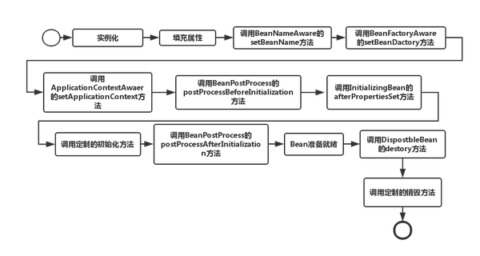
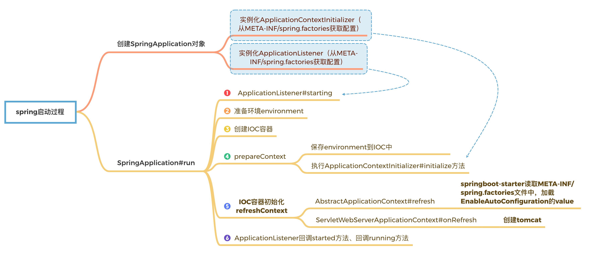
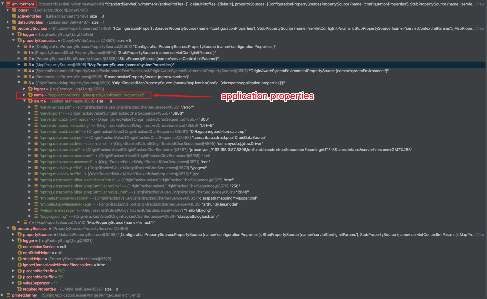
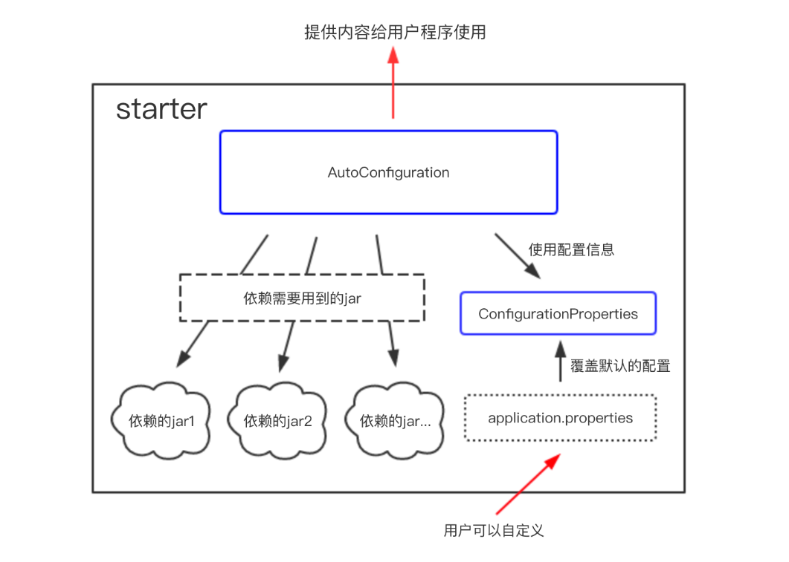
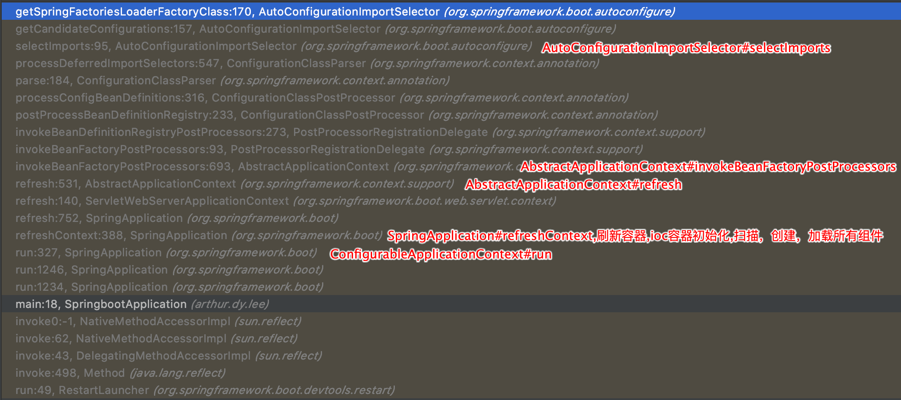

## 一、springMVC和servlet

### springMVC的原理  

**http servlet生命周期，在springmvc对原生servlet做了一个怎么样的包装来实现一个自己的mvc能力的？**

1.加载和实例化。Servlet容器负责加载和实例化Servlet。当Servlet容器启动时，或者在容器检测到需要这个Servlet来响应第一个请求时，创建Servlet实例。
2.初始化。在Servlet实例化之后，容器将调用Servlet的init()方法初始化这个对象。初始化的目的是为了让Servlet对象在处理客户端请求前完成一些初始化的工作，
3.请求处理。Servlet容器调用Servlet的service()方法对请求进行处理。service()方法为Servlet的核心方法，客户端的业务逻辑应该在该方法内执行，典型的服务方法的开发流程为：解析客户端请求-〉执行业务逻辑-〉输出响应页面到客户端
4.服务终止。容器就会调用实例的destroy()方法，以便让该实例可以释放它所使用的资源
在整个Servlet的生命周期过程中，创建Servlet实例、调用实例的init()和destroy()方法都只进行一次，当初始化完成后，Servlet容器会将该实例保存在内存中，通过调用它的service()方法，为接收到的请求服务。如建立数据库的连接，获取配置信息等。对于每一个Servlet实例，init()方法只被调用一次。

Spring web MVC框架提供了MVC(模型 - 视图 - 控制器)架构和用于开发灵活和松散耦合的Web应用程序的组件。MVC模式导致应用程序的不同方面(输入逻辑，业务逻辑和UI逻辑)分离，同时提供这些元素之间的松散耦合
模型（Model）：封装了应用程序的数据，通常由POJO类组成
视图（View）：负责渲染模型数据，一般来说它生成客户端浏览器可以解释HTML输出
控制器(Controller)：负责处理用户请求并构建适当的模型，并将其传递给视图进行渲染

Spring MVC框架是围绕DispatcherServlet设计的，它处理所有的请求和响应。
DispatcherServlet处理HTTP请求的工作流程：(DispatcherServlet，HandlerMapping，Controller，ViewResolver。简称DHCV)
1/接受HTTP请求后，DispatcherServlet
2/会查询HandlerMapping以调用相应的Controller（根据请求的url）
3/Controller接受请求并根据请求的类型Get/Post调用相应的服务方法，服务方法进行相应的业务处理，并设置模型数据，最后将视图名称返回给DispatcherServlet
4/DispatcherServlet根据返回的视图名称从ViewResolver获取对应的视图
5/DispatcherServlet将模型数据传递到最终的视图，并将视图返回给浏览器。

DispatcherServlet extends FrameworkServlet
FrameworkServlet extends HttpServletBean
HttpServletBean extends HttpServlet

FrameworkServlet重载了doGet、doPost、doPut、doDelete等方法
DispatcherServlet重载了FrameworkServlet#onRefresh方法，在HttpServletBean初始化init的时候被调用

HttpServletBean#init->initServletBean()->DispatcherServlet#initServletBean->initFrameworkServlet->initWebApplicationContext->onRefresh->DispatcherServlet#onRefresh->initStrategies

### springmvc请求流程？

## 二、spring组件

### 2.1 beanFactory和factoryBean区别

`BeanFactory`实现定制化bean实例创建逻辑。在某些情况下，实例化Bean的过程比较复杂，如果按照传统的方式，则需要在bean标签中提供大量的配置信息，配置方式的灵活性是受限的，这时采用编码的方式可能会得到一个简单的方案。

根据该Bean的ID从`BeanFactory`中获取的实际上是`FactoryBean`的`getObject()`返回的对象，而不是`FactoryBean`本身，如果要获取`FactoryBean`对象，请在id前面加一个&符号来获取。

`BeanFactory` 是 Spring 的“心脏”。它就是 Spring IoC 容器的真面目。Spring 使用 `BeanFactory` 来实例化、配置和管理 Bean。
`BeanFactory` 是初始化 Bean 和调用它们生命周期方法的“吃苦耐劳者”。注意，`BeanFactory` 只能管理单例（Singleton）Bean 的生命周期。它不能管理原型(prototype,非单例)Bean 的生命周期。这是因为原型 Bean 实例被创建之后便被传给了客户端,容器失去了对它们的引用。

如果说`BeanFactory`是Spring的心脏，那么ApplicationContext就是完整的躯体

beanFactory主要是面对与 spring 框架的基础设施，面对 spring 自己。而 Applicationcontex 主要面对与 spring 使用的开发者。基本都会使用 Applicationcontext 并非 beanFactory 
相较于BeanFactorty，ApplicationContext还提供了以下的功能： 
（1）MessageSource, 提供国际化的消息访问  
（2）资源访问，如URL和文件  
（3）事件传播特性，即支持aop特性，通过实现ApplicationContextAware接口。
（4）载入多个（有继承关系）上下文 ，使得每一个上下文都专注于一个特定的层次，比如应用的web层  

### 2.2 spring中beanFactory和ApplicationContext的联系和区别 

### 2.3 spring框架中需要引用哪些jar包，以及这些jar包的用途  


## 三、spring原理

### 3.1 IOC原理


#### IOC加载顺序


bean的生命周期
1、在IOC容器中，一个spring bean是通过类的构造器(class constractor)生成的
2、使用setter方法执行依赖注入
3、一旦依赖注入完成， `BeanNameAware.setBeanName()`被调用。在创建它的bean factory中，该bean的名字被设置
4、调用`BeanClassLoaderAware.setBeanClassLoader(ClassLoader classLoader)`，`BeanClassLoaderAware`用于获取Bean的类装载器(即当前bean factory加载bean类使用的class loader)的回调类
5、`BeanFactoryAware.setBeanFactory()` BeanFactoryAware实现此接口的bean可以获取到它们自己的Beanfactory
6、IOC容器调用`BeanPostProcessor.postProcessBeforeInitialization`
7、调用`@PostConstruct`
8、`InitializingBean.afterPropertiesSet()`
9、在xml文件中定义的 `init-method`
10、`BeanPostProcessor.postProcessAfterInitialization()`
11、bean实例已经准备好使用了。使用bean执行任务。
12、当`ApplicationContext`关闭时，比如使用`registerShutdownHook()`，然后调用带有``@PreDestroy`销毁注释的方法。
13、调用`DisposableBean.destroy()`
14、调用在xml中定义的 `destroy-method` 方法
15、在垃圾回收之前，`finalize()`方法被调用

BeanPostProcessor，针对所有Spring上下文中所有的bean，可以在配置文档applicationContext.xml中配置一个BeanPostProcessor，然后对所有的bean进行一个初始化之前和之后的代理。BeanPostProcessor接口中有两个方法： postProcessBeforeInitialization和postProcessAfterInitialization。 postProcessBeforeInitialization方法在bean初始化之前执行， postProcessAfterInitialization方法在bean初始化之后执行。

Java变量的初始化顺序为：静态变量或静态语句块（按声明顺序）–>非静态变量或构造代码块（按声明顺序）–>构造方法–>@Value/@Autowired等注解

#### BeanFactoryPostProcessor

BeanPostProcessor：**bean后置处理器，bean创建对象初始化前后进行拦截工作的**
而BeanFactoryPostProcessor：是beanFactory的后置处理器；
调用时机：在BeanFactory标准初始化之后调用，这时**所有的bean定义已经保存加载到beanFactory，但是bean的实例还未创建**
能干什么：来定制和修改BeanFactory的内容，如覆盖或添加属性

#### 等待所有的bean都装载完后，去做一些事情，这种一般采用什么方式

等待所有的bean都装载完后，去做一些事情，这种一般采用什么方式？要知道所有的bean都已经完整的初始化过了，然后对bean再进行加工，这种一般通过什么方式去做。getBean()方法怎么确定已经加载完了呢？要保证所的bean的都初始化完了。init方法只对针对那个bean，但不能保证所有的bean都初始化完了。

执行时机都是在容器启动完成时进行

1. CommandLineRunner。多个类继承CommandLineRunner接口，这些类之间，可以通过@Order(value=1）实现执行的先后顺序。

   CommandLineRunner 接收的参数为：name1 name2 name3 例如：java -jar xxx.jar data1 data2 data3

2. ApplicationRunner。CommandLineRunner和ApplicationRunner是Spring Boot所提供的接口，他们都有一个run()方法。所有实现他们的Bean都会在Spring Boot服务启动之后自动地被调用。

   ApplicationRunner的加载优先于CommandlineRunner

   ApplicationArgument会将“--option=value”格式的参数解析，并通过optionName获取value值。aplicationRunner会封装命令行参数，可以很方便地获取到命令行参数和参数值。如果你的工程需要获取命令行参数的话，建议使用ApplicationRunner。

3. ApplicationListener。通过事件监听我们也可以实现springboot启动执行方法，实现ApplicationListener，重写onApplicationEvent方法，便可在所有的bean加载完毕后执行。

   自定义的类实现ApplicationListener，系统会存在两个容器，一个是root application context，另一个就是我们自己的projectName-servlet context。可以只在root application context初始化完成后调用逻辑代码，其他的容器的初始化完成，则不做任务处理。

4. SmartLifecycle。 SmartLifecycle不仅仅能在初始化后执行一个逻辑，还能再关闭前执行一个逻辑，比如你一个服务在启动时向服务注册发现中心发一个信号告诉它服务上线了，下线前通知它你下线了。

   - 我们主要在该方法中启动任务或者其他异步服务，比如开启MQ接收消息
   - 当上下文被刷新（所有对象已被实例化和初始化之后）时，将调用该方法，默认生命周期处理器将检查每个SmartLifecycle对象的isAutoStartup()方法返回的布尔值。
   - 如果工程中有多个实现接口SmartLifecycle的类，则这些类的start的执行顺序按getPhase方法返回值从小到大执行。

在数据初始化层面，不推荐@PostConstruct和ApplicationListener，原因是两者都会影响程序的启动，如果执行逻辑耗时很长，启动服务时间就很长。
建议使用CommandLineRunner、ApplicationRunner的方式，不会影响服务的启动速度，处理起来也比较简单。
`SmartLifecycle` is available for any Spring application, not just Boot applications.


#### Spring框架是怎么解决Bean之间的循环依赖的



先调用构造函数进行实例化，然后填充属性，再接着进行其他附加操作和初始化，正是这样的生命周期，才有了Spring的解决循环依赖，这样的解决机制是根据Spring框架内定义的三级缓存来实现的，也就是说：三级缓存解决了Bean之间的循环依赖。我们从源码中来说明。

1. singletonObjects：第一级缓存，里面放置的是实例化好的单例对象；
2. earlySingletonObjects：第二级缓存，里面存放的是提前曝光的单例对象；
3. singletonFactories：第三级缓存，里面存放的是要被实例化的对象的对象工厂。

所以当一个Bean调用构造函数进行实例化后，即使属性还未填充，就可以通过三级缓存向外暴露依赖的引用值（所以循环依赖问题的解决也是基于Java的引用传递），这也说明了另外一点，基于构造函数的注入，如果有循环依赖，Spring是不能够解决的。还要说明一点，Spring默认的Bean Scope是单例的，而三级缓存中都包含singleton，可见是对于单例Bean之间的循环依赖的解决，Spring是通过三级缓存来实现的


### 3.2 AOP原理

几年前写的AOP原理，后面有空再整理一下

 - [1.spring-AOP-IOC的启动](spring-AOP/1.spring-AOP-IOC的启动.md)
 - [2.spring-AOP-ConfigBeanDefinitionParser解析器](spring-AOP/2.spring-AOP-ConfigBeanDefinitionParser解析器.md)
 - [3.AspectJAwareAdvisorAutoProxyCreator创建代理对象](spring-AOP/3.AspectJAwareAdvisorAutoProxyCreator创建代理对象.md)
 - [4.spring-AOP-invoke调用](spring-AOP/4.spring-AOP-invoke调用.md)
 - [AspectJAwareAdvisorAutoProxyCreator](spring-AOP/AspectJAwareAdvisorAutoProxyCreator.md)
 - [AOP相关.md](spring-AOP/AOP相关.md)

### 3.3 事务原理

[spring-transaction](spring-transaction/spring-transaction.md)

## 四、springboot

### 4.1 springboot的SpringApplication启动过程



`SpringApplication.run(SpringbootApplication.class, args);`->调用
`new SpringApplication(primarySources).run(args);`

这里分两部分：
#### 4.1.1 创建SpringApplication对象
Class<?>[] primarySources内容就是当前项目的springboot启动类。

```java
public SpringApplication(ResourceLoader resourceLoader, Class<?>... primarySources) {
	this.resourceLoader = resourceLoader;
	Assert.notNull(primarySources, "PrimarySources must not be null");
	this.primarySources = new LinkedHashSet<>(Arrays.asList(primarySources));
	//确定web应用类型,一般类型为SERVLET,剩下的2种类型为NONE和REACTIVE
	this.webApplicationType = deduceWebApplicationType();
	//第一步，从类路径下找到META-INF/spring.factories配置的所有ApplicationContextInitializer，然后实例化他们
	setInitializers((Collection) getSpringFactoriesInstances(
			ApplicationContextInitializer.class));
	//第二步，从类路径下找到META-INF/spring.factories配置的所有ApplicationListener，然后实例化他们
	setListeners((Collection) getSpringFactoriesInstances(ApplicationListener.class));
	this.mainApplicationClass = deduceMainApplicationClass();
}
```

创建SpringApplication主要是看两步：
setInitializers和setListeners
##### 第一步，从类路径下找到META-INF/spring.factories配置的所有ApplicationContextInitializer，并实例化他们。
`setInitializers((Collection) getSpringFactoriesInstances(
			ApplicationContextInitializer.class));`

```java
private <T> Collection<T> getSpringFactoriesInstances(Class<T> type,
			Class<?>[] parameterTypes, Object... args) {
	ClassLoader classLoader = Thread.currentThread().getContextClassLoader();
	// Use names and ensure unique to protect against duplicates
	Set<String> names = new LinkedHashSet<>(
			SpringFactoriesLoader.loadFactoryNames(type, classLoader));
	List<T> instances = createSpringFactoriesInstances(type, parameterTypes,
			classLoader, args, names);
	AnnotationAwareOrderComparator.sort(instances);
	return instances;
}
```

看loadFactoryNames -> loadSpringFactories

```java
private static Map<String, List<String>> loadSpringFactories(@Nullable ClassLoader classLoader) {
	MultiValueMap<String, String> result = cache.get(classLoader);
	if (result != null)
		return result;
	try {
		Enumeration<URL> urls = (classLoader != null ?
				classLoader.getResources(FACTORIES_RESOURCE_LOCATION) :
				ClassLoader.getSystemResources(FACTORIES_RESOURCE_LOCATION));
```

其中FACTORIES_RESOURCE_LOCATION = "META-INF/spring.factories";
这里就是从类路径下找到META-INF/spring.factories配置的所有ApplicationContextInitializer
Set<String> names的值为
以下****Initializer都是ApplicationContextInitializer的实现类，后面根据类路径去创建他们的实例

```
0 = "org.springframework.boot.context.ConfigurationWarningsApplicationContextInitializer"
1 = "org.springframework.boot.context.ContextIdApplicationContextInitializer"
2 = "org.springframework.boot.context.config.DelegatingApplicationContextInitializer"
3 = "org.springframework.boot.web.context.ServerPortInfoApplicationContextInitializer"
4 = "org.springframework.boot.devtools.restart.RestartScopeInitializer"
5 = "org.springframework.boot.autoconfigure.SharedMetadataReaderFactoryContextInitializer"
6 = "org.springframework.boot.autoconfigure.logging.ConditionEvaluationReportLoggingListener"
```

ApplicationContextInitializer的实现类

1. DelegatingApplicationContextInitializer：**委派处理ApplicationContext初始化器**，其需要委派处理的初始化器来自Spring环境中的context.initializer.classes属性，该属性可以使用逗号分隔多个初始化器。
2. ContextIdApplicationContextInitializer：**为ApplicationContext设置id**。根据以下的配置顺序来设置，spring.application.name、vcap.application.name、spring.config.name，**如果环境配置中都没有这些配置，则默认使用“application”来表示**，另外还会将profiles也加入到id中去。
3. ConfigurationWarningsApplicationContextInitializer：**输出警告日志信息**。
4. ServerPortInfoApplicationContextInitializer：添加一个EmbeddedServletContainerInitializedEvent事件监听，触发设置嵌入的WEB服务启动端口。**通过属性local.[namespace].port来设置启动端口，其中namespace为ApplicationContext指定的命名空间**，如果命名空间为空，则使用local.server.port属性来表示配置的端口。
5. SharedMetadataReaderFactoryContextInitializer：和Spring Boot共享CachingMetadataReaderFactory。
6. RSocketPortInfoApplicationContextInitializer：ApplicationContextInitializer 为 RSocketServer 服务器实际侦听的端口设置环境属性。属性“local.rsocket.server.port”可以使用@Value 直接注入测试或通过环境获取。属性会自动传播到任何父上下文。
7. ConditionEvaluationReportLoggingListener：将 ConditionEvaluationReport 写入日志的 ApplicationContextInitializer。报告记录在 DEBUG 级别。崩溃报告会触发信息输出，建议用户在启用调试的情况下再次运行以显示报告。此初始化程序不打算在多个应用程序上下文实例之间共享。

##### 第二步，从类路径下找到META-INF/spring.factories配置的所有ApplicationListener，过程和第一步类似。
Listener的列表如下

```java
0 = "org.springframework.boot.context.properties.migrator.PropertiesMigrationListener"
1 = "org.springframework.boot.ClearCachesApplicationListener"
2 = "org.springframework.boot.builder.ParentContextCloserApplicationListener"
3 = "org.springframework.boot.context.FileEncodingApplicationListener"
4 = "org.springframework.boot.context.config.AnsiOutputApplicationListener"
5 = "org.springframework.boot.context.config.ConfigFileApplicationListener"
6 = "org.springframework.boot.context.config.DelegatingApplicationListener"
7 = "org.springframework.boot.context.logging.ClasspathLoggingApplicationListener"
8 = "org.springframework.boot.context.logging.LoggingApplicationListener"
9 = "org.springframework.boot.liquibase.LiquibaseServiceLocatorApplicationListener"
10 = "org.springframework.boot.devtools.restart.RestartApplicationListener"
11 = "org.springframework.boot.autoconfigure.BackgroundPreinitializer"
```


| **ApplicationListener**                    | 作用                                                         |
| ------------------------------------------ | ------------------------------------------------------------ |
| PropertiesMigrationListener                | **操作环境变量**                                             |
| ClearCachesApplicationListener             | 在Spring的context容器完成refresh()方法时调用，用来清除缓存信息 |
| ParentContextCloserApplicationListener     | 当容器关闭时发出通知，如果父容器关闭，那么子容器也一起关闭   |
| FileEncodingApplicationListener            | 获取环境中的系统环境参数，检测file.enconding和spring.mandatory-file-encoding设置的值是否一样，不一样则抛出异常 |
| AnsiOutputApplicationListener              | 如果终端支持ANSI，设置的彩色输出会让日志更具可读性           |
| ConfigFileApplicationListener              | **读取加载Spring Boot的配置文件如application.properties**    |
| DelegatingApplicationListener              | 把Listener转发给配置的class处理，这样可以支持外围代码不去改写**spring.factories中的org.springframework.context.ApplicationListener的相关配置** |
| LiquibaseServiceLocatorApplicationListener | 如果相关的参数liquibase.servicelocator.ServiceLocator存在，则使用Spring Boot相关的版本进行代替 |
| ClasspathLoggingApplicationListener        | **程序启动时，将classpath打印到debug日志**，启动失败时将classpath打印到info日志 |
| LoggingApplicationListener                 | **根据配置初始化日志系统进行日志输出**                       |

#### 4.1.2 SpringApplication#run。

```java
public ConfigurableApplicationContext run(String... args) {
	ConfigurableApplicationContext context = null;
	//...
	//获取Spring应用运行监听器，这里的listeners实例为EventPublishingRunListener
	SpringApplicationRunListeners listeners = getRunListeners(args);
	//回调所有的获取SpringApplicationRunListener.starting()方法
    //从spring.factories配置文件中加载到EventPublishingRunListener对象并赋值给SpringApplicationRunListeners
    //主要用于触发ApplicationStartingEvent事件。这个事件可以被用来在应用上下文创建之前执行一些操作，比如环境检查或者是早期的配置
	listeners.starting();
	//...
	//封装命令行参数
	ApplicationArguments applicationArguments = new DefaultApplicationArguments(
			args);
	//准备环境
	ConfigurableEnvironment environment = prepareEnvironment(listeners,
			applicationArguments);
	//创建环境完成后回调SpringApplicationRunListener.environmentPrepared()；表示环境准备完成
	configureIgnoreBeanInfo(environment);
	//打印Banner图
	Banner printedBanner = printBanner(environment);
	//创建ApplicationContext,决定创建web的ioc还是普通的ioc
    //对于 Web 应用，通常会创建一个 AnnotationConfigServletWebServerApplicationContext 实例
	context = createApplicationContext();
	exceptionReporters = getSpringFactoriesInstances(
			SpringBootExceptionReporter.class,
			new Class[] { ConfigurableApplicationContext.class }, context);
	//准备上下文环境，将environment保存到ioc中
	//applyInitializers()：回调之前保存的所有的ApplicationContextInitializer的initialize方法 
	//listeners.contextPrepared(context) 
	//prepareContext运行完成以后回调所有的SpringApplicationRunListener的contextLoaded（）
	prepareContext(context, environment, listeners, applicationArguments,
			printedBanner);
	//刷新容器,ioc容器初始化（如果是web应用还会创建嵌入式的Tomcat）
	//扫描，创建，加载所有组件的地方,（配置类，组件，自动配置）	
    //调用AbstractApplicationContext 类的 refresh() 
	refreshContext(context);
	afterRefresh(context, applicationArguments);
	stopWatch.stop();
	if (this.logStartupInfo) {
		new StartupInfoLogger(this.mainApplicationClass)
				.logStarted(getApplicationLog(), stopWatch);
	}
	//所有的SpringApplicationRunListener回调started方法
    //它主要用于触发ApplicationStartedEvent事件。这个事件可以用来执行一些依赖于完全初始化的Spring应用上下文的操作，比如执行数据库迁移脚本
	listeners.started(context);
	//从ioc容器中获取所有的ApplicationRunner和CommandLineRunner进行回调，
	//ApplicationRunner先回调，CommandLineRunner再回调	
	callRunners(context, applicationArguments);
	//...
	//所有的SpringApplicationRunListener回调running方法
    //它主要用于触发ApplicationReadyEvent事件。这个事件表示应用已经完全启动并准备好接收请求。可以用来通知健康检查服务，或者通知管理员应用已经可用
    //执行最终准备工作的理想地点，如启动内部监控、发送启动完成通知等
	listeners.running(context);
	//整个SpringBoot应用启动完成以后返回启动的ioc容器
	return context;
}
```

注：
EventPublishingRunListener 类实现了SpringApplicationRunListener接口，那么在springboot启动的过程中都会对这个类进行回调通知，那么通知什么？ 其实看源码可以看出来里面对所有通知其实都是回调了ApplicationListener接口，说白了就是他就是一个ApplicationListener的代理。springboot启动的几个主要过程的监听通知都是通过他来进行回调

##### 第一步，准备环境environment
environment包括application.properties和servletContextInitParams



##### 第二步，创建IOC容器

创建IOC容器：org.springframework.boot.web.servlet.context.AnnotationConfigServletWebServerApplicationContext
createApplicationContext方法,创建AnnotationConfigServletWebServerApplicationContext类**

```java
protected ConfigurableApplicationContext createApplicationContext() {
	Class<?> contextClass = this.applicationContextClass;
	if (contextClass == null) {
		try {
			switch (this.webApplicationType) {
			case SERVLET:
				contextClass = Class.forName(DEFAULT_WEB_CONTEXT_CLASS);
				break;
			case REACTIVE:
				contextClass = Class.forName(DEFAULT_REACTIVE_WEB_CONTEXT_CLASS);
				break;
			default:
				contextClass = Class.forName(DEFAULT_CONTEXT_CLASS);	
			//...
	return (ConfigurableApplicationContext) BeanUtils.instantiateClass(contextClass);
}
```

DEFAULT_WEB_CONTEXT_CLASS = org.springframework.boot.web.servlet.context.AnnotationConfigServletWebServerApplicationContext;

DEFAULT_REACTIVE_WEB_CONTEXT_CLASS= org.springframework.boot.web.reactive.context.AnnotationConfigReactiveWebServerApplicationContext

DEFAULT_CONTEXT_CLASS= org.springframework.context.annotation.AnnotationConfigApplicationContext

##### 第三步，IOC容器预处理

保存environment到IOC中，并执行`ApplicationContextInitializer#initialize`方法（上面的7个实现类，可以`ContextIdApplicationContextInitializer`为例做debug），以及IOC和listener建立关系。

`applyInitializers(context)` 执行ApplicationContextInitializer#initialize

```java
private void prepareContext(ConfigurableApplicationContext context,
			ConfigurableEnvironment environment, SpringApplicationRunListeners listeners,
			ApplicationArguments applicationArguments, Banner printedBanner) {
	context.setEnvironment(environment);
	postProcessApplicationContext(context);
	//执行ApplicationContextInitializer#initialize方法
	applyInitializers(context);  // 执行ApplicationContextInitializer#initialize
	listeners.contextPrepared(context); // IOC和listeners建立关系
	if (this.logStartupInfo) {
		logStartupInfo(context.getParent() == null);
		logStartupProfileInfo(context);
	}

	// Add boot specific singleton beans
	context.getBeanFactory().registerSingleton("springApplicationArguments",
			applicationArguments);
	if (printedBanner != null) {
		context.getBeanFactory().registerSingleton("springBootBanner", printedBanner);
	}

	// Load the sources
	Set<Object> sources = getAllSources();
	Assert.notEmpty(sources, "Sources must not be empty");
	load(context, sources.toArray(new Object[0]));
	listeners.contextLoaded(context);
}
```

```java
protected void applyInitializers(ConfigurableApplicationContext context) {
	for (ApplicationContextInitializer initializer : getInitializers()) {
		Class<?> requiredType = GenericTypeResolver.resolveTypeArgument(
				initializer.getClass(), ApplicationContextInitializer.class);
		Assert.isInstanceOf(requiredType, context, "Unable to call initializer.");
		initializer.initialize(context); //执行initialize方法
	}
}
```

##### 第四步，ioc容器初始化

**refreshContext刷新容器,ioc容器初始化（如果是web应用，还会创建嵌入式的Tomcat）。**
调用AbstractApplicationContext#refresh方法，和传统的spring初始化容器是一样的。这是就是**IOC管理的类的加载顺序，即类的全生命周期管理**，包括扫描，创建，加载所有组件的地方,（配置类，组件，自动配置）

```java
public void refresh() throws BeansException, IllegalStateException {
    synchronized (this.startupShutdownMonitor) { 
        // 准备刷新过程，设置启动时间、激活状态，以及执行属性源的初始化。
        prepareRefresh(); 
        // 重新加载或刷新 BeanFactory，关闭旧的 BeanFactory（如果有），创建新的 BeanFactory。
        ConfigurableListableBeanFactory beanFactory = obtainFreshBeanFactory(); 
        // 配置 BeanFactory，设置类加载器、SpEL 解释器等。
        prepareBeanFactory(beanFactory); 
        try {
            // 允许在上下文子类中对 BeanFactory 进行后处理。
            postProcessBeanFactory(beanFactory); 
            // 调用 BeanFactoryPostProcessor，这些处理器可以修改 BeanFactory 的状态。这一步骤包括处理 @Configuration 配置类、包括 @ComponentScan 和 @Import 注解的处理。
            invokeBeanFactoryPostProcessors(beanFactory); 
            // 注册 BeanPostProcessor，这些处理器可以在 Bean 创建过程中的不同时间点对 Bean 进行后处理，例如，自动注入注解的处理就是在这一步骤中完成的，如：@Autowired，@Qualifier，@Value，@Inject，@Resource
            registerBeanPostProcessors(beanFactory); 
            // 初始化 MessageSource，这是国际化功能的基础。
            initMessageSource(); 
            // 初始化 ApplicationEventMulticaster，这是事件发布和监听机制的基础。
            initApplicationEventMulticaster(); 
             // 留给子类的扩展点，特定上下文子类可以在这一步骤中初始化其他特殊的 Bean。
            onRefresh();
            // 注册事件监听器。扫描所有的 ApplicationListener Bean 并注册到事件多播器。
            registerListeners(); 
            // 初始化剩余的单例 Bean，这些非懒加载的 Bean 在这一步骤中被实例化。
            finishBeanFactoryInitialization(beanFactory); 
            // 完成刷新过程，通知生命周期处理器 lifecycleProcessor 刷新过程完成，发布 ContextRefreshedEvent 事件。
            finishRefresh(); 
        }
// ...
	}
}
```

##### 第五步，所有的SpringApplicationRunListener回调started方法、回调running方法
listeners.started(context);
listeners.running(context);

### 4.2 SpringBoot Starter

starter是一种服务，使用某个功能的开发者不需要关注各种依赖库的处理，不需要具体的配置信息，由Spring Boot自动通过classpath路径下的类发现并加载需要的Bean。

spring-boot-starter-web包自动帮我们引入了web模块开发需要的相关jar包，
mybatis-spring-boot-starter帮我们引入了dao开发相关的jar包。
spring-boot-starter-xxx是官方提供的starter，xxx-spring-boot-starter是第三方提供的starter。


利用starter实现自动化配置只需要两个条件——maven依赖、配置文件。引入maven实质上就是导入jar包，spring-boot启动的时候会找到starter jar包中的resources/META-INF/spring.factories文件，根据spring.factories文件中的配置，找到需要自动配置的类。

配置类上面包括以下注解
@Configuration 表明是一个配置文件，被注解的类将成为一个bean配置类
@ConditionalOnClass 当classpath下发现该类的情况下进行自动配置
@ConditionalOnBean 当classpath下发现该类的情况下进行自动配置
@EnableConfigurationProperties 使@ConfigurationProperties注解生效
@AutoConfigureAfter 完成自动配置后实例化这个bean

start包解析的过程是依赖springboot初始化的过程

1. 从类路径下META-INF/spring.factories获取SpringApplicationRunListeners
2. 回调所有的获取SpringApplicationRunListener.starting()方法。
3. 准备环境，调用prepareEnvironment方法，后面将将environment保存到ioc中
4. 刷新容器,ioc容器初始化（如果是web应用还会创建嵌入式的Tomcat）,这个就是扫描，创建，加载所有组件的地方,（配置类，组件，自动配置）。
5. 所有的SpringApplicationRunListener回调started方法。

关于environment:
整个spring应用运行的环境信息：profiles + properties
所有的外部化配置，最终都被org.springframework.core.env.Environment管理，environment内部管理着 org.springframework.core.env.PropertySource<T>。

#### 自定义的starter类是什么时候加载的？

`AbstractApplicationContext#refresh`，这一步在执行bean后置处理器(`invokeBeanFactoryPostProcessors`)时加载starter。

在SpringBoot的启动类，我们都会加上`@SpringBootApplication`注解。这个注解默认会引入`@EnableAutoConfiguration`注解。然后`@EnableAutoConfiguration`会`@Import(AutoConfigurationImportSelector.class)`。

`AutoConfigurationImportSelector#selectImports`方法最终会通过`SpringFactoriesLoader.loadFactoryNames`，加载`META-INF/spring.factories`里的`EnableAutoConfiguration`配置值，也就是我们上文中设置的资源文件。

可以在`SpringFactoriesLoader#loadFactoryNames`处打断点调试。下图是从StringbootApplication#run开始的调用顺序。



当我们启动项目时,会检查`META-INF/spring.factories`中`key`为`org.springframework.boot.autoconfigure.EnableAutoConfiguration`的值。

`AutoConfigurationImportSelector#getCandidateConfigurations`->`SpringFactoriesLoader#loadSpringFactories`

```java
protected List<String> getCandidateConfigurations(AnnotationMetadata metadata,
                                                  AnnotationAttributes attributes) {
  List<String> configurations = SpringFactoriesLoader.loadFactoryNames(
    getSpringFactoriesLoaderFactoryClass(), getBeanClassLoader());
  //...
  return configurations;
}
//
protected Class<?> getSpringFactoriesLoaderFactoryClass() {
  return EnableAutoConfiguration.class; //这个就是META-INF/spring.factories文件中的EnableAutoConfiguration
}
```
`SpringFactoriesLoader#loadSpringFactories`

```java
public static final String FACTORIES_RESOURCE_LOCATION = "META-INF/spring.factories";
private static Map<String, List<String>> loadSpringFactories(ClassLoader classLoader) {
		Map<String, List<String>> result = cache.get(classLoader);
		if (result != null) {
			return result;
		}

		result = new HashMap<>();
		try {
			Enumeration<URL> urls = classLoader.getResources(FACTORIES_RESOURCE_LOCATION);
      ....
```

从资源文件META-INF/spring.factories文件中，加截EnableAutoConfiguration的value，`List<String> configurations`值list为以下内容

```java
0 = "org.springframework.boot.autoconfigure.admin.SpringApplicationAdminJmxAutoConfiguration"
1 = "org.springframework.boot.autoconfigure.aop.AopAutoConfiguration"
......
6 = "org.springframework.boot.autoconfigure.context.ConfigurationPropertiesAutoConfiguration"
7 = "org.springframework.boot.autoconfigure.context.LifecycleAutoConfiguration"
8 = "org.springframework.boot.autoconfigure.context.MessageSourceAutoConfiguration"
9 = "org.springframework.boot.autoconfigure.context.PropertyPlaceholderAutoConfiguration"
... ...
130 = "com.taobao.hellostarter.HelloStarterEnableAutoConfiguration" //<-- EnableAutoConfiguration的value
131 = "cn.hutool.extra.spring.SpringUtil"
```

自定义的starter: hello-spring-boot-starter

META-INF/spring.factories中的值为

```factories
org.springframework.boot.autoconfigure.EnableAutoConfiguration=com.taobao.hellostarter.HelloStarterEnableAutoConfiguration
```

### 4.3 springboot启动时tomcat创建时机

AbstractApplicationContext#refresh -> ServletWebServerApplicationContext#onRefresh

而之前创建的web IOC容器 DEFAULT_WEB_CONTEXT_CLASS = org.springframework.boot.web.servlet.context.AnnotationConfigServletWebServerApplicationContext， 而它继承自 ServletWebServerApplicationContext, ServletWebServerApplicationContext则继承父类AbstractApplicationContext
ServletWebServerApplicationContext#onRefresh 方法如下

```java
@Override
protected void onRefresh() {
	super.onRefresh(); //父类AbstractApplicationContext#onRefresh。1、先加载IOC加载类
	try {
		createWebServer(); //2、再创建tomcat
	//...
}
//createWebServer()就是启动web服务
private void createWebServer() {
	WebServer webServer = this.webServer;
	ServletContext servletContext = getServletContext();
	if (webServer == null && servletContext == null) {
		//ServletWebServerFactory是一个接口，getWebServerFactory返回的是tomcatServletWebServerFactory
		ServletWebServerFactory factory = getWebServerFactory();
		//getSelfInitializer()值为org.springframework.boot.web.servlet.context.AnnotationConfigServletWebServerApplicationContext
		this.webServer = factory.getWebServer(getSelfInitializer());
	}
	else if (servletContext != null) {
		try {
			getSelfInitializer().onStartup(servletContext);
		}
		catch (ServletException ex) {
			throw new ApplicationContextException("Cannot initialize servlet context",
					ex);
		}
	}
	initPropertySources();
}
```

ServletWebServerFactory是一个接口，getWebServerFactory返回的是tomcatServletWebServerFactory， tomcatServletWebServerFactory的目录为：org.springframework.boot.web.embedded.tomcat
它是在spring-boot-2.0.0.RELEASE.jar下

看一下创建webServer: `factory.getWebServer(getSelfInitializer());`,即 tomcatServletWebServerFactory#getWebServer

```java
public WebServer getWebServer(ServletContextInitializer... initializers) {
	Tomcat tomcat = new Tomcat();
	File baseDir = (this.baseDirectory != null ? this.baseDirectory
			: createTempDir("tomcat"));
	tomcat.setBaseDir(baseDir.getAbsolutePath());
	Connector connector = new Connector(this.protocol);
	tomcat.getService().addConnector(connector);
	customizeConnector(connector);
	tomcat.setConnector(connector);
	tomcat.getHost().setAutoDeploy(false);
	configureEngine(tomcat.getEngine());
	for (Connector additionalConnector : this.additionalTomcatConnectors) {
		tomcat.getService().addConnector(additionalConnector);
	}
	prepareContext(tomcat.getHost(), initializers);
	return getTomcatWebServer(tomcat);
}
```

这里可以看到创建tomcat，并且初始化2个核心组件，连接器(Connector)和容器（Container）

整个调用流程：SpringApplication#run -> AbstractApplicationContext#refresh -> ServletWebServerApplicationContext#onRefresh -> tomcatServletWebServerFactory#getWebServer

参考：
[Tomcat在SpringBoot中是如何启动的](https://blog.csdn.net/qq_32101993/article/details/99700910)

### 4.4 SPI（Service Provider Interface）

spi打破了类加载器的双亲委派模型，底层就是使用的是线程上下文类加载器。

我什么时候该用Thread.currentThread().getContextClassLoader()?
A:这个问题虽然不常见，却很难正确回答。它一般出现在框架编程中，作为解决类和资源动态加载的一个好方法。总的来说，当动态加载一个资源时，至少有三种类加载器可供选择： 系统类加载器（也被称为应用类加载器）（system classloader），当前类加载器（current classloader），和当前线程的上下文类加载器（ the current thread context classloader）。

Java 提供了很多服务提供者接口（Service Provider Interface，SPI），允许第三方为这些接口提供实现。常见的 SPI 有 JDBC、JCE、JNDI、JAXP 和 JBI 等。而问题在于，SPI 的接口是 Java 核心库的一部分，是由引导类加载器来加载的；SPI 实现的 Java 类一般是由系统类加载器来加载的。引导类加载器是无法找到 SPI 的实现类的，因为它只加载 Java 的核心库。它也不能代理给系统类加载器，因为它是系统类加载器的祖先类加载器。也就是说，类加载器的代理模式无法解决这个问题。
线程上下文类加载器正好解决了这个问题。如果不做任何的设置，Java 应用的线程的上下文类加载器默认就是系统上下文类加载器。在 SPI 接口的代码中使用线程上下文类加载器，就可以成功的加载到 SPI 实现的类。线程上下文类加载器在很多 SPI 的实现中都会用到。

```
Thread context class loader存在的目的主要是为了解决parent delegation机制下无法干净的解决的问题。假如有下述委派链：
ClassLoader A -> System class loader -> Extension class loader -> Bootstrap class loader
那么委派链左边的ClassLoader就可以很自然的使用右边的ClassLoader所加载的类。
但如果情况要反过来，是右边的ClassLoader所加载的代码需要反过来去找委派链靠左边的ClassLoader去加载东西怎么办呢？没辙，parent delegation是单向的，没办法反过来从右边找左边。
这种情况下就可以把某个位于委派链左边的ClassLoader设置为线程的context class loader，这样就给机会让代码不受parent delegation的委派方向的限制而加载到类了。
```


Java SPI 实际上是“**基于接口的编程＋策略模式＋配置文件**”组合实现的动态加载机制。

Java SPI就是提供这样的一个机制：为某个接口寻找服务实现的机制。有点类似IOC的思想，就是将装配的控制权移到程序之外，在模块化设计中这个机制尤其重要。所以SPI的核心思想就是**解耦**。

比较常见的例子：

- 数据库驱动加载接口实现类的加载
  JDBC加载不同类型数据库的驱动
- 日志门面接口实现类加载
  SLF4J加载不同提供商的日志实现类
- Spring
  Spring中大量使用了SPI,比如：对servlet3.0规范对ServletContainerInitializer的实现、自动类型转换Type Conversion SPI(Converter SPI、Formatter SPI)等
- Dubbo
  Dubbo中也大量使用SPI的方式实现框架的扩展, 不过它对Java提供的原生SPI做了封装，允许用户扩展实现Filter接口

### 4.5 springboot configuration的实现原理

@SpringBootApplication是一个组合注解，而它的核心功能是由@EnableAutoConfiguration来完成的
@EnableAutoConfiguration注解启用自动配置，可以将所有符合条件的@Configuration配置都加载到当前IoC容器之中。而@EnableAutoConfiguration中比较关键的功能是通过@Import注解导入配置来实现
selectImports方法调用getAutoConfigurationEntry方法，进一步调用getCandidateConfigurations方法，该方法使用SpringFactoriesLoader.loadFactoryNames来扫描META-INF/spring.factories文件，将配置的类导出，再通过反射机制实例化为对应的标注了@Configuration形式的IoC容器配置类，然后注入IoC容器。

## 五、springcloud

### springcloud常用的组件以及功能

注册中心 Eureka
负载均衡 Ribbon 
熔断 Hystrix
网关 Zuul
配置 Spring Cloud Config
服务调用 Feign


### springcloud和dubbo、hsf对比

Dubbo优点：
1.Dubbo比HSF的部署方式更轻量，HSF要求使用指定的JBoss等容器，还需要在JBoss等容器中加入sar包扩展，对用户运行环境的侵入性大，如果你要运行在Weblogic或Websphere等其它容器上，需要自行扩展容器以兼容HSF的ClassLoader加载
2.Dubbo为每个系统的集成都留出了扩展点，并已梳理干清所有依赖；HSF依赖比较多内部系统，比如配置中心，通知中心，监控中心，单点登录等等
3.Dubbo比HSF的功能更多，除了ClassLoader隔离，Dubbo基本上是HSF的超集，Dubbo也支持更多协议，更多注册中心的集成，以适应更多的网站架构。

Dubbo通过Token令牌防止用户绕过注册中心直连，然后在注册中心上管理授权。Dubbo还提供服务黑白名单，来控制服务所允许的调用方。

Dubbo的RPC来实现服务间调用的一些痛点：
服务提供方与调用方接口依赖方式太强：我们为每个微服务定义了各自的service抽象接口，并通过持续集成发布到私有仓库中，调用方应用对微服务提供的抽象接口存在强依赖关系
通常我们在提供对外服务时，都会以REST的方式提供出去，这样可以实现跨平台的特点，任何一个语言的调用方都可以根据接口定义来实现。那么在Dubbo中我们要提供REST接口时，不得不实现一层代理，用来将RPC接口转换成REST接口进行对外发布。

HSF
1.HSF框架的容错机制，配置服务器是采用长连接的方式与服务节点进行网络通讯

Dubbo 缺省协议采用单一长连接和 NIO 异步通讯
Dubbo只是实现了服务治理，而Spring Cloud下面有17个子项目

### Hystrix

#### Hystrix 隔离策略

Hystrix内部，提供了两种模式隔离策略：`信号量`、`线程池`。（默认情况下，Hystrix使用 **`线程池模式`**。）

- **信号量隔离**，适应非网络请求，因为是同步的请求，无法支持超时，只能依靠协议本身
- **线程池隔离**，即：每个实例都增加个线程池进行隔离

#### hystrix熔断原理

### Sentinel的限流与Gateway的限流有什么差别？

限流算法常见的有三种实现：滑动时间窗口、令牌桶算法、漏桶算法。

Gateway则采用了基于Redis实现的令牌桶算法。

而Sentinel内部却比较复杂：

- 默认限流模式是基于滑动时间窗口算法
- 排队等待的限流模式则基于漏桶算法
- 而热点参数限流则是基于令牌桶算法

### Sentinel的线程隔离与Hystix的线程隔离有什么差别?

Hystix默认是基于线程池实现的线程隔离，每一个被隔离的业务都要创建一个独立的线程池，线程过多会带来额外的CPU开销，性能一般，但是隔离性更强。

Sentinel是基于信号量（计数器）实现的线程隔离，不用创建线程池，性能较好，但是隔离性一般。

## 六、spring使用

### 6.1 springMVC注解的意思  

#### @order的作用是什么？是bean加载的顺序还是调用的顺序？

注解@Order或者接口Ordered的作用是定义Spring IOC容器中Bean的**执行顺序的优先级**，而不是定义Bean的加载顺序，Bean的加载顺序不受@Order或Ordered接口的影响；

不是所有的Bean都可以通过@Order这个标注进行顺序的控制。你把@Order这个标注加在普通的方法上或者类上一点鸟用都没有。
目前用的比较多的有以下3点：
控制AOP的类的加载顺序，也就是被@Aspect标注的类
控制ApplicationListener实现类的加载顺序
控制CommandLineRunner实现类的加载顺序

@DependsOn注解可以用来控制bean的创建顺序，该注解用于声明当前bean依赖于另外一个bean。

在标注了@Configuration的类中，写在前面的@Bean一定会被先注册?
这个不存在的，spring在以前xml的时代，也不存在写在前面一定会被先加载的逻辑。因为xml不是渐进的加载，而是全部parse好，再进行依赖分析和注册。到了springboot中，只是省去了xml被parse成spring内部对象的这一过程，但是加载方式并没有大的改变。

@AutoConfigureOrder
@AutoConfigureOrder能改变spring.factories中的@Configuration的顺序。
@AutoConfigureOrder只能改变外部依赖的@Configuration的顺序。如何理解是外部依赖呢。能被你工程内部scan到的包，都是内部的Configuration，而spring引入外部的Configuration，都是通过spring特有的spi文件：spring.factories

#### spring bean scrop有几种。

最初提供了两种bean的scope类型：singleton和prototype,但发布2.0以后，又引入了另外三种scope类型：request、session和global session

@controller、@service默认单例，所以不要使用成员变量计算
@Resource、@getBean也是默认单例的获取bean

spring bean默认是单例

#### Spring jdbc事务传播和隔离级别有什么区别。？todo

required new ,not suports,mandatory never nested.
Propagation.REQUIRED
Propagation.SUPPORTS
Propagation.MANDATORY
Propagation.REQUIRES_NEW
Propagation.NOT_SUPPORTED
Propagation.NEVER
Propagation.NESTED

REQUIRED，方法被调用时自动开启事务，在事务范围内使用则使用同一个事务，否则开启新事务。     
REQUIRES_NEW，无论何时自身都会开启事务
SUPPORTS，自身不会开启事务，在事务范围内则使用相同事务，否则不使用事务
NOT_SUPPORTED，自身不会开启事务，在事务范围内使用挂起事务，运行完毕恢复事务
MANDATORY，自身不开启事务，必须在事务环境使用否则报错
NEVER，在事务范围使用抛出异常
NESTED，如果有事务运行，就作为这个事务的嵌套事务运行； 如果没有事务运行，新建一个事务运行；。需要JDBC3.0以上支持。

##### NESTED和REQUIRED_NEW的区别:

和require配合使用时，NEW开启了一个新事务，而NESTED是同一个事务。

假设都是在一个REQUIRED类型的事务里调用这些事务，就像上面的例子，该REQUIRED类型方法调用抛出异常，REQUIRED_NEW的方法仍然可以提交，但是NESTED还要受到REQUIRED事务回滚而被迫回滚； 这就是我认为的新的事务与内嵌事务的区别；

假设都是在一个REQUIRED类型的事务里调用这些事务方法，REQUIRED_NEW和NESTED都抛出异常的情况下，外层事务不写try-catch，都会导致该REQUIRED类型事务全部回滚.  REQUIRED_NEW和NESTED调用处写了try-catch块，外层可以正常提交 ； 但是REQUIRED类型的外层即使写了Try-catch块，也会抛出异常: Transaction rolled back because it has been marked as rollback-only

##### [NESTED](https://github.com/arthur-dy-lee/arthur-dy-lee-note/blob/master/interview/2020.07.24.md)

NESTED申明在被调用方法上，若调用者方法有开启事务。此时NESTED会开始一个 "嵌套的" 事务， 它是已经存在事务的一个真正的子事务。 嵌套事务开始执行时， 它将取得一个 savepoint。 如果这个嵌套事务失败， 我们将回滚到此 savepoint。 嵌套事务是外部事务的一部分, 只有外部事务结束后它才会被提交。
 savepoint 其实是mysql的innodb引擎的特性，为了去了解它我在mysql客户端对它进行了简单使用，可以看看这篇文章https://www.jianshu.com/p/c93c1730e5dc 。 总之它就是一个保存点，生成一个保存点就是生成一个数据镜像。然后无论经过了什么sql操作，只要使用回滚至此保存点的命令即可恢复至创建保存点的数据状态。

总结下NESTED的回滚特性
主事务和嵌套事务属于同一个事务
嵌套事务出错回滚不会影响到主事务
主事务回滚会将嵌套事务一起回滚了

##### REQUIRED和NESTED区别

REQUIRED会跟着父任务一同提交，一同失败 。 而NESTED是 如果当前事务出现异常，本身进行回滚操作，但是父任务不会进行回滚操作 ，不过如果父任务发生异常，子任务会进行回滚操作 。

### 6.2 spring注入的几种方式

spring的依赖注入分为三种方式，如下：

1. 构造器注入

   构造器注入是通过构造方法注入

2. setter注入

   setter注入是通过setter方法注入。首先将构造方法设置为无参的构造方法，然后利用setter注入为其设置新的值，这也是通过java的反射技术得以实现的。

   构造器注入和setter注入都是通过java的反射技术得以实现的。

3. 接口注入

   有时候资源并非来自于自身的系统，而是来自于外界，比如说数据库连接资源完全可以在Tomcat下配置，然后通过JNDI的方式去获取它，这样的数据库连接资源就属于开发工程外的资源。

## 六、spring相关中间件

### 6.1 tomcat


### 6.2 mybatis


## 七、客户端

### session和cookie区别

**session和cookie区别，在服务端session有没有什么别的替代方案，来达到和session同样的效果？**

cookie数据保存在客户端，session数据保存在服务器端。session 的运行依赖 session id，而 session id 是存在 cookie中的
为了解决禁用cookie后的页面处理，通常采用url重写技术

用Cookies有个底线。这个底线一般来说，遵循以下原则。
不要保存私人信息。
任何重要数据，最好通过加密形式来保存数据
是否保存登陆信息，需有用户自行选择。
单个cookie保存的数据不能超过4K。

cookie数据结构：

1. 生命周期
2. 名字
3. 编码
4. 限制访问 Secure，HttpOnly
5. Domain 属性
6. Path 属性

session数据结构

1. sessionId
2. 过期时间
3. 超时时间

可以使用JWT（JSON WEB TOKEN）来替代session【HPS】
jwt的第三部分是一个签证信息，这个签证信息由三部分组成：header (base64后的)、payload (base64后的)、secret，将这三部分用.连接成一个完整的字符串,构成了最终的jw
1/header
jwt的头部承载两部分信息：
{
  'typ': 'JWT',
  'alg': 'HS256'
}
声明类型，这里是jwt
声明加密的算法 通常直接使用 HMAC SHA256
2/playload
签发者、签发时间、过期时间、唯一身份标识，主要用来作为一次性token、
3/signature
base64加密后的header和base64加密后的payload使用.连接组成的字符串，然后通过header中声明的加密方式进行加盐secret组合加密，然后就构成了jwt的第三部分。

### Session跨域问题

之所以出现跨域问题，是因为浏览器的同源策略，为了隔离潜在的恶意文件，为了防御来自歪门邪道的攻击，浏览器限制了从同一个源加载的文档或脚本与来自另一个源的资源进行交互。

#### spring-session解决同域名共享

springboot开启 CORS 支持。跨域资源共享，也就是 Cross-Origin Resource Sharing，简拼为 CORS，是一种基于 HTTP 头信息的机制，通过允许服务器标识除了它自己以外的资源，从而实现跨域访问。

spring-session技术是spring提供的用于处理集群会话共享的解决方案。spring-session技术是将用户session数据保存到三方存储容器中。如：MySQL，redis等。
Spring-session技术是解决同域名下的多服务器集群session共享问题的。不能解决跨域session共享问题。所以互联网开发中越来越少使用这门技术。

#### JWT

JWT是目前最流行的一个[跨域](https://mp.weixin.qq.com/s/HTMDZaukCb7pyfHefVcfyg)认证解决方案：客户端发起用户登录请求，服务器端接收并认证成功后，生成一个 JSON 对象（如下所示），然后将其返回给客户端。

## 八、常见问题

1. 同步和阻塞的关系，SpringBoot里面的同步非阻塞

### 8.2 springboot配置文件优先级

配置文件优先级：

（1）命令行参数；
（2）java:comp/env的JNDI属性；
（3）JAVA系统的环境属性；
（4）操作系统的环境变量；
（5）JAR包外部的application-XXX.properties或application-XXX.yml配置文件；
（6）JAR包内部的application-XXX.properties或application-XXX.yml配置文件；
（7）JAR包外部的application.properties或application.yml配置文件；
（8）JAR包内部的application.properties或application.yml配置文件；
（9）@Configuration注解类上的@PropertySource指定的配置文件；
（10）通过SpringApplication.setDefaultProperties 指定的默认属性；

#### 项目外部配置文件：
（1）命令行参数：
在命令行中通过 java -jar 命令启动项目时，可以使用连续的两个减号 – 对配置文件中的属性值进行赋值，则命令行设置的属性会覆盖配置文件中属性的值。
java -jar xx.jar --server.port=8081，会覆盖配置文件中的端口。

（2）外置配置文件：
还可以指定配置文件的路径或者目录，则系统会使用指定的配置文件，或者目录下所有的配置文件。
java -jar xxx.jar --spring.config.location=/opt/servicex/config/application.yml
java -jar xxx.jar --spring.config.location=/opt/servicex/config/

#### 项目内部配置文件：

（1）在同一级目录下(除后缀外其他部分都相同)配置文件的优先级：properties(最高) > yml > yaml(最低)， 优先级高的配置会覆盖优先级低的配置。
（2）项目中优先级如下(从上往下优先级逐级降低，优先级高的配置会覆盖优先级低的配置)：
项目名/config/XXX配置文件 (优先级最高)
项目名/XXX配置文件
项目名/src/main/resources/config/XXX配置文件
项目名/src/main/resources/XXX配置文件 (优先级最低)

BOOTSTRAP配置文件

在 Spring Boot 中有两种上下文，一种是 bootstrap另外一种是 application， bootstrap 是应用程序的父上下文，bootstrap用于应用程序上下文的引导阶段，由父Spring ApplicationContext加载。bootstrap 的加载优先于 applicaton，所以优先级从大到小如下：
bootstrap.properties -> bootstrap.yml -> application.properties -> application.yml

