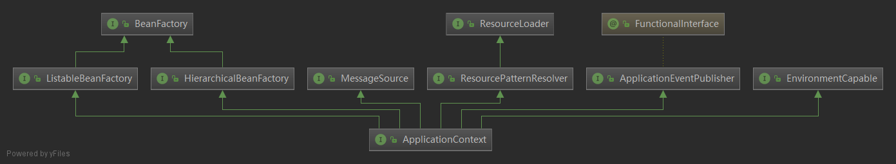
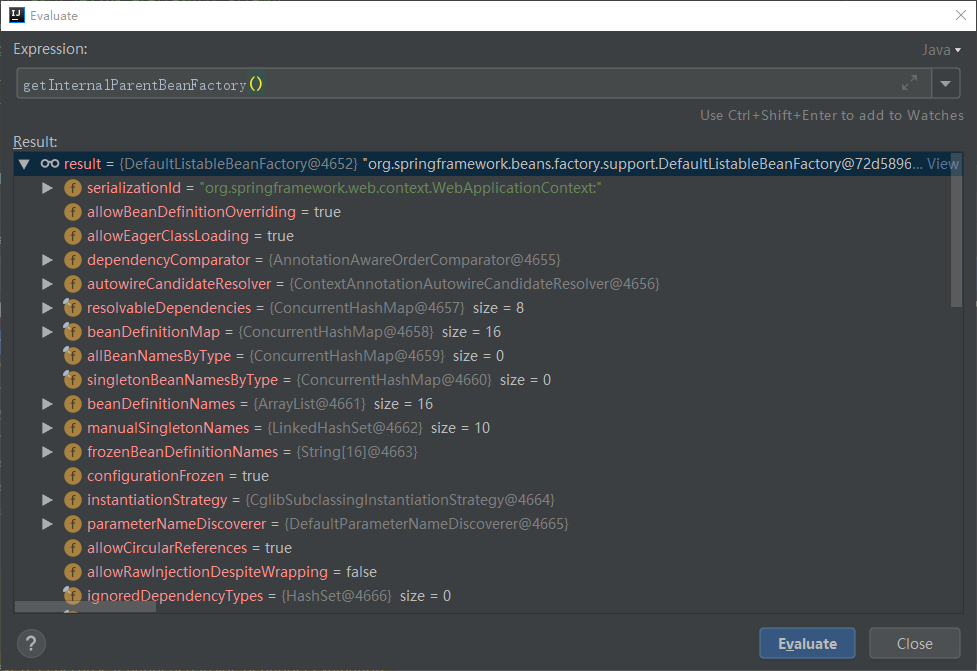
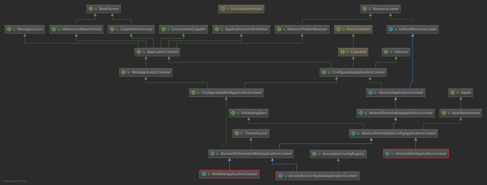
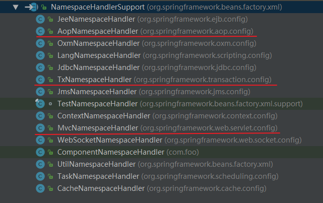

# AbstractApplicationContext#obtainFreshBeanFactory

---

# 一、入口

----

## 1.1 入口代码

```java
public void refresh() throws BeansException, IllegalStateException {
    synchronized (this.startupShutdownMonitor) {
        // Prepare this context for refreshing.
        prepareRefresh();
        // Tell the subclass to refresh the internal bean factory.
        ConfigurableListableBeanFactory beanFactory = obtainFreshBeanFactory();
        ///....
}
protected ConfigurableListableBeanFactory obtainFreshBeanFactory() {
    refreshBeanFactory();
    ConfigurableListableBeanFactory beanFactory = getBeanFactory();
    //...
    return beanFactory;
}
```


## 1.2 涉及到几个重要的类

DefaultListableBeanFactory 生成BeanFactory

BeanDefinitionParserDelegate 解析器代理类

NamespaceHandlerSupport 大部分解析器最终是通过它，将解析器注册到`NamespaceHandlerSupport`中，然后通过它的`parse`方法来调用具体的解析器的`parse`方法的

##　1.3 ApplicationContext继承关系



> ApplicationContext extends ListableBeanFactory
>
> ListableBeanFactory extends BeanFactory

所以，`ApplicationContext` 继承了 `BeanFactory`。

## 1.4 obtainFreshBeanFactory作用摘要

`obtainFreshBeanFactory`核心代码都在`refreshBeanFactory()`中，创建beanFactory和beanDefinition解析都在这个方法中了。而`refreshBeanFactory()`的核心代码就2个方法：**createBeanFactory **和 **loadBeanDefinitions** 。分析`obtainFreshBeanFactory`，也就是分析这2个方法的作用。

refresh()方法主要为IoC容器Bean的生命周期管理提供条件，Spring IoC容器载入Bean定义资源文件从其子类容器的refreshBeanFactory()方法启动。refresh()方法的作用是：在创建IoC容器前，如果已经有容器存在，则需要把已有的容器销毁和关闭，以保证在refresh之后使用的是新建立起来的IoC容器。refresh的作用类似于对IoC容器的重启，在新建立好的容器中对容器进行初始化，对Bean定义资源进行载入 

1、**创建beanFactory**(DefaultListableBeanFactory。在创建beanFactory时，入参是父类：`ApplicationContext`，如果父类是`ConfigurableApplicationContext`类型，则从中取了出`BeanFactory`(`getBeanFactory()`)，并保存父类的`BeanFactory`，为以后的`doGetBean`使用，当当前`BeanFactory`取不到bean时，会去父类`BeanFactory`中尝试去取。

2、， `BeanDefinitionParserDelegate`是解析器的代理类，由`BeanDefinitionParserDelegate#parseCustomElement`调用`NamespaceHandlerSupport.init()`方法**注册解析器**，`NamespaceHandlerSupport.parse()`方法调用具体的**解析器进行解析**，包括`<annotation-driven>`、`<aop:config>`等等。

AbstractXmlApplicationContext->XmlBeanDefinitionReader->DefaultBeanDefinitionDocumentReader->BeanDefinitionParserDelegate->NamespaceHandlerSupport

# 二、refreshBeanFactory

---

AbstractApplicationContext的继承类中有2个类实现 了refreshBeanFactory方法：GenericApplicationContext、AbstractRefreshableApplicationContext

## 2.1 GenericApplicationContext#refreshBeanFactory

这个GenericApplicationContext#refreshBeanFactory什么也不做

```java
/**
 * Do nothing: We hold a single internal BeanFactory and rely on callers
 * to register beans through our public methods (or the BeanFactory's).
 * @see #registerBeanDefinition
 */
@Override
protected final void refreshBeanFactory() throws IllegalStateException {
    //....
    this.beanFactory.setSerializationId(getId());
}
```

下面重点看一下 AbstractRefreshableApplicationContext#refreshBeanFactory

## 2.2. AbstractRefreshableApplicationContext#refreshBeanFactory

里面就2个重要的方法： 

* **createBeanFactory ** 创建beanFactory(DefaultListableBeanFactory。
* **loadBeanDefinitions** 加载beanDefinition。加载xml，创建xml和注解的解析器代理类，由它去调用各解析器完成beanDefiniton的解析和注册


下面主要分析这2个方法

```java
/**
 * This implementation performs an actual refresh of this context's underlying
 * bean factory, shutting down the previous bean factory (if any) and
 * initializing a fresh bean factory for the next phase of the context's lifecycle.
 */
@Override
protected final void refreshBeanFactory() throws BeansException {
    //如果beanFacotry存在，则删除
    if (hasBeanFactory()) {
        destroyBeans();
        closeBeanFactory();
    }
    try {
        DefaultListableBeanFactory beanFactory = createBeanFactory();
        beanFactory.setSerializationId(getId());
        customizeBeanFactory(beanFactory);
        loadBeanDefinitions(beanFactory);
        synchronized (this.beanFactoryMonitor) {
            this.beanFactory = beanFactory;
        }
    }
    catch (IOException ex) {
        throw new ApplicationContextException("I/O error parsing bean definition source for " + getDisplayName(), ex);
    }
}
```


### 2.2.1  createBeanFactory （创建beanFactory）

DefaultListableBeanFactory非常重要，里面存的beanDefinitionMap，所有xml，annotation解析的bean都会转成beanDefinition，存到里面。

创建beanFactory: DefaultListableBeanFactory，如果父类是DefaultListableBeanFactory类型，则从中取beanFactory做为入参。

```java
protected DefaultListableBeanFactory createBeanFactory() {
    //创建beanFactory: DefaultListableBeanFactory，如果父类是DefaultListableBeanFactory类型，则从中取beanFactory做为入参。
    return new DefaultListableBeanFactory(getInternalParentBeanFactory());
}
```

#### 2.2.1.1 AbstractApplicationContext#getInternalParentBeanFactory 

```java
protected BeanFactory getInternalParentBeanFactory() {
  return (getParent() instanceof ConfigurableApplicationContext ?
      ((ConfigurableApplicationContext) getParent()).getBeanFactory() : getParent());
}
```

##### **AbstractApplicationContext#getInternalParentBeanFactory()**

看是否是ConfigurableApplicationContext类型，如果是的话，从它的父类中取beanFactory。
如果不是，则取getParent()。

本地搭了一个springmvc的运行环境 ，第一次进来的时候： getInternalParentBeanFactory()=null
第二次进入的时候，值应该为：org.springframework.web.context.WebApplicationContext中getBeanFactory

```java
protected BeanFactory getInternalParentBeanFactory() {
  return (getParent() instanceof ConfigurableApplicationContext ?
      ((ConfigurableApplicationContext) getParent()).getBeanFactory() : getParent());
}
```



##### **DefaultListableBeanFactory**

在创建 DefaultListableBeanFactory 时，先创建AbstractAutowireCapableBeanFactory对象，将BeanNameAware、BeanFactoryAware、BeanClassLoaderAware放到ignoredDependencyInterfaces中(ignoreDependencyInterface的主要功能是忽略给定接口的自动装配功能)，最后保存父类的parentBeanFactory

 ignoreDependencyInterface的主要功能是忽略给定接口的自动装配功能。 

```java
public DefaultListableBeanFactory(@Nullable BeanFactory parentBeanFactory) {
    super(parentBeanFactory);
}
```

##### **AbstractAutowireCapableBeanFactory**

```java
/**
 * Create a new AbstractAutowireCapableBeanFactory with the given parent.
 * @param parentBeanFactory parent bean factory, or {@code null} if none
 */
public AbstractAutowireCapableBeanFactory(@Nullable BeanFactory parentBeanFactory) {
    this(); //创建AbstractAutowireCapableBeanFactory
    setParentBeanFactory(parentBeanFactory);
}
```

this() 创建AbstractAutowireCapableBeanFactory

 ignoreDependencyInterface的主要功能是忽略给定接口的自动装配功能。 

```java
/**
 * Create a new AbstractAutowireCapableBeanFactory.
 */
public AbstractAutowireCapableBeanFactory() {
    super();
    ignoreDependencyInterface(BeanNameAware.class);
    ignoreDependencyInterface(BeanFactoryAware.class);
    ignoreDependencyInterface(BeanClassLoaderAware.class);
}
```

### 2.2.2 loadBeanDefinitions

有3个类继承了AbstractRefreshableWebApplicationContext，实现了loadBeanDefinitions方法：

- **AbstractXmlApplicationContext** 是spring-context包下的，是org.springframework.context.ApplicationContext的实现类，通过org.springframework.beans.factory.xml.XmlBeanDefinitionReader解析配置文件xml中包含的bean。

- **AnnotationConfigWebApplicationContext** 是spring-web包下的，是WebApplicationContext的实现类。接受注解类做为输入：@Configuration、@Component、javax.inject注解，以及包扫描。对web环境来说，本质上等同于：org.springframework.context.support.GenericXmlApplicationContext

- **XmlWebApplicationContext** 是spring-web包下的，是WebApplicationContext的实现类。通过org.springframework.beans.factory.xml.XmlBeanDefinitionReader解析xml文件。对web环境来说，本质上等同于：org.springframework.context.support.GenericXmlApplicationContext

  



下面主要分析：AbstractXmlApplicationContext#loadBeanDefinitions

# 三、AbstractXmlApplicationContext#loadBeanDefinitions

---

从xml中加载bean definitions

## 3.1 AbstractXmlApplicationContext#loadBeanDefinitions

```java
@Override
protected void loadBeanDefinitions(DefaultListableBeanFactory beanFactory) throws BeansException, IOException {
    // Create a new XmlBeanDefinitionReader for the given BeanFactory.
    //创建XmlBeanDefinitionReader，即创建Bean读取器，并通过回调设置到容器中去，容器使用该读取器读取Bean定义资源
    XmlBeanDefinitionReader beanDefinitionReader = new XmlBeanDefinitionReader(beanFactory);

    // Configure the bean definition reader with this context's
    // resource loading environment.
    beanDefinitionReader.setEnvironment(this.getEnvironment());
    //为Bean读取器设置Spring资源加载器，AbstractXmlApplicationContext的  
	//祖先父类AbstractApplicationContext继承DefaultResourceLoader，因此，容器本身也是一个资源加载器
    beanDefinitionReader.setResourceLoader(this);
    //为Bean读取器设置SAX xml解析器  
    beanDefinitionReader.setEntityResolver(new ResourceEntityResolver(this));

    // Allow a subclass to provide custom initialization of the reader,
    // then proceed with actually loading the bean definitions.
    initBeanDefinitionReader(beanDefinitionReader);
    //Bean读取器真正实现加载的方法
    loadBeanDefinitions(beanDefinitionReader);
}

//Xml Bean读取器加载Bean定义资源
protected void loadBeanDefinitions(XmlBeanDefinitionReader reader) throws BeansException, IOException {
    //获取Bean定义资源的定位
    Resource[] configResources = getConfigResources();
    if (configResources != null) {
        //Xml Bean读取器调用其父类AbstractBeanDefinitionReader读取定位的Bean定义资源
        reader.loadBeanDefinitions(configResources);
    }
    //如果子类中获取的Bean定义资源定位为空，则获取FileSystemXmlApplicationContext构造方法中setConfigLocations方法设置的资源
    String[] configLocations = getConfigLocations();
    if (configLocations != null) {
        ////Xml Bean读取器调用其父类AbstractBeanDefinitionReader读取定位的Bean定义资源
        reader.loadBeanDefinitions(configLocations);
    }
}
```


`reader.loadBeanDefinitions(configResources);` 和 `reader.loadBeanDefinitions(configLocations);`其实看一个就行，最后会调用同一个方法：`XmlBeanDefinitionReader.loadBeanDefinitions` 或者 `PropertiesBeanDefinitionReader.loadBeanDefinitions `

下面分析先继承前面的调用顺序

## 3.2 AbstractBeanDefinitionReader#loadBeanDefinitions

```java
public int loadBeanDefinitions(String... locations) throws BeanDefinitionStoreException {
    Assert.notNull(locations, "Location array must not be null");
    int counter = 0;
    for (String location : locations) {
        counter += loadBeanDefinitions(location);
    }
    return counter;
}
public int loadBeanDefinitions(String location) throws BeanDefinitionStoreException {
    return loadBeanDefinitions(location, null);
}
```
## ３.３ AbstractBeanDefinitionReader#loadBeanDefinitions

```java
/**
 * Load bean definitions from the specified resource location.
 * <p>The location can also be a location pattern, provided that the
 * ResourceLoader of this bean definition reader is a ResourcePatternResolver.
 */
public int loadBeanDefinitions(String location, @Nullable Set<Resource> actualResources) throws BeanDefinitionStoreException {
	ResourceLoader resourceLoader = getResourceLoader();
	//......
	if (resourceLoader instanceof ResourcePatternResolver) {
		// Resource pattern matching available.
		try {
			Resource[] resources = ((ResourcePatternResolver) resourceLoader).getResources(location);
             //最后也会调loadBeanDefinitions(resource);
			int loadCount = loadBeanDefinitions(resources);
			if (actualResources != null) {
				for (Resource resource : resources) {
					actualResources.add(resource);
				}
			}
			return loadCount;
		}//....
	}
	else {
		// Can only load single resources by absolute URL.
		Resource resource = resourceLoader.getResource(location);
         //
		int loadCount = loadBeanDefinitions(resource);
		if (actualResources != null) {
			actualResources.add(resource);
		}
		return loadCount;
	}
}
```


`PropertiesBeanDefinitionReader`,`XmlBeanDefinitionReader`都继承了AbstractBeanDefinitionReader，实现了抽象方法`loadBeanDefinitions(Resource resource)`。

下面主要看一下 `XmlBeanDefinitionReader.loadBeanDefinitions`

# 四、XmlBeanDefinitionReader#loadBeanDefinitions

---

## 4.1 loadBeanDefinitions

```java
public int loadBeanDefinitions(Resource resource) throws BeanDefinitionStoreException {
    return loadBeanDefinitions(new EncodedResource(resource));
}
/**
 * Load bean definitions from the specified XML file.
 * @param encodedResource the resource descriptor for the XML file,
 * allowing to specify an encoding to use for parsing the file
 * @return the number of bean definitions found
 * @throws BeanDefinitionStoreException in case of loading or parsing errors
 */
public int loadBeanDefinitions(EncodedResource encodedResource) throws BeanDefinitionStoreException {
    Set<EncodedResource> currentResources = this.resourcesCurrentlyBeingLoaded.get();
    if (currentResources == null) {
        currentResources = new HashSet<>(4);
        this.resourcesCurrentlyBeingLoaded.set(currentResources);
    }//...
    try {
        InputStream inputStream = encodedResource.getResource().getInputStream();
        try {
            InputSource inputSource = new InputSource(inputStream);
            if (encodedResource.getEncoding() != null) {
                inputSource.setEncoding(encodedResource.getEncoding());
            }
            //加载beanDefinitions
            return doLoadBeanDefinitions(inputSource, encodedResource.getResource());
        }
        finally {
            inputStream.close();
        }
    }
    catch (IOException ex) {
        throw new BeanDefinitionStoreException(
            "IOException parsing XML document from " + encodedResource.getResource(), ex);
    }
    finally {
        currentResources.remove(encodedResource);
        if (currentResources.isEmpty()) {
            this.resourcesCurrentlyBeingLoaded.remove();
        }
    }
}
```


## 4.2 doLoadBeanDefinitions加载beanDefinitions

```java
/**
 * Actually load bean definitions from the specified XML file.
 */
protected int doLoadBeanDefinitions(InputSource inputSource, Resource resource)
		throws BeanDefinitionStoreException {
	try {
		Document doc = doLoadDocument(inputSource, resource);
		return registerBeanDefinitions(doc, resource);
	}//.....
}
```

`doLoadDocument`

```java
protected Document doLoadDocument(InputSource inputSource, Resource resource) throws Exception {
   return this.documentLoader.loadDocument(inputSource, getEntityResolver(), this.errorHandler,
         getValidationModeForResource(resource), isNamespaceAware());
}
```

## 4.3 registerBeanDefinitions注册BeanDefinitions

创建BeanDefinitionDocumentReader来注册bean，在BeanDefinitionDocumentReader通过创建解析器代理类，来解析和完成beanDefinition的注册。

```java
/**
 * Register the bean definitions contained in the given DOM document.
 * Called by {@code loadBeanDefinitions}.
 * <p>Creates a new instance of the parser class and invokes
 * {@code registerBeanDefinitions} on it.
 */
public int registerBeanDefinitions(Document doc, Resource resource) throws BeanDefinitionStoreException {
	BeanDefinitionDocumentReader documentReader = createBeanDefinitionDocumentReader();
	int countBefore = getRegistry().getBeanDefinitionCount();
	documentReader.registerBeanDefinitions(doc, createReaderContext(resource));
	return getRegistry().getBeanDefinitionCount() - countBefore;
}
```


# 五、DefaultBeanDefinitionDocumentReader

----

## 5.1 DefaultBeanDefinitionDocumentReader#registerBeanDefinitions

```java
/**
 * This implementation parses bean definitions according to the "spring-beans" XSD
 * (or DTD, historically).
 * <p>Opens a DOM Document; then initializes the default settings
 * specified at the {@code <beans/>} level; then parses the contained bean definitions.
 */
@Override
public void registerBeanDefinitions(Document doc, XmlReaderContext readerContext) {
	this.readerContext = readerContext;
	logger.debug("Loading bean definitions");
	Element root = doc.getDocumentElement();
	doRegisterBeanDefinitions(root);
}
```


## 5.2 doRegisterBeanDefinitions

```java
/**
 * Register each bean definition within the given root {@code <beans/>} element.
 */
@SuppressWarnings("deprecation")  // for Environment.acceptsProfiles(String...)
protected void doRegisterBeanDefinitions(Element root) {
	// Any nested <beans> elements will cause recursion in this method. In
	// order to propagate and preserve <beans> default-* attributes correctly,
	// keep track of the current (parent) delegate, which may be null. Create
	// the new (child) delegate with a reference to the parent for fallback purposes,
	// then ultimately reset this.delegate back to its original (parent) reference.
	// this behavior emulates a stack of delegates without actually necessitating one.
	BeanDefinitionParserDelegate parent = this.delegate;
    //创建解析器代理类
	this.delegate = createDelegate(getReaderContext(), root, parent);
//....

	preProcessXml(root);
	parseBeanDefinitions(root, this.delegate);
	postProcessXml(root);

	this.delegate = parent;
}
```

# 六、BeanDefinitionParserDelegate 创建解析器代理类

-----

## 6.1 BeanDefinitionParserDelegate#createDelegate

创建BeanDefinitionParserDelegate，解析器都是通过BeanDefinitionParserDelegate来代理执行的。

填充给定的DocumentDefaultsDefinition实例，用默认的lazy-init, autowire, dependency check settings, init-method, destroy-method and merge 等设置。

通过`namespaceHandler.init();`注册解析器

```java
protected BeanDefinitionParserDelegate createDelegate(
      XmlReaderContext readerContext, Element root, @Nullable BeanDefinitionParserDelegate parentDelegate) {

   BeanDefinitionParserDelegate delegate = new BeanDefinitionParserDelegate(readerContext);
   //填充给定的DocumentDefaultsDefinition实例，用默认的lazy-init, autowire, dependency check settings, init-method, destroy-method and merge 等设置。
   delegate.initDefaults(root, parentDelegate);
   return delegate;
}
```

## 6.2 parseBeanDefinitions

```java
/**
 * Parse the elements at the root level in the document:
 * "import", "alias", "bean".
 * @param root the DOM root element of the document
 */
protected void parseBeanDefinitions(Element root, BeanDefinitionParserDelegate delegate) {
   if (delegate.isDefaultNamespace(root)) {
      NodeList nl = root.getChildNodes();
      for (int i = 0; i < nl.getLength(); i++) {
         Node node = nl.item(i);
         if (node instanceof Element) {
            Element ele = (Element) node;
            if (delegate.isDefaultNamespace(ele)) {
               //默认标签解析:<bean><import>等
               parseDefaultElement(ele, delegate);
            }
            else {
               //自定义标签解析，看名字是自定义标签解析器，其实不止是解析自定义标签，还解析<annotation-driven>、<aop:config>等。
               delegate.parseCustomElement(ele);
            }
         }
      }
   }
   else {
      delegate.parseCustomElement(root);
   }
}
```


## 6.3 parseDefaultElement这个8章单独分析，解析bean标签 


```java
private void parseDefaultElement(Element ele, BeanDefinitionParserDelegate delegate) {
   if (delegate.nodeNameEquals(ele, IMPORT_ELEMENT)) {
      //处理import标签类，Parse an "import" element and load the bean definitions 
      //节点是<Import>导入元素，进行导入解析 
      importBeanDefinitionResource(ele);
   }
   else if (delegate.nodeNameEquals(ele, ALIAS_ELEMENT)) {
      //Process the given alias element, registering the alias with the registry.
      //节点是<Alias>别名元素 
      processAliasRegistration(ele);
   }
   else if (delegate.nodeNameEquals(ele, BEAN_ELEMENT)) {
      //普通的<Bean>元素，下面重点分析
      processBeanDefinition(ele, delegate);
   }
   else if (delegate.nodeNameEquals(ele, NESTED_BEANS_ELEMENT)) {
      // recurse 循环调用
      doRegisterBeanDefinitions(ele);
   }
}
```


## 6.4 parseCustomElement 调用NamespaceHandler#init()，进行解析器注册并进行解析，包括xml，annotation等。

parseCustomElement是自定义解析器。从代码中也可以看到，自定义解析器也是需要继承NamespaceHandler的。

自定义标签解析，看名字是自定义标签解析器，其实不止是解析自定义标签，还解析<annotation-driven>、`<aop:config>`等。

```java
@Nullable
public BeanDefinition parseCustomElement(Element ele) {
    return parseCustomElement(ele, null);
}

@Nullable
public BeanDefinition parseCustomElement(Element ele, @Nullable BeanDefinition containingBd) {
   String namespaceUri = getNamespaceURI(ele);
   if (namespaceUri == null) {
      return null;
   }
   //resolve方法中， 注册解析器 <--------------
   NamespaceHandler handler = this.readerContext.getNamespaceHandlerResolver().resolve(namespaceUri);
   if (handler == null) {
      error("Unable to locate Spring NamespaceHandler for XML schema namespace [" + namespaceUri + "]", ele);
      return null;
   }
    //调用解析器进行解析 <--------------------
   return handler.parse(ele, new ParserContext(this.readerContext, this, containingBd));
}
```

resolve方法中，通过

> namespaceHandler.init();

注册各种解析器

```java
public NamespaceHandler resolve(String namespaceUri) {
   Map<String, Object> handlerMappings = getHandlerMappings();
   Object handlerOrClassName = handlerMappings.get(namespaceUri);
   if (handlerOrClassName == null) {
      return null;
   }
   else if (handlerOrClassName instanceof NamespaceHandler) {
      return (NamespaceHandler) handlerOrClassName;
   }
   else {
      String className = (String) handlerOrClassName;
      try {
         Class<?> handlerClass = ClassUtils.forName(className, this.classLoader);
         //... 
         NamespaceHandler namespaceHandler = (NamespaceHandler) BeanUtils.instantiateClass(handlerClass);
         //注册解析器 <----------
         namespaceHandler.init();
         handlerMappings.put(namespaceUri, namespaceHandler);
         return namespaceHandler;
      }//...
   }
}
```

# 七、NamespaceHandlerSupport

----

## 7.1 parse

去除自定义解析器，来看一下其它解析器是怎么被调用解析的。

其它大部分解析器是通过NamespaceHandlerSupport来统一调用，通过init方法，把各种解析器放到一个map中去，然后在调用NamespaceHandlerSupport#parse时，从map中取出相应的解析器，然后调用解析器的parse方法进行解析 。解析成BeanDefinition最后放到DefaultListableBeanFactory的beanDefinitionMap 中去。

```java
/**
 * Parses the supplied {@link Element} by delegating to the {@link BeanDefinitionParser} that is
 * registered for that {@link Element}.
 */
@Override
@Nullable
public BeanDefinition parse(Element element, ParserContext parserContext) {
   BeanDefinitionParser parser = findParserForElement(element, parserContext);
   //相应的解析器解析bean，注册beanDefinition，保存到beanFactory中去。 
   return (parser != null ? parser.parse(element, parserContext) : null);
}

/**
 * 存储所有的BeanDefinitionParser解析器
 */
private final Map<String, BeanDefinitionParser> parsers = new HashMap<>();

private BeanDefinitionParser findParserForElement(Element element, ParserContext parserContext) {
    String localName = parserContext.getDelegate().getLocalName(element);
    //Map<String, BeanDefinitionParser> parsers里面存放着各种解析器
    BeanDefinitionParser parser = this.parsers.get(localName);
    if (parser == null) {
        parserContext.getReaderContext().fatal(
            "Cannot locate BeanDefinitionParser for element [" + localName + "]", element);
    }
    return parser;
}
```

## 7.2 解析器

Map<String, BeanDefinitionParser> parsers里面存放着各种解析器。NamespaceHandlerSupport实现类，图如下所示。



在`NamespaceHandlerSupport`中提供`registerBeanDefinitionParser`方法，用来注册解析器，将它们在注册到map： parsers中去。

```java
protected final void registerBeanDefinitionParser(String elementName, BeanDefinitionParser parser) {
   this.parsers.put(elementName, parser);
}
```

## 7.3 解析器初始化通过init注册

拿AopNamespaceHandler来说，上面已经提到，`namespaceHandler.init();`调用方法时 ，对解析器进行注册，保存到map中。

```java
public class AopNamespaceHandler extends NamespaceHandlerSupport {

   /**
    * Register the {@link BeanDefinitionParser BeanDefinitionParsers} for the
    * '{@code config}', '{@code spring-configured}', '{@code aspectj-autoproxy}'
    * and '{@code scoped-proxy}' tags.
    */
   @Override
   public void init() {
      // In 2.0 XSD as well as in 2.1 XSD.
      registerBeanDefinitionParser("config", new ConfigBeanDefinitionParser());
      registerBeanDefinitionParser("aspectj-autoproxy", new AspectJAutoProxyBeanDefinitionParser());
      registerBeanDefinitionDecorator("scoped-proxy", new ScopedProxyBeanDefinitionDecorator());

      // Only in 2.0 XSD: moved to context namespace as of 2.1
      registerBeanDefinitionParser("spring-configured", new SpringConfiguredBeanDefinitionParser());
   }

}
```

至于真正的解析

>parser.parse(element, parserContext)

就看各解析器是怎么实现 parse方法了。交给各解析器去处理了。在解析过程中，会各解析器，会将beanDefinition注册到DefaultListableBeanFactory的beanDefinitionMap 中去。

## 7.4 调用栈断点

### 7.4.1  MvcNamespaceHandler

`AnnotationDrivenBeanDefinitionParser`负责处理` <annotation-driven/>`标签

```java
public class MvcNamespaceHandler extends NamespaceHandlerSupport {

   @Override
   public void init() {
      //负责处理 <annotation-driven/>标签
      registerBeanDefinitionParser("annotation-driven", new AnnotationDrivenBeanDefinitionParser());
      registerBeanDefinitionParser("default-servlet-handler", new DefaultServletHandlerBeanDefinitionParser());
      registerBeanDefinitionParser("interceptors", new InterceptorsBeanDefinitionParser());
      registerBeanDefinitionParser("resources", new ResourcesBeanDefinitionParser());
      registerBeanDefinitionParser("view-controller", new ViewControllerBeanDefinitionParser());
      registerBeanDefinitionParser("redirect-view-controller", new ViewControllerBeanDefinitionParser());
      registerBeanDefinitionParser("status-controller", new ViewControllerBeanDefinitionParser());
      registerBeanDefinitionParser("view-resolvers", new ViewResolversBeanDefinitionParser());
      registerBeanDefinitionParser("tiles-configurer", new TilesConfigurerBeanDefinitionParser());
      registerBeanDefinitionParser("freemarker-configurer", new FreeMarkerConfigurerBeanDefinitionParser());
      registerBeanDefinitionParser("groovy-configurer", new GroovyMarkupConfigurerBeanDefinitionParser());
      registerBeanDefinitionParser("script-template-configurer", new ScriptTemplateConfigurerBeanDefinitionParser());
      registerBeanDefinitionParser("cors", new CorsBeanDefinitionParser());
   }
}
```


`MvcNamespaceHandler.init()`什么时候调用的呢？断点后，可以看到调用栈，其实还是`BeanDefinitionParserDelegate#parseCustomElement`


### 7.4.2 AopNamespaceHandler

看`AopNamespaceHandler.init()`注册解析器，也是通过`BeanDefinitionParserDelegate#parseCustomElement`注册的。


**注意：在解析`<Bean>`元素过程中没有创建和实例化`Bean`对象，只是创建了Bean对象的定义类`BeanDefinition`，将`<Bean>`元素中的配置信息设置到`BeanDefinition`中作为记录，当依赖注入时才使用这些记录信息创建和实例化具体的Bean对象。 **


至于AOP是怎么解析的，参见：[ ConfigBeanDefinitionParser](https://gitee.com/paincupid/IT_note/blob/master/spring-note/spring-aop/aop-ConfigBeanDefinitionParser%E8%A7%A3%E6%9E%90%E5%99%A8.md)

事务以及怎么解析@Transactional ： [TxAdviceBeanDefinitionParser](https://gitee.com/paincupid/IT_note/blob/master/spring-note/spring-transaction/spring-transaction-invoke-chain.md)


# 八、BeanDefinitionParserDelegate#parseDefaultElement解析`<bean>`标签

```java
/**
 * doLoadBeanDefinitions(InputSource inputSource, Resource resource)
 * and registering it with the registry.
 */
protected void processBeanDefinition(Element ele, BeanDefinitionParserDelegate delegate) {
   //8.1 初始解析<bean>标签内容
   BeanDefinitionHolder bdHolder = delegate.parseBeanDefinitionElement(ele);
   if (bdHolder != null) {
      //解析JDBC,aop,tx,mvc等标签 
      bdHolder = delegate.decorateBeanDefinitionIfRequired(ele, bdHolder);
      try {
         // Register the final decorated instance.
         BeanDefinitionReaderUtils.registerBeanDefinition(bdHolder, getReaderContext().getRegistry());
      }//....
      // Send registration event.
      getReaderContext().fireComponentRegistered(new BeanComponentDefinition(bdHolder));
   }
}
```


## 8.1 BeanDefinitionParserDelegate#parseBeanDefinitionElement

```java
public BeanDefinitionHolder parseBeanDefinitionElement(Element ele) {
   return parseBeanDefinitionElement(ele, null);
}
```
**BeanDefinitionParserDelegate#parseBeanDefinitionElement**

解析Bean定义资源文件中的`<Bean>`元素，这个方法中主要处理`<Bean>`元素的id，name和别名属性

```java
/**
 * Parses the supplied {@code <bean>} element. May return {@code null}
 * if there were errors during parse. Errors are reported to the
 * {@link org.springframework.beans.factory.parsing.ProblemReporter}.
 */
@Nullable
public BeanDefinitionHolder parseBeanDefinitionElement(Element ele, @Nullable BeanDefinition containingBean) {
   String id = ele.getAttribute(ID_ATTRIBUTE);//获取<Bean>元素中的id属性值
   String nameAttr = ele.getAttribute(NAME_ATTRIBUTE);//获取<Bean>元素中的name属性值
   //获取<Bean>元素中的alias属性值 
   List<String> aliases = new ArrayList<>();
   if (StringUtils.hasLength(nameAttr)) {
      String[] nameArr = StringUtils.tokenizeToStringArray(nameAttr, MULTI_VALUE_ATTRIBUTE_DELIMITERS);
      aliases.addAll(Arrays.asList(nameArr));
   }

   String beanName = id;
   //如果<Bean>元素中没有配置id属性时，将别名中的第一个值赋值给beanName 
   if (!StringUtils.hasText(beanName) && !aliases.isEmpty()) {
      beanName = aliases.remove(0);
      //...
   }
   //检查<Bean>元素所配置的id或者name的唯一性，containingBean标识<Bean>元素中是否包含子<Bean>元素
   if (containingBean == null) {
      checkNameUniqueness(beanName, aliases, ele);
   }
   //详细对<Bean>元素中配置的Bean定义进行解析的地方	
   AbstractBeanDefinition beanDefinition = parseBeanDefinitionElement(ele, beanName, containingBean);
   if (beanDefinition != null) {
      if (!StringUtils.hasText(beanName)) {
         try {
            if (containingBean != null) {
               beanName = BeanDefinitionReaderUtils.generateBeanName(
                     beanDefinition, this.readerContext.getRegistry(), true);
            }
            else {
               beanName = this.readerContext.generateBeanName(beanDefinition);
               // Register an alias for the plain bean class name, if still possible,
               // if the generator returned the class name plus a suffix.
               // This is expected for Spring 1.2/2.0 backwards compatibility.
               String beanClassName = beanDefinition.getBeanClassName();
               if (beanClassName != null &&
                     beanName.startsWith(beanClassName) && beanName.length() > beanClassName.length() &&
                     !this.readerContext.getRegistry().isBeanNameInUse(beanClassName)) {
                  aliases.add(beanClassName);
               }
            }
            if (logger.isDebugEnabled()) {
               logger.debug("Neither XML 'id' nor 'name' specified - " +
                     "using generated bean name [" + beanName + "]");
            }
         }
         catch (Exception ex) {
            error(ex.getMessage(), ele);
            return null;
         }
      }
      String[] aliasesArray = StringUtils.toStringArray(aliases);
      return new BeanDefinitionHolder(beanDefinition, beanName, aliasesArray);
   }

   return null;
}
```

**BeanDefinitionParserDelegate#parseBeanDefinitionElement**

详细对`<Bean>`元素中配置的Bean定义其他属性进行解析，由于上面的方法中已经对`Bean的id、name和别名等属性进行了处理，该方法中主要处理除这三个以外的其他属性数据：lookup-method、replaced-method、Constructor、property、qualifier属性进行了解析。

```java
/**
 * Parse the bean definition itself, without regard to name or aliases. May return
 * {@code null} if problems occurred during the parsing of the bean definition.
 */
@Nullable
public AbstractBeanDefinition parseBeanDefinitionElement(
      Element ele, String beanName, @Nullable BeanDefinition containingBean) {
   //...
   try {
      AbstractBeanDefinition bd = createBeanDefinition(className, parent);

      parseBeanDefinitionAttributes(ele, beanName, containingBean, bd);
      bd.setDescription(DomUtils.getChildElementValueByTagName(ele, DESCRIPTION_ELEMENT));

      parseMetaElements(ele, bd);
      //对<Bean>元素的lookup-method属性解析 
      parseLookupOverrideSubElements(ele, bd.getMethodOverrides());
      //对<Bean>元素的replaced-method属性解析 
      parseReplacedMethodSubElements(ele, bd.getMethodOverrides());
      //解析<Bean>元素的构造方法设置
      parseConstructorArgElements(ele, bd);
      //解析<Bean>元素的<property>设置 
      parsePropertyElements(ele, bd);
      //解析<Bean>元素的qualifier属性 
      parseQualifierElements(ele, bd);
      //为当前解析的Bean设置所需的资源和依赖对象
      bd.setResource(this.readerContext.getResource());
      bd.setSource(extractSource(ele));
      return bd;
   }//....
   return null;
}
```


