# springmvc源码分析


spring版本: 5.0.0.RELEASE

jdk: 1.8

更多源码分析：[https://github.com/arthur-dy-lee/arthur-dy-lee-note](https://github.com/arthur-dy-lee/arthur-dy-lee-note)


[TOC]

# 一、servlet生命周期

----

在分析spring源码前，先看下servlet，spring-mvc也是对serlvet的封装。


## Servlet生命周期简述


（1）加载和实例化
当Servlet容器启动或客户端发送一个请求时，Servlet容器会查找内存中是否存在该Servlet实例，若存在，则直接读取该实例响应请求；如果不存在，就创建一个Servlet实例。

（2） 初始化

实例化后，Servlet容器将调用Servlet的init()方法进行初始化（一些准备工作或资源预加载工作）。

 在一个Servlet的生命周期中，init方法只会被执行一次，之后无论用户执行多少次请求，都不会在调用该方法。 

 关于init方法的执行时机，有两种方式可选，一般的是在服务器启动后第一个用户请求改Servlet是调用，你也可以设置该Servlet在服务器启动后自动执行。
        
（3）服务

初始化后，Servlet处于能响应请求的就绪状态。当接收到客户端请求时，调用service()的方法处理客户端请求，HttpServlet的service()方法会根据不同的请求 转调不同的doXxx()方法。

（4）销毁

当Servlet容器关闭时，Servlet实例也随时销毁。其间，Servlet容器会调用Servlet 的destroy()方法去判断该Servlet是否应当被释放（或回收资源）。


## 调用过程的详细步骤

 

步骤： 
1：Web Client向Servlet容器(tomcat)发出Http请求 
2：Servlet容器接收Web Client的请求 
3：Servlet容器创建一个HttpRequest对象，将Web Client请求的信息封装到这个对象中。 
4：Servlet容器创建一个HttpResponse对象 
5：Servlet容器调用HttpServlet对象的service方法，把HttpRequest对象与HttpResponse对象作为参数传递给HttpServlet对象。 
6：HttpServlet调用HttpRequest对象的有关方法，获取Http请求信息 
7：HttpServlet调用HttpResponse对象的有关方法，生成响应数据 
8：Servlet容器把HttpServlet的响应结果传


## 自定义servlet


```xml
<!-- 注册servlet -->
  <servlet>
      <servlet-name>loginServlet</servlet-name>
      <servlet-class>com.azhi.servlet.LoginServlet</servlet-class>
  </servlet>

  <!-- 映射servlet -->
  <servlet-mapping>
      <servlet-name>loginServlet</servlet-name>
      <url-pattern>/login</url-pattern>
  </servlet-mapping>
```

一般自定义的servlet要继承`HttpServlet`，并重写`doGet()`和`doPost()`方法

```java
import java.io.IOException;

import javax.servlet.ServletException;
import javax.servlet.http.HttpServlet;
import javax.servlet.http.HttpServletRequest;
import javax.servlet.http.HttpServletResponse;
public class LoginServlet extends HttpServlet{
    private static final long serialVersionUID = 1L;
    
    @Override
    protected void doGet(HttpServletRequest req, HttpServletResponse resp) throws ServletException, IOException {
        System.out.println("doGet");
    }
    
    @Override
    protected void doPost(HttpServletRequest req, HttpServletResponse resp) throws ServletException, IOException {
        System.out.println("doPost");
    }

}
```

# 二、流程总述

--------


## **Spring工作流程描述**

​      1. 用户向服务器发送请求，请求被Spring 前端控制Servelt DispatcherServlet捕获；

​      2. DispatcherServlet对请求URL进行解析，得到请求资源标识符（URI）。然后根据该URI，调用HandlerMapping获得该Handler配置的所有相关的对象（包括Handler对象以及Handler对象对应的拦截器），最后以HandlerExecutionChain对象的形式返回；

​      3. DispatcherServlet 根据获得的Handler，选择一个合适的HandlerAdapter。（**附注**：如果成功获得HandlerAdapter后，此时将开始执行拦截器的preHandler(...)方法）

​       4.  提取Request中的模型数据，填充Handler入参，开始执行Handler（Controller)。 在填充Handler的入参过程中，根据你的配置，Spring将帮你做一些额外的工作：

​      HttpMessageConveter： 将请求消息（如Json、xml等数据）转换成一个对象，将对象转换为指定的响应信息

​      数据转换：对请求消息进行数据转换。如String转换成Integer、Double等

​      数据根式化：对请求消息进行数据格式化。 如将字符串转换成格式化数字或格式化日期等

​      数据验证： 验证数据的有效性（长度、格式等），验证结果存储到BindingResult或Error中

​      5.  Handler执行完成后，向DispatcherServlet 返回一个ModelAndView对象；

​      6.  根据返回的ModelAndView，选择一个适合的ViewResolver（必须是已经注册到Spring容器中的ViewResolver)返回给DispatcherServlet ；

​      7. ViewResolver 结合Model和View，来渲染视图

​      8. 将渲染结果返回给客户端。


## 比较重要的几个类

### HandlerMapping

所有的URL都由对应的处理程序处理，由此，Spring可以匹配传入的HTTP请求和所加注解配置的controller的方法。 

HandlerMapping负责映射用户的URL和对应的处理类，HandlerMapping并没有规定这个URL与应用的处理类如何映射，在HandlerMapping接口中只定义了根据一个URL必须返回一个由HandlerExecutionChain代表的处理链，我们可以在这个处理链中添加任意的HandlerAdapter实例来处理这个URL对应的请求。


### HandlerAdapter

mapping只是匹配controller，而执行controller还是需要adapter。

HandlerAdapter主要处理方法参数、相关注解、数据绑定、消息转换、返回值、调用视图解析器等等。

 HandlerAdapter用于调用处理器方法,并且为处理器方法提供参数解析、返回值处理等适配工作,使使用者专心于业务逻辑的实现。

org.springframework.web.servlet.HandlerAdapter接口，它只有3种方法  

- **boolean supports(Object handler)**:检查传入参数的对象是否可以由此适配器处理
- **ModelAndView handle(HttpServletRequest request, HttpServletResponse response, Object handler)** : 将请求翻译成视图。
- **long getLastModified(HttpServletRequest request, Object handler)**:返回给定HttpServletRequest的最后修改日期，以毫秒为单位。


### ViewResolver

`ViewResolver`和`View`。`ViewResolver`的主要作用是把一个逻辑上的视图名称解析为一个真正的视图，SpringMVC中用于把`View`对象呈现给客户端的是`View`对象本身，而`ViewResolver`只是把逻辑视图名称解析为对象的`View`对象。`View`接口的主要作用是用于处理视图，然后返回给客户端。


### View

SpringMVC中用于把View对象呈现给客户端的 是View对象本身，而ViewResolver只是把逻辑视图名称解析为对象的View对象。View接口的主要 作用是用于处理视图，然后返回给客户端。 


### ModelAndView 

使用ModelAndView类用来存储处理完后的结果数据，以及显示该数据的视图。从名字上看ModelAndView中的Model代表模型，View代表视图，这个名字就很好地解释了该类的作用。业务处理器调用模型层处理完用户请求后，把结果数据存储在该类的model属性中，把要返回的视图信息存储在该类的view属性中，然后让该ModelAndView返回该Spring MVC框架。


## 调用springmvc cotroller的堆栈

请求controller过程

```txt
listPerson:22, PersonController (arthur.dy.lee.controller)
invoke0:-1, NativeMethodAccessorImpl (sun.reflect)
invoke:62, NativeMethodAccessorImpl (sun.reflect)
invoke:43, DelegatingMethodAccessorImpl (sun.reflect)
invoke:497, Method (java.lang.reflect)
doInvoke:209, InvocableHandlerMethod (org.springframework.web.method.support)
invokeForRequest:136, InvocableHandlerMethod (org.springframework.web.method.support)
invokeAndHandle:102, ServletInvocableHandlerMethod (org.springframework.web.servlet.mvc.method.annotation)
invokeHandlerMethod:871, RequestMappingHandlerAdapter (org.springframework.web.servlet.mvc.method.annotation)
handleInternal:777, RequestMappingHandlerAdapter (org.springframework.web.servlet.mvc.method.annotation)
handle:87, AbstractHandlerMethodAdapter (org.springframework.web.servlet.mvc.method)
doDispatch:991, DispatcherServlet (org.springframework.web.servlet)
doService:925, DispatcherServlet (org.springframework.web.servlet)
processRequest:978, FrameworkServlet (org.springframework.web.servlet)
doGet:870, FrameworkServlet (org.springframework.web.servlet)
service:621, HttpServlet (javax.servlet.http)
service:855, FrameworkServlet (org.springframework.web.servlet)
service:728, HttpServlet (javax.servlet.http)
```


## DispatcherServlet调用前的准备工作

在tomcat的类： ApplicationFilterChain.internalDoFilter 调用的是`HttpServlet.service()`，DispatcherServlet继承了`DispatcherServlet`，自己本身并没有`service(ServletRequest req, ServletResponse res)`方法，所以会调用`HttpServlet.service()`。

 HttpServlet.service(ServletRequest req, ServletResponse res)`，注意，此时的入参是`ServletRequest`和`ServletResponse`，然后在方法中会把`ServletRequest`和`ServletResponse`转成`HttpServletRequest`和`HttpServletResponse`，然后调用的也是FrameworkServlet.service()`方法，但入参不同：`protected void service(HttpServletRequest request, HttpServletResponse response)`，然后在方法中调用`super.service(request, response);` ，又成了调用父类`HttpServlet`的service()方法：`protected void service(HttpServletRequest req, HttpServletResponse resp)`。

如栈中所示，调用顺序如下：

1、HttpServlet#service(ServletRequest req, ServletResponse res)

2、FrameworkServlet#service(HttpServletRequest request, HttpServletResponse response)

3、HttpServlet#service(HttpServletRequest req, HttpServletResponse resp)

4、FrameworkServlet#doGet

5、FrameworkServlet#processRequest

6、DispatcherServlet#doService

7、DispatcherServlet#doDispatch

# 三、DispatcherServlet
----------

## DispatcherServlet继承关系

也可以看到`DispatcherServlet`继承了`HttpServlet`

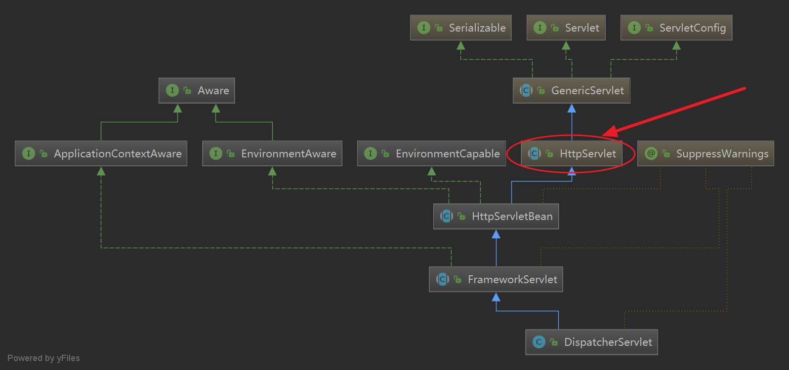


## 初始化

在spring容器启动时，在初始化容器后，会初始后以下内容：

```java
protected void initStrategies(ApplicationContext context) {
   initMultipartResolver(context);
   initLocaleResolver(context);
   initThemeResolver(context);
   initHandlerMappings(context);
   initHandlerAdapters(context);
   initHandlerExceptionResolvers(context);
   initRequestToViewNameTranslator(context);
   initViewResolvers(context);
   initFlashMapManager(context);
}
```

在初始化`initHandlerMappings()`时，属性`List<HandlerMapping>  handlerMappings`中3个`handlerMapping`:

`org.springframework.web.servlet.mvc.method.annotation.RequestMappingHandlerMapping`
`org.springframework.web.servlet.handler.BeanNameUrlHandlerMapping`
`org.springframework.web.servlet.handler.SimpleUrlHandlerMapping`


## 调用过程 
### DispatcherServlet#doService

```java
/**
 * Exposes the DispatcherServlet-specific request attributes and delegates to {@link #doDispatch}
 * for the actual dispatching.
 */
@Override
protected void doService(HttpServletRequest request, HttpServletResponse response) throws Exception {
   if (logger.isDebugEnabled()) {
      String resumed = WebAsyncUtils.getAsyncManager(request).hasConcurrentResult() ? " resumed" : "";
      logger.debug("DispatcherServlet with name '" + getServletName() + "'" + resumed +
            " processing " + request.getMethod() + " request for [" + getRequestUri(request) + "]");
   }

   // Keep a snapshot of the request attributes in case of an include,
   // to be able to restore the original attributes after the include.
   Map<String, Object> attributesSnapshot = null;
   if (WebUtils.isIncludeRequest(request)) {
      attributesSnapshot = new HashMap<>();
      Enumeration<?> attrNames = request.getAttributeNames();
      while (attrNames.hasMoreElements()) {
         String attrName = (String) attrNames.nextElement();
         if (this.cleanupAfterInclude || attrName.startsWith(DEFAULT_STRATEGIES_PREFIX)) {
            attributesSnapshot.put(attrName, request.getAttribute(attrName));
         }
      }
   }

   // Make framework objects available to handlers and view objects.
   request.setAttribute(WEB_APPLICATION_CONTEXT_ATTRIBUTE, getWebApplicationContext());
   request.setAttribute(LOCALE_RESOLVER_ATTRIBUTE, this.localeResolver);
   request.setAttribute(THEME_RESOLVER_ATTRIBUTE, this.themeResolver);
   request.setAttribute(THEME_SOURCE_ATTRIBUTE, getThemeSource());

   if (this.flashMapManager != null) {
      FlashMap inputFlashMap = this.flashMapManager.retrieveAndUpdate(request, response);
      if (inputFlashMap != null) {
         request.setAttribute(INPUT_FLASH_MAP_ATTRIBUTE, Collections.unmodifiableMap(inputFlashMap));
      }
      request.setAttribute(OUTPUT_FLASH_MAP_ATTRIBUTE, new FlashMap());
      request.setAttribute(FLASH_MAP_MANAGER_ATTRIBUTE, this.flashMapManager);
   }

   try {
      doDispatch(request, response); // 最主要的作用是让doDispatch去执行真正的分发 <--------
   }
   finally {
      if (!WebAsyncUtils.getAsyncManager(request).isConcurrentHandlingStarted()) {
         // Restore the original attribute snapshot, in case of an include.
         if (attributesSnapshot != null) {
            restoreAttributesAfterInclude(request, attributesSnapshot);
         }
      }
   }
}
```


###  **DispatcherServlet#doDispatch**


```java
/**
 * Process the actual dispatching to the handler.
 * <p>The handler will be obtained by applying the servlet's HandlerMappings in order.
 * The HandlerAdapter will be obtained by querying the servlet's installed HandlerAdapters
 * to find the first that supports the handler class.
 * <p>All HTTP methods are handled by this method. It's up to HandlerAdapters or handlers
 * themselves to decide which methods are acceptable.
 * @param request current HTTP request
 * @param response current HTTP response
 * @throws Exception in case of any kind of processing failure
 */
protected void doDispatch(HttpServletRequest request, HttpServletResponse response) throws Exception {
   HttpServletRequest processedRequest = request;
   HandlerExecutionChain mappedHandler = null;
   boolean multipartRequestParsed = false;

   WebAsyncManager asyncManager = WebAsyncUtils.getAsyncManager(request);

   try {
      ModelAndView mv = null;
      Exception dispatchException = null;

      try {
         processedRequest = checkMultipart(request);
         multipartRequestParsed = (processedRequest != request);

         // Determine handler for the current request.
         mappedHandler = getHandler(processedRequest); //<------- 1
         if (mappedHandler == null) {
            noHandlerFound(processedRequest, response);
            return;
         }

         // Determine handler adapter for the current request.
         HandlerAdapter ha = getHandlerAdapter(mappedHandler.getHandler());//<------- 2

         // Process last-modified header, if supported by the handler.
         String method = request.getMethod();
         boolean isGet = "GET".equals(method);
         if (isGet || "HEAD".equals(method)) {
            long lastModified = ha.getLastModified(request, mappedHandler.getHandler());
            if (logger.isDebugEnabled()) {
               logger.debug("Last-Modified value for [" + getRequestUri(request) + "] is: " + lastModified);
            }
            if (new ServletWebRequest(request, response).checkNotModified(lastModified) && isGet) {
               return;
            }
         }

         if (!mappedHandler.applyPreHandle(processedRequest, response)) {
            return;
         }

         // Actually invoke the handler.
         mv = ha.handle(processedRequest, response, mappedHandler.getHandler()); //<------- 3

         if (asyncManager.isConcurrentHandlingStarted()) {
            return;
         }

         applyDefaultViewName(processedRequest, mv);
         mappedHandler.applyPostHandle(processedRequest, response, mv);
      }
      catch (Exception ex) {
         dispatchException = ex;
      }
      catch (Throwable err) {
         // As of 4.3, we're processing Errors thrown from handler methods as well,
         // making them available for @ExceptionHandler methods and other scenarios.
         dispatchException = new NestedServletException("Handler dispatch failed", err);
      }
      processDispatchResult(processedRequest, response, mappedHandler, mv, dispatchException);
   }
   catch (Exception ex) {
      triggerAfterCompletion(processedRequest, response, mappedHandler, ex);
   }
   catch (Throwable err) {
      triggerAfterCompletion(processedRequest, response, mappedHandler,
            new NestedServletException("Handler processing failed", err));
   }
   finally {
      if (asyncManager.isConcurrentHandlingStarted()) {
         // Instead of postHandle and afterCompletion
         if (mappedHandler != null) {
            mappedHandler.applyAfterConcurrentHandlingStarted(processedRequest, response);
         }
      }
      else {
         // Clean up any resources used by a multipart request.
         if (multipartRequestParsed) {
            cleanupMultipart(processedRequest);
         }
      }
   }
}
```


#### 1. mappedHandler = getHandler(processedRequest)

```txt
lookupHandlerMethod:349, AbstractHandlerMethodMapping (org.springframework.web.servlet.handler)
getHandlerInternal:317, AbstractHandlerMethodMapping (org.springframework.web.servlet.handler)
getHandlerInternal:62, AbstractHandlerMethodMapping (org.springframework.web.servlet.handler)
getHandler:351, AbstractHandlerMapping (org.springframework.web.servlet.handler)
getHandler:1188, DispatcherServlet (org.springframework.web.servlet)
doDispatch:964, DispatcherServlet (org.springframework.web.servlet)
```

##### AbstractHandlerMethodMapping#lookupHandlerMethod 

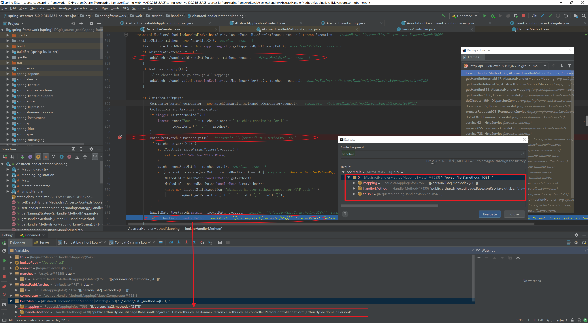

先是通过`addMatchingMappings(directPathMatches, matches, request);`方法，通过`request`取出匹配的内容：

> {[/person/list2],methods=[GET]}

然后通过`Match bestMatch = matches.get(0);`返回得到匹配的方法`HandlerMethod`：

> public arthur.dy.lee.util.page.BaseJsonRst<java.util.List<arthur.dy.lee.domain.Person>> arthur.dy.lee.controller.PersonController.getForm(arthur.dy.lee.domain.Person)

看内容就知道方法的返回值，哪个controller，controller里的哪个方法，入参是什么，都一清二楚了。


返回`HandlerMethod`后，重新创建`HandlerMethod`，主要是找到的`personController`在工厂中找到对应的bean：`PersonController`保存起来。

##### AbstractHandlerMethodMapping#createWithResolvedBean() 创建HandlerMethod

```java
public HandlerMethod createWithResolvedBean() {
   Object handler = this.bean; //此时的bean是字符串类型，值为：personController
   if (this.bean instanceof String) {
      Assert.state(this.beanFactory != null, "Cannot resolve bean name without BeanFactory");
      String beanName = (String) this.bean;
      //从工厂根据beanName中取bean
      handler = this.beanFactory.getBean(beanName); 
   }
   //将PersonController和自己包装一下返回。 
   return new HandlerMethod(this, handler);
}
```


##### 在得到handler后，构造`HandlerExecutionChain`

```java
@Override
@Nullable
public final HandlerExecutionChain getHandler(HttpServletRequest request) throws Exception {
   Object handler = getHandlerInternal(request);
   //....
   HandlerExecutionChain executionChain = getHandlerExecutionChain(handler, request);
   //....
   return executionChain;
}
```


在得到HandlerMethod，即Handler后，放到`HandlerExecutionChain`，然后往`HandlerExecutionChain`中加入拦截器：`ConversionServiceExposingInterceptor `和`ResourceUrlProviderExposingInterceptor`

- `ConversionServiceExposingInterceptor `: `<mvc:annotation-driven />` 该标签初始化的时候会初始化这个拦截器，作用是暴露 `conversionService` 到请求中以便如`<spring:eval>`标签使用  
- `ResourceUrlProviderExposingInterceptor`: 该拦截器用于静态资源访问，定义了以下的标签，在该标签初始化的时候会初始化这个拦截器 `<mvc:resources mapping="/js/**" location="/js/" /> `

AbstractHandlerMethodMapping#getHandlerExecutionChain

```java
protected HandlerExecutionChain getHandlerExecutionChain(Object handler, HttpServletRequest request) {
   HandlerExecutionChain chain = (handler instanceof HandlerExecutionChain ?
         (HandlerExecutionChain) handler : new HandlerExecutionChain(handler));

   String lookupPath = this.urlPathHelper.getLookupPathForRequest(request);
   for (HandlerInterceptor interceptor : this.adaptedInterceptors) {
      if (interceptor instanceof MappedInterceptor) {
         MappedInterceptor mappedInterceptor = (MappedInterceptor) interceptor;
         if (mappedInterceptor.matches(lookupPath, this.pathMatcher)) {
            chain.addInterceptor(mappedInterceptor.getInterceptor());
         }
      }
      else {
         chain.addInterceptor(interceptor);
      }
   }
   return chain;
}
```

结果如下图所示：

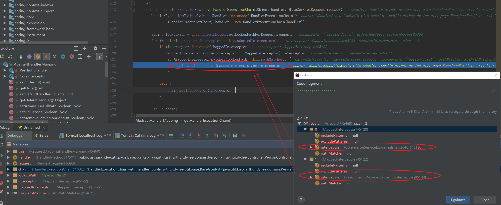


可以看到`mappedHandler = getHandler(processedRequest);`，最后返回的是一个HandlerExecutionChain，里面放的是匹配成功的拦截器：`ConversionServiceExposingInterceptor `和`ResourceUrlProviderExposingInterceptor`，以及匹配的HandlerMethod，内容是

> public arthur.dy.lee.util.page.BaseJsonRst<java.util.List<arthur.dy.lee.domain.Person>> arthur.dy.lee.controller.PersonController.getForm(arthur.dy.lee.domain.Person)


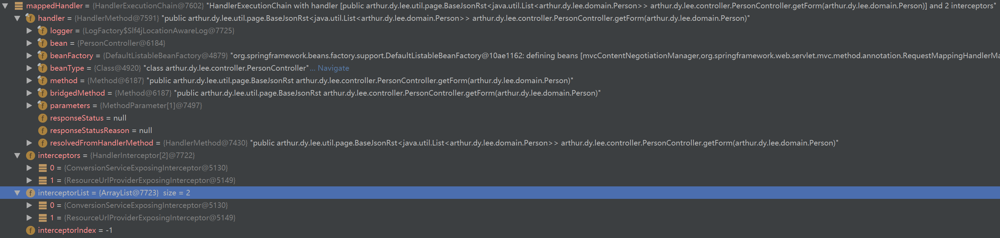


#### 2.HandlerAdapter ha = getHandlerAdapter(mappedHandler.getHandler());

调用真正的controller方法，返回后会调用MessageConvert做数据转换

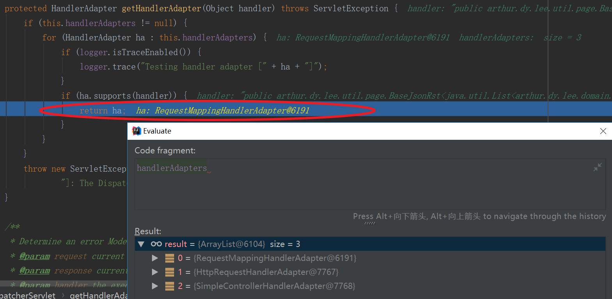


AbstractHandlerMethodAdapter#supports

```java
@Override
public final boolean supports(Object handler) {
   return (handler instanceof HandlerMethod && supportsInternal((HandlerMethod) handler));
}
```

RequestMappingHandlerAdapter#supportsInternal

```java
@Override
protected boolean supportsInternal(HandlerMethod handlerMethod) {
   return true;
}
```

因为`RequestMappingHandlerAdapter`方法里面直接返回true，所以`RequestMappingHandlerAdapter`是支持当前`HandlerMethod`的，所以最后`HandlerAdapter `就是`RequestMappingHandlerAdapter`

#### 3. mv = ha.handle(processedRequest, response, mappedHandler.getHandler()); 反射调用真正的controller方法

调用的url为：`http://localhost:8080/person/list2?name=123`

先来看ha.handle调用的堆栈

```txt
getForm:38, PersonController (arthur.dy.lee.controller)
invoke0:-1, NativeMethodAccessorImpl (sun.reflect)
invoke:62, NativeMethodAccessorImpl (sun.reflect)
invoke:43, DelegatingMethodAccessorImpl (sun.reflect)
invoke:497, Method (java.lang.reflect)
doInvoke:209, InvocableHandlerMethod (org.springframework.web.method.support)
invokeForRequest:136, InvocableHandlerMethod (org.springframework.web.method.support)
invokeAndHandle:102, ServletInvocableHandlerMethod (org.springframework.web.servlet.mvc.method.annotation)
invokeHandlerMethod:871, RequestMappingHandlerAdapter (org.springframework.web.servlet.mvc.method.annotation)
handleInternal:777, RequestMappingHandlerAdapter (org.springframework.web.servlet.mvc.method.annotation)
handle:87, AbstractHandlerMethodAdapter (org.springframework.web.servlet.mvc.method)
doDispatch:991, DispatcherServlet (org.springframework.web.servlet)
```

AbstractHandlerMethodAdapter#handle

```java
@Override
@Nullable
public final ModelAndView handle(HttpServletRequest request, HttpServletResponse response, Object handler)
      throws Exception {

   return handleInternal(request, response, (HandlerMethod) handler);
}
```

RequestMappingHandlerAdapter#handleInternal

```java
@Override
protected ModelAndView handleInternal(HttpServletRequest request,
      HttpServletResponse response, HandlerMethod handlerMethod) throws Exception {

   ModelAndView mav;
   checkRequest(request);

   // Execute invokeHandlerMethod in synchronized block if required.
   if (this.synchronizeOnSession) {
      HttpSession session = request.getSession(false);
      if (session != null) {
         Object mutex = WebUtils.getSessionMutex(session);
         synchronized (mutex) {
            mav = invokeHandlerMethod(request, response, handlerMethod);
         }
      }
      else {
         // No HttpSession available -> no mutex necessary
         mav = invokeHandlerMethod(request, response, handlerMethod);
      }
   }
   else {
      // No synchronization on session demanded at all...
      mav = invokeHandlerMethod(request, response, handlerMethod); //<<-----------------
   }

   if (!response.containsHeader(HEADER_CACHE_CONTROL)) {
      if (getSessionAttributesHandler(handlerMethod).hasSessionAttributes()) {
         applyCacheSeconds(response, this.cacheSecondsForSessionAttributeHandlers);
      }
      else {
         prepareResponse(response);
      }
   }

   return mav;
}
```


因为之前就决定吧Adpater是：`RequestMappingHandlerAdapter` ，所以是调用它的方法

RequestMappingHandlerAdapter#invokeHandlerMethod

```java
@Nullable
protected ModelAndView invokeHandlerMethod(HttpServletRequest request,
      HttpServletResponse response, HandlerMethod handlerMethod) throws Exception {

   ServletWebRequest webRequest = new ServletWebRequest(request, response);
   try {
      //数据绑定 
      WebDataBinderFactory binderFactory = getDataBinderFactory(handlerMethod);
      ModelFactory modelFactory = getModelFactory(handlerMethod, binderFactory);

      ServletInvocableHandlerMethod invocableMethod = createInvocableHandlerMethod(handlerMethod);
      if (this.argumentResolvers != null) {
         invocableMethod.setHandlerMethodArgumentResolvers(this.argumentResolvers);
      }
      if (this.returnValueHandlers != null) {
         invocableMethod.setHandlerMethodReturnValueHandlers(this.returnValueHandlers);
      }
      invocableMethod.setDataBinderFactory(binderFactory);
      invocableMethod.setParameterNameDiscoverer(this.parameterNameDiscoverer);
      //创建 ModelAndViewContainer
      ModelAndViewContainer mavContainer = new ModelAndViewContainer();
      mavContainer.addAllAttributes(RequestContextUtils.getInputFlashMap(request));
      modelFactory.initModel(webRequest, mavContainer, invocableMethod);
      mavContainer.setIgnoreDefaultModelOnRedirect(this.ignoreDefaultModelOnRedirect);

      AsyncWebRequest asyncWebRequest = WebAsyncUtils.createAsyncWebRequest(request, response);
      asyncWebRequest.setTimeout(this.asyncRequestTimeout);

      WebAsyncManager asyncManager = WebAsyncUtils.getAsyncManager(request);
      asyncManager.setTaskExecutor(this.taskExecutor);
      asyncManager.setAsyncWebRequest(asyncWebRequest);
      asyncManager.registerCallableInterceptors(this.callableInterceptors);
      asyncManager.registerDeferredResultInterceptors(this.deferredResultInterceptors);

      if (asyncManager.hasConcurrentResult()) {
         Object result = asyncManager.getConcurrentResult();
         mavContainer = (ModelAndViewContainer) asyncManager.getConcurrentResultContext()[0];
         asyncManager.clearConcurrentResult();
         if (logger.isDebugEnabled()) {
            logger.debug("Found concurrent result value [" + result + "]");
         }
         invocableMethod = invocableMethod.wrapConcurrentResult(result);
      }

      invocableMethod.invokeAndHandle(webRequest, mavContainer);//调用controller <--------------
      if (asyncManager.isConcurrentHandlingStarted()) {
         return null;
      }

      return getModelAndView(mavContainer, modelFactory, webRequest);
   }
   finally {
      webRequest.requestCompleted();
   }
}
```


`ServletInvocableHandlerMethod`继承了`InvocableHandlerMethod`

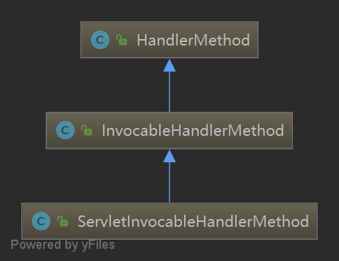


##### 反射调用真正controller

ServletInvocableHandlerMethod#invokeAndHandle

```java
/**
 * Invoke the method and handle the return value through one of the
 * configured {@link HandlerMethodReturnValueHandler}s.
 * @param webRequest the current request
 * @param mavContainer the ModelAndViewContainer for this request
 * @param providedArgs "given" arguments matched by type (not resolved)
 */
public void invokeAndHandle(ServletWebRequest webRequest, ModelAndViewContainer mavContainer,
      Object... providedArgs) throws Exception {
   //<-----------------开始调用真正的controller方法，并拿到返回值
   Object returnValue = invokeForRequest(webRequest, mavContainer, providedArgs);
   setResponseStatus(webRequest);

   if (returnValue == null) {
      if (isRequestNotModified(webRequest) || getResponseStatus() != null || mavContainer.isRequestHandled()) {
         mavContainer.setRequestHandled(true);
         return;
      }
   }
   else if (StringUtils.hasText(getResponseStatusReason())) {
      mavContainer.setRequestHandled(true);
      return;
   }

   mavContainer.setRequestHandled(false);
   Assert.state(this.returnValueHandlers != null, "No return value handlers");
   try {
      // 执行完真正的controller后，将结果保存起来。 
      this.returnValueHandlers.handleReturnValue(
            returnValue, getReturnValueType(returnValue), mavContainer, webRequest);
   }
   catch (Exception ex) {
      if (logger.isTraceEnabled()) {
         logger.trace(getReturnValueHandlingErrorMessage("Error handling return value", returnValue), ex);
      }
      throw ex;
   }
}
```


InvocableHandlerMethod#invokeForRequest

```java
@Nullable
public Object invokeForRequest(NativeWebRequest request, @Nullable ModelAndViewContainer mavContainer,
      Object... providedArgs) throws Exception {
   // 得到参数值`Person person` <-----
   Object[] args = getMethodArgumentValues(request, mavContainer, providedArgs);
   if (logger.isTraceEnabled()) {
      logger.trace("Invoking '" + ClassUtils.getQualifiedMethodName(getMethod(), getBeanType()) +
            "' with arguments " + Arrays.toString(args));
   }
   // 调用真正的Controller: PersonController#getForm
   Object returnValue = doInvoke(args);
   if (logger.isTraceEnabled()) {
      logger.trace("Method [" + ClassUtils.getQualifiedMethodName(getMethod(), getBeanType()) +
            "] returned [" + returnValue + "]");
   }
   return returnValue;
}
```

InvocableHandlerMethod#doInvoke

```java
/**
 * Invoke the handler method with the given argument values.
 */
protected Object doInvoke(Object... args) throws Exception {
   ReflectionUtils.makeAccessible(getBridgedMethod());
   try {
      return getBridgedMethod().invoke(getBean(), args);
   }//....
}
```

HandlerMethod#getBridgedMethod

```java
private final Method bridgedMethod;

protected Method getBridgedMethod() {
   return this.bridgedMethod;
}
```

可以看到bridgedMethod的类型是`Method`，`getBridgedMethod().invoke(getBean(), args);`相当于JDK反射调用目标方法。


##### 执行真正的controller方法:

执行真正的controller方法:PersonController#getForm

因为本例是返回的json，所以`ModelAndView mv`值为null

```java
@Controller("personController")
@RequestMapping("/person")
public class PersonController {
    @Autowired
    PersonService personService;
    
    @ResponseBody
    @RequestMapping(value="/list2", method= RequestMethod.GET)
    public BaseJsonRst<List<Person>> getForm(Person person){
        BaseJsonRst<List<Person>> ret =  new BaseJsonRst<List<Person>>();
        List<Person> list = new ArrayList<Person>();
        Person p = new Person();
        p.setId("1");
        p.setName("2");
        list.add(p);
        return ret.success(list);
    }
}
```


##### 处理返回值

调用`FastJsonHttpMessageConverter`

下面看一下得到返回值后，调用的`this.returnValueHandlers.handleReturnValue(returnValue, getReturnValueType(returnValue), mavContainer, webRequest);`方法。这个方法会调用

RequestResponseBodyMethodProcessor#handleReturnValue

```java
@Override
public void handleReturnValue(@Nullable Object returnValue, MethodParameter returnType,
      ModelAndViewContainer mavContainer, NativeWebRequest webRequest)
      throws IOException, HttpMediaTypeNotAcceptableException, HttpMessageNotWritableException {

   mavContainer.setRequestHandled(true);
   ServletServerHttpRequest inputMessage = createInputMessage(webRequest);
   ServletServerHttpResponse outputMessage = createOutputMessage(webRequest);

   // Try even with null return value. ResponseBodyAdvice could get involved. 
   writeWithMessageConverters(returnValue, returnType, inputMessage, outputMessage);//<------
}
```


后面`AbstractMessageConverterMethodProcessor.writeWithMessageConverters()`方法中，`FastJsonHttpMessageConverter`被调用

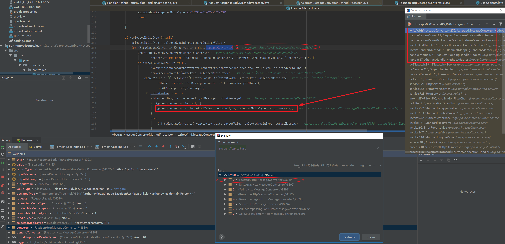

再进去的话，可以跟踪fastJson源码：FastJsonHttpMessageConverter#writeInternal的内容

可以看到最后类对象`BaseJsonRst`格式转成了Json对象，并写到了`HttpOutputMessage`中

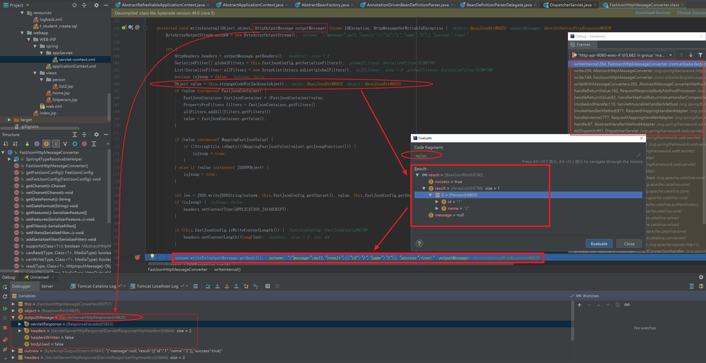

`HttpOutputMessage`运行时类型为`ServletServerHttpResponse`，它持有`HttpServletResponse`。Spring对`HttpServletResponse`进行了封装，实际上使用的是`ServletServerHttpResponse`，这个类有一个对真正的`HttpServletResponse`的引用。  

```java
public class ServletServerHttpResponse implements ServerHttpResponse {

   private final HttpServletResponse servletResponse; // <----------

   private final HttpHeaders headers;

   private boolean headersWritten = false;

   private boolean bodyUsed = false;
   //......
   @Override
   public OutputStream getBody() throws IOException {
       this.bodyUsed = true;
       writeHeaders();
       return this.servletResponse.getOutputStream();
   } 
   //.... 
}
```


如果请求链接是`http://localhost:8080/person/list2?name=123`，调用返回的就Json话，那么`mv=null`，那么也就不用视图解析之类的了。直接将结果写到了 `servletResponse.getOutputStream()`中。


可以看到下面，只有mv非空才会做视图解析，以及渲染。

DispatcherServlet#processDispatchResult

```java
// Did the handler return a view to render?
if (mv != null && !mv.wasCleared()) {
   render(mv, request, response);
   if (errorView) {
      WebUtils.clearErrorRequestAttributes(request);
   }
}
```


#### 4 processDispatchResult(processedRequest, response, mappedHandler, mv, dispatchException); 视图解析

如果请求链接是`http://localhost:8080/person/list?name=1`，那么会调用视图解析

```java
@RequestMapping("/list")
public String listPerson(Person person, Model model) {
    List<Person> personList = personService.listPerson(person);
    model.addAttribute("personList", personList);
    return "listperson";
}
```


DispatcherServlet#processDispatchResult

```java
/**
 * Handle the result of handler selection and handler invocation, which is
 * either a ModelAndView or an Exception to be resolved to a ModelAndView.
 */
private void processDispatchResult(HttpServletRequest request, HttpServletResponse response,
      @Nullable HandlerExecutionChain mappedHandler, @Nullable ModelAndView mv,
      @Nullable Exception exception) throws Exception {

   boolean errorView = false;
   if (exception != null) {
      //....
   }
   // Did the handler return a view to render?
   if (mv != null && !mv.wasCleared()) { //<----- 返回json时不会渲染视图
      render(mv, request, response); // 渲染视图 <------------
      if (errorView) {
         WebUtils.clearErrorRequestAttributes(request);
      }
   }
   //...

   if (mappedHandler != null) {
      mappedHandler.triggerAfterCompletion(request, response, null);
   }
}
```


DispatcherServlet#render

```java
/**
 * Render the given ModelAndView.
 * <p>This is the last stage in handling a request. It may involve resolving the view by name.
 * @param mv the ModelAndView to render
 * @param request current HTTP servlet request
 * @param response current HTTP servlet response
 * @throws ServletException if view is missing or cannot be resolved
 * @throws Exception if there's a problem rendering the view
 */
protected void render(ModelAndView mv, HttpServletRequest request, HttpServletResponse response) throws Exception {
   // Determine locale for request and apply it to the response.
   Locale locale =
         (this.localeResolver != null ? this.localeResolver.resolveLocale(request) : request.getLocale());
   response.setLocale(locale);

   View view;
   String viewName = mv.getViewName();
   if (viewName != null) {
      // We need to resolve the view name. 1 解析视图 <----------------
      view = resolveViewName(viewName, mv.getModelInternal(), locale, request);
      //...
   }//....

   try {
      if (mv.getStatus() != null) {
         response.setStatus(mv.getStatus().value());
      }
      view.render(mv.getModelInternal(), request, response); //2 渲染视图<-------
   }
   catch (Exception ex) {
      if (logger.isDebugEnabled()) {
         logger.debug("Error rendering view [" + view + "] in DispatcherServlet with name '" +
               getServletName() + "'", ex);
      }
      throw ex;
   }
}
```

##### 视图解析 ViewResolver.resolveViewName 

DispatcherServlet#resolveViewName 返回视图

```java
/**
 * Resolve the given view name into a View object (to be rendered).
 * <p>The default implementations asks all ViewResolvers of this dispatcher.
 * Can be overridden for custom resolution strategies, potentially based on
 * specific model attributes or request parameters.
 * @param viewName the name of the view to resolve
 * @param model the model to be passed to the view
 * @param locale the current locale
 * @param request current HTTP servlet request
 * @return the View object, or {@code null} if none found
 * @throws Exception if the view cannot be resolved
 * (typically in case of problems creating an actual View object)
 * @see ViewResolver#resolveViewName
 */
@Nullable
protected View resolveViewName(String viewName, @Nullable Map<String, Object> model,
      Locale locale, HttpServletRequest request) throws Exception {

   if (this.viewResolvers != null) {
      for (ViewResolver viewResolver : this.viewResolvers) {
         View view = viewResolver.resolveViewName(viewName, locale);
         if (view != null) {
            return view;
         }
      }
   }
   return null;
}
```


AbstractCachingViewResolver#resolveViewName

由ViewResolver解析View ，并返回

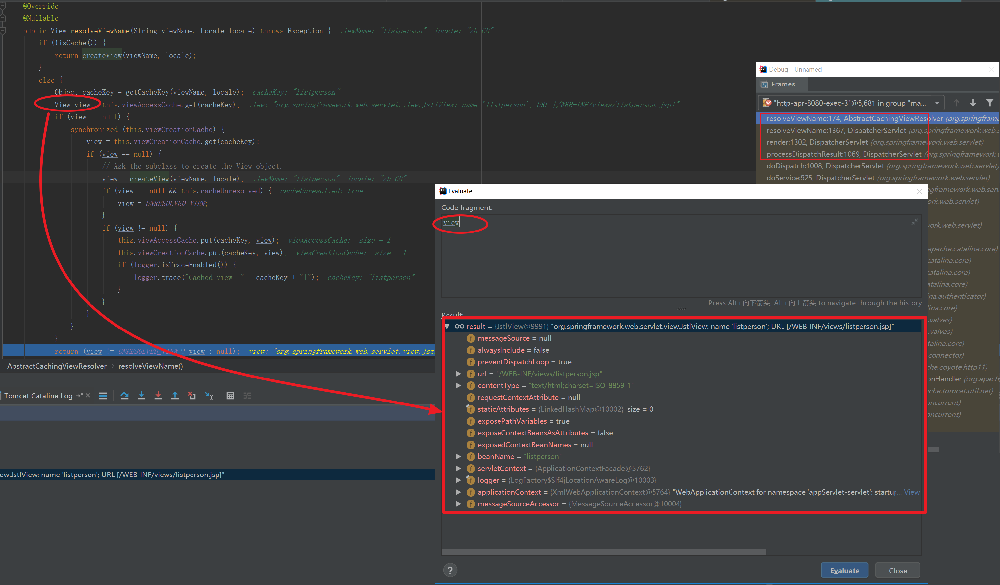

此处一个视图只会在第一次访问的时候才会创建一个view，之后放到缓存中，以后再访问相同的url，将直接从缓存中取。

下面看是怎么创建视图的

##### 创建视图 UrlBasedViewResolver.createView 

创建的视图默认是：`UrlBasedViewResolver`，`UrlBasedViewResolver`的`buildView`方法会获取一个View对象，这个对象会将视图以什么格式呈现给用户，例如如果是jsp显示呈现给用户的话，那这个view对象就是JstlView，默认的是JstlView。 


UrlBasedViewResolver#createView会调用UrlBasedViewResolver#buildView去创建视图

`this.prefix`值为：` /WEB-INF/views/`

`this.suffix`值为：`.jsp`	

值是哪些来的呢？是从我们的xml配置中定义的

```xml
<!-- Resolves views selected for rendering by @Controllers to .jsp resources in the /WEB-INF/views directory -->
<beans:bean class="org.springframework.web.servlet.view.InternalResourceViewResolver">
    <beans:property name="prefix" value="/WEB-INF/views/"/>
    <beans:property name="suffix" value=".jsp"/>
</beans:bean>
```


所以`view`对象中的`url`属性为：`/WEB-INF/views/listperson.jsp`

UrlBasedViewResolver#buildView

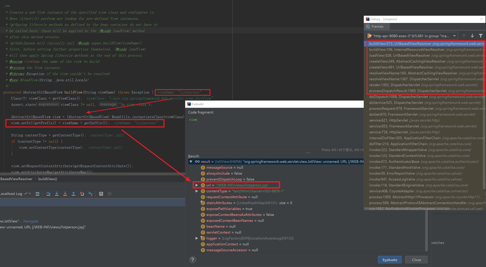


##### 渲染视图 view.render

AbstractView#render

```java
/**
 * Prepares the view given the specified model, merging it with static
 * attributes and a RequestContext attribute, if necessary.
 * Delegates to renderMergedOutputModel for the actual rendering.
 * @see #renderMergedOutputModel
 */
@Override
public void render(@Nullable Map<String, ?> model, HttpServletRequest request, HttpServletResponse response) throws Exception {
   if (logger.isTraceEnabled()) {
      logger.trace("Rendering view with name '" + this.beanName + "' with model " + model +
         " and static attributes " + this.staticAttributes);
   }
   //本例运行中，只是将model转成/赋值给mergedModel
   Map<String, Object> mergedModel = createMergedOutputModel(model, request, response);
   prepareResponse(request, response);
   renderMergedOutputModel(mergedModel, getRequestToExpose(request), response);
}
```


本例运行中，只是将model转成/赋值给mergedModel，其中model和mergedModel值是相同的，如下图所示：

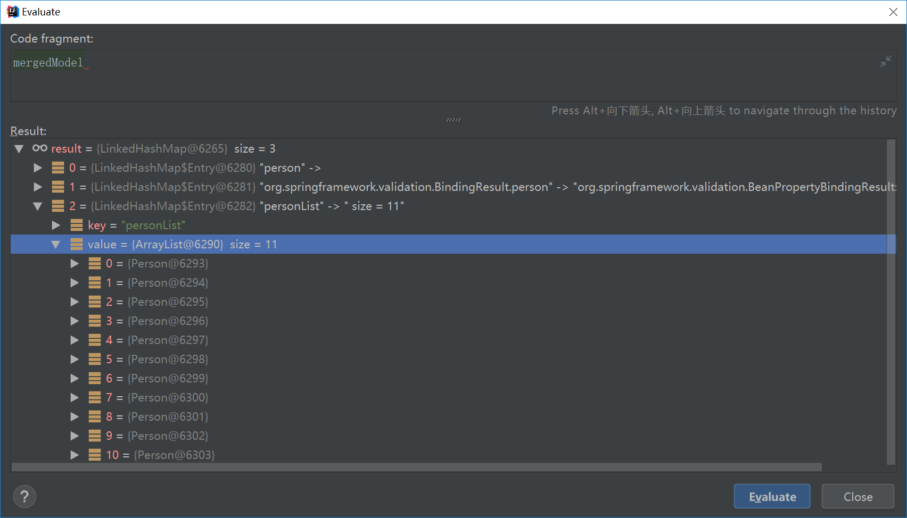

renderMergedOutputModel方法由AbstractView的孙子类InternalResourceView实现 
InternalResourceView的renderMergedOutputModel方法 

我们获取到视图的物理路径，然后将这段路径传给RequestDispatcher对象，再调用RequestDispatcher的forward方法将页面呈现给用户，这样就走完了视图的解析了

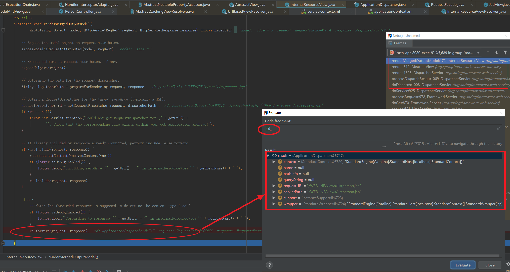


# 四、@RequestMapping 

[Spring MVC — @RequestMapping原理讲解-1](https://blog.csdn.net/j080624/article/details/56278461)

## Spring是怎样检测并处理我们@RequestMapping注解的

InitialiZingBean.afterPropertySet()

```java
Object exposedObject = bean;
try {
	populateBean(beanName, mbd, instanceWrapper);
	if (exposedObject != null) {
		exposedObject = initializeBean(beanName, exposedObject, mbd);
	}
}
```

这是BeanFactory创建Bean过程中需要执行的一段代码，其中populateBean方法便是@Autowired注解的处理过程，执行的属性的自动注入等操作。 

## 检测@RequestMapping

```java
@Override
protected boolean isHandler(Class<?> beanType) {
	return ((AnnotationUtils.findAnnotation(beanType, Controller.class) != null) ||
			(AnnotationUtils.findAnnotation(beanType, RequestMapping.class) != null));
}
```

啊哈，很简单，就是看看有没有被@Controller或者@RequestMapping注解标记

```java
protected void detectHandlerMethods(final Object handler) {
	Class<?> handlerType = (handler instanceof String) ?
			getApplicationContext().getType((String) handler) : handler.getClass();
	final Class<?> userType = ClassUtils.getUserClass(handlerType);
	Set<Method> methods = HandlerMethodSelector.selectMethods(userType, new MethodFilter(){
		public boolean matches(Method method) {//只选择被@RequestMapping标记的方法
			return getMappingForMethod(method, userType) != null;
		}
	});

	for (Method method : methods) {
		//根据方法上的@RequestMapping来创建RequestMappingInfo实例。
		T mapping = getMappingForMethod(method, userType);
		//注册请求映射
		registerHandlerMethod(handler, method, mapping);
	}
}
```

整个的检测过程大致清楚了：1）遍历Handler中的所有方法，找出其中被@RequestMapping注解标记的方法。2）然后遍历这些方法，生成RequestMappingInfo实例。3）将RequestMappingInfo实例以及处理器方法注册到缓存中。


```java
@Override
protected RequestMappingInfo getMappingForMethod(Method method, Class<?> handlerType) {
	RequestMappingInfo info = null;
	//获取方法method上的@RequestMapping实例。
	RequestMapping methodAnnotation = 
							AnnotationUtils.findAnnotation(method, RequestMapping.class);
	if (methodAnnotation != null) {//方法被注解了
		RequestCondition<?> methodCondition = getCustomMethodCondition(method);//始终返回null
		info = createRequestMappingInfo(methodAnnotation, methodCondition);//创建MappingInfo
		//检查方法所属的类有没有@RequestMapping注解
		RequestMapping typeAnnotation = AnnotationUtils.findAnnotation(handlerType, 
																	RequestMapping.class);
		if (typeAnnotation != null) {//有类层次的@RequestMapping注解
			RequestCondition<?> typeCondition = getCustomTypeCondition(handlerType);//null
			//将类层次的RequestMapping和方法级别的RequestMapping结合
			info = createRequestMappingInfo(typeAnnotation, typeCondition).combine(info);
		}
	}
	return info;
}
```

很清晰吧，先获取方法上的@RequestMapping信息，然后获取类级别上的@RequestMapping 信息，然后将两者结合，这里我们有必要再了解下怎样创建RequestMappingInfo对象的（包括他的内部结构），以及怎样将类级别的request mapping信息和方法级别的进行结合的？

```java
private RequestMappingInfo createRequestMappingInfo(RequestMapping annotation, 
                                                        RequestCondition<?> customCondition) {
    return new RequestMappingInfo(
         new PatternsRequestCondition(annotation.value(), getUrlPathHelper(), getPathMatcher(),
                 this.useSuffixPatternMatch, this.useTrailingSlashMatch, this.fileExtensions),
         new RequestMethodsRequestCondition(annotation.method()),
         new ParamsRequestCondition(annotation.params()),
         new HeadersRequestCondition(annotation.headers()),
         new ConsumesRequestCondition(annotation.consumes(), annotation.headers()),
         new ProducesRequestCondition(annotation.produces(), annotation.headers(), 
                    getContentNegotiationManager()), 
        customCondition
    );
}
```


# 五、拦截器扩展

可以自定义自己的拦截器。值得参考：[09.SpringMVC 拦截器 - HandlerInterceptor](https://blog.csdn.net/u012420654/article/details/52098592?locationNum=14&fps=1)