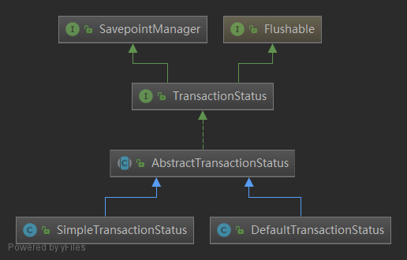
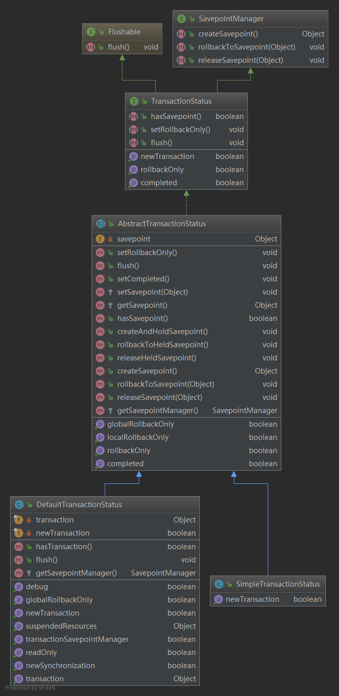
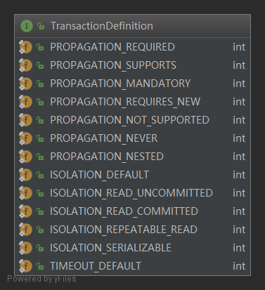
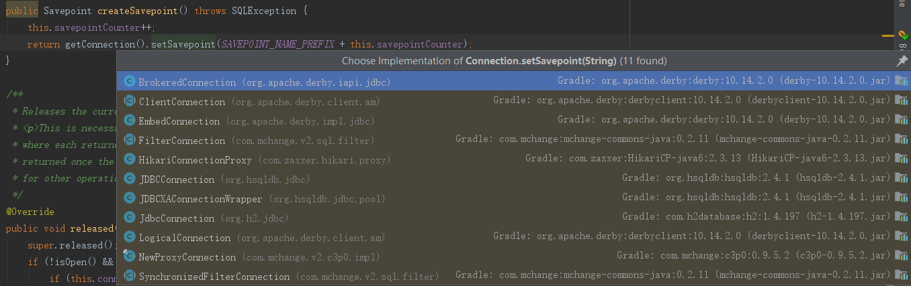
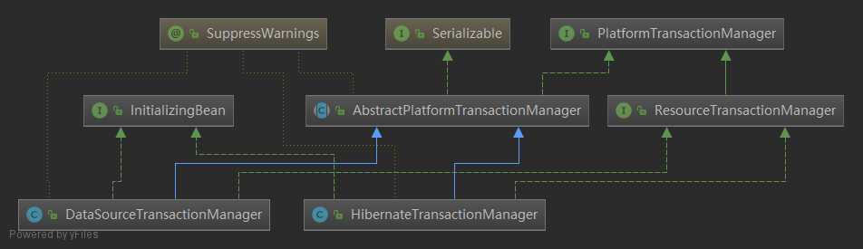
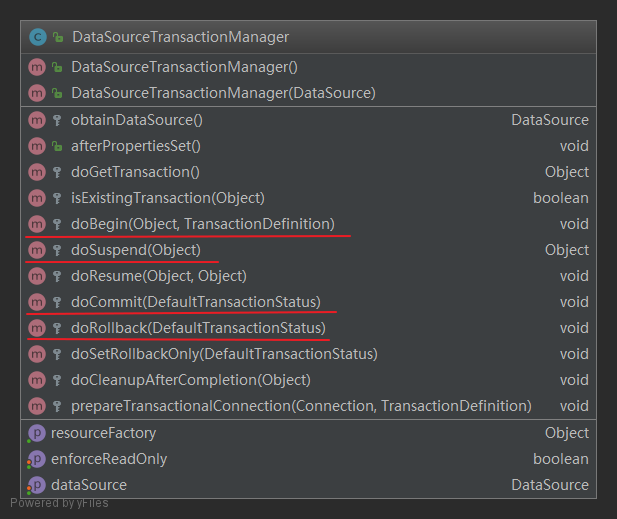
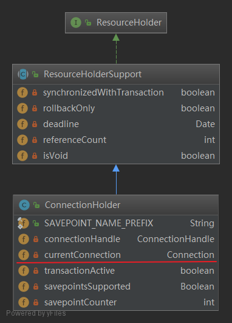

# spring事务源码解析-内核类

	spring源码版本：spring5.0
	
	jdk: 1.8		
	
	我保存的源码地址：[https://gitee.com/paincupid/spring-framework.git](https://gitee.com/paincupid/spring-framework.git) 
	
	或者官网地址：[https://github.com/spring-projects/spring-framework.git](https://github.com/spring-projects/spring-framework.git)


## 一、TransactionSynchronizationManager

----


>Central delegate that manages resources and transaction synchronizations per thread. 
>
>线程委托中心，为线程管理资源和事务同步

```java
/**
 * Central delegate that manages resources and transaction synchronizations per thread.
 * To be used by resource management code but not by typical application code.
 *
 * <p>Supports one resource per key without overwriting, that is, a resource needs
 * to be removed before a new one can be set for the same key.
 * Supports a list of transaction synchronizations if synchronization is active.
 *
 * <p>Resource management code should check for thread-bound resources, e.g. JDBC
 * Connections or Hibernate Sessions, via {@code getResource}. Such code is
 * normally not supposed to bind resources to threads, as this is the responsibility
 * of transaction managers. A further option is to lazily bind on first use if
 * transaction synchronization is active, for performing transactions that span
 * an arbitrary number of resources.
 *
 * <p>Transaction synchronization must be activated and deactivated by a transaction
 * manager via {@link #initSynchronization()} and {@link #clearSynchronization()}.
 * This is automatically supported by {@link AbstractPlatformTransactionManager},
 * and thus by all standard Spring transaction managers, such as
 * {@link org.springframework.transaction.jta.JtaTransactionManager} and
 * {@link org.springframework.jdbc.datasource.DataSourceTransactionManager}.
 *
 * <p>Resource management code should only register synchronizations when this
 * manager is active, which can be checked via {@link #isSynchronizationActive};
 * it should perform immediate resource cleanup else. If transaction synchronization
 * isn't active, there is either no current transaction, or the transaction manager
 * doesn't support transaction synchronization.
 *
 * <p>Synchronization is for example used to always return the same resources
 * within a JTA transaction, e.g. a JDBC Connection or a Hibernate Session for
 * any given DataSource or SessionFactory, respectively.
 */
public abstract class TransactionSynchronizationManager {
    private static final ThreadLocal<Map<Object, Object>> resources =
        new NamedThreadLocal<>("Transactional resources");
    private static final ThreadLocal<Set<TransactionSynchronization>> synchronizations =
        new NamedThreadLocal<>("Transaction synchronizations");//
    private static final ThreadLocal<String> currentTransactionName =
        new NamedThreadLocal<>("Current transaction name");//当前事务名称
    private static final ThreadLocal<Boolean> currentTransactionReadOnly =
        new NamedThreadLocal<>("Current transaction read-only status");//当前事务只读状态
    private static final ThreadLocal<Integer> currentTransactionIsolationLevel =
        new NamedThreadLocal<>("Current transaction isolation level");//当前事务的隔离级别
    private static final ThreadLocal<Boolean> actualTransactionActive =
        new NamedThreadLocal<>("Actual transaction active");
        
}
```

`TransactionSynchronizationManager `类内部大全的使用到了`ThreadLocal`，用来保存当前线程的信息：

`TransactionSynchronization`同步

机器翻译一下：

>管理每个线程的资源和事务同步的中心委托。用于资源管理代码，但不用于典型的应用程序代码。
>
>每个键支持一个资源，不需要覆盖，也就是说，在为同一个键设置新的资源之前，需要删除一个资源。如果同步活动，则支持事务同步列表。
>
>资源管理代码应该通过{@code getResource}检查线程绑定的资源，例如JDBC连接或Hibernate会话。这种代码通常不应该将资源绑定到线程，因为这是事务管理器的责任。另一种选择是，如果事务同步是活动的，则在第一次使用时延迟绑定，以执行跨越任意数量资源的事务。
>
>事务同步必须由事务管理器通过{@link #initSynchronization()}和{@link #clearSynchronization()}激活和停用。{@link AbstractPlatformTransactionManager}和所有标准的Spring事务管理器(如{@link org.springframework.transaction.jta)自动支持这一点。JtaTransactionManager}和{@link org.springframework.jdbc.datasource.DataSourceTransactionManager}。
>
>资源管理代码只能在此管理器处于活动状态时注册同步，可以通过{@link #isSynchronizationActive}检查同步;它应该立即执行其他资源清理。如果事务同步不是活动的，那么要么没有当前事务，要么事务管理器不支持事务同步。
>
>例如，同步用于总是在JTA事务中返回相同的资源，例如，针对zany给定的数据源或SessionFactory的JDBC连接或Hibernate会话。


TransactionSynchronizationManager #bindResource

将key拆开unwrap后，放入到map中。

```java
/**
 * Bind the given resource for the given key to the current thread.
 * @param key the key to bind the value to (usually the resource factory)
 * @param value the value to bind (usually the active resource object)
 * @throws IllegalStateException if there is already a value bound to the thread
 * @see ResourceTransactionManager#getResourceFactory()
 */
public static void bindResource(Object key, Object value) throws IllegalStateException {
   Object actualKey = TransactionSynchronizationUtils.unwrapResourceIfNecessary(key);
   Assert.notNull(value, "Value must not be null");
   Map<Object, Object> map = resources.get();
   // set ThreadLocal Map if none found
   if (map == null) {
      map = new HashMap<>();
      resources.set(map);
   }
   Object oldValue = map.put(actualKey, value);
   // Transparently suppress a ResourceHolder that was marked as void...
   if (oldValue instanceof ResourceHolder && ((ResourceHolder) oldValue).isVoid()) {
      oldValue = null;
   }
   if (oldValue != null) {
      throw new IllegalStateException("Already value [" + oldValue + "] for key [" +
            actualKey + "] bound to thread [" + Thread.currentThread().getName() + "]");
   }
   if (logger.isTraceEnabled()) {
      logger.trace("Bound value [" + value + "] for key [" + actualKey + "] to thread [" +
            Thread.currentThread().getName() + "]");
   }
}
```


## 二、AbstractPlatformTransactionManager

---

抽象事务管理器AbstractPlatformTransactionManager提供了创建事务的模板，这个模板会被具体的事务处理器所使用，抽象事务管理器根据事务属性配置和当前线程绑定信息对事务是否需要创建以及如何创建进行一些通用的处理，然后把事务创建的底层细节交给具体的事务处理器实现。 

介绍三个方法：

> TransactionStatus getTransaction(@Nullable TransactionDefinition definition)
>
> void commit(TransactionStatus status)
>
> void rollback(TransactionStatus status)

### 2.1 TransactionStatus getTransaction(@Nullable TransactionDefinition definition)

```java
public final TransactionStatus getTransaction(@Nullable TransactionDefinition definition) throws TransactionException {
    Object transaction = doGetTransaction();

    if (definition == null) {
        // Use defaults if no transaction definition given.
        definition = new DefaultTransactionDefinition();
    }
	//如果事务已存在,根据事务传播行为来处理,处理嵌套事务
    if (isExistingTransaction(transaction)) {
        // Existing transaction found -> check propagation behavior to find out how to behave.
        return handleExistingTransaction(definition, transaction, debugEnabled);
    }

    // Check definition settings for new transaction.
    if (definition.getTimeout() < TransactionDefinition.TIMEOUT_DEFAULT) {
        throw new InvalidTimeoutException("Invalid transaction timeout", definition.getTimeout());
    }

    // No existing transaction found -> check propagation behavior to find out how to proceed.
    if (definition.getPropagationBehavior() == TransactionDefinition.PROPAGATION_MANDATORY) {
        throw new IllegalTransactionStateException(
            "No existing transaction found for transaction marked with propagation 'mandatory'");
    }
    else if (definition.getPropagationBehavior() == TransactionDefinition.PROPAGATION_REQUIRED ||
             definition.getPropagationBehavior() == TransactionDefinition.PROPAGATION_REQUIRES_NEW ||
             definition.getPropagationBehavior() == TransactionDefinition.PROPAGATION_NESTED) {
        SuspendedResourcesHolder suspendedResources = suspend(null);
        }
        try {
            boolean newSynchronization = (getTransactionSynchronization() != SYNCHRONIZATION_NEVER);
            DefaultTransactionStatus status = newTransactionStatus(
                definition, transaction, true, newSynchronization, debugEnabled, suspendedResources);
            //这里最关键,开启一个新的事务,并放进TransactionSynchronizationManager的上下文中,并绑定到当前线程)
            doBegin(transaction, definition);
            prepareSynchronization(status, definition);
            return status;
        }
        catch (RuntimeException | Error ex) {
            resume(null, suspendedResources);
            throw ex;
        }
    }
    else {
        // Create "empty" transaction: no actual transaction, but potentially synchronization.
        if (definition.getIsolationLevel() != TransactionDefinition.ISOLATION_DEFAULT && logger.isWarnEnabled()) {
            logger.warn("Custom isolation level specified but no actual transaction initiated; " +
                        "isolation level will effectively be ignored: " + definition);
        }
        boolean newSynchronization = (getTransactionSynchronization() == SYNCHRONIZATION_ALWAYS);
        return prepareTransactionStatus(definition, null, true, newSynchronization, debugEnabled, null);
    }
}
```


1、Object transaction = doGetTransaction();

```java
DataSourceTransactionObject txObject = new DataSourceTransactionObject();
txObject.setSavepointAllowed(isNestedTransactionAllowed());
ConnectionHolder conHolder =
    (ConnectionHolder) TransactionSynchronizationManager.getResource(obtainDataSource());
		txObject.setConnectionHolder(conHolder, false);
```

2、入参definition若为空，则new DefaultTransactionDefinition()

3、若存在事务isExistingTransaction(transaction), 则return handleExistingTransaction方法的返回对象TransactionStatus

> TransactionStatus handleExistingTransaction( TransactionDefinition definition, Object transaction, boolean debugEnabled)

**handleExistingTransaction** 这个方法主要为已经存在的事务去创建一个事物状态。

先说返回的DefaultTransactionStatus这个状态类结构



属性方法类图



TransactionDefinition有七种事务的传播状态以及数据库的隔离级别



下面主要介绍一下这个方法**handleExistingTransaction** ，能进入这个方法表明当前已有事务了isExistingTransaction(transaction)

A、definition.getPropagationBehavior() == TransactionDefinition.PROPAGATION_*** 做状态比较，

- PROPAGATION_NEVER 抛出异常

- PROPAGATION_NOT_SUPPORTED

  	挂起当前的事务，Object suspendedResources = suspend(transaction); 所谓挂起，就是将TransactionSynchronizationManager中的状态：suspendedSynchronizations、currentTransactionName、isolationLevel、isActualTransactionActive取出来，new一个对象SuspendedResourcesHolder保存起来，并将TransactionSynchronizationManager中相关的内容清除。TransactionSynchronizationManager是用ThreadLocal存的，每个线程一份，所以不会混淆。
	
  	将definition、newSynchronization、suspendedResources做为参数new一个对象DefaultTransactionStatus，并返回它。

  ```java
  transaction-> ->SuspendedResourcesHolder -> TransactionStatus
  ```

  	返回DefaultTransactionStatus

- PROPAGATION_REQUIRES_NEW

  	挂起当前事务，同上一步：SuspendedResourcesHolder suspendedResources = suspend(transaction);
	
  	根据当前transaction和挂起的资源suspendedResources，去创建TransactionStatus对象。 DefaultTransactionStatus status = newTransactionStatus(definition, transaction, true, newSynchronization, debugEnabled, suspendedResources);
		
  	DataSourceTransactionManager.doBegin(); 下面会单独介绍deBegin()方法
		
  	prepareSynchronization(status, definition);如果是一个新的事务，则初始化transaction synchronization。TransactionSynchronizationManager.initSynchronization()
		
  	返回DefaultTransactionStatus

- PROPAGATION_NESTED (JDBC3.0以上才支持savepoints)

  	JTA不使用savePoint，另做处理。其它情况使用savepoint。第一，new DefaultTransactionStatus()，入参：newTransaction=false,newSynchronization=false,suspendedResources=null。也就是说是一个全新的TransactionStatus，而不会挂起原来的事务。第二，status.createAndHoldSavepoint();

  ```java
  public Savepoint createSavepoint() throws SQLException {
      this.savepointCounter++;
      return getConnection().setSavepoint(SAVEPOINT_NAME_PREFIX + this.savepointCounter);
  }
  ```

  savePoint其实就是SAVEPOINT_i++，至于怎么实现，要看各数据库的了。

  

  下面贴一下h2的实现

  ```java
  public Savepoint setSavepoint(String name) throws SQLException {
      try {
          int id = getNextId(TraceObject.SAVEPOINT);
          if (isDebugEnabled()) {
              debugCodeAssign("Savepoint", TraceObject.SAVEPOINT, id,
                              "setSavepoint(" + quote(name) + ")");
          }
          checkClosed();
          CommandInterface set = prepareCommand(
              "SAVEPOINT " + JdbcSavepoint.getName(name, 0),
              Integer.MAX_VALUE);
          set.executeUpdate(false);
          return new JdbcSavepoint(this, 0, name, trace,
                                   id);
      } catch (Exception e) {
          throw logAndConvert(e);
      }
  }
  ```

- 如果不是以上4种情况 ，则也返回DefaultTransactionStatus

以上 handleExistingTransaction 讲解完毕

4、若transaction不存在事务

- 若事务的传播行为为：PROPAGATION_REQUIRED、PROPAGATION_REQUIRES_NEW、PROPAGATION_NESTED

  	根据当前线程去new SuspendedResourcesHolder

  > SuspendedResourcesHolder suspendedResources = suspend(null);

  	new DefaultTransactionStatus

  > DefaultTransactionStatus status = newTransactionStatus(      definition, transaction, true, newSynchronization, debugEnabled, suspendedResources);doBegin(transaction, definition);

  	DataSourceTransactionManager.doBegin()
	
  	prepareSynchronization(status, definition);如果是一个新的事务，则初始化transaction synchronization。

- 其它情况

  	new TransactionStatus
  	
  	prepareSynchronization(status, definition);如果是一个新的事务，则初始化transaction synchronization


### 2.2 void commit(TransactionStatus status) throws TransactionException

commit中其实就2个方法，一个是processRollback，处理事物的回滚，另一个是processCommit，负责事物的提交。

简略的写其实就3步：

>DataSourceTransactionObject txObject = (DataSourceTransactionObject) status.getTransaction();

> Connection con = txObject.getConnectionHolder().getConnection();

> con.rollback();或者 con.commit(); 


```java
@Override
public final void commit(TransactionStatus status) throws TransactionException {
    //......
    DefaultTransactionStatus defStatus = (DefaultTransactionStatus) status;
    if (defStatus.isLocalRollbackOnly()) {
        processRollback(defStatus, false);
        return;
    }
    if (!shouldCommitOnGlobalRollbackOnly() && defStatus.isGlobalRollbackOnly()) {
        processRollback(defStatus, true);
        return;
    }
    processCommit(defStatus);
}
```

### 2.2 processRollback

```java
private void processRollback(DefaultTransactionStatus status, boolean unexpected){
    try {
        boolean unexpectedRollback = unexpected;

        try {
            //....
            if (status.hasSavepoint()) {
                status.rollbackToHeldSavepoint();
            }
            else if (status.isNewTransaction()) {
                doRollback(status);
            }
            else {
                // Participating in larger transaction
                if (status.hasTransaction()) {
                    if (status.isLocalRollbackOnly() || isGlobalRollbackOnParticipationFailure()) {
                        doSetRollbackOnly(status);
                    }
                }
                // Unexpected rollback only matters here if we're asked to fail early
                if (!isFailEarlyOnGlobalRollbackOnly()) {
                    unexpectedRollback = false;
                }
            }
        }
        catch (RuntimeException | Error ex) {
            triggerAfterCompletion(status, TransactionSynchronization.STATUS_UNKNOWN);
            throw ex;
        }

        triggerAfterCompletion(status, TransactionSynchronization.STATUS_ROLLED_BACK);

        // Raise UnexpectedRollbackException if we had a global rollback-only marker
        if (unexpectedRollback) {
            throw new UnexpectedRollbackException(
                "Transaction rolled back because it has been marked as rollback-only");
        }
    }
    finally {
        cleanupAfterCompletion(status);
    }
}
```


如果需要进行rollback操作，则会进入以下流程

1、如果存在savePoint，则回滚rollbackToHeldSavepoint: DefaultTransactionStatus.rollbackToHeldSavepoint()-> ConnectionHolder.getConnection().rollback((Savepoint) savepoint); ConnectionHolder.getConnection().releaseSavepoint((Savepoint) savepoint);

2、如果是一个新的事务：isNewTransaction，则DataSourceTransactionManager.doRollback(status);

```java
protected void doRollback(DefaultTransactionStatus status) {
    DataSourceTransactionObject txObject = (DataSourceTransactionObject) status.getTransaction();
    Connection con = txObject.getConnectionHolder().getConnection();
    try {
        con.rollback();
    }
    //....
}
```

3、triggerAfterCompletion(status, TransactionSynchronization.STATUS_ROLLED_BACK); 主要是释放TransactionSynchronizationManager的synchronizations，并将TransactionSynchronizationManager解绑资源

```java
List<TransactionSynchronization> synchronizations =  TransactionSynchronizationManager.getSynchronizations();//得到synchronizations
TransactionSynchronizationManager.clearSynchronization();//清除
//......
synchronization.afterCompletion()
```

afterCompletion()

```java
TransactionSynchronizationManager.unbindResourceIfPossible(this.resourceKey);
```

4、如果unexpectedRollback=true，则抛出"Transaction rolled back because it has been marked as rollback-only"

什么时候为true呢？!shouldCommitOnGlobalRollbackOnly() && defStatus.isGlobalRollbackOnly()时，会抛这个异常。

5、最后释放资源cleanupAfterCompletion(DefaultTransactionStatus status)

### 2.4 processCommit

processCommit的流程和上面的rollback是差不多的，只不过rollback换成了commit.

```java
private void processCommit(DefaultTransactionStatus status) throws TransactionException {
    try {
        boolean beforeCompletionInvoked = false;

        try {
            boolean unexpectedRollback = false;
            prepareForCommit(status);
            triggerBeforeCommit(status);
            triggerBeforeCompletion(status);
            beforeCompletionInvoked = true;

            if (status.hasSavepoint()) {
                unexpectedRollback = status.isGlobalRollbackOnly();
                status.releaseHeldSavepoint();//提交前会先释放savepoint
            }
            else if (status.isNewTransaction()) {
                unexpectedRollback = status.isGlobalRollbackOnly();
                doCommit(status);
            }
            else if (isFailEarlyOnGlobalRollbackOnly()) {
                unexpectedRollback = status.isGlobalRollbackOnly();
            }

            // Throw UnexpectedRollbackException if we have a global rollback-only
            // marker but still didn't get a corresponding exception from commit.
            if (unexpectedRollback) {
                throw new UnexpectedRollbackException(
                    "Transaction silently rolled back because it has been marked as rollback-only");
            }
        }
        catch (UnexpectedRollbackException ex) {
            //...
        }catch (TransactionException ex) {
            // can only be caused by doCommit
            //...
            throw ex;
        }catch (RuntimeException | Error ex) {
            //....
            doRollbackOnCommitException(status, ex);
            throw ex;
        }

        // Trigger afterCommit callbacks, with an exception thrown there
        // propagated to callers but the transaction still considered as committed.
        try {
            triggerAfterCommit(status);
        }finally {
            triggerAfterCompletion(status, TransactionSynchronization.STATUS_COMMITTED);
        }

    }finally {
        cleanupAfterCompletion(status);
    }
}
```

里面重要的方法也只有一个：DataSourceTransactionManager.doCommit(status);在方法中最后调用了con.commit();，剩下的其余方法也只是释放资源，以及异常时rollback和释放资源。

```java
protected void doCommit(DefaultTransactionStatus status) {
    DataSourceTransactionObject txObject = (DataSourceTransactionObject) status.getTransaction();
    Connection con = txObject.getConnectionHolder().getConnection();
    try {
        con.commit();
    }
    //....
}
```


#### public final void rollback(TransactionStatus status) throws TransactionException

```java
public final void rollback(TransactionStatus status) throws TransactionException {
   //....
    DefaultTransactionStatus defStatus = (DefaultTransactionStatus) status;
    processRollback(defStatus, false);
}
```

调用的也是前面介绍的processRollback方法


## 三、DataSourceTransactionManager

-----------

DataSourceTransactionManager相当于把JDBC包装了一层，由它来调用connection的commit,rollback

DataSourceTransactionManager数据源事务处理器是针对JDBC连接提供的事务处理器实现，即数据源事务处理器把数据库Connection连接和当前线程进行绑定，通过直接调用数据库连接Connection的提交和回滚方法实现事务的提供和回滚处理。 

DataSourceTransactionManager的继承结构



当然，除了DataSourceTransactionManager、HibernateTransactionManager，还有JmsTransactionManager、JpaTransactionManager、JtaTransactionManager也继承了AbstractPlatformTransactionManager

DataSourceTransactionManager方法



DataSource中包括Connection, DataSource传给ConnectionHolder通过2种方法：doGetTransaction和doBegin。

ConnectionHolder的属性：



### 3.1、doGetTransaction

```java
protected Object doGetTransaction() {
    DataSourceTransactionObject txObject = new DataSourceTransactionObject();
    txObject.setSavepointAllowed(isNestedTransactionAllowed());
    ConnectionHolder conHolder =
        (ConnectionHolder) TransactionSynchronizationManager.getResource(obtainDataSource());
    txObject.setConnectionHolder(conHolder, false);
    return txObject;
}
```


### 3.2、doBegin()方法

这里最关键,开启一个新的事务,并放进TransactionSynchronizationManager的上下文中,并绑定到当前线程) 

> 作用概述：
>
> 1、加工处理txObject对象。 保存connection->ConnectionHolder->txObject；将synchronizedWithTransaction属性设置成true；设置上一次的事务隔离级别；将con.setAutoCommit(false),事务的提交交给txObject处理；预连接一次数据库
>
> 2、利用TransactionSynchronizationManager.bindResource， 绑定connection holder到当前线程上。

1、得到DataSourceTransactionObject txObject对象

2、为txObject设置connectionHolder,并将connection保存起来: txObject.setConnectionHolder(new ConnectionHolder(newCon), true);

3、prepareConnectionForTransaction为事务联接做准备：连接con.setReadOnly(true); 并set上一次事务的隔离级别：

>DataSourceUtils.prepareConnectionForTransaction(con, definition);

> txObject.setPreviousIsolationLevel(previousIsolationLevel);

数据库事务隔离级别一般4种

```java
Connection.TRANSACTION_READ_UNCOMMITTED
connection.TRANSACTION_READ_COMMITTED
Connection.TRANSACTION_REPEATABLE_READ
Connection.TRANSACTION_SERIALIZABLE
Connection.TRANSACTION_NONE
```


5、事务提交由txObject控制

```java
if (con.getAutoCommit()) {
    txObject.setMustRestoreAutoCommit(true);
    con.setAutoCommit(false);
}
```

6、prepareTransactionalConnection事务的预连接一次

```
Statement stmt = con.createStatement();
try {
	stmt.executeUpdate("SET TRANSACTION READ ONLY");
}finally {
	stmt.close();
}
```

7、绑定connection holder到当前线程上

```java
// Bind the connection holder to the thread.
if (txObject.isNewConnectionHolder()) {    TransactionSynchronizationManager.bindResource(obtainDataSource(),txObject.getConnectionHolder());
}
```

### 3.3、doSuspend挂起事务

```java
protected Object doSuspend(Object transaction) {
    DataSourceTransactionObject txObject = (DataSourceTransactionObject) transaction;
    txObject.setConnectionHolder(null);
    return TransactionSynchronizationManager.unbindResource(obtainDataSource());
}
```

### 3.4、doCommit事务提交

```java
protected void doCommit(DefaultTransactionStatus status) {
    DataSourceTransactionObject txObject = (DataSourceTransactionObject) status.getTransaction();
    Connection con = txObject.getConnectionHolder().getConnection();
    try {
        con.commit();
    }catch (SQLException ex) {
        throw new TransactionSystemException("Could not commit JDBC transaction", ex);
    }
}
```

### 3.5、doRollback事务回滚

```java
protected void doRollback(DefaultTransactionStatus status) {
    DataSourceTransactionObject txObject = (DataSourceTransactionObject) status.getTransaction();
    Connection con = txObject.getConnectionHolder().getConnection();
    try {
        con.rollback();
    }catch (SQLException ex) {
        throw new TransactionSystemException("Could not roll back JDBC transaction", ex);
    }
}
```

注意，事务的最后提交和回滚，都是通过DefaultTransactionStatus来进行的，入参都是DefaultTransactionStatus。DefaultTransactionStatus->DataSourceTransactionObject->ConnectionHolder->Connection