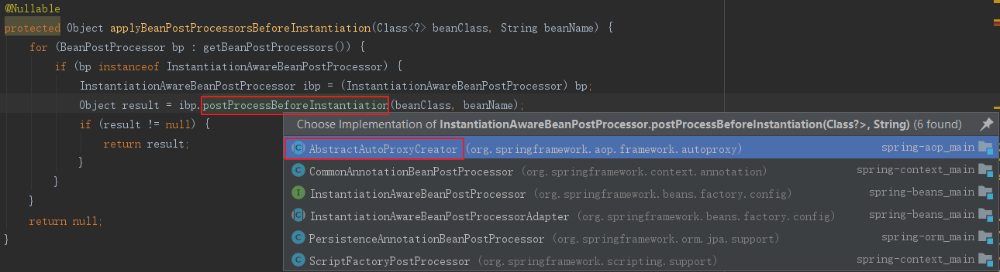
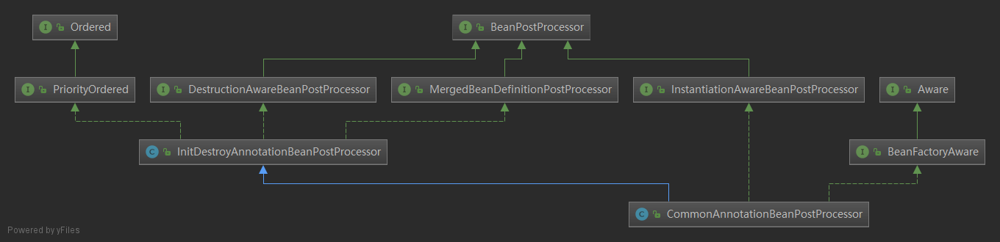

# Bean的完整生命周期

## 一、生命周期顺序

-------


bean的生命周期

1、在IOC容器中，一个spring bean是通过类的构造器(class constractor)生成的

2、使用setter方法执行依赖注入

3、一旦依赖注入完成， `BeanNameAware.setBeanName()`被调用。在创建它的bean factory中，该bean的名字被设置

4、调用`BeanClassLoaderAware.setBeanClassLoader(ClassLoader classLoader)`，`BeanClassLoaderAware`用于获取Bean的类装载器(即当前bean factory加载bean类使用的class loader)的回调类 

5、`BeanFactoryAware.setBeanFactory()` BeanFactoryAware实现此接口的bean可以获取到它们自己的Beanfactory

6、IOC容器调用`BeanPostProcessor.postProcessBeforeInitialization` 

7、调用`@PostConstruct`

8、`InitializingBean.afterPropertiesSet()` 

9、在xml文件中定义的  `init-method` 

10、`BeanPostProcessor.postProcessAfterInitialization()`

11、bean实例已经准备好使用了。使用bean执行任务。 

12、当`ApplicationContext`关闭时，比如使用`registerShutdownHook()`，然后调用带有``@PreDestroy`销毁注释的方法。 

13、调用`DisposableBean.destroy()` 

14、调用在xml中定义的 `destroy-method` 方法

15、在垃圾回收之前，`finalize()`方法被调用


**下面是英文原文**

```txt
A bean life cycle includes the following steps. 

1. Within IoC container, a spring bean is created using class constructor. 
2. Now the dependency injection is performed using setter method. 
3. Once the dependency injection is completed, `BeanNameAware.setBeanName()` is called. It sets the name of bean in the bean factory that created this bean. 
4. Now `BeanClassLoaderAware.setBeanClassLoader()` is called that supplies the bean class loader to a bean instance. 
5. Now `BeanFactoryAware.setBeanFactory()` is called that provides the owning factory to a bean instance. 
6. Now the IoC container calls `BeanPostProcessor.postProcessBeforeInitialization` on the bean. Using this method a wrapper can be applied on original bean. 
7. Now the method annotated with `@PostConstruct` is called. 
8. After `@PostConstruct`, the method `InitializingBean.afterPropertiesSet()` is called. 
9. Now the method specified by `init-method` attribute of bean in XML configuration is called. 
10. And then `BeanPostProcessor.postProcessAfterInitialization()` is called. It can also be used to apply wrapper on original bean. 
11. Now the bean instance is ready to be used. Perform the task using the bean. 
12. Now when the ApplicationContext shuts down such as by using registerShutdownHook() then the method annotated with @PreDestroy is called. 
13. After that `DisposableBean.destroy()` method is called on the bean. 
14. Now the method specified by `destroy-method` attribute of bean in XML configuration is called. 
15. Before garbage collection, `finalize()` method of Object is called

```


## 二、Bean的完整生命周期经历了各种方法调用，这些方法可以划分为以下几类

----

1、Bean自身的方法：
这个包括了Bean本身调用的方法和通过配置文件中`<bean>`的`init-method`和`destroy-method`指定的方法

2、Bean级生命周期接口方法：
这个包括了BeanNameAware、BeanFactoryAware、InitializingBean和DiposableBean这些接口的方法

3、容器级生命周期接口方法：
这个包括了InstantiationAwareBeanPostProcessor 和 BeanPostProcessor 这两个接口实现，一般称它们的实现类为“后处理器”。

4、工厂后处理器接口方法：
这个包括了AspectJWeavingEnabler, ConfigurationClassPostProcessor, CustomAutowireConfigurer等等非常有用的工厂后处理器　　
接口的方法。工厂后处理器也是容器级的。在应用上下文装配配置文件之后立即调用。


## 三、AbstractAutowireCapableBeanFactory#createBean

### 

```java
protected Object createBean(String beanName, RootBeanDefinition mbd, @Nullable Object[] args)
    throws BeanCreationException {
    //...
    try {
        // Give BeanPostProcessors a chance to return a proxy instead of the target bean instance.
        //给BeanPostProcessors一个机会，返回代理对象替代目前bean实例。
        Object bean = resolveBeforeInstantiation(beanName, mbdToUse);
        if (bean != null) {
            return bean;
        }
    }//....
    try {
        Object beanInstance = doCreateBean(beanName, mbdToUse, args);
        //....
        return beanInstance;
    }//....
}
```


### 3.1 AbstractAutowireCapableBeanFactory#resolveBeforeInstantiation

给`BeanPostProcessors`一个机会，返回代理对象替代目前bean实例。beanPostProcessor是可以临时修改bean的，它的优先级高于正常实例化bean的，如果beanPostProcessor能返回，则直接返回了。

```java
protected Object resolveBeforeInstantiation(String beanName, RootBeanDefinition mbd) {
   Object bean = null;
   if (!Boolean.FALSE.equals(mbd.beforeInstantiationResolved)) {
      // Make sure bean class is actually resolved at this point.
      if (!mbd.isSynthetic() && hasInstantiationAwareBeanPostProcessors()) {
         Class<?> targetType = determineTargetType(beanName, mbd);
         if (targetType != null) {
            bean = applyBeanPostProcessorsBeforeInstantiation(targetType, beanName);
            if (bean != null) {
               bean = applyBeanPostProcessorsAfterInitialization(bean, beanName);
            }
         }
      }
      mbd.beforeInstantiationResolved = (bean != null);
   }
   return bean;
}
```

#### 3.1.1 AbstractAutowireCapableBeanFactory#applyBeanPostProcessorsBeforeInstantiation 

调用`InstantiationAwareBeanPostProcessors.postProcessBeforeInstantiation()`

```java
protected Object applyBeanPostProcessorsBeforeInstantiation(Class<?> beanClass, String beanName) {
	for (BeanPostProcessor bp : getBeanPostProcessors()) {
		if (bp instanceof InstantiationAwareBeanPostProcessor) {
			InstantiationAwareBeanPostProcessor ibp = (InstantiationAwareBeanPostProcessor) bp;
			Object result = ibp.postProcessBeforeInstantiation(beanClass, beanName);
			if (result != null) {
				return result;
			}
		}
	}
	return null;
}
```

`AbstractAutoProxyCreator `实现了`BeanPostProcessor`接口，`BeanPostProcessor`主要作用于`Bean`实例化后，初始化前后，所有的`Bean`都被作用到。`InstantiationAwareBeanPostProcessor`虽然是`BeanPostProcessor`的子接口，但它的调用时间点发生在Bean实例化前，在真正调用`doCreateBean()`创建bean实例之前执行`postProcessBeforeInstantiation()` 



`AbstractAutoProxyCreator#postProcessBeforeInstantiation`为自定义的TargetSource 我的做代理

```java
public Object postProcessBeforeInstantiation(Class<?> beanClass, String beanName) throws BeansException {
    //1、得到一个缓存的唯一key（根据beanClass和beanName生成唯一key）
    Object cacheKey = getCacheKey(beanClass, beanName);
    //2、如果当前targetSourcedBeans（通过自定义TargetSourceCreator创建的TargetSource）不包含cacheKey 
    if (beanName == null || !this.targetSourcedBeans.containsKey(beanName)) {
        //2.1、advisedBeans（已经被增强的Bean，即AOP代理对象）中包含当前cacheKey，返回null，即走Spring默认流程  
        if (this.advisedBeans.containsKey(cacheKey)) {
            return null;
        }
        //2.2、如果是基础设施类（如Advisor、Advice、AopInfrastructureBean的实现）不进行处理  
        //2.2、shouldSkip 默认false，可以生成子类覆盖，如AspectJAwareAdvisorAutoProxyCreator覆盖（if (((AbstractAspectJAdvice) advisor.getAdvice()).getAspectName().equals(beanName)) return true;  即如果是自己就跳过）  
        if (isInfrastructureClass(beanClass) || shouldSkip(beanClass, beanName)) {
            this.advisedBeans.put(cacheKey, Boolean.FALSE);
            return null;
        }
    }

    //3、开始创建AOP代理对象  
    if (beanName != null) {
        //3.1、配置自定义的TargetSourceCreator进行TargetSource创建 
        TargetSource targetSource = getCustomTargetSource(beanClass, beanName);
        //3.2、如果targetSource不为null 添加到targetSourcedBeans缓存，并创建AOP代理对象
        if (targetSource != null) {
            this.targetSourcedBeans.put(beanName, Boolean.TRUE);
            // specificInterceptors即增强（包括前置增强、后置增强等等）  
            Object[] specificInterceptors = getAdvicesAndAdvisorsForBean(beanClass, beanName, targetSource);
            //3.3、创建代理对象  
            Object proxy = createProxy(beanClass, beanName, specificInterceptors, targetSource);
            //3.4、将代理类型放入proxyTypes从而允许后续的predictBeanType()调用获取  
            this.proxyTypes.put(cacheKey, proxy.getClass());
            return proxy;
        }
    }
    return null;
}
```

所谓的customTargetSourceCreators属性是在AbstractAutoProxyCreator中的一个TargetSourceCreator数组，用来对代理对象target的封装类TargetSource的生成进行自定义。spring内置的TargetSourceCreator有两个：LazyInitTargetSourceCreator和QuickTargetSourceCreator。

- LazyInitTargetSourceCreator：创建的代理对象并没有初始化，直到第一次调用时才进行初始化
- QuickTargetSourceCreator：根据beanName的不同前缀创建三种常用的TargetSource类型(bean必须为多例)
  1. CommonsPoolTargetSource：池化TargetSource，每次执行方法时从池中取代理对象，执行完方法再返回池中
  2. ThreadLocalTargetSource：线程级的TargetSource
  3. PrototypeTargetSource：多例TargetSource，每次执行方法创建新的代理对象，执行完销毁该对象


#### 3.1.2 BeanPostProcessor#postProcessAfterInitialization 

```java
public Object applyBeanPostProcessorsAfterInitialization(Object existingBean, String beanName)
      throws BeansException {

   Object result = existingBean;
   for (BeanPostProcessor beanProcessor : getBeanPostProcessors()) {
      Object current = beanProcessor.postProcessAfterInitialization(result, beanName);
      if (current == null) {
         return result;
      }
      result = current;
   }
   return result;
}
```


### 3.2 AbstractAutowireCapableBeanFactory#doCreateBean

实际创建指定的bean。预创建处理已经发生。此时，例如检查{@code postprocessbeforeinstances}回调。

和默认bean实例化不同，`doCreateBean`使用`factory methodand autowiring a constructor`


```java
protected Object doCreateBean(final String beanName, final RootBeanDefinition mbd, final @Nullable Object[] args)throws BeanCreationException {
   // Instantiate the bean.
   BeanWrapper instanceWrapper = null;
   if (mbd.isSingleton()) {
      instanceWrapper = this.factoryBeanInstanceCache.remove(beanName);
   }
   if (instanceWrapper == null) {
      //-----> 3.2.1 
      instanceWrapper = createBeanInstance(beanName, mbd, args);
   }
   final Object bean = instanceWrapper.getWrappedInstance();
   Class<?> beanType = instanceWrapper.getWrappedClass();
   if (beanType != NullBean.class) {
      mbd.resolvedTargetType = beanType;
   }

   // Allow post-processors to modify the merged bean definition.
   synchronized (mbd.postProcessingLock) {
      if (!mbd.postProcessed) {
         try {
            applyMergedBeanDefinitionPostProcessors(mbd, beanType, beanName);
         }//....
         mbd.postProcessed = true;
      }
   }

   // Eagerly cache singletons to be able to resolve circular references
   // even when triggered by lifecycle interfaces like BeanFactoryAware.
   boolean earlySingletonExposure = (mbd.isSingleton() && this.allowCircularReferences &&
         isSingletonCurrentlyInCreation(beanName));
   if (earlySingletonExposure) {
      //....
      addSingletonFactory(beanName, () -> getEarlyBeanReference(beanName, mbd, bean));
   }

   // Initialize the bean instance.
   Object exposedObject = bean;
   try {
      populateBean(beanName, mbd, instanceWrapper);
      //----> 3.2.2 initializeBean 
      exposedObject = initializeBean(beanName, exposedObject, mbd);
   }//....

   if (earlySingletonExposure) {
      Object earlySingletonReference = getSingleton(beanName, false);
      if (earlySingletonReference != null) {
         if (exposedObject == bean) {
            exposedObject = earlySingletonReference;
         }
         else if (!this.allowRawInjectionDespiteWrapping && hasDependentBean(beanName)) {
            String[] dependentBeans = getDependentBeans(beanName);
            Set<String> actualDependentBeans = new LinkedHashSet<>(dependentBeans.length);
            for (String dependentBean : dependentBeans) {
               if (!removeSingletonIfCreatedForTypeCheckOnly(dependentBean)) {
                  actualDependentBeans.add(dependentBean);
               }
            }//....
         }
      }
   }

   // Register bean as disposable.
   try {
      registerDisposableBeanIfNecessary(beanName, bean, mbd);
   }//...
   return exposedObject;
}
```

#### 3.2.1 AbstractAutowireCapableBeanFactory#createBeanInstance

创建指定的bean实例，采用合适的实例创建策略：factory method, constructor autowiring, or simple instantiation.

```java
/**
 * Create a new instance for the specified bean, using an appropriate instantiation strategy:
 * factory method, constructor autowiring, or simple instantiation.
 */	 
protected BeanWrapper createBeanInstance(String beanName, RootBeanDefinition mbd, @Nullable Object[] args) {
   // Make sure bean class is actually resolved at this point.
   Class<?> beanClass = resolveBeanClass(mbd, beanName);

   if (beanClass != null && !Modifier.isPublic(beanClass.getModifiers()) && !mbd.isNonPublicAccessAllowed()) {
      throw new BeanCreationException(mbd.getResourceDescription(), beanName,
            "Bean class isn't public, and non-public access not allowed: " + beanClass.getName());
   }

   Supplier<?> instanceSupplier = mbd.getInstanceSupplier();
   if (instanceSupplier != null) {
      return obtainFromSupplier(instanceSupplier, beanName);
   }

   if (mbd.getFactoryMethodName() != null)  {
      return instantiateUsingFactoryMethod(beanName, mbd, args);
   }

   // Shortcut when re-creating the same bean...
   boolean resolved = false;
   boolean autowireNecessary = false;
   if (args == null) {
      synchronized (mbd.constructorArgumentLock) {
         if (mbd.resolvedConstructorOrFactoryMethod != null) {
            resolved = true;
            autowireNecessary = mbd.constructorArgumentsResolved;
         }
      }
   }
   if (resolved) {
      if (autowireNecessary) {
         return autowireConstructor(beanName, mbd, null, null);
      }
      else {
         return instantiateBean(beanName, mbd);
      }
   }

   // Need to determine the constructor...
   Constructor<?>[] ctors = determineConstructorsFromBeanPostProcessors(beanClass, beanName);
   if (ctors != null ||
         mbd.getResolvedAutowireMode() == RootBeanDefinition.AUTOWIRE_CONSTRUCTOR ||
         mbd.hasConstructorArgumentValues() || !ObjectUtils.isEmpty(args))  {
      return autowireConstructor(beanName, mbd, ctors, args);
   }

   // No special handling: simply use no-arg constructor.
   return instantiateBean(beanName, mbd);
}
```


#### 3.2.2 AbstractAutowireCapableBeanFactory#initializeBean

调用`BeanNameAware.setBeanName()`

调用`BeanClassLoaderAware.setBeanClassLoader()`

调用`BeanFactoryAware.setBeanFactory()`

调用`BeanPostProcessor.postProcessBeforeInitialization`

调用 `InitializingBean.afterPropertiesSet()`和自定义的`init()`方法

调用 `BeanPostProcessor.postProcessAfterInitialization`

```java
protected Object initializeBean(final String beanName, final Object bean, @Nullable RootBeanDefinition mbd) {
   if (System.getSecurityManager() != null) {
      AccessController.doPrivileged((PrivilegedAction<Object>) () -> {
         invokeAwareMethods(beanName, bean);
         return null;
      }, getAccessControlContext());
   }
   else {
      // 初始化BeanNameAware、BeanClassLoaderAware、BeanFactoryAware  <---------------- 
      invokeAwareMethods(beanName, bean);
   }

   Object wrappedBean = bean;
   if (mbd == null || !mbd.isSynthetic()) {
      //调用BeanPostProcessor.postProcessBeforeInitialization 
      wrappedBean = applyBeanPostProcessorsBeforeInitialization(wrappedBean, beanName);
   }

   try {
      //调用 InitializingBean.afterPropertiesSet()和自定义的init方法
      invokeInitMethods(beanName, wrappedBean, mbd);
   }//....
   if (mbd == null || !mbd.isSynthetic()) {
      //调用 BeanPostProcessor.postProcessAfterInitialization
      wrappedBean = applyBeanPostProcessorsAfterInitialization(wrappedBean, beanName);
   }

   return wrappedBean;
}
```


##### 3.2.2.1 AbstractAutowireCapableBeanFactory#invokeAwareMethods

调用aware方法：

调用`BeanNameAware.setBeanName()`

调用`BeanClassLoaderAware.setBeanClassLoader()`

调用`BeanFactoryAware.setBeanFactory()`

```java
private void invokeAwareMethods(final String beanName, final Object bean) {
   if (bean instanceof Aware) {
      if (bean instanceof BeanNameAware) {
         ((BeanNameAware) bean).setBeanName(beanName);
      }
      if (bean instanceof BeanClassLoaderAware) {
         ClassLoader bcl = getBeanClassLoader();
         if (bcl != null) {
            ((BeanClassLoaderAware) bean).setBeanClassLoader(bcl);
         }
      }
      if (bean instanceof BeanFactoryAware) {
         ((BeanFactoryAware) bean).setBeanFactory(AbstractAutowireCapableBeanFactory.this);
      }
   }
}
```

##### 3.2.2.2 AbstractAutowireCapableBeanFactory#invokeInitMethods

给属性赋值，即查看是否bean实现了`InitializingBean`，或者定义了`intit`方法，然后调用他们。

```java
/**
  * Give a bean a chance to react now all its properties are set,
  * and a chance to know about its owning bean factory (this object).
  * This means checking whether the bean implements InitializingBean or defines
  * a custom init method, and invoking the necessary callback(s) if it does.
  */ 
protected void invokeInitMethods(String beanName, final Object bean, @Nullable RootBeanDefinition mbd) throws Throwable {

   boolean isInitializingBean = (bean instanceof InitializingBean);
   if (isInitializingBean && (mbd == null || !mbd.isExternallyManagedInitMethod("afterPropertiesSet"))) {
      //....
      if (System.getSecurityManager() != null) {
         try {
            //调用InitializingBean.afterPropertiesSet() 
            AccessController.doPrivileged((PrivilegedExceptionAction<Object>) () -> {
               ((InitializingBean) bean).afterPropertiesSet();
               return null;
            }, getAccessControlContext());
         }//...
      }
      else {
          //调用InitializingBean.afterPropertiesSet()
         ((InitializingBean) bean).afterPropertiesSet();
      }
   }

   if (mbd != null && bean.getClass() != NullBean.class) {
      String initMethodName = mbd.getInitMethodName();
      if (StringUtils.hasLength(initMethodName) &&
            !(isInitializingBean && "afterPropertiesSet".equals(initMethodName)) &&
            !mbd.isExternallyManagedInitMethod(initMethodName)) {
         //调用自定义的init方法
         invokeCustomInitMethod(beanName, bean, mbd);
      }
   }
}
```


现在已经找到了 这7个的调用顺序：

1、`BeanNameAware.setBeanName()`

2、调用`BeanClassLoaderAware.setBeanClassLoader()`

3、调用`BeanFactoryAware.setBeanFactory()`

4、`BeanPostProcessor.postProcessBeforeInitialization`

5、<------

6、`InitializingBean.afterPropertiesSet()`

7、`init()`方法

8、 `BeanPostProcessor.postProcessAfterInitialization`

那么 `@PostConstruct`是什么时候被调用的呢？


### 3.3 CommonAnnotationBeanPostProcessor(`@PostConstruct`调用时机)

`CommonAnnotationBeanPostProcessor`继承`InitDestroyAnnotationBeanPostProcessor`，`InitDestroyAnnotationBeanPostProcessor`实现了 `MergedBeanDefinitionPostProcessor` 接口，`MergedBeanDefinitionPostProcessor`继承了`BeanPostProcessor`，在调用 `BeanPostProcessor.postProcessBeforeInitialization`时，会调用`@PostConstruct`

继承关系如下图所示：



#### 3.3.1 CommonAnnotationBeanPostProcessor装入PostConstruct.class

CommonAnnotationBeanPostProcessor功能

> 它是`BeanPostProcessor`的实现类，支持通用的java注解开箱即用，尤其是在`java.annotation`包下的注解类。
>
> `CommonAnnotationBeanPostProcessor`包括支持`javax.annotation.PostConstruct`和`javax.annotation.PreDestroy`注解。
>
> `annotation-driven`的中心元素是`javax.annotation.Resource，@Resource默认按照名称方式进行bean匹配。

本文主要是找`@PostConstruct`，下面是部分实现代码：

在 PostConstruct 构造中将`PostConstruct.class`赋值给`initAnnotationType`，才便调用`BeanPostProcessor#postProcessBeforeInitialization`

```java
public class CommonAnnotationBeanPostProcessor extends InitDestroyAnnotationBeanPostProcessor
		implements InstantiationAwareBeanPostProcessor, BeanFactoryAware, Serializable {
    /**
	 * Create a new CommonAnnotationBeanPostProcessor,
	 * with the init and destroy annotation types set to
	 * {@link javax.annotation.PostConstruct} and {@link javax.annotation.PreDestroy},
	 * respectively.
	 */
	public F() {
		setOrder(Ordered.LOWEST_PRECEDENCE - 3);
		setInitAnnotationType(PostConstruct.class);
		setDestroyAnnotationType(PreDestroy.class);
		ignoreResourceType("javax.xml.ws.WebServiceContext");
	}
}
```

#### 3.3.1 InitDestroyAnnotationBeanPostProcessor#postProcessBeforeInitialization

postProcessBeforeInitialization->findLifecycleMetadata->buildLifecycleMetadata->initAnnotationType中找@PostConstruct

```java
public class InitDestroyAnnotationBeanPostProcessor
      implements DestructionAwareBeanPostProcessor, MergedBeanDefinitionPostProcessor, PriorityOrdered, Serializable {
    @Nullable
	private Class<? extends Annotation> initAnnotationType;
    
    /**
	 * Specify the init annotation to check for, indicating initialization
	 * methods to call after configuration of a bean.
	 * <p>Any custom annotation can be used, since there are no required
	 * annotation attributes. There is no default, although a typical choice
	 * is the JSR-250 {@link javax.annotation.PostConstruct} annotation.
	 */
	public void setInitAnnotationType(Class<? extends Annotation> initAnnotationType) {
		this.initAnnotationType = initAnnotationType;
	}
    
    @Override
	public Object postProcessBeforeInitialization(Object bean, String beanName) throws BeansException {
		LifecycleMetadata metadata = findLifecycleMetadata(bean.getClass());
		try {
			metadata.invokeInitMethods(bean, beanName);
		}//...
		return bean;
	}
    
    private LifecycleMetadata findLifecycleMetadata(Class<?> clazz) {
		if (this.lifecycleMetadataCache == null) {
			// Happens after deserialization, during destruction...
			return buildLifecycleMetadata(clazz);
		}// ...
    }
    
    private LifecycleMetadata buildLifecycleMetadata(final Class<?> clazz) {
		final boolean debug = logger.isDebugEnabled();
		LinkedList<LifecycleElement> initMethods = new LinkedList<>();
		LinkedList<LifecycleElement> destroyMethods = new LinkedList<>();
		Class<?> targetClass = clazz;

		do {
			final LinkedList<LifecycleElement> currInitMethods = new LinkedList<>();
			final LinkedList<LifecycleElement> currDestroyMethods = new LinkedList<>();

			ReflectionUtils.doWithLocalMethods(targetClass, method -> {
                  //在initAnnotationType中找匹配的@PostConstruct
				if (this.initAnnotationType != null && method.isAnnotationPresent(this.initAnnotationType)) {
					LifecycleElement element = new LifecycleElement(method);
					currInitMethods.add(element);
					//..
				}
				if (this.destroyAnnotationType != null && method.isAnnotationPresent(this.destroyAnnotationType)) {
					currDestroyMethods.add(new LifecycleElement(method));
				}
			});

			initMethods.addAll(0, currInitMethods);
			destroyMethods.addAll(currDestroyMethods);
			targetClass = targetClass.getSuperclass();
		}
		while (targetClass != null && targetClass != Object.class);

		return new LifecycleMetadata(clazz, initMethods, destroyMethods);
	}
}
```


## 参考：

[Spring Bean Life Cycle Tutorial](https://www.concretepage.com/spring/spring-bean-life-cycle-tutorial)

[Spring Bean Life Cycle Explained](https://howtodoinjava.com/spring-core/spring-bean-life-cycle/)


[http://uule.iteye.com/blog/2094609](http://uule.iteye.com/blog/2094609)


